<!--
CO_OP_TRANSLATOR_METADATA:
{
  "original_hash": "ed86d361ac6d4cc8bfb47428e6a2a247",
  "translation_date": "2025-04-03T07:27:27+00:00",
  "source_file": "md\\02.Application\\01.TextAndChat\\Phi3\\E2E_Phi-3-FineTuning_PromptFlow_Integration_AIFoundry.md",
  "language_code": "ur"
}
-->
# اپنی مرضی کے Phi-3 ماڈلز کو Azure AI Foundry میں Prompt flow کے ساتھ بہتر بنائیں اور ضم کریں

یہ مکمل گائیڈ "[Fine-Tune and Integrate Custom Phi-3 Models with Prompt Flow in Azure AI Foundry](https://techcommunity.microsoft.com/t5/educator-developer-blog/fine-tune-and-integrate-custom-phi-3-models-with-prompt-flow-in/ba-p/4191726?WT.mc_id=aiml-137032-kinfeylo)" پر مبنی ہے جو Microsoft Tech Community سے لیا گیا ہے۔ یہ گائیڈ آپ کو Phi-3 ماڈلز کو بہتر بنانے، ڈیپلائے کرنے اور Azure AI Foundry میں Prompt flow کے ساتھ ضم کرنے کے مراحل سے آگاہ کرتا ہے۔  
اس گائیڈ کے برعکس، "[Fine-Tune and Integrate Custom Phi-3 Models with Prompt Flow](./E2E_Phi-3-FineTuning_PromptFlow_Integration.md)"، جو لوکل کوڈ چلانے پر مرکوز تھا، یہ ٹیوٹوریل مکمل طور پر Azure AI / ML Studio میں آپ کے ماڈل کو بہتر بنانے اور ضم کرنے پر مرکوز ہے۔

## جائزہ

اس مکمل گائیڈ میں، آپ سیکھیں گے کہ کس طرح Phi-3 ماڈل کو بہتر بنائیں اور Azure AI Foundry میں Prompt flow کے ساتھ ضم کریں۔ Azure AI / ML Studio کو استعمال کرتے ہوئے، آپ کسٹم AI ماڈلز کو ڈیپلائے اور استعمال کرنے کے لیے ایک ورک فلو قائم کریں گے۔ یہ گائیڈ تین منظرناموں میں تقسیم کیا گیا ہے:

**منظرنامہ 1: Azure وسائل کی ترتیب اور بہتر بنانے کے لیے تیاری**

**منظرنامہ 2: Phi-3 ماڈل کو بہتر بنائیں اور Azure Machine Learning Studio میں ڈیپلائے کریں**

**منظرنامہ 3: Prompt flow کے ساتھ ضم کریں اور Azure AI Foundry میں اپنے کسٹم ماڈل کے ساتھ چیٹ کریں**

یہ مکمل گائیڈ کا خلاصہ ہے:

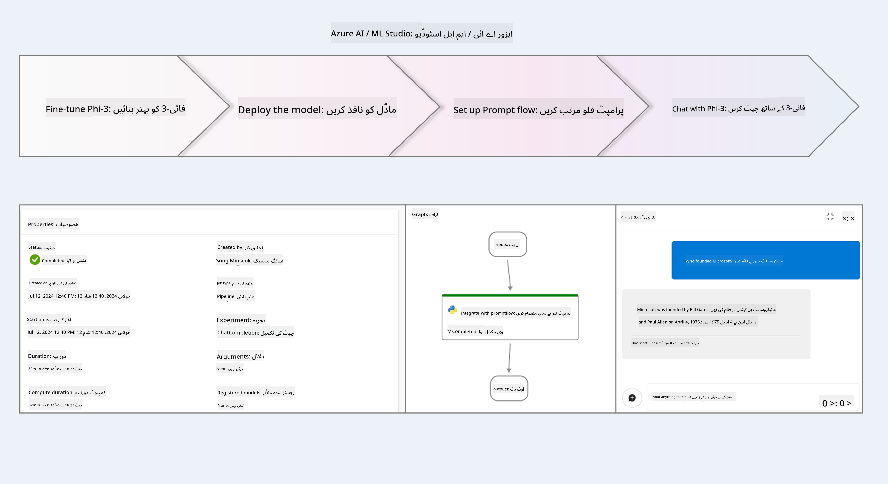

### فہرست

1. **[منظرنامہ 1: Azure وسائل کی ترتیب اور بہتر بنانے کے لیے تیاری](../../../../../../md/02.Application/01.TextAndChat/Phi3)**
    - [Azure Machine Learning Workspace بنائیں](../../../../../../md/02.Application/01.TextAndChat/Phi3)
    - [Azure Subscription میں GPU کوٹہ کی درخواست کریں](../../../../../../md/02.Application/01.TextAndChat/Phi3)
    - [رول اسائنمنٹ شامل کریں](../../../../../../md/02.Application/01.TextAndChat/Phi3)
    - [پروجیکٹ ترتیب دیں](../../../../../../md/02.Application/01.TextAndChat/Phi3)
    - [بہتر بنانے کے لیے ڈیٹا سیٹ تیار کریں](../../../../../../md/02.Application/01.TextAndChat/Phi3)

1. **[منظرنامہ 2: Phi-3 ماڈل کو بہتر بنائیں اور Azure Machine Learning Studio میں ڈیپلائے کریں](../../../../../../md/02.Application/01.TextAndChat/Phi3)**
    - [Phi-3 ماڈل کو بہتر بنائیں](../../../../../../md/02.Application/01.TextAndChat/Phi3)
    - [بہتر بنائے گئے Phi-3 ماڈل کو ڈیپلائے کریں](../../../../../../md/02.Application/01.TextAndChat/Phi3)

1. **[منظرنامہ 3: Prompt flow کے ساتھ ضم کریں اور Azure AI Foundry میں اپنے کسٹم ماڈل کے ساتھ چیٹ کریں](../../../../../../md/02.Application/01.TextAndChat/Phi3)**
    - [کسٹم Phi-3 ماڈل کو Prompt flow کے ساتھ ضم کریں](../../../../../../md/02.Application/01.TextAndChat/Phi3)
    - [اپنے کسٹم Phi-3 ماڈل کے ساتھ چیٹ کریں](../../../../../../md/02.Application/01.TextAndChat/Phi3)

## منظرنامہ 1: Azure وسائل کی ترتیب اور بہتر بنانے کے لیے تیاری

### Azure Machine Learning Workspace بنائیں

1. **پورٹل پیج** کے اوپر سرچ بار میں *azure machine learning* ٹائپ کریں اور نظر آنے والے آپشنز میں سے **Azure Machine Learning** منتخب کریں۔

    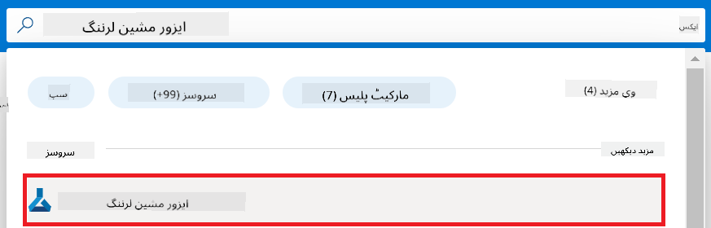

2. نیویگیشن مینو سے **+ Create** منتخب کریں۔

3. نیویگیشن مینو سے **New workspace** منتخب کریں۔

    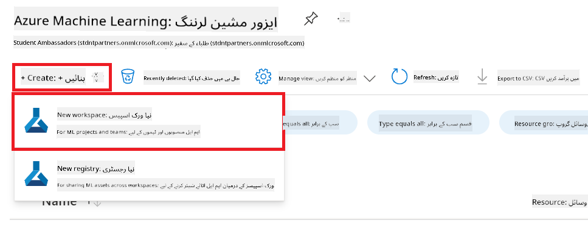

4. درج ذیل کام کریں:

    - اپنا Azure **Subscription** منتخب کریں۔
    - استعمال کرنے کے لیے **Resource group** منتخب کریں (اگر ضرورت ہو تو نیا بنائیں)۔
    - **Workspace Name** درج کریں۔ یہ ایک منفرد ویلیو ہونی چاہیے۔
    - وہ **Region** منتخب کریں جسے آپ استعمال کرنا چاہتے ہیں۔
    - استعمال کرنے کے لیے **Storage account** منتخب کریں (اگر ضرورت ہو تو نیا بنائیں)۔
    - استعمال کرنے کے لیے **Key vault** منتخب کریں (اگر ضرورت ہو تو نیا بنائیں)۔
    - استعمال کرنے کے لیے **Application insights** منتخب کریں (اگر ضرورت ہو تو نیا بنائیں)۔
    - استعمال کرنے کے لیے **Container registry** منتخب کریں (اگر ضرورت ہو تو نیا بنائیں)۔

    

5. **Review + Create** منتخب کریں۔

6. **Create** منتخب کریں۔

### Azure Subscription میں GPU کوٹہ کی درخواست کریں

اس ٹیوٹوریل میں، آپ GPU استعمال کرتے ہوئے Phi-3 ماڈل کو بہتر بنائیں اور ڈیپلائے کریں گے۔ بہتر بنانے کے لیے، آپ *Standard_NC24ads_A100_v4* GPU استعمال کریں گے، جس کے لیے کوٹہ درخواست ضروری ہے۔ ڈیپلائے کرنے کے لیے، آپ *Standard_NC6s_v3* GPU استعمال کریں گے، جس کے لیے بھی کوٹہ درخواست ضروری ہے۔

> [!NOTE]
>
> صرف Pay-As-You-Go سبسکرپشنز (معیاری سبسکرپشن قسم) GPU الاٹمنٹ کے لیے اہل ہیں؛ بینیفٹ سبسکرپشنز فی الحال سپورٹ نہیں کی جاتی ہیں۔

1. [Azure ML Studio](https://ml.azure.com/home?wt.mc_id=studentamb_279723) پر جائیں۔

1. *Standard NCADSA100v4 Family* کوٹہ کی درخواست کرنے کے لیے درج ذیل کام کریں:

    - **Quota** کو بائیں جانب ٹیب سے منتخب کریں۔
    - استعمال کرنے کے لیے **Virtual machine family** منتخب کریں۔ مثال کے طور پر، **Standard NCADSA100v4 Family Cluster Dedicated vCPUs** منتخب کریں، جس میں *Standard_NC24ads_A100_v4* GPU شامل ہے۔
    - نیویگیشن مینو سے **Request quota** منتخب کریں۔

        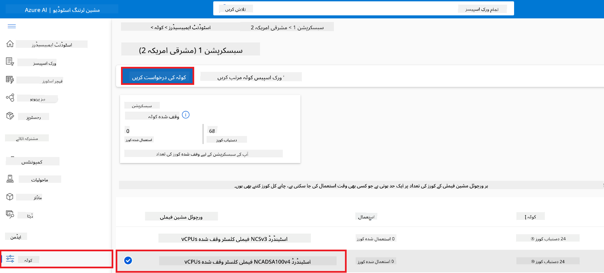

    - **Request quota** پیج کے اندر، وہ **New cores limit** درج کریں جو آپ استعمال کرنا چاہتے ہیں۔ مثال کے طور پر، 24۔
    - **Request quota** پیج کے اندر، **Submit** منتخب کریں تاکہ GPU کوٹہ کی درخواست کی جا سکے۔

1. *Standard NCSv3 Family* کوٹہ کی درخواست کرنے کے لیے درج ذیل کام کریں:

    - **Quota** کو بائیں جانب ٹیب سے منتخب کریں۔
    - استعمال کرنے کے لیے **Virtual machine family** منتخب کریں۔ مثال کے طور پر، **Standard NCSv3 Family Cluster Dedicated vCPUs** منتخب کریں، جس میں *Standard_NC6s_v3* GPU شامل ہے۔
    - نیویگیشن مینو سے **Request quota** منتخب کریں۔
    - **Request quota** پیج کے اندر، وہ **New cores limit** درج کریں جو آپ استعمال کرنا چاہتے ہیں۔ مثال کے طور پر، 24۔
    - **Request quota** پیج کے اندر، **Submit** منتخب کریں تاکہ GPU کوٹہ کی درخواست کی جا سکے۔

### رول اسائنمنٹ شامل کریں

اپنے ماڈلز کو بہتر بنانے اور ڈیپلائے کرنے کے لیے، آپ کو پہلے ایک User Assigned Managed Identity (UAI) بنانا ہوگا اور اسے مناسب اجازتیں دینا ہوں گی۔ یہ UAI ڈیپلائے کے دوران تصدیق کے لیے استعمال ہوگا۔

#### User Assigned Managed Identity(UAI) بنائیں

1. **پورٹل پیج** کے اوپر سرچ بار میں *managed identities* ٹائپ کریں اور نظر آنے والے آپشنز میں سے **Managed Identities** منتخب کریں۔

    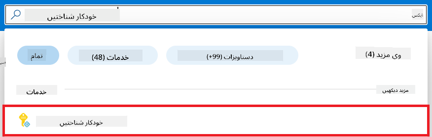

1. **+ Create** منتخب کریں۔

    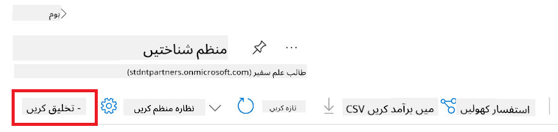

1. درج ذیل کام کریں:

    - اپنا Azure **Subscription** منتخب کریں۔
    - استعمال کرنے کے لیے **Resource group** منتخب کریں (اگر ضرورت ہو تو نیا بنائیں)۔
    - وہ **Region** منتخب کریں جسے آپ استعمال کرنا چاہتے ہیں۔
    - **Name** درج کریں۔ یہ ایک منفرد ویلیو ہونی چاہیے۔

    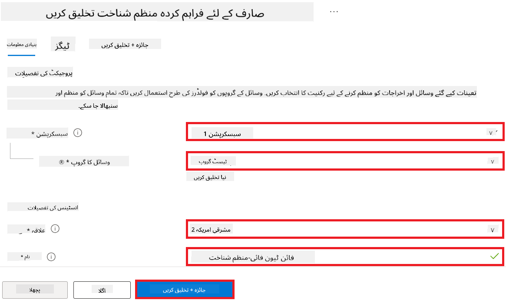

1. **Review + create** منتخب کریں۔

1. **+ Create** منتخب کریں۔

#### Managed Identity کو Contributor رول اسائنمنٹ دیں

1. اس Managed Identity ریسورس پر جائیں جو آپ نے بنایا ہے۔

1. بائیں جانب ٹیب سے **Azure role assignments** منتخب کریں۔

1. نیویگیشن مینو سے **+Add role assignment** منتخب کریں۔

1. **Add role assignment** پیج کے اندر درج ذیل کام کریں:
    - **Scope** کو **Resource group** پر سیٹ کریں۔
    - اپنا Azure **Subscription** منتخب کریں۔
    - استعمال کرنے کے لیے **Resource group** منتخب کریں۔
    - **Role** کو **Contributor** پر سیٹ کریں۔

    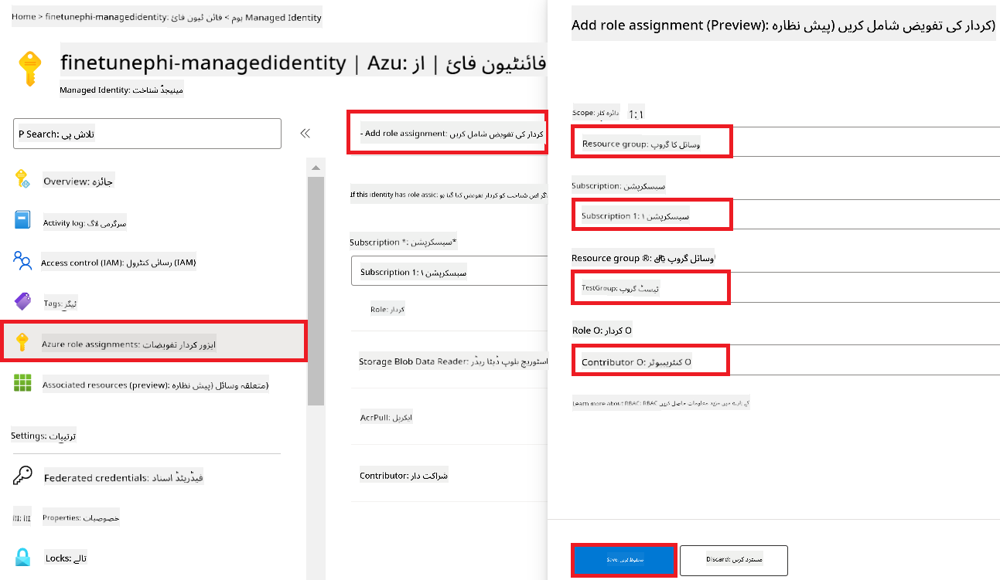

2. **Save** منتخب کریں۔

#### Managed Identity کو Storage Blob Data Reader رول اسائنمنٹ دیں

1. **پورٹل پیج** کے اوپر سرچ بار میں *storage accounts* ٹائپ کریں اور نظر آنے والے آپشنز میں سے **Storage accounts** منتخب کریں۔

    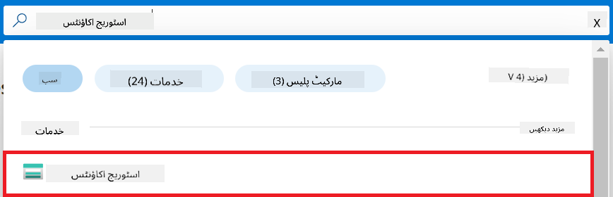

1. وہ اسٹوریج اکاؤنٹ منتخب کریں جو Azure Machine Learning workspace سے منسلک ہے۔ مثال کے طور پر، *finetunephistorage*۔

1. **Add role assignment** پیج پر جانے کے لیے درج ذیل کام کریں:

    - اس Azure Storage اکاؤنٹ پر جائیں جو آپ نے بنایا ہے۔
    - بائیں جانب ٹیب سے **Access Control (IAM)** منتخب کریں۔
    - نیویگیشن مینو سے **+ Add** منتخب کریں۔
    - نیویگیشن مینو سے **Add role assignment** منتخب کریں۔

    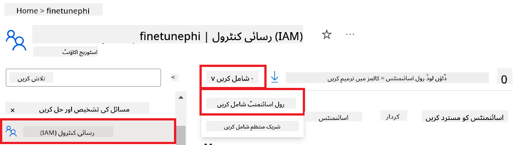

1. **Add role assignment** پیج کے اندر درج ذیل کام کریں:

    - **Role** پیج کے اندر، سرچ بار میں *Storage Blob Data Reader* ٹائپ کریں اور نظر آنے والے آپشنز میں سے **Storage Blob Data Reader** منتخب کریں۔
    - **Role** پیج کے اندر، **Next** منتخب کریں۔
    - **Members** پیج کے اندر، **Assign access to** کو **Managed identity** پر سیٹ کریں۔
    - **Members** پیج کے اندر، **+ Select members** منتخب کریں۔
    - **Select managed identities** پیج کے اندر، اپنا Azure **Subscription** منتخب کریں۔
    - **Select managed identities** پیج کے اندر، **Managed identity** کو **Manage Identity** پر سیٹ کریں۔
    - **Select managed identities** پیج کے اندر، وہ Managed Identity منتخب کریں جو آپ نے بنایا ہے۔ مثال کے طور پر، *finetunephi-managedidentity*۔
    - **Select managed identities** پیج کے اندر، **Select** منتخب کریں۔

    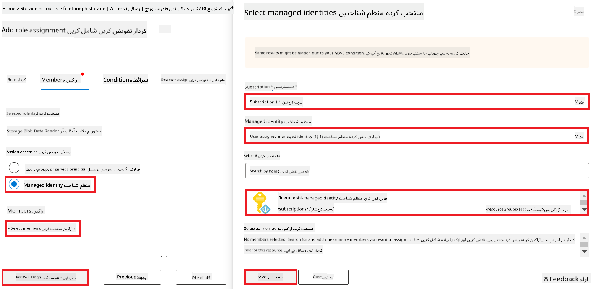

1. **Review + assign** منتخب کریں۔

#### Managed Identity کو AcrPull رول اسائنمنٹ دیں

1. **پورٹل پیج** کے اوپر سرچ بار میں *container registries* ٹائپ کریں اور نظر آنے والے آپشنز میں سے **Container registries** منتخب کریں۔

    

1. وہ کنٹینر رجسٹری منتخب کریں جو Azure Machine Learning workspace سے منسلک ہے۔ مثال کے طور پر، *finetunephicontainerregistry*۔

1. **Add role assignment** پیج پر جانے کے لیے درج ذیل کام کریں:

    - بائیں جانب ٹیب سے **Access Control (IAM)** منتخب کریں۔
    - نیویگیشن مینو سے **+ Add** منتخب کریں۔
    - نیویگیشن مینو سے **Add role assignment** منتخب کریں۔

1. **Add role assignment** پیج کے اندر درج ذیل کام کریں:

    - **Role** پیج کے اندر، سرچ بار میں *AcrPull* ٹائپ کریں اور نظر آنے والے آپشنز میں سے **AcrPull** منتخب کریں۔
    - **Role** پیج کے اندر، **Next** منتخب کریں۔
    - **Members** پیج کے اندر، **Assign access to** کو **Managed identity** پر سیٹ کریں۔
    - **Members** پیج کے اندر، **+ Select members** منتخب کریں۔
    - **Select managed identities** پیج کے اندر، اپنا Azure **Subscription** منتخب کریں۔
    - **Select managed identities** پیج کے اندر، **Managed identity** کو **Manage Identity** پر سیٹ کریں۔
    - **Select managed identities** پیج کے اندر، وہ Managed Identity منتخب کریں جو آپ نے بنایا ہے۔ مثال کے طور پر، *finetunephi-managedidentity*۔
    - **Select managed identities** پیج کے اندر، **Select** منتخب کریں۔
    - **Review + assign** منتخب کریں۔

### پروجیکٹ ترتیب دیں

ڈیٹا سیٹس کو بہتر بنانے کے لیے ڈاؤنلوڈ کرنے کے لیے، آپ ایک لوکل ماحول ترتیب دیں گے۔

اس مشق میں، آپ:

- ایک فولڈر بنائیں گے جس کے اندر کام کریں۔
- ایک ورچوئل ماحول بنائیں گے۔
- مطلوبہ پیکجز انسٹال کریں گے۔
- ایک *download_dataset.py* فائل بنائیں گے تاکہ ڈیٹا سیٹ ڈاؤنلوڈ کیا جا سکے۔

#### ایک فولڈر بنائیں جس کے اندر کام کریں

1. ایک ٹرمینل ونڈو کھولیں اور درج ذیل کمانڈ ٹائپ کریں تاکہ *finetune-phi* نامی فولڈر ڈیفالٹ پاتھ میں بنایا جا سکے۔

    ```console
    mkdir finetune-phi
    ```

2. اپنے ٹرمینل میں درج ذیل کمانڈ ٹائپ کریں تاکہ *finetune-phi* فولڈر پر جائیں جو آپ نے بنایا۔

    ```console
    cd finetune-phi
    ```

#### ایک ورچوئل ماحول بنائیں

1. اپنے ٹرمینل میں درج ذیل کمانڈ ٹائپ کریں تاکہ *.venv* نامی ورچوئل ماحول بنایا جا سکے۔

    ```console
    python -m venv .venv
    ```

2. اپنے ٹرمینل میں درج ذیل کمانڈ ٹائپ کریں تاکہ ورچوئل ماحول کو ایکٹیویٹ کیا جا سکے۔

    ```console
    .venv\Scripts\activate.bat
    ```

> [!NOTE]
> اگر یہ کام کرے، تو آپ کو کمانڈ پرامپٹ سے پہلے *(.venv)* نظر آنا چاہیے۔

#### مطلوبہ پیکجز انسٹال کریں

1. اپنے ٹرمینل میں درج ذیل کمانڈز ٹائپ کریں تاکہ مطلوبہ پیکجز انسٹال کیے جا سکیں۔

    ```console
    pip install datasets==2.19.1
    ```

#### `download_dataset.py` بنائیں

> [!NOTE]
> مکمل فولڈر اسٹرکچر:
>
> ```text
> └── YourUserName
> .    └── finetune-phi
> .        └── download_dataset.py
> ```

1. **Visual Studio Code** کھولیں۔

1. مینو بار سے **File** منتخب کریں۔

1. **Open Folder** منتخب کریں۔

1. وہ *finetune-phi* فولڈر منتخب کریں جو آپ نے بنایا، جو *C:\Users\yourUserName\finetune-phi* پر واقع ہے۔

    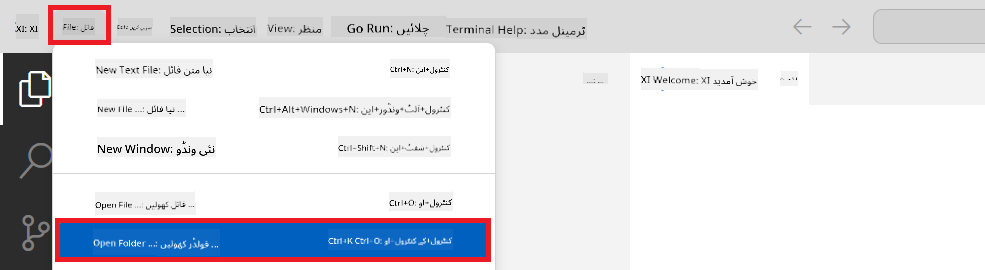

1. Visual Studio Code کے بائیں پین میں، رائٹ کلک کریں اور **New File** منتخب کریں تاکہ ایک نئی فائل *download_dataset.py* کے نام سے بنائی جا سکے۔

    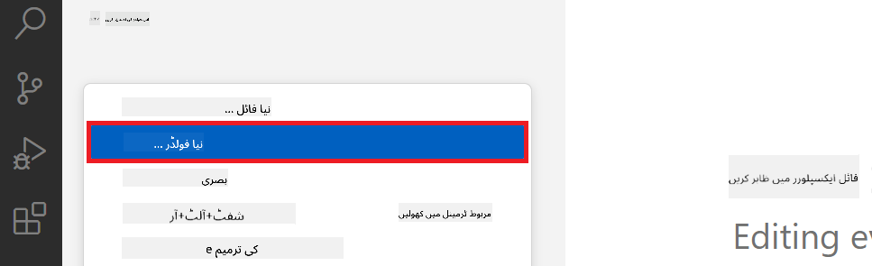

### بہتر بنانے کے لیے ڈیٹا سیٹ تیار کریں

اس مشق میں، آپ *download_dataset.py* فائل کو چلائیں گے تاکہ *ultrachat_200k* ڈیٹا سیٹس کو اپنے لوکل ماحول میں ڈاؤنلوڈ کیا جا سکے۔ آپ پھر ان ڈیٹا سیٹس کو Azure Machine Learning میں Phi-3 ماڈل کو بہتر بنانے کے لیے استعمال کریں گے۔

اس مشق میں، آپ:

- *download_dataset.py* فائل میں کوڈ شامل کریں تاکہ ڈیٹا سیٹس ڈاؤنلوڈ کیے جا سکیں۔
- *download_dataset.py* فائل کو چلائیں تاکہ ڈیٹا سیٹس کو اپنے لوکل ماحول میں ڈاؤنلوڈ کیا جا سکے۔

#### *download_dataset.py* استعمال کرتے ہوئے اپنا ڈیٹا سیٹ ڈاؤنلوڈ کریں

1. *download_dataset.py* فائل کو Visual Studio Code میں کھولیں۔

1. *download_dataset.py* فائل میں درج ذیل کوڈ شامل کریں۔

    ```python
    import json
    import os
    from datasets import load_dataset

    def load_and_split_dataset(dataset_name, config_name, split_ratio):
        """
        Load and split a dataset.
        """
        # Load the dataset with the specified name, configuration, and split ratio
        dataset = load_dataset(dataset_name, config_name, split=split_ratio)
        print(f"Original dataset size: {len(dataset)}")
        
        # Split the dataset into train and test sets (80% train, 20% test)
        split_dataset = dataset.train_test_split(test_size=0.2)
        print(f"Train dataset size: {len(split_dataset['train'])}")
        print(f"Test dataset size: {len(split_dataset['test'])}")
        
        return split_dataset

    def save_dataset_to_jsonl(dataset, filepath):
        """
        Save a dataset to a JSONL file.
        """
        # Create the directory if it does not exist
        os.makedirs(os.path.dirname(filepath), exist_ok=True)
        
        # Open the file in write mode
        with open(filepath, 'w', encoding='utf-8') as f:
            # Iterate over each record in the dataset
            for record in dataset:
                # Dump the record as a JSON object and write it to the file
                json.dump(record, f)
                # Write a newline character to separate records
                f.write('\n')
        
        print(f"Dataset saved to {filepath}")

    def main():
        """
        Main function to load, split, and save the dataset.
        """
        # Load and split the ULTRACHAT_200k dataset with a specific configuration and split ratio
        dataset = load_and_split_dataset("HuggingFaceH4/ultrachat_200k", 'default', 'train_sft[:1%]')
        
        # Extract the train and test datasets from the split
        train_dataset = dataset['train']
        test_dataset = dataset['test']

        # Save the train dataset to a JSONL file
        save_dataset_to_jsonl(train_dataset, "data/train_data.jsonl")
        
        # Save the test dataset to a separate JSONL file
        save_dataset_to_jsonl(test_dataset, "data/test_data.jsonl")

    if __name__ == "__main__":
        main()

    ```

1. اپنے ٹرمینل میں درج ذیل کمانڈ ٹائپ کریں تاکہ اسکرپٹ چلایا جا سکے اور ڈیٹا سیٹ کو اپنے لو
1. [Azure ML Studio](https://ml.azure.com/home?wt.mc_id=studentamb_279723) پر جائیں۔

1. بائیں طرف کے ٹیب سے **Compute** منتخب کریں۔

1. نیویگیشن مینو سے **Compute clusters** منتخب کریں۔

1. **+ New** پر کلک کریں۔

    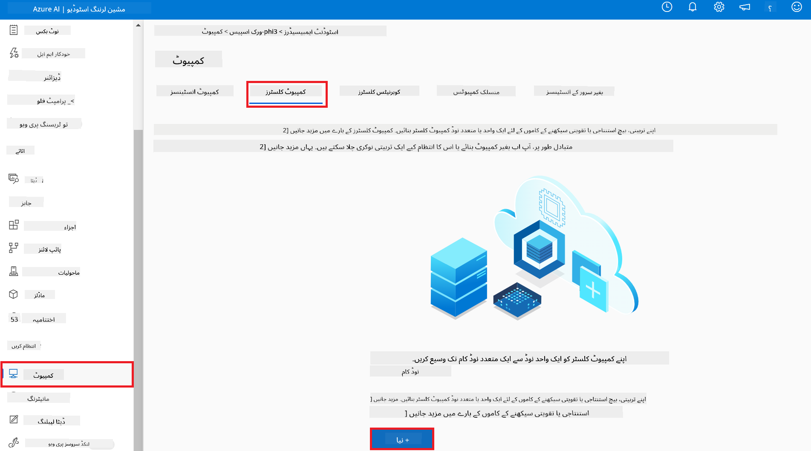

1. درج ذیل کام کریں:

    - وہ **Region** منتخب کریں جسے آپ استعمال کرنا چاہتے ہیں۔
    - **Virtual machine tier** کو **Dedicated** پر سیٹ کریں۔
    - **Virtual machine type** کو **GPU** پر سیٹ کریں۔
    - **Virtual machine size** فلٹر کو **Select from all options** پر سیٹ کریں۔
    - **Virtual machine size** کو **Standard_NC24ads_A100_v4** پر سیٹ کریں۔

    

1. **Next** منتخب کریں۔

1. درج ذیل کام کریں:

    - **Compute name** درج کریں۔ یہ ایک منفرد ویلیو ہونا چاہیے۔
    - **Minimum number of nodes** کو **0** پر سیٹ کریں۔
    - **Maximum number of nodes** کو **1** پر سیٹ کریں۔
    - **Idle seconds before scale down** کو **120** پر سیٹ کریں۔

    

1. **Create** منتخب کریں۔

#### Phi-3 ماڈل کو Fine-tune کریں

1. [Azure ML Studio](https://ml.azure.com/home?wt.mc_id=studentamb_279723) پر جائیں۔

1. وہ Azure Machine Learning workspace منتخب کریں جو آپ نے بنائی تھی۔

    

1. درج ذیل کام کریں:

    - بائیں طرف کے ٹیب سے **Model catalog** منتخب کریں۔
    - **search bar** میں *phi-3-mini-4k* لکھیں اور ظاہر ہونے والے آپشنز میں سے **Phi-3-mini-4k-instruct** منتخب کریں۔

    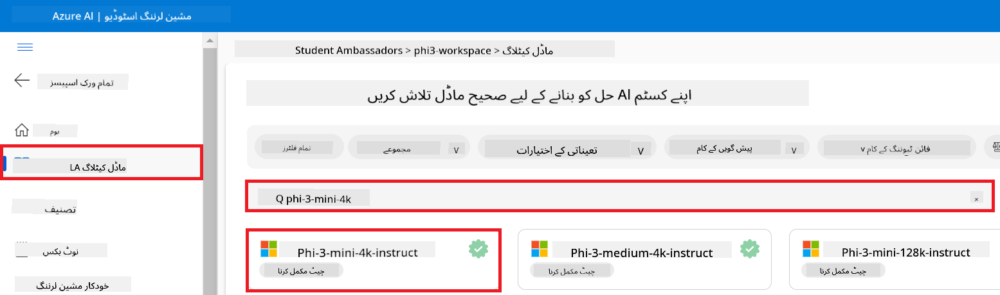

1. نیویگیشن مینو سے **Fine-tune** منتخب کریں۔

    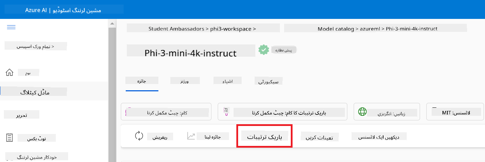

1. درج ذیل کام کریں:

    - **Select task type** کو **Chat completion** پر سیٹ کریں۔
    - **+ Select data** منتخب کریں اور **Training data** اپلوڈ کریں۔
    - Validation data اپلوڈ کے طریقے کو **Provide different validation data** پر سیٹ کریں۔
    - **+ Select data** منتخب کریں اور **Validation data** اپلوڈ کریں۔

    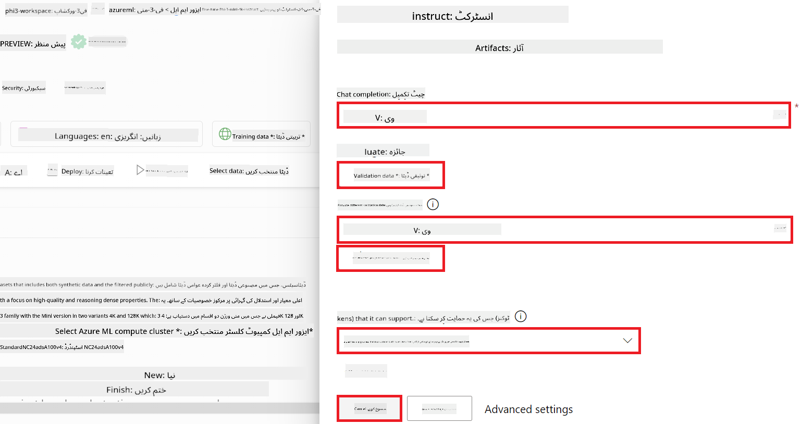

    > [!TIP]
    >
    > آپ **Advanced settings** منتخب کر سکتے ہیں تاکہ جیسے **learning_rate** اور **lr_scheduler_type** کی ترتیب کو اپنی ضروریات کے مطابق Fine-tuning کے عمل کو بہتر بنانے کے لیے اپنی مرضی کے مطابق بنایا جا سکے۔

1. **Finish** منتخب کریں۔

1. اس مشق میں، آپ نے کامیابی سے Phi-3 ماڈل کو Azure Machine Learning کے ذریعے Fine-tune کیا۔ براہ کرم نوٹ کریں کہ Fine-tuning کا عمل کافی وقت لے سکتا ہے۔ Fine-tuning جاب چلانے کے بعد، آپ کو اس کے مکمل ہونے کا انتظار کرنا ہوگا۔ آپ اپنی Azure Machine Learning Workspace کے بائیں طرف کے Jobs ٹیب پر جا کر Fine-tuning جاب کی حیثیت کی نگرانی کر سکتے ہیں۔ اگلی سیریز میں، آپ Fine-tuned ماڈل کو ڈپلائے کریں گے اور اسے Prompt flow کے ساتھ ضم کریں گے۔

    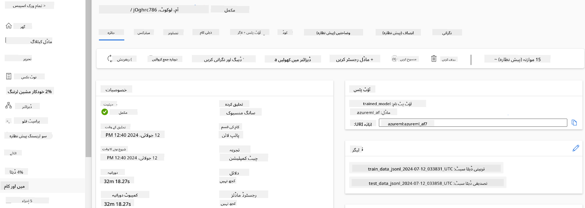

### Fine-tuned Phi-3 ماڈل کو ڈپلائے کریں

Fine-tuned Phi-3 ماڈل کو Prompt flow کے ساتھ ضم کرنے کے لیے، آپ کو ماڈل کو حقیقی وقت میں انفرنس کے لیے قابل رسائی بنانے کے لیے ڈپلائے کرنا ہوگا۔ اس عمل میں ماڈل کو رجسٹر کرنا، ایک آن لائن اینڈپوائنٹ بنانا، اور ماڈل کو ڈپلائے کرنا شامل ہے۔

اس مشق میں، آپ کریں گے:

- Fine-tuned ماڈل کو Azure Machine Learning workspace میں رجسٹر کریں۔
- ایک آن لائن اینڈپوائنٹ بنائیں۔
- رجسٹر شدہ Fine-tuned Phi-3 ماڈل کو ڈپلائے کریں۔

#### Fine-tuned ماڈل کو رجسٹر کریں

1. [Azure ML Studio](https://ml.azure.com/home?wt.mc_id=studentamb_279723) پر جائیں۔

1. وہ Azure Machine Learning workspace منتخب کریں جو آپ نے بنائی تھی۔

    

1. بائیں طرف کے ٹیب سے **Models** منتخب کریں۔
1. **+ Register** منتخب کریں۔
1. **From a job output** منتخب کریں۔

    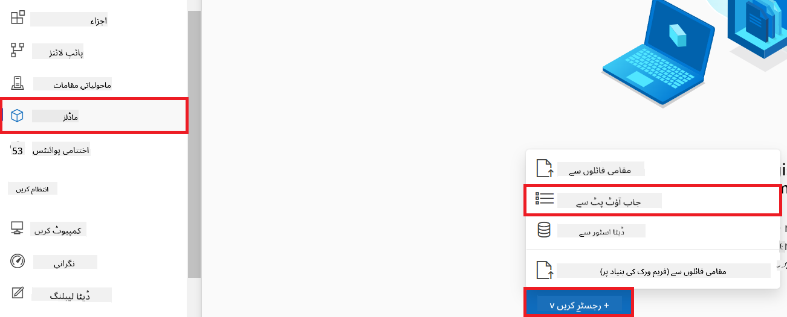

1. وہ جاب منتخب کریں جو آپ نے بنائی تھی۔

    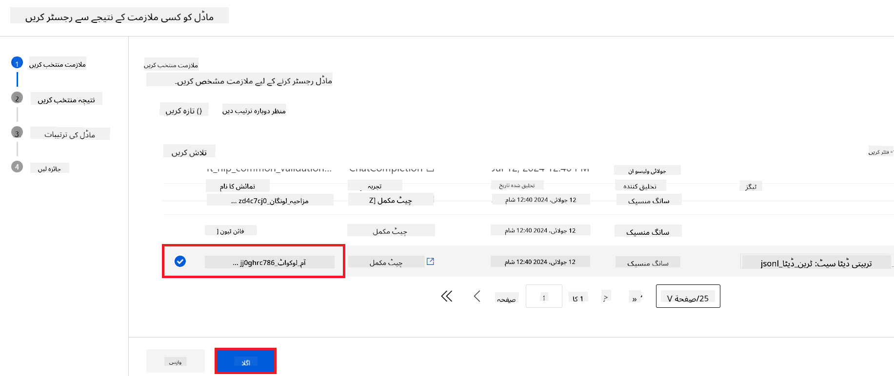

1. **Next** منتخب کریں۔

1. **Model type** کو **MLflow** پر سیٹ کریں۔

1. یقینی بنائیں کہ **Job output** منتخب ہے؛ یہ خود بخود منتخب ہونا چاہیے۔

    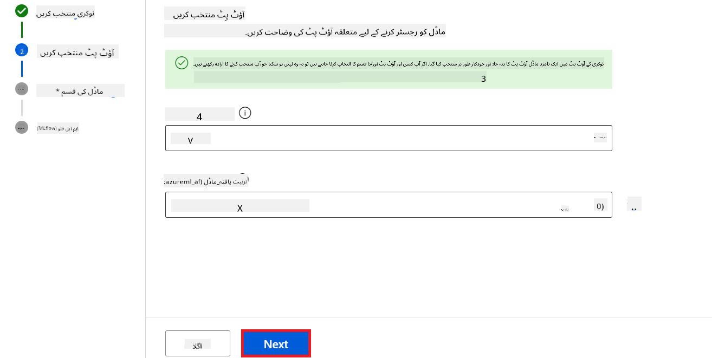

2. **Next** منتخب کریں۔

3. **Register** منتخب کریں۔

    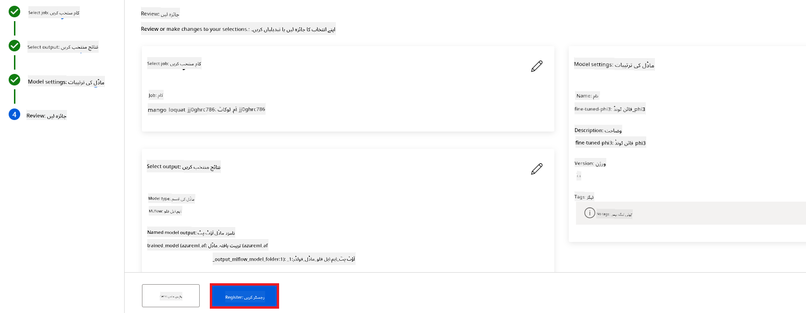

4. آپ اپنے رجسٹر شدہ ماڈل کو بائیں طرف کے ٹیب سے **Models** مینو پر جا کر دیکھ سکتے ہیں۔

    

#### Fine-tuned ماڈل کو ڈپلائے کریں

1. اس Azure Machine Learning workspace میں جائیں جو آپ نے بنائی تھی۔

1. بائیں طرف کے ٹیب سے **Endpoints** منتخب کریں۔

1. نیویگیشن مینو سے **Real-time endpoints** منتخب کریں۔

    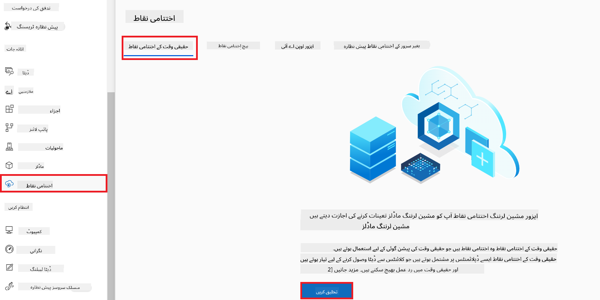

1. **Create** منتخب کریں۔

1. وہ رجسٹر شدہ ماڈل منتخب کریں جو آپ نے بنایا تھا۔

    

1. **Select** منتخب کریں۔

1. درج ذیل کام کریں:

    - **Virtual machine** کو *Standard_NC6s_v3* پر سیٹ کریں۔
    - وہ **Instance count** منتخب کریں جو آپ استعمال کرنا چاہتے ہیں۔ مثال کے طور پر، *1*۔
    - **Endpoint** کو **New** پر سیٹ کریں تاکہ ایک نیا اینڈپوائنٹ بنایا جا سکے۔
    - **Endpoint name** درج کریں۔ یہ ایک منفرد ویلیو ہونا چاہیے۔
    - **Deployment name** درج کریں۔ یہ ایک منفرد ویلیو ہونا چاہیے۔

    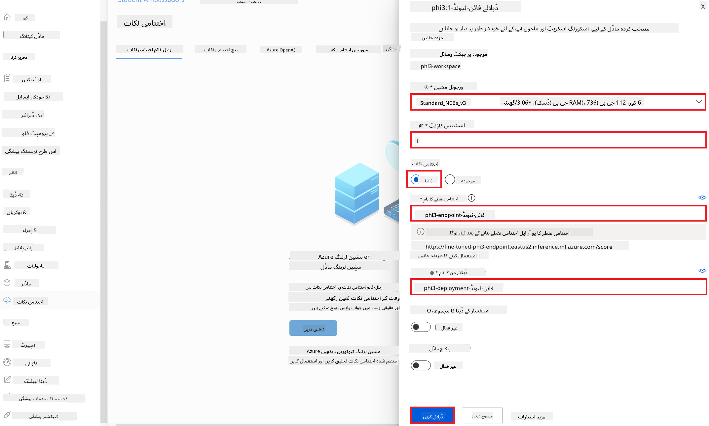

1. **Deploy** منتخب کریں۔

> [!WARNING]
> اضافی چارجز سے بچنے کے لیے، یقینی بنائیں کہ آپ Azure Machine Learning workspace میں بنائے گئے اینڈپوائنٹ کو حذف کر دیں۔
>

#### Azure Machine Learning Workspace میں ڈپلائےمنٹ کی حیثیت چیک کریں

1. اس Azure Machine Learning workspace میں جائیں جو آپ نے بنائی تھی۔

1. بائیں طرف کے ٹیب سے **Endpoints** منتخب کریں۔

1. وہ اینڈپوائنٹ منتخب کریں جو آپ نے بنایا تھا۔

    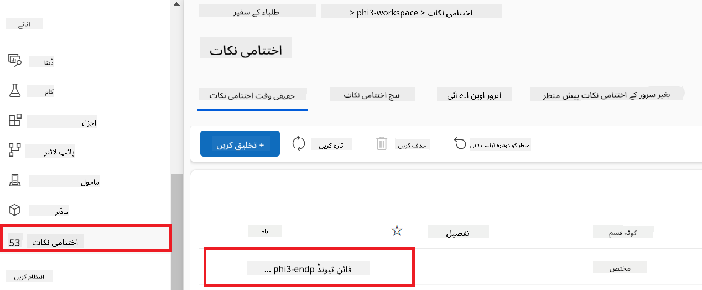

1. اس صفحے پر، آپ ڈپلائےمنٹ کے عمل کے دوران اینڈپوائنٹس کو منظم کر سکتے ہیں۔

> [!NOTE]
> ایک بار ڈپلائےمنٹ مکمل ہونے کے بعد، یقینی بنائیں کہ **Live traffic** کو **100%** پر سیٹ کیا گیا ہے۔ اگر ایسا نہیں ہے، تو **Update traffic** منتخب کریں تاکہ ٹریفک کی ترتیبات کو ایڈجسٹ کیا جا سکے۔ نوٹ کریں کہ اگر ٹریفک 0% پر سیٹ ہے تو آپ ماڈل کو ٹیسٹ نہیں کر سکتے۔
>
> 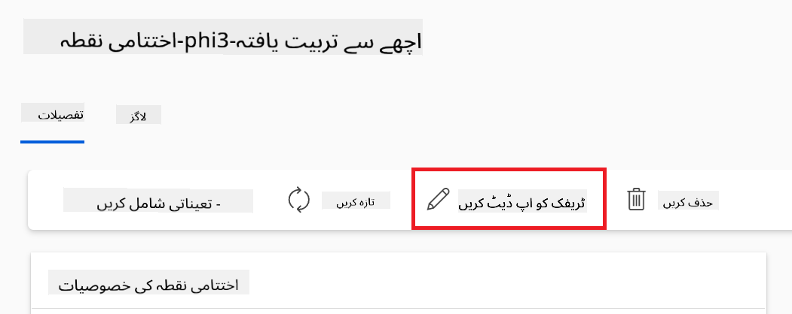
>

## منظر نامہ 3: Prompt flow کے ساتھ ضم کریں اور Azure AI Foundry میں اپنے کسٹم ماڈل کے ساتھ چیٹ کریں

### کسٹم Phi-3 ماڈل کو Prompt flow کے ساتھ ضم کریں

اپنا Fine-tuned ماڈل کامیابی سے ڈپلائے کرنے کے بعد، آپ اسے Prompt flow کے ساتھ ضم کر سکتے ہیں تاکہ حقیقی وقت کی ایپلیکیشنز میں اپنے ماڈل کو استعمال کیا جا سکے، جس سے اپنے کسٹم Phi-3 ماڈل کے ساتھ مختلف انٹرایکٹو کام انجام دینا ممکن ہو سکے۔

اس مشق میں، آپ کریں گے:

- Azure AI Foundry Hub بنائیں۔
- Azure AI Foundry Project بنائیں۔
- Prompt flow بنائیں۔
- Fine-tuned Phi-3 ماڈل کے لیے کسٹم کنکشن شامل کریں۔
- Prompt flow کو سیٹ اپ کریں تاکہ اپنے کسٹم Phi-3 ماڈل کے ساتھ چیٹ کر سکیں۔

> [!NOTE]
> آپ Azure ML Studio کے ذریعے بھی Prompt flow کے ساتھ ضم کر سکتے ہیں۔ وہی انضمام کا عمل Azure ML Studio پر بھی لاگو کیا جا سکتا ہے۔

#### Azure AI Foundry Hub بنائیں

آپ کو Project بنانے سے پہلے Hub بنانا ہوگا۔ Hub ایک Resource Group کی طرح کام کرتا ہے، جو آپ کو Azure AI Foundry میں متعدد Projects کو منظم کرنے کی اجازت دیتا ہے۔

1. [Azure AI Foundry](https://ai.azure.com/?WT.mc_id=aiml-137032-kinfeylo) پر جائیں۔

1. بائیں طرف کے ٹیب سے **All hubs** منتخب کریں۔

1. نیویگیشن مینو سے **+ New hub** منتخب کریں۔

    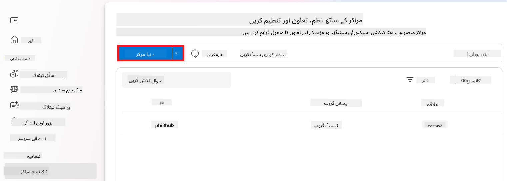

1. درج ذیل کام کریں:

    - **Hub name** درج کریں۔ یہ ایک منفرد ویلیو ہونا چاہیے۔
    - اپنا Azure **Subscription** منتخب کریں۔
    - استعمال کرنے کے لیے **Resource group** منتخب کریں (اگر ضرورت ہو تو نیا بنائیں)۔
    - وہ **Location** منتخب کریں جو آپ استعمال کرنا چاہتے ہیں۔
    - **Connect Azure AI Services** منتخب کریں (اگر ضرورت ہو تو نیا بنائیں)۔
    - **Connect Azure AI Search** کو **Skip connecting** پر سیٹ کریں۔

    

1. **Next** منتخب کریں۔

#### Azure AI Foundry Project بنائیں

1. اس Hub میں جو آپ نے بنایا تھا، بائیں طرف کے ٹیب سے **All projects** منتخب کریں۔

1. نیویگیشن مینو سے **+ New project** منتخب کریں۔

    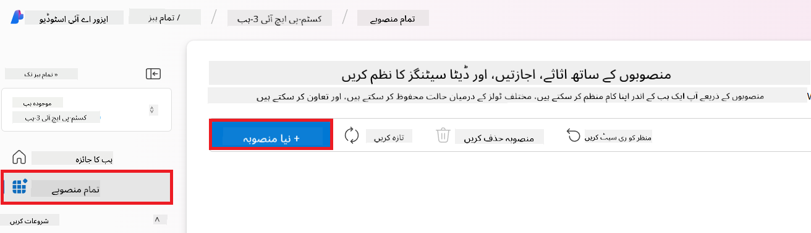

1. **Project name** درج کریں۔ یہ ایک منفرد ویلیو ہونا چاہیے۔

    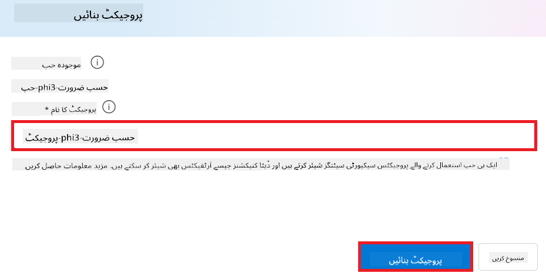

1. **Create a project** منتخب کریں۔

#### Fine-tuned Phi-3 ماڈل کے لیے کسٹم کنکشن شامل کریں

اپنے کسٹم Phi-3 ماڈل کو Prompt flow کے ساتھ ضم کرنے کے لیے، آپ کو ماڈل کے اینڈپوائنٹ اور key کو کسٹم کنکشن میں محفوظ کرنا ہوگا۔ یہ سیٹ اپ Prompt flow میں آپ کے کسٹم Phi-3 ماڈل تک رسائی کو یقینی بناتا ہے۔

#### Fine-tuned Phi-3 ماڈل کا api key اور endpoint uri سیٹ کریں

1. [Azure ML Studio](https://ml.azure.com/home?WT.mc_id=aiml-137032-kinfeylo) پر جائیں۔

1. اس Azure Machine Learning workspace میں جائیں جو آپ نے بنائی تھی۔

1. بائیں طرف کے ٹیب سے **Endpoints** منتخب کریں۔

    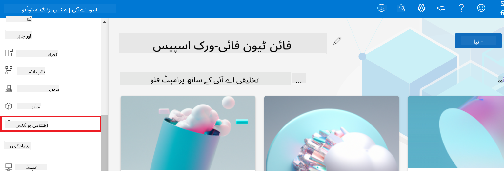

1. وہ اینڈپوائنٹ منتخب کریں جو آپ نے بنایا تھا۔

    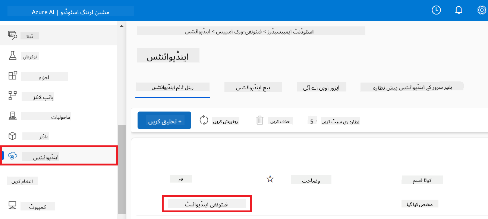

1. نیویگیشن مینو سے **Consume** منتخب کریں۔

1. اپنا **REST endpoint** اور **Primary key** کاپی کریں۔
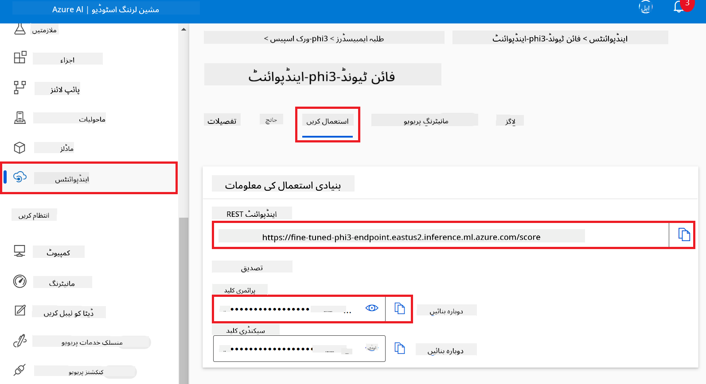

#### کسٹم کنکشن شامل کریں

1. [Azure AI Foundry](https://ai.azure.com/?WT.mc_id=aiml-137032-kinfeylo) پر جائیں۔

1. اس Azure AI Foundry پروجیکٹ پر جائیں جو آپ نے بنایا ہے۔

1. اس پروجیکٹ میں جو آپ نے بنایا ہے، بائیں طرف کے ٹیب سے **Settings** منتخب کریں۔

1. **+ New connection** منتخب کریں۔

    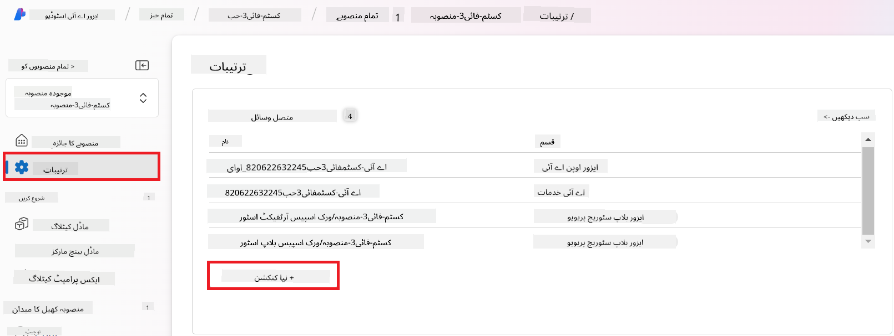

1. نیویگیشن مینو سے **Custom keys** منتخب کریں۔

    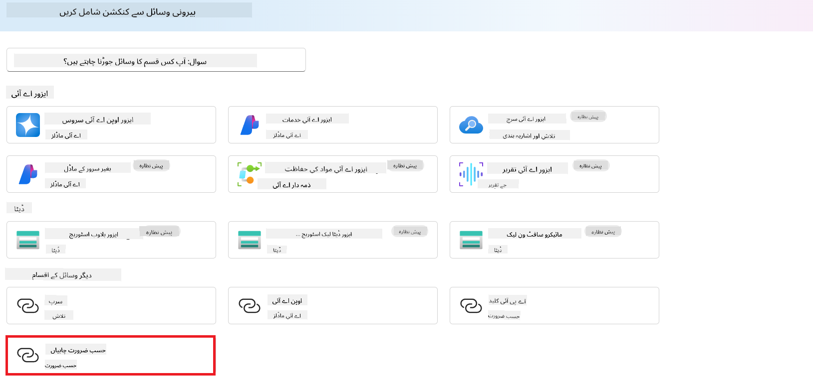

1. درج ذیل کام کریں:

    - **+ Add key value pairs** منتخب کریں۔
    - کلید کے نام کے لیے، **endpoint** درج کریں اور وہ اینڈ پوائنٹ ویلیو فیلڈ میں پیسٹ کریں جو آپ نے Azure ML Studio سے کاپی کیا تھا۔
    - دوبارہ **+ Add key value pairs** منتخب کریں۔
    - کلید کے نام کے لیے، **key** درج کریں اور وہ کلید ویلیو فیلڈ میں پیسٹ کریں جو آپ نے Azure ML Studio سے کاپی کی تھی۔
    - کلیدیں شامل کرنے کے بعد، **is secret** منتخب کریں تاکہ کلید کو ظاہر ہونے سے روکا جا سکے۔

    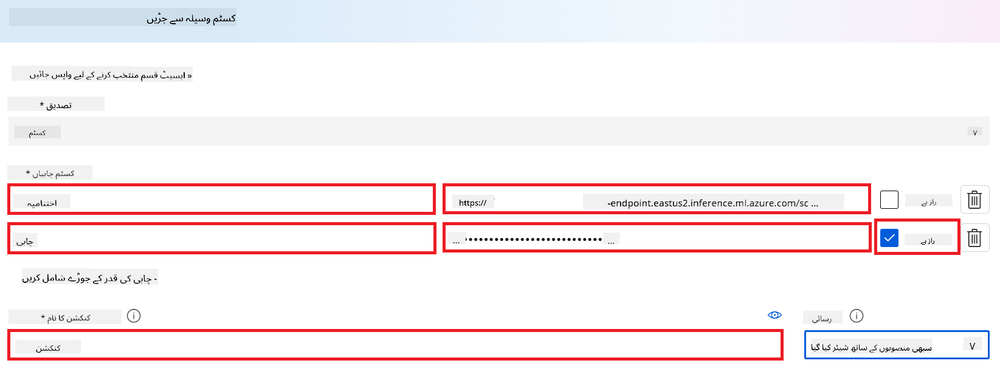

1. **Add connection** منتخب کریں۔

#### پرامپٹ فلو بنائیں

آپ نے Azure AI Foundry میں ایک کسٹم کنکشن شامل کر دیا ہے۔ اب، درج ذیل مراحل کے ذریعے پرامپٹ فلو بنائیں۔ پھر، آپ اس پرامپٹ فلو کو کسٹم کنکشن سے جوڑیں گے تاکہ آپ پرامپٹ فلو کے اندر فائن ٹونڈ ماڈل استعمال کر سکیں۔

1. اس Azure AI Foundry پروجیکٹ پر جائیں جو آپ نے بنایا ہے۔

1. بائیں طرف کے ٹیب سے **Prompt flow** منتخب کریں۔

1. نیویگیشن مینو سے **+ Create** منتخب کریں۔

    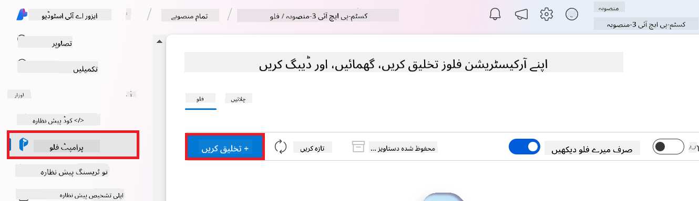

1. نیویگیشن مینو سے **Chat flow** منتخب کریں۔

    

1. **Folder name** درج کریں۔

    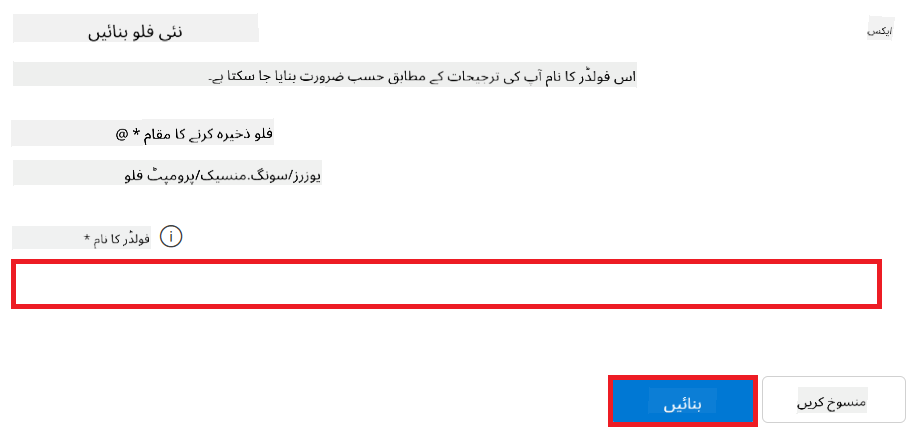

2. **Create** منتخب کریں۔

#### پرامپٹ فلو کو اپنی کسٹم Phi-3 ماڈل سے چیٹ کے لیے ترتیب دیں

آپ کو اپنی فائن ٹونڈ Phi-3 ماڈل کو پرامپٹ فلو میں شامل کرنا ہوگا۔ تاہم، دستیاب پرامپٹ فلو اس مقصد کے لیے ڈیزائن نہیں کیا گیا ہے۔ لہٰذا، آپ کو پرامپٹ فلو کو دوبارہ ڈیزائن کرنا ہوگا تاکہ کسٹم ماڈل کو شامل کیا جا سکے۔

1. پرامپٹ فلو میں، موجودہ فلو کو دوبارہ بنانے کے لیے درج ذیل کام کریں:

    - **Raw file mode** منتخب کریں۔
    - *flow.dag.yml* فائل میں موجود تمام کوڈ کو حذف کریں۔
    - درج ذیل کوڈ کو *flow.dag.yml* فائل میں شامل کریں۔

        ```yml
        inputs:
          input_data:
            type: string
            default: "Who founded Microsoft?"

        outputs:
          answer:
            type: string
            reference: ${integrate_with_promptflow.output}

        nodes:
        - name: integrate_with_promptflow
          type: python
          source:
            type: code
            path: integrate_with_promptflow.py
          inputs:
            input_data: ${inputs.input_data}
        ```

    - **Save** منتخب کریں۔

    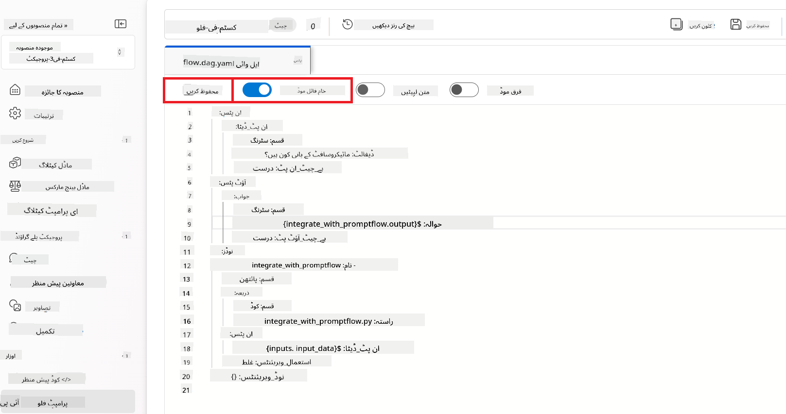

1. کسٹم Phi-3 ماڈل کو پرامپٹ فلو میں استعمال کرنے کے لیے درج ذیل کوڈ کو *integrate_with_promptflow.py* فائل میں شامل کریں۔

    ```python
    import logging
    import requests
    from promptflow import tool
    from promptflow.connections import CustomConnection

    # Logging setup
    logging.basicConfig(
        format="%(asctime)s - %(levelname)s - %(name)s - %(message)s",
        datefmt="%Y-%m-%d %H:%M:%S",
        level=logging.DEBUG
    )
    logger = logging.getLogger(__name__)

    def query_phi3_model(input_data: str, connection: CustomConnection) -> str:
        """
        Send a request to the Phi-3 model endpoint with the given input data using Custom Connection.
        """

        # "connection" is the name of the Custom Connection, "endpoint", "key" are the keys in the Custom Connection
        endpoint_url = connection.endpoint
        api_key = connection.key

        headers = {
            "Content-Type": "application/json",
            "Authorization": f"Bearer {api_key}"
        }
        data = {
            "input_data": {
                "input_string": [
                    {"role": "user", "content": input_data}
                ],
                "parameters": {
                    "temperature": 0.7,
                    "max_new_tokens": 128
                }
            }
        }
        try:
            response = requests.post(endpoint_url, json=data, headers=headers)
            response.raise_for_status()
            
            # Log the full JSON response
            logger.debug(f"Full JSON response: {response.json()}")

            result = response.json()["output"]
            logger.info("Successfully received response from Azure ML Endpoint.")
            return result
        except requests.exceptions.RequestException as e:
            logger.error(f"Error querying Azure ML Endpoint: {e}")
            raise

    @tool
    def my_python_tool(input_data: str, connection: CustomConnection) -> str:
        """
        Tool function to process input data and query the Phi-3 model.
        """
        return query_phi3_model(input_data, connection)

    ```

    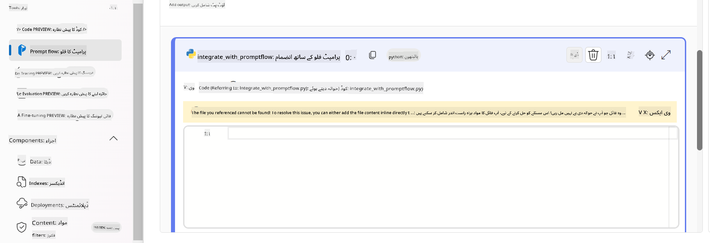

> [!NOTE]
> Azure AI Foundry میں پرامپٹ فلو استعمال کرنے کے بارے میں مزید تفصیلات کے لیے، آپ [Prompt flow in Azure AI Foundry](https://learn.microsoft.com/azure/ai-studio/how-to/prompt-flow) کو دیکھ سکتے ہیں۔

1. **Chat input**, **Chat output** منتخب کریں تاکہ ماڈل کے ساتھ چیٹ کی جا سکے۔

    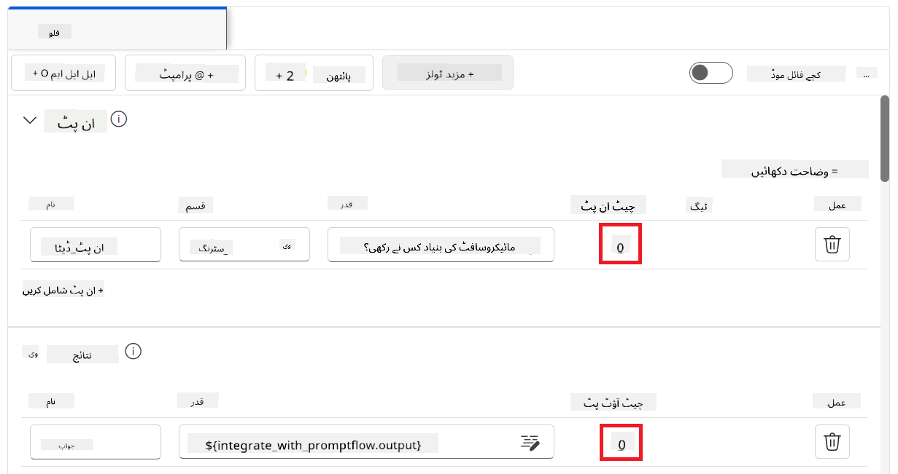

1. اب آپ اپنی کسٹم Phi-3 ماڈل کے ساتھ چیٹ کے لیے تیار ہیں۔ اگلی مشق میں، آپ سیکھیں گے کہ پرامپٹ فلو کو کیسے شروع کریں اور اپنی فائن ٹونڈ Phi-3 ماڈل کے ساتھ چیٹ کے لیے اسے کیسے استعمال کریں۔

> [!NOTE]
>
> دوبارہ بنایا گیا فلو نیچے دی گئی تصویر کی طرح دکھنا چاہیے:
>
> 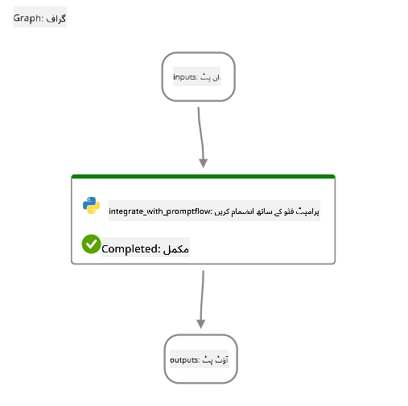
>

### اپنی کسٹم Phi-3 ماڈل کے ساتھ چیٹ کریں

اب جب کہ آپ نے اپنی کسٹم Phi-3 ماڈل کو فائن ٹون اور پرامپٹ فلو میں شامل کر دیا ہے، آپ اس کے ساتھ بات چیت شروع کرنے کے لیے تیار ہیں۔ یہ مشق آپ کو پرامپٹ فلو کے ذریعے اپنی ماڈل کے ساتھ چیٹ کرنے کا طریقہ ترتیب دینے اور شروع کرنے کے عمل سے آگاہ کرے گی۔ ان مراحل کو مکمل کرکے، آپ اپنی فائن ٹونڈ Phi-3 ماڈل کی صلاحیتوں کو مختلف کاموں اور بات چیت کے لیے مکمل طور پر استعمال کر سکیں گے۔

- پرامپٹ فلو استعمال کرتے ہوئے اپنی کسٹم Phi-3 ماڈل کے ساتھ چیٹ کریں۔

#### پرامپٹ فلو شروع کریں

1. پرامپٹ فلو شروع کرنے کے لیے **Start compute sessions** منتخب کریں۔

    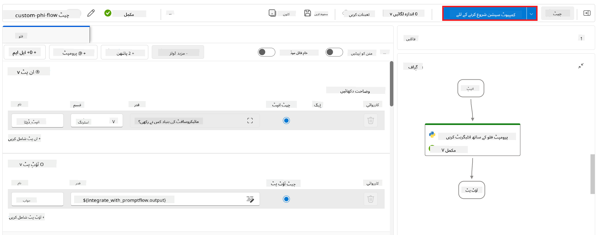

1. پیرامیٹرز کو ری نیو کرنے کے لیے **Validate and parse input** منتخب کریں۔

    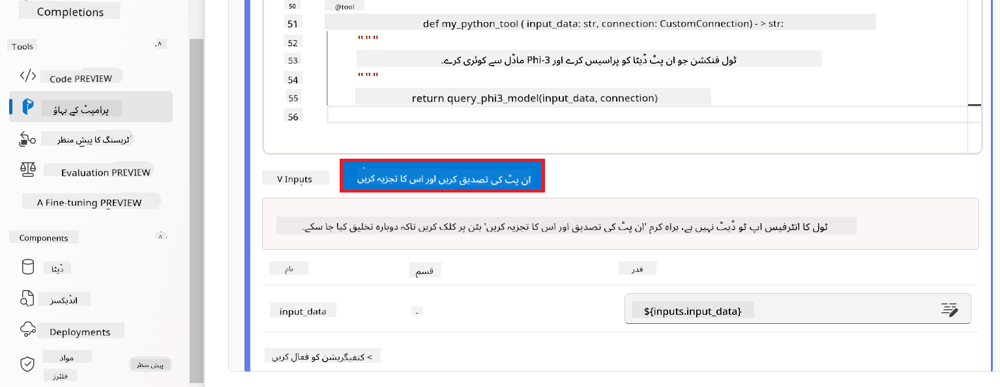

1. **connection** کے ویلیو کو اس کسٹم کنکشن کے لیے منتخب کریں جو آپ نے بنایا ہے۔ مثال کے طور پر، *connection*۔

    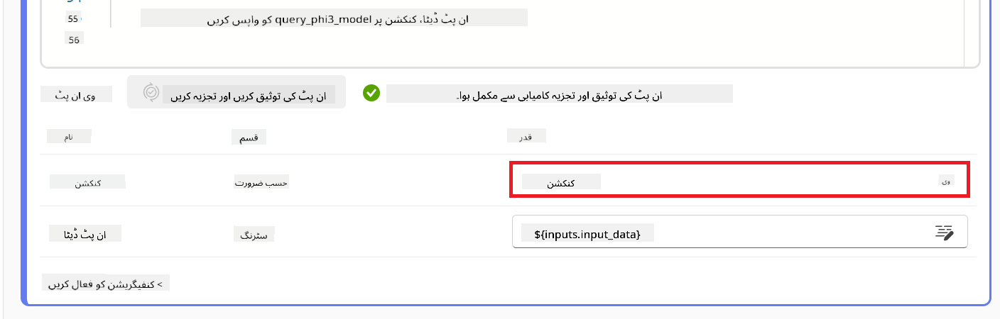

#### اپنی کسٹم ماڈل کے ساتھ چیٹ کریں

1. **Chat** منتخب کریں۔

    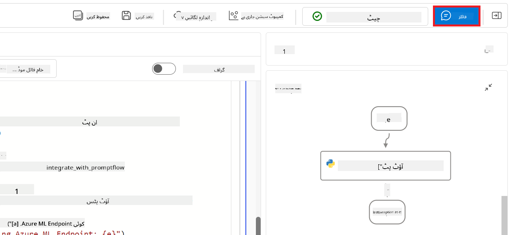

1. نتائج کی ایک مثال: اب آپ اپنی کسٹم Phi-3 ماڈل کے ساتھ چیٹ کر سکتے ہیں۔ تجویز کی جاتی ہے کہ ان سوالات کو پوچھیں جو فائن ٹوننگ کے لیے استعمال کیے گئے ڈیٹا پر مبنی ہوں۔

    

**ڈسکلوزر**:  
یہ دستاویز AI ترجمہ سروس [Co-op Translator](https://github.com/Azure/co-op-translator) کا استعمال کرتے ہوئے ترجمہ کی گئی ہے۔ ہم درستگی کے لیے کوشش کرتے ہیں، لیکن براہ کرم یہ بات ذہن میں رکھیں کہ خودکار ترجمے میں غلطیاں یا عدم درستگی ہو سکتی ہے۔ اصل دستاویز کو اس کی اصل زبان میں مستند ذریعہ سمجھا جانا چاہیے۔ اہم معلومات کے لیے، پیشہ ورانہ انسانی ترجمہ تجویز کیا جاتا ہے۔ اس ترجمے کے استعمال سے پیدا ہونے والی کسی بھی غلط فہمی یا غلط تشریح کے لیے ہم ذمہ دار نہیں ہیں۔