<!--
CO_OP_TRANSLATOR_METADATA:
{
  "original_hash": "ecbd9179a21edbaafaf114d47f09f3e3",
  "translation_date": "2025-05-07T14:14:48+00:00",
  "source_file": "md/02.Application/01.TextAndChat/Phi3/E2E_Phi-3-FineTuning_PromptFlow_Integration_AIFoundry.md",
  "language_code": "ur"
}
-->
# تنظیم دقیق اور Azure AI Foundry میں Prompt flow کے ساتھ custom Phi-3 ماڈلز کو مربوط کریں

یہ end-to-end (E2E) نمونہ Microsoft Tech Community کے رہنما "[Fine-Tune and Integrate Custom Phi-3 Models with Prompt Flow in Azure AI Foundry](https://techcommunity.microsoft.com/t5/educator-developer-blog/fine-tune-and-integrate-custom-phi-3-models-with-prompt-flow-in/ba-p/4191726?WT.mc_id=aiml-137032-kinfeylo)" پر مبنی ہے۔ یہ Azure AI Foundry میں Prompt flow کے ساتھ custom Phi-3 ماڈلز کی fine-tuning، تعیناتی، اور انضمام کے عمل کو متعارف کراتا ہے۔
E2E نمونے "[Fine-Tune and Integrate Custom Phi-3 Models with Prompt Flow](./E2E_Phi-3-FineTuning_PromptFlow_Integration.md)" کے برعکس، جو لوکل کوڈ چلانے پر مشتمل تھا، یہ ٹیوٹوریل مکمل طور پر Azure AI / ML Studio کے اندر آپ کے ماڈل کی fine-tuning اور انضمام پر مرکوز ہے۔

## جائزہ

اس E2E نمونے میں، آپ سیکھیں گے کہ Phi-3 ماڈل کو کیسے fine-tune کیا جائے اور اسے Azure AI Foundry میں Prompt flow کے ساتھ مربوط کیا جائے۔ Azure AI / ML Studio کا استعمال کرتے ہوئے، آپ custom AI ماڈلز کی تعیناتی اور استعمال کے لیے ورک فلو قائم کریں گے۔ یہ E2E نمونہ تین منظرناموں میں تقسیم ہے:

**منظرنامہ 1: Azure وسائل کا سیٹ اپ اور fine-tuning کی تیاری**

**منظرنامہ 2: Phi-3 ماڈل کی fine-tuning اور Azure Machine Learning Studio میں تعیناتی**

**منظرنامہ 3: Prompt flow کے ساتھ انضمام اور Azure AI Foundry میں اپنے custom ماڈل کے ساتھ چیٹ**

یہاں اس E2E نمونے کا جائزہ پیش ہے۔


### فہرست مضامین

1. **[منظرنامہ 1: Azure وسائل کا سیٹ اپ اور fine-tuning کی تیاری](../../../../../../md/02.Application/01.TextAndChat/Phi3)**
    - [Azure Machine Learning ورک اسپیس بنائیں](../../../../../../md/02.Application/01.TextAndChat/Phi3)
    - [Azure سبسکرپشن میں GPU کوٹہ کی درخواست کریں](../../../../../../md/02.Application/01.TextAndChat/Phi3)
    - [رول اسائنمنٹ شامل کریں](../../../../../../md/02.Application/01.TextAndChat/Phi3)
    - [پروجیکٹ سیٹ اپ کریں](../../../../../../md/02.Application/01.TextAndChat/Phi3)
    - [fine-tuning کے لیے ڈیٹا سیٹ تیار کریں](../../../../../../md/02.Application/01.TextAndChat/Phi3)

1. **[منظرنامہ 2: Phi-3 ماڈل کی fine-tuning اور Azure Machine Learning Studio میں تعیناتی](../../../../../../md/02.Application/01.TextAndChat/Phi3)**
    - [Phi-3 ماڈل کو fine-tune کریں](../../../../../../md/02.Application/01.TextAndChat/Phi3)
    - [fine-tuned Phi-3 ماڈل کو تعینات کریں](../../../../../../md/02.Application/01.TextAndChat/Phi3)

1. **[منظرنامہ 3: Prompt flow کے ساتھ انضمام اور Azure AI Foundry میں اپنے custom ماڈل کے ساتھ چیٹ](../../../../../../md/02.Application/01.TextAndChat/Phi3)**
    - [custom Phi-3 ماڈل کو Prompt flow کے ساتھ مربوط کریں](../../../../../../md/02.Application/01.TextAndChat/Phi3)
    - [اپنے custom Phi-3 ماڈل کے ساتھ چیٹ کریں](../../../../../../md/02.Application/01.TextAndChat/Phi3)

## منظرنامہ 1: Azure وسائل کا سیٹ اپ اور fine-tuning کی تیاری

### Azure Machine Learning ورک اسپیس بنائیں

1. پورٹل صفحے کے اوپر **search bar** میں *azure machine learning* ٹائپ کریں اور ظاہر ہونے والے آپشنز میں سے **Azure Machine Learning** منتخب کریں۔

    

2. نیویگیشن مینو سے **+ Create** منتخب کریں۔

3. نیویگیشن مینو سے **New workspace** منتخب کریں۔

    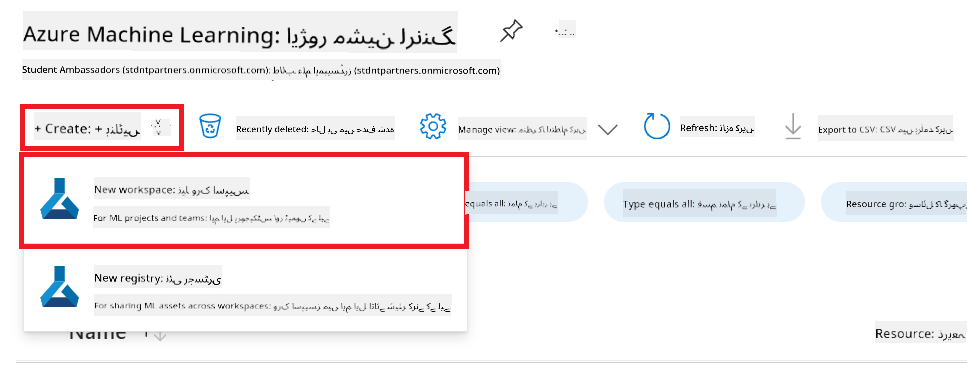

4. درج ذیل کام انجام دیں:

    - اپنی Azure **Subscription** منتخب کریں۔
    - استعمال کے لیے **Resource group** منتخب کریں (اگر ضرورت ہو تو نیا بنائیں)۔
    - **Workspace Name** درج کریں۔ یہ منفرد ہونا چاہیے۔
    - وہ **Region** منتخب کریں جہاں آپ کام کرنا چاہتے ہیں۔
    - استعمال کے لیے **Storage account** منتخب کریں (اگر ضرورت ہو تو نیا بنائیں)۔
    - استعمال کے لیے **Key vault** منتخب کریں (اگر ضرورت ہو تو نیا بنائیں)۔
    - استعمال کے لیے **Application insights** منتخب کریں (اگر ضرورت ہو تو نیا بنائیں)۔
    - استعمال کے لیے **Container registry** منتخب کریں (اگر ضرورت ہو تو نیا بنائیں)۔

    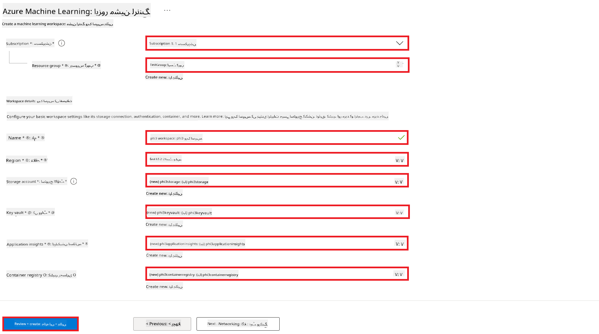

5. **Review + Create** منتخب کریں۔

6. **Create** منتخب کریں۔

### Azure سبسکرپشن میں GPU کوٹہ کی درخواست کریں

اس ٹیوٹوریل میں، آپ GPUs کا استعمال کرتے ہوئے Phi-3 ماڈل کی fine-tuning اور تعیناتی سیکھیں گے۔ fine-tuning کے لیے، آپ *Standard_NC24ads_A100_v4* GPU استعمال کریں گے، جس کے لیے کوٹہ کی درخواست ضروری ہے۔ تعیناتی کے لیے، آپ *Standard_NC6s_v3* GPU استعمال کریں گے، جس کے لیے بھی کوٹہ کی درخواست درکار ہے۔

> [!NOTE]
>
> صرف Pay-As-You-Go سبسکرپشنز (معیاری سبسکرپشن قسم) GPU الاٹمنٹ کے اہل ہیں؛ benefit سبسکرپشنز فی الحال سپورٹ نہیں کی جاتیں۔
>

1. [Azure ML Studio](https://ml.azure.com/home?wt.mc_id=studentamb_279723) پر جائیں۔

1. *Standard NCADSA100v4 Family* کوٹہ کی درخواست کے لیے درج ذیل کریں:

    - بائیں جانب کے ٹیب سے **Quota** منتخب کریں۔
    - استعمال کے لیے **Virtual machine family** منتخب کریں۔ مثال کے طور پر، **Standard NCADSA100v4 Family Cluster Dedicated vCPUs** منتخب کریں، جس میں *Standard_NC24ads_A100_v4* GPU شامل ہے۔
    - نیویگیشن مینو سے **Request quota** منتخب کریں۔

        

    - Request quota صفحے میں، وہ **New cores limit** درج کریں جو آپ استعمال کرنا چاہتے ہیں۔ مثال کے طور پر، 24۔
    - Request quota صفحے میں، GPU کوٹہ کی درخواست کے لیے **Submit** منتخب کریں۔

1. *Standard NCSv3 Family* کوٹہ کی درخواست کے لیے درج ذیل کریں:

    - بائیں جانب کے ٹیب سے **Quota** منتخب کریں۔
    - استعمال کے لیے **Virtual machine family** منتخب کریں۔ مثال کے طور پر، **Standard NCSv3 Family Cluster Dedicated vCPUs** منتخب کریں، جس میں *Standard_NC6s_v3* GPU شامل ہے۔
    - نیویگیشن مینو سے **Request quota** منتخب کریں۔
    - Request quota صفحے میں، وہ **New cores limit** درج کریں جو آپ استعمال کرنا چاہتے ہیں۔ مثال کے طور پر، 24۔
    - Request quota صفحے میں، GPU کوٹہ کی درخواست کے لیے **Submit** منتخب کریں۔

### رول اسائنمنٹ شامل کریں

ماڈلز کی fine-tuning اور تعیناتی کے لیے، آپ کو پہلے ایک User Assigned Managed Identity (UAI) بنانا ہوگی اور اسے مناسب اجازتیں دینی ہوں گی۔ یہ UAI تعیناتی کے دوران تصدیق کے لیے استعمال ہوگی۔

#### User Assigned Managed Identity (UAI) بنائیں

1. پورٹل صفحے کے اوپر **search bar** میں *managed identities* ٹائپ کریں اور ظاہر ہونے والے آپشنز میں سے **Managed Identities** منتخب کریں۔

    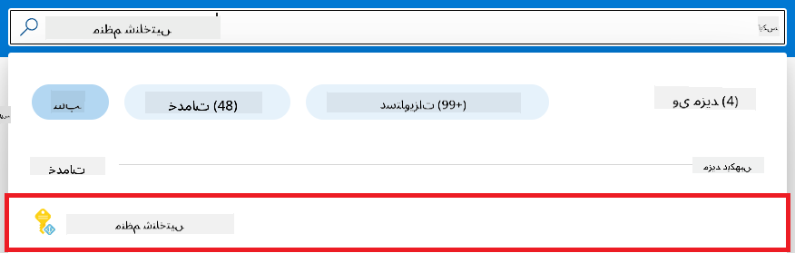

1. **+ Create** منتخب کریں۔

    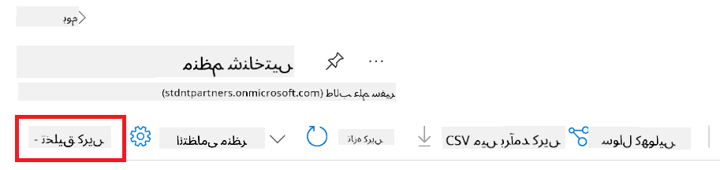

1. درج ذیل کام انجام دیں:

    - اپنی Azure **Subscription** منتخب کریں۔
    - استعمال کے لیے **Resource group** منتخب کریں (اگر ضرورت ہو تو نیا بنائیں)۔
    - وہ **Region** منتخب کریں جہاں آپ کام کرنا چاہتے ہیں۔
    - **Name** درج کریں۔ یہ منفرد ہونا چاہیے۔

    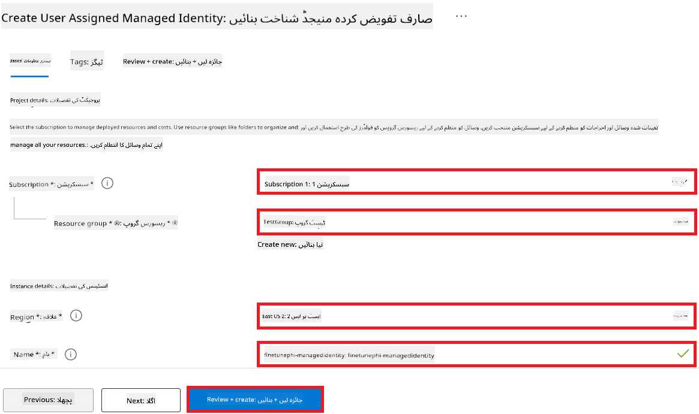

1. **Review + create** منتخب کریں۔

1. **+ Create** منتخب کریں۔

#### Managed Identity کو Contributor رول اسائنمنٹ دیں

1. اس Managed Identity resource پر جائیں جو آپ نے بنایا ہے۔

1. بائیں جانب کے ٹیب سے **Azure role assignments** منتخب کریں۔

1. نیویگیشن مینو سے **+Add role assignment** منتخب کریں۔

1. Add role assignment صفحے میں درج ذیل کریں:
    - **Scope** کو **Resource group** منتخب کریں۔
    - اپنی Azure **Subscription** منتخب کریں۔
    - استعمال کے لیے **Resource group** منتخب کریں۔
    - **Role** کو **Contributor** منتخب کریں۔

    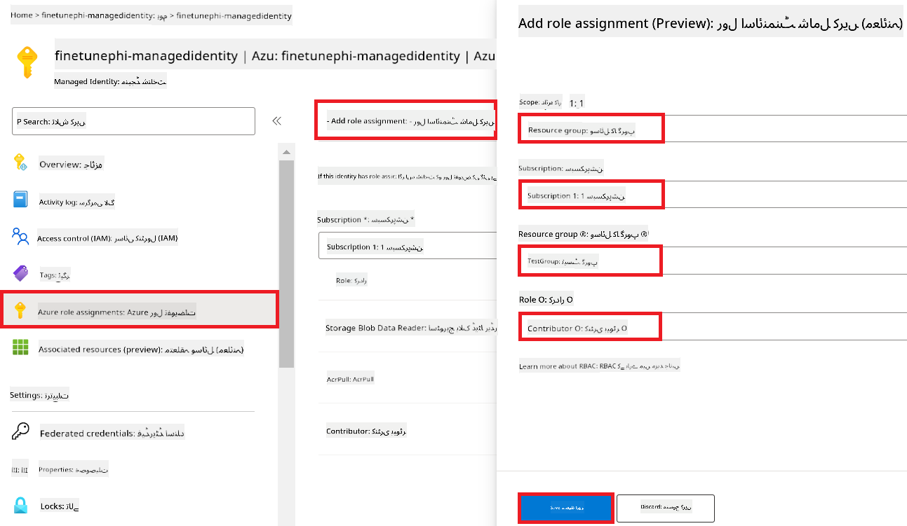

2. **Save** منتخب کریں۔

#### Managed Identity کو Storage Blob Data Reader رول اسائنمنٹ دیں

1. پورٹل صفحے کے اوپر **search bar** میں *storage accounts* ٹائپ کریں اور ظاہر ہونے والے آپشنز میں سے **Storage accounts** منتخب کریں۔

    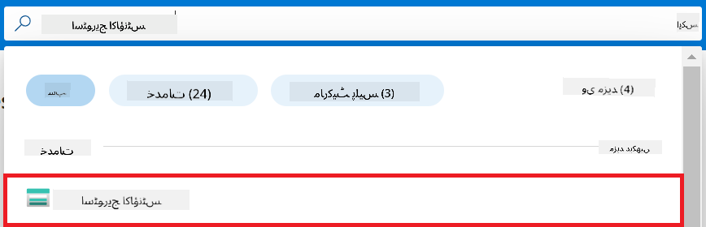

1. اس storage account کو منتخب کریں جو آپ نے Azure Machine Learning ورک اسپیس کے ساتھ منسلک کیا ہے۔ مثال کے طور پر، *finetunephistorage*۔

1. Add role assignment صفحے پر جانے کے لیے درج ذیل کریں:

    - Azure Storage account پر جائیں جو آپ نے بنایا ہے۔
    - بائیں جانب کے ٹیب سے **Access Control (IAM)** منتخب کریں۔
    - نیویگیشن مینو سے **+ Add** منتخب کریں۔
    - نیویگیشن مینو سے **Add role assignment** منتخب کریں۔

    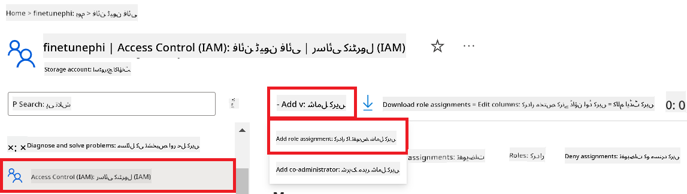

1. Add role assignment صفحے میں درج ذیل کریں:

    - Role صفحے میں، **search bar** میں *Storage Blob Data Reader* ٹائپ کریں اور ظاہر ہونے والے آپشنز میں سے **Storage Blob Data Reader** منتخب کریں۔
    - Role صفحے میں، **Next** منتخب کریں۔
    - Members صفحے میں، **Assign access to** کے تحت **Managed identity** منتخب کریں۔
    - Members صفحے میں، **+ Select members** منتخب کریں۔
    - Select managed identities صفحے میں، اپنی Azure **Subscription** منتخب کریں۔
    - Select managed identities صفحے میں، **Managed identity** کو **Manage Identity** منتخب کریں۔
    - Select managed identities صفحے میں، وہ Manage Identity منتخب کریں جو آپ نے بنایا ہے۔ مثال کے طور پر، *finetunephi-managedidentity*۔
    - Select managed identities صفحے میں، **Select** منتخب کریں۔

    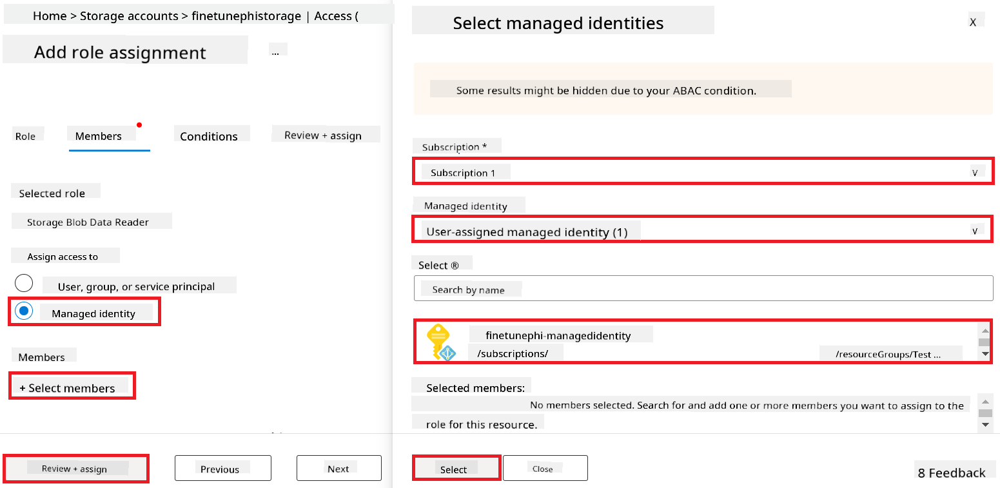

1. **Review + assign** منتخب کریں۔

#### Managed Identity کو AcrPull رول اسائنمنٹ دیں

1. پورٹل صفحے کے اوپر **search bar** میں *container registries* ٹائپ کریں اور ظاہر ہونے والے آپشنز میں سے **Container registries** منتخب کریں۔

    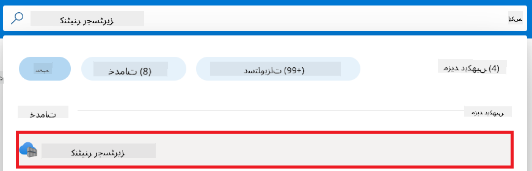

1. اس container registry کو منتخب کریں جو Azure Machine Learning ورک اسپیس کے ساتھ منسلک ہے۔ مثال کے طور پر، *finetunephicontainerregistry*

1. Add role assignment صفحے پر جانے کے لیے درج ذیل کریں:

    - بائیں جانب کے ٹیب سے **Access Control (IAM)** منتخب کریں۔
    - نیویگیشن مینو سے **+ Add** منتخب کریں۔
    - نیویگیشن مینو سے **Add role assignment** منتخب کریں۔

1. Add role assignment صفحے میں درج ذیل کریں:

    - Role صفحے میں، **search bar** میں *AcrPull* ٹائپ کریں اور ظاہر ہونے والے آپشنز میں سے **AcrPull** منتخب کریں۔
    - Role صفحے میں، **Next** منتخب کریں۔
    - Members صفحے میں، **Assign access to** کے تحت **Managed identity** منتخب کریں۔
    - Members صفحے میں، **+ Select members** منتخب کریں۔
    - Select managed identities صفحے میں، اپنی Azure **Subscription** منتخب کریں۔
    - Select managed identities صفحے میں، **Managed identity** کو **Manage Identity** منتخب کریں۔
    - Select managed identities صفحے میں، وہ Manage Identity منتخب کریں جو آپ نے بنایا ہے۔ مثال کے طور پر، *finetunephi-managedidentity*۔
    - Select managed identities صفحے میں، **Select** منتخب کریں۔
    - **Review + assign** منتخب کریں۔

### پروجیکٹ سیٹ اپ کریں

fine-tuning کے لیے درکار datasets ڈاؤن لوڈ کرنے کے لیے، آپ ایک لوکل ماحول قائم کریں گے۔

اس مشق میں، آپ کریں گے:

- ایک فولڈر بنائیں گے جہاں آپ کام کریں گے۔
- ایک virtual environment بنائیں گے۔
- مطلوبہ پیکجز انسٹال کریں گے۔
- ایک *download_dataset.py* فائل بنائیں گے تاکہ dataset ڈاؤن لوڈ کیا جا سکے۔

#### کام کرنے کے لیے فولڈر بنائیں

1. ٹرمینل ونڈو کھولیں اور درج ذیل کمانڈ ٹائپ کریں تاکہ ڈیفالٹ راستے میں *finetune-phi* نامی فولڈر بنے۔

    ```console
    mkdir finetune-phi
    ```

2. ٹرمینل میں درج ذیل کمانڈ ٹائپ کریں تاکہ آپ اس نئے *finetune-phi* فولڈر میں جائیں۔

    ```console
    cd finetune-phi
    ```

#### virtual environment بنائیں

1. ٹرمینل میں درج ذیل کمانڈ ٹائپ کریں تاکہ *.venv* نامی virtual environment بنایا جائے۔

    ```console
    python -m venv .venv
    ```

2. ٹرمینل میں درج ذیل کمانڈ ٹائپ کریں تاکہ virtual environment کو فعال کریں۔

    ```console
    .venv\Scripts\activate.bat
    ```

> [!NOTE]
> اگر کامیاب ہوا، تو کمانڈ پرامپٹ سے پہلے *(.venv)* نظر آئے گا۔

#### مطلوبہ پیکجز انسٹال کریں

1. ٹرمینل میں درج ذیل کمانڈز ٹائپ کریں تاکہ مطلوبہ پیکجز انسٹال ہوں۔

    ```console
    pip install datasets==2.19.1
    ```

#### `download_dataset.py` بنائیں

> [!NOTE]
> مکمل فولڈر اسٹرکچر:
>
> ```text
> └── YourUserName
> .    └── finetune-phi
> .        └── download_dataset.py
> ```

1. **Visual Studio Code** کھولیں۔

1. مینو بار سے **File** منتخب کریں۔

1. **Open Folder** منتخب کریں۔

1. وہ *finetune-phi* فولڈر منتخب کریں جو آپ نے بنایا ہے، جو *C:\Users\yourUserName\finetune-phi* پر واقع ہے۔

    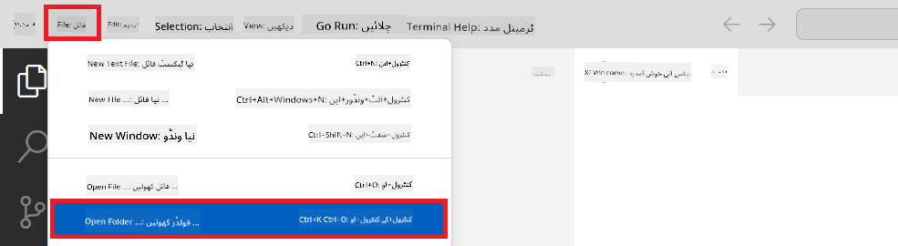

1. Visual Studio Code کے بائیں پین میں رائٹ کلک کریں اور **New File** منتخب کریں تاکہ *download_dataset.py* نامی نئی فائل بنائیں۔

    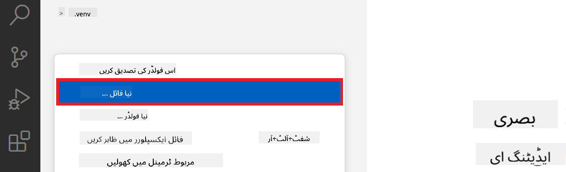

### fine-tuning کے لیے ڈیٹا سیٹ تیار کریں

اس مشق میں، آپ *download_dataset.py* فائل چلائیں گے تاکہ *ultrachat_200k* datasets اپنے لوکل ماحول میں ڈاؤن لوڈ کریں۔ پھر آپ اس ڈیٹا سیٹ کو Azure Machine Learning میں Phi-3 ماڈل کی fine-tuning کے لیے استعمال کریں گے۔

اس مشق میں، آپ کریں گے:

- *download_dataset.py* فائل میں کوڈ شامل کریں تاکہ datasets ڈاؤن لوڈ ہوں۔
- *download_dataset.py* فائل چلائیں تاکہ datasets لوکل ماحول میں ڈاؤن لوڈ ہو جائیں۔

#### *download_dataset.py* کے ذریعے اپنا ڈیٹا سیٹ ڈاؤن لوڈ کریں

1. Visual Studio Code میں *download_dataset.py* فائل کھولیں۔

1. *download_dataset.py* فائل میں درج ذیل کوڈ شامل کریں۔

    ```python
    import json
    import os
    from datasets import load_dataset

    def load_and_split_dataset(dataset_name, config_name, split_ratio):
        """
        Load and split a dataset.
        """
        # Load the dataset with the specified name, configuration, and split ratio
        dataset = load_dataset(dataset_name, config_name, split=split_ratio)
        print(f"Original dataset size: {len(dataset)}")
        
        # Split the dataset into train and test sets (80% train, 20% test)
        split_dataset = dataset.train_test_split(test_size=0.2)
        print(f"Train dataset size: {len(split_dataset['train'])}")
        print(f"Test dataset size: {len(split_dataset['test'])}")
        
        return split_dataset

    def save_dataset_to_jsonl(dataset, filepath):
        """
        Save a dataset to a JSONL file.
        """
        # Create the directory if it does not exist
        os.makedirs(os.path.dirname(filepath), exist_ok=True)
        
        # Open the file in write mode
        with open(filepath, 'w', encoding='utf-8') as f:
            # Iterate over each record in the dataset
            for record in dataset:
                # Dump the record as a JSON object and write it to the file
                json.dump(record, f)
                # Write a newline character to separate records
                f.write('\n')
        
        print(f"Dataset saved to {filepath}")

    def main():
        """
        Main function to load, split, and save the dataset.
        """
        # Load and split the ULTRACHAT_200k dataset with a specific configuration and split ratio
        dataset = load_and_split_dataset("HuggingFaceH4/ultrachat_200k", 'default', 'train_sft[:1%]')
        
        # Extract the train and test datasets from the split
        train_dataset = dataset['train']
        test_dataset = dataset['test']

        # Save the train dataset to a JSONL file
        save_dataset_to_jsonl(train_dataset, "data/train_data.jsonl")
        
        # Save the test dataset to a separate JSONL file
        save_dataset_to_jsonl(test_dataset, "data/test_data.jsonl")

    if __name__ == "__main__":
        main()

    ```

1. ٹرمینل میں درج ذیل کمانڈ ٹائپ کریں تاکہ اسکرپٹ چلائیں اور dataset لوکل ماحول میں ڈاؤن لوڈ کریں۔

    ```console
    python download_dataset.py
    ```

1. تصدیق کریں کہ datasets کامیابی سے آپ کے لوکل *finetune-phi/data* ڈائریکٹری میں محفوظ ہو گئے ہیں۔

> [!NOTE]
>
> #### ڈیٹا سیٹ کے سائز اور fine-tuning کے وقت پر نوٹ
>
> اس ٹیوٹوریل میں، آپ صرف dataset کا 1% (`split='train[:1%]'`) استعمال کرتے ہیں۔ اس سے ڈیٹا کی مقدار نمایاں طور پر کم ہو جاتی ہے، جس سے اپلوڈ اور fine-tuning دونوں کے عمل تیز ہو جاتے ہیں۔
1. پر [Azure ML Studio](https://ml.azure.com/home?wt.mc_id=studentamb_279723) جائیں۔

1. بائیں طرف کے ٹیب سے **Compute** منتخب کریں۔

1. نیویگیشن مینو سے **Compute clusters** منتخب کریں۔

1. **+ New** منتخب کریں۔

    

1. درج ذیل کام انجام دیں:

    - وہ **Region** منتخب کریں جسے آپ استعمال کرنا چاہتے ہیں۔
    - **Virtual machine tier** کو **Dedicated** منتخب کریں۔
    - **Virtual machine type** کو **GPU** منتخب کریں۔
    - **Virtual machine size** فلٹر کو **Select from all options** پر سیٹ کریں۔
    - **Virtual machine size** کو **Standard_NC24ads_A100_v4** منتخب کریں۔

    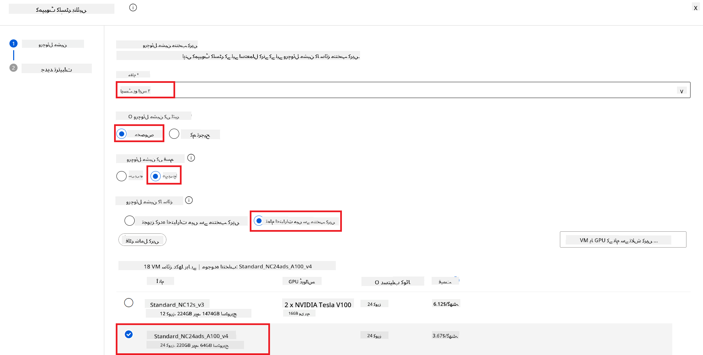

1. **Next** منتخب کریں۔

1. درج ذیل کام انجام دیں:

    - **Compute name** درج کریں۔ یہ منفرد ہونا چاہیے۔
    - **Minimum number of nodes** کو **0** منتخب کریں۔
    - **Maximum number of nodes** کو **1** منتخب کریں۔
    - **Idle seconds before scale down** کو **120** منتخب کریں۔

    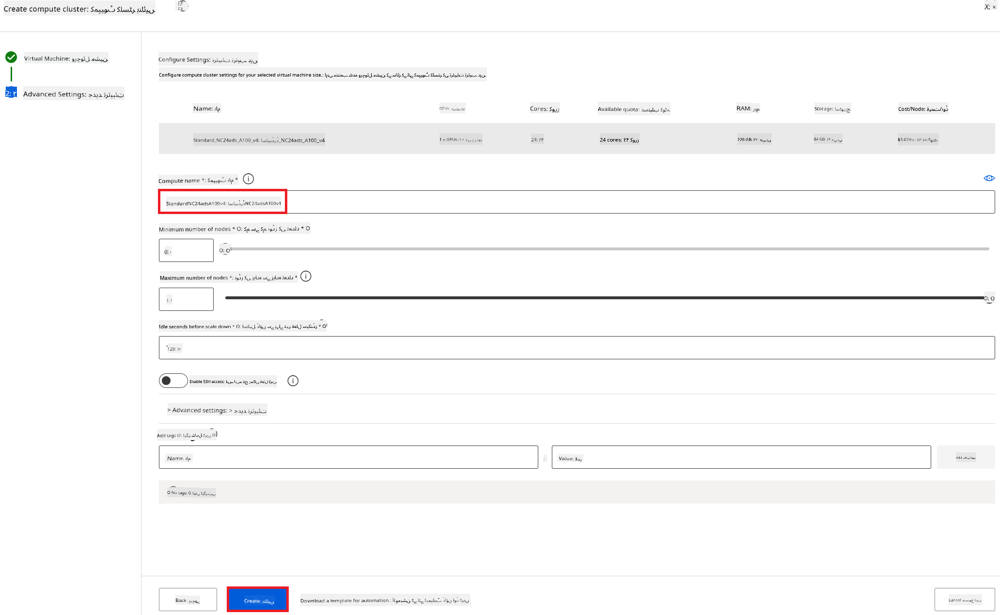

1. **Create** منتخب کریں۔

#### Phi-3 ماڈل کو Fine-tune کریں

1. پر [Azure ML Studio](https://ml.azure.com/home?wt.mc_id=studentamb_279723) جائیں۔

1. وہ Azure Machine Learning ورک اسپیس منتخب کریں جو آپ نے بنایا ہے۔

    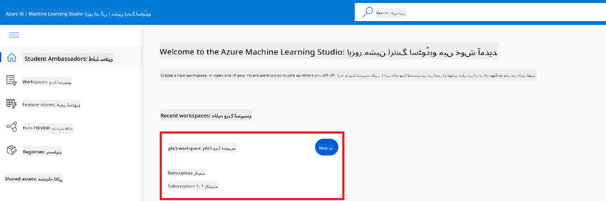

1. درج ذیل کام انجام دیں:

    - بائیں طرف کے ٹیب سے **Model catalog** منتخب کریں۔
    - **search bar** میں *phi-3-mini-4k* ٹائپ کریں اور ظاہر ہونے والے آپشنز میں سے **Phi-3-mini-4k-instruct** منتخب کریں۔

    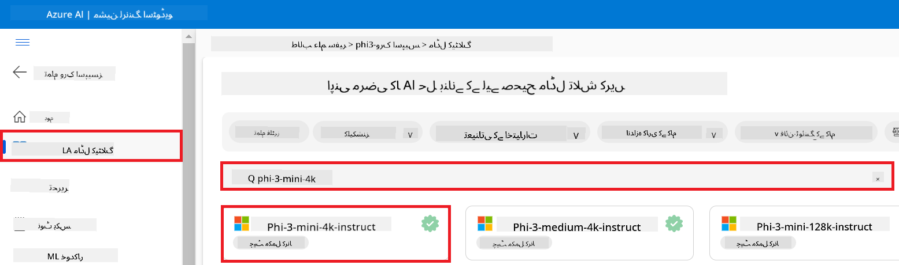

1. نیویگیشن مینو سے **Fine-tune** منتخب کریں۔

    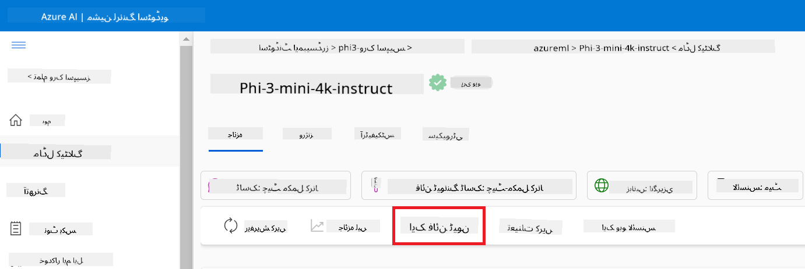

1. درج ذیل کام انجام دیں:

    - **Select task type** کو **Chat completion** منتخب کریں۔
    - **+ Select data** کو منتخب کرکے **Traning data** اپلوڈ کریں۔
    - Validation data اپلوڈ ٹائپ کو **Provide different validation data** منتخب کریں۔
    - **+ Select data** کو منتخب کرکے **Validation data** اپلوڈ کریں۔

    

    > [!TIP]
    >
    > آپ **Advanced settings** منتخب کرکے **learning_rate** اور **lr_scheduler_type** جیسی ترتیبات اپنی ضروریات کے مطابق بہتر بنا سکتے ہیں تاکہ fine-tuning کا عمل مؤثر ہو۔

1. **Finish** منتخب کریں۔

1. اس مشق میں، آپ نے کامیابی سے Azure Machine Learning کا استعمال کرتے ہوئے Phi-3 ماڈل کو fine-tune کیا۔ براہ کرم نوٹ کریں کہ fine-tuning کا عمل کافی وقت لے سکتا ہے۔ fine-tuning جاب چلانے کے بعد، آپ کو مکمل ہونے کا انتظار کرنا ہوگا۔ آپ اپنے Azure Machine Learning ورک اسپیس کے بائیں طرف کے ٹیب میں Jobs پر جا کر fine-tuning جاب کی حالت مانیٹر کر سکتے ہیں۔ اگلی سیریز میں، آپ fine-tuned ماڈل کو deploy کریں گے اور اسے Prompt flow کے ساتھ مربوط کریں گے۔

    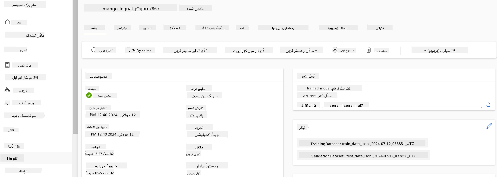

### fine-tuned Phi-3 ماڈل کو Deploy کریں

fine-tuned Phi-3 ماڈل کو Prompt flow کے ساتھ مربوط کرنے کے لیے، آپ کو ماڈل کو deploy کرنا ہوگا تاکہ اسے real-time inference کے لیے دستیاب کیا جا سکے۔ اس عمل میں ماڈل کی رجسٹریشن، آن لائن اینڈ پوائنٹ کی تخلیق، اور ماڈل کی تعیناتی شامل ہے۔

اس مشق میں، آپ:

- Azure Machine Learning ورک اسپیس میں fine-tuned ماڈل کو رجسٹر کریں گے۔
- آن لائن اینڈ پوائنٹ بنائیں گے۔
- رجسٹر شدہ fine-tuned Phi-3 ماڈل کو deploy کریں گے۔

#### fine-tuned ماڈل کو رجسٹر کریں

1. پر [Azure ML Studio](https://ml.azure.com/home?wt.mc_id=studentamb_279723) جائیں۔

1. وہ Azure Machine Learning ورک اسپیس منتخب کریں جو آپ نے بنایا ہے۔

    

1. بائیں طرف کے ٹیب سے **Models** منتخب کریں۔

1. **+ Register** منتخب کریں۔

1. **From a job output** منتخب کریں۔

    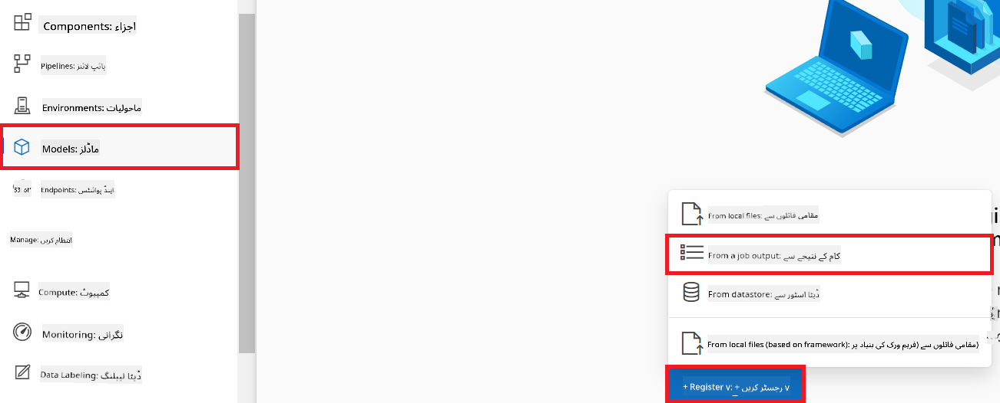

1. وہ جاب منتخب کریں جو آپ نے بنایا ہے۔

    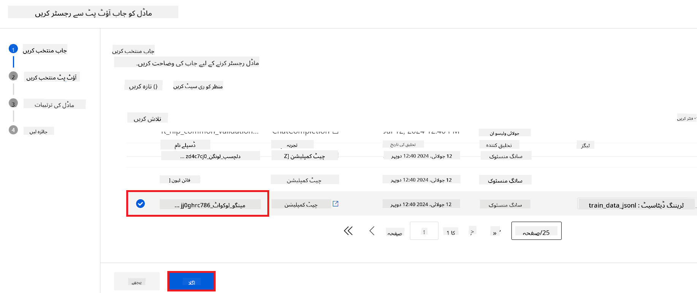

1. **Next** منتخب کریں۔

1. **Model type** کو **MLflow** منتخب کریں۔

1. یقینی بنائیں کہ **Job output** منتخب ہے؛ یہ خود بخود منتخب ہونا چاہیے۔

    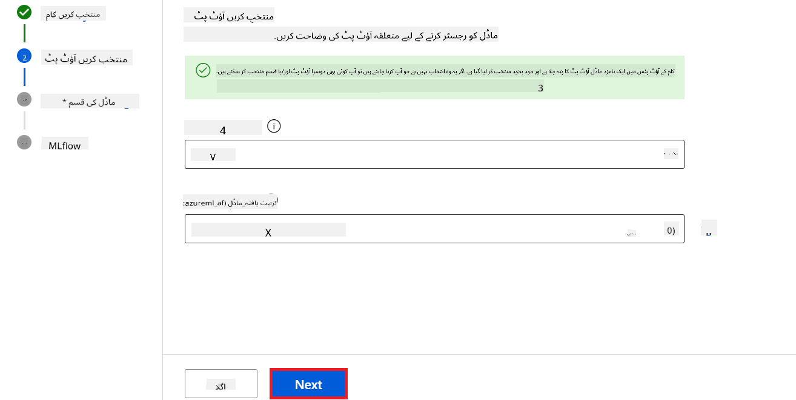

2. **Next** منتخب کریں۔

3. **Register** منتخب کریں۔

    

4. آپ اپنے رجسٹر شدہ ماڈل کو بائیں طرف کے ٹیب میں **Models** مینو سے دیکھ سکتے ہیں۔

    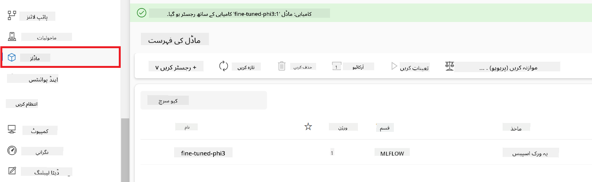

#### fine-tuned ماڈل کو Deploy کریں

1. اس Azure Machine Learning ورک اسپیس پر جائیں جو آپ نے بنایا ہے۔

1. بائیں طرف کے ٹیب سے **Endpoints** منتخب کریں۔

1. نیویگیشن مینو سے **Real-time endpoints** منتخب کریں۔

    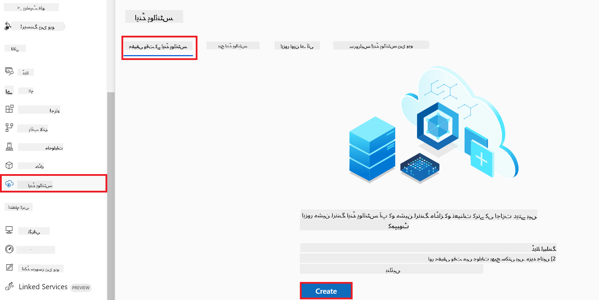

1. **Create** منتخب کریں۔

1. وہ رجسٹر شدہ ماڈل منتخب کریں جو آپ نے بنایا ہے۔

    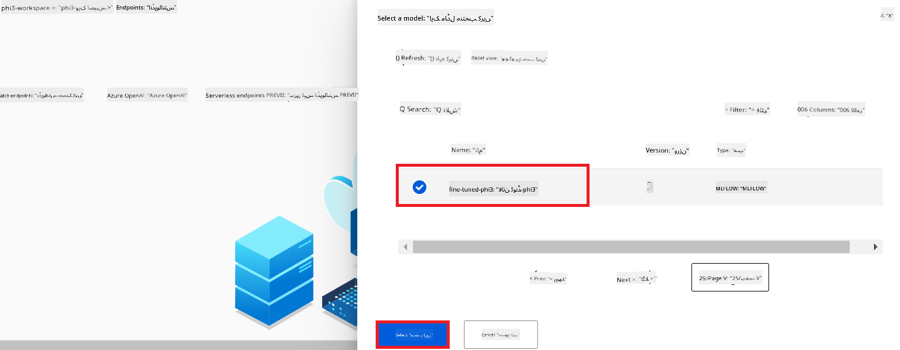

1. **Select** منتخب کریں۔

1. درج ذیل کام انجام دیں:

    - **Virtual machine** کو *Standard_NC6s_v3* منتخب کریں۔
    - وہ **Instance count** منتخب کریں جو آپ استعمال کرنا چاہتے ہیں، مثلاً *1*۔
    - **Endpoint** کو **New** منتخب کریں تاکہ نیا اینڈ پوائنٹ بنایا جا سکے۔
    - **Endpoint name** درج کریں۔ یہ منفرد ہونا چاہیے۔
    - **Deployment name** درج کریں۔ یہ بھی منفرد ہونا چاہیے۔

    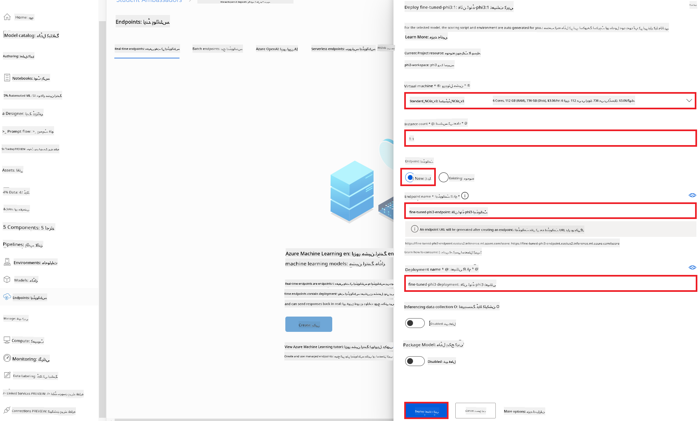

1. **Deploy** منتخب کریں۔

> [!WARNING]
> اضافی چارجز سے بچنے کے لیے، یقینی بنائیں کہ آپ Azure Machine Learning ورک اسپیس میں بنائے گئے اینڈ پوائنٹ کو حذف کر دیں۔
>

#### Azure Machine Learning ورک اسپیس میں Deployment کی حالت چیک کریں

1. اس Azure Machine Learning ورک اسپیس پر جائیں جو آپ نے بنایا ہے۔

1. بائیں طرف کے ٹیب سے **Endpoints** منتخب کریں۔

1. وہ اینڈ پوائنٹ منتخب کریں جو آپ نے بنایا ہے۔

    

1. اس صفحہ پر، آپ اینڈ پوائنٹس کو تعیناتی کے دوران منظم کر سکتے ہیں۔

> [!NOTE]
> تعیناتی مکمل ہونے کے بعد، یقینی بنائیں کہ **Live traffic** کو **100%** پر سیٹ کیا گیا ہے۔ اگر ایسا نہیں ہے، تو **Update traffic** منتخب کریں تاکہ ٹریفک کی ترتیبات کو ایڈجسٹ کیا جا سکے۔ یاد رکھیں کہ اگر ٹریفک 0% پر ہو تو آپ ماڈل کا ٹیسٹ نہیں کر سکتے۔
>
> 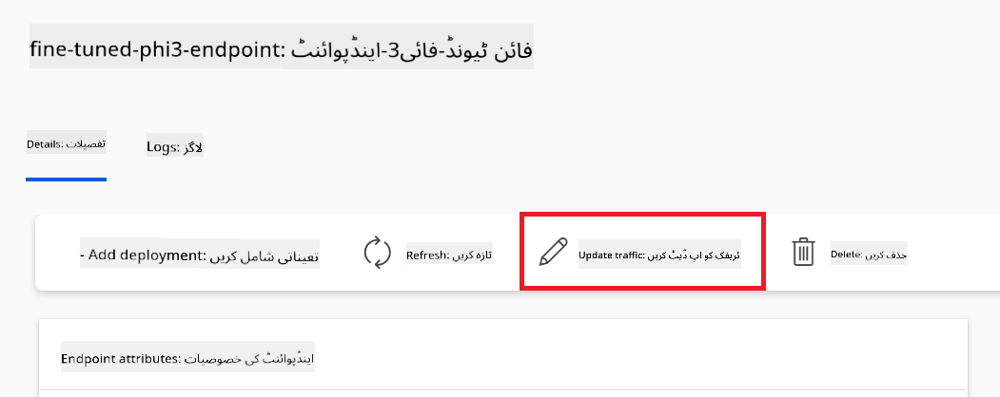
>

## Scenario 3: Prompt flow کے ساتھ انٹیگریٹ کریں اور Azure AI Foundry میں اپنے کسٹم ماڈل سے بات کریں

### کسٹم Phi-3 ماڈل کو Prompt flow کے ساتھ انٹیگریٹ کریں

اپنے fine-tuned ماڈل کو کامیابی سے deploy کرنے کے بعد، اب آپ اسے Prompt Flow کے ساتھ مربوط کر سکتے ہیں تاکہ آپ اپنے ماڈل کو real-time ایپلیکیشنز میں استعمال کر سکیں، جو آپ کے کسٹم Phi-3 ماڈل کے ساتھ مختلف interactive کاموں کو ممکن بناتا ہے۔

اس مشق میں، آپ:

- Azure AI Foundry Hub بنائیں گے۔
- Azure AI Foundry Project بنائیں گے۔
- Prompt flow بنائیں گے۔
- fine-tuned Phi-3 ماڈل کے لیے کسٹم کنکشن شامل کریں گے۔
- اپنے کسٹم Phi-3 ماڈل کے ساتھ بات چیت کے لیے Prompt flow سیٹ اپ کریں گے۔

> [!NOTE]
> آپ Azure ML Studio کا استعمال کرتے ہوئے بھی Promptflow کے ساتھ انٹیگریٹ کر سکتے ہیں۔ یہی انٹیگریشن کا عمل Azure ML Studio پر بھی لاگو ہوتا ہے۔

#### Azure AI Foundry Hub بنائیں

پروجیکٹ بنانے سے پہلے آپ کو Hub بنانا ہوگا۔ Hub ایک Resource Group کی طرح کام کرتا ہے، جو آپ کو Azure AI Foundry میں متعدد Projects کو منظم کرنے اور ترتیب دینے کی سہولت دیتا ہے۔

1. پر [Azure AI Foundry](https://ai.azure.com/?WT.mc_id=aiml-137032-kinfeylo) جائیں۔

1. بائیں طرف کے ٹیب سے **All hubs** منتخب کریں۔

1. نیویگیشن مینو سے **+ New hub** منتخب کریں۔

    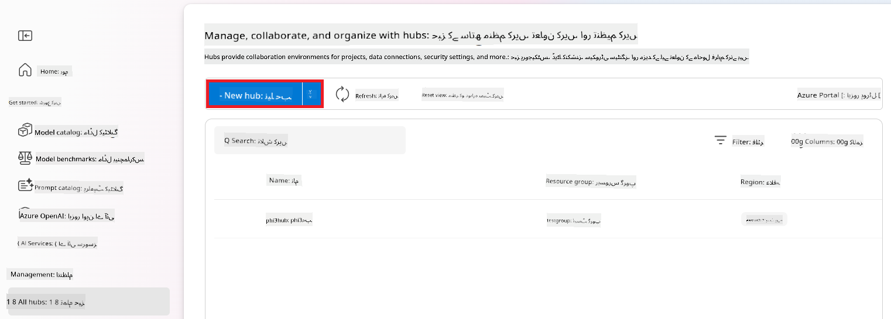

1. درج ذیل کام انجام دیں:

    - **Hub name** درج کریں۔ یہ منفرد ہونا چاہیے۔
    - اپنی Azure **Subscription** منتخب کریں۔
    - استعمال کے لیے **Resource group** منتخب کریں (اگر ضرورت ہو تو نیا بنائیں)۔
    - وہ **Location** منتخب کریں جسے آپ استعمال کرنا چاہتے ہیں۔
    - استعمال کے لیے **Connect Azure AI Services** منتخب کریں (اگر ضرورت ہو تو نیا بنائیں)۔
    - **Connect Azure AI Search** کو **Skip connecting** پر سیٹ کریں۔

    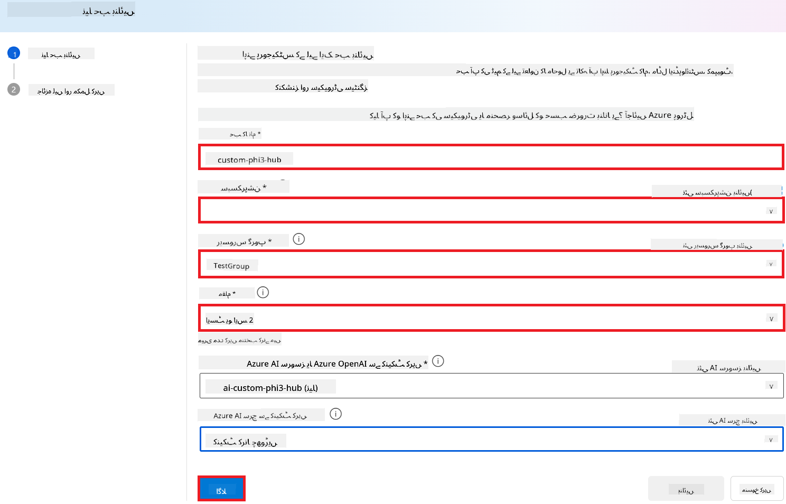

1. **Next** منتخب کریں۔

#### Azure AI Foundry Project بنائیں

1. اس Hub میں جو آپ نے بنایا ہے، بائیں طرف کے ٹیب سے **All projects** منتخب کریں۔

1. نیویگیشن مینو سے **+ New project** منتخب کریں۔

    

1. **Project name** درج کریں۔ یہ منفرد ہونا چاہیے۔

    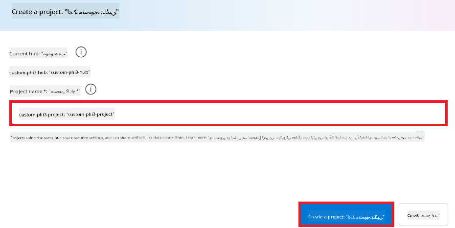

1. **Create a project** منتخب کریں۔

#### fine-tuned Phi-3 ماڈل کے لیے کسٹم کنکشن شامل کریں

اپنے کسٹم Phi-3 ماڈل کو Prompt flow کے ساتھ مربوط کرنے کے لیے، آپ کو ماڈل کے اینڈ پوائنٹ اور کلید کو کسٹم کنکشن میں محفوظ کرنا ہوگا۔ یہ سیٹ اپ Prompt flow میں آپ کے کسٹم Phi-3 ماڈل تک رسائی کو یقینی بناتا ہے۔

#### fine-tuned Phi-3 ماڈل کی api key اور endpoint uri سیٹ کریں

1. پر [Azure ML Studio](https://ml.azure.com/home?WT.mc_id=aiml-137032-kinfeylo) جائیں۔

1. اس Azure Machine Learning ورک اسپیس پر جائیں جو آپ نے بنایا ہے۔

1. بائیں طرف کے ٹیب سے **Endpoints** منتخب کریں۔

    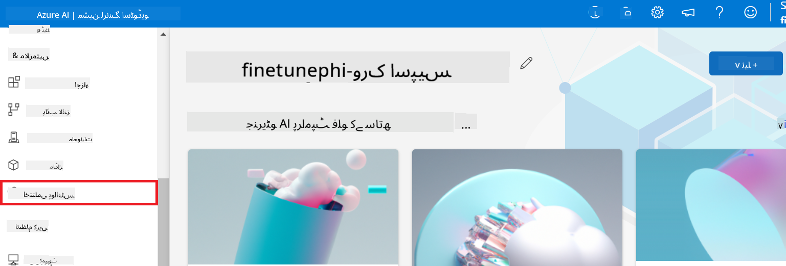

1. وہ اینڈ پوائنٹ منتخب کریں جو آپ نے بنایا ہے۔

    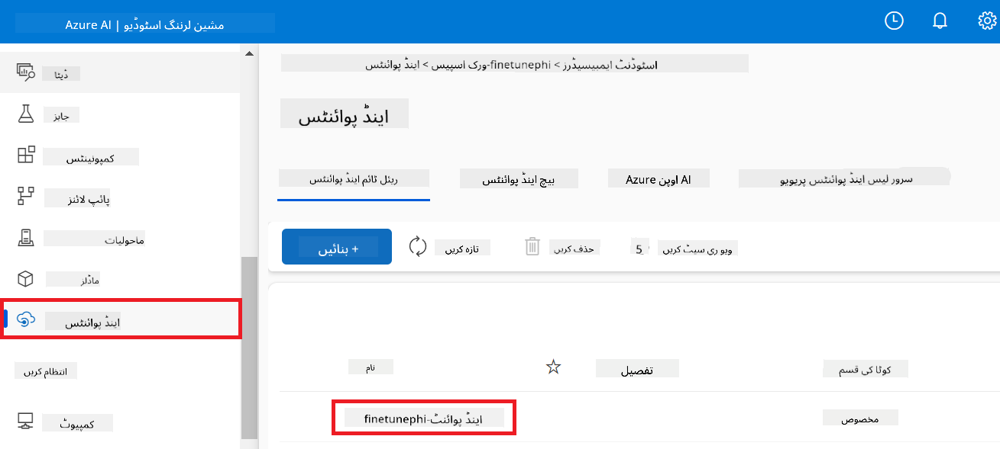

1. نیویگیشن مینو سے **Consume** منتخب کریں۔

1. اپنا **REST endpoint** اور **Primary key** کاپی کریں۔
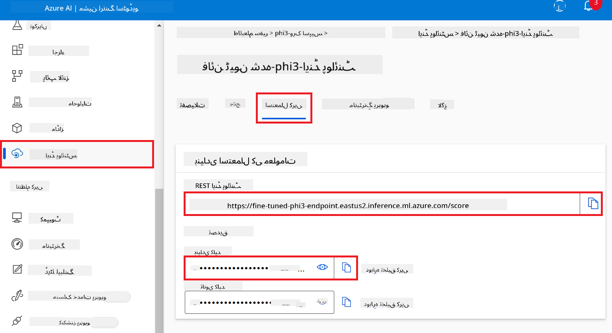

#### اپنی مرضی کے مطابق کنکشن شامل کریں

1. [Azure AI Foundry](https://ai.azure.com/?WT.mc_id=aiml-137032-kinfeylo) پر جائیں۔

1. اس Azure AI Foundry پروجیکٹ پر جائیں جو آپ نے بنایا ہے۔

1. اس پروجیکٹ میں جو آپ نے بنایا ہے، بائیں طرف کے ٹیب سے **Settings** منتخب کریں۔

1. **+ New connection** منتخب کریں۔

    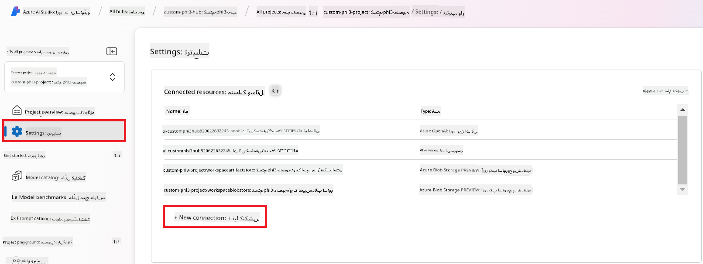

1. نیویگیشن مینو سے **Custom keys** منتخب کریں۔

    

1. درج ذیل کام انجام دیں:

    - **+ Add key value pairs** منتخب کریں۔
    - key name کے لیے **endpoint** لکھیں اور Azure ML Studio سے کاپی کیا ہوا endpoint value فیلڈ میں چسپاں کریں۔
    - دوبارہ **+ Add key value pairs** منتخب کریں۔
    - key name کے لیے **key** لکھیں اور Azure ML Studio سے کاپی کیا ہوا key value فیلڈ میں چسپاں کریں۔
    - keys شامل کرنے کے بعد، key کو ظاہر ہونے سے بچانے کے لیے **is secret** منتخب کریں۔

    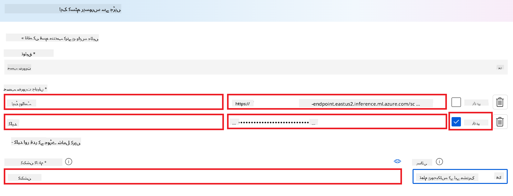

1. **Add connection** منتخب کریں۔

#### Prompt flow بنائیں

آپ نے Azure AI Foundry میں ایک کسٹم کنکشن شامل کر لیا ہے۔ اب، درج ذیل مراحل کے ذریعے ایک Prompt flow بنائیں۔ پھر، آپ اس Prompt flow کو کسٹم کنکشن سے جوڑیں گے تاکہ آپ fine-tuned ماڈل کو Prompt flow میں استعمال کر سکیں۔

1. اس Azure AI Foundry پروجیکٹ پر جائیں جو آپ نے بنایا ہے۔

1. بائیں طرف کے ٹیب سے **Prompt flow** منتخب کریں۔

1. نیویگیشن مینو سے **+ Create** منتخب کریں۔

    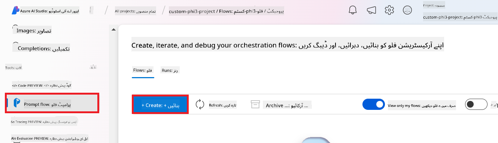

1. نیویگیشن مینو سے **Chat flow** منتخب کریں۔

    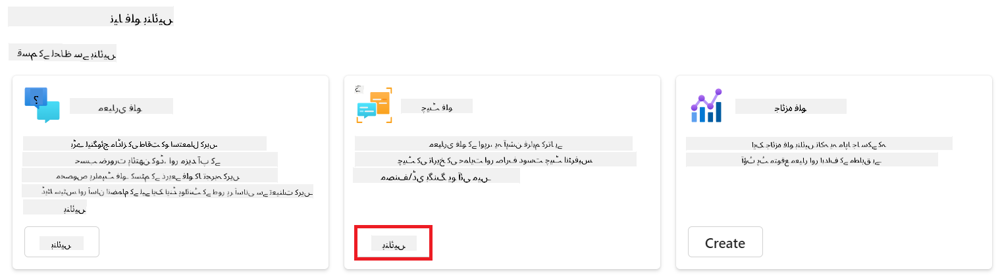

1. استعمال کے لیے **Folder name** درج کریں۔

    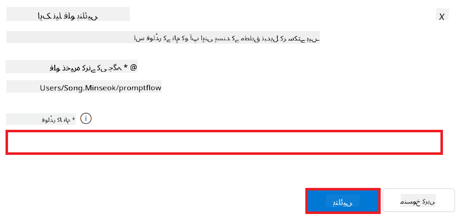

2. **Create** منتخب کریں۔

#### اپنے کسٹم Phi-3 ماڈل کے ساتھ چیٹ کے لیے Prompt flow ترتیب دیں

آپ کو fine-tuned Phi-3 ماڈل کو Prompt flow میں شامل کرنا ہے۔ تاہم، موجودہ Prompt flow اس مقصد کے لیے تیار نہیں کیا گیا ہے۔ اس لیے، آپ کو Prompt flow کو دوبارہ ڈیزائن کرنا ہوگا تاکہ کسٹم ماڈل کو شامل کیا جا سکے۔

1. Prompt flow میں موجودہ فلو کو دوبارہ بنانے کے لیے درج ذیل کام کریں:

    - **Raw file mode** منتخب کریں۔
    - *flow.dag.yml* فائل میں موجود تمام کوڈ حذف کریں۔
    - درج ذیل کوڈ *flow.dag.yml* فائل میں شامل کریں۔

        ```yml
        inputs:
          input_data:
            type: string
            default: "Who founded Microsoft?"

        outputs:
          answer:
            type: string
            reference: ${integrate_with_promptflow.output}

        nodes:
        - name: integrate_with_promptflow
          type: python
          source:
            type: code
            path: integrate_with_promptflow.py
          inputs:
            input_data: ${inputs.input_data}
        ```

    - **Save** منتخب کریں۔

    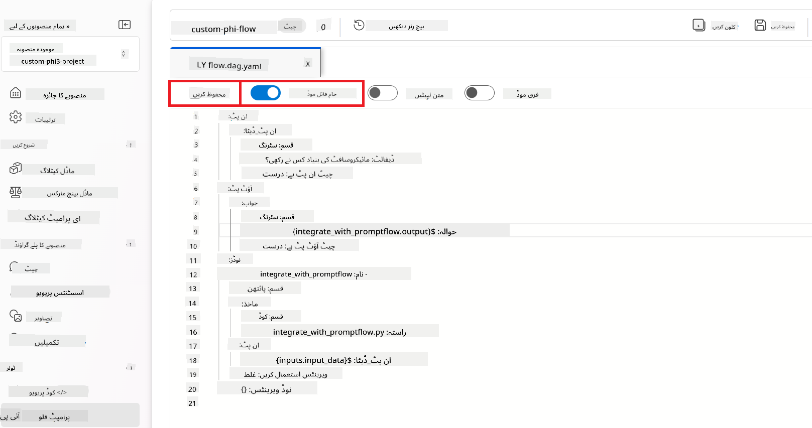

1. *integrate_with_promptflow.py* فائل میں درج ذیل کوڈ شامل کریں تاکہ Prompt flow میں کسٹم Phi-3 ماڈل استعمال ہو سکے۔

    ```python
    import logging
    import requests
    from promptflow import tool
    from promptflow.connections import CustomConnection

    # Logging setup
    logging.basicConfig(
        format="%(asctime)s - %(levelname)s - %(name)s - %(message)s",
        datefmt="%Y-%m-%d %H:%M:%S",
        level=logging.DEBUG
    )
    logger = logging.getLogger(__name__)

    def query_phi3_model(input_data: str, connection: CustomConnection) -> str:
        """
        Send a request to the Phi-3 model endpoint with the given input data using Custom Connection.
        """

        # "connection" is the name of the Custom Connection, "endpoint", "key" are the keys in the Custom Connection
        endpoint_url = connection.endpoint
        api_key = connection.key

        headers = {
            "Content-Type": "application/json",
            "Authorization": f"Bearer {api_key}"
        }
        data = {
            "input_data": {
                "input_string": [
                    {"role": "user", "content": input_data}
                ],
                "parameters": {
                    "temperature": 0.7,
                    "max_new_tokens": 128
                }
            }
        }
        try:
            response = requests.post(endpoint_url, json=data, headers=headers)
            response.raise_for_status()
            
            # Log the full JSON response
            logger.debug(f"Full JSON response: {response.json()}")

            result = response.json()["output"]
            logger.info("Successfully received response from Azure ML Endpoint.")
            return result
        except requests.exceptions.RequestException as e:
            logger.error(f"Error querying Azure ML Endpoint: {e}")
            raise

    @tool
    def my_python_tool(input_data: str, connection: CustomConnection) -> str:
        """
        Tool function to process input data and query the Phi-3 model.
        """
        return query_phi3_model(input_data, connection)

    ```

    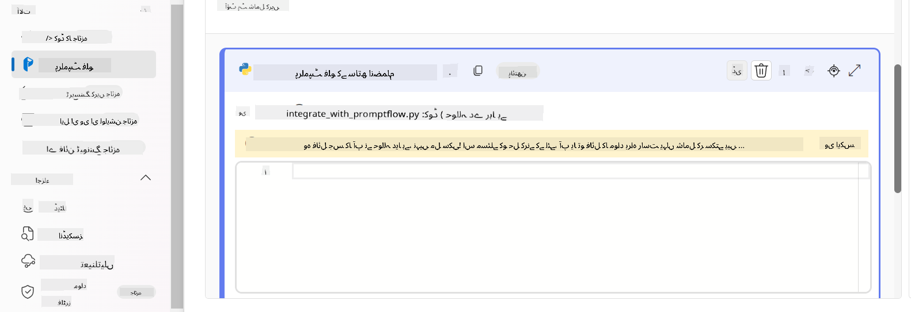

> [!NOTE]
> Azure AI Foundry میں Prompt flow استعمال کرنے کی مزید تفصیلی معلومات کے لیے، آپ [Prompt flow in Azure AI Foundry](https://learn.microsoft.com/azure/ai-studio/how-to/prompt-flow) دیکھ سکتے ہیں۔

1. **Chat input** اور **Chat output** منتخب کریں تاکہ آپ اپنے ماڈل کے ساتھ چیٹ کر سکیں۔

    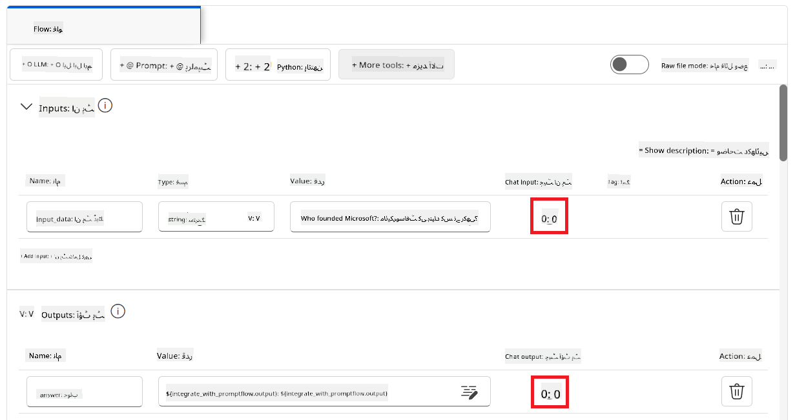

1. اب آپ اپنے کسٹم Phi-3 ماڈل کے ساتھ چیٹ کے لیے تیار ہیں۔ اگلے مشق میں، آپ سیکھیں گے کہ Prompt flow کو کیسے شروع کیا جائے اور اسے اپنے fine-tuned Phi-3 ماڈل کے ساتھ چیٹ کے لیے کیسے استعمال کیا جائے۔

> [!NOTE]
>
> دوبارہ بنایا گیا فلو نیچے دی گئی تصویر کی طرح ہونا چاہیے:
>
> 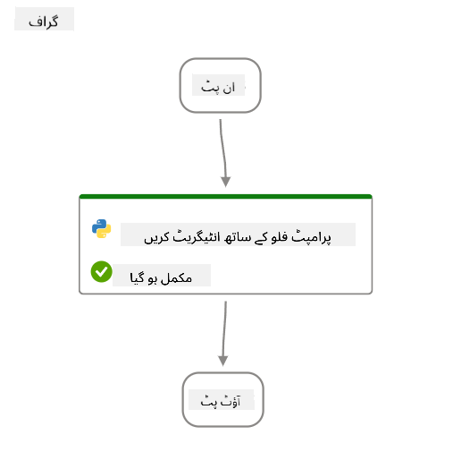
>

### اپنے کسٹم Phi-3 ماڈل کے ساتھ چیٹ کریں

اب جب کہ آپ نے اپنا کسٹم Phi-3 ماڈل fine-tune کر کے Prompt flow کے ساتھ شامل کر لیا ہے، آپ اسے استعمال کرنے کے لیے تیار ہیں۔ یہ مشق آپ کو اپنے ماڈل کے ساتھ چیٹ شروع کرنے اور سیٹ اپ کرنے کے عمل سے رہنمائی کرے گی۔ ان مراحل پر عمل کر کے آپ اپنے fine-tuned Phi-3 ماڈل کی صلاحیتوں کو مختلف کاموں اور بات چیت کے لیے مکمل طور پر استعمال کر سکیں گے۔

- Prompt flow کے ذریعے اپنے کسٹم Phi-3 ماڈل کے ساتھ چیٹ کریں۔

#### Prompt flow شروع کریں

1. Prompt flow شروع کرنے کے لیے **Start compute sessions** منتخب کریں۔

    

1. پیرامیٹرز کو تازہ کرنے کے لیے **Validate and parse input** منتخب کریں۔

    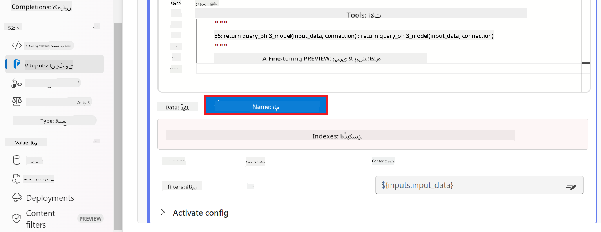

1. اپنی بنائی ہوئی کسٹم کنکشن کے **connection** کی **Value** منتخب کریں۔ مثال کے طور پر، *connection*۔

    

#### اپنے کسٹم ماڈل کے ساتھ چیٹ کریں

1. **Chat** منتخب کریں۔

    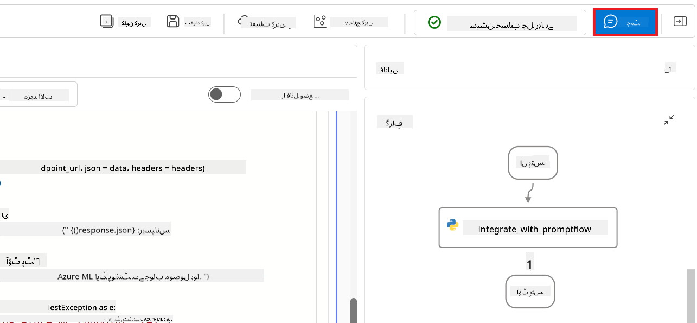

1. نتائج کی مثال درج ذیل ہے: اب آپ اپنے کسٹم Phi-3 ماڈل کے ساتھ چیٹ کر سکتے ہیں۔ بہتر ہے کہ fine-tuning کے لیے استعمال ہونے والے ڈیٹا کی بنیاد پر سوالات کریں۔

    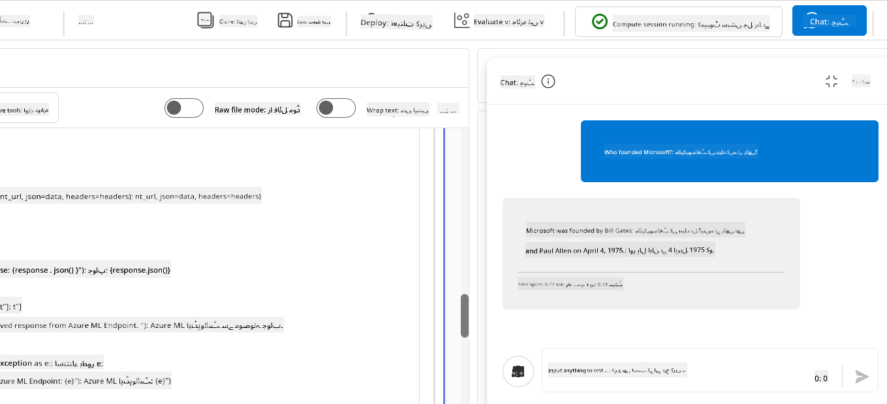

**دستخطی نوٹ**:  
یہ دستاویز AI ترجمہ سروس [Co-op Translator](https://github.com/Azure/co-op-translator) کے ذریعے ترجمہ کی گئی ہے۔ اگرچہ ہم درستگی کی کوشش کرتے ہیں، براہ کرم آگاہ رہیں کہ خودکار ترجموں میں غلطیاں یا نقائص ہو سکتے ہیں۔ اصل دستاویز اپنی مادری زبان میں ہی معتبر ماخذ سمجھی جانی چاہیے۔ اہم معلومات کے لیے پیشہ ور انسانی ترجمہ کی سفارش کی جاتی ہے۔ ہم اس ترجمہ کے استعمال سے پیدا ہونے والی کسی بھی غلط فہمی یا غلط تعبیر کے ذمہ دار نہیں ہیں۔