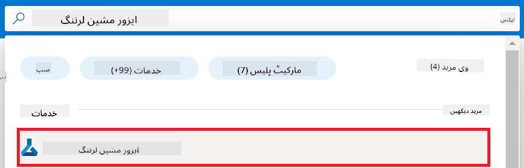
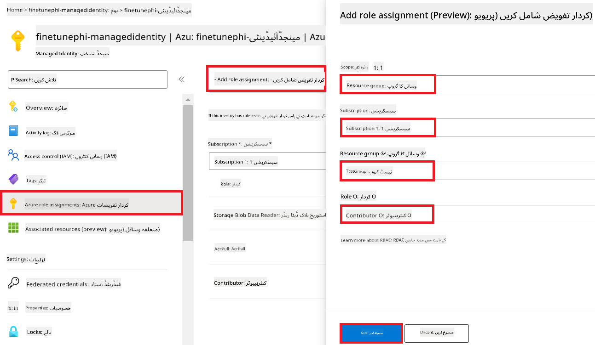
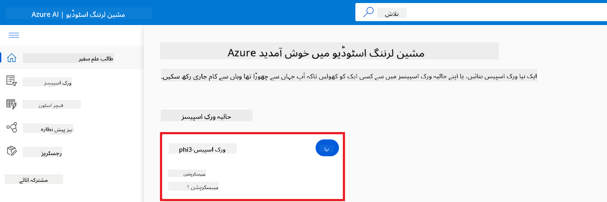
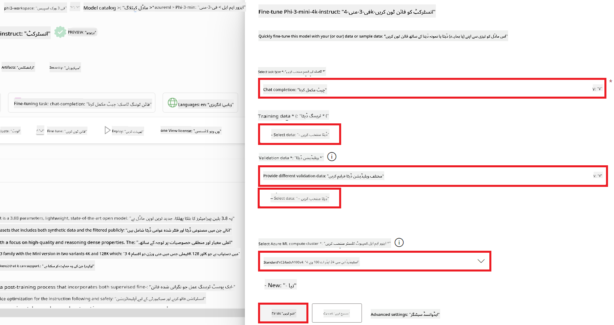
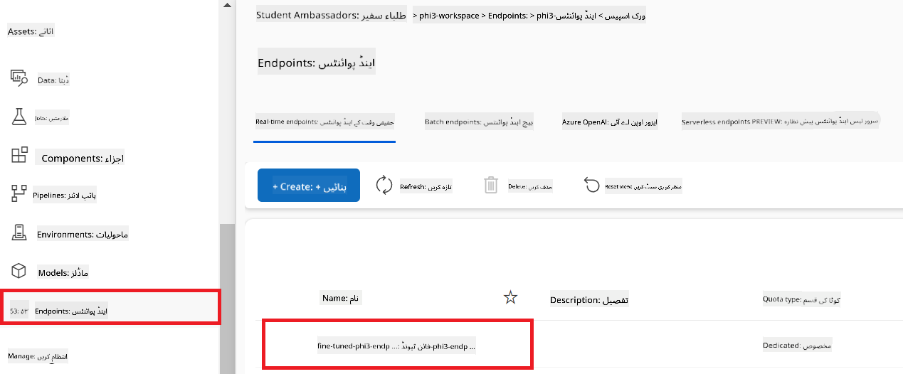
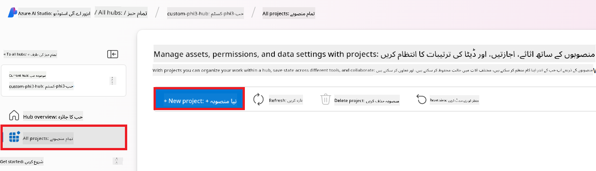
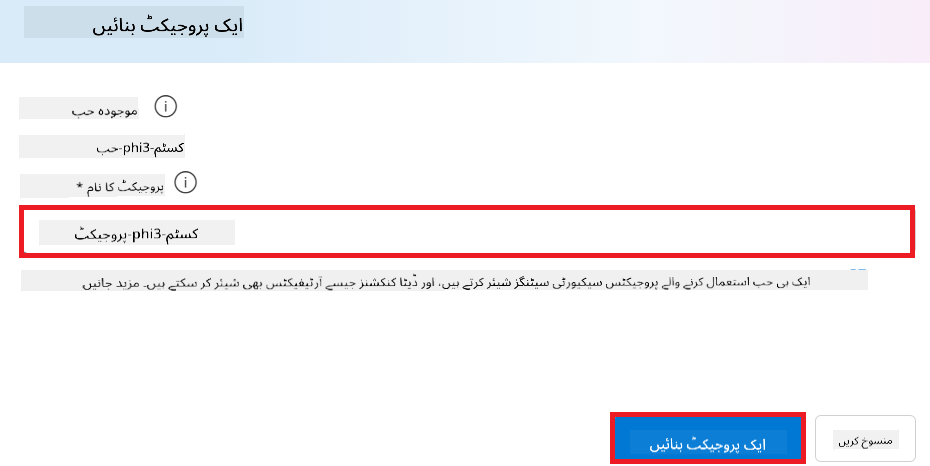
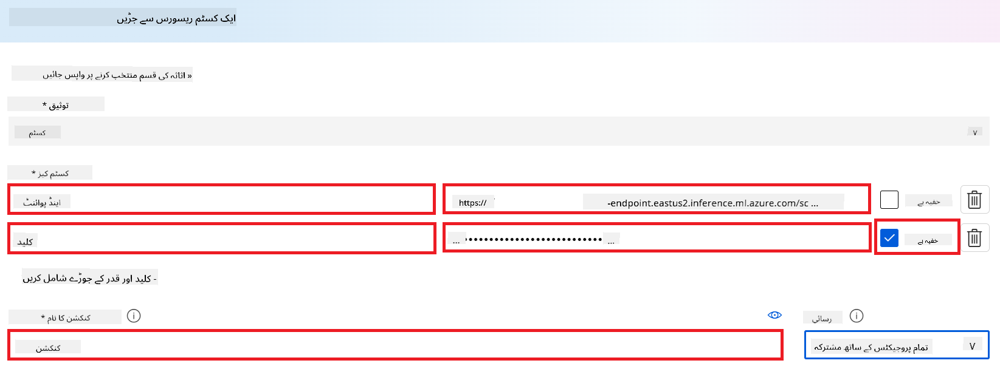
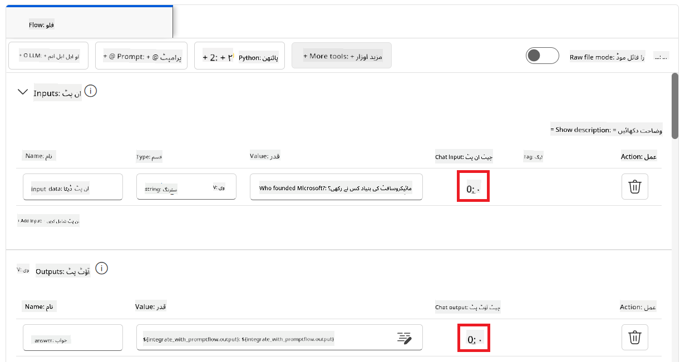
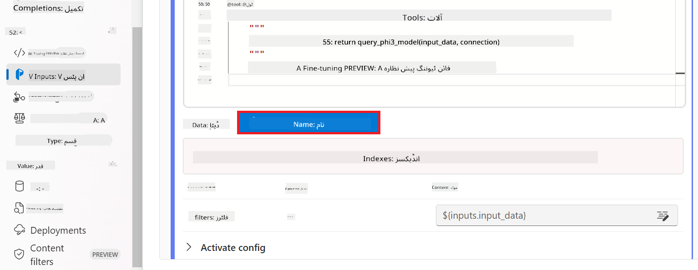

<!--
CO_OP_TRANSLATOR_METADATA:
{
  "original_hash": "0df910a227098303cc392b6ad204c271",
  "translation_date": "2026-01-06T04:13:44+00:00",
  "source_file": "md/02.Application/01.TextAndChat/Phi3/E2E_Phi-3-FineTuning_PromptFlow_Integration_AIFoundry.md",
  "language_code": "ur"
}
-->
# Azure AI Foundry میں Prompt flow کے ساتھ کسٹم Phi-3 ماڈلز کو Fine-tune اور انضمام کریں

یہ اختتام سے اختتام (E2E) نمونہ مائیکروسافٹ ٹیک کمیونٹی کے گائیڈ "[Azure AI Foundry میں Prompt flow کے ساتھ کسٹم Phi-3 ماڈلز کو Fine-tune اور انضمام کریں](https://techcommunity.microsoft.com/t5/educator-developer-blog/fine-tune-and-integrate-custom-phi-3-models-with-prompt-flow-in/ba-p/4191726?WT.mc_id=aiml-137032-kinfeylo)" پر مبنی ہے۔ یہ Azure AI Foundry میں کسٹم Phi-3 ماڈلز کو fine-tune کرنے، تعینات کرنے، اور Prompt flow کے ساتھ منسلک کرنے کے عمل کا تعارف کراتا ہے۔
اس E2E نمونے کے برخلاف، "[Prompt Flow کے ساتھ کسٹم Phi-3 ماڈلز کو Fine-Tune اور انضمام](./E2E_Phi-3-FineTuning_PromptFlow_Integration.md)"، جس میں لوکل کوڈ چلانا شامل تھا، یہ ٹیوٹوریل مکمل طور پر Azure AI / ML اسٹوڈیو کے اندر آپ کے ماڈل کو fine-tune اور انضمام کرنے پر مرکوز ہے۔

## جائزہ

اس E2E نمونے میں، آپ سیکھیں گے کہ Phi-3 ماڈل کو کیسے fine-tune کیا جائے اور Azure AI Foundry میں Prompt flow کے ساتھ اسے کیسے منسلک کیا جائے۔ Azure AI / ML اسٹوڈیو کا فائدہ اٹھاتے ہوئے، آپ کسٹم AI ماڈلز کو تعینات کرنے اور استعمال کرنے کے لیے ایک ورک فلو قائم کریں گے۔ یہ E2E نمونہ تین مناظر میں تقسیم ہے:

**منظر 1: Azure وسائل کا قیام اور Fine-tuning کی تیاری**

**منظر 2: Phi-3 ماڈل کو Fine-tune کریں اور Azure مشین لرننگ اسٹوڈیو میں تعینات کریں**

**منظر 3: Prompt flow کے ساتھ انضمام اور Azure AI Foundry میں اپنے کسٹم ماڈل سے بات چیت کریں**

یہاں اس E2E نمونے کا جائزہ ہے۔


### فہرست مضامین

1. **[منظر 1: Azure وسائل کا قیام اور Fine-tuning کی تیاری](../../../../../../md/02.Application/01.TextAndChat/Phi3)**
    - [Azure مشین لرننگ ورک اسپیس بنائیں](../../../../../../md/02.Application/01.TextAndChat/Phi3)
    - [Azure سبسکرپشن میں GPU کوٹے کی درخواست کریں](../../../../../../md/02.Application/01.TextAndChat/Phi3)
    - [رول اسائمنٹ شامل کریں](../../../../../../md/02.Application/01.TextAndChat/Phi3)
    - [پروجیکٹ سیٹ اپ کریں](../../../../../../md/02.Application/01.TextAndChat/Phi3)
    - [Fine-tuning کے لیے ڈیٹاسیٹ تیار کریں](../../../../../../md/02.Application/01.TextAndChat/Phi3)

1. **[منظر 2: Phi-3 ماڈل کو Fine-tune کریں اور Azure مشین لرننگ اسٹوڈیو میں تعینات کریں](../../../../../../md/02.Application/01.TextAndChat/Phi3)**
    - [Phi-3 ماڈل کو Fine-tune کریں](../../../../../../md/02.Application/01.TextAndChat/Phi3)
    - [Fine-tuned Phi-3 ماڈل کو تعینات کریں](../../../../../../md/02.Application/01.TextAndChat/Phi3)

1. **[منظر 3: Prompt flow کے ساتھ انضمام اور Azure AI Foundry میں اپنے کسٹم ماڈل سے بات چیت کریں](../../../../../../md/02.Application/01.TextAndChat/Phi3)**
    - [کسٹم Phi-3 ماڈل کو Prompt flow کے ساتھ انضمام کریں](../../../../../../md/02.Application/01.TextAndChat/Phi3)
    - [اپنے کسٹم Phi-3 ماڈل سے بات کریں](../../../../../../md/02.Application/01.TextAndChat/Phi3)

## منظر 1: Azure وسائل کا قیام اور Fine-tuning کی تیاری

### Azure مشین لرننگ ورک اسپیس بنائیں

1. پورٹل صفحے کے اوپر **تلاش بار** میں *azure machine learning* ٹائپ کریں اور ظاہر ہونے والے اختیارات میں سے **Azure Machine Learning** منتخب کریں۔

    

2. نیویگیشن مینو سے **+ Create** منتخب کریں۔

3. نیویگیشن مینو سے **New workspace** منتخب کریں۔

    

4. درج ذیل کام انجام دیں:

    - اپنی Azure **Subscription** منتخب کریں۔
    - استعمال کرنے کے لئے **Resource group** منتخب کریں (ضرورت پڑنے پر نیا بنائیں)۔
    - **Workspace Name** درج کریں۔ یہ منفرد ہونا چاہیے۔
    - استعمال کرنے کے لیے **Region** منتخب کریں۔
    - استعمال کرنے کے لئے **Storage account** منتخب کریں (ضرورت ہو تو نیا بنائیں)۔
    - استعمال کرنے کے لیے **Key vault** منتخب کریں (نیا بنائیں اگر درکار ہو)۔
    - استعمال کرنے کے لیے **Application insights** منتخب کریں (نیا بنائیں اگر ضروری ہو)۔
    - استعمال کرنے کے لیے **Container registry** منتخب کریں (نیا بنائیں اگر ضروری ہو)۔

    

5. **Review + Create** منتخب کریں۔

6. **Create** منتخب کریں۔

### Azure سبسکرپشن میں GPU کوٹے کی درخواست کریں

اس ٹیوٹوریل میں، آپ سیکھیں گے کہ GPUs کا استعمال کرتے ہوئے Phi-3 ماڈل کو کیسے fine-tune اور تعینات کیا جائے۔ Fine-tuning کے لیے آپ *Standard_NC24ads_A100_v4* GPU استعمال کریں گے، جس کے لیے کوٹے کی درخواست ضروری ہے۔ تعیناتی کے لیے، آپ *Standard_NC6s_v3* GPU استعمال کریں گے، جس کے لیے بھی کوٹے کی درخواست درکار ہے۔

> [!NOTE]
>
> صرف پی-ایز-یو-گو (Pay-As-You-Go) سبسکرپشنز (معیاری سبسکرپشن قسم) کو GPU الاٹمنٹ کا اہل قرار دیا جاتا ہے؛ فائدہ مند سبسکرپشنز فی الحال سپورٹڈ نہیں ہیں۔
>

1. [Azure ML اسٹوڈیو](https://ml.azure.com/home?wt.mc_id=studentamb_279723) پر جائیں۔

1. *Standard NCADSA100v4 Family* کوٹے کی درخواست کے لیے درج ذیل کام کریں:

    - بائیں جانب کے ٹیب سے **Quota** منتخب کریں۔
    - آپ جس **Virtual machine family** کا استعمال کرنا چاہتے ہیں اسے منتخب کریں۔ مثال کے طور پر، **Standard NCADSA100v4 Family Cluster Dedicated vCPUs** منتخب کریں، جس میں *Standard_NC24ads_A100_v4* GPU شامل ہے۔
    - نیویگیشن مینو سے **Request quota** منتخب کریں۔

        

    - Request quota صفحے میں، اپنے مطلوبہ **New cores limit** درج کریں، مثلاً 24۔
    - Request quota صفحے میں، GPU کووٹا کی درخواست کرنے کے لیے **Submit** منتخب کریں۔

1. *Standard NCSv3 Family* کوٹے کی درخواست کے لیے درج ذیل کام کریں:

    - بائیں جانب کے ٹیب سے **Quota** منتخب کریں۔
    - آپ جس **Virtual machine family** کا استعمال کرنا چاہتے ہیں اسے منتخب کریں۔ مثال کے طور پر، **Standard NCSv3 Family Cluster Dedicated vCPUs** منتخب کریں جس میں *Standard_NC6s_v3* GPU شامل ہے۔
    - نیویگیشن مینو سے **Request quota** منتخب کریں۔
    - Request quota صفحے میں، اپنے مطلوبہ **New cores limit** درج کریں، مثلاً 24۔
    - Request quota صفحے میں، GPU کووٹا کی درخواست کرنے کے لیے **Submit** منتخب کریں۔

### رول اسائمنٹ شامل کریں

اپنے ماڈلز کو fine-tune اور تعینات کرنے کے لیے، آپ کو پہلے ایک یوزر ایکائینڈ مینیجڈ آئیڈینٹی (User Assigned Managed Identity - UAI) بنانی ہوگی اور اسے مناسب اجازتیں دینی ہوں گی۔ یہ UAI تعیناتی کے دوران توثیق کے لیے استعمال ہوگی۔

#### یوزر ایکائینڈ مینیجڈ آئیڈینٹی(UAI) بنائیں

1. پورٹل صفحے کے اوپر **تلاش بار** میں *managed identities* ٹائپ کریں اور ظاہر ہونے والے اختیارات میں سے **Managed Identities** منتخب کریں۔

    

1. **+ Create** منتخب کریں۔

    

1. درج ذیل کام کریں:

    - اپنی Azure **Subscription** منتخب کریں۔
    - استعمال کے لیے **Resource group** منتخب کریں (نیا بنائیں اگر ضروری ہو)۔
    - استعمال کے لیے **Region** منتخب کریں۔
    - **Name** درج کریں۔ یہ منفرد ہونا چاہیے۔

    

1. **Review + create** منتخب کریں۔

1. **+ Create** منتخب کریں۔

#### مینیجڈ آئیڈینٹی کو Contributor رول اسائمنٹ شامل کریں

1. اس مینیجڈ آئیڈینٹی ریسورس پر جائیں جو آپ نے بنایا ہے۔

1. بائیں طرف کے ٹیب سے **Azure role assignments** منتخب کریں۔

1. نیویگیشن مینو سے **+Add role assignment** منتخب کریں۔

1. Add role assignment صفحے میں درج ذیل کام کریں:
    - **Scope** کو **Resource group** پر سیٹ کریں۔
    - اپنی Azure **Subscription** منتخب کریں۔
    - استعمال کے لیے **Resource group** منتخب کریں۔
    - **Role** کو **Contributor** پر منتخب کریں۔

    

2. **Save** منتخب کریں۔

#### مینیجڈ آئیڈینٹی کو Storage Blob Data Reader رول اسائمنٹ شامل کریں

1. پورٹل صفحے کے اوپر **تلاش بار** میں *storage accounts* ٹائپ کریں اور ظاہر ہونے والے اختیارات میں سے **Storage accounts** منتخب کریں۔

    

1. اس اسٹوریج اکاؤنٹ کو منتخب کریں جو آپ نے Azure Machine Learning ورک اسپیس کے ساتھ منسلک کیا ہے۔ مثال کے طور پر، *finetunephistorage*۔

1. Add role assignment صفحے تک پہنچنے کے لیے درج ذیل کام کریں:

    - Azure Storage اکاؤنٹ پر جائیں جو آپ نے بنایا تھا۔
    - بائیں جانب کے ٹیب سے **Access Control (IAM)** منتخب کریں۔
    - نیویگیشن مینو سے **+ Add** منتخب کریں۔
    - نیویگیشن مینو سے **Add role assignment** منتخب کریں۔

    

1. Add role assignment صفحے میں درج ذیل کام کریں:

    - رول پیج میں، **search bar** میں *Storage Blob Data Reader* ٹائپ کریں اور ظاہر ہونے والے اختیارات میں سے **Storage Blob Data Reader** منتخب کریں۔
    - رول پیج میں، **Next** منتخب کریں۔
    - ممبرز پیج میں، **Assign access to** پر **Managed identity** منتخب کریں۔
    - ممبرز پیج میں، **+ Select members** منتخب کریں۔
    - Select managed identities پیج میں، اپنی Azure **Subscription** منتخب کریں۔
    - Select managed identities پیج میں، **Managed identity** کے لیے **Manage Identity** منتخب کریں۔
    - Select managed identities پیج میں، جو Manage Identity آپ نے بنائی ہے اسے منتخب کریں۔ مثال کے طور پر، *finetunephi-managedidentity*۔
    - Select managed identities پیج میں، **Select** منتخب کریں۔

    

1. **Review + assign** منتخب کریں۔

#### مینیجڈ آئیڈینٹی کو AcrPull رول اسائمنٹ شامل کریں

1. پورٹل صفحے کے اوپر **تلاش بار** میں *container registries* ٹائپ کریں اور ظاہر ہونے والے اختیارات میں سے **Container registries** منتخب کریں۔

    

1. اس container registry کو منتخب کریں جو Azure Machine Learning ورک اسپیس کے ساتھ منسلک ہے۔ مثال کے طور پر، *finetunephicontainerregistry*

1. Add role assignment صفحے تک پہنچنے کے لیے درج ذیل کام کریں:

    - بائیں جانب کے ٹیب سے **Access Control (IAM)** منتخب کریں۔
    - نیویگیشن مینو سے **+ Add** منتخب کریں۔
    - نیویگیشن مینو سے **Add role assignment** منتخب کریں۔

1. Add role assignment صفحے میں درج ذیل کام کریں:

    - رول پیج میں، **search bar** میں *AcrPull* ٹائپ کریں اور ظاہر ہونے والے اختیارات میں سے **AcrPull** منتخب کریں۔
    - رول پیج میں، **Next** منتخب کریں۔
    - ممبرز پیج میں، **Assign access to** پر **Managed identity** منتخب کریں۔
    - ممبرز پیج میں، **+ Select members** منتخب کریں۔
    - Select managed identities پیج میں، اپنی Azure **Subscription** منتخب کریں۔
    - Select managed identities پیج میں، **Managed identity** کے لیے **Manage Identity** منتخب کریں۔
    - Select managed identities پیج میں، جو Manage Identity آپ نے بنائی ہے اسے منتخب کریں۔ مثال کے طور پر، *finetunephi-managedidentity*۔
    - Select managed identities پیج میں، **Select** منتخب کریں۔
    - **Review + assign** منتخب کریں۔

### پروجیکٹ سیٹ اپ کریں

Fine-tuning کے لیے درکار ڈیٹاسیٹس کو ڈاؤن لوڈ کرنے کے لیے، آپ مقامی ماحول سیٹ اپ کریں گے۔

اس مشق میں، آپ

- ایک فولڈر بنائیں گے جس کے اندر کام کریں گے۔
- ایک ورچوئل ماحول بنائیں گے۔
- مطلوبہ پیکجز انسٹال کریں گے۔
- *download_dataset.py* فائل بنائیں گے تاکہ ڈیٹاسیٹ ڈاؤن لوڈ ہو۔

#### کام کرنے کے لیے فولڈر بنائیں

1. ٹرمینل ونڈو کھولیں اور درج ذیل کمانڈ ٹائپ کر کے ڈیفالٹ راستے میں *finetune-phi* نام کا فولڈر بنائیں۔

    ```console
    mkdir finetune-phi
    ```

2. اپنے ٹرمینل میں درج ذیل کمانڈ ٹائپ کریں تاکہ آپ *finetune-phi* فولڈر میں جا سکیں جو آپ نے بنایا ہے۔

    ```console
    cd finetune-phi
    ```

#### ایک ورچوئل ماحول بنائیں

1. اپنے ٹرمینل میں درج ذیل کمانڈ ٹائپ کریں تاکہ ایک ورچوئل ماحول جس کا نام *.venv* ہو بنایا جا سکے۔

    ```console
    python -m venv .venv
    ```

2. اپنے ٹرمینل میں درج ذیل کمانڈ ٹائپ کریں تاکہ ورچوئل ماحول کو فعال کیا جا سکے۔

    ```console
    .venv\Scripts\activate.bat
    ```

> [!NOTE]
> اگر یہ کامیاب ہوگیا، تو آپ کو کمانڈ پرومپٹ سے پہلے *(.venv)* نظر آنا چاہیے۔

#### ضروری پیکجز انسٹال کریں

1. اپنے ٹرمینل میں درج ذیل کمانڈز ٹائپ کریں تاکہ ضروری پیکجز انسٹال کیے جا سکیں۔

    ```console
    pip install datasets==2.19.1
    ```

#### `donload_dataset.py` بنائیں

> [!NOTE]
> مکمل فولڈر کی ساخت:
>
> ```text
> └── YourUserName
> .    └── finetune-phi
> .        └── download_dataset.py
> ```

1. **Visual Studio Code** کھولیں۔

1. مینو بار سے **File** منتخب کریں۔

1. **Open Folder** منتخب کریں۔

1. *finetune-phi* فولڈر منتخب کریں جو آپ نے بنایا ہے، جو *C:\Users\yourUserName\finetune-phi* پر واقع ہے۔

    

1. Visual Studio Code کے بائیں پین میں رائٹ کلک کریں اور **New File** منتخب کریں تاکہ *download_dataset.py* نامی نیا فائل بنایا جا سکے۔

    

### fine-tuning کے لئے ڈیٹاسیٹ تیار کریں

اس مشق میں، آپ *download_dataset.py* فائل چلائیں گے تاکہ *ultrachat_200k* ڈیٹاسیٹس کو اپنے مقامی ماحول میں ڈاؤن لوڈ کیا جا سکے۔ پھر آپ اس ڈیٹاسیٹ کو Azure Machine Learning میں Phi-3 ماڈل کو fine-tune کرنے کے لیے استعمال کریں گے۔

اس مشق میں، آپ کریں گے:

- *download_dataset.py* فائل میں کوڈ شامل کریں تاکہ ڈیٹاسیٹس ڈاؤن لوڈ کیے جا سکیں۔
- *download_dataset.py* فائل چلائیں تاکہ ڈیٹاسیٹس کو اپنے مقامی ماحول میں ڈاؤن لوڈ کیا جا سکے۔

#### *download_dataset.py* کے ذریعے اپنا ڈیٹاسیٹ ڈاؤن لوڈ کریں

1. *download_dataset.py* فائل Visual Studio Code میں کھولیں۔

1. *download_dataset.py* فائل میں درج ذیل کوڈ شامل کریں۔

    ```python
    import json
    import os
    from datasets import load_dataset

    def load_and_split_dataset(dataset_name, config_name, split_ratio):
        """
        Load and split a dataset.
        """
        # مخصوص کردہ نام، ترتیب اور تقسیم کے تناسب کے ساتھ ڈیٹا سیٹ لوڈ کریں
        dataset = load_dataset(dataset_name, config_name, split=split_ratio)
        print(f"Original dataset size: {len(dataset)}")
        
        # ڈیٹا سیٹ کو تربیتی اور ٹیسٹ سیٹوں میں تقسیم کریں (80٪ تربیت، 20٪ ٹیسٹ)
        split_dataset = dataset.train_test_split(test_size=0.2)
        print(f"Train dataset size: {len(split_dataset['train'])}")
        print(f"Test dataset size: {len(split_dataset['test'])}")
        
        return split_dataset

    def save_dataset_to_jsonl(dataset, filepath):
        """
        Save a dataset to a JSONL file.
        """
        # اگر فولڈر موجود نہیں ہے تو اسے بنائیں
        os.makedirs(os.path.dirname(filepath), exist_ok=True)
        
        # فائل کو لکھنے کے موڈ میں کھولیں
        with open(filepath, 'w', encoding='utf-8') as f:
            # ڈیٹا سیٹ میں ہر ریکارڈ پر دورانیہ کریں
            for record in dataset:
                # ریکارڈ کو JSON آبجیکٹ کے طور پر ڈیٹ کریں اور فائل میں لکھیں
                json.dump(record, f)
                # ریکارڈز کو الگ کرنے کے لیے نئی لائن کا کردار لکھیں
                f.write('\n')
        
        print(f"Dataset saved to {filepath}")

    def main():
        """
        Main function to load, split, and save the dataset.
        """
        # ULTRACHAT_200k ڈیٹا سیٹ کو مخصوص ترتیب اور تقسیم کے تناسب کے ساتھ لوڈ اور تقسیم کریں
        dataset = load_and_split_dataset("HuggingFaceH4/ultrachat_200k", 'default', 'train_sft[:1%]')
        
        # تقسیم سے تربیتی اور ٹیسٹ ڈیٹا سیٹ نکالیں
        train_dataset = dataset['train']
        test_dataset = dataset['test']

        # تربیتی ڈیٹا سیٹ کو JSONL فائل میں محفوظ کریں
        save_dataset_to_jsonl(train_dataset, "data/train_data.jsonl")
        
        # ٹیسٹ ڈیٹا سیٹ کو علیحدہ JSONL فائل میں محفوظ کریں
        save_dataset_to_jsonl(test_dataset, "data/test_data.jsonl")

    if __name__ == "__main__":
        main()

    ```

1. اپنے ٹرمینل میں درج ذیل کمانڈ ٹائپ کریں تاکہ اسکرپٹ چلائی جائے اور ڈیٹاسیٹ آپ کے مقامی ماحول میں ڈاؤن لوڈ ہو جائے۔

    ```console
    python download_dataset.py
    ```

1. تصدیق کریں کہ ڈیٹاسیٹس کامیابی کے ساتھ آپ کے مقامی *finetune-phi/data* ڈائریکٹری میں محفوظ ہو گئے ہیں۔

> [!NOTE]
>
> #### ڈیٹاسیٹ کے حجم اور fine-tuning کے وقت کے بارے میں نوٹ
>
> اس سبق میں، آپ صرف 1% ڈیٹاسیٹ استعمال کریں گے (`split='train[:1%]'`)۔ اس سے ڈیٹا کی مقدار بہت کم ہو جاتی ہے، جس سے اپلوڈ اور fine-tuning دونوں کے عمل تیز ہو جاتے ہیں۔ آپ فیصد کو ایڈجسٹ کر سکتے ہیں تاکہ تربیت کے وقت اور ماڈل کی کارکردگی کے درمیان صحیح توازن مل سکے۔ ڈیٹاسیٹ کے چھوٹے سب سیٹ کا استعمال fine-tuning کے لیے درکار وقت کو کم کر دیتا ہے، جس سے یہ عمل سبق کے لیے زیادہ قابلِ انتظام ہو جاتا ہے۔

## منظرنامہ 2: Phi-3 ماڈل کو fine-tune کریں اور Azure Machine Learning Studio میں ڈیپلائے کریں

### Phi-3 ماڈل کو fine-tune کریں

اس مشق میں، آپ Azure Machine Learning Studio میں Phi-3 ماڈل کو fine-tune کریں گے۔

اس مشق میں، آپ کریں گے:

- fine-tuning کے لیے کمپیوٹر کلسٹر بنائیں۔
- Azure Machine Learning Studio میں Phi-3 ماڈل کو fine-tune کریں۔

#### fine-tuning کے لیے کمپیوٹر کلسٹر بنائیں

1. [Azure ML Studio](https://ml.azure.com/home?wt.mc_id=studentamb_279723) پر جائیں۔

1. بائیں جانب کے ٹیب سے **Compute** منتخب کریں۔

1. نیویگیشن مینو سے **Compute clusters** منتخب کریں۔

1. **+ New** منتخب کریں۔

    

1. درج ذیل کام کریں:

    - وہ **Region** منتخب کریں جہاں آپ کام کرنا چاہتے ہیں۔
    - **Virtual machine tier** کو **Dedicated** منتخب کریں۔
    - **Virtual machine type** کو **GPU** منتخب کریں۔
    - **Virtual machine size** فلٹر میں **Select from all options** منتخب کریں۔
    - **Virtual machine size** کو **Standard_NC24ads_A100_v4** منتخب کریں۔

    

1. **Next** منتخب کریں۔

1. درج ذیل کام کریں:

    - **Compute name** درج کریں۔ یہ ایک منفرد (unique) ویلیو ہونی چاہیے۔
    - **Minimum number of nodes** کو **0** منتخب کریں۔
    - **Maximum number of nodes** کو **1** منتخب کریں۔
    - **Idle seconds before scale down** کو **120** منتخب کریں۔

    

1. **Create** منتخب کریں۔

#### Phi-3 ماڈل کو fine-tune کریں

1. [Azure ML Studio](https://ml.azure.com/home?wt.mc_id=studentamb_279723) پر جائیں۔

1. جو Azure Machine Learning ورک اسپیس آپ نے بنایا ہے اسے منتخب کریں۔

    

1. درج ذیل کام کریں:

    - بائیں جانب کے ٹیب سے **Model catalog** منتخب کریں۔
    - **search bar** میں *phi-3-mini-4k* ٹائپ کریں اور جو آپشن ظاہر ہو اس میں سے **Phi-3-mini-4k-instruct** منتخب کریں۔

    

1. نیویگیشن مینو سے **Fine-tune** منتخب کریں۔

    

1. درج ذیل کام کریں:

    - **Select task type** کو **Chat completion** منتخب کریں۔
    - **+ Select data** پر کلک کریں تاکہ **Traning data** اپلوڈ کیا جا سکے۔
    - Validation data اپلوڈ کی قسم کو **Provide different validation data** منتخب کریں۔
    - **+ Select data** پر کلک کریں تاکہ **Validation data** اپلوڈ کیا جا سکے۔

    

> [!TIP]
>
> آپ **Advanced settings** منتخب کر کے تخصیصات جیسے **learning_rate** اور **lr_scheduler_type** کو اپنی مخصوص ضروریات کے مطابق fine-tuning کے عمل کو بہتر بنانے کے لیے تبدیل کر سکتے ہیں۔

1. **Finish** منتخب کریں۔

1. اس مشق میں، آپ نے کامیابی سے Azure Machine Learning میں Phi-3 ماڈل کو fine-tune کیا۔ براہ کرم نوٹ کریں کہ fine-tuning کا عمل کافی وقت لے سکتا ہے۔ fine-tuning جاب چلانے کے بعد، آپ کو اسے مکمل ہونے تک انتظار کرنا ہوگا۔ آپ Azure Machine Learning ورک اسپیس کے بائیں جانب کے ٹیب سے Jobs ٹیب میں جا کر fine-tuning جاب کی حالت مانیٹر کر سکتے ہیں۔ اگلے سلسلے میں، آپ fine-tuned ماڈل کو ڈیپلائے کریں گے اور اسے Prompt flow کے ساتھ مربوط کریں گے۔

    

### fine-tuned Phi-3 ماڈل کو ڈیپلائے کریں

fine-tuned Phi-3 ماڈل کو Prompt flow کے ساتھ مربوط کرنے کے لیے، آپ کو ماڈل کو تعیناتی کے لیے ڈیپلائے کرنا ہوگا تاکہ اسے حقیقی وقت کی inference کے لیے دستیاب بنایا جا سکے۔ اس عمل میں ماڈل کی رجسٹریشن، آن لائن اینڈپوائنٹ کی تخلیق، اور ماڈل کی ڈیپلائمنٹ شامل ہے۔

اس مشق میں، آپ کریں گے:

- Azure Machine Learning ورک اسپیس میں fine-tuned ماڈل کو رجسٹر کریں۔
- آن لائن اینڈپوائنٹ بنائیں۔
- رجسٹر شدہ fine-tuned Phi-3 ماڈل کو ڈیپلائے کریں۔

#### fine-tuned ماڈل کو رجسٹر کریں

1. [Azure ML Studio](https://ml.azure.com/home?wt.mc_id=studentamb_279723) پر جائیں۔

1. اپنے بنائے ہوئے Azure Machine Learning ورک اسپیس کو منتخب کریں۔

    

1. بائیں جانب کے ٹیب سے **Models** منتخب کریں۔
1. **+ Register** منتخب کریں۔
1. **From a job output** منتخب کریں۔

    

1. اپنی تخلیق کردہ جاب کو منتخب کریں۔

    

1. **Next** منتخب کریں۔

1. **Model type** کو **MLflow** منتخب کریں۔

1. یقینی بنائیں کہ **Job output** منتخب ہے؛ اس کا خود بخود انتخاب ہونا چاہیے۔

    

2. **Next** منتخب کریں۔

3. **Register** منتخب کریں۔

    

4. آپ اپنی رجسٹر شدہ ماڈل کو بائیں جانب کے ٹیب میں **Models** مینو میں جا کر دیکھ سکتے ہیں۔

    

#### fine-tuned ماڈل کو ڈیپلائے کریں

1. اپنے بنائے ہوئے Azure Machine Learning ورک اسپیس میں جائیں۔

1. بائیں جانب کے ٹیب سے **Endpoints** منتخب کریں۔

1. نیویگیشن مینو سے **Real-time endpoints** منتخب کریں۔

    

1. **Create** منتخب کریں۔

1. اپنا رجسٹر شدہ ماڈل منتخب کریں۔

    

1. **Select** منتخب کریں۔

1. درج ذیل کام کریں:

    - **Virtual machine** کو *Standard_NC6s_v3* منتخب کریں۔
    - آپ کتنی تعداد میں انسٹینس استعمال کرنا چاہتے ہیں وہ منتخب کریں، مثال کے طور پر *1*۔
    - **Endpoint** کو **New** منتخب کریں تاکہ نیا اینڈپوائنٹ بنایا جا سکے۔
    - **Endpoint name** درج کریں۔ یہ منفرد ہونا چاہیے۔
    - **Deployment name** درج کریں۔ یہ بھی منفرد ہونا چاہیے۔

    

1. **Deploy** منتخب کریں۔

> [!WARNING]
> آپ کے اکاؤنٹ میں اضافی چارجز سے بچنے کے لیے، یقینی بنائیں کہ آپ Azure Machine Learning ورک اسپیس میں بنایا گیا اینڈپوائنٹ حذف کریں۔
>

#### Azure Machine Learning ورک اسپیس میں تعیناتی کی حالت چیک کریں

1. اپنے بنائے ہوئے Azure Machine Learning ورک اسپیس میں جائیں۔

1. بائیں جانب کے ٹیب سے **Endpoints** منتخب کریں۔

1. وہ اینڈپوائنٹ منتخب کریں جو آپ نے بنایا ہے۔

    

1. اس صفحہ پر، آپ تعیناتی کے عمل کے دوران اینڈپوائنٹس کا انتظام کر سکتے ہیں۔

> [!NOTE]
> تعیناتی مکمل ہونے کے بعد، یقینی بنائیں کہ **Live traffic** کو **100%** پر سیٹ کیا گیا ہے۔ اگر ایسا نہیں ہے، تو ٹریفک کی ترتیبات کو ایڈجسٹ کرنے کے لیے **Update traffic** منتخب کریں۔ یاد رکھیں کہ اگر ٹریفک 0% پر ہو تو آپ ماڈل کی جانچ نہیں کر سکتے۔
>
> 
>

## منظرنامہ 3: Prompt flow کے ساتھ انٹیگریٹ کریں اور Azure AI Foundry میں اپنے کسٹم ماڈل کے ساتھ چیٹ کریں

### کسٹم Phi-3 ماڈل کو Prompt flow کے ساتھ انٹیگریٹ کریں

اپنے fine-tuned ماڈل کو کامیابی سے ڈیپلائے کرنے کے بعد، آپ اب اسے Prompt Flow کے ساتھ مربوط کر سکتے ہیں تاکہ اپنے ماڈل کو حقیقی وقت کی ایپلیکیشنز میں استعمال کر سکیں، جو آپ کے کسٹم Phi-3 ماڈل کے ساتھ مختلف انٹرایکٹو کام انجام دینے کی اجازت دیتا ہے۔

اس مشق میں، آپ کریں گے:

- Azure AI Foundry Hub بنائیں۔
- Azure AI Foundry پروجیکٹ تخلیق کریں۔
- Prompt flow بنائیں۔
- fine-tuned Phi-3 ماڈل کے لیے کسٹم کنکشن شامل کریں۔
- اپنے کسٹم Phi-3 ماڈل کے ساتھ چیٹ کرنے کے لیے Prompt flow سیٹ اپ کریں۔

> [!NOTE]
> آپ Azure ML Studio کا استعمال کرتے ہوئے بھی Promptflow کے ساتھ انٹیگریٹ کر سکتے ہیں۔ یہ انٹیگریشن کا عمل Azure ML Studio پر بھی لاگو ہوتا ہے۔

#### Azure AI Foundry Hub بنائیں

پروجیکٹ بنانے سے پہلے آپ کو ایک Hub بنانا ہوگا۔ ایک Hub Resource Group کی طرح کام کرتا ہے، جو آپ کو Azure AI Foundry میں متعدد پروجیکٹس کو منظم کرنے اور ترتیب دینے کی اجازت دیتا ہے۔

1. [Azure AI Foundry](https://ai.azure.com/?WT.mc_id=aiml-137032-kinfeylo) پر جائیں۔

1. بائیں جانب کے ٹیب سے **All hubs** منتخب کریں۔

1. نیویگیشن مینو سے **+ New hub** منتخب کریں۔
    

1. درج ذیل کام انجام دیں:

    - **Hub name** داخل کریں۔ یہ منفرد ہونا چاہیے۔
    - اپنا Azure **سبسکرپشن** منتخب کریں۔
    - وہ **Resource group** منتخب کریں جو آپ استعمال کرنا چاہتے ہیں (ضرورت پڑنے پر نیا بنائیں)۔
    - وہ **Location** منتخب کریں جو آپ استعمال کرنا چاہتے ہیں۔
    - وہ **Connect Azure AI Services** منتخب کریں جو آپ استعمال کرنا چاہتے ہیں (ضرورت پڑنے پر نیا بنائیں)۔
    - **Connect Azure AI Search** کو **Skip connecting** منتخب کریں۔

    

1. **Next** منتخب کریں۔

#### Azure AI Foundry پروجیکٹ بنائیں

1. جس Hub کو آپ نے بنایا ہے، وہاں بائیں جانب کے ٹیب سے **All projects** منتخب کریں۔

1. نیویگیشن مینو سے **+ New project** منتخب کریں۔

    

1. **Project name** درج کریں۔ یہ منفرد ہونا چاہیے۔

    

1. **Create a project** منتخب کریں۔

#### Fine-tuned Phi-3 ماڈل کے لیے کسٹم کنکشن شامل کریں

اپنے کسٹم Phi-3 ماڈل کو Prompt flow کے ساتھ انٹیگریٹ کرنے کے لیے، آپ کو ماڈل کے اینڈ پوائنٹ اور کلید کو ایک کسٹم کنکشن میں محفوظ کرنا ہوگا۔ یہ سیٹ اپ آپ کو Prompt flow میں اپنے کسٹم Phi-3 ماڈل تک رسائی کی یقین دہانی کراتا ہے۔

#### Fine-tuned Phi-3 ماڈل کی api key اور endpoint uri سیٹ کریں

1. [Azure ML Studio](https://ml.azure.com/home?WT.mc_id=aiml-137032-kinfeylo) پر جائیں۔

1. اس Azure Machine learning ورک اسپیس پر جائیں جو آپ نے بنایا ہے۔

1. بائیں طرف کے ٹیب سے **Endpoints** منتخب کریں۔

    

1. بنایا ہوا اینڈ پوائنٹ منتخب کریں۔

    

1. نیویگیشن مینو سے **Consume** منتخب کریں۔

1. اپنا **REST endpoint** اور **Primary key** کاپی کریں۔

    

#### کسٹم کنکشن شامل کریں

1. [Azure AI Foundry](https://ai.azure.com/?WT.mc_id=aiml-137032-kinfeylo) پر جائیں۔

1. وہ Azure AI Foundry پروجیکٹ منتخب کریں جو آپ نے بنایا ہے۔

1. جس پروجیکٹ کو آپ نے بنایا ہے، وہاں بائیں طرف کے ٹیب سے **Settings** منتخب کریں۔

1. **+ New connection** منتخب کریں۔

    

1. نیویگیشن مینو سے **Custom keys** منتخب کریں۔

    

1. درج ذیل کام کریں:

    - **+ Add key value pairs** منتخب کریں۔
    - کلید کے لیے **endpoint** لکھیں اور Azure ML Studio سے کاپی کیا ہوا اینڈ پوائنٹ ویلیو فیلڈ میں چسپاں کریں۔
    - پھر سے **+ Add key value pairs** منتخب کریں۔
    - کلید کے لیے **key** لکھیں اور Azure ML Studio سے کاپی کیا ہوا کلید ویلیو فیلڈ میں چسپاں کریں۔
    - کلید شامل کرنے کے بعد، اسے ظاہر ہونے سے بچانے کے لیے **is secret** منتخب کریں۔

    

1. **Add connection** منتخب کریں۔

#### Prompt flow بنائیں

آپ نے Azure AI Foundry میں کسٹم کنکشن شامل کر لیا ہے۔ اب درج ذیل مراحل کے ذریعے Prompt flow بنائیں۔ پھر آپ اس Prompt flow کو کسٹم کنکشن سے جوڑیں گے تاکہ آپ fine-tuned ماڈل کو Prompt flow میں استعمال کر سکیں۔

1. وہ Azure AI Foundry پروجیکٹ منتخب کریں جو آپ نے بنایا ہے۔

1. بائیں طرف کے ٹیب سے **Prompt flow** منتخب کریں۔

1. نیویگیشن مینو سے **+ Create** منتخب کریں۔

    

1. نیویگیشن مینو سے **Chat flow** منتخب کریں۔

    

1. استعمال کے لیے **Folder name** درج کریں۔

    

2. **Create** منتخب کریں۔

#### اپنے کسٹم Phi-3 ماڈل کے ساتھ Prompt flow کو چیٹ کے لیے سیٹ اپ کریں

آپ کو fine-tuned Phi-3 ماڈل کو Prompt flow میں انٹیگریٹ کرنا ہوگا۔ موجودہ فراہم کردہ Prompt flow اس مقصد کے لیے ڈیزائن نہیں کیا گیا۔ لہٰذا، آپ کو Prompt flow کو دوبارہ ڈیزائن کرنا ہوگا تاکہ کسٹم ماڈل کی انٹیگریشن ممکن ہو سکے۔

1. Prompt flow میں، موجودہ فلو کو دوبارہ بنانے کے لیے درج ذیل کام کریں:

    - **Raw file mode** منتخب کریں۔
    - *flow.dag.yml* فائل میں موجودہ تمام کوڈ حذف کریں۔
    - *flow.dag.yml* فائل میں درج ذیل کوڈ شامل کریں۔

        ```yml
        inputs:
          input_data:
            type: string
            default: "Who founded Microsoft?"

        outputs:
          answer:
            type: string
            reference: ${integrate_with_promptflow.output}

        nodes:
        - name: integrate_with_promptflow
          type: python
          source:
            type: code
            path: integrate_with_promptflow.py
          inputs:
            input_data: ${inputs.input_data}
        ```

    - **Save** منتخب کریں۔

    

1. /* integrate_with_promptflow.py */ فائل میں درج ذیل کوڈ شامل کریں تاکہ کسٹم Phi-3 ماڈل Prompt flow میں استعمال کیا جا سکے۔

    ```python
    import logging
    import requests
    from promptflow import tool
    from promptflow.connections import CustomConnection

    # لاگنگ کی ترتیب
    logging.basicConfig(
        format="%(asctime)s - %(levelname)s - %(name)s - %(message)s",
        datefmt="%Y-%m-%d %H:%M:%S",
        level=logging.DEBUG
    )
    logger = logging.getLogger(__name__)

    def query_phi3_model(input_data: str, connection: CustomConnection) -> str:
        """
        Send a request to the Phi-3 model endpoint with the given input data using Custom Connection.
        """

        # "connection" کسٹم کنکشن کا نام ہے، "endpoint"، "key" کسٹم کنکشن کی چابیاں ہیں
        endpoint_url = connection.endpoint
        api_key = connection.key

        headers = {
            "Content-Type": "application/json",
            "Authorization": f"Bearer {api_key}"
        }
        data = {
            "input_data": {
                "input_string": [
                    {"role": "user", "content": input_data}
                ],
                "parameters": {
                    "temperature": 0.7,
                    "max_new_tokens": 128
                }
            }
        }
        try:
            response = requests.post(endpoint_url, json=data, headers=headers)
            response.raise_for_status()
            
            # مکمل JSON جواب لاگ کریں
            logger.debug(f"Full JSON response: {response.json()}")

            result = response.json()["output"]
            logger.info("Successfully received response from Azure ML Endpoint.")
            return result
        except requests.exceptions.RequestException as e:
            logger.error(f"Error querying Azure ML Endpoint: {e}")
            raise

    @tool
    def my_python_tool(input_data: str, connection: CustomConnection) -> str:
        """
        Tool function to process input data and query the Phi-3 model.
        """
        return query_phi3_model(input_data, connection)

    ```

    

> [!NOTE]
> Azure AI Foundry میں Prompt flow کے استعمال کی مزید تفصیلی معلومات کے لیے آپ [Prompt flow in Azure AI Foundry](https://learn.microsoft.com/azure/ai-studio/how-to/prompt-flow) کا حوالہ دے سکتے ہیں۔

1. چیٹ ان پٹ اور چیٹ آؤٹ پٹ کو منتخب کریں تاکہ آپ ماڈل سے چیٹ کر سکیں۔

    

1. اب آپ اپنے کسٹم Phi-3 ماڈل سے چیٹ کے لیے تیار ہیں۔ اگلے مشق میں، آپ سیکھیں گے کہ Prompt flow کو کیسے شروع کیا جائے اور اس کے ذریعے اپنے fine-tuned Phi-3 ماڈل سے کیسے چیٹ کی جائے۔

> [!NOTE]
>
> دوبارہ بنائی گئی فلو کچھ یوں نظر آئے گی:
>
> 
>

### اپنے کسٹم Phi-3 ماڈل سے چیٹ کریں

اب جب کہ آپ نے اپنے کسٹم Phi-3 ماڈل کو fine-tune کر لیا ہے اور اسے Prompt flow کے ساتھ انٹیگریٹ کر لیا ہے، آپ اس سے بات چیت شروع کرنے کے لیے تیار ہیں۔ یہ مشق آپ کو مراحل سے گذارے گی کہ کس طرح Prompt flow کے ذریعے اپنے ماڈل کے ساتھ چیٹ کی جائے۔ ان مراحل کی پیروی کرنے کے بعد، آپ اپنے fine-tuned Phi-3 ماڈل کی صلاحیتوں کو مختلف کاموں اور گفتگو کے لیے مکمل طور پر استعمال کر سکیں گے۔

- Prompt flow کے ذریعے اپنے کسٹم Phi-3 ماڈل سے چیٹ کریں۔

#### Prompt flow شروع کریں

1. Prompt flow شروع کرنے کے لیے **Start compute sessions** منتخب کریں۔

    

1. پیرامیٹرز کو تازہ کرنے کے لیے **Validate and parse input** منتخب کریں۔

    

1. اپنی بنائی گئی کسٹم کنکشن کے **connection** کی **Value** منتخب کریں، مثلاً *connection*۔

    

#### اپنے کسٹم ماڈل سے چیٹ کریں

1. **Chat** منتخب کریں۔

    

1. یہاں نتائج کی ایک مثال ہے: اب آپ اپنے کسٹم Phi-3 ماڈل سے چیٹ کر سکتے ہیں۔ مشورہ دیا جاتا ہے کہ آپ fine-tuning کے لیے استعمال ہونے والے ڈیٹا کی بنیاد پر سوالات پوچھیں۔

    

---

<!-- CO-OP TRANSLATOR DISCLAIMER START -->
**دستخطی بیان**:
یہ دستاویز AI ترجمہ سروس [Co-op Translator](https://github.com/Azure/co-op-translator) کے ذریعے ترجمہ کی گئی ہے۔ اگرچہ ہم درستگی کے لئے کوشاں ہیں، لیکن براہ کرم آگاہ رہیں کہ خودکار تراجم میں غلطیاں یا عدم صحت ہو سکتی ہے۔ اصل دستاویز اپنی مادری زبان میں معتبر ماخذ سمجھی جائے۔ اہم معلومات کے لیے پیشہ ور انسانی ترجمہ تجویز کیا جاتا ہے۔ اس ترجمہ کے استعمال سے ہونے والی کسی بھی غلط فہمی یا تضاد کی ذمہ داری ہم پر نہیں ہوگی۔
<!-- CO-OP TRANSLATOR DISCLAIMER END -->