# مائیکروسافٹ فاؤنڈری میں پرامپٹ فلو کے ساتھ کسٹم Phi-3 ماڈلز کو فائن ٹون اور مربوط کریں

یہ اینڈ-ٹو-اینڈ (E2E) نمونہ مائیکروسافٹ ٹیک کمیونٹی کے گائیڈ "[مائیکروسافٹ فاؤنڈری میں پرامپٹ فلو کے ساتھ کسٹم Phi-3 ماڈلز کو فائن ٹون اور مربوط کریں](https://techcommunity.microsoft.com/t5/educator-developer-blog/fine-tune-and-integrate-custom-phi-3-models-with-prompt-flow-in/ba-p/4191726?WT.mc_id=aiml-137032-kinfeylo)" پر مبنی ہے۔ یہ کسٹم Phi-3 ماڈلز کو فائن ٹون کرنے، تعینات کرنے، اور مائیکروسافٹ فاؤنڈری میں پرامپٹ فلو کے ساتھ مربوط کرنے کے عمل کو متعارف کراتا ہے۔ اینڈ-ٹو-اینڈ نمونے "[Fine-Tune and Integrate Custom Phi-3 Models with Prompt Flow](./E2E_Phi-3-FineTuning_PromptFlow_Integration.md)" کے برخلاف، جو کوڈ کو مقامی طور پر چلانے پر مشتمل تھا، یہ سبق مکمل طور پر آپ کے ماڈل کو Azure AI / ML اسٹوڈیو کے اندر فائن ٹون اور مربوط کرنے پر مرکوز ہے۔

## جائزہ

اس اینڈ-ٹو-اینڈ نمونے میں، آپ سیکھیں گے کہ کس طرح Phi-3 ماڈل کو فائن ٹون کیا جائے اور اسے مائیکروسافٹ فاؤنڈری میں پرامپٹ فلو کے ساتھ مربوط کیا جائے۔ Azure AI / ML اسٹوڈیو کا فائدہ اٹھاتے ہوئے، آپ اپنی مرضی کے مطابق AI ماڈلز کی تعیناتی اور استعمال کے لیے ورک فلو قائم کریں گے۔ یہ اینڈ-ٹو-اینڈ نمونہ تین منظرناموں میں تقسیم ہے:

**منظرنامہ 1: Azure وسائل سیٹ اپ کریں اور فائن ٹوننگ کے لیے تیار ہوں**

**منظرنامہ 2: Phi-3 ماڈل کو فائن ٹون کریں اور Azure مشین لرننگ اسٹوڈیو میں تعینات کریں**

**منظرنامہ 3: پرامپٹ فلو کے ساتھ مربوط کریں اور مائیکروسافٹ فاؤنڈری میں اپنے کسٹم ماڈل کے ساتھ چیٹ کریں**

یہاں اس اینڈ-ٹو-اینڈ نمونے کا جائزہ دیا گیا ہے۔

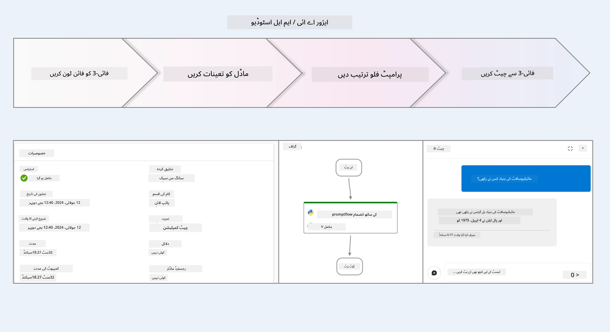

### فہرست مضامین

1. **[منظرنامہ 1: Azure وسائل سیٹ اپ کریں اور فائن ٹوننگ کے لیے تیار ہوں](../../../../../../md/02.Application/01.TextAndChat/Phi3)**
    - [Azure مشین لرننگ ورک اسپیس بنائیں](../../../../../../md/02.Application/01.TextAndChat/Phi3)
    - [Azure سبسکرپشن میں GPU کوٹس کی درخواست کریں](../../../../../../md/02.Application/01.TextAndChat/Phi3)
    - [رول اسائنمنٹ شامل کریں](../../../../../../md/02.Application/01.TextAndChat/Phi3)
    - [پروجیکٹ سیٹ اپ کریں](../../../../../../md/02.Application/01.TextAndChat/Phi3)
    - [فائن ٹوننگ کے لیے ڈیٹا سیٹ تیار کریں](../../../../../../md/02.Application/01.TextAndChat/Phi3)

1. **[منظرنامہ 2: Phi-3 ماڈل کو فائن ٹون کریں اور Azure مشین لرننگ اسٹوڈیو میں تعینات کریں](../../../../../../md/02.Application/01.TextAndChat/Phi3)**
    - [Phi-3 ماڈل کو فائن ٹون کریں](../../../../../../md/02.Application/01.TextAndChat/Phi3)
    - [فائن ٹون شدہ Phi-3 ماڈل تعینات کریں](../../../../../../md/02.Application/01.TextAndChat/Phi3)

1. **[منظرنامہ 3: پرامپٹ فلو کے ساتھ مربوط کریں اور مائیکروسافٹ فاؤنڈری میں اپنے کسٹم ماڈل کے ساتھ چیٹ کریں](../../../../../../md/02.Application/01.TextAndChat/Phi3)**
    - [کسٹم Phi-3 ماڈل کو پرامپٹ فلو کے ساتھ مربوط کریں](../../../../../../md/02.Application/01.TextAndChat/Phi3)
    - [اپنے کسٹم Phi-3 ماڈل کے ساتھ چیٹ کریں](../../../../../../md/02.Application/01.TextAndChat/Phi3)

## منظرنامہ 1: Azure وسائل سیٹ اپ کریں اور فائن ٹوننگ کے لیے تیار ہوں

### Azure مشین لرننگ ورک اسپیس بنائیں

1. پورٹل صفحے کے اوپر **تلاش بار** میں *azure machine learning* ٹائپ کریں اور نمودار ہونے والے اختیارات میں سے **Azure Machine Learning** منتخب کریں۔

    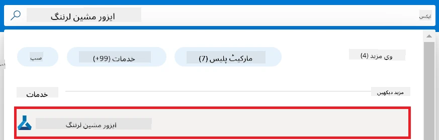

2. نیویگیشن مینو سے **+ Create** منتخب کریں۔

3. نیویگیشن مینو سے **New workspace** منتخب کریں۔

    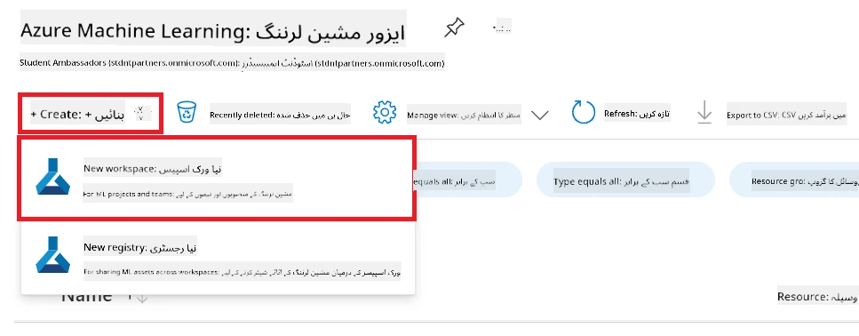

4. درج ذیل کام انجام دیں:

    - اپنی Azure **Subscription** منتخب کریں۔
    - استعمال کرنے کے لیے **Resource group** منتخب کریں (اگر ضرورت ہو تو نیا بنائیں)۔
    - **Workspace Name** درج کریں۔ یہ ایک منفرد قدر ہونی چاہیے۔
    - اپنی پسند کا **Region** منتخب کریں۔
    - استعمال کرنے کے لیے **Storage account** منتخب کریں (اگر ضرورت ہو تو نیا بنائیں)۔
    - استعمال کرنے کے لیے **Key vault** منتخب کریں (اگر ضرورت ہو تو نیا بنائیں)۔
    - استعمال کرنے کے لیے **Application insights** منتخب کریں (اگر ضرورت ہو تو نیا بنائیں)۔
    - استعمال کرنے کے لیے **Container registry** منتخب کریں (اگر ضرورت ہو تو نیا بنائیں)۔

    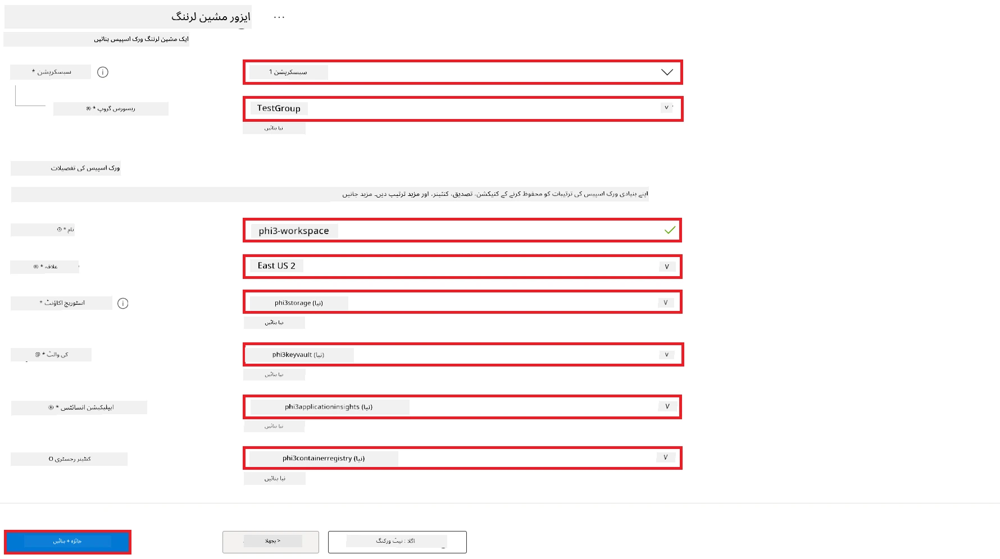

5. **Review + Create** منتخب کریں۔

6. **Create** منتخب کریں۔

### Azure سبسکرپشن میں GPU کوٹس کی درخواست کریں

اس سبق میں، آپ سیکھیں گے کہ کس طرح Phi-3 ماڈل کو GPU استعمال کرتے ہوئے فائن ٹون اور تعینات کیا جائے۔ فائن ٹوننگ کے لیے، آپ *Standard_NC24ads_A100_v4* GPU استعمال کریں گے، جس کے لیے کوٹہ درخواست درکار ہے۔ تعیناتی کے لیے، آپ *Standard_NC6s_v3* GPU استعمال کریں گے، جس کے لیے بھی کوٹہ درخواست ضروری ہے۔

> [!NOTE]
>
> صرف Pay-As-You-Go سبسکرپشنز (معیاری سبسکرپشن قسم) GPU الاؤنس کے اہل ہیں؛ فی الحال بینیفٹ سبسکرپشنز کی حمایت نہیں کی جاتی۔
>

1. [Azure ML Studio](https://ml.azure.com/home?wt.mc_id=studentamb_279723) پر جائیں۔

1. *Standard NCADSA100v4 Family* کوٹہ کی درخواست کے لیے درج ذیل اقدامات کریں:

    - بائیں طرف کے ٹیب سے **Quota** منتخب کریں۔
    - استعمال کرنے کے لیے **Virtual machine family** منتخب کریں۔ مثلاً، **Standard NCADSA100v4 Family Cluster Dedicated vCPUs** منتخب کریں، جس میں *Standard_NC24ads_A100_v4* GPU شامل ہے۔
    - نیویگیشن مینو سے **Request quota** منتخب کریں۔

        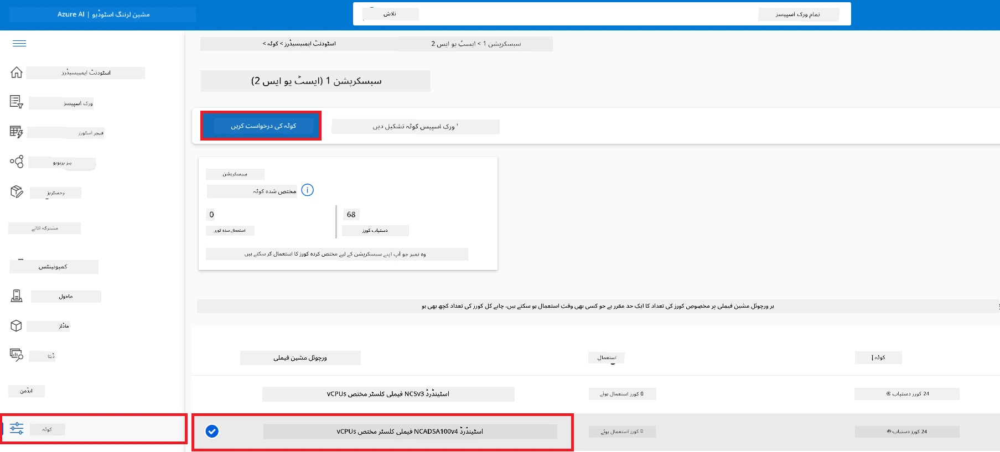

    - Request quota صفحے میں، آپ جس **New cores limit** کا استعمال کرنا چاہیں، درج کریں۔ مثال کے طور پر، 24۔
    - Request quota صفحے میں، GPU کوٹہ کی درخواست کے لیے **Submit** منتخب کریں۔

1. *Standard NCSv3 Family* کوٹہ کی درخواست کے لیے درج ذیل کام کریں:

    - بائیں طرف کے ٹیب سے **Quota** منتخب کریں۔
    - استعمال کرنے کے لیے **Virtual machine family** منتخب کریں۔ مثلاً، **Standard NCSv3 Family Cluster Dedicated vCPUs** منتخب کریں، جس میں *Standard_NC6s_v3* GPU شامل ہے۔
    - نیویگیشن مینو سے **Request quota** منتخب کریں۔
    - Request quota صفحے میں، آپ جس **New cores limit** کا استعمال کرنا چاہیں، درج کریں۔ مثال کے طور پر، 24۔
    - Request quota صفحے میں، GPU کوٹہ کی درخواست کے لیے **Submit** منتخب کریں۔

### رول اسائنمنٹ شامل کریں

اپنے ماڈلز کو فائن ٹون اور تعینات کرنے کے لیے، آپ کو پہلے ایک یوزر اسائنڈ منیجد آئیڈینٹیٹی (UAI) بنانی ہوگی اور اسے مناسب اجازتیں دینی ہوں گی۔ یہ UAI تعیناتی کے دوران تصدیق کے لیے استعمال ہوگی۔

#### یوزر اسائنڈ منیجد آئیڈینٹی (UAI) بنائیں

1. پورٹل پیج کے اوپر **تلاش بار** میں *managed identities* ٹائپ کریں اور نمودار ہونے والے اختیارات میں سے **Managed Identities** منتخب کریں۔

    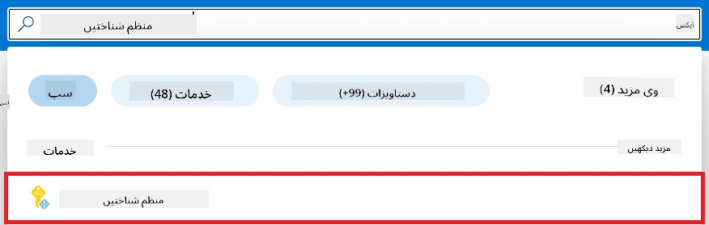

1. **+ Create** منتخب کریں۔

    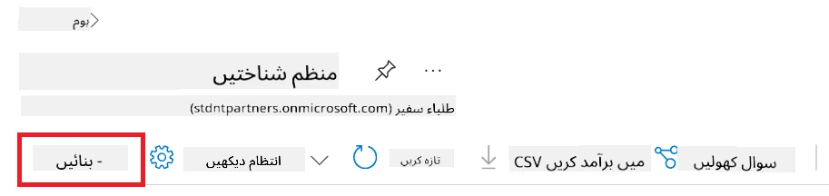

1. درج ذیل کام کریں:

    - اپنی Azure **Subscription** منتخب کریں۔
    - استعمال کرنے کے لیے **Resource group** منتخب کریں (اگر ضرورت ہو تو نیا بنائیں)۔
    - اپنی پسند کا **Region** منتخب کریں۔
    - **Name** درج کریں۔ یہ ایک منفرد قدر ہونی چاہیے۔

    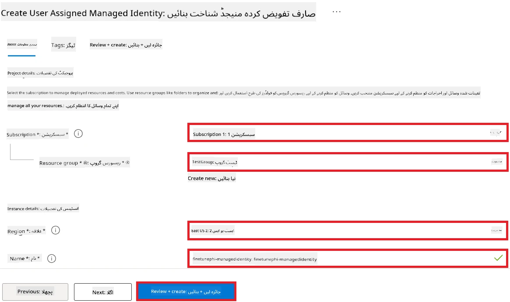

1. **Review + create** منتخب کریں۔

1. **+ Create** منتخب کریں۔

#### Managed Identity کو Contributor رول کی اسائنمنٹ شامل کریں

1. اس Managed Identity ریسورس پر جائیں جو آپ نے بنایا ہے۔

1. بائیں طرف کے ٹیب سے **Azure role assignments** منتخب کریں۔

1. نیویگیشن مینو سے **+Add role assignment** منتخب کریں۔

1. Add role assignment صفحے میں درج ذیل کام کریں:
    - **Scope** کو **Resource group** منتخب کریں۔
    - اپنی Azure **Subscription** منتخب کریں۔
    - استعمال کرنے کے لیے **Resource group** منتخب کریں۔
    - **Role** کو **Contributor** منتخب کریں۔

    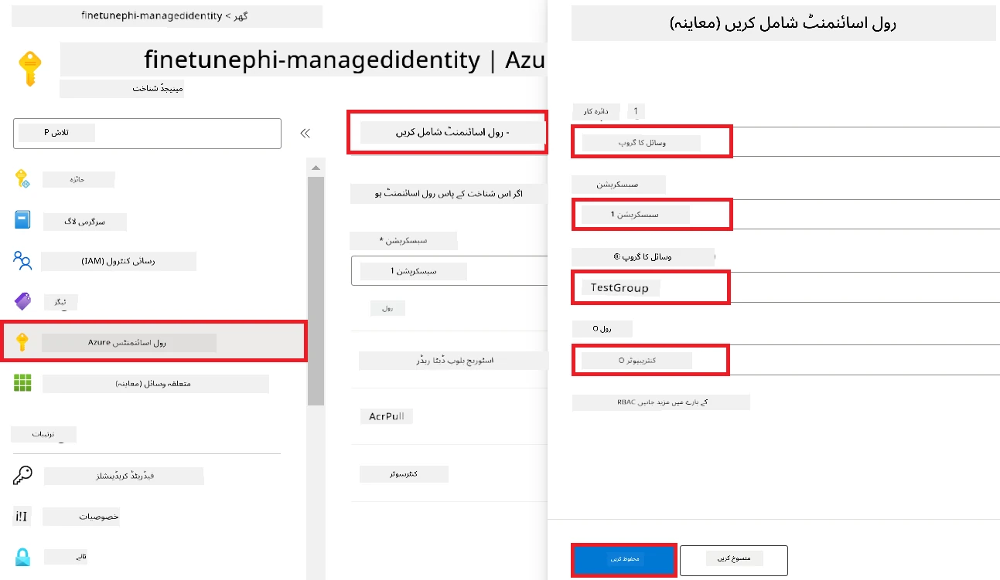

2. **Save** منتخب کریں۔

#### Managed Identity کو Storage Blob Data Reader رول کی اسائنمنٹ شامل کریں

1. پورٹل پیج کے اوپر **تلاش بار** میں *storage accounts* ٹائپ کریں اور نمودار ہونے والے اختیارات میں سے **Storage accounts** منتخب کریں۔

    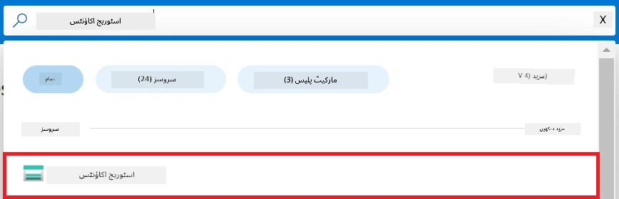

1. اس سٹوریج اکاؤنٹ کو منتخب کریں جو آپ نے Azure مشین لرننگ ورک اسپیس کے ساتھ منسلک کیا ہے۔ مثال کے طور پر، *finetunephistorage*۔

1. Add role assignment صفحے پر جانے کے لیے درج ذیل کام کریں:

    - اپنی بنائی ہوئی Azure سٹوریج اکاؤنٹ پر جائیں۔
    - بائیں طرف کے ٹیب سے **Access Control (IAM)** منتخب کریں۔
    - نیویگیشن مینو سے **+ Add** منتخب کریں۔
    - نیویگیشن مینو سے **Add role assignment** منتخب کریں۔

    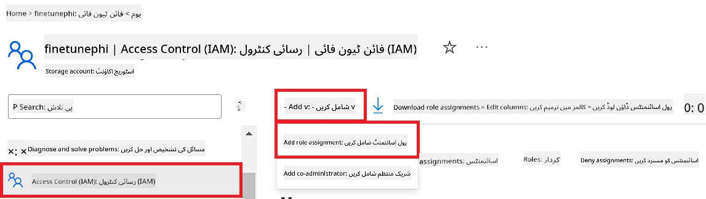

1. Add role assignment صفحے میں درج ذیل کام کریں:

    - Role صفحے میں، **search bar** میں *Storage Blob Data Reader* ٹائپ کریں اور نمودار ہونے والے اختیارات میں سے **Storage Blob Data Reader** منتخب کریں۔
    - Role صفحے میں، **Next** منتخب کریں۔
    - Members صفحے میں، **Assign access to** کے تحت **Managed identity** منتخب کریں۔
    - Members صفحے میں، **+ Select members** منتخب کریں۔
    - Select managed identities صفحے میں، اپنی Azure **Subscription** منتخب کریں۔
    - Select managed identities صفحے میں، **Managed identity** کو **Manage Identity** منتخب کریں۔
    - Select managed identities صفحے میں، جو Manage Identity آپ نے بنایا ہے، اسے منتخب کریں۔ مثال کے طور پر، *finetunephi-managedidentity*۔
    - Select managed identities صفحے میں، **Select** منتخب کریں۔

    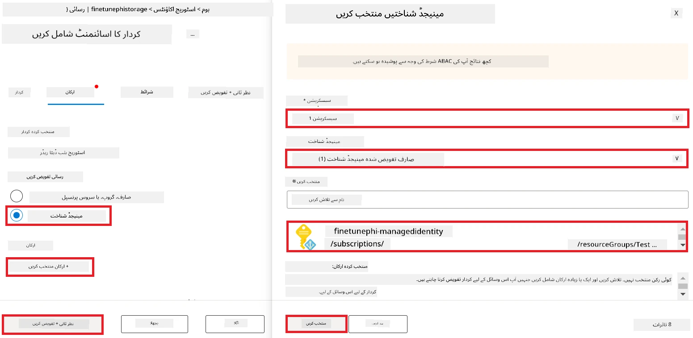

1. **Review + assign** منتخب کریں۔

#### Managed Identity کو AcrPull رول کی اسائنمنٹ شامل کریں

1. پورٹل پیج کے اوپر **تلاش بار** میں *container registries* ٹائپ کریں اور نمودار ہونے والے اختیارات میں سے **Container registries** منتخب کریں۔

    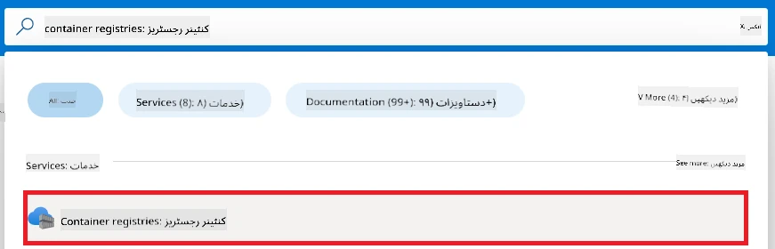

1. اس container registry کو منتخب کریں جو Azure مشین لرننگ ورک اسپیس کے ساتھ منسلک ہے۔ مثال کے طور پر، *finetunephicontainerregistry*

1. Add role assignment صفحے پر جانے کے لیے درج ذیل کام کریں:

    - بائیں طرف کے ٹیب سے **Access Control (IAM)** منتخب کریں۔
    - نیویگیشن مینو سے **+ Add** منتخب کریں۔
    - نیویگیشن مینو سے **Add role assignment** منتخب کریں۔

1. Add role assignment صفحے میں درج ذیل کام کریں:

    - Role صفحے میں، **search bar** میں *AcrPull* ٹائپ کریں اور نمودار ہونے والے اختیارات میں سے **AcrPull** منتخب کریں۔
    - Role صفحے میں، **Next** منتخب کریں۔
    - Members صفحے میں، **Assign access to** کے تحت **Managed identity** منتخب کریں۔
    - Members صفحے میں، **+ Select members** منتخب کریں۔
    - Select managed identities صفحے میں، اپنی Azure **Subscription** منتخب کریں۔
    - Select managed identities صفحے میں، **Managed identity** کو **Manage Identity** منتخب کریں۔
    - Select managed identities صفحے میں، جو Manage Identity آپ نے بنایا ہے، اسے منتخب کریں۔ مثال کے طور پر، *finetunephi-managedidentity*۔
    - Select managed identities صفحے میں، **Select** منتخب کریں۔
    - **Review + assign** منتخب کریں۔

### پروجیکٹ سیٹ اپ کریں

فائن ٹوننگ کے لیے درکار ڈیٹا سیٹس ڈاؤن لوڈ کرنے کے لیے، آپ کو ایک مقامی ماحول سیٹ اپ کرنا ہوگا۔

اس مشق میں، آپ

- ایک فولڈر بنائیں گے جس میں کام کریں گے۔
- ایک ورچوئل ماحول تیار کریں گے۔
- درکار پیکجز انسٹال کریں گے۔
- ایک *download_dataset.py* فائل بنائیں گے تاکہ ڈیٹا سیٹ ڈاؤن لوڈ کیا جا سکے۔

#### ایک فولڈر بنائیں جس میں کام کریں

1. ٹرمینل ونڈو کھولیں اور درج ذیل کمانڈ ٹائپ کریں تاکہ ڈیفالٹ راستے میں *finetune-phi* نام کا فولڈر بنایا جائے۔

    ```console
    mkdir finetune-phi
    ```

2. ٹرمینل میں درج ذیل کمانڈ ٹائپ کریں تاکہ آپ اس *finetune-phi* فولڈر میں جائیں جو آپ نے بنایا ہے۔

    ```console
    cd finetune-phi
    ```

#### ورچوئل ماحول تیار کریں

1. ٹرمینل میں درج ذیل کمانڈ ٹائپ کریں تاکہ *.venv* نام کا ورچوئل ماحول بنایا جائے۔
    ```console
    python -m venv .venv
    ```

2. اپنے ٹرمینل کے اندر مندرجہ ذیل کمانڈ ٹائپ کریں تاکہ ورچوئل ماحول کو فعال کیا جا سکے۔

    ```console
    .venv\Scripts\activate.bat
    ```

> [!NOTE]
> اگر یہ کامیاب ہوا، تو آپ کو کمانڈ پرامپٹ سے پہلے *(.venv)* نظر آنا چاہیے۔

#### مطلوبہ پیکجز انسٹال کریں

1. مطلوبہ پیکجز انسٹال کرنے کے لیے اپنے ٹرمینل کے اندر مندرجہ ذیل کمانڈز ٹائپ کریں۔

    ```console
    pip install datasets==2.19.1
    ```

#### `download_dataset.py` فائل بنائیں

> [!NOTE]
> مکمل فولڈر کی ساخت:
>
> ```text
> └── YourUserName
> .    └── finetune-phi
> .        └── download_dataset.py
> ```

1. **Visual Studio Code** کو کھولیں۔

1. مینو بار سے **File** منتخب کریں۔

1. **Open Folder** منتخب کریں۔

1. *finetune-phi* فولڈر منتخب کریں جو آپ نے بنایا ہے، جو کہ *C:\Users\yourUserName\finetune-phi* پر واقع ہے۔

    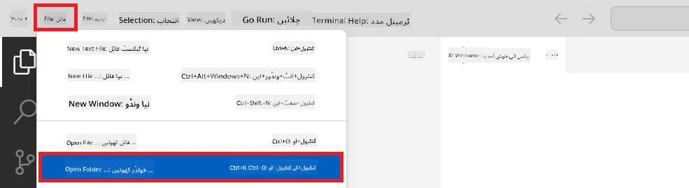

1. Visual Studio Code کے بائیں پین میں، رائٹ کلک کریں اور **New File** منتخب کریں تاکہ *download_dataset.py* نامی نئی فائل بنائی جا سکے۔

    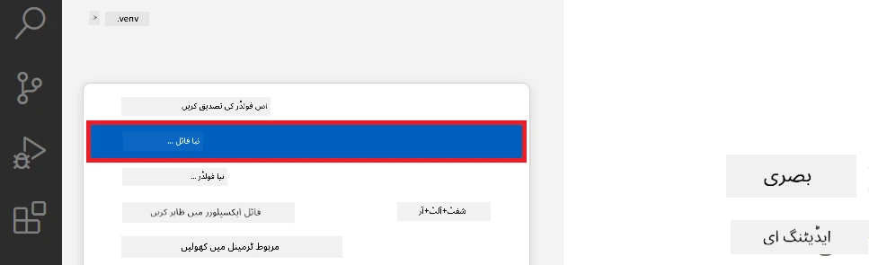

### فائن ٹوننگ کے لیے ڈیٹا سیٹ تیار کریں

اس مشق میں، آپ *download_dataset.py* فائل چلائیں گے تاکہ *ultrachat_200k* ڈیٹا سیٹ کو اپنے مقامی ماحول میں ڈاؤن لوڈ کیا جا سکے۔ پھر آپ اس ڈیٹا سیٹ کو Azure Machine Learning میں Phi-3 ماڈل کی فائن ٹوننگ کے لیے استعمال کریں گے۔

اس مشق میں، آپ:

- *download_dataset.py* فائل میں کوڈ شامل کریں گے تاکہ ڈیٹا سیٹ ڈاؤن لوڈ ہو سکیں۔
- *download_dataset.py* فائل چلائیں گے تاکہ ڈیٹا سیٹ آپ کے لوکل ماحول میں ڈاؤن لوڈ ہو سکیں۔

#### *download_dataset.py* کے ذریعے اپنا ڈیٹا سیٹ ڈاؤن لوڈ کریں

1. Visual Studio Code میں *download_dataset.py* فائل کھولیں۔

1. مندرجہ ذیل کوڈ *download_dataset.py* فائل میں شامل کریں۔

    ```python
    import json
    import os
    from datasets import load_dataset

    def load_and_split_dataset(dataset_name, config_name, split_ratio):
        """
        Load and split a dataset.
        """
        # مخصوص کردہ نام، ترتیب، اور تقسیم کی شرح کے ساتھ ڈیٹا سیٹ لوڈ کریں
        dataset = load_dataset(dataset_name, config_name, split=split_ratio)
        print(f"Original dataset size: {len(dataset)}")
        
        # ڈیٹا سیٹ کو تربیت اور آزمائشی سیٹوں میں تقسیم کریں (80٪ تربیت، 20٪ آزمائش)
        split_dataset = dataset.train_test_split(test_size=0.2)
        print(f"Train dataset size: {len(split_dataset['train'])}")
        print(f"Test dataset size: {len(split_dataset['test'])}")
        
        return split_dataset

    def save_dataset_to_jsonl(dataset, filepath):
        """
        Save a dataset to a JSONL file.
        """
        # اگر ڈائریکٹری موجود نہ ہو تو اسے بنائیں
        os.makedirs(os.path.dirname(filepath), exist_ok=True)
        
        # فائل کو تحریری وضع میں کھولیں
        with open(filepath, 'w', encoding='utf-8') as f:
            # ڈیٹا سیٹ میں ہر ریکارڈ پر تکرار کریں
            for record in dataset:
                # ریکارڈ کو JSON آبجیکٹ کی صورت میں نکالیں اور اسے فائل میں لکھیں
                json.dump(record, f)
                # ریکارڈز کو الگ کرنے کے لیے نیا لائن کریکٹر لکھیں
                f.write('\n')
        
        print(f"Dataset saved to {filepath}")

    def main():
        """
        Main function to load, split, and save the dataset.
        """
        # مخصوص ترتیب اور تقسیم کی شرح کے ساتھ ULTRACHAT_200k ڈیٹا سیٹ لوڈ اور تقسیم کریں
        dataset = load_and_split_dataset("HuggingFaceH4/ultrachat_200k", 'default', 'train_sft[:1%]')
        
        # تقسیم شدہ ڈیٹا سے تربیتی اور آزمائشی ڈیٹا سیٹ نکالیں
        train_dataset = dataset['train']
        test_dataset = dataset['test']

        # تربیتی ڈیٹا سیٹ کو JSONL فائل میں محفوظ کریں
        save_dataset_to_jsonl(train_dataset, "data/train_data.jsonl")
        
        # آزمائشی ڈیٹا سیٹ کو ایک الگ JSONL فائل میں محفوظ کریں
        save_dataset_to_jsonl(test_dataset, "data/test_data.jsonl")

    if __name__ == "__main__":
        main()

    ```

1. اسکرپٹ چلانے اور ڈیٹا سیٹ کو اپنے مقامی ماحول میں ڈاؤن لوڈ کرنے کے لیے ٹرمینل میں درج ذیل کمانڈ ٹائپ کریں۔

    ```console
    python download_dataset.py
    ```

1. تصدیق کریں کہ ڈیٹا سیٹ کامیابی کے ساتھ آپ کے لوکل *finetune-phi/data* ڈائریکٹری میں محفوظ ہو گئے ہیں۔

> [!NOTE]
>
> #### ڈیٹا سیٹ کے حجم اور فائن ٹوننگ کے وقت پر ایک نوٹ
>
> اس سبق میں، آپ صرف ڈیٹا سیٹ کا 1٪ (`split='train[:1%]'`) استعمال کرتے ہیں۔ اس سے ڈیٹا کی مقدار نمایاں طور پر کم ہو جاتی ہے، جس کی وجہ سے اپلوڈ اور فائن ٹوننگ دونوں عمل تیز ہو جاتے ہیں۔ آپ تربیتی وقت اور ماڈل کی کارکردگی کے درمیان صحیح توازن تلاش کرنے کے لیے فیصدی مقدار کو ایڈجسٹ کر سکتے ہیں۔ ڈیٹا سیٹ کے چھوٹے حصے کا استعمال فائن ٹوننگ کے لیے درکار وقت کو کم کرتا ہے، جس سے سبق کے لیے عمل کو زیادہ قابلِ انتظام بنایا جاتا ہے۔

## منظر نامہ 2: Phi-3 ماڈل کی فائن ٹوننگ اور Azure Machine Learning Studio میں تعیناتی

### Phi-3 ماڈل کو فائن ٹون کریں

اس مشق میں، آپ Azure Machine Learning Studio میں Phi-3 ماڈل کی فائن ٹوننگ کریں گے۔

اس مشق میں، آپ:

- فائن ٹوننگ کے لیے کمپیوٹر کلسٹر بنائیں گے۔
- Azure Machine Learning Studio میں Phi-3 ماڈل کو فائن ٹون کریں گے۔

#### فائن ٹوننگ کے لیے کمپیوٹر کلسٹر بنائیں

1. [Azure ML Studio](https://ml.azure.com/home?wt.mc_id=studentamb_279723) پر جائیں۔

1. بائیں طرف کے ٹیب سے **Compute** منتخب کریں۔

1. نیویگیشن مینو سے **Compute clusters** منتخب کریں۔

1. **+ New** منتخب کریں۔

    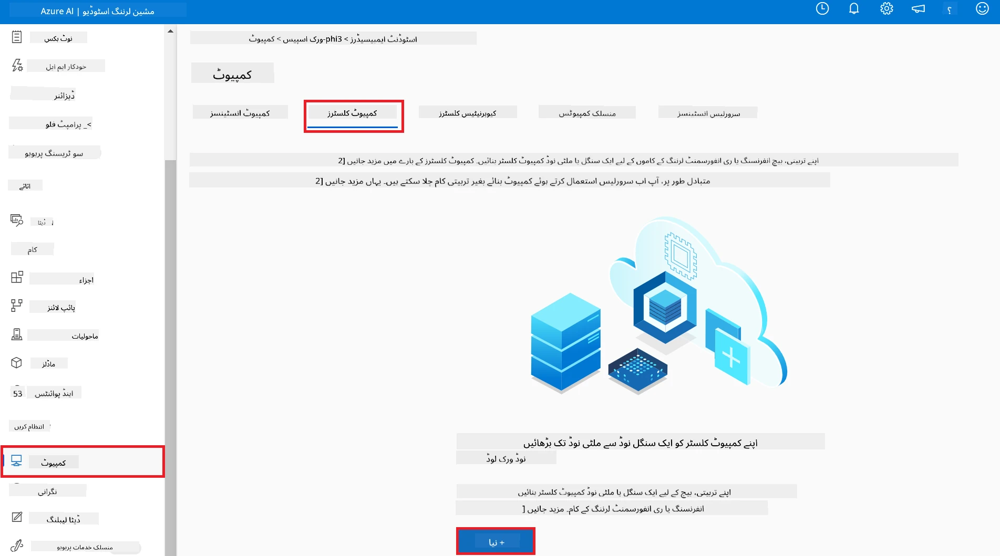

1. درج ذیل کام انجام دیں:

    - وہ **Region** منتخب کریں جسے آپ استعمال کرنا چاہتے ہیں۔
    - **Virtual machine tier** کو **Dedicated** منتخب کریں۔
    - **Virtual machine type** کو **GPU** منتخب کریں۔
    - **Virtual machine size** فلٹر کو **Select from all options** پر سیٹ کریں۔
    - **Virtual machine size** کو **Standard_NC24ads_A100_v4** منتخب کریں۔

    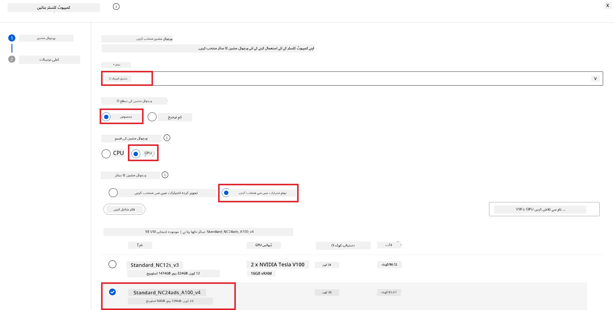

1. **Next** منتخب کریں۔

1. درج ذیل کام انجام دیں:

    - **Compute name** درج کریں۔ یہ منفرد ہونا ضروری ہے۔
    - **Minimum number of nodes** کو **0** منتخب کریں۔
    - **Maximum number of nodes** کو **1** منتخب کریں۔
    - **Idle seconds before scale down** کو **120** منتخب کریں۔

    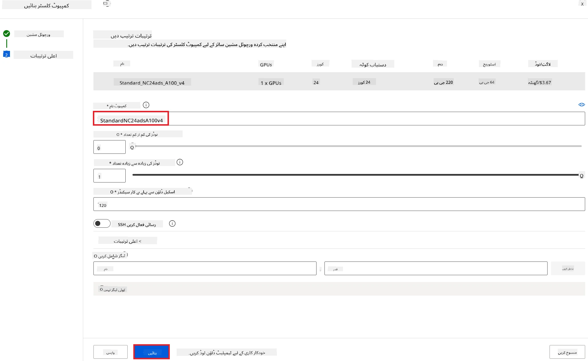

1. **Create** منتخب کریں۔

#### Phi-3 ماڈل کو فائن ٹون کریں

1. [Azure ML Studio](https://ml.azure.com/home?wt.mc_id=studentamb_279723) پر جائیں۔

1. وہ Azure Machine Learning ورک اسپیس منتخب کریں جو آپ نے بنایا ہے۔

    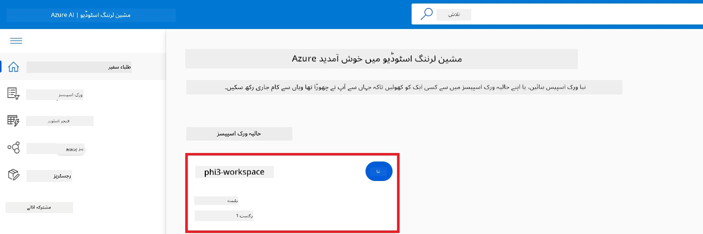

1. درج ذیل کام کریں:

    - بائیں طرف کے ٹیب میں سے **Model catalog** منتخب کریں۔
    - **search bar** میں *phi-3-mini-4k* ٹائپ کریں اور ظاہر ہونے والے آپشنز میں سے **Phi-3-mini-4k-instruct** منتخب کریں۔

    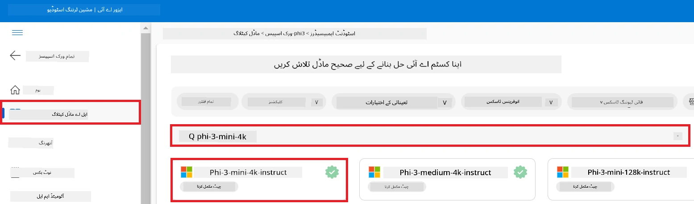

1. نیویگیشن مینو سے **Fine-tune** منتخب کریں۔

    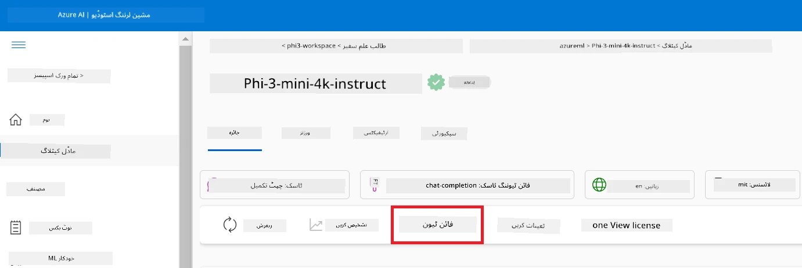

1. درج ذیل کام انجام دیں:

    - **Select task type** کو **Chat completion** منتخب کریں۔
    - **+ Select data** پر کلک کریں تاکہ **Training data** اپلوڈ کریں۔
    - Validation data اپلوڈ کی قسم کو **Provide different validation data** منتخب کریں۔
    - **+ Select data** پر کلک کریں تاکہ **Validation data** اپلوڈ کریں۔

    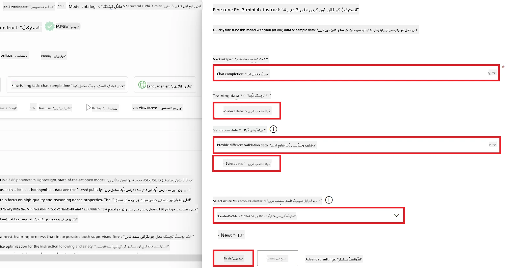

> [!TIP]
>
> آپ **Advanced settings** منتخب کر کے **learning_rate** اور **lr_scheduler_type** جیسی ترتیبات کو اپنی مخصوص ضروریات کے مطابق بہتر بنا سکتے ہیں تاکہ فائن ٹوننگ کے عمل کو بہتر بنایا جا سکے۔

1. **Finish** منتخب کریں۔

1. اس مشق میں، آپ نے Azure Machine Learning کی مدد سے کامیابی کے ساتھ Phi-3 ماڈل کی فائن ٹوننگ کی۔ براہ کرم نوٹ کریں کہ فائن ٹوننگ کا عمل کافی وقت لے سکتا ہے۔ فائن ٹوننگ جاب چلانے کے بعد، آپ کو اس کے مکمل ہونے کا انتظار کرنا ہوگا۔ آپ Azure Machine Learning ورک اسپیس کے بائیں طرف موجود Jobs ٹیب میں جا کر فائن ٹوننگ جاب کی صورتحال مانیٹر کر سکتے ہیں۔ اگلی سیریز میں، آپ فائن ٹون کیا ہوا ماڈل تعینات کریں گے اور اسے Prompt flow کے ساتھ مربوط کریں گے۔

    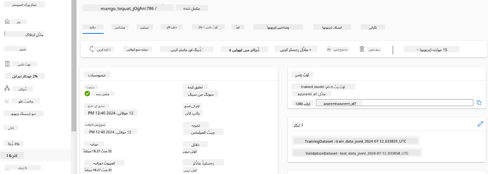

### فائن ٹون کیا ہوا Phi-3 ماڈل تعینات کریں

Prompt flow کے ساتھ فائن ٹون کیا ہوا Phi-3 ماڈل مربوط کرنے کے لیے، آپ کو ماڈل کو ریئل ٹائم انفرنس کے لیے قابل رسائی بنانے کے لیے تعینات کرنا ہوگا۔ اس عمل میں ماڈل کی رجسٹریشن، آن لائن اینڈ پوائنٹ بنانا، اور ماڈل کی تعیناتی شامل ہے۔

اس مشق میں، آپ:

- Azure Machine Learning ورک اسپیس میں فائن ٹون کیا ہوا ماڈل رجسٹر کریں گے۔
- ایک آن لائن اینڈ پوائنٹ بنائیں گے۔
- رجسٹر شدہ فائن ٹون کیا ہوا Phi-3 ماڈل تعینات کریں گے۔

#### فائن ٹون کیا ہوا ماڈل رجسٹر کریں

1. [Azure ML Studio](https://ml.azure.com/home?wt.mc_id=studentamb_279723) پر جائیں۔

1. وہ Azure Machine Learning ورک اسپیس منتخب کریں جو آپ نے بنایا ہے۔

    

1. بائیں طرف کے ٹیب میں سے **Models** منتخب کریں۔
1. **+ Register** منتخب کریں۔
1. **From a job output** منتخب کریں۔

    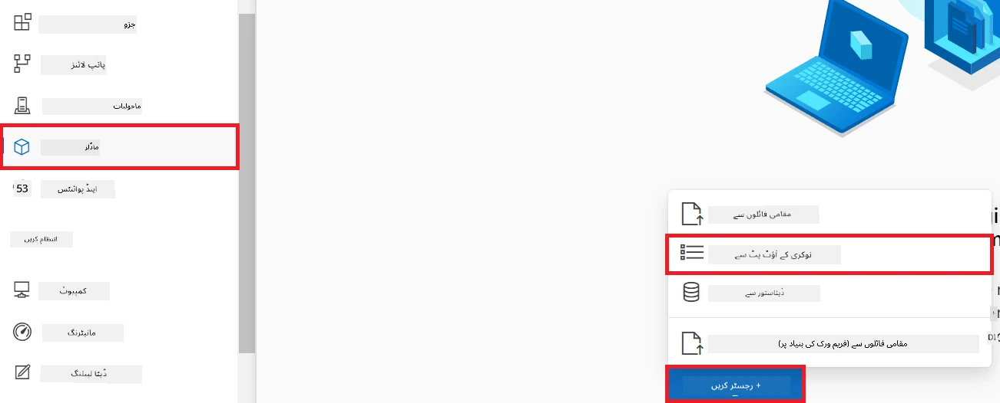

1. وہ جاب منتخب کریں جو آپ نے چلائی ہے۔

    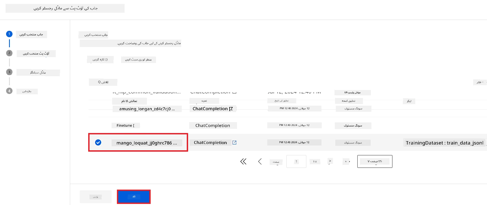

1. **Next** منتخب کریں۔

1. **Model type** کو **MLflow** منتخب کریں۔

1. یقینی بنائیں کہ **Job output** منتخب ہے؛ یہ خود بخود منتخب ہونا چاہیے۔

    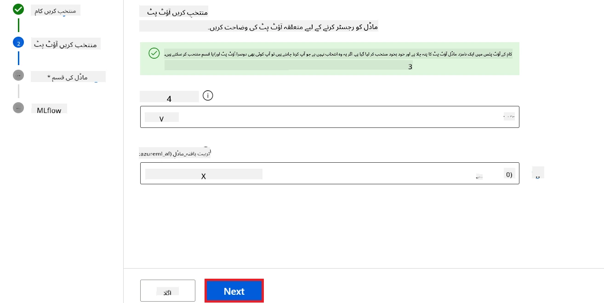

2. **Next** منتخب کریں۔

3. **Register** منتخب کریں۔

    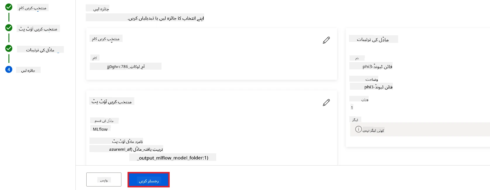

4. آپ بائیں طرف کے ٹیب میں **Models** مینو میں جا کر اپنا رجسٹر شدہ ماڈل دیکھ سکتے ہیں۔

    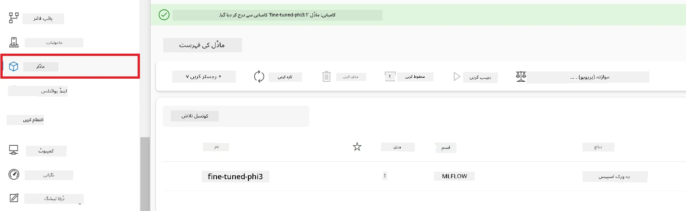

#### فائن ٹون کیا ہوا ماڈل تعینات کریں

1. اپنے بنایا ہوا Azure Machine Learning ورک اسپیس کھولیں۔

1. بائیں طرف کے ٹیب میں سے **Endpoints** منتخب کریں۔

1. نیویگیشن مینو میں سے **Real-time endpoints** منتخب کریں۔

    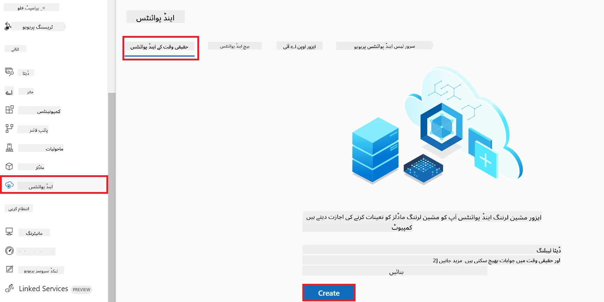

1. **Create** منتخب کریں۔

1. اپنا رجسٹر شدہ ماڈل منتخب کریں۔

    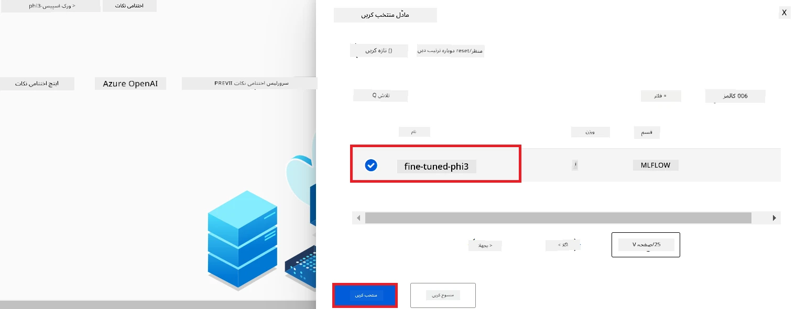

1. **Select** منتخب کریں۔

1. درج ذیل کریں:

    - **Virtual machine** کو *Standard_NC6s_v3* منتخب کریں۔
    - اس کا **Instance count** منتخب کریں جو آپ استعمال کرنا چاہتے ہیں۔ مثلاً، *1*۔
    - **Endpoint** کو **New** منتخب کریں تاکہ نیا اینڈ پوائنٹ بنایا جا سکے۔
    - **Endpoint name** درج کریں۔ یہ منفرد ہونا چاہیے۔
    - **Deployment name** درج کریں۔ یہ بھی منفرد ہونا چاہیے۔

    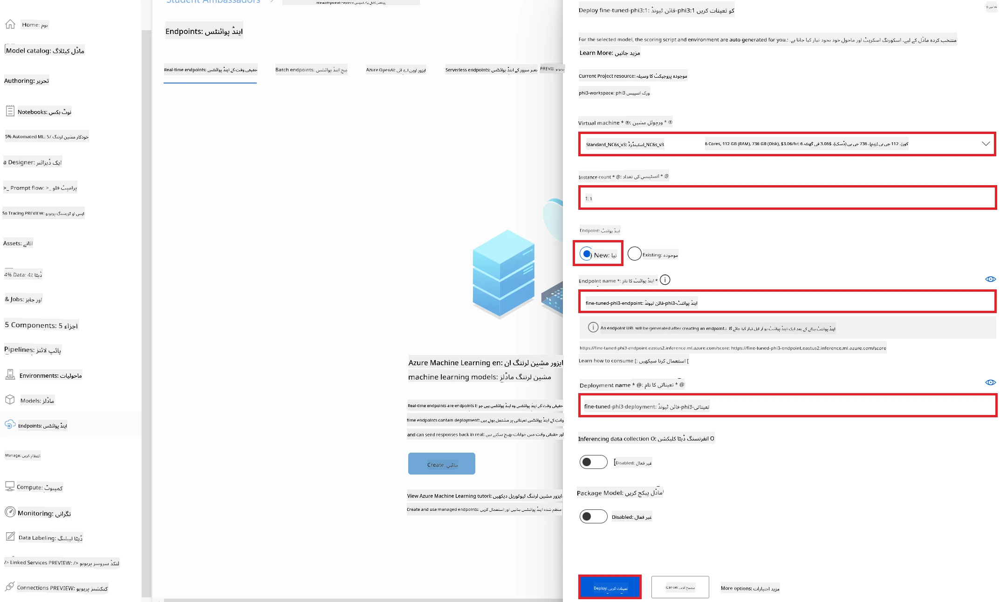

1. **Deploy** منتخب کریں۔

> [!WARNING]
> اپنے اکاؤنٹ پر اضافی چارجز سے بچنے کے لیے، Azure Machine Learning ورک اسپیس میں بنایا ہوا اینڈ پوائنٹ حذف کرنا یقینی بنائیں۔
>

#### Azure Machine Learning ورک اسپیس میں تعیناتی کی حیثیت چیک کریں

1. اپنے بنائے ہوئے Azure Machine Learning ورک اسپیس پر جائیں۔

1. بائیں طرف کے ٹیب میں سے **Endpoints** منتخب کریں۔

1. وہ اینڈ پوائنٹ منتخب کریں جو آپ نے بنایا ہے۔

    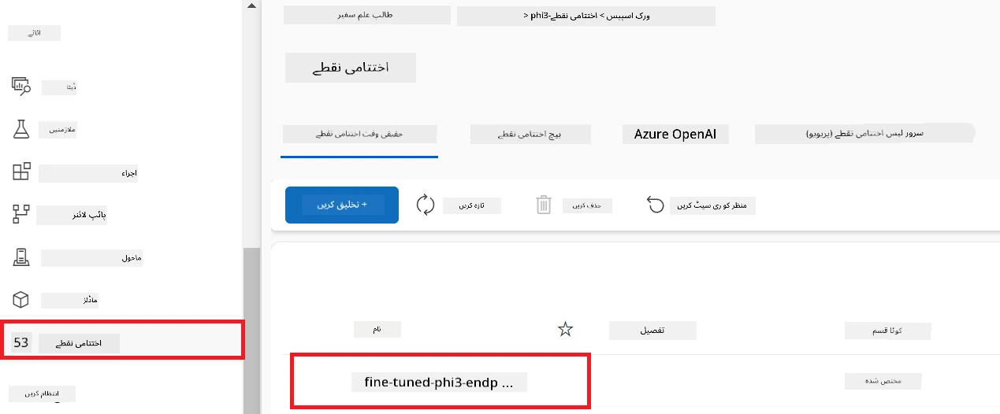

1. اس صفحہ پر، آپ تعیناتی کے دوران اینڈ پوائنٹس کو منظم کر سکتے ہیں۔

> [!NOTE]
> جب تعیناتی مکمل ہو جائے، تو یقینی بنائیں کہ **Live traffic** 100% پر سیٹ ہے۔ اگر نہیں ہے، تو **Update traffic** منتخب کریں تاکہ ٹریفک کی ترتیبات کو ایڈجسٹ کیا جا سکے۔ یاد رکھیں کہ اگر ٹریفک 0% پر سیٹ ہو تو آپ ماڈل کو ٹیسٹ نہیں کر سکتے۔
>
> 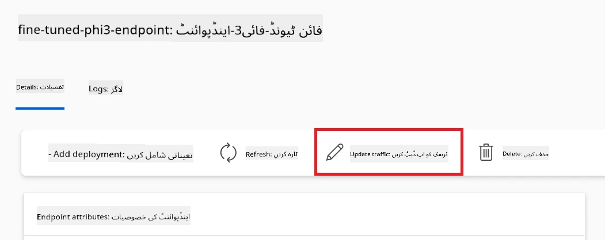
>

## منظر نامہ 3: Prompt flow کے ساتھ انضمام کریں اور Microsoft Foundry میں اپنے کسٹم ماڈل سے چیٹ کریں

### Prompt flow کے ساتھ کسٹم Phi-3 ماڈل کو مربوط کریں

اپنے کامیابی سے تعینات کردہ فائن ٹون ماڈل کے بعد، آپ اب اسے Prompt Flow کے ساتھ مربوط کر سکتے ہیں تاکہ آپ اپنے ماڈل کو ریئل ٹائم ایپلیکیشنز میں استعمال کر سکیں، جو آپ کے کسٹم Phi-3 ماڈل کے ساتھ کئی قسم کے انٹرایکٹو کاموں کو ممکن بناتا ہے۔

اس مشق میں، آپ:

- Microsoft Foundry Hub بنائیں گے۔
- Microsoft Foundry پروجیکٹ بنائیں گے۔
- Prompt flow بنائیں گے۔
- فائن ٹون کیا ہوا Phi-3 ماڈل کے لیے کسٹم کنکشن شامل کریں گے۔
- اپنے کسٹم Phi-3 ماڈل کے ساتھ چیٹ کرنے کے لیے Prompt flow سیٹ اپ کریں گے۔

> [!NOTE]
> آپ Azure ML Studio کا استعمال کرتے ہوئے بھی Promptflow میں انضمام کر سکتے ہیں۔ یہی انضمام کا عمل Azure ML Studio پر بھی لاگو ہوتا ہے۔

#### Microsoft Foundry Hub بنائیں

پروجیکٹ بنانے سے پہلے آپ کو ایک Hub بنانا ہوگا۔ ایک Hub ایک Resource Group کی طرح کام کرتا ہے، جو Microsoft Foundry میں متعدد پروجیکٹس کو منظم اور ترتیب دینے کی اجازت دیتا ہے۔
1. ملاحظہ کریں [Microsoft Foundry](https://ai.azure.com/?WT.mc_id=aiml-137032-kinfeylo)۔

1. بائیں جانب کے ٹیب سے **All hubs** منتخب کریں۔

1. نیویگیشن مینو سے **+ New hub** منتخب کریں۔

    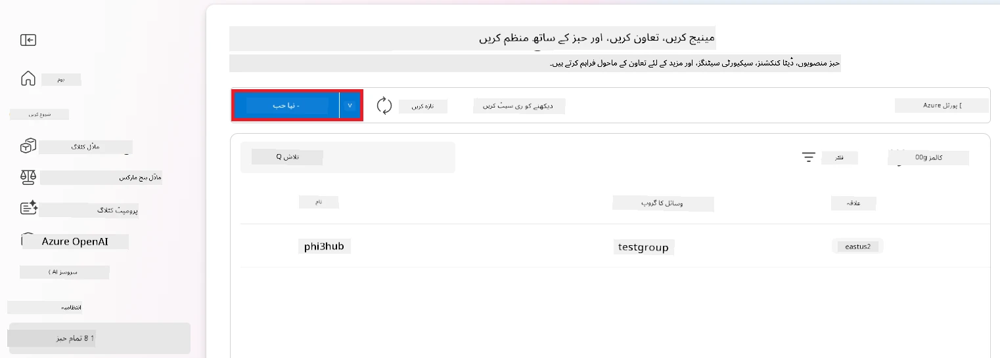

1. درج ذیل کام انجام دیں:

    - **Hub name** درج کریں۔ یہ منفرد قیمت ہونی چاہیے۔
    - اپنی Azure **Subscription** منتخب کریں۔
    - استعمال کے لیے **Resource group** منتخب کریں (اگر ضرورت ہو تو نیا بنائیں)۔
    - پسندیدہ **Location** منتخب کریں۔
    - استعمال کے لیے **Connect Azure AI Services** منتخب کریں (اگر ضرورت ہو تو نیا بنائیں)۔
    - **Connect Azure AI Search** کو **Skip connecting** پر منتخب کریں۔

    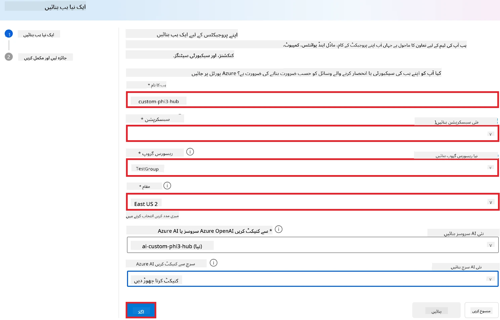

1. **Next** منتخب کریں۔

#### Microsoft Foundry پروجیکٹ بنائیں

1. اس Hub میں جو آپ نے بنایا ہے، بائیں جانب کے ٹیب سے **All projects** منتخب کریں۔

1. نیویگیشن مینو سے **+ New project** منتخب کریں۔

    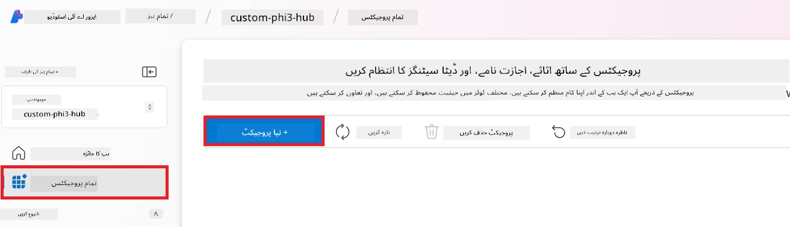

1. **Project name** درج کریں۔ یہ منفرد ہونا ضروری ہے۔

    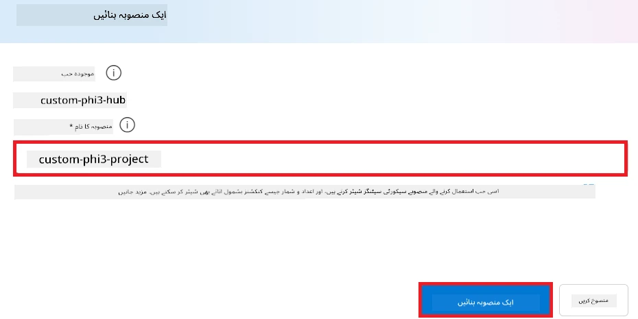

1. **Create a project** منتخب کریں۔

#### fine-tuned Phi-3 ماڈل کے لیے کسٹم کنکشن شامل کریں

اپنے کسٹم Phi-3 ماڈل کو Prompt flow کے ساتھ مربوط کرنے کے لیے، آپ کو ماڈل کا endpoint اور key کسٹم کنکشن میں محفوظ کرنا ہوگا۔ اس سیٹ اپ سے Prompt flow میں آپ کے کسٹم Phi-3 ماڈل تک رسائی ممکن ہوگی۔

#### fine-tuned Phi-3 ماڈل کا api key اور endpoint uri سیٹ کریں

1. ملاحظہ کریں [Azure ML Studio](https://ml.azure.com/home?WT.mc_id=aiml-137032-kinfeylo)۔

1. اس Azure Machine learning workspace پر جائیں جو آپ نے بنایا ہے۔

1. بائیں طرف سے **Endpoints** منتخب کریں۔

    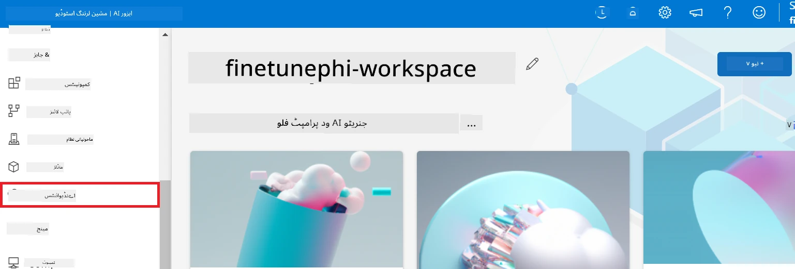

1. جو endpoint آپ نے بنایا ہے اسے منتخب کریں۔

    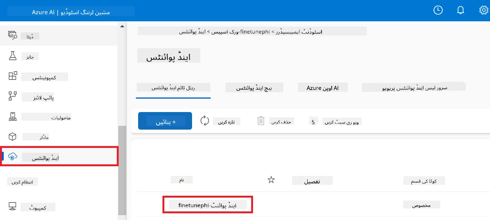

1. نیویگیشن مینو سے **Consume** منتخب کریں۔

1. اپنا **REST endpoint** اور **Primary key** کاپی کریں۔

    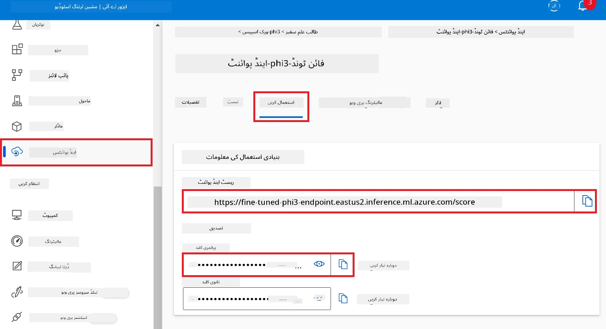

#### کسٹم کنکشن شامل کریں

1. ملاحظہ کریں [Microsoft Foundry](https://ai.azure.com/?WT.mc_id=aiml-137032-kinfeylo)۔

1. اپنے بنائے ہوئے Microsoft Foundry پروجیکٹ پر جائیں۔

1. اس پروجیکٹ میں، بائیں جانب کے ٹیب سے **Settings** منتخب کریں۔

1. **+ New connection** منتخب کریں۔

    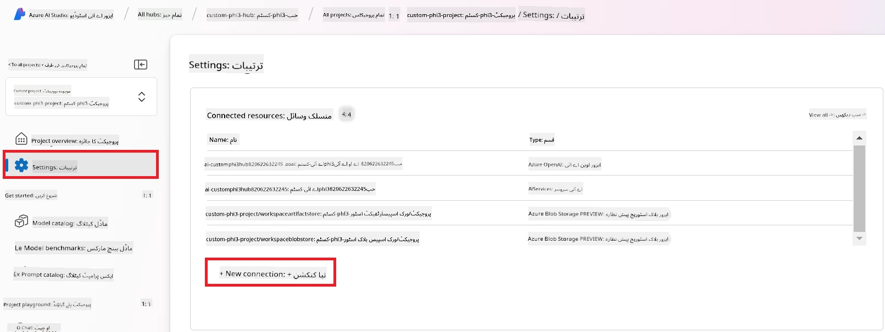

1. نیویگیشن مینو سے **Custom keys** منتخب کریں۔

    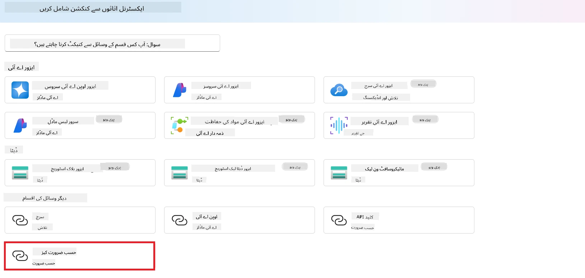

1. درج ذیل کام انجام دیں:

    - **+ Add key value pairs** منتخب کریں۔
    - key کے نام کے طور پر **endpoint** درج کریں اور Azure ML Studio سے کاپی کیا ہوا endpoint value فیلڈ میں پیسٹ کریں۔
    - دوبارہ **+ Add key value pairs** منتخب کریں۔
    - key کے نام کے طور پر **key** درج کریں اور Azure ML Studio سے کاپی کیا ہوا key value فیلڈ میں پیسٹ کریں۔
    - keys شامل کرنے کے بعد **is secret** منتخب کریں تاکہ key افشاء نہ ہو۔

    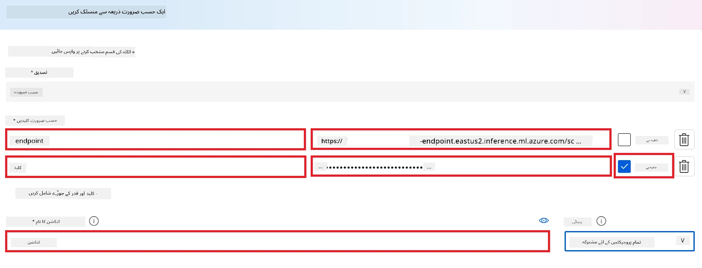

1. **Add connection** منتخب کریں۔

#### Prompt flow بنائیں

آپ نے Microsoft Foundry میں کسٹم کنکشن شامل کر لیا ہے۔ اب ہم درج ذیل مراحل سے Prompt flow بنائیں گے۔ پھر آپ اس Prompt flow کو کسٹم کنکشن سے منسلک کریں گے تاکہ آپ fine-tuned ماڈل کو Prompt flow کے اندر استعمال کر سکیں۔

1. اپنے بنائے ہوئے Microsoft Foundry پروجیکٹ پر جائیں۔

1. بائیں جانب کے ٹیب سے **Prompt flow** منتخب کریں۔

1. نیویگیشن مینو سے **+ Create** منتخب کریں۔

    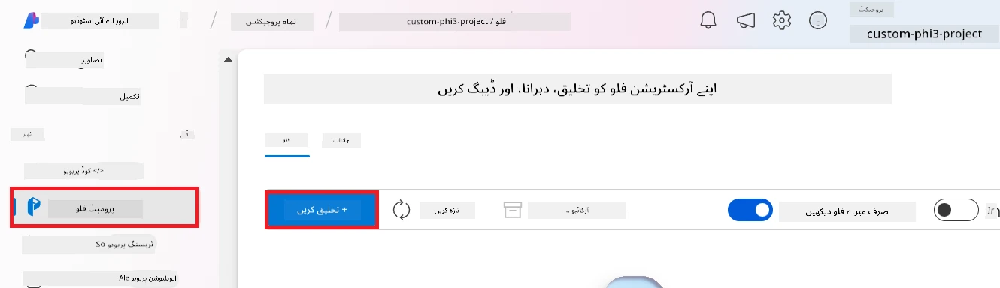

1. نیویگیشن مینو سے **Chat flow** منتخب کریں۔

    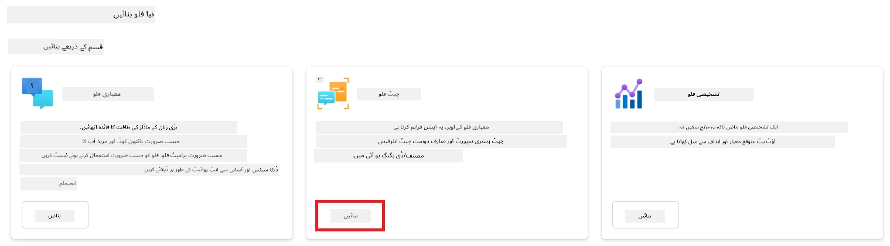

1. استعمال کے لیے **Folder name** درج کریں۔

    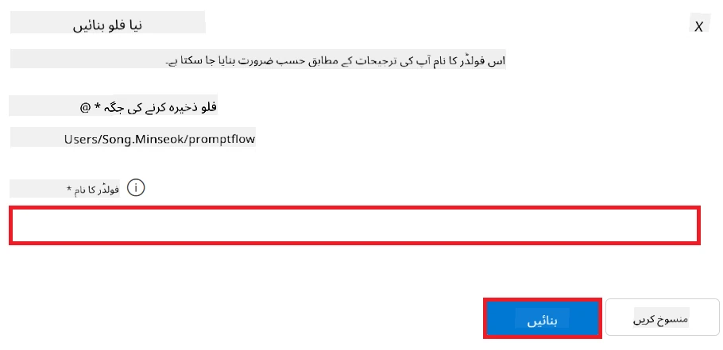

2. **Create** منتخب کریں۔

#### اپنے custom Phi-3 ماڈل سے بات چیت کے لیے Prompt flow ترتیب دیں

آپ کو fine-tuned Phi-3 ماڈل کو Prompt flow میں شامل کرنا ہوگا۔ موجودہ فراہم کردہ Prompt flow اس مقصد کے لیے نہیں بنایا گیا، اس لیے آپ کو Prompt flow کو دوبارہ ڈیزائن کرنا ہوگا تاکہ custom ماڈل کو شامل کیا جا سکے۔

1. Prompt flow میں موجودہ flow کو دوبارہ بنانے کے لیے درج ذیل کام کریں:

    - **Raw file mode** منتخب کریں۔
    - *flow.dag.yml* فائل میں موجود تمام کوڈ حذف کریں۔
    - *flow.dag.yml* فائل میں درج ذیل کوڈ شامل کریں۔

        ```yml
        inputs:
          input_data:
            type: string
            default: "Who founded Microsoft?"

        outputs:
          answer:
            type: string
            reference: ${integrate_with_promptflow.output}

        nodes:
        - name: integrate_with_promptflow
          type: python
          source:
            type: code
            path: integrate_with_promptflow.py
          inputs:
            input_data: ${inputs.input_data}
        ```

    - **Save** منتخب کریں۔

    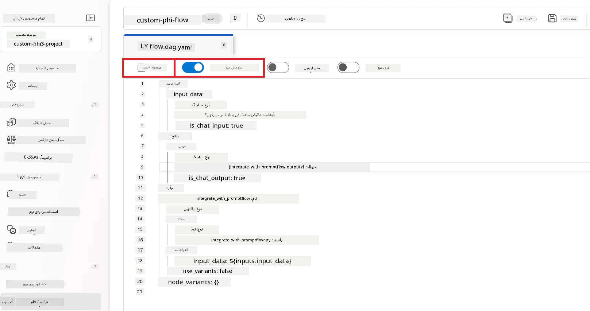

1. *integrate_with_promptflow.py* فائل میں درج ذیل کوڈ شامل کریں تاکہ custom Phi-3 ماڈل کو Prompt flow میں استعمال کیا جا سکے۔

    ```python
    import logging
    import requests
    from promptflow import tool
    from promptflow.connections import CustomConnection

    # لاگنگ کی ترتیب
    logging.basicConfig(
        format="%(asctime)s - %(levelname)s - %(name)s - %(message)s",
        datefmt="%Y-%m-%d %H:%M:%S",
        level=logging.DEBUG
    )
    logger = logging.getLogger(__name__)

    def query_phi3_model(input_data: str, connection: CustomConnection) -> str:
        """
        Send a request to the Phi-3 model endpoint with the given input data using Custom Connection.
        """

        # "connection" کسٹم کنکشن کا نام ہے، "endpoint" اور "key" کسٹم کنکشن میں کلیدیں ہیں
        endpoint_url = connection.endpoint
        api_key = connection.key

        headers = {
            "Content-Type": "application/json",
            "Authorization": f"Bearer {api_key}"
        }
        data = {
            "input_data": {
                "input_string": [
                    {"role": "user", "content": input_data}
                ],
                "parameters": {
                    "temperature": 0.7,
                    "max_new_tokens": 128
                }
            }
        }
        try:
            response = requests.post(endpoint_url, json=data, headers=headers)
            response.raise_for_status()
            
            # مکمل JSON جواب لاگ کریں
            logger.debug(f"Full JSON response: {response.json()}")

            result = response.json()["output"]
            logger.info("Successfully received response from Azure ML Endpoint.")
            return result
        except requests.exceptions.RequestException as e:
            logger.error(f"Error querying Azure ML Endpoint: {e}")
            raise

    @tool
    def my_python_tool(input_data: str, connection: CustomConnection) -> str:
        """
        Tool function to process input data and query the Phi-3 model.
        """
        return query_phi3_model(input_data, connection)

    ```

    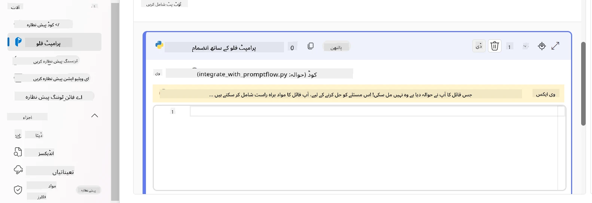

> [!NOTE]
> Microsoft Foundry میں Prompt flow کے استعمال کے بارے میں مزید تفصیلی معلومات کے لیے، آپ ملاحظہ کر سکتے ہیں [Prompt flow in Microsoft Foundry](https://learn.microsoft.com/azure/ai-studio/how-to/prompt-flow)۔

1. **Chat input**، **Chat output** منتخب کریں تاکہ آپ اپنے ماڈل سے بات چیت کر سکیں۔

    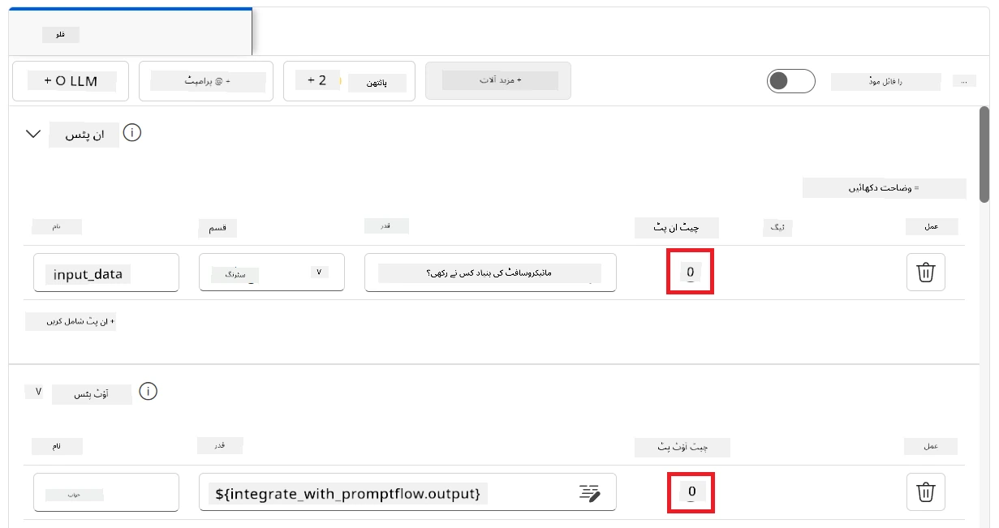

1. اب آپ اپنے custom Phi-3 ماڈل کے ساتھ بات چیت کرنے کے لیے تیار ہیں۔ اگلے مشق میں آپ سیکھیں گے کہ کیسے Prompt flow شروع کریں اور اسے اپنے fine-tuned Phi-3 ماڈل کے ساتھ بات چیت کے لیے استعمال کریں۔

> [!NOTE]
>
> دوبارہ بنائے گئے flow کی مثال نیچے دی گئی تصویر کی طرح ہونی چاہیے:
>
> 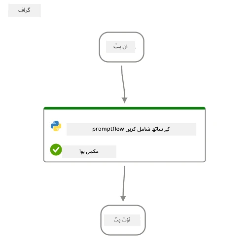
>

### اپنے custom Phi-3 ماڈل سے بات کریں

اب جب کہ آپ نے اپنے custom Phi-3 ماڈل کو fine-tune کر کے Prompt flow کے ساتھ یکجا کر لیا ہے، آپ اس کے ساتھ بات چیت شروع کرنے کے لیے تیار ہیں۔ یہ مشق آپ کو آپ کے ماڈل کے ساتھ بات چیت کے لیے Setup اور شروع کرنے کا عمل بتائے گی۔ ان مراحل کی پیروی کر کے، آپ اپنے fine-tuned Phi-3 ماڈل کی مختلف کاموں اور مکالمات میں پوری صلاحیتوں کا استعمال کر سکیں گے۔

- Prompt flow کا استعمال کرتے ہوئے اپنے custom Phi-3 ماڈل سے بات کریں۔

#### Prompt flow شروع کریں

1. Prompt flow شروع کرنے کے لیے **Start compute sessions** منتخب کریں۔

    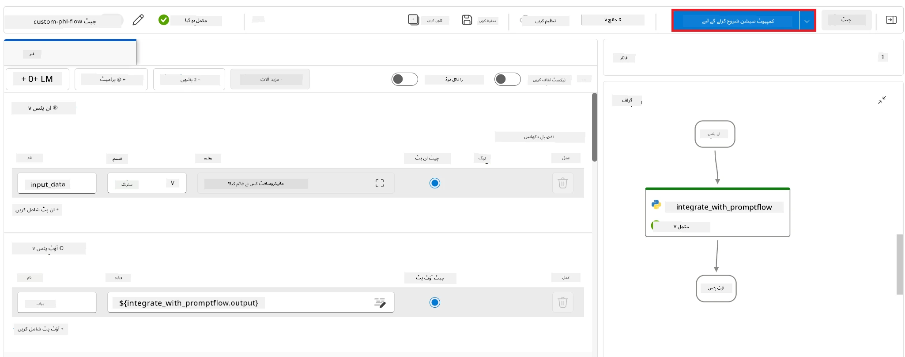

1. پیرا میٹرز کو نئے سرے سے حاصل کرنے کے لیے **Validate and parse input** منتخب کریں۔

    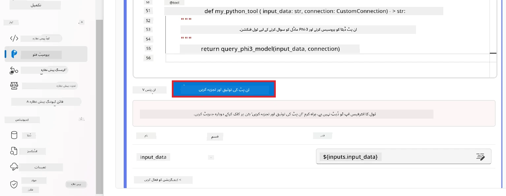

1. اپنے بنائے ہوئے کسٹم کنکشن کی **connection** کی **Value** منتخب کریں۔ مثلاً، *connection*۔

    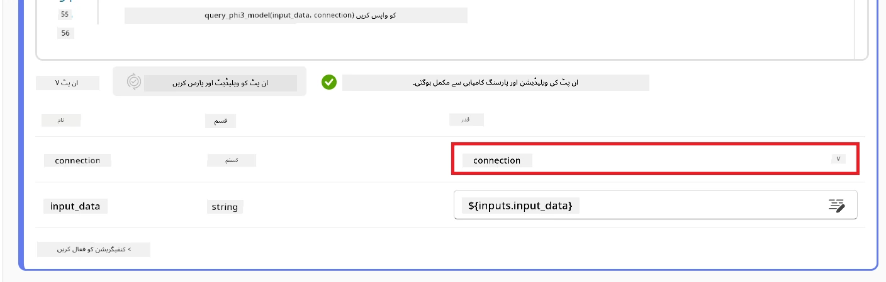

#### اپنے custom ماڈل کے ساتھ بات چیت کریں

1. **Chat** منتخب کریں۔

    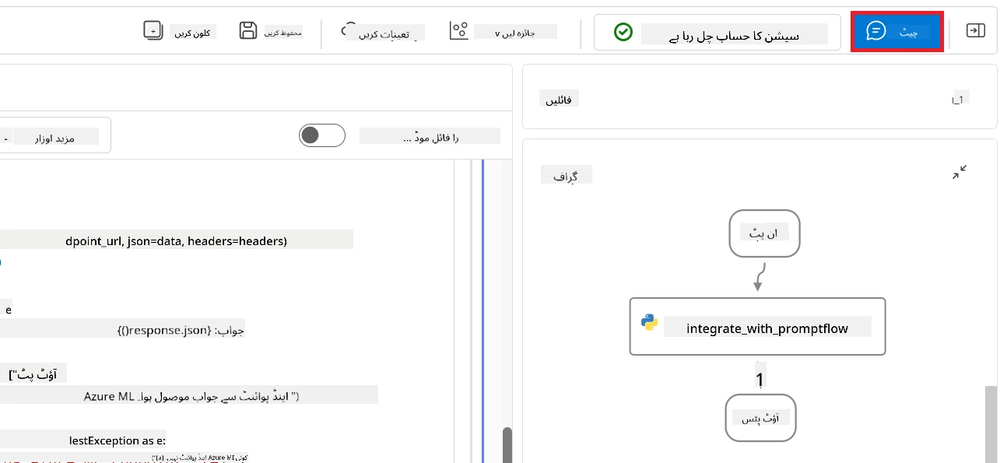

1. نتائج کی ایک مثال درج ذیل ہے: اب آپ اپنے custom Phi-3 ماڈل سے بات کر سکتے ہیں۔ مشورہ دیا جاتا ہے کہ آپ fine-tuning کے لیے استعمال ہونے والے ڈیٹا کی بنیاد پر سوالات پوچھیں۔

    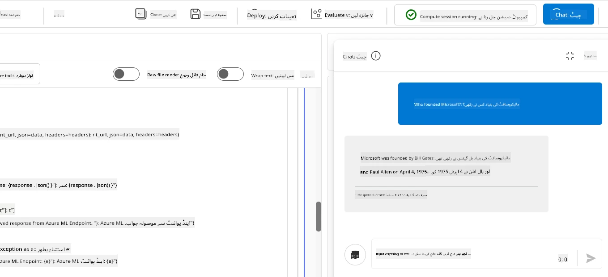

---

<!-- CO-OP TRANSLATOR DISCLAIMER START -->
**دستبرداری**:  
اس دستاویز کا ترجمہ AI ترجمہ سروس [Co-op Translator](https://github.com/Azure/co-op-translator) کا استعمال کرتے ہوئے کیا گیا ہے۔ اگرچہ ہم درستگی کے لیے کوشاں ہیں، براہ کرم اس بات سے آگاہ رہیں کہ خودکار ترجمے میں غلطیاں یا کمی بیشی ہو سکتی ہے۔ اصلی دستاویز کو اس کی مادری زبان میں مستند ذریعہ سمجھا جانا چاہیے۔ اہم معلومات کے لیے پیشہ ور انسانی ترجمہ تجویز کیا جاتا ہے۔ ہم اس ترجمے کے استعمال سے پیدا ہونے والی کسی بھی غلط فہمی یا تشریحات کے ذمہ دار نہیں ہیں۔
<!-- CO-OP TRANSLATOR DISCLAIMER END -->