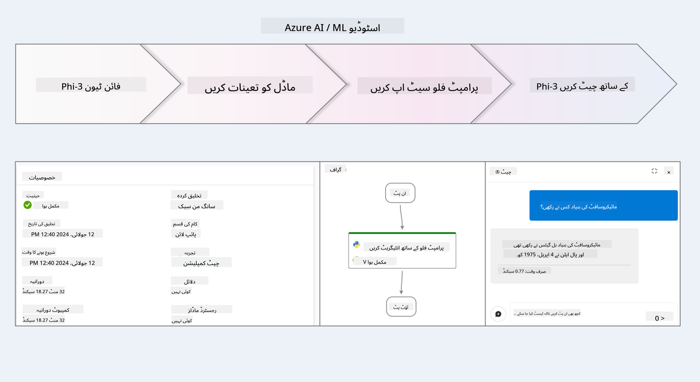
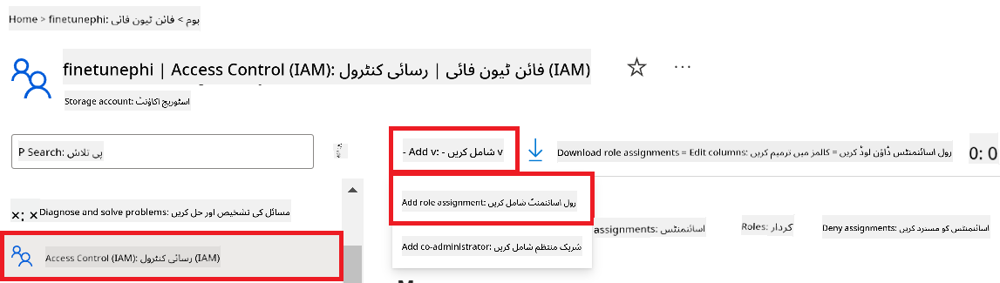
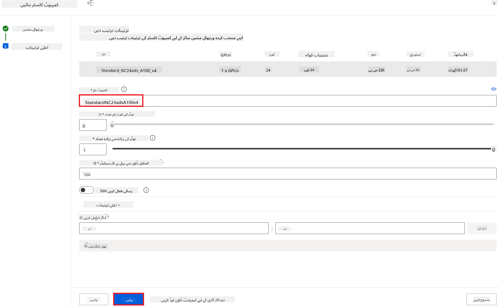
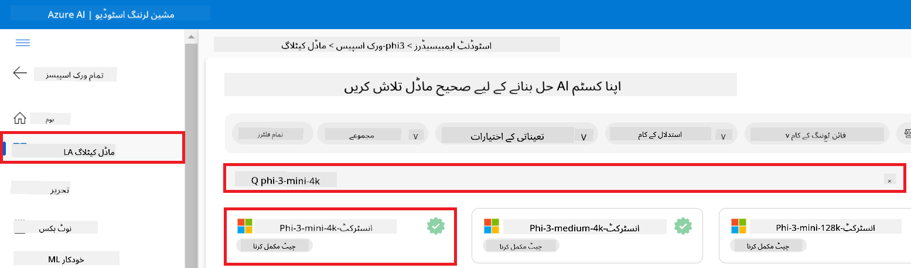
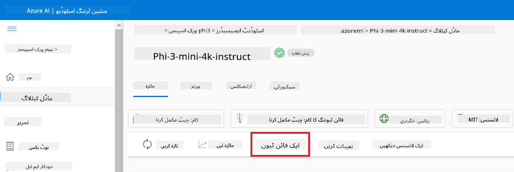
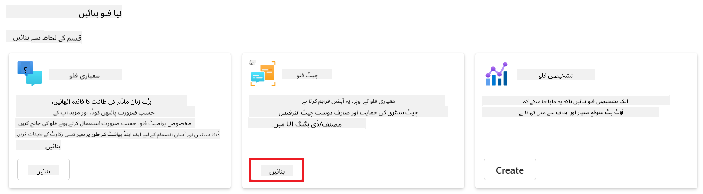
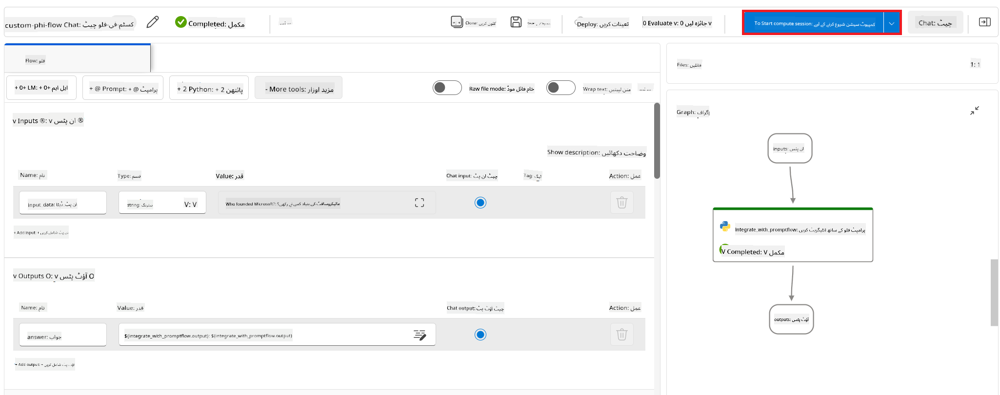

<!--
CO_OP_TRANSLATOR_METADATA:
{
  "original_hash": "ecbd9179a21edbaafaf114d47f09f3e3",
  "translation_date": "2025-07-17T01:05:34+00:00",
  "source_file": "md/02.Application/01.TextAndChat/Phi3/E2E_Phi-3-FineTuning_PromptFlow_Integration_AIFoundry.md",
  "language_code": "ur"
}
-->
# Azure AI Foundry میں Prompt flow کے ساتھ custom Phi-3 ماڈلز کو Fine-tune اور Integrate کریں

یہ end-to-end (E2E) نمونہ Microsoft Tech Community کی گائیڈ "[Fine-Tune and Integrate Custom Phi-3 Models with Prompt Flow in Azure AI Foundry](https://techcommunity.microsoft.com/t5/educator-developer-blog/fine-tune-and-integrate-custom-phi-3-models-with-prompt-flow-in/ba-p/4191726?WT.mc_id=aiml-137032-kinfeylo)" پر مبنی ہے۔ یہ custom Phi-3 ماڈلز کو fine-tune کرنے، deploy کرنے، اور Azure AI Foundry میں Prompt flow کے ساتھ integrate کرنے کے عمل کا تعارف کراتا ہے۔  
E2E نمونے "[Fine-Tune and Integrate Custom Phi-3 Models with Prompt Flow](./E2E_Phi-3-FineTuning_PromptFlow_Integration.md)" کے برعکس، جس میں کوڈ لوکل طور پر چلایا گیا تھا، یہ ٹیوٹوریل مکمل طور پر Azure AI / ML Studio کے اندر ماڈل کو fine-tune اور integrate کرنے پر مرکوز ہے۔

## جائزہ

اس E2E نمونے میں، آپ سیکھیں گے کہ Phi-3 ماڈل کو کیسے fine-tune کیا جائے اور اسے Azure AI Foundry میں Prompt flow کے ساتھ کیسے integrate کیا جائے۔ Azure AI / ML Studio کا استعمال کرتے ہوئے، آپ custom AI ماڈلز کو deploy اور استعمال کرنے کے لیے ایک ورک فلو قائم کریں گے۔ یہ E2E نمونہ تین منظرناموں میں تقسیم ہے:

**منظرنامہ 1: Azure وسائل سیٹ اپ کریں اور fine-tuning کی تیاری کریں**

**منظرنامہ 2: Phi-3 ماڈل کو fine-tune کریں اور Azure Machine Learning Studio میں deploy کریں**

**منظرنامہ 3: Prompt flow کے ساتھ integrate کریں اور Azure AI Foundry میں اپنے custom ماڈل کے ساتھ بات چیت کریں**

یہاں اس E2E نمونے کا ایک جائزہ ہے۔



### فہرست مضامین

1. **[منظرنامہ 1: Azure وسائل سیٹ اپ کریں اور fine-tuning کی تیاری کریں](../../../../../../md/02.Application/01.TextAndChat/Phi3)**
    - [Azure Machine Learning Workspace بنائیں](../../../../../../md/02.Application/01.TextAndChat/Phi3)
    - [Azure Subscription میں GPU کوٹہ درخواست کریں](../../../../../../md/02.Application/01.TextAndChat/Phi3)
    - [رول اسائنمنٹ شامل کریں](../../../../../../md/02.Application/01.TextAndChat/Phi3)
    - [پروجیکٹ سیٹ اپ کریں](../../../../../../md/02.Application/01.TextAndChat/Phi3)
    - [fine-tuning کے لیے ڈیٹا سیٹ تیار کریں](../../../../../../md/02.Application/01.TextAndChat/Phi3)

1. **[منظرنامہ 2: Phi-3 ماڈل کو fine-tune کریں اور Azure Machine Learning Studio میں deploy کریں](../../../../../../md/02.Application/01.TextAndChat/Phi3)**
    - [Phi-3 ماڈل کو fine-tune کریں](../../../../../../md/02.Application/01.TextAndChat/Phi3)
    - [fine-tuned Phi-3 ماڈل کو deploy کریں](../../../../../../md/02.Application/01.TextAndChat/Phi3)

1. **[منظرنامہ 3: Prompt flow کے ساتھ integrate کریں اور Azure AI Foundry میں اپنے custom ماڈل کے ساتھ بات چیت کریں](../../../../../../md/02.Application/01.TextAndChat/Phi3)**
    - [custom Phi-3 ماڈل کو Prompt flow کے ساتھ integrate کریں](../../../../../../md/02.Application/01.TextAndChat/Phi3)
    - [اپنے custom Phi-3 ماڈل کے ساتھ بات چیت کریں](../../../../../../md/02.Application/01.TextAndChat/Phi3)

## منظرنامہ 1: Azure وسائل سیٹ اپ کریں اور fine-tuning کی تیاری کریں

### Azure Machine Learning Workspace بنائیں

1. پورٹل صفحے کے اوپر **search bar** میں *azure machine learning* ٹائپ کریں اور ظاہر ہونے والے اختیارات میں سے **Azure Machine Learning** منتخب کریں۔

    

2. نیویگیشن مینو سے **+ Create** منتخب کریں۔

3. نیویگیشن مینو سے **New workspace** منتخب کریں۔

    

4. درج ذیل کام انجام دیں:

    - اپنی Azure **Subscription** منتخب کریں۔
    - استعمال کے لیے **Resource group** منتخب کریں (ضرورت ہو تو نیا بنائیں)۔
    - **Workspace Name** درج کریں۔ یہ منفرد ہونا چاہیے۔
    - وہ **Region** منتخب کریں جہاں آپ کام کرنا چاہتے ہیں۔
    - استعمال کے لیے **Storage account** منتخب کریں (ضرورت ہو تو نیا بنائیں)۔
    - استعمال کے لیے **Key vault** منتخب کریں (ضرورت ہو تو نیا بنائیں)۔
    - استعمال کے لیے **Application insights** منتخب کریں (ضرورت ہو تو نیا بنائیں)۔
    - استعمال کے لیے **Container registry** منتخب کریں (ضرورت ہو تو نیا بنائیں)۔

    

5. **Review + Create** منتخب کریں۔

6. **Create** منتخب کریں۔

### Azure Subscription میں GPU کوٹہ درخواست کریں

اس ٹیوٹوریل میں، آپ Phi-3 ماڈل کو GPUs کا استعمال کرتے ہوئے fine-tune اور deploy کرنا سیکھیں گے۔ fine-tuning کے لیے، آپ *Standard_NC24ads_A100_v4* GPU استعمال کریں گے، جس کے لیے کوٹہ کی درخواست ضروری ہے۔ deployment کے لیے، آپ *Standard_NC6s_v3* GPU استعمال کریں گے، جس کے لیے بھی کوٹہ کی درخواست درکار ہے۔

> [!NOTE]
>
> صرف Pay-As-You-Go سبسکرپشنز (معیاری سبسکرپشن کی قسم) GPU الاٹمنٹ کے اہل ہیں؛ benefit سبسکرپشنز فی الحال سپورٹ نہیں کی جاتیں۔
>

1. [Azure ML Studio](https://ml.azure.com/home?wt.mc_id=studentamb_279723) پر جائیں۔

1. *Standard NCADSA100v4 Family* کوٹہ کی درخواست کے لیے درج ذیل کام کریں:

    - بائیں طرف کے ٹیب سے **Quota** منتخب کریں۔
    - استعمال کے لیے **Virtual machine family** منتخب کریں۔ مثال کے طور پر، **Standard NCADSA100v4 Family Cluster Dedicated vCPUs** منتخب کریں، جس میں *Standard_NC24ads_A100_v4* GPU شامل ہے۔
    - نیویگیشن مینو سے **Request quota** منتخب کریں۔

        

    - Request quota صفحے میں، وہ **New cores limit** درج کریں جو آپ استعمال کرنا چاہتے ہیں۔ مثال کے طور پر، 24۔
    - Request quota صفحے میں، GPU کوٹہ کی درخواست کے لیے **Submit** منتخب کریں۔

1. *Standard NCSv3 Family* کوٹہ کی درخواست کے لیے درج ذیل کام کریں:

    - بائیں طرف کے ٹیب سے **Quota** منتخب کریں۔
    - استعمال کے لیے **Virtual machine family** منتخب کریں۔ مثال کے طور پر، **Standard NCSv3 Family Cluster Dedicated vCPUs** منتخب کریں، جس میں *Standard_NC6s_v3* GPU شامل ہے۔
    - نیویگیشن مینو سے **Request quota** منتخب کریں۔
    - Request quota صفحے میں، وہ **New cores limit** درج کریں جو آپ استعمال کرنا چاہتے ہیں۔ مثال کے طور پر، 24۔
    - Request quota صفحے میں، GPU کوٹہ کی درخواست کے لیے **Submit** منتخب کریں۔

### رول اسائنمنٹ شامل کریں

اپنے ماڈلز کو fine-tune اور deploy کرنے کے لیے، آپ کو پہلے ایک User Assigned Managed Identity (UAI) بنانی ہوگی اور اسے مناسب اجازتیں دینی ہوں گی۔ یہ UAI deployment کے دوران authentication کے لیے استعمال ہوگی۔

#### User Assigned Managed Identity (UAI) بنائیں

1. پورٹل صفحے کے اوپر **search bar** میں *managed identities* ٹائپ کریں اور ظاہر ہونے والے اختیارات میں سے **Managed Identities** منتخب کریں۔

    

1. **+ Create** منتخب کریں۔

    

1. درج ذیل کام انجام دیں:

    - اپنی Azure **Subscription** منتخب کریں۔
    - استعمال کے لیے **Resource group** منتخب کریں (ضرورت ہو تو نیا بنائیں)۔
    - وہ **Region** منتخب کریں جہاں آپ کام کرنا چاہتے ہیں۔
    - **Name** درج کریں۔ یہ منفرد ہونا چاہیے۔

    

1. **Review + create** منتخب کریں۔

1. **+ Create** منتخب کریں۔

#### Managed Identity کو Contributor رول اسائنمنٹ دیں

1. اس Managed Identity resource پر جائیں جو آپ نے بنائی ہے۔

1. بائیں طرف کے ٹیب سے **Azure role assignments** منتخب کریں۔

1. نیویگیشن مینو سے **+Add role assignment** منتخب کریں۔

1. Add role assignment صفحے میں درج ذیل کام کریں:
    - **Scope** کو **Resource group** پر سیٹ کریں۔
    - اپنی Azure **Subscription** منتخب کریں۔
    - استعمال کے لیے **Resource group** منتخب کریں۔
    - **Role** کو **Contributor** منتخب کریں۔

    

2. **Save** منتخب کریں۔

#### Managed Identity کو Storage Blob Data Reader رول اسائنمنٹ دیں

1. پورٹل صفحے کے اوپر **search bar** میں *storage accounts* ٹائپ کریں اور ظاہر ہونے والے اختیارات میں سے **Storage accounts** منتخب کریں۔

    

1. اس storage account کو منتخب کریں جو آپ نے Azure Machine Learning workspace کے ساتھ منسلک کیا ہے۔ مثال کے طور پر، *finetunephistorage*۔

1. Add role assignment صفحے پر جانے کے لیے درج ذیل کام کریں:

    - اس Azure Storage account پر جائیں جو آپ نے بنایا ہے۔
    - بائیں طرف کے ٹیب سے **Access Control (IAM)** منتخب کریں۔
    - نیویگیشن مینو سے **+ Add** منتخب کریں۔
    - نیویگیشن مینو سے **Add role assignment** منتخب کریں۔

    

1. Add role assignment صفحے میں درج ذیل کام کریں:

    - Role صفحے میں، **search bar** میں *Storage Blob Data Reader* ٹائپ کریں اور ظاہر ہونے والے اختیارات میں سے **Storage Blob Data Reader** منتخب کریں۔
    - Role صفحے میں، **Next** منتخب کریں۔
    - Members صفحے میں، **Assign access to** کے تحت **Managed identity** منتخب کریں۔
    - Members صفحے میں، **+ Select members** منتخب کریں۔
    - Select managed identities صفحے میں، اپنی Azure **Subscription** منتخب کریں۔
    - Select managed identities صفحے میں، **Managed identity** کو **Manage Identity** منتخب کریں۔
    - Select managed identities صفحے میں، وہ Manage Identity منتخب کریں جو آپ نے بنائی ہے۔ مثال کے طور پر، *finetunephi-managedidentity*۔
    - Select managed identities صفحے میں، **Select** منتخب کریں۔

    

1. **Review + assign** منتخب کریں۔

#### Managed Identity کو AcrPull رول اسائنمنٹ دیں

1. پورٹل صفحے کے اوپر **search bar** میں *container registries* ٹائپ کریں اور ظاہر ہونے والے اختیارات میں سے **Container registries** منتخب کریں۔

    

1. اس container registry کو منتخب کریں جو Azure Machine Learning workspace کے ساتھ منسلک ہے۔ مثال کے طور پر، *finetunephicontainerregistry*

1. Add role assignment صفحے پر جانے کے لیے درج ذیل کام کریں:

    - بائیں طرف کے ٹیب سے **Access Control (IAM)** منتخب کریں۔
    - نیویگیشن مینو سے **+ Add** منتخب کریں۔
    - نیویگیشن مینو سے **Add role assignment** منتخب کریں۔

1. Add role assignment صفحے میں درج ذیل کام کریں:

    - Role صفحے میں، **search bar** میں *AcrPull* ٹائپ کریں اور ظاہر ہونے والے اختیارات میں سے **AcrPull** منتخب کریں۔
    - Role صفحے میں، **Next** منتخب کریں۔
    - Members صفحے میں، **Assign access to** کے تحت **Managed identity** منتخب کریں۔
    - Members صفحے میں، **+ Select members** منتخب کریں۔
    - Select managed identities صفحے میں، اپنی Azure **Subscription** منتخب کریں۔
    - Select managed identities صفحے میں، **Managed identity** کو **Manage Identity** منتخب کریں۔
    - Select managed identities صفحے میں، وہ Manage Identity منتخب کریں جو آپ نے بنائی ہے۔ مثال کے طور پر، *finetunephi-managedidentity*۔
    - Select managed identities صفحے میں، **Select** منتخب کریں۔
    - **Review + assign** منتخب کریں۔

### پروجیکٹ سیٹ اپ کریں

fine-tuning کے لیے درکار ڈیٹا سیٹس ڈاؤن لوڈ کرنے کے لیے، آپ ایک لوکل ماحول تیار کریں گے۔

اس مشق میں، آپ:

- کام کرنے کے لیے ایک فولڈر بنائیں گے۔
- ایک virtual environment بنائیں گے۔
- ضروری پیکجز انسٹال کریں گے۔
- *download_dataset.py* فائل بنائیں گے تاکہ ڈیٹا سیٹ ڈاؤن لوڈ کیا جا سکے۔

#### کام کرنے کے لیے فولڈر بنائیں

1. ایک ٹرمینل ونڈو کھولیں اور درج ذیل کمانڈ ٹائپ کریں تاکہ ڈیفالٹ راستے میں *finetune-phi* نامی فولڈر بنایا جا سکے۔

    ```console
    mkdir finetune-phi
    ```

2. اپنے ٹرمینل میں درج ذیل کمانڈ ٹائپ کریں تاکہ آپ اس *finetune-phi* فولڈر میں جا سکیں جو آپ نے بنایا ہے۔
#### ایک ورچوئل ماحول بنائیں

1. اپنے ٹرمینل میں درج ذیل کمانڈ ٹائپ کریں تاکہ *.venv* نامی ورچوئل ماحول بنایا جا سکے۔

2. اپنے ٹرمینل میں درج ذیل کمانڈ ٹائپ کریں تاکہ ورچوئل ماحول کو فعال کیا جا سکے۔

> اگر یہ کامیاب ہو گیا، تو آپ کو کمانڈ پرامپٹ سے پہلے *(.venv)* نظر آنا چاہیے۔

#### مطلوبہ پیکجز انسٹال کریں

1. اپنے ٹرمینل میں درج ذیل کمانڈز ٹائپ کریں تاکہ مطلوبہ پیکجز انسٹال کیے جا سکیں۔

#### `download_dataset.py` فائل بنائیں

> مکمل فولڈر ساخت:
>
> 

1. **Visual Studio Code** کھولیں۔

1. مینو بار سے **File** منتخب کریں۔

1. **Open Folder** منتخب کریں۔

1. *finetune-phi* فولڈر منتخب کریں جو آپ نے بنایا ہے، جو *C:\Users\yourUserName\finetune-phi* پر واقع ہے۔

    

1. Visual Studio Code کے بائیں پین میں، رائٹ کلک کریں اور **New File** منتخب کریں تاکہ *download_dataset.py* نامی نئی فائل بنائی جا سکے۔

    

### فائن ٹیوننگ کے لیے ڈیٹاسیٹ تیار کریں

اس مشق میں، آپ *download_dataset.py* فائل چلائیں گے تاکہ *ultrachat_200k* ڈیٹاسیٹس کو اپنے لوکل ماحول میں ڈاؤن لوڈ کیا جا سکے۔ پھر آپ ان ڈیٹاسیٹس کو Azure Machine Learning میں Phi-3 ماڈل کی فائن ٹیوننگ کے لیے استعمال کریں گے۔

اس مشق میں آپ:

- *download_dataset.py* فائل میں کوڈ شامل کریں گے تاکہ ڈیٹاسیٹس ڈاؤن لوڈ ہو سکیں۔
- *download_dataset.py* فائل چلائیں گے تاکہ ڈیٹاسیٹس آپ کے لوکل ماحول میں ڈاؤن لوڈ ہو جائیں۔

#### *download_dataset.py* کے ذریعے اپنا ڈیٹاسیٹ ڈاؤن لوڈ کریں

1. Visual Studio Code میں *download_dataset.py* فائل کھولیں۔

1. *download_dataset.py* فائل میں درج ذیل کوڈ شامل کریں۔

1. اپنے ٹرمینل میں درج ذیل کمانڈ ٹائپ کریں تاکہ اسکرپٹ چلایا جا سکے اور ڈیٹاسیٹ آپ کے لوکل ماحول میں ڈاؤن لوڈ ہو جائے۔

1. تصدیق کریں کہ ڈیٹاسیٹس کامیابی سے آپ کے لوکل *finetune-phi/data* ڈائریکٹری میں محفوظ ہو گئے ہیں۔

> #### ڈیٹاسیٹ کے سائز اور فائن ٹیوننگ کے وقت کے بارے میں نوٹ
>
> اس ٹیوٹوریل میں، آپ صرف ڈیٹاسیٹ کا 1% (`split='train[:1%]'`) استعمال کرتے ہیں۔ اس سے ڈیٹا کی مقدار بہت کم ہو جاتی ہے، جس سے اپلوڈ اور فائن ٹیوننگ دونوں عمل تیز ہو جاتے ہیں۔ آپ تربیتی وقت اور ماڈل کی کارکردگی کے درمیان مناسب توازن کے لیے فیصد کو ایڈجسٹ کر سکتے ہیں۔ ڈیٹاسیٹ کے چھوٹے حصے کا استعمال فائن ٹیوننگ کے لیے درکار وقت کو کم کرتا ہے، جس سے یہ عمل ٹیوٹوریل کے لیے زیادہ قابلِ انتظام ہو جاتا ہے۔

## منظر نامہ 2: Phi-3 ماڈل کی فائن ٹیوننگ اور Azure Machine Learning Studio میں تعیناتی

### Phi-3 ماڈل کی فائن ٹیوننگ

اس مشق میں، آپ Azure Machine Learning Studio میں Phi-3 ماڈل کی فائن ٹیوننگ کریں گے۔

اس مشق میں آپ:

- فائن ٹیوننگ کے لیے کمپیوٹر کلسٹر بنائیں گے۔
- Azure Machine Learning Studio میں Phi-3 ماڈل کی فائن ٹیوننگ کریں گے۔

#### فائن ٹیوننگ کے لیے کمپیوٹر کلسٹر بنائیں

1. [Azure ML Studio](https://ml.azure.com/home?wt.mc_id=studentamb_279723) پر جائیں۔

1. بائیں طرف کے ٹیب سے **Compute** منتخب کریں۔

1. نیویگیشن مینو سے **Compute clusters** منتخب کریں۔

1. **+ New** منتخب کریں۔

    

1. درج ذیل کام کریں:

    - وہ **Region** منتخب کریں جہاں آپ کام کرنا چاہتے ہیں۔
    - **Virtual machine tier** کو **Dedicated** پر سیٹ کریں۔
    - **Virtual machine type** کو **GPU** منتخب کریں۔
    - **Virtual machine size** فلٹر کو **Select from all options** پر رکھیں۔
    - **Virtual machine size** کو **Standard_NC24ads_A100_v4** منتخب کریں۔

    

1. **Next** منتخب کریں۔

1. درج ذیل کام کریں:

    - **Compute name** درج کریں۔ یہ منفرد ہونا چاہیے۔
    - **Minimum number of nodes** کو **0** منتخب کریں۔
    - **Maximum number of nodes** کو **1** منتخب کریں۔
    - **Idle seconds before scale down** کو **120** پر سیٹ کریں۔

    

1. **Create** منتخب کریں۔

#### Phi-3 ماڈل کی فائن ٹیوننگ کریں

1. [Azure ML Studio](https://ml.azure.com/home?wt.mc_id=studentamb_279723) پر جائیں۔

1. اپنا بنایا ہوا Azure Machine Learning ورک اسپیس منتخب کریں۔

    

1. درج ذیل کام کریں:

    - بائیں طرف کے ٹیب سے **Model catalog** منتخب کریں۔
    - **search bar** میں *phi-3-mini-4k* ٹائپ کریں اور ظاہر ہونے والے آپشنز میں سے **Phi-3-mini-4k-instruct** منتخب کریں۔

    

1. نیویگیشن مینو سے **Fine-tune** منتخب کریں۔

    

1. درج ذیل کام کریں:

    - **Select task type** کو **Chat completion** منتخب کریں۔
    - **+ Select data** پر کلک کریں تاکہ **Training data** اپلوڈ کی جا سکے۔
    - Validation data اپلوڈ کی قسم کو **Provide different validation data** منتخب کریں۔
    - **+ Select data** پر کلک کریں تاکہ **Validation data** اپلوڈ کی جا سکے۔

    

    > آپ **Advanced settings** منتخب کر کے **learning_rate** اور **lr_scheduler_type** جیسی ترتیبات کو اپنی ضروریات کے مطابق بہتر بنا سکتے ہیں تاکہ فائن ٹیوننگ کا عمل زیادہ مؤثر ہو۔

1. **Finish** منتخب کریں۔

1. اس مشق میں، آپ نے کامیابی سے Azure Machine Learning میں Phi-3 ماڈل کی فائن ٹیوننگ کی۔ یاد رکھیں کہ فائن ٹیوننگ کا عمل کافی وقت لے سکتا ہے۔ فائن ٹیوننگ جاب چلانے کے بعد، آپ کو اس کے مکمل ہونے کا انتظار کرنا ہوگا۔ آپ Azure Machine Learning ورک اسپیس کے بائیں طرف کے ٹیب میں Jobs سیکشن میں جاب کی حالت مانیٹر کر سکتے ہیں۔ اگلی سیریز میں، آپ فائن ٹیونڈ ماڈل کو تعینات کریں گے اور اسے Prompt flow کے ساتھ مربوط کریں گے۔

    

### فائن ٹیونڈ Phi-3 ماڈل کی تعیناتی کریں

اپنے فائن ٹیونڈ Phi-3 ماڈل کو Prompt flow کے ساتھ مربوط کرنے کے لیے، آپ کو ماڈل کو تعینات کرنا ہوگا تاکہ یہ حقیقی وقت کی انفرنس کے لیے دستیاب ہو۔ اس عمل میں ماڈل کی رجسٹریشن، آن لائن اینڈ پوائنٹ بنانا، اور ماڈل کی تعیناتی شامل ہے۔

اس مشق میں آپ:

- Azure Machine Learning ورک اسپیس میں فائن ٹیونڈ ماڈل کو رجسٹر کریں گے۔
- ایک آن لائن اینڈ پوائنٹ بنائیں گے۔
- رجسٹر شدہ فائن ٹیونڈ Phi-3 ماڈل کو تعینات کریں گے۔

#### فائن ٹیونڈ ماڈل رجسٹر کریں

1. [Azure ML Studio](https://ml.azure.com/home?wt.mc_id=studentamb_279723) پر جائیں۔

1. اپنا بنایا ہوا Azure Machine Learning ورک اسپیس منتخب کریں۔

    

1. بائیں طرف کے ٹیب سے **Models** منتخب کریں۔

1. **+ Register** منتخب کریں۔

1. **From a job output** منتخب کریں۔

    

1. اپنی بنائی ہوئی جاب منتخب کریں۔

    

1. **Next** منتخب کریں۔

1. **Model type** کو **MLflow** منتخب کریں۔

1. یقینی بنائیں کہ **Job output** منتخب ہے؛ یہ خود بخود منتخب ہو جائے گا۔

    

2. **Next** منتخب کریں۔

3. **Register** منتخب کریں۔

    

4. آپ اپنے رجسٹر شدہ ماڈل کو بائیں طرف کے ٹیب میں **Models** مینو سے دیکھ سکتے ہیں۔

    

#### فائن ٹیونڈ ماڈل تعینات کریں

1. اپنے بنائے ہوئے Azure Machine Learning ورک اسپیس پر جائیں۔

1. بائیں طرف کے ٹیب سے **Endpoints** منتخب کریں۔

1. نیویگیشن مینو سے **Real-time endpoints** منتخب کریں۔

    

1. **Create** منتخب کریں۔

1. اپنا رجسٹر شدہ ماڈل منتخب کریں۔

    

1. **Select** منتخب کریں۔

1. درج ذیل کام کریں:

    - **Virtual machine** کو *Standard_NC6s_v3* منتخب کریں۔
    - استعمال کے لیے **Instance count** منتخب کریں، مثلاً *1*۔
    - **Endpoint** کو **New** منتخب کریں تاکہ نیا اینڈ پوائنٹ بنایا جا سکے۔
    - **Endpoint name** درج کریں۔ یہ منفرد ہونا چاہیے۔
    - **Deployment name** درج کریں۔ یہ بھی منفرد ہونا چاہیے۔

    

1. **Deploy** منتخب کریں۔

> اپنے اکاؤنٹ پر اضافی چارجز سے بچنے کے لیے، Azure Machine Learning ورک اسپیس میں بنائے گئے اینڈ پوائنٹ کو حذف کرنا نہ بھولیں۔

#### Azure Machine Learning ورک اسپیس میں تعیناتی کی حالت چیک کریں

1. اپنے بنائے ہوئے Azure Machine Learning ورک اسپیس پر جائیں۔

1. بائیں طرف کے ٹیب سے **Endpoints** منتخب کریں۔

1. اپنا بنایا ہوا اینڈ پوائنٹ منتخب کریں۔

    

1. اس صفحے پر، آپ تعیناتی کے دوران اینڈ پوائنٹس کا انتظام کر سکتے ہیں۔

> تعیناتی مکمل ہونے کے بعد، یقینی بنائیں کہ **Live traffic** 100% پر سیٹ ہے۔ اگر ایسا نہیں ہے، تو **Update traffic** منتخب کریں اور ٹریفک کی ترتیبات کو ایڈجسٹ کریں۔ اگر ٹریفک 0% پر ہو تو آپ ماڈل کا ٹیسٹ نہیں کر سکتے۔
>
> 
>

## منظر نامہ 3: Prompt flow کے ساتھ انضمام اور Azure AI Foundry میں اپنے کسٹم ماڈل سے بات چیت

### کسٹم Phi-3 ماڈل کو Prompt flow کے ساتھ مربوط کریں

اپنے کامیابی سے تعینات کردہ فائن ٹیونڈ ماڈل کے بعد، اب آپ اسے Prompt Flow کے ساتھ مربوط کر سکتے ہیں تاکہ آپ اپنے ماڈل کو حقیقی وقت کی ایپلیکیشنز میں استعمال کر سکیں، اور اپنے کسٹم Phi-3 ماڈل کے ساتھ مختلف انٹرایکٹو کام انجام دے سکیں۔

اس مشق میں آپ:

- Azure AI Foundry Hub بنائیں گے۔
- Azure AI Foundry پروجیکٹ بنائیں گے۔
- Prompt flow بنائیں گے۔
- فائن ٹیونڈ Phi-3 ماڈل کے لیے کسٹم کنکشن شامل کریں گے۔
- اپنے کسٹم Phi-3 ماڈل کے ساتھ بات چیت کے لیے Prompt flow سیٹ اپ کریں گے۔
> [!NOTE]
> آپ Azure ML Studio کے ساتھ Promptflow کو بھی مربوط کر سکتے ہیں۔ یہی مربوط کرنے کا عمل Azure ML Studio پر بھی لاگو ہوتا ہے۔
#### Azure AI Foundry Hub بنائیں

پروجیکٹ بنانے سے پہلے آپ کو ایک Hub بنانا ہوگا۔ Hub ایک Resource Group کی طرح کام کرتا ہے، جو آپ کو Azure AI Foundry کے اندر متعدد پروجیکٹس کو منظم اور ترتیب دینے کی سہولت دیتا ہے۔

1. [Azure AI Foundry](https://ai.azure.com/?WT.mc_id=aiml-137032-kinfeylo) پر جائیں۔

1. بائیں طرف کے ٹیب سے **All hubs** منتخب کریں۔

1. نیویگیشن مینو سے **+ New hub** منتخب کریں۔

    

1. درج ذیل کام کریں:

    - **Hub name** درج کریں۔ یہ منفرد ہونا چاہیے۔
    - اپنی Azure **Subscription** منتخب کریں۔
    - استعمال کرنے کے لیے **Resource group** منتخب کریں (ضرورت ہو تو نیا بنائیں)۔
    - وہ **Location** منتخب کریں جہاں آپ کام کرنا چاہتے ہیں۔
    - استعمال کرنے کے لیے **Connect Azure AI Services** منتخب کریں (ضرورت ہو تو نیا بنائیں)۔
    - **Connect Azure AI Search** کے لیے **Skip connecting** منتخب کریں۔

    

1. **Next** منتخب کریں۔

#### Azure AI Foundry پروجیکٹ بنائیں

1. جس Hub کو آپ نے بنایا ہے، اس میں بائیں طرف کے ٹیب سے **All projects** منتخب کریں۔

1. نیویگیشن مینو سے **+ New project** منتخب کریں۔

    

1. **Project name** درج کریں۔ یہ منفرد ہونا چاہیے۔

    

1. **Create a project** منتخب کریں۔

#### fine-tuned Phi-3 ماڈل کے لیے کسٹم کنکشن شامل کریں

اپنے کسٹم Phi-3 ماڈل کو Prompt flow کے ساتھ مربوط کرنے کے لیے، آپ کو ماڈل کے endpoint اور key کو کسٹم کنکشن میں محفوظ کرنا ہوگا۔ اس ترتیب سے آپ کو Prompt flow میں اپنے کسٹم Phi-3 ماڈل تک رسائی حاصل ہوگی۔

#### fine-tuned Phi-3 ماڈل کی api key اور endpoint uri سیٹ کریں

1. [Azure ML Studio](https://ml.azure.com/home?WT.mc_id=aiml-137032-kinfeylo) پر جائیں۔

1. اس Azure Machine learning workspace پر جائیں جو آپ نے بنایا ہے۔

1. بائیں طرف کے ٹیب سے **Endpoints** منتخب کریں۔

    

1. وہ endpoint منتخب کریں جو آپ نے بنایا ہے۔

    

1. نیویگیشن مینو سے **Consume** منتخب کریں۔

1. اپنی **REST endpoint** اور **Primary key** کو کاپی کریں۔

    

#### کسٹم کنکشن شامل کریں

1. [Azure AI Foundry](https://ai.azure.com/?WT.mc_id=aiml-137032-kinfeylo) پر جائیں۔

1. اس Azure AI Foundry پروجیکٹ پر جائیں جو آپ نے بنایا ہے۔

1. جس پروجیکٹ کو آپ نے بنایا ہے، اس میں بائیں طرف کے ٹیب سے **Settings** منتخب کریں۔

1. **+ New connection** منتخب کریں۔

    

1. نیویگیشن مینو سے **Custom keys** منتخب کریں۔

    

1. درج ذیل کام کریں:

    - **+ Add key value pairs** منتخب کریں۔
    - key name کے لیے **endpoint** لکھیں اور Azure ML Studio سے کاپی کیا ہوا endpoint value فیلڈ میں چسپاں کریں۔
    - دوبارہ **+ Add key value pairs** منتخب کریں۔
    - key name کے لیے **key** لکھیں اور Azure ML Studio سے کاپی کیا ہوا key value فیلڈ میں چسپاں کریں۔
    - keys شامل کرنے کے بعد، **is secret** منتخب کریں تاکہ key ظاہر نہ ہو۔

    

1. **Add connection** منتخب کریں۔

#### Prompt flow بنائیں

آپ نے Azure AI Foundry میں کسٹم کنکشن شامل کر لیا ہے۔ اب، آئیں درج ذیل مراحل کے ذریعے ایک Prompt flow بنائیں۔ پھر، آپ اس Prompt flow کو کسٹم کنکشن سے مربوط کریں گے تاکہ آپ fine-tuned ماڈل کو Prompt flow کے اندر استعمال کر سکیں۔

1. اس Azure AI Foundry پروجیکٹ پر جائیں جو آپ نے بنایا ہے۔

1. بائیں طرف کے ٹیب سے **Prompt flow** منتخب کریں۔

1. نیویگیشن مینو سے **+ Create** منتخب کریں۔

    

1. نیویگیشن مینو سے **Chat flow** منتخب کریں۔

    

1. استعمال کے لیے **Folder name** درج کریں۔

    

2. **Create** منتخب کریں۔

#### اپنے کسٹم Phi-3 ماڈل کے ساتھ Prompt flow کو چیٹ کے لیے سیٹ اپ کریں

آپ کو fine-tuned Phi-3 ماڈل کو Prompt flow میں شامل کرنا ہوگا۔ تاہم، موجودہ فراہم کردہ Prompt flow اس مقصد کے لیے تیار نہیں ہے۔ لہٰذا، آپ کو Prompt flow کو دوبارہ ڈیزائن کرنا ہوگا تاکہ کسٹم ماڈل کی انٹیگریشن ممکن ہو سکے۔

1. Prompt flow میں، موجودہ flow کو دوبارہ بنانے کے لیے درج ذیل کام کریں:

    - **Raw file mode** منتخب کریں۔
    - *flow.dag.yml* فائل میں موجود تمام کوڈ حذف کریں۔
    - *flow.dag.yml* فائل میں درج ذیل کوڈ شامل کریں۔

        ```yml
        inputs:
          input_data:
            type: string
            default: "Who founded Microsoft?"

        outputs:
          answer:
            type: string
            reference: ${integrate_with_promptflow.output}

        nodes:
        - name: integrate_with_promptflow
          type: python
          source:
            type: code
            path: integrate_with_promptflow.py
          inputs:
            input_data: ${inputs.input_data}
        ```

    - **Save** منتخب کریں۔

    

1. *integrate_with_promptflow.py* فائل میں درج ذیل کوڈ شامل کریں تاکہ کسٹم Phi-3 ماڈل کو Prompt flow میں استعمال کیا جا سکے۔

    ```python
    import logging
    import requests
    from promptflow import tool
    from promptflow.connections import CustomConnection

    # Logging setup
    logging.basicConfig(
        format="%(asctime)s - %(levelname)s - %(name)s - %(message)s",
        datefmt="%Y-%m-%d %H:%M:%S",
        level=logging.DEBUG
    )
    logger = logging.getLogger(__name__)

    def query_phi3_model(input_data: str, connection: CustomConnection) -> str:
        """
        Send a request to the Phi-3 model endpoint with the given input data using Custom Connection.
        """

        # "connection" is the name of the Custom Connection, "endpoint", "key" are the keys in the Custom Connection
        endpoint_url = connection.endpoint
        api_key = connection.key

        headers = {
            "Content-Type": "application/json",
            "Authorization": f"Bearer {api_key}"
        }
        data = {
            "input_data": {
                "input_string": [
                    {"role": "user", "content": input_data}
                ],
                "parameters": {
                    "temperature": 0.7,
                    "max_new_tokens": 128
                }
            }
        }
        try:
            response = requests.post(endpoint_url, json=data, headers=headers)
            response.raise_for_status()
            
            # Log the full JSON response
            logger.debug(f"Full JSON response: {response.json()}")

            result = response.json()["output"]
            logger.info("Successfully received response from Azure ML Endpoint.")
            return result
        except requests.exceptions.RequestException as e:
            logger.error(f"Error querying Azure ML Endpoint: {e}")
            raise

    @tool
    def my_python_tool(input_data: str, connection: CustomConnection) -> str:
        """
        Tool function to process input data and query the Phi-3 model.
        """
        return query_phi3_model(input_data, connection)

    ```

    

> [!NOTE]
> Azure AI Foundry میں Prompt flow کے استعمال کے بارے میں مزید تفصیلی معلومات کے لیے، آپ [Prompt flow in Azure AI Foundry](https://learn.microsoft.com/azure/ai-studio/how-to/prompt-flow) ملاحظہ کر سکتے ہیں۔

1. **Chat input** اور **Chat output** منتخب کریں تاکہ آپ اپنے ماڈل کے ساتھ چیٹ کر سکیں۔

    

1. اب آپ اپنے کسٹم Phi-3 ماڈل کے ساتھ چیٹ کرنے کے لیے تیار ہیں۔ اگلے مشق میں، آپ سیکھیں گے کہ Prompt flow کو کیسے شروع کیا جائے اور اسے اپنے fine-tuned Phi-3 ماڈل کے ساتھ چیٹ کے لیے کیسے استعمال کیا جائے۔

> [!NOTE]
>
> دوبارہ بنایا گیا flow نیچے دی گئی تصویر کی طرح ہونا چاہیے:
>
> 
>

### اپنے کسٹم Phi-3 ماڈل کے ساتھ چیٹ کریں

اب جب کہ آپ نے اپنا کسٹم Phi-3 ماڈل fine-tune کر کے Prompt flow کے ساتھ مربوط کر لیا ہے، آپ اس کے ساتھ بات چیت شروع کرنے کے لیے تیار ہیں۔ یہ مشق آپ کو ماڈل کے ساتھ چیٹ سیٹ اپ کرنے اور شروع کرنے کے عمل سے آگاہ کرے گی۔ ان مراحل پر عمل کر کے، آپ اپنے fine-tuned Phi-3 ماڈل کی صلاحیتوں کو مختلف کاموں اور گفتگو کے لیے مکمل طور پر استعمال کر سکیں گے۔

- Prompt flow کے ذریعے اپنے کسٹم Phi-3 ماڈل کے ساتھ چیٹ کریں۔

#### Prompt flow شروع کریں

1. Prompt flow شروع کرنے کے لیے **Start compute sessions** منتخب کریں۔

    

1. پیرامیٹرز کو تازہ کرنے کے لیے **Validate and parse input** منتخب کریں۔

    

1. اپنے بنائے ہوئے کسٹم کنکشن کی **connection** کی **Value** منتخب کریں۔ مثال کے طور پر، *connection*۔

    

#### اپنے کسٹم ماڈل کے ساتھ چیٹ کریں

1. **Chat** منتخب کریں۔

    

1. نتائج کی ایک مثال درج ذیل ہے: اب آپ اپنے کسٹم Phi-3 ماڈل کے ساتھ چیٹ کر سکتے ہیں۔ مشورہ دیا جاتا ہے کہ fine-tuning کے لیے استعمال ہونے والے ڈیٹا کی بنیاد پر سوالات پوچھیں۔

    

**دستخطی نوٹ**:  
یہ دستاویز AI ترجمہ سروس [Co-op Translator](https://github.com/Azure/co-op-translator) کے ذریعے ترجمہ کی گئی ہے۔ اگرچہ ہم درستگی کے لیے کوشاں ہیں، براہ کرم آگاہ رہیں کہ خودکار ترجمے میں غلطیاں یا عدم درستیاں ہو سکتی ہیں۔ اصل دستاویز اپنی مادری زبان میں معتبر ماخذ سمجھی جانی چاہیے۔ اہم معلومات کے لیے پیشہ ور انسانی ترجمہ کی سفارش کی جاتی ہے۔ اس ترجمے کے استعمال سے پیدا ہونے والی کسی بھی غلط فہمی یا غلط تشریح کی ذمہ داری ہم پر عائد نہیں ہوتی۔