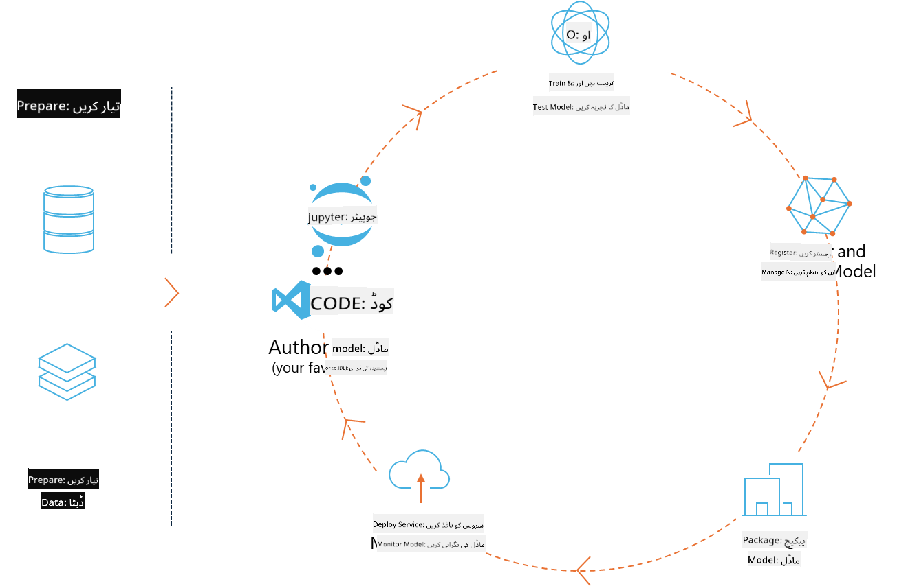
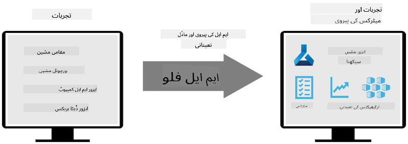
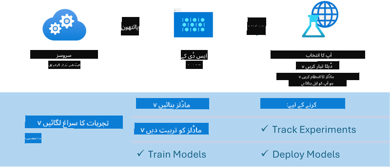

<!--
CO_OP_TRANSLATOR_METADATA:
{
  "original_hash": "1e42c399dcc2fa477925d3ef4038d403",
  "translation_date": "2025-04-03T07:34:09+00:00",
  "source_file": "md\\02.Application\\01.TextAndChat\\Phi3\\E2E_Phi-3-MLflow.md",
  "language_code": "ur"
}
-->
# ایم ایل فلو

[ایم ایل فلو](https://mlflow.org/) ایک اوپن سورس پلیٹ فارم ہے جو مشین لرننگ کے مکمل لائف سائیکل کو مینیج کرنے کے لیے ڈیزائن کیا گیا ہے۔



ایم ایل فلو مشین لرننگ کے لائف سائیکل کو مینیج کرنے کے لیے استعمال ہوتا ہے، جس میں تجربات، ری پروڈیوسبلٹی، ڈیپلائمنٹ اور ایک مرکزی ماڈل رجسٹری شامل ہیں۔ ایم ایل فلو اس وقت چار اجزاء فراہم کرتا ہے۔

- **ایم ایل فلو ٹریکنگ:** تجربات، کوڈ، ڈیٹا کنفیگریشن اور نتائج کو ریکارڈ اور کوئری کریں۔
- **ایم ایل فلو پروجیکٹس:** ڈیٹا سائنس کوڈ کو ایک فارمیٹ میں پیک کریں تاکہ کسی بھی پلیٹ فارم پر رنز کو ری پروڈیوس کیا جا سکے۔
- **ایم ایل فلو ماڈلز:** مشین لرننگ ماڈلز کو مختلف سروِنگ ماحول میں ڈیپلائے کریں۔
- **ماڈل رجسٹری:** ماڈلز کو ایک مرکزی ریپوزٹری میں اسٹور کریں، تشریح کریں اور مینیج کریں۔

یہ تجربات کو ٹریک کرنے، کوڈ کو ری پروڈیوسبل رنز میں پیک کرنے، اور ماڈلز کو شیئر اور ڈیپلائے کرنے کی صلاحیت فراہم کرتا ہے۔ ایم ایل فلو ڈیٹا بریکس میں انٹیگریٹڈ ہے اور مختلف مشین لرننگ لائبریریوں کو سپورٹ کرتا ہے، جس سے یہ لائبریری-اگناسٹک بن جاتا ہے۔ یہ کسی بھی مشین لرننگ لائبریری اور کسی بھی پروگرامنگ لینگویج کے ساتھ استعمال کیا جا سکتا ہے، کیونکہ یہ سہولت کے لیے REST API اور CLI فراہم کرتا ہے۔



ایم ایل فلو کی اہم خصوصیات میں شامل ہیں:

- **ایکسپیریمنٹ ٹریکنگ:** پیرامیٹرز اور نتائج کو ریکارڈ اور موازنہ کریں۔
- **ماڈل مینیجمنٹ:** ماڈلز کو مختلف سروِنگ اور انفرنس پلیٹ فارمز پر ڈیپلائے کریں۔
- **ماڈل رجسٹری:** ایم ایل فلو ماڈلز کے لائف سائیکل کو مشترکہ طور پر مینیج کریں، جس میں ورژننگ اور تشریحات شامل ہیں۔
- **پروجیکٹس:** مشین لرننگ کوڈ کو شیئرنگ یا پروڈکشن کے استعمال کے لیے پیک کریں۔

ایم ایل فلو ایم ایل اوپس لوپ کو بھی سپورٹ کرتا ہے، جس میں ڈیٹا تیار کرنا، ماڈلز کو رجسٹر اور مینیج کرنا، ماڈلز کو ایگزیکیوشن کے لیے پیک کرنا، سروسز کو ڈیپلائے کرنا، اور ماڈلز کی مانیٹرنگ شامل ہے۔ اس کا مقصد پروٹو ٹائپ سے پروڈکشن ورک فلو تک جانے کے عمل کو آسان بنانا ہے، خاص طور پر کلاؤڈ اور ایج ماحول میں۔

## ای ٹو ای سیناریو - ایک ریپر بنانا اور فی-3 کو ایم ایل فلو ماڈل کے طور پر استعمال کرنا

اس ای ٹو ای نمونے میں ہم فی-3 چھوٹے لینگویج ماڈل (SLM) کے ارد گرد ریپر بنانے کے دو مختلف طریقوں کا مظاہرہ کریں گے اور پھر اسے ایم ایل فلو ماڈل کے طور پر لوکل یا کلاؤڈ میں، جیسے کہ ایزور مشین لرننگ ورک اسپیس میں، چلائیں گے۔



| پروجیکٹ | وضاحت | مقام |
| ------------ | ----------- | -------- |
| ٹرانسفارمر پائپ لائن | ٹرانسفارمر پائپ لائن ایم ایل فلو کے تجرباتی ٹرانسفارمرز فلیور کے ساتھ ہگیگنگ فیس ماڈل استعمال کرنے کا سب سے آسان آپشن ہے۔ | [**TransformerPipeline.ipynb**](../../../../../../code/06.E2E/E2E_Phi-3-MLflow_TransformerPipeline.ipynb) |
| کسٹم پائتھون ریپر | اس وقت، ٹرانسفارمر پائپ لائن ہگیگنگ فیس ماڈلز کے لیے ایم ایل فلو ریپر جنریشن کو سپورٹ نہیں کرتی تھی جب وہ ONNX فارمیٹ میں ہوں، یہاں تک کہ تجرباتی optimum پائتھون پیکج کے ساتھ۔ ایسے کیسز کے لیے، آپ ایم ایل فلو موڈ کے لیے اپنا کسٹم پائتھون ریپر بنا سکتے ہیں۔ | [**CustomPythonWrapper.ipynb**](../../../../../../code/06.E2E/E2E_Phi-3-MLflow_CustomPythonWrapper.ipynb) |

## پروجیکٹ: ٹرانسفارمر پائپ لائن

1. آپ کو ایم ایل فلو اور ہگیگنگ فیس کے متعلقہ پائتھون پیکجز کی ضرورت ہوگی:

    ``` Python
    import mlflow
    import transformers
    ```

2. اگلے مرحلے میں، آپ کو ہگیگنگ فیس رجسٹری میں موجود ہدف فی-3 ماڈل کا حوالہ دے کر ایک ٹرانسفارمر پائپ لائن شروع کرنی ہوگی۔ جیسا کہ _Phi-3-mini-4k-instruct_ کے ماڈل کارڈ سے دیکھا جا سکتا ہے، اس کا کام "ٹیکسٹ جنریشن" قسم کا ہے:

    ``` Python
    pipeline = transformers.pipeline(
        task = "text-generation",
        model = "microsoft/Phi-3-mini-4k-instruct"
    )
    ```

3. اب آپ اپنے فی-3 ماڈل کی ٹرانسفارمر پائپ لائن کو ایم ایل فلو فارمیٹ میں محفوظ کر سکتے ہیں اور اضافی تفصیلات فراہم کر سکتے ہیں، جیسے کہ ہدف آرٹیفیکٹس کا راستہ، مخصوص ماڈل کنفیگریشن سیٹنگز اور انفرنس API قسم:

    ``` Python
    model_info = mlflow.transformers.log_model(
        transformers_model = pipeline,
        artifact_path = "phi3-mlflow-model",
        model_config = model_config,
        task = "llm/v1/chat"
    )
    ```

## پروجیکٹ: کسٹم پائتھون ریپر

1. ہم یہاں مائیکروسافٹ کے [ONNX Runtime generate() API](https://github.com/microsoft/onnxruntime-genai) کو ONNX ماڈل کی انفرنس اور ٹوکنز کو انکوڈ/ڈیکوڈ کرنے کے لیے استعمال کر سکتے ہیں۔ آپ کو اپنے ہدف کمپیوٹ کے لیے _onnxruntime_genai_ پیکج منتخب کرنا ہوگا، جس میں نیچے دیا گیا مثال CPU کو ہدف بناتا ہے:

    ``` Python
    import mlflow
    from mlflow.models import infer_signature
    import onnxruntime_genai as og
    ```

1. ہماری کسٹم کلاس دو طریقے نافذ کرتی ہے: _load_context()_ فی-3 Mini 4K Instruct کے **ONNX ماڈل**، **جنریٹر پیرامیٹرز** اور **ٹوکینائزر** کو انیشیالائز کرنے کے لیے؛ اور _predict()_ فراہم کردہ پرامپٹ کے لیے آؤٹ پٹ ٹوکنز پیدا کرنے کے لیے:

    ``` Python
    class Phi3Model(mlflow.pyfunc.PythonModel):
        def load_context(self, context):
            # Retrieving model from the artifacts
            model_path = context.artifacts["phi3-mini-onnx"]
            model_options = {
                 "max_length": 300,
                 "temperature": 0.2,         
            }
        
            # Defining the model
            self.phi3_model = og.Model(model_path)
            self.params = og.GeneratorParams(self.phi3_model)
            self.params.set_search_options(**model_options)
            
            # Defining the tokenizer
            self.tokenizer = og.Tokenizer(self.phi3_model)
    
        def predict(self, context, model_input):
            # Retrieving prompt from the input
            prompt = model_input["prompt"][0]
            self.params.input_ids = self.tokenizer.encode(prompt)
    
            # Generating the model's response
            response = self.phi3_model.generate(self.params)
    
            return self.tokenizer.decode(response[0][len(self.params.input_ids):])
    ```

1. اب آپ _mlflow.pyfunc.log_model()_ فنکشن استعمال کر سکتے ہیں تاکہ فی-3 ماڈل کے لیے ایک کسٹم پائتھون ریپر (pickle فارمیٹ میں) تیار کیا جا سکے، اصل ONNX ماڈل اور مطلوبہ ڈیپنڈنسیز کے ساتھ:

    ``` Python
    model_info = mlflow.pyfunc.log_model(
        artifact_path = artifact_path,
        python_model = Phi3Model(),
        artifacts = {
            "phi3-mini-onnx": "cpu_and_mobile/cpu-int4-rtn-block-32-acc-level-4",
        },
        input_example = input_example,
        signature = infer_signature(input_example, ["Run"]),
        extra_pip_requirements = ["torch", "onnxruntime_genai", "numpy"],
    )
    ```

## ایم ایل فلو ماڈلز کے تیار کردہ سگنیچرز

1. اوپر دیے گئے ٹرانسفارمر پائپ لائن پروجیکٹ کے تیسرے مرحلے میں، ہم نے ایم ایل فلو ماڈل کے کام کو "_llm/v1/chat_" پر سیٹ کیا۔ ایسی ہدایت ایک ماڈل کا API ریپر تیار کرتی ہے جو OpenAI کے چیٹ API کے ساتھ مطابقت رکھتا ہے، جیسا کہ نیچے دکھایا گیا ہے:

    ``` Python
    {inputs: 
      ['messages': Array({content: string (required), name: string (optional), role: string (required)}) (required), 'temperature': double (optional), 'max_tokens': long (optional), 'stop': Array(string) (optional), 'n': long (optional), 'stream': boolean (optional)],
    outputs: 
      ['id': string (required), 'object': string (required), 'created': long (required), 'model': string (required), 'choices': Array({finish_reason: string (required), index: long (required), message: {content: string (required), name: string (optional), role: string (required)} (required)}) (required), 'usage': {completion_tokens: long (required), prompt_tokens: long (required), total_tokens: long (required)} (required)],
    params: 
      None}
    ```

1. نتیجے کے طور پر، آپ اپنا پرامپٹ درج ذیل فارمیٹ میں جمع کر سکتے ہیں:

    ``` Python
    messages = [{"role": "user", "content": "What is the capital of Spain?"}]
    ```

1. پھر، OpenAI API-مطابقت پذیر پوسٹ پروسیسنگ، جیسے _response[0][‘choices’][0][‘message’][‘content’]_, استعمال کریں تاکہ اپنے آؤٹ پٹ کو کچھ اس طرح خوبصورت بنائیں:

    ``` JSON
    Question: What is the capital of Spain?
    
    Answer: The capital of Spain is Madrid. It is the largest city in Spain and serves as the political, economic, and cultural center of the country. Madrid is located in the center of the Iberian Peninsula and is known for its rich history, art, and architecture, including the Royal Palace, the Prado Museum, and the Plaza Mayor.
    
    Usage: {'prompt_tokens': 11, 'completion_tokens': 73, 'total_tokens': 84}
    ```

1. اوپر دیے گئے کسٹم پائتھون ریپر پروجیکٹ کے تیسرے مرحلے میں، ہم نے ایم ایل فلو پیکج کو دیے گئے ان پٹ مثال سے ماڈل کا سگنیچر تیار کرنے کی اجازت دی۔ ہمارے ایم ایل فلو ریپر کا سگنیچر کچھ اس طرح ہوگا:

    ``` Python
    {inputs: 
      ['prompt': string (required)],
    outputs: 
      [string (required)],
    params: 
      None}
    ```

1. لہذا، ہمارا پرامپٹ "prompt" ڈکشنری کلید پر مشتمل ہونا چاہیے، کچھ اس طرح:

    ``` Python
    {"prompt": "<|system|>You are a stand-up comedian.<|end|><|user|>Tell me a joke about atom<|end|><|assistant|>",}
    ```

1. ماڈل کا آؤٹ پٹ پھر سٹرنگ فارمیٹ میں فراہم کیا جائے گا:

    ``` JSON
    Alright, here's a little atom-related joke for you!
    
    Why don't electrons ever play hide and seek with protons?
    
    Because good luck finding them when they're always "sharing" their electrons!
    
    Remember, this is all in good fun, and we're just having a little atomic-level humor!
    ```

**ڈسکلیمر**:  
یہ دستاویز AI ترجمہ سروس [Co-op Translator](https://github.com/Azure/co-op-translator) کا استعمال کرتے ہوئے ترجمہ کی گئی ہے۔ ہم درستگی کے لیے کوشش کرتے ہیں، لیکن براہ کرم یہ جان لیں کہ خودکار ترجمے میں غلطیاں یا غیر درستیاں ہو سکتی ہیں۔ اصل دستاویز کو اس کی اصل زبان میں مستند ذریعہ سمجھا جانا چاہیے۔ اہم معلومات کے لیے، پیشہ ورانہ انسانی ترجمہ کی سفارش کی جاتی ہے۔ اس ترجمے کے استعمال سے پیدا ہونے والی کسی بھی غلط فہمی یا غلط تشریح کے لیے ہم ذمہ دار نہیں ہیں۔