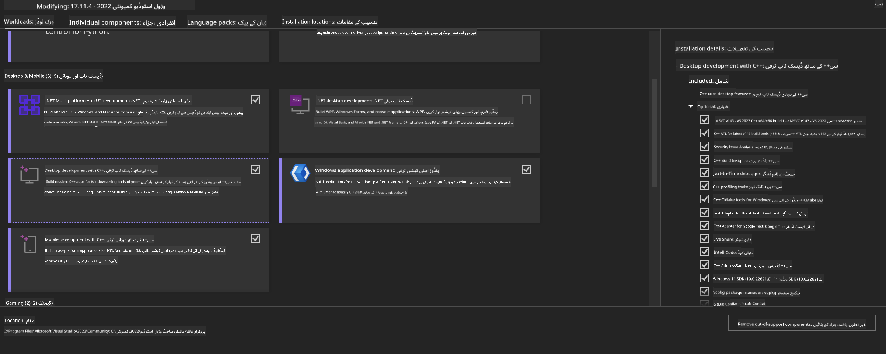
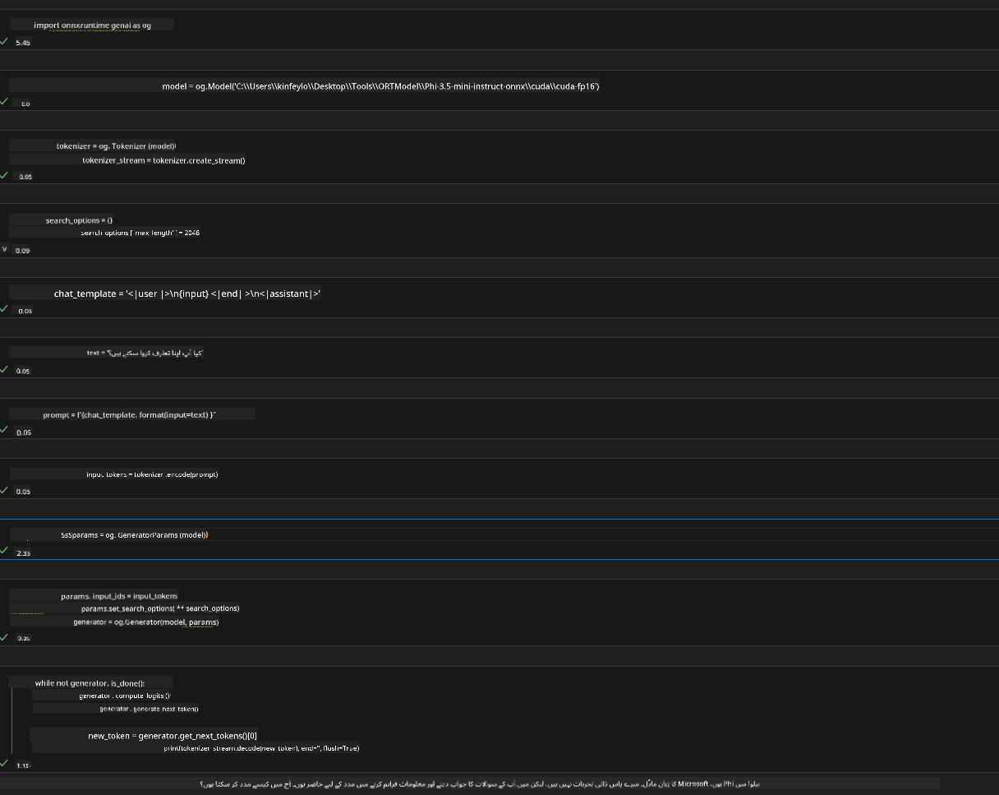
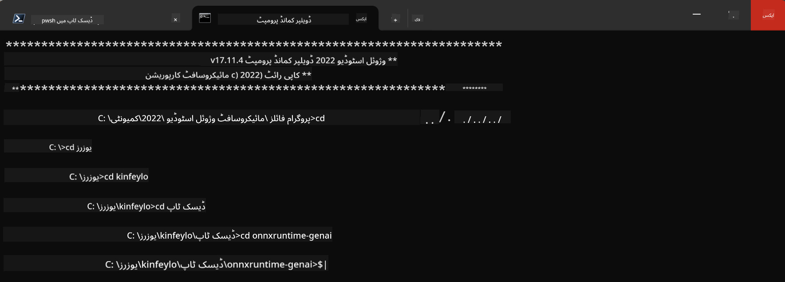

<!--
CO_OP_TRANSLATOR_METADATA:
{
  "original_hash": "9fe95f5575ecf5985eb9f67d205d0136",
  "translation_date": "2025-04-03T07:35:19+00:00",
  "source_file": "md\\02.Application\\01.TextAndChat\\Phi3\\ORTWindowGPUGuideline.md",
  "language_code": "ur"
}
-->
# **OnnxRuntime GenAI Windows GPU کے لیے رہنما**

یہ رہنما Windows پر GPUs کے ساتھ ONNX Runtime (ORT) کو ترتیب دینے اور استعمال کرنے کے مراحل فراہم کرتا ہے۔ اس کا مقصد آپ کو اپنے ماڈلز کے لیے GPU کی رفتار کا فائدہ اٹھانے میں مدد فراہم کرنا ہے، تاکہ کارکردگی اور مؤثریت میں بہتری آئے۔

یہ دستاویز درج ذیل پہلوؤں پر رہنمائی فراہم کرتی ہے:

- ماحول کی ترتیب: CUDA، cuDNN، اور ONNX Runtime جیسے ضروری انحصارات کو انسٹال کرنے کے لیے ہدایات۔
- ترتیب: GPU وسائل کو مؤثر طریقے سے استعمال کرنے کے لیے ماحول اور ONNX Runtime کو ترتیب دینے کا طریقہ۔
- بہتر کارکردگی کے نکات: GPU سیٹنگز کو بہترین کارکردگی کے لیے بہتر بنانے کے مشورے۔

### **1. Python 3.10.x /3.11.8**

   ***نوٹ*** [miniforge](https://github.com/conda-forge/miniforge/releases/latest/download/Miniforge3-Windows-x86_64.exe) کو Python ماحول کے طور پر استعمال کرنے کا مشورہ دیا جاتا ہے۔

   ```bash

   conda create -n pydev python==3.11.8

   conda activate pydev

   ```

   ***یاد دہانی*** اگر آپ نے پہلے ہی Python ONNX لائبریری انسٹال کی ہوئی ہے، تو براہ کرم اسے ان انسٹال کریں۔

### **2. CMake کو winget کے ساتھ انسٹال کریں**

   ```bash

   winget install -e --id Kitware.CMake

   ```

### **3. Visual Studio 2022 - C++ کے ساتھ ڈیسک ٹاپ ڈیولپمنٹ انسٹال کریں**

   ***نوٹ*** اگر آپ کمپائل کرنا نہیں چاہتے تو آپ اس مرحلے کو چھوڑ سکتے ہیں۔



### **4. NVIDIA ڈرائیور انسٹال کریں**

1. **NVIDIA GPU ڈرائیور** [https://www.nvidia.com/en-us/drivers/](https://www.nvidia.com/en-us/drivers/)

2. **NVIDIA CUDA 12.4** [https://developer.nvidia.com/cuda-12-4-0-download-archive](https://developer.nvidia.com/cuda-12-4-0-download-archive)

3. **NVIDIA CUDNN 9.4** [https://developer.nvidia.com/cudnn-downloads](https://developer.nvidia.com/cudnn-downloads)

***یاد دہانی*** انسٹالیشن کے دوران ڈیفالٹ سیٹنگز استعمال کریں۔

### **5. NVIDIA ماحول ترتیب دیں**

NVIDIA CUDNN 9.4 کے lib، bin، اور include فولڈرز کو NVIDIA CUDA 12.4 کے lib، bin، اور include فولڈرز میں کاپی کریں۔

- *'C:\Program Files\NVIDIA\CUDNN\v9.4\bin\12.6'* کی فائلز کو *'C:\Program Files\NVIDIA GPU Computing Toolkit\CUDA\v12.4\bin'* میں کاپی کریں۔

- *'C:\Program Files\NVIDIA\CUDNN\v9.4\include\12.6'* کی فائلز کو *'C:\Program Files\NVIDIA GPU Computing Toolkit\CUDA\v12.4\include'* میں کاپی کریں۔

- *'C:\Program Files\NVIDIA\CUDNN\v9.4\lib\12.6'* کی فائلز کو *'C:\Program Files\NVIDIA GPU Computing Toolkit\CUDA\v12.4\lib\x64'* میں کاپی کریں۔

### **6. Phi-3.5-mini-instruct-onnx ڈاؤنلوڈ کریں**

   ```bash

   winget install -e --id Git.Git

   winget install -e --id GitHub.GitLFS

   git lfs install

   git clone https://huggingface.co/microsoft/Phi-3.5-mini-instruct-onnx

   ```

### **7. InferencePhi35Instruct.ipynb چلائیں**

   [Notebook](../../../../../../code/09.UpdateSamples/Aug/ortgpu-phi35-instruct.ipynb) کو کھولیں اور اس پر عمل کریں۔



### **8. ORT GenAI GPU کو کمپائل کریں**

   ***نوٹ*** 

   1. پہلے تمام ONNX، ONNX Runtime، اور ONNX Runtime-GenAI کو ان انسٹال کریں۔

   ```bash

   pip list 
   
   ```

   پھر تمام ONNX Runtime لائبریریوں کو ان انسٹال کریں جیسے:

   ```bash

   pip uninstall onnxruntime

   pip uninstall onnxruntime-genai

   pip uninstall onnxruntume-genai-cuda
   
   ```

   2. Visual Studio Extension کی سپورٹ چیک کریں۔

   C:\Program Files\NVIDIA GPU Computing Toolkit\CUDA\v12.4\extras کو چیک کریں تاکہ یہ یقینی بنایا جا سکے کہ C:\Program Files\NVIDIA GPU Computing Toolkit\CUDA\v12.4\extras\visual_studio_integration موجود ہے۔

   اگر یہ موجود نہ ہو تو دیگر CUDA toolkit ڈرائیور فولڈرز چیک کریں اور visual_studio_integration فولڈر اور اس کے مواد کو C:\Program Files\NVIDIA GPU Computing Toolkit\CUDA\v12.4\extras\visual_studio_integration میں کاپی کریں۔

   - اگر آپ کمپائل کرنا نہیں چاہتے تو آپ اس مرحلے کو چھوڑ سکتے ہیں۔

   ```bash

   git clone https://github.com/microsoft/onnxruntime-genai

   ```

   - [https://github.com/microsoft/onnxruntime/releases/download/v1.19.2/onnxruntime-win-x64-gpu-1.19.2.zip](https://github.com/microsoft/onnxruntime/releases/download/v1.19.2/onnxruntime-win-x64-gpu-1.19.2.zip) کو ڈاؤنلوڈ کریں۔

   - onnxruntime-win-x64-gpu-1.19.2.zip کو ان زپ کریں، اور اس کا نام **ort** رکھیں، اور ort فولڈر کو onnxruntime-genai میں کاپی کریں۔

   - Windows Terminal کا استعمال کریں، VS 2022 کے Developer Command Prompt پر جائیں اور onnxruntime-genai میں جائیں۔



   - اسے اپنے Python ماحول کے ساتھ کمپائل کریں۔

   ```bash

   cd onnxruntime-genai

   python build.py --use_cuda  --cuda_home "C:\Program Files\NVIDIA GPU Computing Toolkit\CUDA\v12.4" --config Release
 

   cd build/Windows/Release/Wheel

   pip install .whl

   ```

**ڈسکلیمر**:  
یہ دستاویز AI ترجمہ سروس [Co-op Translator](https://github.com/Azure/co-op-translator) کا استعمال کرتے ہوئے ترجمہ کی گئی ہے۔ ہم درستگی کے لیے کوشش کرتے ہیں، لیکن براہ کرم یہ بات ذہن میں رکھیں کہ خودکار ترجمے میں غلطیاں یا عدم درستگیاں ہوسکتی ہیں۔ اصل دستاویز کو اس کی اصل زبان میں مستند ماخذ سمجھا جانا چاہیے۔ اہم معلومات کے لیے، پیشہ ور انسانی ترجمہ کی سفارش کی جاتی ہے۔ ہم اس ترجمے کے استعمال سے پیدا ہونے والی کسی بھی غلط فہمی یا غلط تشریح کے ذمہ دار نہیں ہیں۔