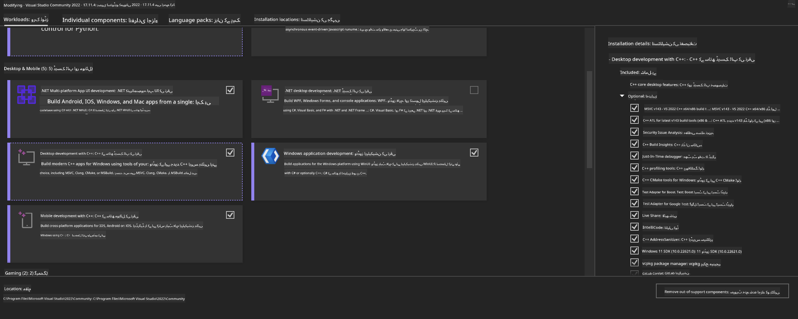
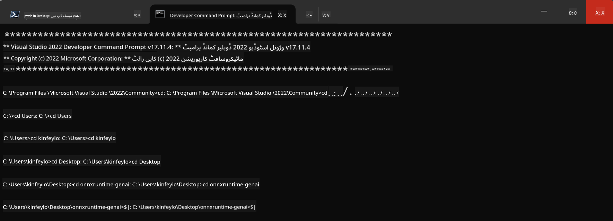

<!--
CO_OP_TRANSLATOR_METADATA:
{
  "original_hash": "b066fc29c1b2129df84e027cb75119ce",
  "translation_date": "2025-05-07T14:20:11+00:00",
  "source_file": "md/02.Application/01.TextAndChat/Phi3/ORTWindowGPUGuideline.md",
  "language_code": "ur"
}
-->
# **OnnxRuntime GenAI Windows GPU کے لیے رہنما اصول**

یہ رہنما اصول Windows پر GPUs کے ساتھ ONNX Runtime (ORT) کو سیٹ اپ اور استعمال کرنے کے مراحل فراہم کرتا ہے۔ اس کا مقصد آپ کے ماڈلز کے لیے GPU کی تیز رفتاری کو فائدہ پہنچانا ہے، تاکہ کارکردگی اور مؤثریت بہتر ہو۔

دستاویز میں درج ذیل رہنمائی دی گئی ہے:

- ماحول کی تیاری: CUDA، cuDNN، اور ONNX Runtime جیسے ضروری انحصارات کی تنصیب کے ہدایات۔
- ترتیب: GPU وسائل کو مؤثر طریقے سے استعمال کرنے کے لیے ماحول اور ONNX Runtime کی ترتیب کیسے کریں۔
- بہتر بنانے کے مشورے: بہترین کارکردگی کے لیے اپنے GPU کی ترتیبات کو بہتر بنانے کے طریقے۔

### **1. Python 3.10.x /3.11.8**

   ***Note*** اپنے Python ماحول کے لیے [miniforge](https://github.com/conda-forge/miniforge/releases/latest/download/Miniforge3-Windows-x86_64.exe) استعمال کرنے کی تجویز دی جاتی ہے

   ```bash

   conda create -n pydev python==3.11.8

   conda activate pydev

   ```

   ***Reminder*** اگر آپ نے Python ONNX لائبریری انسٹال کی ہے تو براہ کرم اسے ان انسٹال کریں

### **2. CMake کو winget کے ذریعے انسٹال کریں**

   ```bash

   winget install -e --id Kitware.CMake

   ```

### **3. Visual Studio 2022 - Desktop Development with C++ انسٹال کریں**

   ***Note*** اگر آپ کمپائل نہیں کرنا چاہتے تو اس مرحلے کو چھوڑ سکتے ہیں



### **4. NVIDIA ڈرائیور انسٹال کریں**

1. **NVIDIA GPU Driver**  [https://www.nvidia.com/en-us/drivers/](https://www.nvidia.com/en-us/drivers/)

2. **NVIDIA CUDA 12.4** [https://developer.nvidia.com/cuda-12-4-0-download-archive](https://developer.nvidia.com/cuda-12-4-0-download-archive)

3. **NVIDIA CUDNN 9.4**  [https://developer.nvidia.com/cudnn-downloads](https://developer.nvidia.com/cudnn-downloads)

***Reminder*** انسٹالیشن کے دوران براہ کرم ڈیفالٹ سیٹنگز استعمال کریں

### **5. NVIDIA ماحول سیٹ کریں**

NVIDIA CUDNN 9.4 کی lib, bin, include فائلز کو NVIDIA CUDA 12.4 کی lib, bin, include میں کاپی کریں

- *'C:\Program Files\NVIDIA\CUDNN\v9.4\bin\12.6'* کی فائلز کو *'C:\Program Files\NVIDIA GPU Computing Toolkit\CUDA\v12.4\bin'* میں کاپی کریں

- *'C:\Program Files\NVIDIA\CUDNN\v9.4\include\12.6'* کی فائلز کو *'C:\Program Files\NVIDIA GPU Computing Toolkit\CUDA\v12.4\include'* میں کاپی کریں

- *'C:\Program Files\NVIDIA\CUDNN\v9.4\lib\12.6'* کی فائلز کو *'C:\Program Files\NVIDIA GPU Computing Toolkit\CUDA\v12.4\lib\x64'* میں کاپی کریں

### **6. Phi-3.5-mini-instruct-onnx ڈاؤن لوڈ کریں**

   ```bash

   winget install -e --id Git.Git

   winget install -e --id GitHub.GitLFS

   git lfs install

   git clone https://huggingface.co/microsoft/Phi-3.5-mini-instruct-onnx

   ```

### **7. InferencePhi35Instruct.ipynb چلائیں**

   [Notebook](../../../../../../code/09.UpdateSamples/Aug/ortgpu-phi35-instruct.ipynb) کھولیں اور اسے ایکزیکیوٹ کریں


### **8. ORT GenAI GPU کمپائل کریں**

   ***Note***  
   
   1. براہ کرم پہلے تمام onnx، onnxruntime، اور onnxruntime-genai کو ان انسٹال کریں

   ```bash

   pip list 
   
   ```

   پھر تمام onnxruntime لائبریریز کو ان انسٹال کریں، یعنی

   ```bash

   pip uninstall onnxruntime

   pip uninstall onnxruntime-genai

   pip uninstall onnxruntume-genai-cuda
   
   ```

   2. Visual Studio Extension کی سپورٹ چیک کریں

   C:\Program Files\NVIDIA GPU Computing Toolkit\CUDA\v12.4\extras میں چیک کریں کہ C:\Program Files\NVIDIA GPU Computing Toolkit\CUDA\v12.4\extras\visual_studio_integration موجود ہے یا نہیں۔  
   
   اگر نہیں ملا تو دوسرے Cuda toolkit ڈرائیور فولڈرز چیک کریں اور visual_studio_integration فولڈر اور اس کے مواد کو C:\Program Files\NVIDIA GPU Computing Toolkit\CUDA\v12.4\extras\visual_studio_integration میں کاپی کریں

   - اگر آپ کمپائل نہیں کرنا چاہتے تو اس مرحلے کو چھوڑ سکتے ہیں

   ```bash

   git clone https://github.com/microsoft/onnxruntime-genai

   ```

   - [https://github.com/microsoft/onnxruntime/releases/download/v1.19.2/onnxruntime-win-x64-gpu-1.19.2.zip](https://github.com/microsoft/onnxruntime/releases/download/v1.19.2/onnxruntime-win-x64-gpu-1.19.2.zip) ڈاؤن لوڈ کریں

   - onnxruntime-win-x64-gpu-1.19.2.zip کو ان زپ کریں، اور اسے **ort** کے نام سے ری نیم کریں، ort فولڈر کو onnxruntime-genai میں کاپی کریں

   - Windows Terminal استعمال کرتے ہوئے، VS 2022 کے Developer Command Prompt میں جائیں اور onnxruntime-genai فولڈر پر جائیں



   - اسے اپنے Python ماحول کے ساتھ کمپائل کریں

   ```bash

   cd onnxruntime-genai

   python build.py --use_cuda  --cuda_home "C:\Program Files\NVIDIA GPU Computing Toolkit\CUDA\v12.4" --config Release
 

   cd build/Windows/Release/Wheel

   pip install .whl

   ```

**ڈس کلیمر**:  
یہ دستاویز AI ترجمہ سروس [Co-op Translator](https://github.com/Azure/co-op-translator) کا استعمال کرتے ہوئے ترجمہ کی گئی ہے۔ اگرچہ ہم درستگی کے لیے کوشاں ہیں، براہ کرم اس بات سے آگاہ رہیں کہ خودکار ترجموں میں غلطیاں یا بے ضابطگیاں ہو سکتی ہیں۔ اصل دستاویز اپنی مادری زبان میں ہی مستند ذریعہ سمجھی جانی چاہیے۔ اہم معلومات کے لیے پیشہ ورانہ انسانی ترجمہ کی سفارش کی جاتی ہے۔ ہم اس ترجمے کے استعمال سے پیدا ہونے والی کسی بھی غلط فہمی یا غلط تعبیر کے ذمہ دار نہیں ہیں۔