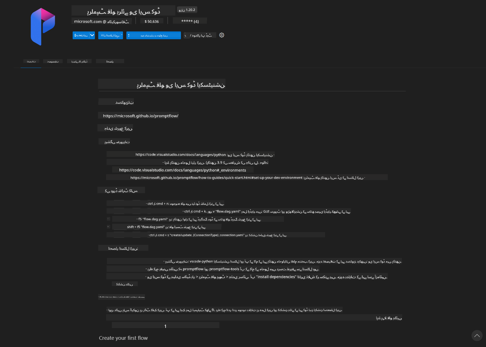
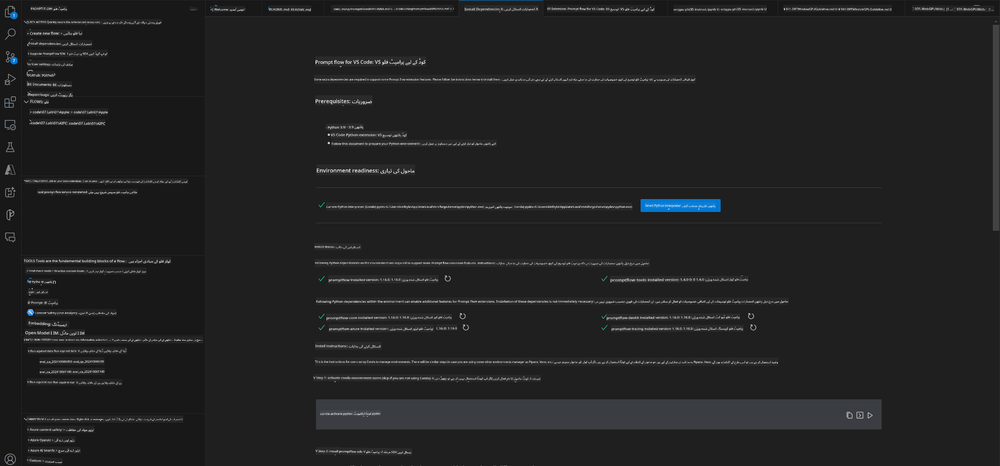
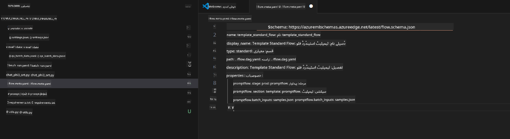
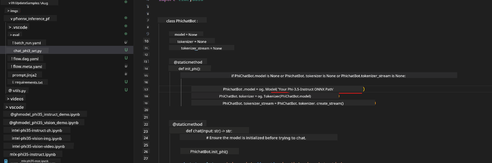
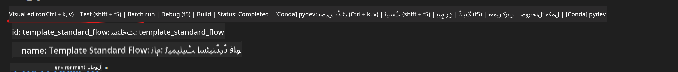
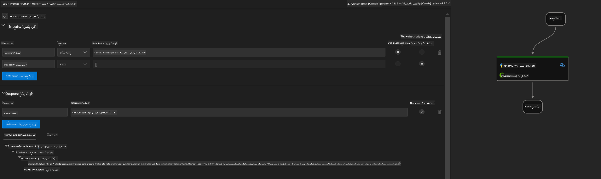
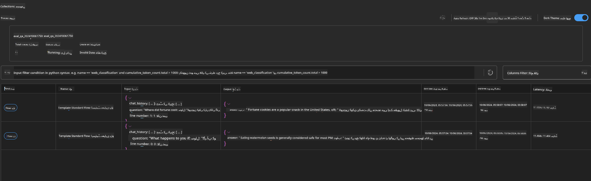

<!--
CO_OP_TRANSLATOR_METADATA:
{
  "original_hash": "92e7dac1e5af0dd7c94170fdaf6860fe",
  "translation_date": "2025-05-07T13:59:07+00:00",
  "source_file": "md/02.Application/01.TextAndChat/Phi3/UsingPromptFlowWithONNX.md",
  "language_code": "ur"
}
-->
# استعمال ونڈوز GPU کے ساتھ Phi-3.5-Instruct ONNX کے ذریعے Prompt flow حل بنانا

مندرجہ ذیل دستاویز اس بات کی مثال ہے کہ کس طرح PromptFlow کو ONNX (Open Neural Network Exchange) کے ساتھ Phi-3 ماڈلز کی بنیاد پر AI ایپلیکیشنز تیار کرنے کے لیے استعمال کیا جائے۔

PromptFlow ایک ترقیاتی اوزاروں کا مجموعہ ہے جو LLM-based (Large Language Model) AI ایپلیکیشنز کے مکمل ترقیاتی عمل کو آسان بنانے کے لیے بنایا گیا ہے، جس میں خیال سازی، پروٹوٹائپنگ، ٹیسٹنگ اور تشخیص شامل ہیں۔

PromptFlow کو ONNX کے ساتھ مربوط کرکے، ڈویلپرز یہ کر سکتے ہیں:

- ماڈل کی کارکردگی کو بہتر بنائیں: ONNX کا استعمال کرکے مؤثر ماڈل انفیرنس اور تعیناتی کریں۔
- ترقی کو آسان بنائیں: PromptFlow کا استعمال کرکے ورک فلو کو منظم کریں اور دہرائے جانے والے کاموں کو خودکار بنائیں۔
- تعاون کو بڑھائیں: ٹیم کے ارکان کے درمیان بہتر تعاون کو فروغ دیں ایک متحد ترقیاتی ماحول فراہم کرکے۔

**Prompt flow** ایک ترقیاتی اوزاروں کا مجموعہ ہے جو LLM-based AI ایپلیکیشنز کے مکمل ترقیاتی عمل کو آسان بنانے کے لیے بنایا گیا ہے، جس میں خیال سازی، پروٹوٹائپنگ، ٹیسٹنگ، تشخیص، پیداوار میں تعیناتی اور نگرانی شامل ہیں۔ یہ پرامپٹ انجینئرنگ کو بہت آسان بناتا ہے اور آپ کو پروڈکشن معیار کے ساتھ LLM ایپس بنانے کے قابل بناتا ہے۔

Prompt flow OpenAI، Azure OpenAI Service، اور حسب ضرورت ماڈلز (Huggingface، مقامی LLM/SLM) سے منسلک ہو سکتا ہے۔ ہم امید کرتے ہیں کہ Phi-3.5 کا quantized ONNX ماڈل مقامی ایپلیکیشنز میں تعینات کریں گے۔ Prompt flow ہماری کاروباری منصوبہ بندی کو بہتر بنانے اور Phi-3.5 کی بنیاد پر مقامی حل مکمل کرنے میں مدد کر سکتا ہے۔ اس مثال میں، ہم ONNX Runtime GenAI Library کو ملائیں گے تاکہ ونڈوز GPU کی بنیاد پر Prompt flow حل مکمل کیا جا سکے۔

## **تنصیب**

### **ONNX Runtime GenAI برائے ونڈوز GPU**

ونڈوز GPU کے لیے ONNX Runtime GenAI سیٹ کرنے کے لیے اس رہنما کو پڑھیں [یہاں کلک کریں](./ORTWindowGPUGuideline.md)

### **VSCode میں Prompt flow سیٹ اپ کریں**

1. Prompt flow VS Code ایکسٹینشن انسٹال کریں



2. Prompt flow VS Code ایکسٹینشن انسٹال کرنے کے بعد، ایکسٹینشن پر کلک کریں، اور **Installation dependencies** منتخب کریں، اس رہنما کے مطابق اپنی ماحول میں Prompt flow SDK انسٹال کریں



3. [Sample Code](../../../../../../code/09.UpdateSamples/Aug/pf/onnx_inference_pf) ڈاؤن لوڈ کریں اور VS Code میں یہ سیمپل کھولیں



4. اپنی Python ماحول منتخب کرنے کے لیے **flow.dag.yaml** کھولیں


   اپنی Phi-3.5-instruct ONNX ماڈل کی جگہ تبدیل کرنے کے لیے **chat_phi3_ort.py** کھولیں



5. ٹیسٹنگ کے لیے اپنا prompt flow چلائیں

**flow.dag.yaml** کھولیں اور visual editor پر کلک کریں



اس پر کلک کرنے کے بعد، اسے چلائیں اور ٹیسٹ کریں



1. آپ مزید نتائج جانچنے کے لیے ٹرمینل میں بیچ چلا سکتے ہیں

```bash

pf run create --file batch_run.yaml --stream --name 'Your eval qa name'    

```

آپ اپنے ڈیفالٹ براؤزر میں نتائج دیکھ سکتے ہیں



**دستخطی**:  
یہ دستاویز AI ترجمہ سروس [Co-op Translator](https://github.com/Azure/co-op-translator) کے ذریعے ترجمہ کی گئی ہے۔ اگرچہ ہم درستگی کے لیے کوشاں ہیں، براہ کرم آگاہ رہیں کہ خودکار ترجموں میں غلطیاں یا عدم درستیاں ہو سکتی ہیں۔ اصل دستاویز اپنی مادری زبان میں مستند ماخذ سمجھی جانی چاہیے۔ اہم معلومات کے لیے پیشہ ور انسانی ترجمہ کی سفارش کی جاتی ہے۔ اس ترجمے کے استعمال سے پیدا ہونے والی کسی بھی غلط فہمی یا غلط تعبیر کے لیے ہم ذمہ دار نہیں ہیں۔