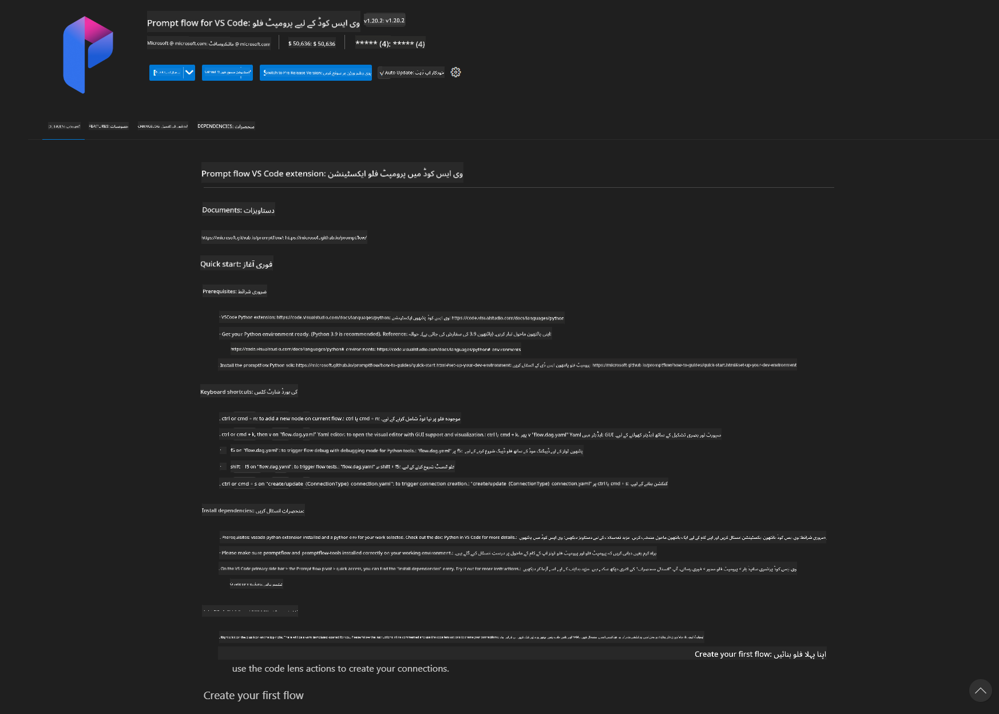
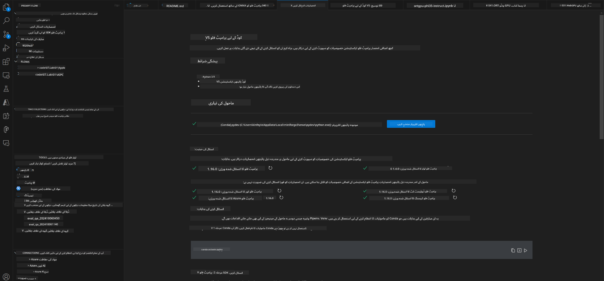
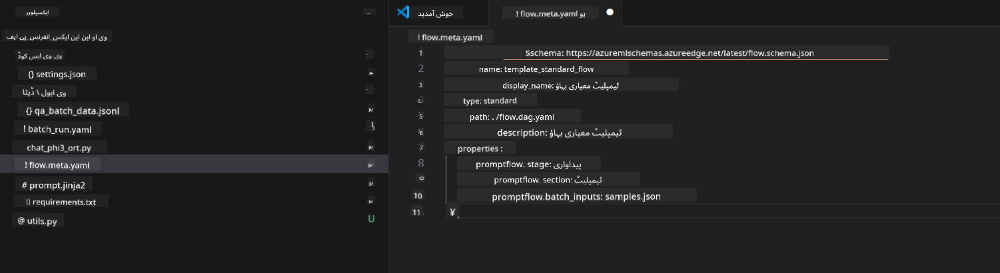
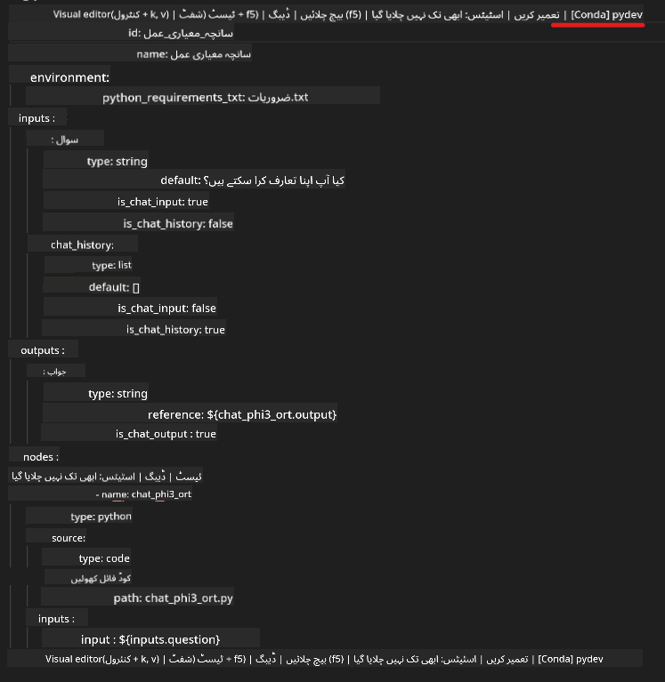
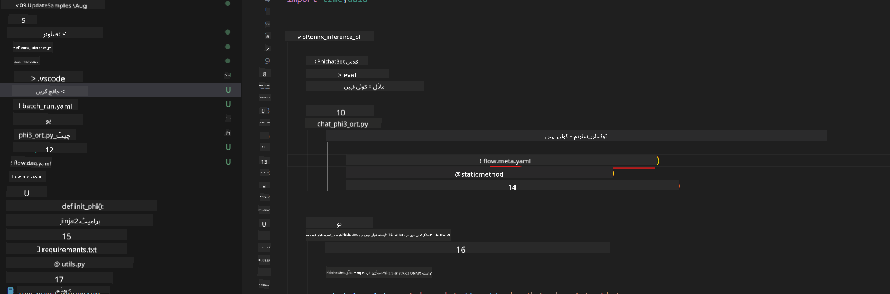
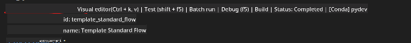
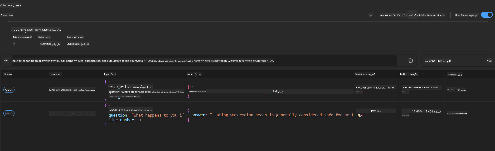

<!--
CO_OP_TRANSLATOR_METADATA:
{
  "original_hash": "20c7e34651318736a2606d351fcc37d0",
  "translation_date": "2025-04-03T07:37:23+00:00",
  "source_file": "md\\02.Application\\01.TextAndChat\\Phi3\\UsingPromptFlowWithONNX.md",
  "language_code": "ur"
}
-->
# ونڈوز GPU کا استعمال کرتے ہوئے Phi-3.5-Instruct ONNX کے ساتھ پرامپٹ فلو حل بنانا

یہ دستاویز ایک مثال ہے کہ کیسے پرامپٹ فلو کو ONNX (اوپن نیورل نیٹ ورک ایکسچینج) کے ساتھ استعمال کیا جا سکتا ہے تاکہ Phi-3 ماڈلز پر مبنی AI ایپلیکیشنز تیار کی جا سکیں۔

پرامپٹ فلو ایک ترقیاتی ٹولز کا مجموعہ ہے جو LLM-based (بڑے زبان ماڈلز پر مبنی) AI ایپلیکیشنز کی ترقی کے مکمل عمل کو آسان بنانے کے لیے بنایا گیا ہے، جس میں تخلیق، پروٹوٹائپنگ، ٹیسٹنگ اور جانچ شامل ہیں۔

پرامپٹ فلو کو ONNX کے ساتھ جوڑ کر، ڈیولپرز یہ فوائد حاصل کر سکتے ہیں:

- **ماڈل کی کارکردگی کو بہتر بنائیں:** ONNX کا استعمال کرتے ہوئے ماڈل کی مؤثر انفرینس اور ڈپلائمنٹ کو بہتر بنائیں۔
- **ترقی کو آسان بنائیں:** پرامپٹ فلو کے ذریعے ورک فلو کا انتظام کریں اور بار بار ہونے والے کاموں کو خودکار کریں۔
- **تعاون کو بڑھائیں:** ٹیم کے ممبران کے درمیان بہتر تعاون کو فروغ دیں اور ایک متحد ترقیاتی ماحول فراہم کریں۔

**پرامپٹ فلو** ایک ترقیاتی ٹولز کا مجموعہ ہے جو LLM-based AI ایپلیکیشنز کی ترقی کے مکمل عمل کو آسان بنانے کے لیے بنایا گیا ہے، جس میں تخلیق، پروٹوٹائپنگ، ٹیسٹنگ، جانچ، پروڈکشن ڈپلائمنٹ اور مانیٹرنگ شامل ہیں۔ یہ پرامپٹ انجینئرنگ کو بہت آسان بناتا ہے اور آپ کو پروڈکشن معیار کے ساتھ LLM ایپلیکیشنز بنانے کی اجازت دیتا ہے۔

پرامپٹ فلو OpenAI، Azure OpenAI Service، اور کسٹمائز ایبل ماڈلز (Huggingface، لوکل LLM/SLM) کے ساتھ جڑ سکتا ہے۔ ہم امید کرتے ہیں کہ Phi-3.5 کا کوانٹائزڈ ONNX ماڈل لوکل ایپلیکیشنز میں ڈپلائے کریں۔ پرامپٹ فلو ہمیں اپنے کاروبار کو بہتر طور پر منصوبہ بندی کرنے اور Phi-3.5 پر مبنی لوکل حل مکمل کرنے میں مدد فراہم کر سکتا ہے۔ اس مثال میں، ہم ONNX Runtime GenAI Library کو استعمال کرتے ہوئے ونڈوز GPU پر مبنی پرامپٹ فلو حل مکمل کریں گے۔

## **انسٹالیشن**

### **ونڈوز GPU کے لیے ONNX Runtime GenAI**

ونڈوز GPU کے لیے ONNX Runtime GenAI کو سیٹ اپ کرنے کے لیے اس گائیڈ لائن کو پڑھیں [یہاں کلک کریں](./ORTWindowGPUGuideline.md)

### **VSCode میں پرامپٹ فلو سیٹ اپ کریں**

1. پرامپٹ فلو VS Code ایکسٹینشن انسٹال کریں



2. پرامپٹ فلو VS Code ایکسٹینشن انسٹال کرنے کے بعد، ایکسٹینشن پر کلک کریں، اور **انسٹالیشن ڈیپینڈینسیز** منتخب کریں۔ اس گائیڈ لائن کے مطابق اپنی انوائرمنٹ میں پرامپٹ فلو SDK انسٹال کریں۔



3. [نمونہ کوڈ](../../../../../../code/09.UpdateSamples/Aug/pf/onnx_inference_pf) ڈاؤن لوڈ کریں اور اس نمونے کو VS Code میں کھولیں۔



4. **flow.dag.yaml** فائل کھولیں اور اپنے Python انوائرمنٹ کا انتخاب کریں۔



   **chat_phi3_ort.py** فائل کھولیں اور اپنے Phi-3.5-instruct ONNX ماڈل کی لوکیشن تبدیل کریں۔



5. اپنا پرامپٹ فلو چلائیں اور ٹیسٹنگ کریں۔

**flow.dag.yaml** فائل کھولیں اور ویژول ایڈیٹر پر کلک کریں۔



ویژول ایڈیٹر پر کلک کرنے کے بعد، اسے چلائیں اور ٹیسٹ کریں۔


1. مزید نتائج دیکھنے کے لیے ٹرمینل میں بیچ چلائیں۔

```bash

pf run create --file batch_run.yaml --stream --name 'Your eval qa name'    

```

آپ اپنے ڈیفالٹ براؤزر میں نتائج دیکھ سکتے ہیں۔



**ڈسکلیمر**:  
یہ دستاویز AI ترجمہ سروس [Co-op Translator](https://github.com/Azure/co-op-translator) کا استعمال کرتے ہوئے ترجمہ کی گئی ہے۔ ہم درستگی کی بھرپور کوشش کرتے ہیں، لیکن براہ کرم آگاہ رہیں کہ خودکار ترجمے میں غلطیاں یا خامیاں ہو سکتی ہیں۔ اصل دستاویز کو اس کی اصل زبان میں مستند ذریعہ سمجھا جانا چاہیے۔ اہم معلومات کے لیے، پیشہ ور انسانی ترجمے کی سفارش کی جاتی ہے۔ اس ترجمے کے استعمال سے پیدا ہونے والی کسی بھی غلط فہمی یا غلط تشریح کے لیے ہم ذمہ دار نہیں ہیں۔