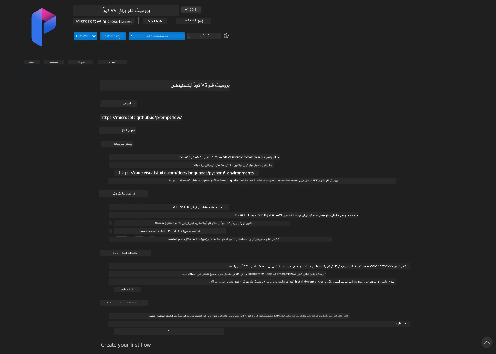
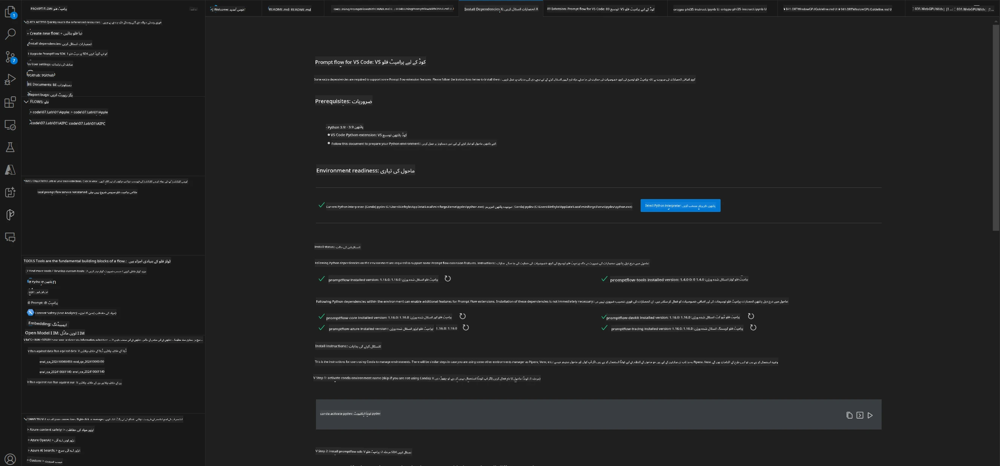
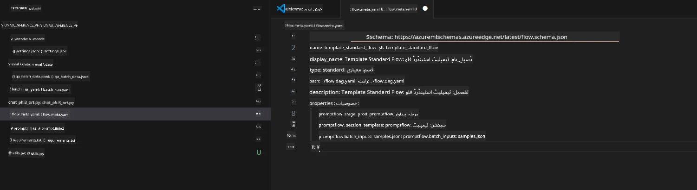
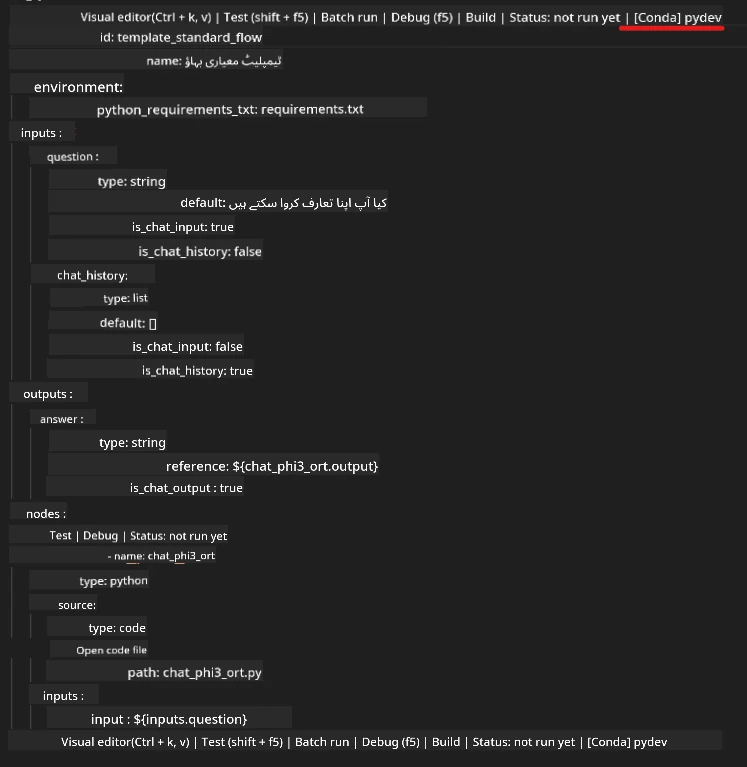
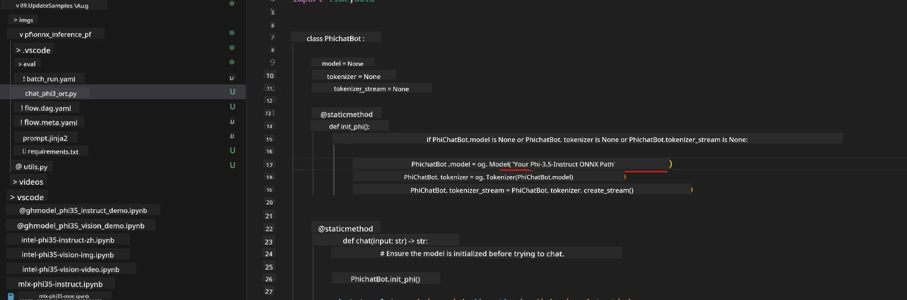
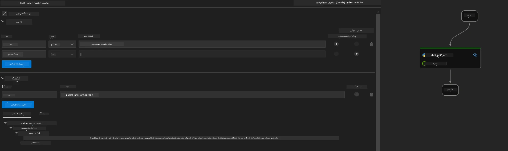
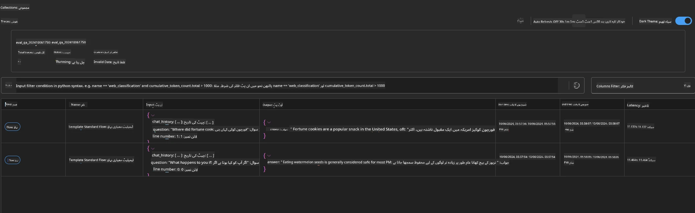

# ونڈوز GPU کا استعمال کرتے ہوئے Phi-3.5-Instruct ONNX کے ساتھ Prompt flow حل بنانا

درج ذیل دستاویز ایک مثال ہے کہ Phi-3 ماڈلز کی بنیاد پر AI ایپلیکیشنز تیار کرنے کے لیے ONNX (Open Neural Network Exchange) کے ساتھ PromptFlow کو کیسے استعمال کیا جائے۔

PromptFlow ایک ترقیاتی ٹولز کا مجموعہ ہے جو LLM-based (بڑے زبان ماڈل) AI ایپلیکیشنز کے اختتام سے اختتام تک ترقیاتی عمل کو آسان بنانے کے لیے ڈیزائن کیا گیا ہے، تخلیق سے لے کر پروٹوٹائپنگ، جانچ اور تشخیص تک۔

ONNX کے ساتھ PromptFlow کو یکجا کرکے، ڈویلپرز یہ کر سکتے ہیں:

- ماڈل کی کارکردگی کو بہتر بنائیں: مؤثر ماڈل انفَرنس اور تعیناتی کے لئے ONNX کا فائدہ اٹھائیں۔
- ترقی کو آسان بنائیں: ورک فلو کو منظم کرنے اور دہرائے جانے والے کاموں کو خودکار بنانے کے لیے PromptFlow استعمال کریں۔
- تعاون کو بڑھائیں: ٹیم کے ارکان کے درمیان بہتر تعاون کو فروغ دیں ایک متحد ترقیاتی ماحول فراہم کرکے۔

**Prompt flow** ایک ترقیاتی ٹولز کا مجموعہ ہے جو LLM-based AI ایپلیکیشنز کے اختتام سے اختتام تک ترقیاتی چکر کو آسان بناتا ہے، تخلیق، پروٹوٹائپنگ، ٹیسٹنگ، تشخیص سے لے کر پروڈکشن تعیناتی اور مانیٹرنگ تک۔ یہ پرامپٹ انجینئرنگ کو بہت آسان بناتا ہے اور آپ کو پروڈکشن معیار کی LLM ایپس بنانے کے قابل بناتا ہے۔

Prompt flow OpenAI، Azure OpenAI Service، اور حسب ضرورت ماڈلز (Huggingface، مقامی LLM/SLM) سے جڑ سکتا ہے۔ ہم امید کرتے ہیں کہ Phi-3.5 کے کوانٹائزڈ ONNX ماڈل کو مقامی ایپلیکیشنز پر تعینات کریں گے۔ Prompt flow ہمیں اپنے کاروبار کی بہتر منصوبہ بندی کرنے اور Phi-3.5 کی بنیاد پر مقامی حل مکمل کرنے میں مدد دے سکتا ہے۔ اس مثال میں، ہم Windows GPU کی بنیاد پر Prompt flow حل مکمل کرنے کے لیے ONNX Runtime GenAI لائبریری کو یکجا کریں گے۔

## **تنصیب**

### **ونڈوز GPU کے لیے ONNX Runtime GenAI**

ونڈوز GPU کے لیے ONNX Runtime GenAI سیٹ کرنے کے لیے یہ رہنمائی پڑھیں [click here](./ORTWindowGPUGuideline.md)

### **VSCode میں Prompt flow سیٹ کریں**

1. Prompt flow VS Code एक्सٹینشن انسٹال کریں



2. Prompt flow VS Code एक्सٹینشن انسٹال کرنے کے بعد، اس پر کلک کریں، اور **Installation dependencies** منتخب کریں، اس رہنمائی کے مطابق اپنے ماحولیاتی نظام میں Prompt flow SDK انسٹال کریں



3. [Sample Code](../../../../../../code/09.UpdateSamples/Aug/pf/onnx_inference_pf) ڈاؤن لوڈ کریں اور VS Code میں یہ نمونہ کھولیں



4. **flow.dag.yaml** کھولیں اور اپنی Python ماحولیاتی نظام کا انتخاب کریں



   **chat_phi3_ort.py** کھولیں اور اپنے Phi-3.5-instruct ONNX ماڈل کی جگہ تبدیل کریں



5. اپنے prompt flow کو جانچنے کے لیے چلائیں

**flow.dag.yaml** کھولیں اور visual editor پر کلک کریں


اس پر کلک کرنے کے بعد، چلائیں اور جانچ کریں



1. آپ ٹرمینل میں بیچ بھی چلا کر مزید نتائج چیک کر سکتے ہیں


```bash

pf run create --file batch_run.yaml --stream --name 'Your eval qa name'    

```

آپ اپنے ڈیفالٹ براؤزر میں نتائج چیک کر سکتے ہیں




---

<!-- CO-OP TRANSLATOR DISCLAIMER START -->
**ڈس کلیمر**:
یہ دستاویز AI ترجمہ سروس [Co-op Translator](https://github.com/Azure/co-op-translator) کے ذریعے ترجمہ کی گئی ہے۔ جبکہ ہم درستگی کے لیے کوشاں ہیں، براہ کرم اس بات سے آگاہ رہیں کہ خودکار ترجمے میں غلطیاں یا عدم درستیاں ہو سکتی ہیں۔ اصل دستاویز اپنے مادری زبان میں مستند ماخذ سمجھی جائے گی۔ حساس معلومات کے لیے پیشہ ور انسانی ترجمہ کی سفارش کی جاتی ہے۔ اس ترجمے کے استعمال سے پیدا ہونے والی کسی بھی غلط فہمی یا غلط تشریح کی ذمہ داری ہم قبول نہیں کرتے۔
<!-- CO-OP TRANSLATOR DISCLAIMER END -->