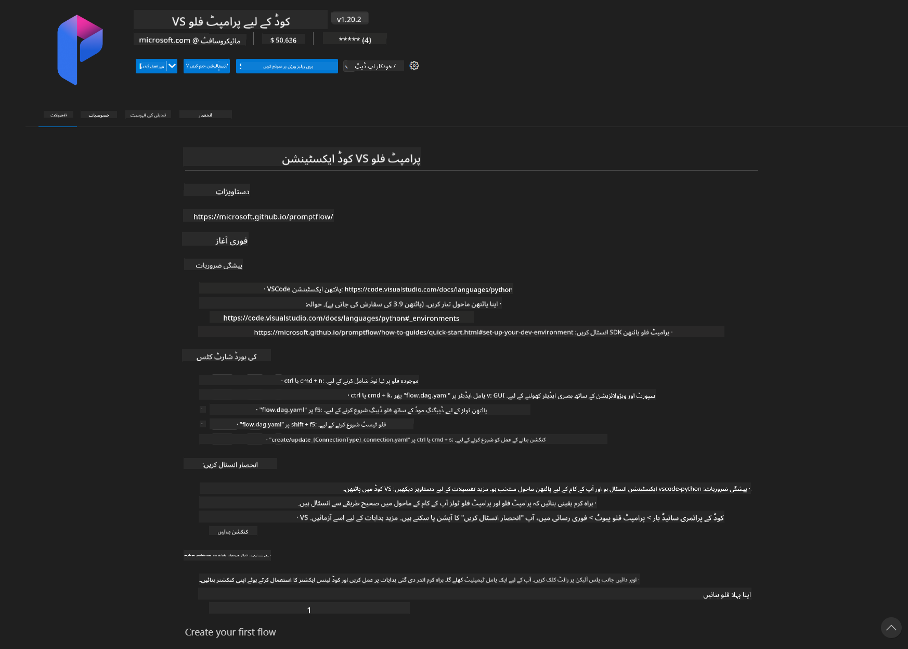
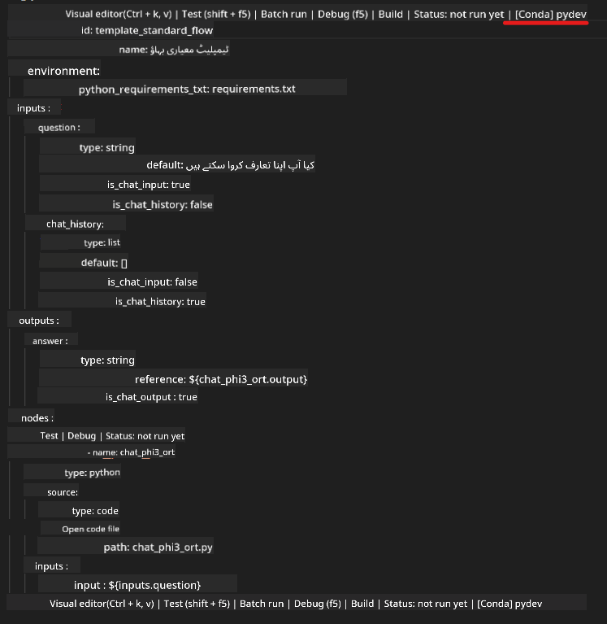
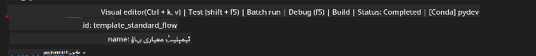

<!--
CO_OP_TRANSLATOR_METADATA:
{
  "original_hash": "92e7dac1e5af0dd7c94170fdaf6860fe",
  "translation_date": "2025-07-17T02:57:29+00:00",
  "source_file": "md/02.Application/01.TextAndChat/Phi3/UsingPromptFlowWithONNX.md",
  "language_code": "ur"
}
-->
# ونڈوز GPU استعمال کرتے ہوئے Phi-3.5-Instruct ONNX کے ساتھ Prompt flow حل بنانا

مندرجہ ذیل دستاویز ایک مثال ہے کہ کس طرح PromptFlow کو ONNX (Open Neural Network Exchange) کے ساتھ Phi-3 ماڈلز کی بنیاد پر AI ایپلیکیشنز تیار کرنے کے لیے استعمال کیا جا سکتا ہے۔

PromptFlow ایک ترقیاتی ٹولز کا مجموعہ ہے جو LLM-based (Large Language Model) AI ایپلیکیشنز کی مکمل ترقیاتی سائیکل کو آسان بنانے کے لیے ڈیزائن کیا گیا ہے، جس میں خیال سازی، پروٹوٹائپنگ، ٹیسٹنگ اور جائزہ شامل ہیں۔

PromptFlow کو ONNX کے ساتھ مربوط کر کے، ڈویلپرز یہ کر سکتے ہیں:

- ماڈل کی کارکردگی کو بہتر بنائیں: ONNX کا استعمال کرتے ہوئے ماڈل کی مؤثر انفرنس اور تعیناتی کریں۔
- ترقی کو آسان بنائیں: PromptFlow کا استعمال کر کے ورک فلو کو منظم کریں اور دہرائے جانے والے کاموں کو خودکار بنائیں۔
- تعاون کو بڑھائیں: ٹیم کے اراکین کے درمیان بہتر تعاون کے لیے ایک متحد ترقیاتی ماحول فراہم کریں۔

**Prompt flow** ایک ترقیاتی ٹولز کا مجموعہ ہے جو LLM-based AI ایپلیکیشنز کی مکمل ترقیاتی سائیکل کو آسان بناتا ہے، جس میں خیال سازی، پروٹوٹائپنگ، ٹیسٹنگ، جائزہ، پیداوار میں تعیناتی اور نگرانی شامل ہیں۔ یہ پرامپٹ انجینئرنگ کو بہت آسان بناتا ہے اور آپ کو پروڈکشن معیار کے LLM ایپس بنانے کے قابل بناتا ہے۔

Prompt flow OpenAI، Azure OpenAI Service، اور حسب ضرورت ماڈلز (Huggingface، مقامی LLM/SLM) سے جڑ سکتا ہے۔ ہمارا مقصد Phi-3.5 کے quantized ONNX ماڈل کو مقامی ایپلیکیشنز میں تعینات کرنا ہے۔ Prompt flow ہماری مدد کر سکتا ہے کہ ہم اپنے کاروبار کی بہتر منصوبہ بندی کریں اور Phi-3.5 کی بنیاد پر مقامی حل مکمل کریں۔ اس مثال میں، ہم ONNX Runtime GenAI Library کو ونڈوز GPU کی بنیاد پر Prompt flow حل مکمل کرنے کے لیے یکجا کریں گے۔

## **انسٹالیشن**

### **ونڈوز GPU کے لیے ONNX Runtime GenAI**

ونڈوز GPU کے لیے ONNX Runtime GenAI سیٹ کرنے کے لیے اس رہنما کو پڑھیں [یہاں کلک کریں](./ORTWindowGPUGuideline.md)

### **VSCode میں Prompt flow سیٹ اپ کریں**

1. Prompt flow VS Code ایکسٹینشن انسٹال کریں



2. Prompt flow VS Code ایکسٹینشن انسٹال کرنے کے بعد، ایکسٹینشن پر کلک کریں، اور **Installation dependencies** منتخب کریں، اس رہنما کے مطابق اپنے ماحول میں Prompt flow SDK انسٹال کریں


3. [Sample Code](../../../../../../code/09.UpdateSamples/Aug/pf/onnx_inference_pf) ڈاؤن لوڈ کریں اور VS Code میں یہ سیمپل کھولیں


4. **flow.dag.yaml** کھولیں اور اپنا Python ماحول منتخب کریں



   **chat_phi3_ort.py** کھولیں اور اپنے Phi-3.5-instruct ONNX ماڈل کی جگہ تبدیل کریں


5. اپنے prompt flow کو ٹیسٹ کرنے کے لیے چلائیں

**flow.dag.yaml** کھولیں اور visual editor پر کلک کریں



اس پر کلک کرنے کے بعد، اسے چلائیں اور ٹیسٹ کریں


1. آپ ٹرمینل میں بیچ چلا کر مزید نتائج چیک کر سکتے ہیں

```bash

pf run create --file batch_run.yaml --stream --name 'Your eval qa name'    

```

آپ اپنے ڈیفالٹ براؤزر میں نتائج دیکھ سکتے ہیں


**دستخطی نوٹ**:  
یہ دستاویز AI ترجمہ سروس [Co-op Translator](https://github.com/Azure/co-op-translator) کے ذریعے ترجمہ کی گئی ہے۔ اگرچہ ہم درستگی کے لیے کوشاں ہیں، براہ کرم آگاہ رہیں کہ خودکار ترجمے میں غلطیاں یا عدم درستیاں ہو سکتی ہیں۔ اصل دستاویز اپنی مادری زبان میں ہی معتبر ماخذ سمجھی جانی چاہیے۔ اہم معلومات کے لیے پیشہ ور انسانی ترجمہ کی سفارش کی جاتی ہے۔ اس ترجمے کے استعمال سے پیدا ہونے والی کسی بھی غلط فہمی یا غلط تشریح کی ذمہ داری ہم پر عائد نہیں ہوتی۔