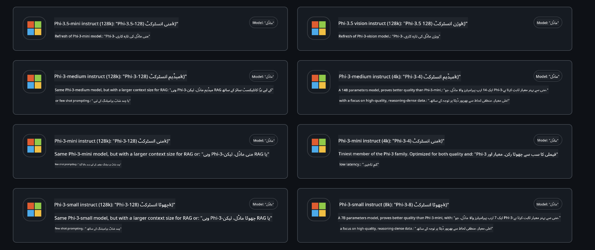
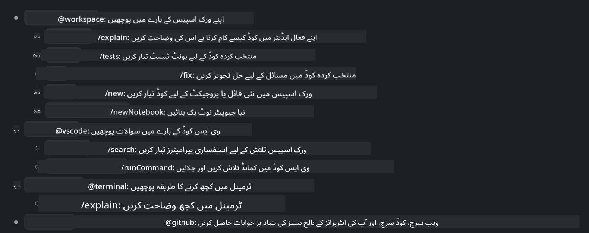
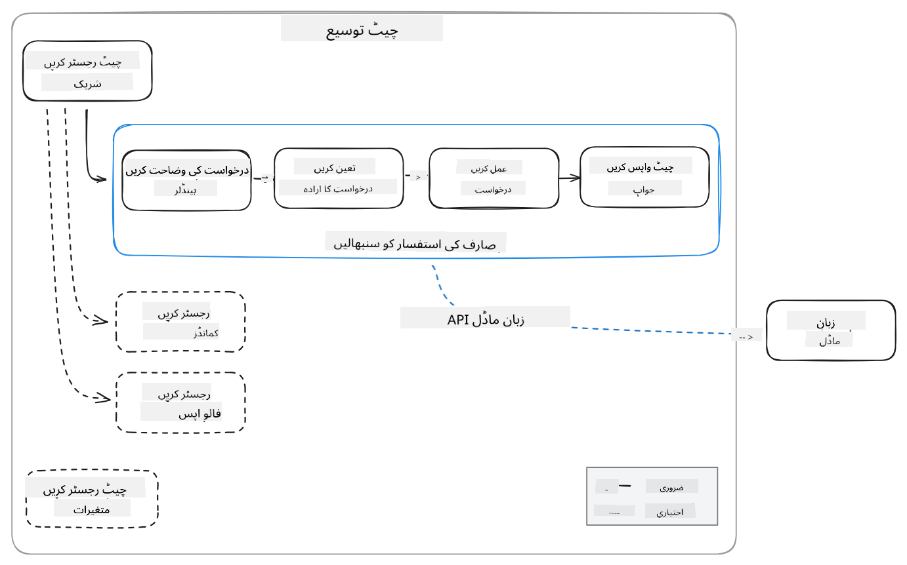
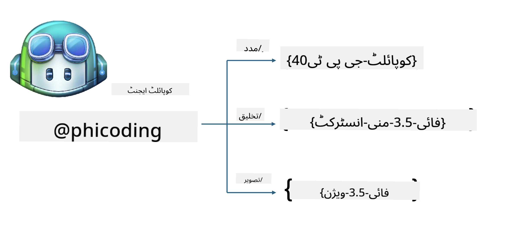
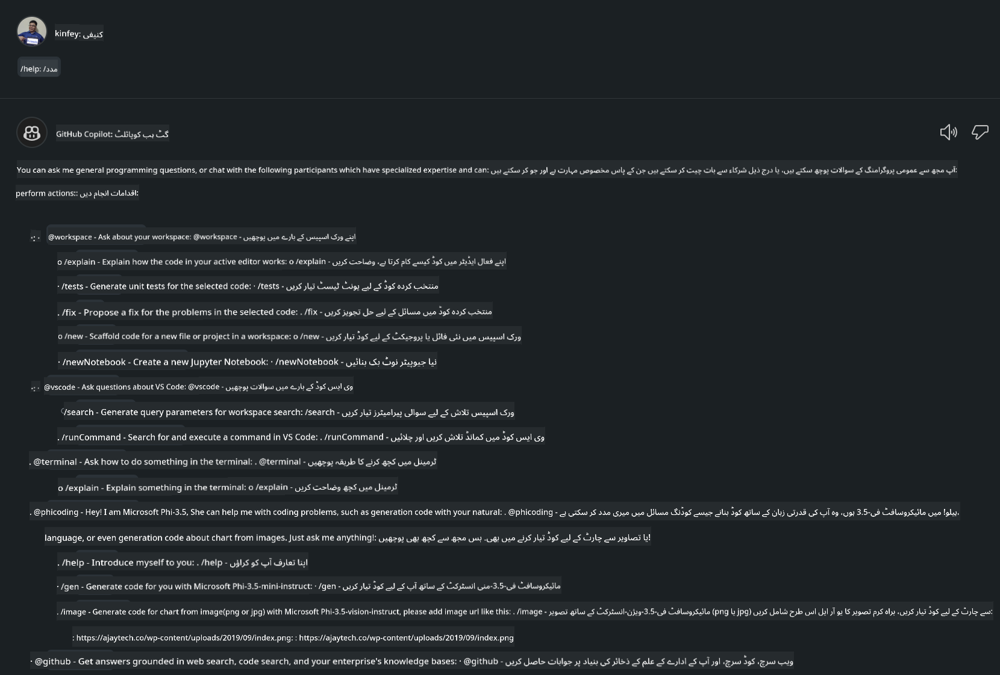
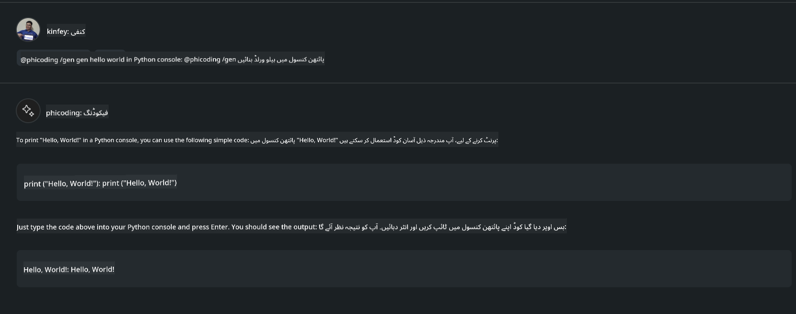
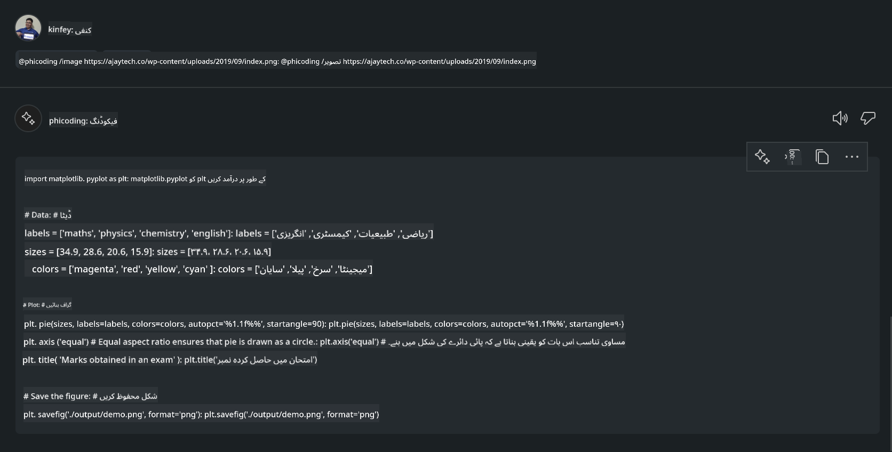

<!--
CO_OP_TRANSLATOR_METADATA:
{
  "original_hash": "35bf81388ac6917277b8d9a0c39bdc70",
  "translation_date": "2025-05-07T13:46:24+00:00",
  "source_file": "md/02.Application/02.Code/Phi3/CreateVSCodeChatAgentWithGitHubModels.md",
  "language_code": "ur"
}
-->
# **اپنا Visual Studio Code Chat Copilot ایجنٹ Phi-3.5 کے ساتھ GitHub Models سے بنائیں**

کیا آپ Visual Studio Code Copilot استعمال کر رہے ہیں؟ خاص طور پر Chat میں، آپ مختلف ایجنٹس استعمال کر کے Visual Studio Code میں پروجیکٹس بنانے، لکھنے اور برقرار رکھنے کی صلاحیت کو بہتر بنا سکتے ہیں۔ Visual Studio Code ایک API فراہم کرتا ہے جو کمپنیوں اور افراد کو اپنے کاروبار کی بنیاد پر مختلف ایجنٹس بنانے کی اجازت دیتا ہے تاکہ وہ مختلف مخصوص شعبوں میں اپنی صلاحیتوں کو بڑھا سکیں۔ اس مضمون میں، ہم GitHub Models کے **Phi-3.5-mini-instruct (128k)** اور **Phi-3.5-vision-instruct (128k)** پر توجہ دیں گے تاکہ اپنا Visual Studio Code ایجنٹ بنایا جا سکے۔

## **GitHub Models پر Phi-3.5 کے بارے میں**

ہم جانتے ہیں کہ Phi-3/3.5-mini-instruct، جو Phi-3/3.5 فیملی کا حصہ ہے، کوڈ کو سمجھنے اور پیدا کرنے کی مضبوط صلاحیت رکھتا ہے، اور اس کے Gemma-2-9b اور Mistral-Nemo-12B-instruct-2407 پر فوائد ہیں۔


تازہ ترین GitHub Models پہلے ہی Phi-3.5-mini-instruct (128k) اور Phi-3.5-vision-instruct (128k) ماڈلز تک رسائی فراہم کرتے ہیں۔ ڈیولپرز انہیں OpenAI SDK، Azure AI Inference SDK، اور REST API کے ذریعے استعمال کر سکتے ہیں۔



***Note: *** یہاں Azure AI Inference SDK استعمال کرنے کی سفارش کی جاتی ہے کیونکہ یہ پروڈکشن ماحول میں Azure Model Catalog کے ساتھ بہتر سوئچ کر سکتا ہے۔

مندرجہ ذیل GitHub Models کے ساتھ منسلک ہونے کے بعد کوڈ جنریشن کے منظر نامے میں **Phi-3.5-mini-instruct (128k)** اور **Phi-3.5-vision-instruct (128k)** کے نتائج ہیں، اور ساتھ ہی آنے والے مثالوں کی تیاری بھی۔

**Demo: GitHub Models Phi-3.5-mini-instruct (128k) سے Prompt کے ذریعے کوڈ جنریٹ کریں** ([اس لنک پر کلک کریں](../../../../../../code/09.UpdateSamples/Aug/ghmodel_phi35_instruct_demo.ipynb))

**Demo: GitHub Models Phi-3.5-vision-instruct (128k) سے تصویر کے ذریعے کوڈ جنریٹ کریں** ([اس لنک پر کلک کریں](../../../../../../code/09.UpdateSamples/Aug/ghmodel_phi35_vision_demo.ipynb))


## **GitHub Copilot Chat Agent کے بارے میں**

GitHub Copilot Chat Agent کوڈ کی بنیاد پر مختلف پروجیکٹ منظر ناموں میں مختلف کام مکمل کر سکتا ہے۔ سسٹم میں چار ایجنٹس ہیں: workspace, github, terminal, vscode



‘@’ کے ساتھ ایجنٹ کا نام شامل کر کے، آپ متعلقہ کام کو تیزی سے مکمل کر سکتے ہیں۔ کاروباروں کے لیے، اگر آپ اپنی کاروباری متعلقہ معلومات جیسے ضروریات، کوڈنگ، ٹیسٹ اسپیسفیکیشنز، اور ریلیز شامل کریں تو آپ GitHub Copilot کی بنیاد پر زیادہ طاقتور کاروباری نجی خصوصیات حاصل کر سکتے ہیں۔

Visual Studio Code Chat Agent نے اب سرکاری طور پر اپنا API جاری کر دیا ہے، جو کاروباروں یا کاروباری ڈیولپرز کو مختلف سافٹ ویئر کاروباری ماحولیاتی نظام کی بنیاد پر ایجنٹس تیار کرنے کی اجازت دیتا ہے۔ Visual Studio Code Extension Development کے طریقہ کار کی بنیاد پر، آپ آسانی سے Visual Studio Code Chat Agent API کے انٹرفیس تک رسائی حاصل کر سکتے ہیں۔ ہم اس عمل کی بنیاد پر ترقی کر سکتے ہیں۔



ترقیاتی منظر نامہ تیسری پارٹی ماڈل APIs (جیسے GitHub Models، Azure Model Catalog، اور اوپن سورس ماڈلز کی بنیاد پر خود ساختہ خدمات) تک رسائی کی حمایت کر سکتا ہے، اور GitHub Copilot کی جانب سے فراہم کردہ gpt-35-turbo, gpt-4، اور gpt-4o ماڈلز بھی استعمال کر سکتا ہے۔

## **Phi-3.5 کی بنیاد پر @phicoding ایجنٹ شامل کریں**

ہم Phi-3.5 کی پروگرامنگ صلاحیتوں کو ضم کرنے کی کوشش کرتے ہیں تاکہ کوڈ لکھنے، تصویر سے کوڈ جنریٹ کرنے اور دیگر کام مکمل کیے جا سکیں۔ Phi-3.5 کے گرد بنایا گیا ایک ایجنٹ - @PHI مکمل کریں، درج ذیل کچھ فنکشنز ہیں:

1. GitHub Copilot کی جانب سے فراہم کردہ GPT-4o کی بنیاد پر **@phicoding /help** کمانڈ کے ذریعے خود تعارف تیار کریں۔

2. **Phi-3.5-mini-instruct (128k)** کی بنیاد پر مختلف پروگرامنگ زبانوں کے لیے کوڈ **@phicoding /gen** کمانڈ کے ذریعے تیار کریں۔

3. **Phi-3.5-vision-instruct (128k)** اور تصویر کی تکمیل کی بنیاد پر کوڈ **@phicoding /image** کمانڈ کے ذریعے تیار کریں۔



## **متعلقہ مراحل**

1. npm استعمال کرتے ہوئے Visual Studio Code Extension ڈیولپمنٹ سپورٹ انسٹال کریں۔

```bash

npm install --global yo generator-code 

```

2. Visual Studio Code Extension پلگ ان بنائیں (Typescript ڈیولپمنٹ موڈ استعمال کرتے ہوئے، نام phiext)

```bash

yo code 

```

3. بنائے گئے پروجیکٹ کو کھولیں اور package.json میں ترمیم کریں۔ یہاں متعلقہ ہدایات اور کنفیگریشنز کے ساتھ ساتھ GitHub Models کی کنفیگریشن بھی ہے۔ نوٹ کریں کہ آپ کو یہاں اپنا GitHub Models ٹوکن شامل کرنا ہوگا۔

```json

{
  "name": "phiext",
  "displayName": "phiext",
  "description": "",
  "version": "0.0.1",
  "engines": {
    "vscode": "^1.93.0"
  },
  "categories": [
    "AI",
    "Chat"
  ],
  "activationEvents": [],
  "enabledApiProposals": [
      "chatVariableResolver"
  ],
  "main": "./dist/extension.js",
  "contributes": {
    "chatParticipants": [
        {
            "id": "chat.phicoding",
            "name": "phicoding",
            "description": "Hey! I am Microsoft Phi-3.5, She can help me with coding problems, such as generation code with your natural language, or even generation code about chart from images. Just ask me anything!",
            "isSticky": true,
            "commands": [
                {
                    "name": "help",
                    "description": "Introduce myself to you"
                },
                {
                    "name": "gen",
                    "description": "Generate code for you with Microsoft Phi-3.5-mini-instruct"
                },
                {
                    "name": "image",
                    "description": "Generate code for chart from image(png or jpg) with Microsoft Phi-3.5-vision-instruct, please add image url like this : https://ajaytech.co/wp-content/uploads/2019/09/index.png"
                }
            ]
        }
    ],
    "commands": [
        {
            "command": "phicoding.namesInEditor",
            "title": "Use Microsoft Phi 3.5 in Editor"
        }
    ],
    "configuration": {
      "type": "object",
      "title": "githubmodels",
      "properties": {
        "githubmodels.endpoint": {
          "type": "string",
          "default": "https://models.inference.ai.azure.com",
          "description": "Your GitHub Models Endpoint",
          "order": 0
        },
        "githubmodels.api_key": {
          "type": "string",
          "default": "Your GitHub Models Token",
          "description": "Your GitHub Models Token",
          "order": 1
        },
        "githubmodels.phi35instruct": {
          "type": "string",
          "default": "Phi-3.5-mini-instruct",
          "description": "Your Phi-35-Instruct Model",
          "order": 2
        },
        "githubmodels.phi35vision": {
          "type": "string",
          "default": "Phi-3.5-vision-instruct",
          "description": "Your Phi-35-Vision Model",
          "order": 3
        }
      }
    }
  },
  "scripts": {
    "vscode:prepublish": "npm run package",
    "compile": "webpack",
    "watch": "webpack --watch",
    "package": "webpack --mode production --devtool hidden-source-map",
    "compile-tests": "tsc -p . --outDir out",
    "watch-tests": "tsc -p . -w --outDir out",
    "pretest": "npm run compile-tests && npm run compile && npm run lint",
    "lint": "eslint src",
    "test": "vscode-test"
  },
  "devDependencies": {
    "@types/vscode": "^1.93.0",
    "@types/mocha": "^10.0.7",
    "@types/node": "20.x",
    "@typescript-eslint/eslint-plugin": "^8.3.0",
    "@typescript-eslint/parser": "^8.3.0",
    "eslint": "^9.9.1",
    "typescript": "^5.5.4",
    "ts-loader": "^9.5.1",
    "webpack": "^5.94.0",
    "webpack-cli": "^5.1.4",
    "@vscode/test-cli": "^0.0.10",
    "@vscode/test-electron": "^2.4.1"
  },
  "dependencies": {
    "@types/node-fetch": "^2.6.11",
    "node-fetch": "^3.3.2",
    "@azure-rest/ai-inference": "latest",
    "@azure/core-auth": "latest",
    "@azure/core-sse": "latest"
  }
}


```

4. src/extension.ts میں ترمیم کریں۔

```typescript

// The module 'vscode' contains the VS Code extensibility API
// Import the module and reference it with the alias vscode in your code below
import * as vscode from 'vscode';
import ModelClient from "@azure-rest/ai-inference";
import { AzureKeyCredential } from "@azure/core-auth";


interface IPhiChatResult extends vscode.ChatResult {
    metadata: {
        command: string;
    };
}


const MODEL_SELECTOR: vscode.LanguageModelChatSelector = { vendor: 'copilot', family: 'gpt-4o' };

function isValidImageUrl(url: string): boolean {
    const regex = /^(https?:\/\/.*\.(?:png|jpg))$/i;
    return regex.test(url);
}
  

// This method is called when your extension is activated
// Your extension is activated the very first time the command is executed
export function activate(context: vscode.ExtensionContext) {

    const codinghandler: vscode.ChatRequestHandler = async (request: vscode.ChatRequest, context: vscode.ChatContext, stream: vscode.ChatResponseStream, token: vscode.CancellationToken): Promise<IPhiChatResult> => {


        const config : any = vscode.workspace.getConfiguration('githubmodels');
        const endPoint: string = config.get('endpoint');
        const apiKey: string = config.get('api_key');
        const phi35instruct: string = config.get('phi35instruct');
        const phi35vision: string = config.get('phi35vision');
        
        if (request.command === 'help') {

            const content = "Welcome to Coding assistant with Microsoft Phi-3.5"; 
            stream.progress(content);


            try {
                const [model] = await vscode.lm.selectChatModels(MODEL_SELECTOR);
                if (model) {
                    const messages = [
                        vscode.LanguageModelChatMessage.User("Please help me express this content in a humorous way: I am a programming assistant who can help you convert natural language into code and generate code based on the charts in the images. output format like this : Hey I am Phi ......")
                    ];
                    const chatResponse = await model.sendRequest(messages, {}, token);
                    for await (const fragment of chatResponse.text) {
                        stream.markdown(fragment);
                    }
                }
            } catch(err) {
                console.log(err);
            }


            return { metadata: { command: 'help' } };

        }

        
        if (request.command === 'gen') {

            const content = "Welcome to use phi-3.5 to generate code";

            stream.progress(content);

            const client = new ModelClient(endPoint, new AzureKeyCredential(apiKey));

            const response = await client.path("/chat/completions").post({
              body: {
                messages: [
                  { role:"system", content: "You are a coding assistant.Help answer all code generation questions." },
                  { role:"user", content: request.prompt }
                ],
                model: phi35instruct,
                temperature: 0.4,
                max_tokens: 1000,
                top_p: 1.
              }
            });

            stream.markdown(response.body.choices[0].message.content);

            return { metadata: { command: 'gen' } };

        }


        
        if (request.command === 'image') {


            const content = "Welcome to use phi-3.5 to generate code from image(png or jpg),image url like this:https://ajaytech.co/wp-content/uploads/2019/09/index.png";

            stream.progress(content);

            if (!isValidImageUrl(request.prompt)) {
                stream.markdown('Please provide a valid image URL');
                return { metadata: { command: 'image' } };
            }
            else
            {

                const client = new ModelClient(endPoint, new AzureKeyCredential(apiKey));
    
                const response = await client.path("/chat/completions").post({
                    body: {
                      messages: [
                        { role: "system", content: "You are a helpful assistant that describes images in details." },
                        { role: "user", content: [
                            { type: "text", text: "Please generate code according to the chart in the picture according to the following requirements\n1. Keep all information in the chart, including data and text\n2. Do not generate additional information that is not included in the chart\n3. Please extract data from the picture, do not generate it from csv\n4. Please save the regenerated chart as a chart and save it to ./output/demo.png"},
                            { type: "image_url", image_url: {url: request.prompt}
                            }
                          ]
                        }
                      ],
                      model: phi35vision,
                      temperature: 0.4,
                      max_tokens: 2048,
                      top_p: 1.
                    }
                  });
    
                
                stream.markdown(response.body.choices[0].message.content);
    
                return { metadata: { command: 'image' } };
            }


        }


        return { metadata: { command: '' } };
    };


    const phi_ext = vscode.chat.createChatParticipant("chat.phicoding", codinghandler);

    phi_ext.iconPath = new vscode.ThemeIcon('sparkle');


    phi_ext.followupProvider = {
        provideFollowups(result: IPhiChatResult, context: vscode.ChatContext, token: vscode.CancellationToken) {
            return [{
                prompt: 'Let us coding with Phi-3.5 😋😋😋😋',
                label: vscode.l10n.t('Enjoy coding with Phi-3.5'),
                command: 'help'
            } satisfies vscode.ChatFollowup];
        }
    };

    context.subscriptions.push(phi_ext);
}

// This method is called when your extension is deactivated
export function deactivate() {}


```

6. چلائیں

***/help***



***@phicoding /help***


***@phicoding /gen***



***@phicoding /image***



آپ نمونہ کوڈ ڈاؤن لوڈ کر سکتے ہیں: [کلک کریں](../../../../../../code/09.UpdateSamples/Aug/vscode)

## **وسائل**

1. GitHub Models پر سائن اپ کریں [https://gh.io/models](https://gh.io/models)

2. Visual Studio Code Extension Development سیکھیں [https://code.visualstudio.com/api/get-started/your-first-extension](https://code.visualstudio.com/api/get-started/your-first-extension)

3. Visual Studio Code Copilot Chat API کے بارے میں جانیں [https://code.visualstudio.com/api/extension-guides/chat](https://code.visualstudio.com/api/extension-guides/chat)

**دستخط**:  
یہ دستاویز AI ترجمہ سروس [Co-op Translator](https://github.com/Azure/co-op-translator) کا استعمال کرتے ہوئے ترجمہ کی گئی ہے۔ اگرچہ ہم درستگی کے لیے کوشاں ہیں، براہ کرم آگاہ رہیں کہ خودکار ترجموں میں غلطیاں یا بے دقتیاں ہو سکتی ہیں۔ اصل دستاویز اپنی مادری زبان میں معتبر ماخذ سمجھی جانی چاہیے۔ اہم معلومات کے لیے پیشہ ور انسانی ترجمہ تجویز کیا جاتا ہے۔ اس ترجمے کے استعمال سے پیدا ہونے والی کسی بھی غلط فہمی یا غلط تشریح کی ذمہ داری ہم پر عائد نہیں ہوتی۔