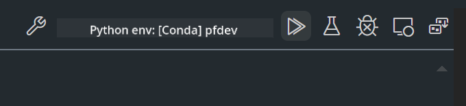

<!--
CO_OP_TRANSLATOR_METADATA:
{
  "original_hash": "bc29f7fe7fc16bed6932733eac8c81b8",
  "translation_date": "2025-07-17T03:54:52+00:00",
  "source_file": "md/02.Application/02.Code/Phi3/VSCodeExt/HOL/AIPC/02.PromptflowWithNPU.md",
  "language_code": "ur"
}
-->
# **لیب 2 - AIPC میں Phi-3-mini کے ساتھ Prompt flow چلانا**

## **Prompt flow کیا ہے**

Prompt flow ایک ترقیاتی ٹولز کا مجموعہ ہے جو LLM پر مبنی AI ایپلیکیشنز کی مکمل ترقیاتی سائیکل کو آسان بناتا ہے، جس میں خیال سازی، پروٹوٹائپنگ، ٹیسٹنگ، جائزہ، پیداوار میں تعیناتی اور نگرانی شامل ہیں۔ یہ prompt engineering کو بہت آسان بناتا ہے اور آپ کو اعلیٰ معیار کی LLM ایپس بنانے کی سہولت دیتا ہے۔

Prompt flow کے ذریعے آپ کر سکیں گے:

- ایسے فلو بنائیں جو LLMs، prompts، Python کوڈ اور دیگر ٹولز کو ایک قابل عمل ورک فلو میں جوڑتے ہیں۔

- اپنے فلو کو آسانی سے ڈیبگ اور بار بار بہتر بنائیں، خاص طور پر LLMs کے ساتھ تعامل کو۔

- اپنے فلو کا جائزہ لیں، معیار اور کارکردگی کے میٹرکس بڑے ڈیٹا سیٹس کے ساتھ حساب کریں۔

- ٹیسٹنگ اور جائزہ کو اپنے CI/CD سسٹم میں شامل کریں تاکہ آپ کے فلو کا معیار یقینی بنایا جا سکے۔

- اپنے فلو کو منتخب کردہ سروسنگ پلیٹ فارم پر تعینات کریں یا آسانی سے اپنی ایپ کے کوڈ بیس میں ضم کریں۔

- (اختیاری مگر انتہائی سفارش شدہ) Azure AI میں Prompt flow کے کلاؤڈ ورژن کا استعمال کرتے ہوئے اپنی ٹیم کے ساتھ تعاون کریں۔

## **AIPC کیا ہے**

ایک AI PC میں CPU، GPU اور NPU ہوتا ہے، ہر ایک کے مخصوص AI تیز رفتاری کے صلاحیتیں ہوتی ہیں۔ NPU، یا نیورل پروسیسنگ یونٹ، ایک خاص قسم کا ایکسیلیریٹر ہے جو آپ کے PC پر ہی مصنوعی ذہانت (AI) اور مشین لرننگ (ML) کے کام انجام دیتا ہے، بجائے اس کے کہ ڈیٹا کو کلاؤڈ میں بھیجا جائے۔ GPU اور CPU بھی یہ کام کر سکتے ہیں، لیکن NPU کم توانائی میں AI کیلکولیشنز کے لیے خاص طور پر مؤثر ہے۔ AI PC ہمارے کمپیوٹرز کے کام کرنے کے طریقے میں ایک بنیادی تبدیلی کی نمائندگی کرتا ہے۔ یہ کسی ایسے مسئلے کا حل نہیں ہے جو پہلے موجود نہ تھا، بلکہ یہ روزمرہ کے PC استعمالات کے لیے ایک بڑا بہتری کا وعدہ ہے۔

تو یہ کیسے کام کرتا ہے؟ جنریٹو AI اور بڑے بڑے زبان ماڈلز (LLMs) کے مقابلے میں جو بہت زیادہ عوامی ڈیٹا پر تربیت یافتہ ہیں، آپ کے PC پر ہونے والا AI تقریباً ہر سطح پر زیادہ قابل رسائی ہے۔ یہ تصور سمجھنے میں آسان ہے، اور چونکہ یہ آپ کے ڈیٹا پر تربیت یافتہ ہے اور کلاؤڈ تک رسائی کی ضرورت نہیں، اس لیے فوائد زیادہ فوری اور وسیع پیمانے پر قابل قبول ہیں۔

قریب مستقبل میں، AI PC کی دنیا میں ذاتی معاونین اور چھوٹے AI ماڈلز شامل ہوں گے جو براہ راست آپ کے PC پر چلیں گے، آپ کے ڈیٹا کا استعمال کرتے ہوئے ذاتی، نجی اور زیادہ محفوظ AI بہتریاں فراہم کریں گے جو آپ روزانہ کرتے ہیں – میٹنگ کے منٹس لینا، فینٹسی فٹبال لیگ کا انتظام کرنا، فوٹو اور ویڈیو ایڈیٹنگ کے لیے خودکار بہتریاں، یا خاندان کی ملاقات کے لیے بہترین سفرنامہ ترتیب دینا جو سب کی آمد و رفت کے اوقات پر مبنی ہو۔

## **AIPC پر جنریشن کوڈ فلو بنانا**

***Note*** ：اگر آپ نے ماحول کی تنصیب مکمل نہیں کی ہے، تو براہ کرم [Lab 0 -Installations](./01.Installations.md) ملاحظہ کریں۔

1. Visual Studio Code میں Prompt flow Extension کھولیں اور ایک خالی فلو پروجیکٹ بنائیں


2. Inputs اور Outputs پیرامیٹرز شامل کریں اور Python Code کو نئے فلو کے طور پر شامل کریں


آپ اس ساخت (flow.dag.yaml) کو اپنے فلو کی تعمیر کے لیے حوالہ دے سکتے ہیں

```yaml

inputs:
  question:
    type: string
    default: how to write Bubble Algorithm
outputs:
  answer:
    type: string
    reference: ${Chat_With_Phi3.output}
nodes:
- name: Chat_With_Phi3
  type: python
  source:
    type: code
    path: Chat_With_Phi3.py
  inputs:
    question: ${inputs.question}


```

3. ***Chat_With_Phi3.py*** میں کوڈ شامل کریں

```python


from promptflow.core import tool

# import torch
from transformers import AutoTokenizer, pipeline,TextStreamer
import intel_npu_acceleration_library as npu_lib

import warnings

import asyncio
import platform

class Phi3CodeAgent:
    
    model = None
    tokenizer = None
    text_streamer = None
    
    model_id = "microsoft/Phi-3-mini-4k-instruct"

    @staticmethod
    def init_phi3():
        
        if Phi3CodeAgent.model is None or Phi3CodeAgent.tokenizer is None or Phi3CodeAgent.text_streamer is None:
            Phi3CodeAgent.model = npu_lib.NPUModelForCausalLM.from_pretrained(
                                    Phi3CodeAgent.model_id,
                                    torch_dtype="auto",
                                    dtype=npu_lib.int4,
                                    trust_remote_code=True
                                )
            Phi3CodeAgent.tokenizer = AutoTokenizer.from_pretrained(Phi3CodeAgent.model_id)
            Phi3CodeAgent.text_streamer = TextStreamer(Phi3CodeAgent.tokenizer, skip_prompt=True)

    

    @staticmethod
    def chat_with_phi3(prompt):
        
        Phi3CodeAgent.init_phi3()

        messages = "<|system|>You are a AI Python coding assistant. Please help me to generate code in Python.The answer only genertated Python code, but any comments and instructions do not need to be generated<|end|><|user|>" + prompt +"<|end|><|assistant|>"


        generation_args = {
            "max_new_tokens": 1024,
            "return_full_text": False,
            "temperature": 0.3,
            "do_sample": False,
            "streamer": Phi3CodeAgent.text_streamer,
        }

        pipe = pipeline(
            "text-generation",
            model=Phi3CodeAgent.model,
            tokenizer=Phi3CodeAgent.tokenizer,
            # **generation_args
        )

        result = ''

        with warnings.catch_warnings():
            warnings.simplefilter("ignore")
            response = pipe(messages, **generation_args)
            result =response[0]['generated_text']
            return result


@tool
def my_python_tool(question: str) -> str:
    if platform.system() == 'Windows':
        asyncio.set_event_loop_policy(asyncio.WindowsSelectorEventLoopPolicy())
    return Phi3CodeAgent.chat_with_phi3(question)


```

4. آپ Debug یا Run سے فلو کو ٹیسٹ کر سکتے ہیں تاکہ چیک کریں کہ جنریشن کوڈ ٹھیک کام کر رہا ہے یا نہیں



5. ٹرمینل میں فلو کو بطور development API چلائیں

```

pf flow serve --source ./ --port 8080 --host localhost   

```

آپ اسے Postman / Thunder Client میں بھی ٹیسٹ کر سکتے ہیں

### **Note**

1. پہلی بار چلانے میں وقت زیادہ لگتا ہے۔ phi-3 ماڈل کو Hugging face CLI سے ڈاؤن لوڈ کرنے کی سفارش کی جاتی ہے۔

2. Intel NPU کی محدود کمپیوٹنگ طاقت کو مدنظر رکھتے ہوئے، Phi-3-mini-4k-instruct استعمال کرنے کی سفارش کی جاتی ہے۔

3. ہم Intel NPU Acceleration کا استعمال کرتے ہوئے INT4 کوانٹائزیشن کرتے ہیں، لیکن اگر آپ سروس کو دوبارہ چلائیں تو کیشے اور nc_workshop فولڈرز کو حذف کرنا ضروری ہے۔

## **وسائل**

1. Promptflow سیکھیں [https://microsoft.github.io/promptflow/](https://microsoft.github.io/promptflow/)

2. Intel NPU Acceleration سیکھیں [https://github.com/intel/intel-npu-acceleration-library](https://github.com/intel/intel-npu-acceleration-library)

3. نمونہ کوڈ، ڈاؤن لوڈ کریں [Local NPU Agent Sample Code](../../../../../../../../../code/07.Lab/01/AIPC)

**دستخطی نوٹ**:  
یہ دستاویز AI ترجمہ سروس [Co-op Translator](https://github.com/Azure/co-op-translator) کے ذریعے ترجمہ کی گئی ہے۔ اگرچہ ہم درستگی کے لیے کوشاں ہیں، براہ کرم آگاہ رہیں کہ خودکار ترجمے میں غلطیاں یا عدم درستیاں ہو سکتی ہیں۔ اصل دستاویز اپنی مادری زبان میں ہی معتبر ماخذ سمجھی جانی چاہیے۔ اہم معلومات کے لیے پیشہ ور انسانی ترجمہ کی سفارش کی جاتی ہے۔ اس ترجمے کے استعمال سے پیدا ہونے والی کسی بھی غلط فہمی یا غلط تشریح کی ذمہ داری ہم پر عائد نہیں ہوتی۔