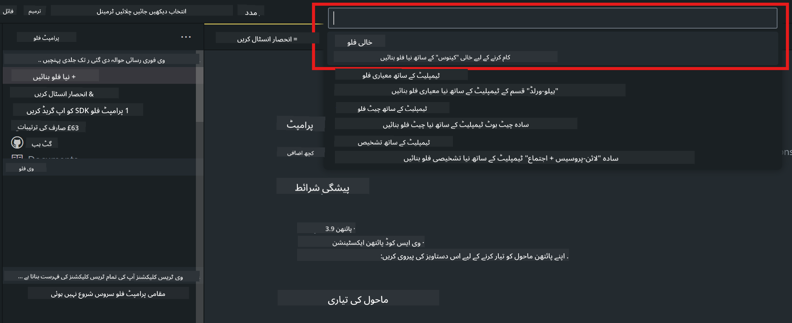

<!--
CO_OP_TRANSLATOR_METADATA:
{
  "original_hash": "bc29f7fe7fc16bed6932733eac8c81b8",
  "translation_date": "2025-05-07T13:50:33+00:00",
  "source_file": "md/02.Application/02.Code/Phi3/VSCodeExt/HOL/AIPC/02.PromptflowWithNPU.md",
  "language_code": "ur"
}
-->
# **لیب 2 - Phi-3-mini کے ساتھ AIPC میں Prompt flow چلائیں**

## **Prompt flow کیا ہے**

Prompt flow ایک ترقیاتی اوزاروں کا مجموعہ ہے جو LLM-based AI ایپلیکیشنز کی مکمل ترقیاتی سائیکل کو آسان بناتا ہے، خیالات سے لے کر پروٹوٹائپنگ، جانچ، تشخیص، پیداوار میں تعیناتی اور نگرانی تک۔ یہ prompt engineering کو بہت آسان بناتا ہے اور آپ کو اعلی معیار کی LLM ایپس بنانے کی سہولت دیتا ہے۔

Prompt flow کے ذریعے آپ کر سکیں گے:

- ایسے فلو بنائیں جو LLMs، prompts، Python کوڈ اور دیگر اوزاروں کو ایک قابل عمل ورک فلو میں جوڑیں۔

- اپنے فلو کو آسانی سے ڈیبگ اور دوبارہ چلا کر خاص طور پر LLMs کے ساتھ تعامل کو بہتر بنائیں۔

- اپنے فلو کا جائزہ لیں، معیار اور کارکردگی کے میٹرکس کو بڑے ڈیٹا سیٹس کے ساتھ حساب کریں۔

- ٹیسٹنگ اور تشخیص کو اپنے CI/CD سسٹم میں شامل کریں تاکہ فلو کے معیار کو یقینی بنایا جا سکے۔

- اپنے فلو کو منتخب شدہ سرونگ پلیٹ فارم پر تعینات کریں یا اسے اپنی ایپ کے کوڈ بیس میں آسانی سے ضم کریں۔

- (اختیاری مگر انتہائی تجویز کردہ) Azure AI میں Prompt flow کے کلاؤڈ ورژن کا فائدہ اٹھاتے ہوئے اپنی ٹیم کے ساتھ تعاون کریں۔

## **AIPC کیا ہے**

AI PC میں CPU، GPU اور NPU ہوتا ہے، جن میں سے ہر ایک کے پاس مخصوص AI تیز رفتاری کی صلاحیتیں ہوتی ہیں۔ NPU، یعنی neural processing unit، ایک خاص تیز رفتار پروسیسر ہے جو آپ کے کمپیوٹر پر ہی AI اور مشین لرننگ کے کام انجام دیتا ہے بجائے اس کے کہ ڈیٹا کو کلاؤڈ پر بھیجا جائے۔ GPU اور CPU بھی یہ کام کر سکتے ہیں، مگر NPU خاص طور پر کم توانائی والے AI حسابات میں بہتر ہے۔ AI PC ہمارے کمپیوٹرز کے کام کرنے کے طریقے میں ایک بنیادی تبدیلی کی نمائندگی کرتا ہے۔ یہ کوئی نیا مسئلہ حل کرنے والا حل نہیں بلکہ روزمرہ کے کمپیوٹر استعمالات کے لیے ایک بڑا بہتری کا وعدہ ہے۔

تو یہ کیسے کام کرتا ہے؟ بڑے بڑے جنریٹیو AI اور عوامی ڈیٹا پر تربیت یافتہ بڑے زبان ماڈلز (LLMs) کے مقابلے میں، آپ کے PC پر چلنے والا AI تقریباً ہر سطح پر زیادہ قابل رسائی ہے۔ تصور آسان ہے، اور چونکہ یہ آپ کے ڈیٹا پر تربیت یافتہ ہے اور کلاؤڈ تک رسائی کی ضرورت نہیں، اس لیے اس کے فوائد وسیع عوام کے لیے زیادہ فوری طور پر پرکشش ہیں۔

قریب مستقبل میں، AI PC کی دنیا میں ذاتی معاونین اور چھوٹے AI ماڈلز براہ راست آپ کے PC پر چلیں گے، آپ کے ڈیٹا کا استعمال کرتے ہوئے ذاتی، نجی اور زیادہ محفوظ AI بہتریاں فراہم کریں گے جو آپ روزانہ کرتے ہیں – میٹنگ کے نوٹس لینا، فینٹسی فٹبال لیگ کا انتظام کرنا، فوٹو اور ویڈیو ایڈیٹنگ کی خودکار بہتریاں، یا خاندان کے اجتماع کے لیے سب کے آنے اور جانے کے اوقات کی بنیاد پر بہترین سفرنامہ تیار کرنا۔

## **AIPC پر generation code flows بنانا**

***Note*** ：اگر آپ نے ماحول کی تنصیب مکمل نہیں کی تو براہ کرم [Lab 0 -Installations](./01.Installations.md) ملاحظہ کریں

1. Visual Studio Code میں Prompt flow Extension کھولیں اور ایک خالی flow پروجیکٹ بنائیں



2. Inputs اور Outputs کے پیرامیٹرز شامل کریں اور Python Code کو نئے flow کے طور پر شامل کریں


آپ اپنے flow کی تعمیر کے لیے اس ساخت (flow.dag.yaml) کا حوالہ دے سکتے ہیں

```yaml

inputs:
  question:
    type: string
    default: how to write Bubble Algorithm
outputs:
  answer:
    type: string
    reference: ${Chat_With_Phi3.output}
nodes:
- name: Chat_With_Phi3
  type: python
  source:
    type: code
    path: Chat_With_Phi3.py
  inputs:
    question: ${inputs.question}


```

3. ***Chat_With_Phi3.py*** میں کوڈ شامل کریں

```python


from promptflow.core import tool

# import torch
from transformers import AutoTokenizer, pipeline,TextStreamer
import intel_npu_acceleration_library as npu_lib

import warnings

import asyncio
import platform

class Phi3CodeAgent:
    
    model = None
    tokenizer = None
    text_streamer = None
    
    model_id = "microsoft/Phi-3-mini-4k-instruct"

    @staticmethod
    def init_phi3():
        
        if Phi3CodeAgent.model is None or Phi3CodeAgent.tokenizer is None or Phi3CodeAgent.text_streamer is None:
            Phi3CodeAgent.model = npu_lib.NPUModelForCausalLM.from_pretrained(
                                    Phi3CodeAgent.model_id,
                                    torch_dtype="auto",
                                    dtype=npu_lib.int4,
                                    trust_remote_code=True
                                )
            Phi3CodeAgent.tokenizer = AutoTokenizer.from_pretrained(Phi3CodeAgent.model_id)
            Phi3CodeAgent.text_streamer = TextStreamer(Phi3CodeAgent.tokenizer, skip_prompt=True)

    

    @staticmethod
    def chat_with_phi3(prompt):
        
        Phi3CodeAgent.init_phi3()

        messages = "<|system|>You are a AI Python coding assistant. Please help me to generate code in Python.The answer only genertated Python code, but any comments and instructions do not need to be generated<|end|><|user|>" + prompt +"<|end|><|assistant|>"


        generation_args = {
            "max_new_tokens": 1024,
            "return_full_text": False,
            "temperature": 0.3,
            "do_sample": False,
            "streamer": Phi3CodeAgent.text_streamer,
        }

        pipe = pipeline(
            "text-generation",
            model=Phi3CodeAgent.model,
            tokenizer=Phi3CodeAgent.tokenizer,
            # **generation_args
        )

        result = ''

        with warnings.catch_warnings():
            warnings.simplefilter("ignore")
            response = pipe(messages, **generation_args)
            result =response[0]['generated_text']
            return result


@tool
def my_python_tool(question: str) -> str:
    if platform.system() == 'Windows':
        asyncio.set_event_loop_policy(asyncio.WindowsSelectorEventLoopPolicy())
    return Phi3CodeAgent.chat_with_phi3(question)


```

4. آپ ڈیبگ یا رن سے flow کا ٹیسٹ کر سکتے ہیں کہ generation code صحیح چل رہا ہے یا نہیں


5. ٹرمینل میں flow کو development API کے طور پر چلائیں

```

pf flow serve --source ./ --port 8080 --host localhost   

```

آپ اسے Postman / Thunder Client میں ٹیسٹ کر سکتے ہیں

### **Note**

1. پہلی بار چلانے میں زیادہ وقت لگتا ہے۔ phi-3 ماڈل کو Hugging face CLI سے ڈاؤن لوڈ کرنے کی سفارش کی جاتی ہے۔

2. Intel NPU کی محدود کمپیوٹنگ طاقت کو مدنظر رکھتے ہوئے، Phi-3-mini-4k-instruct استعمال کرنے کی سفارش ہے۔

3. ہم Intel NPU Acceleration کا استعمال کرتے ہوئے INT4 کوانٹائزیشن کرتے ہیں، لیکن اگر آپ سروس کو دوبارہ چلائیں تو کیشے اور nc_workshop فولڈرز کو حذف کرنا ضروری ہے۔

## **وسائل**

1. Promptflow سیکھیں [https://microsoft.github.io/promptflow/](https://microsoft.github.io/promptflow/)

2. Intel NPU Acceleration سیکھیں [https://github.com/intel/intel-npu-acceleration-library](https://github.com/intel/intel-npu-acceleration-library)

3. سیمپل کوڈ، ڈاؤن لوڈ کریں [Local NPU Agent Sample Code](../../../../../../../../../code/07.Lab/01/AIPC)

**ڈس کلیمر**:  
یہ دستاویز AI ترجمہ سروس [Co-op Translator](https://github.com/Azure/co-op-translator) کا استعمال کرتے ہوئے ترجمہ کی گئی ہے۔ اگرچہ ہم درستگی کے لیے کوشاں ہیں، براہ کرم نوٹ کریں کہ خودکار ترجموں میں غلطیاں یا عدم درستیاں ہو سکتی ہیں۔ اصل دستاویز اپنی مادری زبان میں معتبر ماخذ سمجھی جانی چاہیے۔ اہم معلومات کے لیے پیشہ ور انسانی ترجمہ کی سفارش کی جاتی ہے۔ اس ترجمے کے استعمال سے پیدا ہونے والی کسی بھی غلط فہمی یا غلط تعبیر کی ذمہ داری ہم پر عائد نہیں ہوتی۔