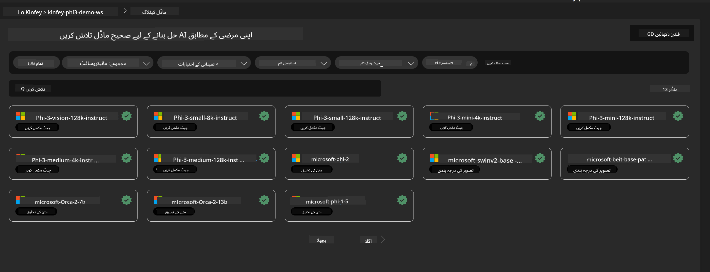
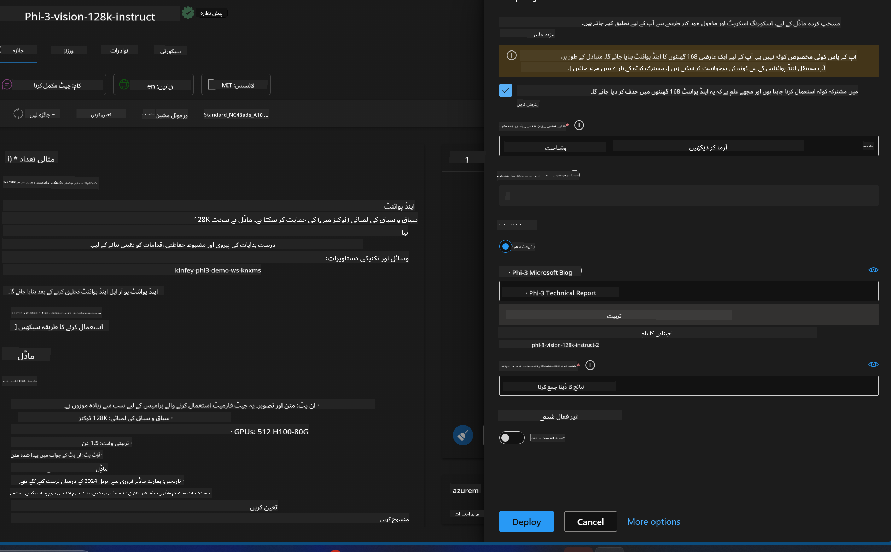
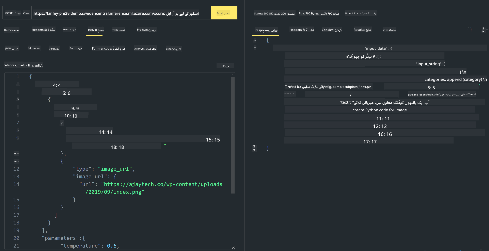

<!--
CO_OP_TRANSLATOR_METADATA:
{
  "original_hash": "594a3b553655c2ebbc0efdeb0b5040c9",
  "translation_date": "2025-04-03T07:45:00+00:00",
  "source_file": "md\\02.Application\\02.Code\\Phi3\\VSCodeExt\\HOL\\AIPC\\03.DeployPhi3VisionOnAzure.md",
  "language_code": "ur"
}
-->
# **لیب 3 - Azure Machine Learning Service پر Phi-3-vision کو ڈپلائے کریں**

ہم NPU کا استعمال کرتے ہوئے لوکل کوڈ کی پروڈکشن ڈپلائمنٹ مکمل کرتے ہیں، اور پھر ہم PHI-3-VISION کی صلاحیت متعارف کرانا چاہتے ہیں تاکہ تصاویر سے کوڈ جنریٹ کیا جا سکے۔

اس تعارف میں، ہم Azure Machine Learning Service میں جلدی سے ایک ماڈل ایز سروس Phi-3 Vision سروس بنا سکتے ہیں۔

***نوٹ***: Phi-3 Vision کو تیز رفتاری سے مواد پیدا کرنے کے لیے کمپیوٹنگ پاور کی ضرورت ہوتی ہے۔ ہمیں کلاؤڈ کمپیوٹنگ پاور کی ضرورت ہے تاکہ ہم یہ کام انجام دے سکیں۔


### **1. Azure Machine Learning Service بنائیں**

ہمیں Azure پورٹل میں Azure Machine Learning Service بنانا ہوگی۔ اگر آپ سیکھنا چاہتے ہیں کہ یہ کیسے کریں، تو براہ کرم اس لنک پر جائیں [https://learn.microsoft.com/azure/machine-learning/quickstart-create-resources?view=azureml-api-2](https://learn.microsoft.com/azure/machine-learning/quickstart-create-resources?view=azureml-api-2)


### **2. Azure Machine Learning Service میں Phi-3 Vision کا انتخاب کریں**




### **3. Phi-3-Vision کو Azure پر ڈپلائے کریں**





### **4. Postman میں Endpoint کو ٹیسٹ کریں**





***نوٹ***

1. بھیجے جانے والے پیرامیٹرز میں Authorization، azureml-model-deployment، اور Content-Type شامل ہونا ضروری ہے۔ آپ کو ڈپلائمنٹ کی معلومات چیک کرنی ہوگی تاکہ یہ حاصل کیا جا سکے۔

2. پیرامیٹرز بھیجنے کے لیے، Phi-3-Vision کو ایک امیج لنک بھیجنا ہوگا۔ براہ کرم GPT-4-Vision طریقہ کار کو دیکھیں تاکہ پیرامیٹرز بھیجنے کا طریقہ معلوم ہو، جیسا کہ

```json

{
  "input_data":{
    "input_string":[
      {
        "role":"user",
        "content":[ 
          {
            "type": "text",
            "text": "You are a Python coding assistant.Please create Python code for image "
          },
          {
              "type": "image_url",
              "image_url": {
                "url": "https://ajaytech.co/wp-content/uploads/2019/09/index.png"
              }
          }
        ]
      }
    ],
    "parameters":{
          "temperature": 0.6,
          "top_p": 0.9,
          "do_sample": false,
          "max_new_tokens": 2048
    }
  }
}

```

3. **/score** کو Post طریقہ استعمال کرتے ہوئے کال کریں

**مبارک ہو**! آپ نے تیزی سے PHI-3-VISION ڈپلائمنٹ مکمل کر لیا ہے اور یہ جان لیا ہے کہ تصاویر کا استعمال کرتے ہوئے کوڈ کیسے بنایا جائے۔ اب ہم NPUs اور کلاؤڈز کے امتزاج سے ایپلیکیشنز بنا سکتے ہیں۔

**ڈسکلیمر**:  
یہ دستاویز AI ترجمہ سروس [Co-op Translator](https://github.com/Azure/co-op-translator) کا استعمال کرتے ہوئے ترجمہ کی گئی ہے۔ ہم درستگی کے لیے کوشش کرتے ہیں، لیکن براہ کرم آگاہ رہیں کہ خودکار ترجمے میں غلطیاں یا غلط تشریحات ہوسکتی ہیں۔ اصل دستاویز کو اس کی اصل زبان میں مستند ذریعہ سمجھا جانا چاہیے۔ اہم معلومات کے لیے، پیشہ ورانہ انسانی ترجمہ کی سفارش کی جاتی ہے۔ اس ترجمے کے استعمال سے پیدا ہونے والی کسی بھی غلط فہمی یا غلط تشریح کے لیے ہم ذمہ دار نہیں ہیں۔