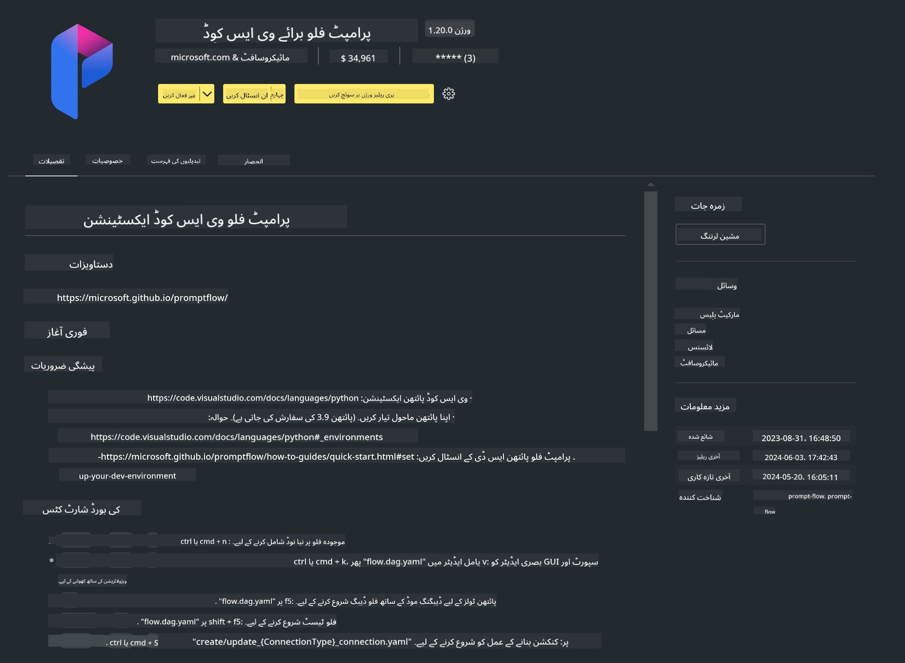

<!--
CO_OP_TRANSLATOR_METADATA:
{
  "original_hash": "4b16264917d9b93169745d92b8ce8c65",
  "translation_date": "2025-07-17T04:16:45+00:00",
  "source_file": "md/02.Application/02.Code/Phi3/VSCodeExt/HOL/Apple/01.Installations.md",
  "language_code": "ur"
}
-->
# **لیب 0 - انسٹالیشن**

جب ہم لیب میں داخل ہوتے ہیں، تو ہمیں متعلقہ ماحول کو ترتیب دینا ہوتا ہے :


### **1. Python 3.11+**

اپنے Python ماحول کو ترتیب دینے کے لیے miniforge استعمال کرنے کی سفارش کی جاتی ہے

miniforge کو ترتیب دینے کے لیے، براہ کرم [https://github.com/conda-forge/miniforge](https://github.com/conda-forge/miniforge) ملاحظہ کریں

miniforge کو ترتیب دینے کے بعد، Power Shell میں درج ذیل کمانڈ چلائیں

```bash

conda create -n pyenv python==3.11.8 -y

conda activate pyenv

```


### **2. Install Prompt flow SDK**

لیب 1 میں، ہم Prompt flow استعمال کرتے ہیں، اس لیے آپ کو Prompt flow SDK ترتیب دینا ہوگا۔

```bash

pip install promptflow --upgrade

```

آپ اس کمانڈ میں promptflow sdk چیک کر سکتے ہیں


```bash

pf --version

```

### **3. Install Visual Studio Code Prompt flow Extension**



### **4. Apple's MLX Framework**

MLX ایک ارے فریم ورک ہے جو Apple silicon پر مشین لرننگ ریسرچ کے لیے ہے، جو Apple مشین لرننگ ریسرچ کی طرف سے فراہم کیا گیا ہے۔ آپ **Apple MLX framework** استعمال کر کے Apple Silicon کے ساتھ LLM / SLM کو تیز کر سکتے ہیں۔ اگر آپ مزید جاننا چاہتے ہیں، تو آپ پڑھ سکتے ہیں [https://github.com/microsoft/PhiCookBook/blob/main/md/01.Introduction/03/MLX_Inference.md](https://github.com/microsoft/PhiCookBook/blob/main/md/01.Introduction/03/MLX_Inference.md)۔

bash میں MLX framework لائبریری انسٹال کریں


```bash

pip install mlx-lm

```


### **5. Other Python Library**


requirements.txt بنائیں اور اس مواد کو شامل کریں

```txt

notebook
numpy 
scipy 
scikit-learn 
matplotlib 
pandas 
pillow 
graphviz

```


### **6. Install NVM**

Powershell میں nvm انسٹال کریں


```bash

brew install nvm

```

nodejs 18.20 انسٹال کریں


```bash

nvm install 18.20.0

nvm use 18.20.0

```

### **7. Install Visual Studio Code Development Support**


```bash

npm install --global yo generator-code

```

مبارک ہو! آپ نے کامیابی کے ساتھ SDK کو ترتیب دے دیا ہے۔ اب اگلے عملی مراحل کی طرف بڑھیں۔

**دستخطی نوٹ**:  
یہ دستاویز AI ترجمہ سروس [Co-op Translator](https://github.com/Azure/co-op-translator) کے ذریعے ترجمہ کی گئی ہے۔ اگرچہ ہم درستگی کے لیے کوشاں ہیں، براہ کرم آگاہ رہیں کہ خودکار ترجمے میں غلطیاں یا عدم درستیاں ہو سکتی ہیں۔ اصل دستاویز اپنی مادری زبان میں معتبر ماخذ سمجھی جانی چاہیے۔ اہم معلومات کے لیے پیشہ ور انسانی ترجمہ کی سفارش کی جاتی ہے۔ اس ترجمے کے استعمال سے پیدا ہونے والی کسی بھی غلط فہمی یا غلط تشریح کی ذمہ داری ہم پر عائد نہیں ہوتی۔