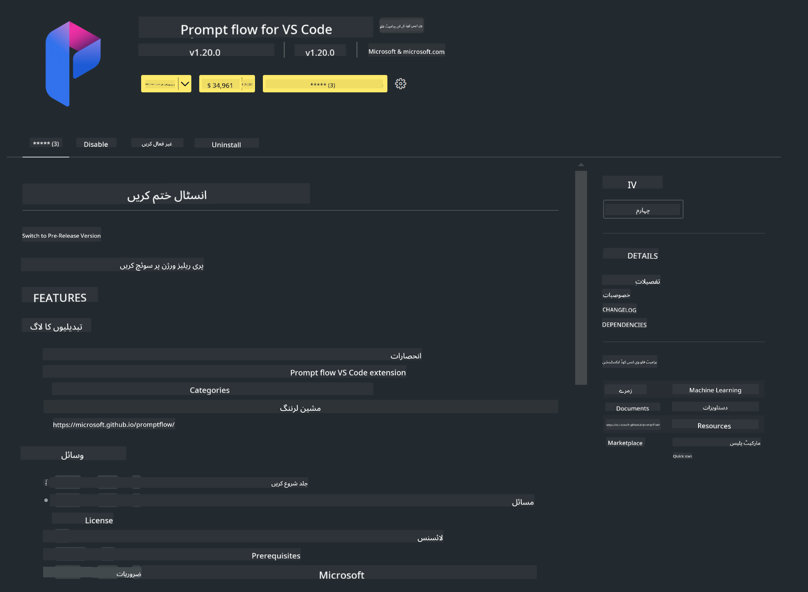

<!--
CO_OP_TRANSLATOR_METADATA:
{
  "original_hash": "1e5970596457ac53bcc49d97b88ff1bd",
  "translation_date": "2025-04-03T07:47:01+00:00",
  "source_file": "md\\02.Application\\02.Code\\Phi3\\VSCodeExt\\HOL\\Apple\\01.Installations.md",
  "language_code": "ur"
}
-->
# **لیب 0 - انسٹالیشن**

جب ہم لیب میں داخل ہوتے ہیں، تو ہمیں متعلقہ ماحول کو ترتیب دینا ہوتا ہے:

### **1. Python 3.11+**

Python کا ماحول ترتیب دینے کے لیے miniforge استعمال کرنے کی تجویز دی جاتی ہے۔

miniforge ترتیب دینے کے لیے، اس لنک کا حوالہ دیں: [https://github.com/conda-forge/miniforge](https://github.com/conda-forge/miniforge)

miniforge ترتیب دینے کے بعد، پاور شیل میں درج ذیل کمانڈ چلائیں:

```bash

conda create -n pyenv python==3.11.8 -y

conda activate pyenv

```

### **2. Prompt flow SDK انسٹال کریں**

لیب 1 میں، ہم Prompt flow استعمال کرتے ہیں، اس لیے آپ کو Prompt flow SDK ترتیب دینا ہوگا۔

```bash

pip install promptflow --upgrade

```

آپ اس کمانڈ کے ذریعے Prompt flow SDK چیک کر سکتے ہیں:

```bash

pf --version

```

### **3. Visual Studio Code Prompt flow ایکسٹینشن انسٹال کریں**



### **4. Apple's MLX فریم ورک**

MLX ایک array فریم ورک ہے جو ایپل سلکان پر مشین لرننگ تحقیق کے لیے بنایا گیا ہے اور یہ ایپل مشین لرننگ ریسرچ کی جانب سے پیش کیا گیا ہے۔ آپ **Apple MLX فریم ورک** کو ایپل سلکان کے ساتھ LLM / SLM کو تیز کرنے کے لیے استعمال کر سکتے ہیں۔ اگر آپ مزید جاننا چاہتے ہیں تو یہ لنک پڑھ سکتے ہیں: [https://github.com/microsoft/PhiCookBook/blob/main/md/01.Introduction/03/MLX_Inference.md](https://github.com/microsoft/PhiCookBook/blob/main/md/01.Introduction/03/MLX_Inference.md)

bash میں MLX فریم ورک لائبریری انسٹال کریں:

```bash

pip install mlx-lm

```

### **5. دیگر Python لائبریریاں**

requirements.txt بنائیں اور اس مواد کو شامل کریں:

```txt

notebook
numpy 
scipy 
scikit-learn 
matplotlib 
pandas 
pillow 
graphviz

```

### **6. NVM انسٹال کریں**

پاور شیل میں nvm انسٹال کریں:

```bash

brew install nvm

```

nodejs 18.20 انسٹال کریں:

```bash

nvm install 18.20.0

nvm use 18.20.0

```

### **7. Visual Studio Code ڈیولپمنٹ سپورٹ انسٹال کریں**

```bash

npm install --global yo generator-code

```

مبارک ہو! آپ نے کامیابی سے SDK ترتیب دے لیا ہے۔ اب عملی مراحل کی طرف بڑھیں۔

**ڈسکلیمر**:  
یہ دستاویز AI ترجمہ سروس [Co-op Translator](https://github.com/Azure/co-op-translator) کا استعمال کرتے ہوئے ترجمہ کی گئی ہے۔ ہم درستگی کے لیے کوشش کرتے ہیں، لیکن براہ کرم آگاہ رہیں کہ خودکار ترجمے میں غلطیاں یا بے ضابطگیاں ہو سکتی ہیں۔ اصل دستاویز کو اس کی اصل زبان میں مستند ماخذ سمجھا جانا چاہیے۔ اہم معلومات کے لیے، پیشہ ور انسانی ترجمہ کی سفارش کی جاتی ہے۔ ہم اس ترجمے کے استعمال سے پیدا ہونے والی کسی بھی غلط فہمی یا غلط تشریح کے ذمہ دار نہیں ہیں۔