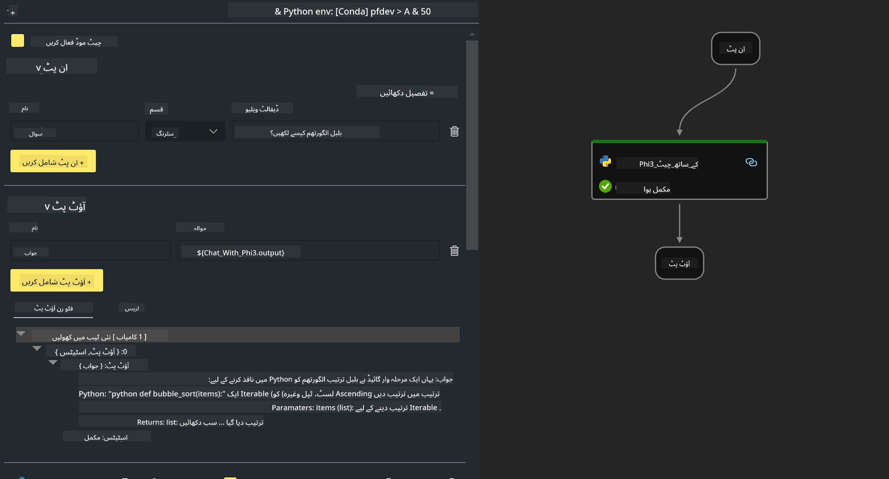

<!--
CO_OP_TRANSLATOR_METADATA:
{
  "original_hash": "830eb246b6fa04f22004b271f3294cfc",
  "translation_date": "2025-04-03T07:48:01+00:00",
  "source_file": "md\\02.Application\\02.Code\\Phi3\\VSCodeExt\\HOL\\Apple\\02.PromptflowWithMLX.md",
  "language_code": "ur"
}
-->
# **لیب 2 - فلو کو Phi-3-mini کے ساتھ AIPC میں چلائیں**

## **پرومپٹ فلو کیا ہے**

پرومپٹ فلو ایک ترقیاتی ٹولز کا مجموعہ ہے جو LLM پر مبنی AI ایپلیکیشنز کے پورے ترقیاتی عمل کو آسان بناتا ہے، جیسے آئیڈیا سے لے کر پروٹوٹائپنگ، ٹیسٹنگ، ایویلیویشن، پروڈکشن ڈپلائمنٹ اور مانیٹرنگ تک۔ یہ پرومپٹ انجینئرنگ کو بہت سہل بناتا ہے اور آپ کو پروڈکشن کوالٹی کے ساتھ LLM ایپلیکیشنز بنانے میں مدد دیتا ہے۔

پرومپٹ فلو کے ذریعے آپ کر سکتے ہیں:

- ایسے فلو بنائیں جو LLMs، پرومپٹس، Python کوڈ اور دیگر ٹولز کو ایک قابل عمل ورک فلو میں جوڑتے ہیں۔

- اپنے فلو کو ڈیبگ اور بہتر بنائیں، خاص طور پر LLMs کے ساتھ تعامل کو آسانی سے۔

- اپنے فلو کا جائزہ لیں، بڑے ڈیٹاسیٹس کے ساتھ کوالٹی اور پرفارمنس میٹرکس کا حساب لگائیں۔

- اپنے CI/CD سسٹم میں ٹیسٹنگ اور ایویلیویشن کو شامل کریں تاکہ اپنے فلو کی کوالٹی یقینی بنائی جا سکے۔

- اپنے فلو کو اپنی منتخب سروسنگ پلیٹ فارم پر ڈپلائے کریں یا اپنی ایپ کے کوڈ بیس میں آسانی سے شامل کریں۔

- (اختیاری لیکن سختی سے تجویز کردہ) Azure AI میں پرومپٹ فلو کے کلاؤڈ ورژن کو استعمال کرتے ہوئے اپنی ٹیم کے ساتھ تعاون کریں۔


## **ایپل سیلیکون پر جنریشن کوڈ فلو بنانا**

***نوٹ***: اگر آپ نے ابھی تک ماحول کی تنصیب مکمل نہیں کی ہے، تو براہ کرم [لیب 0 - انسٹالیشنز](./01.Installations.md) پر جائیں۔

1. Visual Studio Code میں پرومپٹ فلو ایکسٹینشن کھولیں اور ایک خالی فلو پروجیکٹ بنائیں۔


2. ان پٹ اور آؤٹ پٹ پیرامیٹرز شامل کریں اور نئے فلو کے طور پر Python کوڈ شامل کریں۔



آپ اس ساخت (flow.dag.yaml) کا حوالہ دے سکتے ہیں تاکہ اپنے فلو کو تعمیر کر سکیں۔

```yaml

inputs:
  prompt:
    type: string
    default: Write python code for Fibonacci serie. Please use markdown as output
outputs:
  result:
    type: string
    reference: ${gen_code_by_phi3.output}
nodes:
- name: gen_code_by_phi3
  type: python
  source:
    type: code
    path: gen_code_by_phi3.py
  inputs:
    prompt: ${inputs.prompt}


```

3. phi-3-mini کو کوانٹفائی کریں۔

ہم امید کرتے ہیں کہ SLM کو مقامی ڈیوائسز پر بہتر چلایا جا سکے۔ عام طور پر، ہم ماڈل کو کوانٹفائی کرتے ہیں (INT4, FP16, FP32)۔

```bash

python -m mlx_lm.convert --hf-path microsoft/Phi-3-mini-4k-instruct

```

**نوٹ:** ڈیفالٹ فولڈر mlx_model ہے۔

4. ***Chat_With_Phi3.py*** میں کوڈ شامل کریں۔

```python


from promptflow import tool

from mlx_lm import load, generate


# The inputs section will change based on the arguments of the tool function, after you save the code
# Adding type to arguments and return value will help the system show the types properly
# Please update the function name/signature per need
@tool
def my_python_tool(prompt: str) -> str:

    model_id = './mlx_model_phi3_mini'

    model, tokenizer = load(model_id)

    # <|user|>\nWrite python code for Fibonacci serie. Please use markdown as output<|end|>\n<|assistant|>

    response = generate(model, tokenizer, prompt="<|user|>\n" + prompt  + "<|end|>\n<|assistant|>", max_tokens=2048, verbose=True)

    return response


```

4. آپ Debug یا Run سے فلو کو ٹیسٹ کر سکتے ہیں تاکہ دیکھ سکیں کہ جنریشن کوڈ ٹھیک ہے یا نہیں۔


5. فلو کو ٹرمینل میں ڈیولپمنٹ API کے طور پر چلائیں۔

```

pf flow serve --source ./ --port 8080 --host localhost   

```

آپ اسے Postman / Thunder Client میں ٹیسٹ کر سکتے ہیں۔

### **نوٹ**

1. پہلی بار چلانے میں کافی وقت لگتا ہے۔ تجویز کی جاتی ہے کہ Hugging Face CLI سے phi-3 ماڈل ڈاؤنلوڈ کریں۔

2. Intel NPU کی محدود کمپیوٹنگ پاور کو مدنظر رکھتے ہوئے، Phi-3-mini-4k-instruct استعمال کرنے کی تجویز دی جاتی ہے۔

3. ہم INT4 کنورژن کو کوانٹفائی کرنے کے لیے Intel NPU Acceleration استعمال کرتے ہیں، لیکن اگر آپ سروس کو دوبارہ چلائیں، تو آپ کو کیشے اور nc_workshop فولڈرز کو حذف کرنا ہوگا۔


## **وسائل**

1. پرومپٹ فلو سیکھیں [https://microsoft.github.io/promptflow/](https://microsoft.github.io/promptflow/)

2. Intel NPU Acceleration سیکھیں [https://github.com/intel/intel-npu-acceleration-library](https://github.com/intel/intel-npu-acceleration-library)

3. سیمپل کوڈ ڈاؤنلوڈ کریں [Local NPU Agent Sample Code](../../../../../../../../../code/07.Lab/01/AIPC/local-npu-agent)

**ڈسکلیمر**:  
یہ دستاویز AI ترجمہ سروس [Co-op Translator](https://github.com/Azure/co-op-translator) کا استعمال کرتے ہوئے ترجمہ کی گئی ہے۔ ہم درستگی کے لیے پوری کوشش کرتے ہیں، لیکن براہ کرم آگاہ رہیں کہ خودکار ترجمے میں غلطیاں یا غیر درستیاں ہو سکتی ہیں۔ اصل دستاویز کو اس کی اصل زبان میں مستند ذریعہ سمجھا جانا چاہیے۔ اہم معلومات کے لیے، پیشہ ورانہ انسانی ترجمہ کی سفارش کی جاتی ہے۔ ہم اس ترجمے کے استعمال سے پیدا ہونے والے کسی بھی غلط فہمی یا غلط تشریح کے ذمہ دار نہیں ہیں۔