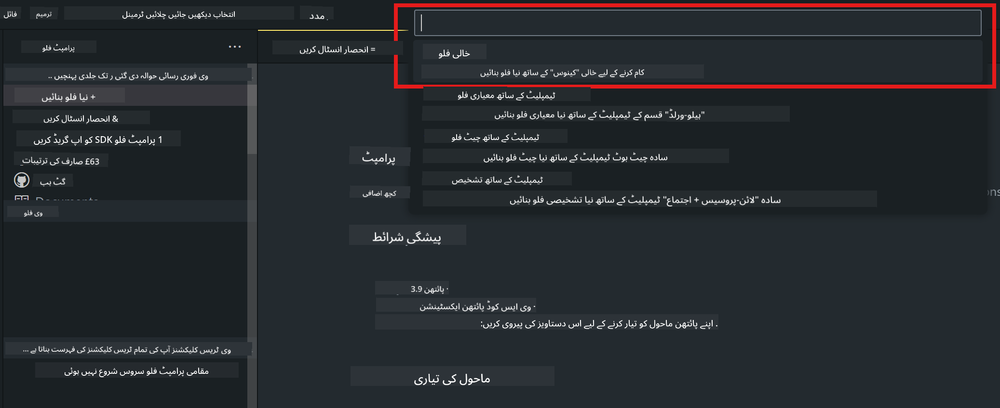
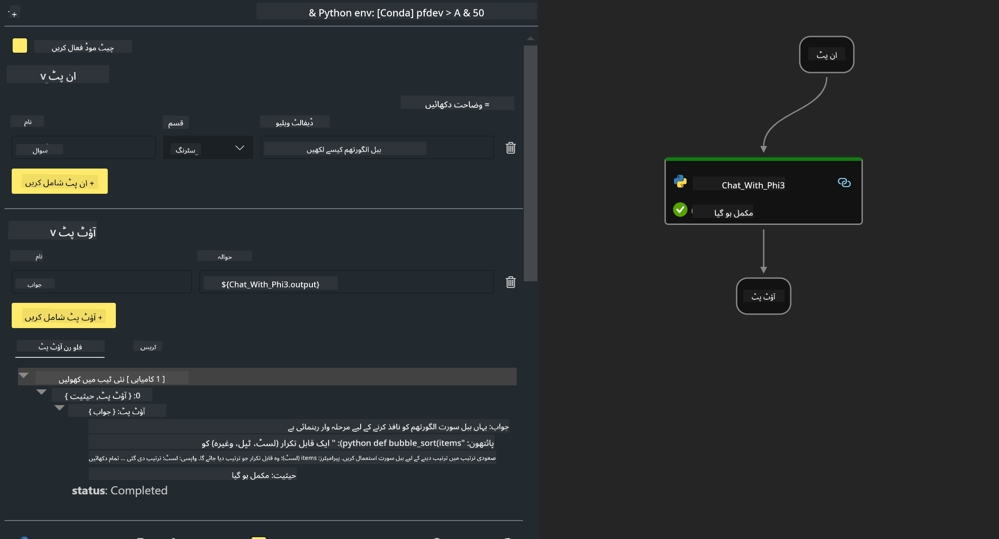
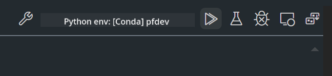

<!--
CO_OP_TRANSLATOR_METADATA:
{
  "original_hash": "3dbbf568625b1ee04b354c2dc81d3248",
  "translation_date": "2025-05-07T13:53:18+00:00",
  "source_file": "md/02.Application/02.Code/Phi3/VSCodeExt/HOL/Apple/02.PromptflowWithMLX.md",
  "language_code": "ur"
}
-->
# **لیب 2 - Phi-3-mini کے ساتھ AIPC میں Run Prompt flow**

## **Prompt flow کیا ہے**

Prompt flow ایک ایسا ڈیولپمنٹ ٹولز کا مجموعہ ہے جو LLM پر مبنی AI ایپلیکیشنز کی مکمل ڈیولپمنٹ سائیکل کو آسان بناتا ہے، آئیڈییشن، پروٹوٹائپنگ، ٹیسٹنگ، جائزہ لینے سے لے کر پروڈکشن میں تعیناتی اور مانیٹرنگ تک۔ یہ پرامپٹ انجینئرنگ کو بہت آسان بناتا ہے اور آپ کو پروڈکشن معیار کے ساتھ LLM ایپس بنانے کے قابل بناتا ہے۔

Prompt flow کے ذریعے آپ کر سکیں گے:

- ایسے فلو بنائیں جو LLMs، پرامپٹس، Python کوڈ اور دیگر ٹولز کو ایک قابل عمل ورک فلو میں جوڑتے ہیں۔

- اپنے فلو کو آسانی سے ڈیبگ اور دہرائیں، خاص طور پر LLMs کے ساتھ انٹریکشن میں۔

- اپنے فلو کا جائزہ لیں، معیار اور کارکردگی کے میٹرکس بڑے ڈیٹا سیٹس کے ساتھ حساب کریں۔

- ٹیسٹنگ اور جائزہ کو اپنے CI/CD سسٹم میں شامل کریں تاکہ آپ کے فلو کا معیار یقینی بنایا جا سکے۔

- اپنے فلو کو منتخب شدہ سروسنگ پلیٹ فارم پر تعینات کریں یا آسانی سے اپنی ایپ کے کوڈ بیس میں شامل کریں۔

- (اختیاری لیکن سختی سے تجویز کردہ) Azure AI میں Prompt flow کے کلاؤڈ ورژن کا استعمال کرتے ہوئے اپنی ٹیم کے ساتھ تعاون کریں۔


## **Apple Silicon پر جنریشن کوڈ فلو بنانا**

***Note*** ：اگر آپ نے ماحول کی تنصیب مکمل نہیں کی تو براہ کرم [Lab 0 -Installations](./01.Installations.md) دیکھیں

1. Visual Studio Code میں Prompt flow Extension کھولیں اور ایک خالی فلو پروجیکٹ بنائیں



2. Inputs اور Outputs کے پیرامیٹرز شامل کریں اور Python Code کو نئے فلو کے طور پر شامل کریں



آپ اس ساخت (flow.dag.yaml) کو اپنے فلو کی تعمیر کے لیے استعمال کر سکتے ہیں

```yaml

inputs:
  prompt:
    type: string
    default: Write python code for Fibonacci serie. Please use markdown as output
outputs:
  result:
    type: string
    reference: ${gen_code_by_phi3.output}
nodes:
- name: gen_code_by_phi3
  type: python
  source:
    type: code
    path: gen_code_by_phi3.py
  inputs:
    prompt: ${inputs.prompt}


```

3. phi-3-mini کو quantify کریں

ہم چاہتے ہیں کہ SLM کو مقامی آلات پر بہتر چلایا جا سکے۔ عام طور پر، ہم ماڈل کو quantize کرتے ہیں (INT4, FP16, FP32)

```bash

python -m mlx_lm.convert --hf-path microsoft/Phi-3-mini-4k-instruct

```

**Note:** ڈیفالٹ فولڈر mlx_model ہے

4. ***Chat_With_Phi3.py*** میں کوڈ شامل کریں

```python


from promptflow import tool

from mlx_lm import load, generate


# The inputs section will change based on the arguments of the tool function, after you save the code
# Adding type to arguments and return value will help the system show the types properly
# Please update the function name/signature per need
@tool
def my_python_tool(prompt: str) -> str:

    model_id = './mlx_model_phi3_mini'

    model, tokenizer = load(model_id)

    # <|user|>\nWrite python code for Fibonacci serie. Please use markdown as output<|end|>\n<|assistant|>

    response = generate(model, tokenizer, prompt="<|user|>\n" + prompt  + "<|end|>\n<|assistant|>", max_tokens=2048, verbose=True)

    return response


```

4. آپ Debug یا Run سے فلو کو ٹیسٹ کر سکتے ہیں تاکہ چیک کریں کہ جنریشن کوڈ صحیح کام کر رہا ہے یا نہیں



5. ٹرمینل میں ڈیولپمنٹ API کے طور پر فلو چلائیں

```

pf flow serve --source ./ --port 8080 --host localhost   

```

آپ اسے Postman / Thunder Client میں ٹیسٹ کر سکتے ہیں


### **Note**

1. پہلی بار چلانے میں وقت لگتا ہے۔ phi-3 ماڈل کو Hugging face CLI سے ڈاؤن لوڈ کرنا تجویز کیا جاتا ہے۔

2. Intel NPU کی محدود کمپیوٹنگ طاقت کو مدنظر رکھتے ہوئے، Phi-3-mini-4k-instruct استعمال کرنے کی سفارش ہے۔

3. ہم INT4 کنورژن کے لیے Intel NPU Acceleration استعمال کرتے ہیں، لیکن اگر آپ سروس کو دوبارہ چلائیں تو کیشے اور nc_workshop فولڈرز کو حذف کرنا ضروری ہے۔


## **وسائل**

1. Promptflow سیکھیں [https://microsoft.github.io/promptflow/](https://microsoft.github.io/promptflow/)

2. Intel NPU Acceleration سیکھیں [https://github.com/intel/intel-npu-acceleration-library](https://github.com/intel/intel-npu-acceleration-library)

3. سیمپل کوڈ، ڈاؤن لوڈ کریں [Local NPU Agent Sample Code](../../../../../../../../../code/07.Lab/01/AIPC/local-npu-agent)

**دستخط**:  
یہ دستاویز AI ترجمہ سروس [Co-op Translator](https://github.com/Azure/co-op-translator) کے ذریعے ترجمہ کی گئی ہے۔ اگرچہ ہم درستگی کے لیے کوشاں ہیں، براہ کرم آگاہ رہیں کہ خودکار تراجم میں غلطیاں یا بے ضابطگیاں ہو سکتی ہیں۔ اصل دستاویز اپنی مادری زبان میں ہی مستند ماخذ سمجھی جانی چاہیے۔ اہم معلومات کے لیے پیشہ ور انسانی ترجمہ کی سفارش کی جاتی ہے۔ ہم اس ترجمہ کے استعمال سے پیدا ہونے والی کسی بھی غلط فہمی یا غلط تعبیر کے ذمہ دار نہیں ہیں۔