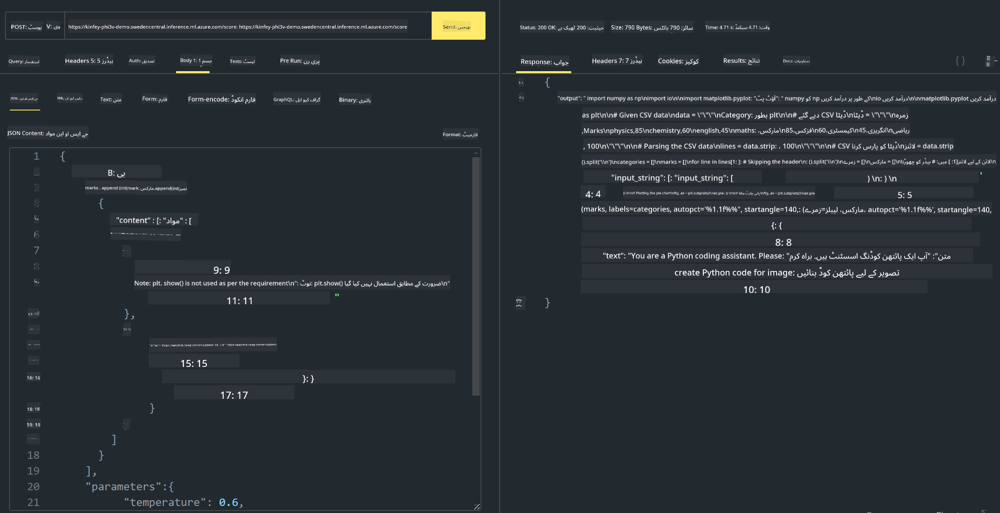

<!--
CO_OP_TRANSLATOR_METADATA:
{
  "original_hash": "20cb4e6ac1686248e8be913ccf6c2bc2",
  "translation_date": "2025-05-07T13:55:44+00:00",
  "source_file": "md/02.Application/02.Code/Phi3/VSCodeExt/HOL/Apple/03.DeployPhi3VisionOnAzure.md",
  "language_code": "ur"
}
-->
# **لیب 3 - Azure Machine Learning Service پر Phi-3-vision کی تعیناتی**

ہم NPU استعمال کرتے ہیں تاکہ لوکل کوڈ کی پروڈکشن تعیناتی مکمل کریں، اور پھر ہم اس کے ذریعے PHI-3-VISION کو متعارف کرانے کی صلاحیت چاہتے ہیں تاکہ تصاویر سے کوڈ تیار کیا جا سکے۔

اس تعارف میں، ہم تیزی سے Azure Machine Learning Service میں Model As Service Phi-3 Vision سروس بنا سکتے ہیں۔

***Note***： Phi-3 Vision کو مواد تیزی سے تیار کرنے کے لیے کمپیوٹنگ پاور کی ضرورت ہوتی ہے۔ ہمیں اس کے لیے کلاؤڈ کمپیوٹنگ پاور کی ضرورت ہے۔

### **1. Azure Machine Learning Service بنائیں**

ہمیں Azure پورٹل میں Azure Machine Learning Service بنانی ہوگی۔ اگر آپ سیکھنا چاہتے ہیں کہ کیسے، تو براہ کرم اس لنک پر جائیں [https://learn.microsoft.com/azure/machine-learning/quickstart-create-resources?view=azureml-api-2](https://learn.microsoft.com/azure/machine-learning/quickstart-create-resources?view=azureml-api-2)

### **2. Azure Machine Learning Service میں Phi-3 Vision منتخب کریں**


### **3. Azure میں Phi-3-Vision کی تعیناتی**


### **4. Postman میں Endpoint کی جانچ کریں**



***Note***

1. بھیجے جانے والے پیرامیٹرز میں Authorization، azureml-model-deployment، اور Content-Type شامل ہونا ضروری ہیں۔ آپ کو تعیناتی کی معلومات چیک کر کے یہ حاصل کرنا ہوگا۔

2. پیرامیٹرز بھیجنے کے لیے، Phi-3-Vision کو تصویر کے لنک کی ضرورت ہے۔ براہ کرم GPT-4-Vision کے طریقہ کار کو دیکھیں، جیسے کہ

```json

{
  "input_data":{
    "input_string":[
      {
        "role":"user",
        "content":[ 
          {
            "type": "text",
            "text": "You are a Python coding assistant.Please create Python code for image "
          },
          {
              "type": "image_url",
              "image_url": {
                "url": "https://ajaytech.co/wp-content/uploads/2019/09/index.png"
              }
          }
        ]
      }
    ],
    "parameters":{
          "temperature": 0.6,
          "top_p": 0.9,
          "do_sample": false,
          "max_new_tokens": 2048
    }
  }
}

```

3. Post میتھڈ استعمال کرتے ہوئے **/score** کو کال کریں

**مبارک ہو**! آپ نے تیزی سے PHI-3-VISION کی تعیناتی مکمل کر لی ہے اور یہ جانچ لیا ہے کہ تصاویر سے کوڈ کیسے تیار کیا جاتا ہے۔ اگلا، ہم NPUs اور کلاؤڈ کے ساتھ مل کر ایپلیکیشنز بنا سکتے ہیں۔

**ڈس کلیمر**:  
یہ دستاویز AI ترجمہ سروس [Co-op Translator](https://github.com/Azure/co-op-translator) کے ذریعے ترجمہ کی گئی ہے۔ اگرچہ ہم درستگی کے لیے کوشاں ہیں، براہ کرم اس بات سے آگاہ رہیں کہ خودکار ترجموں میں غلطیاں یا غیر درستیاں ہو سکتی ہیں۔ اصل دستاویز اپنی مادری زبان میں معتبر ماخذ سمجھی جانی چاہیے۔ اہم معلومات کے لیے پیشہ ور انسانی ترجمہ کی سفارش کی جاتی ہے۔ ہم اس ترجمے کے استعمال سے پیدا ہونے والی کسی بھی غلط فہمی یا غلط تشریح کے لیے ذمہ دار نہیں ہیں۔