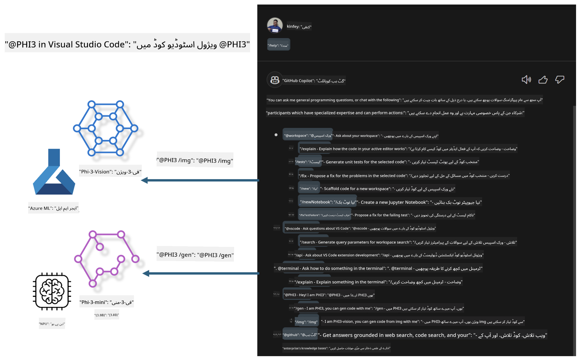

<!--
CO_OP_TRANSLATOR_METADATA:
{
  "original_hash": "7302d85639441c7cedbae09795e6b9a6",
  "translation_date": "2025-04-03T07:41:30+00:00",
  "source_file": "md\\02.Application\\02.Code\\Phi3\\VSCodeExt\\README.md",
  "language_code": "ur"
}
-->
# **اپنا Visual Studio Code GitHub Copilot Chat Microsoft Phi-3 Family کے ساتھ بنائیں**

کیا آپ نے GitHub Copilot Chat میں ورک اسپیس ایجنٹ استعمال کیا ہے؟ کیا آپ اپنی ٹیم کا کوڈ ایجنٹ بنانا چاہتے ہیں؟ یہ عملی تجربہ آپ کو اوپن سورس ماڈل کے ذریعے ایک انٹرپرائز لیول کوڈ بزنس ایجنٹ بنانے میں مدد فراہم کرتا ہے۔

## **بنیاد**

### **Microsoft Phi-3 کیوں منتخب کریں**

Phi-3 ایک فیملی سیریز ہے، جس میں phi-3-mini، phi-3-small، اور phi-3-medium شامل ہیں، جو مختلف ٹریننگ پیرامیٹرز پر مبنی ہیں جیسے ٹیکسٹ جنریشن، ڈائیلاگ کمپلیشن، اور کوڈ جنریشن۔ اس کے علاوہ، phi-3-vision بھی موجود ہے جو وژن پر مبنی ہے۔ یہ انٹرپرائزز یا مختلف ٹیموں کے لیے آف لائن جنریٹیو AI سلوشنز بنانے کے لیے موزوں ہے۔

اس لنک کو پڑھنے کی تجویز دی جاتی ہے [https://github.com/microsoft/PhiCookBook/blob/main/md/01.Introduction/01/01.PhiFamily.md](https://github.com/microsoft/PhiCookBook/blob/main/md/01.Introduction/01/01.PhiFamily.md)

### **Microsoft GitHub Copilot Chat**

GitHub Copilot Chat ایک چیٹ انٹرفیس فراہم کرتا ہے جو آپ کو GitHub Copilot کے ساتھ بات چیت کرنے اور کوڈنگ سے متعلق سوالات کے جوابات براہ راست VS Code میں حاصل کرنے دیتا ہے، بغیر دستاویزات کے تلاش یا آن لائن فورمز پر جانے کی ضرورت کے۔

Copilot Chat کوڈ کے جوابات کو واضح کرنے کے لیے syntax highlighting، indentation، اور دیگر فارمیٹنگ فیچرز استعمال کر سکتا ہے۔ صارف کے سوال کی نوعیت کے مطابق، نتیجہ میں لنکس شامل ہو سکتے ہیں جو Copilot نے جواب تیار کرنے کے لیے استعمال کیے ہیں، جیسے سورس کوڈ فائلز یا دستاویزات، یا VS Code کی فعالیت تک رسائی کے لیے بٹن۔

- Copilot Chat آپ کے ڈیولپر فلو میں ضم ہوتا ہے اور آپ کو جہاں ضرورت ہو وہاں مدد فراہم کرتا ہے:

- ایڈیٹر یا ٹرمینل سے براہ راست ان لائن چیٹ گفتگو شروع کریں تاکہ کوڈنگ کے دوران مدد حاصل کی جا سکے

- چیٹ ویو استعمال کریں تاکہ آپ کو کسی بھی وقت AI اسسٹنٹ کی سہولت حاصل ہو

- کوئیک چیٹ لانچ کریں تاکہ جلدی سوال کریں اور اپنے کام پر واپس جائیں

آپ GitHub Copilot Chat کو مختلف منظرناموں میں استعمال کر سکتے ہیں، جیسے:

- مسئلہ حل کرنے کے بہترین طریقے کے بارے میں کوڈنگ سوالات کے جوابات دینا

- کسی اور کے کوڈ کی وضاحت کرنا اور بہتری کی تجاویز دینا

- کوڈ فکسز تجویز کرنا

- یونٹ ٹیسٹ کیسز تیار کرنا

- کوڈ دستاویزات تیار کرنا

اس لنک کو پڑھنے کی تجویز دی جاتی ہے [https://code.visualstudio.com/docs/copilot/copilot-chat](https://code.visualstudio.com/docs/copilot/copilot-chat?WT.mc_id=aiml-137032-kinfeylo)

###  **Microsoft GitHub Copilot Chat @workspace**

Copilot Chat میں **@workspace** کا حوالہ دینا آپ کو اپنے پورے کوڈ بیس کے بارے میں سوالات پوچھنے کی سہولت دیتا ہے۔ سوال کی بنیاد پر، Copilot ذہانت سے متعلقہ فائلز اور سمبلز تلاش کرتا ہے، جنہیں وہ اپنے جواب میں لنکس اور کوڈ مثالوں کے طور پر شامل کرتا ہے۔

سوال کا جواب دینے کے لیے، **@workspace** وہی ذرائع تلاش کرتا ہے جو ایک ڈیولپر VS Code میں کوڈ بیس نیویگیٹ کرنے کے لیے استعمال کرے گا:

- ورک اسپیس میں موجود تمام فائلز، سوائے ان فائلز کے جو .gitignore فائل کے ذریعے نظرانداز کی گئی ہیں

- ڈائریکٹری اسٹرکچر جس میں nested فولڈرز اور فائل نام شامل ہیں

- اگر ورک اسپیس GitHub ریپوزیٹری ہے اور کوڈ سرچ کے ذریعے انڈیکسڈ ہے، تو GitHub کا کوڈ سرچ انڈیکس

- ورک اسپیس میں موجود سمبلز اور ڈیفینیشنز

- ایڈیٹر میں منتخب کردہ یا نظر آنے والا متن

نوٹ: اگر آپ نے نظرانداز کی گئی فائل کھولی ہے یا اس میں متن منتخب کیا ہے، تو .gitignore کو نظرانداز کیا جاتا ہے۔

اس لنک کو پڑھنے کی تجویز دی جاتی ہے [[https://code.visualstudio.com/docs/copilot/copilot-chat](https://code.visualstudio.com/docs/copilot/workspace-context?WT.mc_id=aiml-137032-kinfeylo)]

## **اس تجربہ کے بارے میں مزید جانیں**

GitHub Copilot نے انٹرپرائزز کی پروگرامنگ کی کارکردگی کو بہت بہتر بنایا ہے، اور ہر انٹرپرائز GitHub Copilot کے متعلقہ فنکشنز کو اپنی مرضی کے مطابق بنانا چاہتا ہے۔ بہت سے انٹرپرائزز نے اپنے کاروباری منظرناموں اور اوپن سورس ماڈلز کی بنیاد پر GitHub Copilot جیسے Extensions کو اپنی مرضی کے مطابق بنایا ہے۔ انٹرپرائزز کے لیے، کسٹمائزڈ Extensions کو کنٹرول کرنا آسان ہے، لیکن یہ صارف کے تجربے کو متاثر کرتا ہے۔ آخر کار، GitHub Copilot عام منظرناموں اور پیشہ ورانہ مہارت کے ساتھ زیادہ مضبوط ہے۔ اگر تجربہ مستقل رکھا جا سکے، تو انٹرپرائز کا اپنا Extension کسٹمائز کرنا بہتر ہوگا۔ GitHub Copilot Chat انٹرپرائزز کو چیٹ کے تجربے میں توسیع کے لیے متعلقہ APIs فراہم کرتا ہے۔ مستقل تجربہ برقرار رکھنا اور کسٹمائزڈ فنکشنز رکھنا ایک بہتر صارف تجربہ ہے۔

یہ تجربہ بنیادی طور پر Phi-3 ماڈل کو مقامی NPU اور Azure ہائبرڈ کے ساتھ ملا کر GitHub Copilot Chat میں ایک کسٹم ایجنٹ ***@PHI3*** بنانے کے لیے استعمال کرتا ہے تاکہ انٹرپرائز ڈیولپرز کو کوڈ جنریشن مکمل کرنے میں مدد دی جا سکے ***(@PHI3 /gen)*** اور تصاویر کی بنیاد پر کوڈ تیار کیا جا سکے ***(@PHI3 /img)***۔

### ***نوٹ:*** 

یہ تجربہ فی الحال Intel CPU اور Apple Silicon کے AIPC میں نافذ کیا گیا ہے۔ ہم Qualcomm ورژن کے NPU کو مسلسل اپ ڈیٹ کریں گے۔

## **تجربہ**

| نام | تفصیل | AIPC | Apple |
| ------------ | ----------- | -------- |-------- |
| Lab0 - انسٹالیشنز(✅) | متعلقہ ماحول اور انسٹالیشن ٹولز کو ترتیب دیں اور انسٹال کریں | [جائیں](./HOL/AIPC/01.Installations.md) |[جائیں](./HOL/Apple/01.Installations.md) |
| Lab1 - Phi-3-mini کے ساتھ پرومپٹ فلو چلائیں (✅) | AIPC / Apple Silicon کے ساتھ ملا کر، مقامی NPU کا استعمال کرتے ہوئے Phi-3-mini کے ذریعے کوڈ جنریشن بنائیں | [جائیں](./HOL/AIPC/02.PromptflowWithNPU.md) |  [جائیں](./HOL/Apple/02.PromptflowWithMLX.md) |
| Lab2 - Phi-3-vision کو Azure Machine Learning Service پر تعینات کریں(✅) | Azure Machine Learning Service کے Model Catalog - Phi-3-vision امیج کو تعینات کر کے کوڈ تیار کریں | [جائیں](./HOL/AIPC/03.DeployPhi3VisionOnAzure.md) |[جائیں](./HOL/Apple/03.DeployPhi3VisionOnAzure.md) |
| Lab3 - GitHub Copilot Chat میں @phi-3 ایجنٹ بنائیں(✅)  | GitHub Copilot Chat میں ایک کسٹم Phi-3 ایجنٹ بنائیں تاکہ کوڈ جنریشن، گراف جنریشن کوڈ، RAG وغیرہ مکمل کر سکیں | [جائیں](./HOL/AIPC/04.CreatePhi3AgentInVSCode.md) | [جائیں](./HOL/Apple/04.CreatePhi3AgentInVSCode.md) |
| نمونہ کوڈ (✅)  | نمونہ کوڈ ڈاؤن لوڈ کریں | [جائیں](../../../../../../../code/07.Lab/01/AIPC) | [جائیں](../../../../../../../code/07.Lab/01/Apple) |

## **وسائل**

1. Phi-3 Cookbook [https://github.com/microsoft/Phi-3CookBook](https://github.com/microsoft/Phi-3CookBook)

2. GitHub Copilot کے بارے میں مزید جانیں [https://learn.microsoft.com/training/paths/copilot/](https://learn.microsoft.com/training/paths/copilot/?WT.mc_id=aiml-137032-kinfeylo)

3. GitHub Copilot Chat کے بارے میں مزید جانیں [https://learn.microsoft.com/training/paths/accelerate-app-development-using-github-copilot/](https://learn.microsoft.com/training/paths/accelerate-app-development-using-github-copilot/?WT.mc_id=aiml-137032-kinfeylo)

4. GitHub Copilot Chat API کے بارے میں مزید جانیں [https://code.visualstudio.com/api/extension-guides/chat](https://code.visualstudio.com/api/extension-guides/chat?WT.mc_id=aiml-137032-kinfeylo)

5. Azure AI Foundry کے بارے میں مزید جانیں [https://learn.microsoft.com/training/paths/create-custom-copilots-ai-studio/](https://learn.microsoft.com/training/paths/create-custom-copilots-ai-studio/?WT.mc_id=aiml-137032-kinfeylo)

6. Azure AI Foundry کے Model Catalog کے بارے میں مزید جانیں [https://learn.microsoft.com/azure/ai-studio/how-to/model-catalog-overview](https://learn.microsoft.com/azure/ai-studio/how-to/model-catalog-overview)

**ڈسکلیمر**:  
یہ دستاویز AI ترجمہ سروس [Co-op Translator](https://github.com/Azure/co-op-translator) کا استعمال کرتے ہوئے ترجمہ کی گئی ہے۔ اگرچہ ہم درستگی کی کوشش کرتے ہیں، براہ کرم آگاہ رہیں کہ خودکار ترجمے میں غلطیاں یا غیر درستیاں ہو سکتی ہیں۔ اصل دستاویز کو اس کی اصل زبان میں مستند ذریعہ سمجھا جانا چاہیے۔ اہم معلومات کے لیے، پیشہ ور انسانی ترجمے کی سفارش کی جاتی ہے۔ اس ترجمے کے استعمال سے پیدا ہونے والی کسی بھی غلط فہمی یا غلط تشریح کے لیے ہم ذمہ دار نہیں ہیں۔