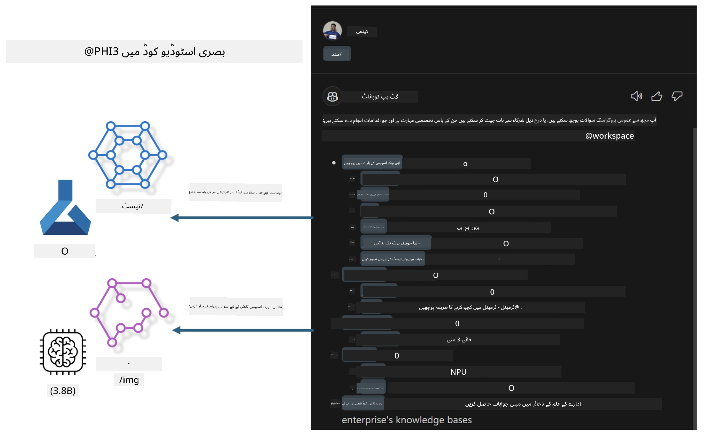

# **اپنا خود کا Visual Studio Code GitHub Copilot Chat Microsoft Phi-3 فیملی کے ساتھ بنائیں**

کیا آپ نے GitHub Copilot Chat میں ورک اسپیس ایجنٹ استعمال کیا ہے؟ کیا آپ اپنی ٹیم کا کوڈ ایجنٹ بنانا چاہتے ہیں؟ یہ عملی لیب اوپن سورس ماڈل کو یکجا کرنے کی کوشش کرتی ہے تاکہ انٹرپرائز لیول کوڈ بزنس ایجنٹ بنایا جا سکے۔

## **بنیاد**

### **مائیکروسافٹ Phi-3 کیوں منتخب کریں**

Phi-3 ایک فیملی سیریز ہے، جس میں phi-3-mini، phi-3-small، اور phi-3-medium شامل ہیں جو مختلف ٹریننگ پیرامیٹرز کی بنیاد پر متن کی تخلیق، مکالمے کی تکمیل، اور کوڈ جنریشن کے لیے ہیں۔ اس کے علاوہ phi-3-vision بھی ہے جو Vision پر مبنی ہے۔ یہ انٹرپرائزز یا مختلف ٹیموں کے لیے آف لائن جنریٹیو AI حل بنانے کے لیے موزوں ہے۔

اس لنک کو پڑھنے کی سفارش کی جاتی ہے [https://github.com/microsoft/PhiCookBook/blob/main/md/01.Introduction/01/01.PhiFamily.md](https://github.com/microsoft/PhiCookBook/blob/main/md/01.Introduction/01/01.PhiFamily.md)

### **مائیکروسافٹ GitHub Copilot Chat**

GitHub Copilot Chat ایکسٹینشن آپ کو ایک چیٹ انٹرفیس فراہم کرتا ہے جو آپ کو GitHub Copilot کے ساتھ بات چیت کرنے دیتا ہے اور VS Code کے اندر ہی کوڈنگ سے متعلق سوالات کے جوابات حاصل کرنے کی سہولت دیتا ہے، بغیر کسی دستاویزات کو براؤز کرنے یا آن لائن فورمز میں تلاش کرنے کی ضرورت کے۔

Copilot Chat ممکنہ طور پر syntax highlighting, indentation، اور دیگر فارمیٹنگ فیچرز استعمال کرتا ہے تاکہ پیدا شدہ جواب کی وضاحت ہو۔ صارف کی سوال کی قسم کے مطابق، نتیجہ میں لنکس شامل ہو سکتے ہیں جو اس سیاق و سباق کی طرف اشارہ کرتے ہیں جس کا Copilot نے جواب تیار کرنے کے لیے استعمال کیا، جیسے سورس کوڈ فائلز یا دستاویزات، یا VS Code کی فعالیت تک رسائی کے بٹن۔

- Copilot Chat آپ کے ڈویلپر کے بہاؤ میں ضم ہو جاتا ہے اور جہاں آپ کو ضرورت ہو وہاں مدد فراہم کرتا ہے:

- ایڈیٹر یا ٹرمینل سے براہ راست ان لائن چیٹ گفتگو شروع کریں جب آپ کوڈنگ کر رہے ہوں اور مدد چاہیے ہو

- Chat ویو استعمال کریں تاکہ آپ کے پاس ایک AI اسسٹنٹ ہمیشہ ساتھ ہو جو آپ کی مدد کرے

- Quick Chat لانچ کریں تاکہ جلدی سوال پوچھیں اور پھر اپنے کام پر واپس جائیں

آپ GitHub Copilot Chat کو مختلف صورتوں میں استعمال کر سکتے ہیں، جیسے:

- کوڈنگ سوالات کے جوابات دینا کہ مسئلہ کو بہترین طریقے سے کیسے حل کیا جائے

- کسی اور کے کوڈ کی وضاحت کرنا اور بہتری کی تجاویز دینا

- کوڈ کی اصلاحات تجویز کرنا

- یونٹ ٹیسٹ کیسز تیار کرنا

- کوڈ دستاویزات تیار کرنا

اس لنک کو پڑھنے کی سفارش کی جاتی ہے [https://code.visualstudio.com/docs/copilot/copilot-chat](https://code.visualstudio.com/docs/copilot/copilot-chat?WT.mc_id=aiml-137032-kinfeylo)

###  **Microsoft GitHub Copilot Chat @workspace**

Copilot Chat میں **@workspace** کا حوالہ دینا آپ کو اپنے پورے کوڈ بیس کے بارے میں سوالات کرنے دیتا ہے۔ سوال کی بنیاد پر، Copilot ذہانت سے متعلقہ فائلیں اور سمبلز لاتا ہے جنہیں وہ اپنے جواب میں لنکس اور کوڈ مثالوں کے طور پر حوالہ دیتا ہے۔

آپ کے سوال کا جواب دینے کے لیے، **@workspace** وہی ذرائع تلاش کرتا ہے جو ایک ڈویلپر VS Code میں کوڈ بیس نیویگیٹ کرتے ہوئے استعمال کرے گا:

- ورک اسپیس کی تمام فائلیں، سوائے ان فائلوں کے جو .gitignore فائل سے نظر انداز کی گئی ہوں

- ڈائریکٹری ساخت جس میں nested فولڈر اور فائل کے نام شامل ہوں

- GitHub کا کوڈ سرچ انڈیکس، اگر ورک اسپیس GitHub ریپوزیٹری ہو اور کوڈ سرچ کے ذریعے انڈیکس کیا گیا ہو

- ورک اسپیس میں سمبلز اور تعریفیں

- ایکٹو ایڈیٹر میں فی الوقت منتخب شدہ متن یا دکھائی دینے والا متن

نوٹ: اگر آپ کے پاس کوئی فائل کھلی ہو یا نظر انداز کی گئی فائل میں کوئی متن منتخب کیا گیا ہو تو .gitignore کو نظر انداز کیا جاتا ہے۔

اس لنک کو پڑھنے کی سفارش کی جاتی ہے [[https://code.visualstudio.com/docs/copilot/copilot-chat](https://code.visualstudio.com/docs/copilot/workspace-context?WT.mc_id=aiml-137032-kinfeylo)]

## **اس لیب کے بارے میں مزید جانیں**

GitHub Copilot نے انٹرپرائزز کی پروگرامنگ کی کارکردگی کو نمایاں طور پر بہتر بنایا ہے، اور ہر انٹرپرائز چاہتا ہے کہ GitHub Copilot کی متعلقہ خصوصیات کو اپنی مرضی کے مطابق بنائے۔ بہت سے انٹرپرائزز نے اپنے کاروباری منظرناموں اور اوپن سورس ماڈلز کی بنیاد پر GitHub Copilot جیسی اپنی مرضی کی ایکسٹینشنز تیار کی ہیں۔ انٹرپرائزز کے لیے، اپنی مرضی کی ایکسٹینشنز کو کنٹرول کرنا آسان ہوتا ہے، لیکن اس کا صارف کے تجربے پر اثر بھی پڑتا ہے۔ آخرکار، GitHub Copilot عمومی منظرناموں اور پیشہ ورانہ صلاحیتوں کے حل میں زیادہ مضبوط طریقے سے کام کرتا ہے۔ اگر تجربہ مسلسل برقرار رکھا جا سکے تو اپنی مرضی کی انٹرپرائز ایکسٹینشن بنانا بہتر ہوگا۔ GitHub Copilot Chat انٹرپرائزز کو چیٹ تجربے میں توسیع کے لیے متعلقہ APIs فراہم کرتا ہے۔ مستقل تجربہ برقرار رکھنے اور اپنی مرضی کی خصوصیات رکھنے سے بہتر صارف تجربہ حاصل ہوتا ہے۔

یہ لیب بنیادی طور پر Phi-3 ماڈل کو مقامی NPU اور Azure ہائبرڈ کے ساتھ ملا کر GitHub Copilot Chat میں ایک کسٹم ایجنٹ ***@PHI3*** بناتی ہے تاکہ انٹرپرائز ڈویلپرز کی مدد کرے کوڈ جنریشن مکمل کرنے میں ***(@PHI3 /gen)*** اور تصاویر کی بنیاد پر کوڈ تخلیق کرنے میں ***(@PHI3 /img)***۔

### ***نوٹ:*** 

یہ لیب فی الحال Intel CPU اور Apple Silicon کے AIPC پر نافذ کی گئی ہے۔ ہم Qualcomm ورژن کے NPU کو بھی اپڈیٹ کرتے رہیں گے۔

## **لیب**

| نام | تفصیل | AIPC | ایپل |
| ------------ | ----------- | -------- |-------- |
| Lab0 - Installations(✅) | متعلقہ ماحول اور انسٹالیشن ٹولز کو ترتیب دیں اور انسٹال کریں | [جائیں](./HOL/AIPC/01.Installations.md) |[جائیں](./HOL/Apple/01.Installations.md) |
| Lab1 - Run Prompt flow with Phi-3-mini (✅) | AIPC / Apple Silicon کے ساتھ مل کر، مقامی NPU استعمال کرتے ہوئے Phi-3-mini کے ذریعہ کوڈ جنریشن بنائیں | [جائیں](./HOL/AIPC/02.PromptflowWithNPU.md) |  [جائیں](./HOL/Apple/02.PromptflowWithMLX.md) |
| Lab2 - Deploy Phi-3-vision on Azure Machine Learning Service(✅) | Azure Machine Learning Service کے ماڈل کیٹلاگ - Phi-3-vision امیج کو تعینات کرکے کوڈ تیار کریں | [جائیں](./HOL/AIPC/03.DeployPhi3VisionOnAzure.md) |[جائیں](./HOL/Apple/03.DeployPhi3VisionOnAzure.md) |
| Lab3 - Create a @phi-3 agent in GitHub Copilot Chat(✅)  | GitHub Copilot Chat میں ایک کسٹم Phi-3 ایجنٹ بنائیں جو کوڈ جنریشن، گراف جنریشن کوڈ، RAG وغیرہ مکمل کرے | [جائیں](./HOL/AIPC/04.CreatePhi3AgentInVSCode.md) | [جائیں](./HOL/Apple/04.CreatePhi3AgentInVSCode.md) |
| Sample Code (✅)  | سیمپل کوڈ ڈاؤن لوڈ کریں | [جائیں](../../../../../../../code/07.Lab/01/AIPC) | [جائیں](../../../../../../../code/07.Lab/01/Apple) |

## **وسائل**

1. Phi-3 Cookbook [https://github.com/microsoft/Phi-3CookBook](https://github.com/microsoft/Phi-3CookBook)

2. GitHub Copilot کے بارے میں مزید جانیں [https://learn.microsoft.com/training/paths/copilot/](https://learn.microsoft.com/training/paths/copilot/?WT.mc_id=aiml-137032-kinfeylo)

3. GitHub Copilot Chat کے بارے میں مزید جانیں [https://learn.microsoft.com/training/paths/accelerate-app-development-using-github-copilot/](https://learn.microsoft.com/training/paths/accelerate-app-development-using-github-copilot/?WT.mc_id=aiml-137032-kinfeylo)

4. GitHub Copilot Chat API کے بارے میں مزید جانیں [https://code.visualstudio.com/api/extension-guides/chat](https://code.visualstudio.com/api/extension-guides/chat?WT.mc_id=aiml-137032-kinfeylo)

5. Microsoft Foundry کے بارے میں مزید جانیں [https://learn.microsoft.com/training/paths/create-custom-copilots-ai-studio/](https://learn.microsoft.com/training/paths/create-custom-copilots-ai-studio/?WT.mc_id=aiml-137032-kinfeylo)

6. Microsoft Foundry کے ماڈل کیٹلاگ کے بارے میں مزید جانیں [https://learn.microsoft.com/azure/ai-studio/how-to/model-catalog-overview](https://learn.microsoft.com/azure/ai-studio/how-to/model-catalog-overview)

---

<!-- CO-OP TRANSLATOR DISCLAIMER START -->
**免责声明**:  
یہ دستاویز AI ترجمہ خدمات [Co-op Translator](https://github.com/Azure/co-op-translator) کے ذریعے ترجمہ کی گئی ہے۔ اگرچہ ہم درستگی کے لیے کوشاں ہیں، براہ کرم آگاہ رہیں کہ خودکار ترجمات میں غلطیاں یا غیر یقینی باتیں ہو سکتی ہیں۔ اصل دستاویز اپنی مادری زبان میں معتبر ماخذ سمجھا جانا چاہیے۔ ضروری معلومات کے لیے ماہر انسانی ترجمہ کی سفارش کی جاتی ہے۔ اس ترجمہ کے استعمال سے پیدا ہونے والی کسی بھی غلط فہمی یا غلط تشریح کی ذمہ داری ہم پر عائد نہیں ہوتی۔
<!-- CO-OP TRANSLATOR DISCLAIMER END -->