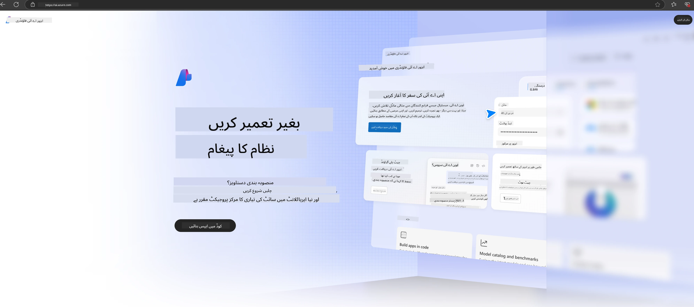

<!--
CO_OP_TRANSLATOR_METADATA:
{
  "original_hash": "3a1e48b628022485aac989c9f733e792",
  "translation_date": "2025-07-17T05:19:30+00:00",
  "source_file": "md/02.QuickStart/AzureAIFoundry_QuickStart.md",
  "language_code": "ur"
}
-->
# **Azure AI Foundry میں Phi-3 کا استعمال**

Generative AI کی ترقی کے ساتھ، ہم امید کرتے ہیں کہ ایک متحدہ پلیٹ فارم کے ذریعے مختلف LLM اور SLM، انٹرپرائز ڈیٹا انٹیگریشن، fine-tuning/RAG آپریشنز، اور LLM اور SLM کے انضمام کے بعد مختلف انٹرپرائز کاروباروں کی تشخیص کو منظم کیا جا سکے، تاکہ generative AI کی مدد سے اسمارٹ ایپلیکیشنز کو بہتر طریقے سے نافذ کیا جا سکے۔ [Azure AI Foundry](https://ai.azure.com) ایک انٹرپرائز سطح کا generative AI ایپلیکیشن پلیٹ فارم ہے۔

Azure AI Foundry کے ذریعے، آپ بڑے زبان کے ماڈلز (LLM) کے جوابات کا جائزہ لے سکتے ہیں اور بہتر کارکردگی کے لیے prompt flow کے ساتھ prompt application components کو منظم کر سکتے ہیں۔ یہ پلیٹ فارم proof of concepts کو آسانی سے مکمل پروڈکشن میں تبدیل کرنے کے لیے scalability فراہم کرتا ہے۔ مسلسل نگرانی اور بہتری طویل مدتی کامیابی کی حمایت کرتی ہے۔

ہم آسان مراحل کے ذریعے Azure AI Foundry پر Phi-3 ماڈل کو جلدی تعینات کر سکتے ہیں، اور پھر Azure AI Foundry کا استعمال کرتے ہوئے Phi-3 سے متعلق Playground/Chat، Fine-tuning، تشخیص اور دیگر متعلقہ کام مکمل کر سکتے ہیں۔

## **1. تیاری**

اگر آپ کے پاس پہلے سے [Azure Developer CLI](https://learn.microsoft.com/azure/developer/azure-developer-cli/overview?WT.mc_id=aiml-138114-kinfeylo) انسٹال ہے، تو اس ٹیمپلیٹ کا استعمال ایک نئے فولڈر میں یہ کمانڈ چلانے جتنا آسان ہے۔

## دستی تخلیق

Microsoft Azure AI Foundry میں پروجیکٹ اور ہب بنانا آپ کے AI کام کو منظم کرنے کا بہترین طریقہ ہے۔ شروع کرنے کے لیے یہ مرحلہ وار رہنمائی ہے:

### Azure AI Foundry میں پروجیکٹ بنانا

1. **Azure AI Foundry پر جائیں**: Azure AI Foundry پورٹل میں سائن ان کریں۔
2. **پروجیکٹ بنائیں**:
   - اگر آپ کسی پروجیکٹ میں ہیں، تو صفحے کے اوپر بائیں جانب "Azure AI Foundry" منتخب کریں تاکہ ہوم پیج پر جائیں۔
   - "+ Create project" منتخب کریں۔
   - پروجیکٹ کے لیے ایک نام درج کریں۔
   - اگر آپ کے پاس ہب ہے، تو وہ ڈیفالٹ طور پر منتخب ہوگا۔ اگر آپ کے پاس ایک سے زیادہ ہب تک رسائی ہے، تو آپ ڈراپ ڈاؤن سے کوئی دوسرا منتخب کر سکتے ہیں۔ اگر آپ نیا ہب بنانا چاہتے ہیں، تو "Create new hub" منتخب کریں اور نام فراہم کریں۔
   - "Create" منتخب کریں۔

### Azure AI Foundry میں ہب بنانا

1. **Azure AI Foundry پر جائیں**: اپنے Azure اکاؤنٹ سے سائن ان کریں۔
2. **ہب بنائیں**:
   - بائیں مینو سے Management center منتخب کریں۔
   - "All resources" منتخب کریں، پھر "+ New project" کے نیچے تیر پر کلک کریں اور "+ New hub" منتخب کریں۔
   - "Create a new hub" ڈائیلاگ میں اپنے ہب کا نام درج کریں (مثلاً contoso-hub) اور دیگر فیلڈز حسبِ ضرورت تبدیل کریں۔
   - "Next" منتخب کریں، معلومات کا جائزہ لیں، پھر "Create" منتخب کریں۔

مزید تفصیلی ہدایات کے لیے آپ سرکاری [Microsoft دستاویزات](https://learn.microsoft.com/azure/ai-studio/how-to/create-projects) دیکھ سکتے ہیں۔

کامیابی سے تخلیق کے بعد، آپ اپنے بنائے ہوئے اسٹوڈیو تک [ai.azure.com](https://ai.azure.com/) کے ذریعے رسائی حاصل کر سکتے ہیں۔

ایک AI Foundry پر متعدد پروجیکٹس ہو سکتے ہیں۔ AI Foundry میں پروجیکٹ بنائیں تاکہ تیاری مکمل ہو۔

Azure AI Foundry کے [QuickStarts](https://learn.microsoft.com/azure/ai-studio/quickstarts/get-started-code) بنائیں۔

## **2. Azure AI Foundry میں Phi ماڈل کی تعیناتی**

پروجیکٹ کے Explore آپشن پر کلک کریں تاکہ Model Catalog میں جائیں اور Phi-3 منتخب کریں۔

Phi-3-mini-4k-instruct منتخب کریں۔

Phi-3-mini-4k-instruct ماڈل کو تعینات کرنے کے لیے 'Deploy' پر کلک کریں۔

> [!NOTE]
>
> تعیناتی کے دوران آپ کمپیوٹنگ پاور منتخب کر سکتے ہیں۔

## **3. Azure AI Foundry میں Playground Chat Phi**

تعیناتی کے صفحے پر جائیں، Playground منتخب کریں، اور Azure AI Foundry کے Phi-3 کے ساتھ چیٹ کریں۔

## **4. Azure AI Foundry سے ماڈل کی تعیناتی**

Azure Model Catalog سے ماڈل تعینات کرنے کے لیے یہ مراحل اپنائیں:

- Azure AI Foundry میں سائن ان کریں۔
- Azure AI Foundry ماڈل کیٹلاگ سے وہ ماڈل منتخب کریں جسے آپ تعینات کرنا چاہتے ہیں۔
- ماڈل کی Details صفحے پر، Deploy منتخب کریں اور پھر Serverless API with Azure AI Content Safety منتخب کریں۔
- اس پروجیکٹ کو منتخب کریں جس میں آپ ماڈلز تعینات کرنا چاہتے ہیں۔ Serverless API استعمال کرنے کے لیے، آپ کا ورک اسپیس East US 2 یا Sweden Central ریجن میں ہونا چاہیے۔ آپ Deployment کا نام حسبِ منشا تبدیل کر سکتے ہیں۔
- تعیناتی وزرڈ میں، Pricing اور terms منتخب کریں تاکہ قیمتوں اور استعمال کی شرائط کے بارے میں جان سکیں۔
- Deploy منتخب کریں۔ تعیناتی کے مکمل ہونے اور Deployments صفحے پر ری ڈائریکٹ ہونے تک انتظار کریں۔
- ماڈل کے ساتھ بات چیت شروع کرنے کے لیے Open in playground منتخب کریں۔
- آپ Deployments صفحے پر واپس جا سکتے ہیں، تعیناتی منتخب کر کے endpoint کا Target URL اور Secret Key نوٹ کر سکتے ہیں، جنہیں آپ تعیناتی کو کال کرنے اور completions پیدا کرنے کے لیے استعمال کر سکتے ہیں۔
- آپ ہمیشہ Build ٹیب میں جا کر Components سیکشن سے Deployments منتخب کر کے endpoint کی تفصیلات، URL، اور access keys حاصل کر سکتے ہیں۔

> [!NOTE]
> براہ کرم نوٹ کریں کہ ان مراحل کو انجام دینے کے لیے آپ کے اکاؤنٹ میں Resource Group پر Azure AI Developer رول کی اجازتیں ہونی چاہئیں۔

## **5. Azure AI Foundry میں Phi API کا استعمال**

آپ https://{Your project name}.region.inference.ml.azure.com/swagger.json کو Postman GET کے ذریعے حاصل کر سکتے ہیں اور Key کے ساتھ اسے ملا کر فراہم کردہ انٹرفیسز کے بارے میں جان سکتے ہیں۔

آپ درخواست کے پیرامیٹرز اور جواب کے پیرامیٹرز بہت آسانی سے حاصل کر سکتے ہیں۔

**دستخطی دستبرداری**:  
یہ دستاویز AI ترجمہ سروس [Co-op Translator](https://github.com/Azure/co-op-translator) کے ذریعے ترجمہ کی گئی ہے۔ اگرچہ ہم درستگی کے لیے کوشاں ہیں، براہ کرم آگاہ رہیں کہ خودکار ترجمے میں غلطیاں یا عدم درستیاں ہو سکتی ہیں۔ اصل دستاویز اپنی مادری زبان میں معتبر ماخذ سمجھی جانی چاہیے۔ اہم معلومات کے لیے پیشہ ور انسانی ترجمہ کی سفارش کی جاتی ہے۔ اس ترجمے کے استعمال سے پیدا ہونے والی کسی بھی غلط فہمی یا غلط تشریح کی ذمہ داری ہم پر عائد نہیں ہوتی۔