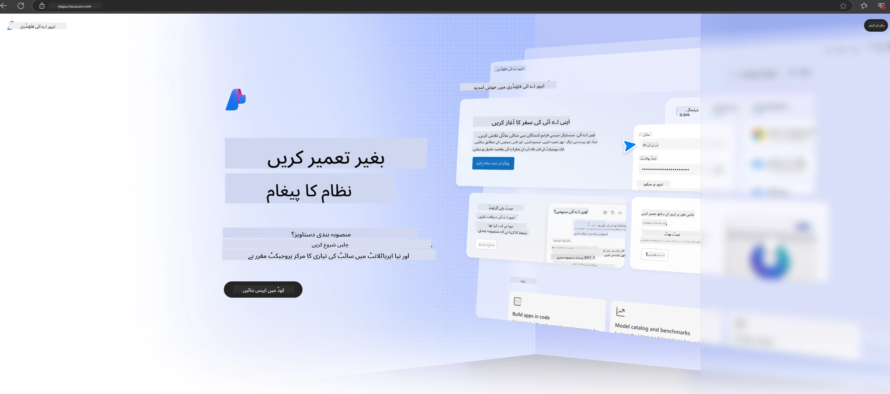

# **مائیکروسافٹ فاؤنڈری میں فی-3 کا استعمال**

جنریٹو AI کی ترقی کے ساتھ، ہم امید کرتے ہیں کہ مختلف LLM اور SLM، انٹرپرائز ڈیٹا انٹیگریشن، فائن ٹیوننگ/RAG آپریشنز، اور LLM اور SLM کو انٹیگریٹ کرنے کے بعد مختلف انٹرپرائز بزنس کی تشخیص کو منظم کرنے کے لیے ایک متحدہ پلیٹ فارم استعمال کیا جائے گا، تاکہ جنریٹو AI سمارٹ ایپلیکیشنز کو بہتر طور پر نافذ کیا جا سکے۔ [Microsoft Foundry](https://ai.azure.com) ایک انٹرپرائز سطح کا جنریٹو AI ایپلیکیشن پلیٹ فارم ہے۔

مائیکروسافٹ فاؤنڈری کے ساتھ، آپ بڑے زبان کے ماڈل (LLM) کے جوابات کی تشخیص کر سکتے ہیں اور بہتر کارکردگی کے لیے پرامپٹ فلو کے ساتھ پرامپٹ ایپلیکیشن اجزاء کی ترتیب دے سکتے ہیں۔ یہ پلیٹ فارم پروف آف کانسپٹس کو مکمل پیداواری شکل میں تبدیل کرنے کے لیے اسکیل ایبلٹی کو آسان بناتا ہے۔ مسلسل نگرانی اور بہتری طویل مدتی کامیابی کی حمایت کرتی ہے۔

ہم آسان اقدامات کے ذریعے مائیکروسافٹ فاؤنڈری پر فی-3 ماڈل کو تیزی سے تعینات کر سکتے ہیں، اور پھر مائیکروسافٹ فاؤنڈری کا استعمال کرتے ہوئے فی-3 سے متعلق پلیگراؤنڈ/چیٹ، فائن ٹیوننگ، تشخیص اور دیگر متعلقہ کام مکمل کر سکتے ہیں۔

## **1. تیاری**

اگر آپ کے پاس پہلے سے [Azure Developer CLI](https://learn.microsoft.com/azure/developer/azure-developer-cli/overview?WT.mc_id=aiml-138114-kinfeylo) انسٹالڈ ہے، تو اس ٹیمپلیٹ کا استعمال ایک نئے ڈائریکٹری میں یہ کمانڈ چلانے جتنا آسان ہے۔

## دستی تخلیق

مائیکروسافٹ فاؤنڈری میں پروجیکٹ اور حب بنانے سے آپ اپنے AI کام کو منظم اور ترتیب دے سکتے ہیں۔ شروع کرنے کے لیے یہ مرحلہ وار رہنمائی ہے:

### مائیکروسافٹ فاؤنڈری میں پروجیکٹ بنانا

1. **مائیکروسافٹ فاؤنڈری جائیں**: مائیکروسافٹ فاؤنڈری پورٹل میں لاگ ان کریں۔
2. **پروجیکٹ بنائیں**:
   - اگر آپ کسی پروجیکٹ میں ہیں، تو صفحے کے اوپر بائیں طرف "Microsoft Foundry" منتخب کریں تاکہ ہوم پیج پر جائیں۔
   - "+ Create project" منتخب کریں۔
   - پروجیکٹ کے لیے ایک نام درج کریں۔
   - اگر آپ کے پاس کوئی حب ہے، تو وہ ڈیفالٹ کے طور پر منتخب ہوگا۔ اگر آپ کے پاس ایک سے زیادہ حب تک رسائی ہے، تو آپ ڈراپ ڈاؤن سے مختلف ایک منتخب کر سکتے ہیں۔ اگر آپ نیا حب بنانا چاہتے ہیں، تو "Create new hub" منتخب کریں اور ایک نام فراہم کریں۔
   - "Create" منتخب کریں۔

### مائیکروسافٹ فاؤنڈری میں حب بنانا

1. **مائیکروسافٹ فاؤنڈری جائیں**: اپنے Azure اکاؤنٹ کے ساتھ سائن ان کریں۔
2. **حب بنائیں**:
   - بائیں مینو سے Management center منتخب کریں۔
   - "All resources" منتخب کریں، پھر "+ New project" کے نیچے تیر پر کلک کریں اور "+ New hub" منتخب کریں۔
   - "Create a new hub" ڈائیلاگ میں اپنے حب کے لیے ایک نام درج کریں (مثلاً contoso-hub) اور باقی فیلڈز اپنی مرضی کے مطابق دھاریں۔
   - "Next" منتخب کریں، معلومات کا جائزہ لیں، پھر "Create" منتخب کریں۔

مزید تفصیلی ہدایات کے لیے آپ سرکاری [Microsoft دستاویزات](https://learn.microsoft.com/azure/ai-studio/how-to/create-projects) کا حوالہ لے سکتے ہیں۔

کامیابی کے بعد، آپ نے جو اسٹوڈیو بنایا ہے اسے [ai.azure.com](https://ai.azure.com/) کے ذریعے رسائی کر سکتے ہیں۔

ایک AI Foundry پر متعدد پروجیکٹ ہو سکتے ہیں۔ AI Foundry میں پروجیکٹ بنائیں تاکہ تیاری ہو سکے۔

مائیکروسافٹ فاؤنڈری [QuickStarts](https://learn.microsoft.com/azure/ai-studio/quickstarts/get-started-code) بنائیں۔

## **2. مائیکروسافٹ فاؤنڈری میں فی ماڈل تعینات کریں**

پروجیکٹ کے Explore آپشن پر کلک کریں تاکہ Model Catalog میں داخل ہوں اور Phi-3 منتخب کریں۔

Phi-3-mini-4k-instruct منتخب کریں۔

'Deploy' پر کلک کریں تاکہ Phi-3-mini-4k-instruct ماڈل تعینات ہو جائے۔

> [!NOTE]
>
> آپ تعیناتی کے وقت کمپیوٹنگ پاور منتخب کر سکتے ہیں۔

## **3. مائیکروسافٹ فاؤنڈری میں Playground Chat Phi**

تعیناتی کے صفحے پر جائیں، Playground منتخب کریں، اور مائیکروسافٹ فاؤنڈری کے Phi-3 کے ساتھ چیٹ کریں۔

## **4. مائیکروسافٹ فاؤنڈری سے ماڈل تعینات کرنا**

Azure Model Catalog سے ماڈل تعینات کرنے کے لیے، آپ یہ مراحل انجام دے سکتے ہیں:

- مائیکروسافٹ فاؤنڈری میں لاگ ان کریں۔
- مائیکروسافٹ فاؤنڈری ماڈل کیٹلاگ سے تعینات کرنے کے لیے ماڈل منتخب کریں۔
- ماڈل کی Details صفحے پر، Deploy منتخب کریں اور پھر Serverless API with Azure AI Content Safety منتخب کریں۔
- وہ پروجیکٹ منتخب کریں جس میں آپ اپنے ماڈلز تعینات کرنا چاہتے ہیں۔ Serverless API پیشکش استعمال کرنے کے لیے، آپ کا ورک اسپیس East US 2 یا Sweden Central خطے سے ہونا چاہیے۔ آپ Deployment نام کو حسب ضرورت بنا سکتے ہیں۔
- تعیناتی وزرڈ پر، Pricing and terms منتخب کریں تاکہ قیمتوں اور استعمال کی شرائط کے بارے میں معلومات حاصل کریں۔
- Deploy منتخب کریں۔ تعیناتی کے مکمل ہونے اور آپ کے Deployments صفحے پر ریڈائریکٹ ہونے تک انتظار کریں۔
- Open in playground منتخب کریں تاکہ ماڈل کے ساتھ بات چیت شروع ہو سکے۔
- آپ Deployments صفحے پر واپس جا سکتے ہیں، تعیناتی منتخب کر سکتے ہیں، اور endpoint کا Target URL اور Secret Key نوٹ کر سکتے ہیں، جنہیں تعیناتی کو کال اور مکملات پیدا کرنے کے لیے استعمال کیا جا سکتا ہے۔
- آپ ہمیشہ Build ٹیب میں جا کر اور Components سیکشن سے Deployments منتخب کر کے endpoint کی تفصیلات، URL، اور رسائی کیز حاصل کر سکتے ہیں۔

> [!NOTE]
> براہ کرم نوٹ کریں کہ آپ کے اکاؤنٹ کے پاس Resource Group پر Azure AI Developer رول کی اجازتیں ہونی چاہئیں تاکہ یہ اقدامات انجام دیے جا سکیں۔

## **5. مائیکروسافٹ فاؤنڈری میں Phi API کا استعمال**

آپ https://{Your project name}.region.inference.ml.azure.com/swagger.json تک Postman GET کے ذریعے رسائی حاصل کر سکتے ہیں اور اسے Key کے ساتھ ملا کر فراہم کردہ انٹرفیسز کے بارے میں جان سکتے ہیں۔

آپ درخواست کے پیرامیٹرز کے ساتھ ساتھ جواب کے پیرامیٹرز بھی بہت آسانی سے حاصل کر سکتے ہیں۔

---

<!-- CO-OP TRANSLATOR DISCLAIMER START -->
**انتباہ**:
یہ دستاویز AI ترجمہ سروس [Co-op Translator](https://github.com/Azure/co-op-translator) کے ذریعے ترجمہ کی گئی ہے۔ جب کہ ہم درستگی کے لیے کوشاں ہیں، براہ کرم ذہن میں رکھیں کہ خودکار ترجموں میں غلطیاں یا نقائص ہو سکتے ہیں۔ اصل دستاویز اپنی مادری زبان میں معتبر ماخذ تصور کی جانی چاہیے۔ اہم معلومات کے لیے پیشہ ور انسانی ترجمہ تجویز کیا جاتا ہے۔ اس ترجمے کے استعمال سے پیدا ہونے والی کسی بھی غلط فہمی یا غلط تعبیر کی ذمہ داری ہم پر نہیں ہوگی۔
<!-- CO-OP TRANSLATOR DISCLAIMER END -->