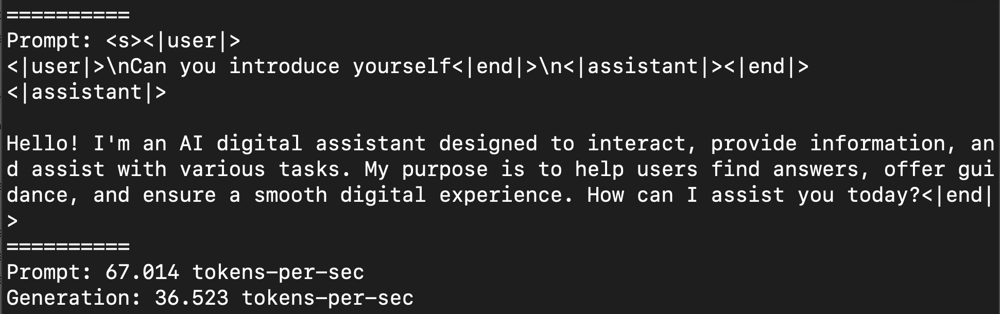
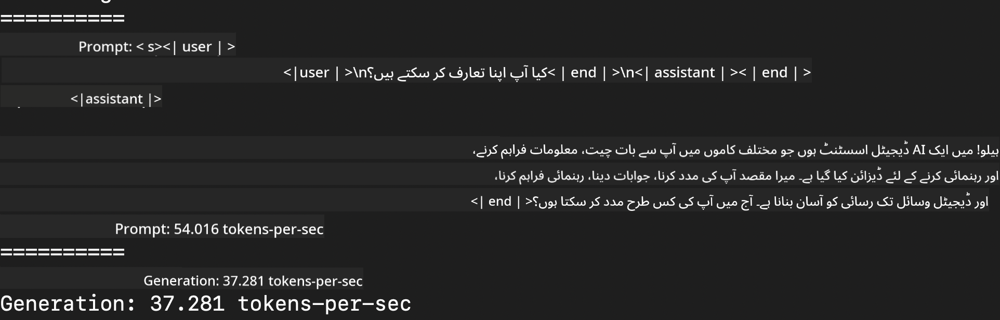
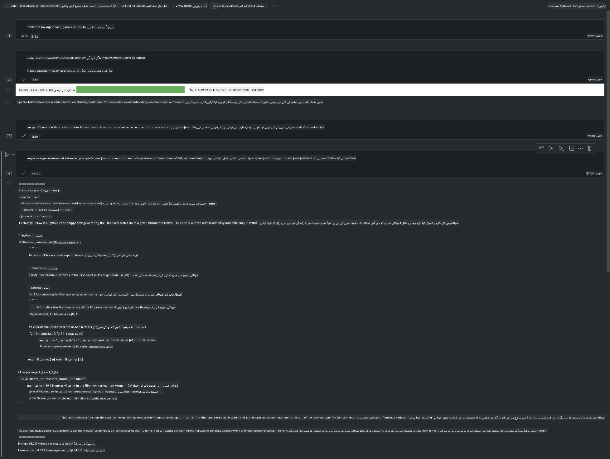

<!--
CO_OP_TRANSLATOR_METADATA:
{
  "original_hash": "700b9a537ce4426de5a7ccfa8e96e581",
  "translation_date": "2025-04-03T08:28:03+00:00",
  "source_file": "md\\03.FineTuning\\03.Inference\\MLX_Inference.md",
  "language_code": "ur"
}
-->
# **ایپل MLX فریم ورک کے ساتھ Phi-3 پر عمل کرنا**

## **MLX فریم ورک کیا ہے**

MLX ایک فریم ورک ہے جو ایپل سلیکون پر مشین لرننگ تحقیق کے لیے بنایا گیا ہے، اور یہ ایپل مشین لرننگ تحقیق کی ٹیم کی جانب سے پیش کیا گیا ہے۔

MLX خاص طور پر مشین لرننگ کے محققین کے لیے ڈیزائن کیا گیا ہے۔ یہ فریم ورک استعمال میں آسان ہونے کے ساتھ ساتھ ماڈلز کو تربیت دینے اور انہیں نافذ کرنے میں مؤثر ہے۔ فریم ورک کا ڈیزائن بھی تصوراتی طور پر سادہ ہے۔ ہمارا مقصد یہ ہے کہ محققین MLX کو آسانی سے بڑھا سکیں اور بہتر بنا سکیں تاکہ نئی خیالات کو جلدی سے پرکھا جا سکے۔

LLMs کو ایپل سلیکون ڈیوائسز میں MLX کے ذریعے تیز کیا جا سکتا ہے، اور ماڈلز کو مقامی طور پر بہت آسانی سے چلایا جا سکتا ہے۔

## **MLX کے ذریعے Phi-3-mini پر عمل کرنا**

### **1. اپنا MLX ماحول تیار کریں**

1. Python 3.11.x
2. MLX لائبریری انسٹال کریں

```bash

pip install mlx-lm

```

### **2. MLX کے ذریعے ٹرمینل میں Phi-3-mini چلانا**

```bash

python -m mlx_lm.generate --model microsoft/Phi-3-mini-4k-instruct --max-token 2048 --prompt  "<|user|>\nCan you introduce yourself<|end|>\n<|assistant|>"

```

نتیجہ (میرا ماحول ایپل M1 Max,64GB ہے) یہ ہے:



### **3. MLX کے ذریعے ٹرمینل میں Phi-3-mini کو Quantize کرنا**

```bash

python -m mlx_lm.convert --hf-path microsoft/Phi-3-mini-4k-instruct

```

***نوٹ:*** ماڈل کو mlx_lm.convert کے ذریعے quantize کیا جا سکتا ہے، اور ڈیفالٹ quantization INT4 ہے۔ یہ مثال Phi-3-mini کو INT4 میں quantize کرنے کی ہے۔

ماڈل کو mlx_lm.convert کے ذریعے quantize کیا جا سکتا ہے، اور ڈیفالٹ quantization INT4 ہے۔ اس مثال میں Phi-3-mini کو INT4 میں quantize کیا جا رہا ہے۔ Quantization کے بعد ماڈل ڈیفالٹ ڈائریکٹری ./mlx_model میں محفوظ ہو جائے گا۔

ہم ٹرمینل سے MLX کے ذریعے quantized ماڈل کو ٹیسٹ کر سکتے ہیں۔

```bash

python -m mlx_lm.generate --model ./mlx_model/ --max-token 2048 --prompt  "<|user|>\nCan you introduce yourself<|end|>\n<|assistant|>"

```

نتیجہ یہ ہے:



### **4. Jupyter Notebook میں MLX کے ساتھ Phi-3-mini چلانا**



***نوٹ:*** براہ کرم اس نمونے کو پڑھیں [اس لنک پر کلک کریں](../../../../../code/03.Inference/MLX/MLX_DEMO.ipynb)

## **وسائل**

1. ایپل MLX فریم ورک کے بارے میں جانیں [https://ml-explore.github.io](https://ml-explore.github.io/mlx/build/html/index.html)

2. ایپل MLX GitHub ریپو [https://github.com/ml-explore](https://github.com/ml-explore)

**ڈسکلیمر**:  
یہ دستاویز AI ترجمہ سروس [Co-op Translator](https://github.com/Azure/co-op-translator) کا استعمال کرتے ہوئے ترجمہ کی گئی ہے۔ ہم درستگی کی بھرپور کوشش کرتے ہیں، لیکن براہ کرم آگاہ رہیں کہ خودکار ترجمے میں غلطیاں یا عدم درستگی ہو سکتی ہیں۔ اصل دستاویز کو اس کی اصلی زبان میں مستند ذریعہ سمجھا جانا چاہیے۔ اہم معلومات کے لیے، پیشہ ور انسانی ترجمہ کی سفارش کی جاتی ہے۔ ہم اس ترجمے کے استعمال سے پیدا ہونے والے کسی بھی غلط فہمی یا غلط تشریح کے ذمہ دار نہیں ہیں۔