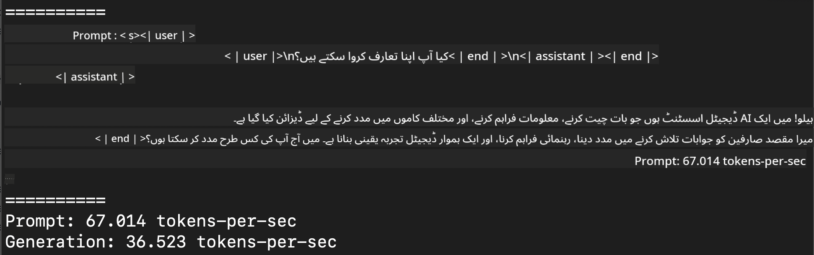
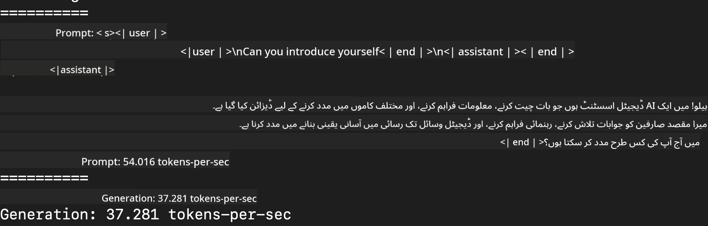
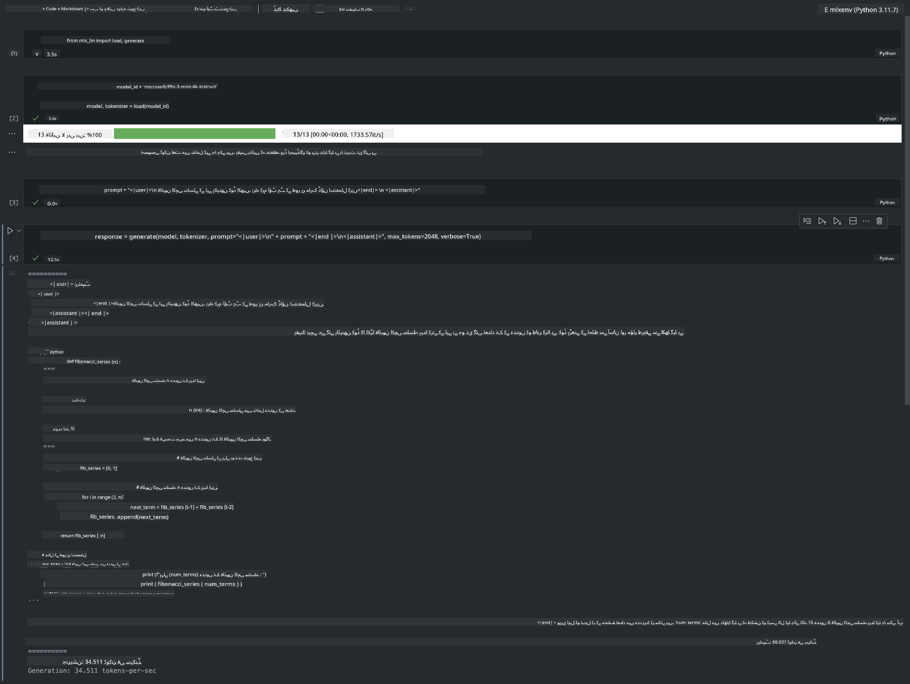

<!--
CO_OP_TRANSLATOR_METADATA:
{
  "original_hash": "dcb656f3d206fc4968e236deec5d4384",
  "translation_date": "2025-05-07T13:41:34+00:00",
  "source_file": "md/03.FineTuning/03.Inference/MLX_Inference.md",
  "language_code": "ur"
}
-->
# **Inference Phi-3 with Apple MLX Framework**

## **MLX Framework کیا ہے**

MLX ایک ارے فریم ورک ہے جو Apple سلیکون پر مشین لرننگ ریسرچ کے لیے بنایا گیا ہے، اور یہ Apple مشین لرننگ ریسرچ کی طرف سے پیش کیا گیا ہے۔

MLX کو مشین لرننگ ریسرچرز نے خاص طور پر مشین لرننگ ریسرچرز کے لیے ڈیزائن کیا ہے۔ یہ فریم ورک یوزر فرینڈلی ہے، لیکن ماڈلز کی ٹریننگ اور ڈیپلائمنٹ کے لیے موثر بھی ہے۔ فریم ورک کا ڈیزائن خود بھی تصوراتی طور پر سادہ ہے۔ ہمارا مقصد ہے کہ ریسرچرز کے لیے MLX کو آسان بنایا جائے تاکہ وہ جلدی نئے آئیڈیاز کو دریافت اور بہتر کر سکیں۔

Apple Silicon ڈیوائسز میں LLMs کو MLX کے ذریعے تیز کیا جا سکتا ہے، اور ماڈلز کو لوکل طور پر بہت آسانی سے چلایا جا سکتا ہے۔

## **MLX کا استعمال کرتے ہوئے Phi-3-mini کی Inference**

### **1. اپنا MLX ماحول سیٹ کریں**

1. Python 3.11.x  
2. MLX لائبریری انسٹال کریں

```bash

pip install mlx-lm

```

### **2. MLX کے ساتھ ٹرمینل میں Phi-3-mini چلانا**

```bash

python -m mlx_lm.generate --model microsoft/Phi-3-mini-4k-instruct --max-token 2048 --prompt  "<|user|>\nCan you introduce yourself<|end|>\n<|assistant|>"

```

نتیجہ (میرا ماحول Apple M1 Max, 64GB ہے)



### **3. ٹرمینل میں MLX کے ذریعے Phi-3-mini کی Quantization**

```bash

python -m mlx_lm.convert --hf-path microsoft/Phi-3-mini-4k-instruct

```

***Note：*** ماڈل کو mlx_lm.convert کے ذریعے quantize کیا جا سکتا ہے، اور ڈیفالٹ quantization INT4 ہے۔ اس مثال میں Phi-3-mini کو INT4 میں quantize کیا گیا ہے۔

ماڈل کو mlx_lm.convert کے ذریعے quantize کیا جا سکتا ہے، اور ڈیفالٹ quantization INT4 ہے۔ یہ مثال Phi-3-mini کو INT4 میں quantize کرنے کی ہے۔ Quantization کے بعد، ماڈل ./mlx_model کے ڈیفالٹ فولڈر میں محفوظ ہو جائے گا۔

ہم ٹرمینل سے MLX کے ذریعے quantized ماڈل کی جانچ کر سکتے ہیں۔

```bash

python -m mlx_lm.generate --model ./mlx_model/ --max-token 2048 --prompt  "<|user|>\nCan you introduce yourself<|end|>\n<|assistant|>"

```

نتیجہ یہ ہے



### **4. Jupyter Notebook میں MLX کے ساتھ Phi-3-mini چلانا**



***Note:*** براہ کرم اس سیمپل کو پڑھیں [click this link](../../../../../code/03.Inference/MLX/MLX_DEMO.ipynb)

## **وسائل**

1. Apple MLX Framework کے بارے میں جانیں [https://ml-explore.github.io](https://ml-explore.github.io/mlx/build/html/index.html)

2. Apple MLX GitHub ریپو [https://github.com/ml-explore](https://github.com/ml-explore)

**ڈس کلیمر**:  
اس دستاویز کا ترجمہ AI ترجمہ سروس [Co-op Translator](https://github.com/Azure/co-op-translator) استعمال کرتے ہوئے کیا گیا ہے۔ اگرچہ ہم درستگی کے لیے کوشاں ہیں، براہ کرم آگاہ رہیں کہ خودکار تراجم میں غلطیاں یا غیر درستیاں ہو سکتی ہیں۔ اصل دستاویز اپنی مادری زبان میں مستند ماخذ سمجھی جانی چاہیے۔ اہم معلومات کے لیے پیشہ ورانہ انسانی ترجمہ تجویز کیا جاتا ہے۔ اس ترجمے کے استعمال سے پیدا ہونے والی کسی بھی غلط فہمی یا غلط تشریح کی ذمہ داری ہم پر نہیں ہوگی۔