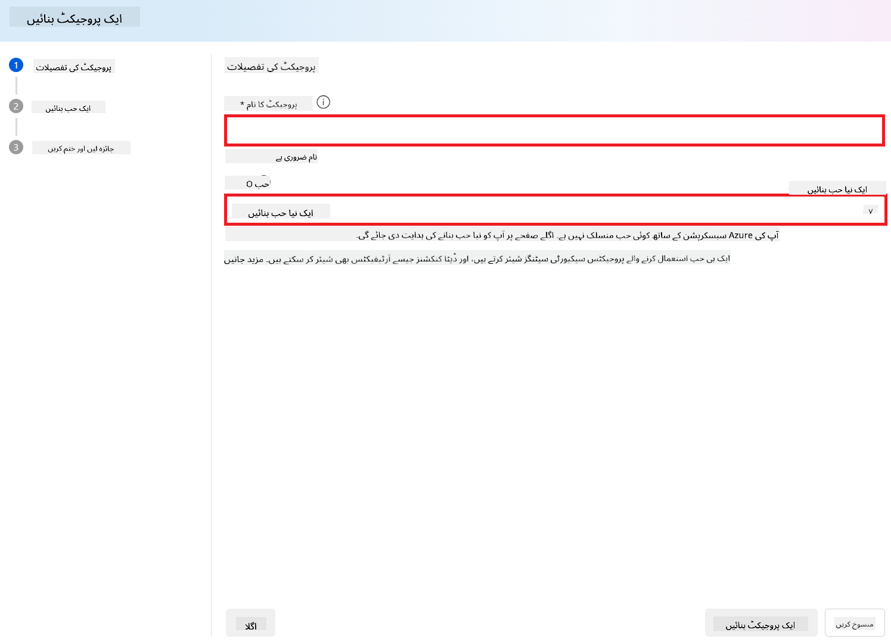
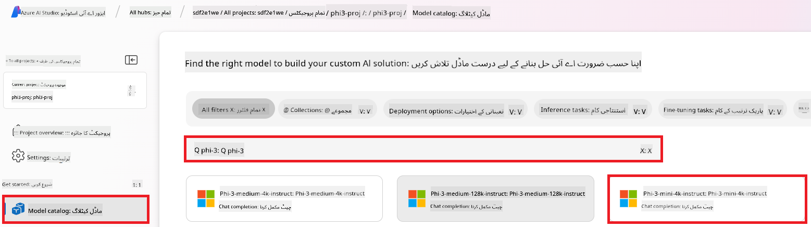
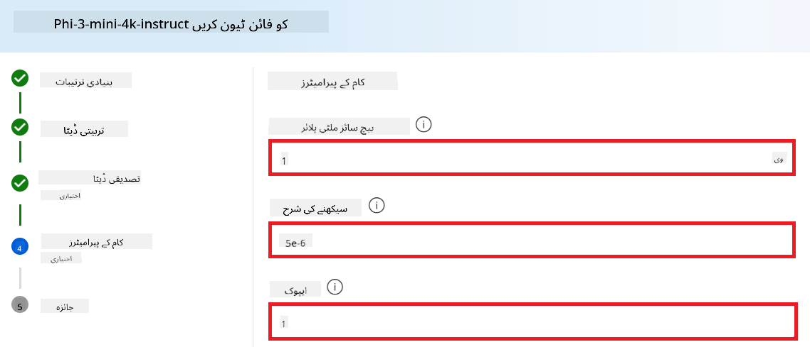

<!--
CO_OP_TRANSLATOR_METADATA:
{
  "original_hash": "c1559c5af6caccf6f623fd43a6b3a9a3",
  "translation_date": "2025-07-17T05:56:29+00:00",
  "source_file": "md/03.FineTuning/FineTuning_AIFoundry.md",
  "language_code": "ur"
}
-->
# Azure AI Foundry کے ساتھ Phi-3 کی فائن ٹیوننگ

آئیے دیکھتے ہیں کہ Microsoft کے Phi-3 Mini زبان کے ماڈل کو Azure AI Foundry کے ذریعے کیسے فائن ٹیون کیا جا سکتا ہے۔ فائن ٹیوننگ آپ کو Phi-3 Mini کو مخصوص کاموں کے لیے ڈھالنے کی اجازت دیتی ہے، جس سے یہ مزید طاقتور اور سیاق و سباق کے مطابق ہو جاتا ہے۔

## غور طلب باتیں

- **صلاحیتیں:** کون سے ماڈلز فائن ٹیون کے قابل ہیں؟ بیس ماڈل کو کس کام کے لیے فائن ٹیون کیا جا سکتا ہے؟
- **لاگت:** فائن ٹیوننگ کے لیے قیمت کا ماڈل کیا ہے؟
- **حسب ضرورت:** میں بیس ماڈل میں کتنی تبدیلی کر سکتا ہوں – اور کس طرح؟
- **آسانی:** فائن ٹیوننگ حقیقت میں کیسے ہوتی ہے – کیا مجھے کسٹم کوڈ لکھنا پڑے گا؟ کیا مجھے اپنی کمپیوٹنگ لانی ہوگی؟
- **حفاظت:** فائن ٹیون کیے گئے ماڈلز میں حفاظتی خطرات ہوتے ہیں – کیا غیر ارادی نقصان سے بچاؤ کے لیے کوئی حفاظتی اقدامات موجود ہیں؟


## فائن ٹیوننگ کی تیاری

### ضروریات

> [!NOTE]
> Phi-3 فیملی کے ماڈلز کے لیے، pay-as-you-go ماڈل فائن ٹیون کی سہولت صرف **East US 2** ریجنز میں بنائے گئے ہبز کے ساتھ دستیاب ہے۔

- ایک Azure سبسکرپشن۔ اگر آپ کے پاس Azure سبسکرپشن نہیں ہے، تو شروع کرنے کے لیے [ادائیگی والا Azure اکاؤنٹ](https://azure.microsoft.com/pricing/purchase-options/pay-as-you-go) بنائیں۔

- ایک [AI Foundry پروجیکٹ](https://ai.azure.com?WT.mc_id=aiml-138114-kinfeylo)۔
- Azure رول بیسڈ ایکسس کنٹرولز (Azure RBAC) Azure AI Foundry میں آپریشنز تک رسائی کے لیے استعمال ہوتے ہیں۔ اس آرٹیکل کے مراحل انجام دینے کے لیے، آپ کے یوزر اکاؤنٹ کو __Azure AI Developer رول__ ریسورس گروپ پر تفویض کیا جانا چاہیے۔

### سبسکرپشن پرووائیڈر رجسٹریشن

یقین دہانی کریں کہ سبسکرپشن `Microsoft.Network` ریسورس پرووائیڈر کے ساتھ رجسٹرڈ ہے۔

1. [Azure پورٹل](https://portal.azure.com) میں سائن ان کریں۔
1. بائیں مینو سے **Subscriptions** منتخب کریں۔
1. وہ سبسکرپشن منتخب کریں جو آپ استعمال کرنا چاہتے ہیں۔
1. بائیں مینو سے **AI project settings** > **Resource providers** منتخب کریں۔
1. تصدیق کریں کہ **Microsoft.Network** ریسورس پرووائیڈرز کی فہرست میں موجود ہے۔ اگر نہیں، تو اسے شامل کریں۔

### ڈیٹا کی تیاری

اپنے ماڈل کو فائن ٹیون کرنے کے لیے تربیتی اور تصدیقی ڈیٹا تیار کریں۔ آپ کے تربیتی اور تصدیقی ڈیٹا سیٹ میں ان پٹ اور آؤٹ پٹ کی مثالیں شامل ہوتی ہیں کہ آپ ماڈل سے کس طرح کا رویہ چاہتے ہیں۔

یقین دہانی کریں کہ آپ کی تمام تربیتی مثالیں انفرنس کے متوقع فارمیٹ کے مطابق ہوں۔ ماڈلز کو مؤثر طریقے سے فائن ٹیون کرنے کے لیے، متوازن اور متنوع ڈیٹا سیٹ ضروری ہے۔

اس میں ڈیٹا کا توازن برقرار رکھنا، مختلف حالات شامل کرنا، اور وقتاً فوقتاً تربیتی ڈیٹا کو حقیقی دنیا کی توقعات کے مطابق بہتر بنانا شامل ہے، جس سے ماڈل کے جوابات زیادہ درست اور متوازن ہوتے ہیں۔

مختلف ماڈل اقسام کے لیے تربیتی ڈیٹا کا فارمیٹ مختلف ہوتا ہے۔

### چیٹ کمپلیشن

آپ کے استعمال کردہ تربیتی اور تصدیقی ڈیٹا کو **JSON Lines (JSONL)** دستاویز کی شکل میں ہونا **ضروری** ہے۔ `Phi-3-mini-128k-instruct` کے لیے فائن ٹیوننگ ڈیٹا سیٹ کو چیٹ کمپلیشن API کے استعمال شدہ مکالماتی فارمیٹ میں ہونا چاہیے۔

### مثال فائل کا فارمیٹ

```json
    {"messages": [{"role": "system", "content": "You are an Xbox customer support agent whose primary goal is to help users with issues they are experiencing with their Xbox devices. You are friendly and concise. You only provide factual answers to queries, and do not provide answers that are not related to Xbox."}, {"role": "user", "content": "Is Xbox better than PlayStation?"}, {"role": "assistant", "content": "I apologize, but I cannot provide personal opinions. My primary job is to assist you with any issues related to your Xbox device. Do you have any Xbox-related issues that need addressing?"}]}
    {"messages": [{"role": "system", "content": "You are an Xbox customer support agent whose primary goal is to help users with issues they are experiencing with their Xbox devices. You are friendly and concise. You only provide factual answers to queries, and do not provide answers that are not related to Xbox."}, {"role": "user", "content": "Can I play PC games on my Xbox?"}, {"role": "assistant", "content": "While Xbox consoles don't natively support PC games, they can play an array of Xbox games, many of which are also available on PC. Can I assist you with finding games compatible with your Xbox device?"}]}
    {"messages": [{"role": "system", "content": "You are an Xbox customer support agent whose primary goal is to help users with issues they are experiencing with their Xbox devices. You are friendly and concise. You only provide factual answers to queries, and do not provide answers that are not related to Xbox."}, {"role": "user", "content": "I'm having trouble connecting my Xbox to the Wi-Fi."}, {"role": "assistant", "content": "No worries, let's go through the network settings on your Xbox. Can you please tell me what happens when you try to connect it to the Wi-Fi?"}]}
```

سپورٹ شدہ فائل کی قسم JSON Lines ہے۔ فائلیں ڈیفالٹ ڈیٹا اسٹور پر اپلوڈ کی جاتی ہیں اور آپ کے پروجیکٹ میں دستیاب ہوتی ہیں۔

## Azure AI Foundry کے ساتھ Phi-3 کی فائن ٹیوننگ

Azure AI Foundry آپ کو بڑے زبان کے ماڈلز کو اپنی ذاتی ڈیٹا سیٹس کے مطابق ڈھالنے کی سہولت دیتا ہے جسے فائن ٹیوننگ کہا جاتا ہے۔ فائن ٹیوننگ خاص کاموں اور ایپلیکیشنز کے لیے تخصیص اور بہتر کاری کی اجازت دے کر نمایاں فائدہ فراہم کرتی ہے۔ اس سے کارکردگی میں بہتری، لاگت کی بچت، تاخیر میں کمی، اور مخصوص نتائج حاصل ہوتے ہیں۔


### نیا پروجیکٹ بنائیں

1. [Azure AI Foundry](https://ai.azure.com) میں سائن ان کریں۔

1. Azure AI Foundry میں نیا پروجیکٹ بنانے کے لیے **+New project** منتخب کریں۔

    

1. درج ذیل کام انجام دیں:

    - پروجیکٹ کا **Hub name** درج کریں۔ یہ منفرد ہونا چاہیے۔
    - استعمال کے لیے **Hub** منتخب کریں (ضرورت ہو تو نیا بنائیں)۔

    

1. نیا ہب بنانے کے لیے درج ذیل کریں:

    - **Hub name** درج کریں۔ یہ منفرد ہونا چاہیے۔
    - اپنی Azure **Subscription** منتخب کریں۔
    - استعمال کے لیے **Resource group** منتخب کریں (ضرورت ہو تو نیا بنائیں)۔
    - استعمال کے لیے **Location** منتخب کریں۔
    - استعمال کے لیے **Connect Azure AI Services** منتخب کریں (ضرورت ہو تو نیا بنائیں)۔
    - **Connect Azure AI Search** کے لیے **Skip connecting** منتخب کریں۔

    

1. **Next** منتخب کریں۔
1. **Create a project** منتخب کریں۔

### ڈیٹا کی تیاری

فائن ٹیوننگ سے پہلے، اپنے کام سے متعلق ڈیٹا سیٹ جمع کریں یا بنائیں، جیسے چیٹ ہدایات، سوال و جواب کے جوڑے، یا کوئی اور متعلقہ متن۔ اس ڈیٹا کو صاف کریں، شور کو ہٹائیں، گمشدہ اقدار کو سنبھالیں، اور متن کو ٹوکنائز کریں۔

### Azure AI Foundry میں Phi-3 ماڈلز کی فائن ٹیوننگ

> [!NOTE]
> Phi-3 ماڈلز کی فائن ٹیوننگ فی الحال صرف East US 2 میں موجود پروجیکٹس میں سپورٹ کی جاتی ہے۔

1. بائیں جانب کے ٹیب سے **Model catalog** منتخب کریں۔

1. **search bar** میں *phi-3* ٹائپ کریں اور وہ phi-3 ماڈل منتخب کریں جسے آپ استعمال کرنا چاہتے ہیں۔

    

1. **Fine-tune** منتخب کریں۔

    

1. **Fine-tuned model name** درج کریں۔

    

1. **Next** منتخب کریں۔

1. درج ذیل کریں:

    - **task type** کو **Chat completion** منتخب کریں۔
    - وہ **Training data** منتخب کریں جو آپ استعمال کرنا چاہتے ہیں۔ آپ اسے Azure AI Foundry کے ڈیٹا سے یا اپنی لوکل مشین سے اپلوڈ کر سکتے ہیں۔

    

1. **Next** منتخب کریں۔

1. وہ **Validation data** اپلوڈ کریں جو آپ استعمال کرنا چاہتے ہیں، یا **Automatic split of training data** منتخب کریں۔

    

1. **Next** منتخب کریں۔

1. درج ذیل کریں:

    - استعمال کے لیے **Batch size multiplier** منتخب کریں۔
    - استعمال کے لیے **Learning rate** منتخب کریں۔
    - استعمال کے لیے **Epochs** منتخب کریں۔

    

1. فائن ٹیوننگ شروع کرنے کے لیے **Submit** منتخب کریں۔

    

1. جب آپ کا ماڈل فائن ٹیون ہو جائے گا، تو اس کی حالت **Completed** دکھائی جائے گی، جیسا کہ نیچے تصویر میں ہے۔ اب آپ ماڈل کو تعینات کر سکتے ہیں اور اسے اپنی ایپلیکیشن، پلے گراؤنڈ، یا پرامپٹ فلو میں استعمال کر سکتے ہیں۔ مزید معلومات کے لیے دیکھیں [How to deploy Phi-3 family of small language models with Azure AI Foundry](https://learn.microsoft.com/azure/ai-studio/how-to/deploy-models-phi-3?tabs=phi-3-5&pivots=programming-language-python)۔

    

> [!NOTE]
> Phi-3 کی فائن ٹیوننگ کے بارے میں مزید تفصیلی معلومات کے لیے ملاحظہ کریں [Fine-tune Phi-3 models in Azure AI Foundry](https://learn.microsoft.com/azure/ai-studio/how-to/fine-tune-phi-3?tabs=phi-3-mini)۔

## اپنے فائن ٹیون کیے گئے ماڈلز کی صفائی

آپ [Azure AI Foundry](https://ai.azure.com) میں فائن ٹیوننگ ماڈل کی فہرست سے یا ماڈل کی تفصیلات کے صفحے سے فائن ٹیون کیا ہوا ماڈل حذف کر سکتے ہیں۔ فائن ٹیوننگ صفحے سے حذف کرنے کے لیے ماڈل منتخب کریں، پھر حذف کرنے کے لیے Delete بٹن دبائیں۔

> [!NOTE]
> اگر آپ کے کسٹم ماڈل کی تعیناتی موجود ہے تو آپ اسے حذف نہیں کر سکتے۔ پہلے ماڈل کی تعیناتی حذف کریں، پھر کسٹم ماڈل کو حذف کریں۔

## لاگت اور کوٹہ

### Phi-3 ماڈلز کی فائن ٹیوننگ بطور سروس کے لیے لاگت اور کوٹہ کے پہلو

Phi ماڈلز جو بطور سروس فائن ٹیون کیے جاتے ہیں، Microsoft کی طرف سے فراہم کیے جاتے ہیں اور Azure AI Foundry کے ساتھ مربوط ہیں۔ آپ قیمت [deploying](https://learn.microsoft.com/azure/ai-studio/how-to/deploy-models-phi-3?tabs=phi-3-5&pivots=programming-language-python) یا فائن ٹیوننگ کے دوران deployment wizard کے Pricing and terms ٹیب میں دیکھ سکتے ہیں۔

## مواد کی فلٹرنگ

pay-as-you-go سروس کے طور پر تعینات ماڈلز Azure AI Content Safety کے ذریعے محفوظ کیے جاتے ہیں۔ جب انہیں ریئل ٹائم اینڈ پوائنٹس پر تعینات کیا جاتا ہے، تو آپ اس صلاحیت سے انکار کر سکتے ہیں۔ Azure AI Content Safety فعال ہونے پر، پرامپٹ اور کمپلیشن دونوں ایک ایسے کلاسیفیکیشن ماڈلز کے مجموعے سے گزرتے ہیں جو نقصان دہ مواد کی نشاندہی اور روک تھام کے لیے کام کرتے ہیں۔ مواد کی فلٹرنگ کا نظام ان پٹ پرامپٹس اور آؤٹ پٹ کمپلیشنز میں ممکنہ نقصان دہ مواد کی مخصوص اقسام کا پتہ لگا کر کارروائی کرتا ہے۔ مزید جانیں [Azure AI Content Safety](https://learn.microsoft.com/azure/ai-studio/concepts/content-filtering)۔

**فائن ٹیوننگ کی ترتیب**

ہائپر پیرامیٹرز: جیسے learning rate، batch size، اور training epochs کی تعداد متعین کریں۔

**لوس فنکشن**

اپنے کام کے لیے مناسب لوس فنکشن منتخب کریں (مثلاً cross-entropy)۔

**آپٹیمائزر**

ٹریننگ کے دوران gradient اپڈیٹس کے لیے آپٹیمائزر منتخب کریں (مثلاً Adam)۔

**فائن ٹیوننگ کا عمل**

- پری ٹرینڈ ماڈل لوڈ کریں: Phi-3 Mini چیک پوائنٹ لوڈ کریں۔
- کسٹم لیئرز شامل کریں: کام مخصوص لیئرز شامل کریں (مثلاً چیٹ ہدایات کے لیے classification head)۔

**ماڈل کی تربیت**

اپنے تیار کردہ ڈیٹا سیٹ کے ساتھ ماڈل کو فائن ٹیون کریں۔ تربیت کی پیش رفت پر نظر رکھیں اور ضرورت کے مطابق ہائپر پیرامیٹرز کو ایڈجسٹ کریں۔

**تشخیص اور تصدیق**

تصدیقی سیٹ: اپنے ڈیٹا کو تربیتی اور تصدیقی سیٹ میں تقسیم کریں۔

**کارکردگی کا جائزہ**

ماڈل کی کارکردگی جانچنے کے لیے accuracy، F1-score، یا perplexity جیسے میٹرکس استعمال کریں۔

## فائن ٹیون کیا ہوا ماڈل محفوظ کریں

**چیک پوائنٹ**

مستقبل میں استعمال کے لیے فائن ٹیون کیا ہوا ماڈل چیک پوائنٹ محفوظ کریں۔

## تعیناتی

- ویب سروس کے طور پر تعینات کریں: اپنے فائن ٹیون کیے ہوئے ماڈل کو Azure AI Foundry میں ویب سروس کے طور پر تعینات کریں۔
- اینڈ پوائنٹ کی جانچ کریں: تعینات اینڈ پوائنٹ کو ٹیسٹ کرنے کے لیے سوالات بھیجیں تاکہ اس کی فعالیت کی تصدیق ہو سکے۔

## دہرائیں اور بہتر کریں

دہرائیں: اگر کارکردگی تسلی بخش نہیں ہے، تو ہائپر پیرامیٹرز کو ایڈجسٹ کریں، مزید ڈیٹا شامل کریں، یا اضافی epochs کے لیے فائن ٹیون کریں۔

## نگرانی اور بہتری

مسلسل ماڈل کے رویے کی نگرانی کریں اور ضرورت کے مطابق اسے بہتر بنائیں۔

## تخصیص اور توسیع

کسٹم کام: Phi-3 Mini کو چیٹ ہدایات سے آگے مختلف کاموں کے لیے فائن ٹیون کیا جا سکتا ہے۔ دیگر استعمال کے کیسز دریافت کریں!
تجربہ کریں: کارکردگی بڑھانے کے لیے مختلف آرکیٹیکچرز، لیئرز کے امتزاج، اور تکنیک آزما کر دیکھیں۔

> [!NOTE]
> فائن ٹیوننگ ایک تکراری عمل ہے۔ تجربہ کریں، سیکھیں، اور اپنے ماڈل کو اپنے مخصوص کام کے لیے بہترین نتائج حاصل کرنے کے لیے ڈھالیں!

**دستخطی نوٹ**:  
یہ دستاویز AI ترجمہ سروس [Co-op Translator](https://github.com/Azure/co-op-translator) کے ذریعے ترجمہ کی گئی ہے۔ اگرچہ ہم درستگی کے لیے کوشاں ہیں، براہ کرم آگاہ رہیں کہ خودکار ترجمے میں غلطیاں یا عدم درستیاں ہو سکتی ہیں۔ اصل دستاویز اپنی مادری زبان میں ہی معتبر ماخذ سمجھی جانی چاہیے۔ اہم معلومات کے لیے پیشہ ور انسانی ترجمہ کی سفارش کی جاتی ہے۔ اس ترجمے کے استعمال سے پیدا ہونے والی کسی بھی غلط فہمی یا غلط تشریح کی ذمہ داری ہم پر عائد نہیں ہوتی۔