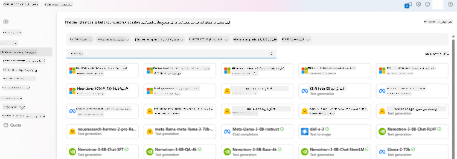
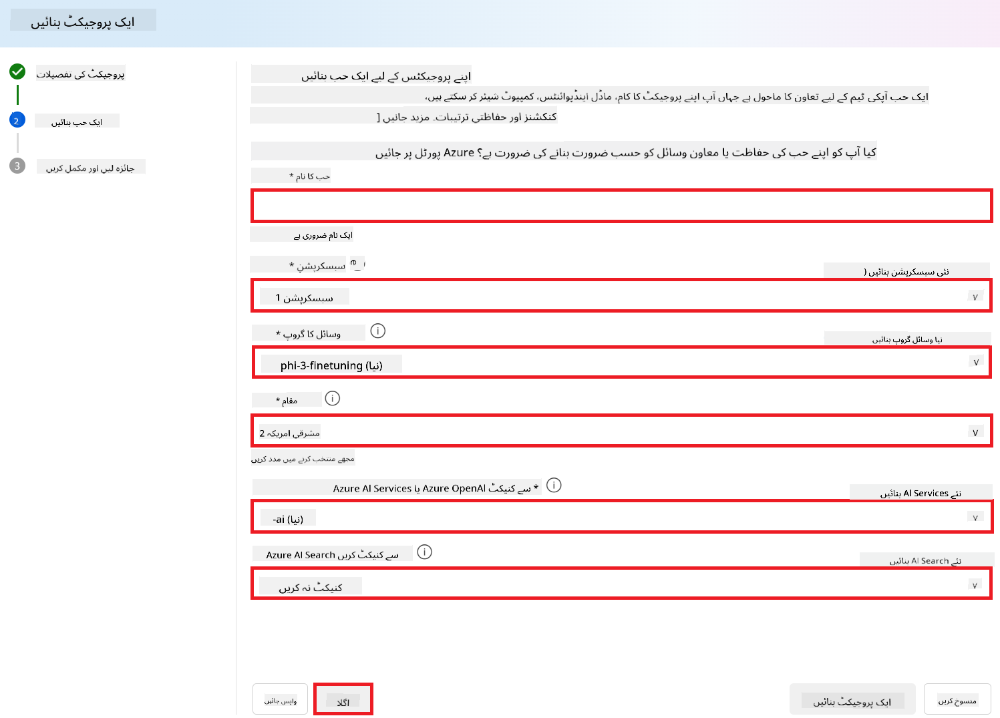
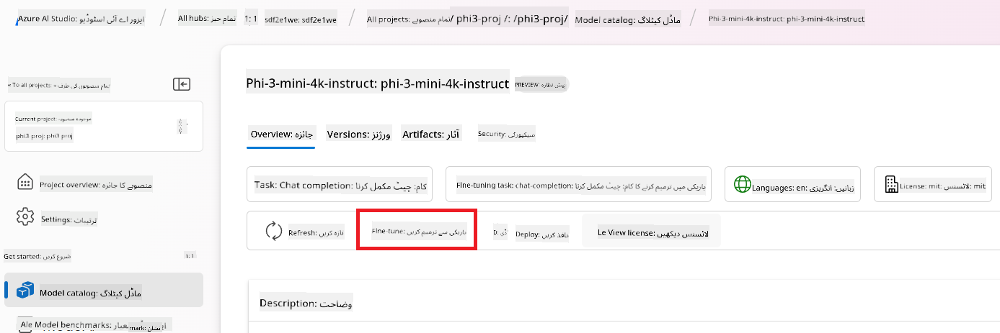
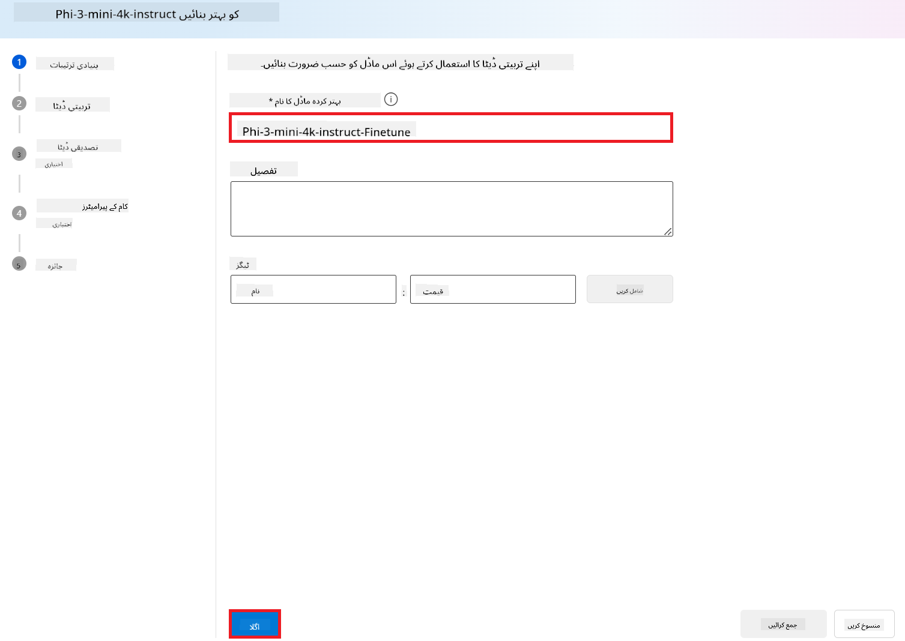
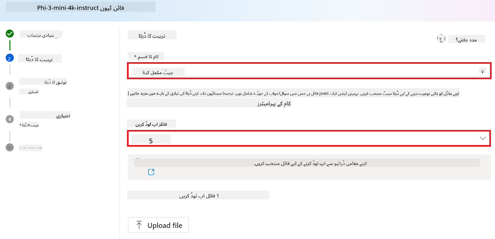
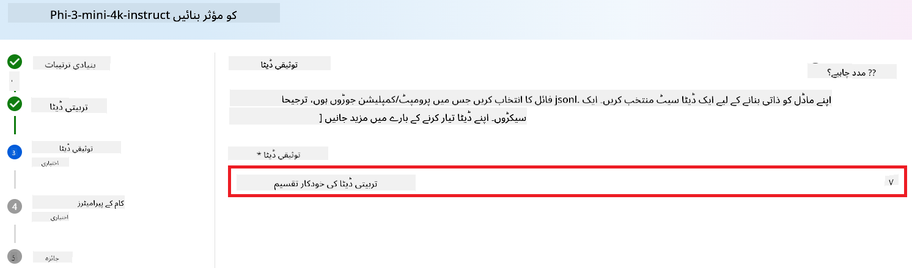
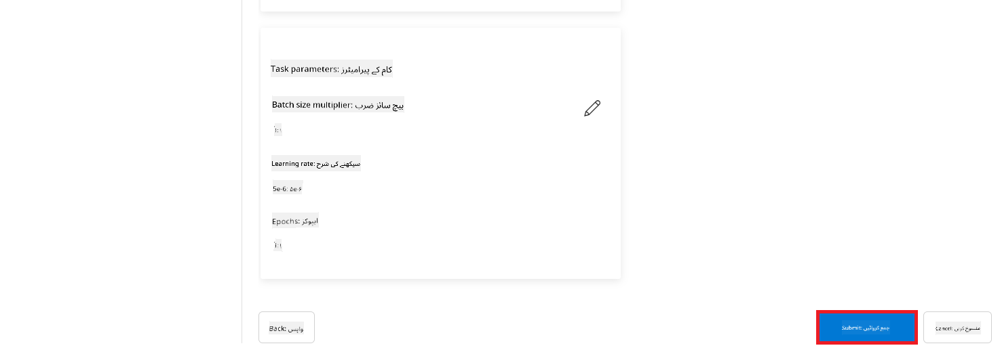
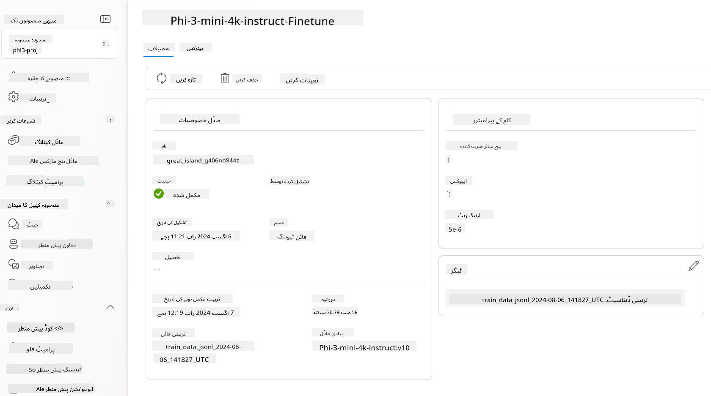

<!--
CO_OP_TRANSLATOR_METADATA:
{
  "original_hash": "94e7d7ab455720bab75ead5c28521c97",
  "translation_date": "2025-04-03T08:01:38+00:00",
  "source_file": "md\\03.FineTuning\\FineTuning_AIFoundry.md",
  "language_code": "ur"
}
-->
# Azure AI Foundry کے ساتھ Phi-3 کو فائن ٹیون کرنا

آئیے Microsoft کے Phi-3 Mini لینگویج ماڈل کو Azure AI Foundry کے ذریعے فائن ٹیون کرنے کا طریقہ دریافت کرتے ہیں۔ فائن ٹیوننگ آپ کو Phi-3 Mini کو مخصوص کاموں کے مطابق ڈھالنے کی اجازت دیتی ہے، جس سے یہ زیادہ طاقتور اور سیاق و سباق سے آگاہ ہو جاتا ہے۔

## غور و فکر

- **صلاحیتیں:** کون سے ماڈلز کو فائن ٹیون کیا جا سکتا ہے؟ بیس ماڈل کو کس کام کے لیے فائن ٹیون کیا جا سکتا ہے؟
- **لاگت:** فائن ٹیوننگ کے لیے قیمت کا ماڈل کیا ہے؟
- **حسب ضرورت:** میں بیس ماڈل کو کس حد تک اور کس طریقے سے تبدیل کر سکتا ہوں؟
- **آسانی:** فائن ٹیوننگ کیسے کی جاتی ہے – کیا مجھے کسٹم کوڈ لکھنے کی ضرورت ہے؟ کیا مجھے اپنی کمپیوٹ لانی ہوگی؟
- **محفوظیت:** فائن ٹیون ماڈلز میں سیفٹی کے خطرات ہو سکتے ہیں – کیا غیر ارادی نقصان سے بچانے کے لیے کوئی حفاظتی اقدامات موجود ہیں؟



## فائن ٹیوننگ کی تیاری

### شرائط

> [!NOTE]
> Phi-3 فیملی ماڈلز کے لیے، پے ایز یو گو ماڈل فائن ٹیون کی پیشکش صرف **East US 2** ریجنز میں بنائے گئے ہبز کے ساتھ دستیاب ہے۔

- ایک Azure سبسکرپشن۔ اگر آپ کے پاس Azure سبسکرپشن نہیں ہے تو ایک [پری پیڈ Azure اکاؤنٹ](https://azure.microsoft.com/pricing/purchase-options/pay-as-you-go) بنائیں۔

- ایک [AI Foundry پروجیکٹ](https://ai.azure.com?WT.mc_id=aiml-138114-kinfeylo)۔
- Azure رول بیسڈ ایکسیس کنٹرولز (Azure RBAC) کو Azure AI Foundry میں آپریشنز تک رسائی دینے کے لیے استعمال کیا جاتا ہے۔ اس آرٹیکل کے اقدامات انجام دینے کے لیے، آپ کے یوزر اکاؤنٹ کو __Azure AI Developer رول__ کے ساتھ ریسورس گروپ پر تفویض کیا جانا چاہیے۔

### سبسکرپشن پرووائیڈر رجسٹریشن

یقینی بنائیں کہ سبسکرپشن `Microsoft.Network` ریسورس پرووائیڈر کے لیے رجسٹرڈ ہے۔

1. [Azure پورٹل](https://portal.azure.com) میں سائن ان کریں۔
1. بائیں مینو سے **سبسکرپشنز** منتخب کریں۔
1. وہ سبسکرپشن منتخب کریں جسے آپ استعمال کرنا چاہتے ہیں۔
1. بائیں مینو سے **AI پروجیکٹ سیٹنگز** > **ریسورس پرووائیڈرز** منتخب کریں۔
1. تصدیق کریں کہ **Microsoft.Network** ریسورس پرووائیڈرز کی فہرست میں موجود ہے۔ بصورت دیگر، اسے شامل کریں۔

### ڈیٹا کی تیاری

اپنے ماڈل کو فائن ٹیون کرنے کے لیے اپنے ٹریننگ اور ویلیڈیشن ڈیٹا کو تیار کریں۔ آپ کے ٹریننگ ڈیٹا اور ویلیڈیشن ڈیٹا سیٹس ان پٹ اور آؤٹ پٹ مثالوں پر مشتمل ہوتے ہیں جن سے آپ چاہتے ہیں کہ ماڈل کارکردگی دکھائے۔

یقینی بنائیں کہ آپ کی تمام ٹریننگ مثالیں انفرینس کے متوقع فارمیٹ کی پیروی کرتی ہیں۔ ماڈلز کو مؤثر طریقے سے فائن ٹیون کرنے کے لیے، ایک متوازن اور متنوع ڈیٹا سیٹ کو یقینی بنائیں۔

یہ ڈیٹا کے توازن کو برقرار رکھنے، مختلف منظرناموں کو شامل کرنے، اور وقتاً فوقتاً ٹریننگ ڈیٹا کو حقیقی دنیا کی توقعات کے مطابق ترتیب دینے پر مشتمل ہوتا ہے، جو بالآخر زیادہ درست اور متوازن ماڈل جوابات کی طرف لے جاتا ہے۔

مختلف ماڈل اقسام مختلف فارمیٹ کے ٹریننگ ڈیٹا کی ضرورت رکھتے ہیں۔

### چیٹ کمپلیشن

آپ کے ٹریننگ اور ویلیڈیشن ڈیٹا کو **ضروری ہے** کہ JSON Lines (JSONL) دستاویز کے طور پر فارمیٹ کیا گیا ہو۔ `Phi-3-mini-128k-instruct` کے لیے، فائن ٹیوننگ ڈیٹا سیٹ کو وہی بات چیت کا فارمیٹ استعمال کرنا ہوگا جو چیٹ کمپلیشنز API کے ذریعے استعمال ہوتا ہے۔

### فائل فارمیٹ کی مثال

```json
    {"messages": [{"role": "system", "content": "You are an Xbox customer support agent whose primary goal is to help users with issues they are experiencing with their Xbox devices. You are friendly and concise. You only provide factual answers to queries, and do not provide answers that are not related to Xbox."}, {"role": "user", "content": "Is Xbox better than PlayStation?"}, {"role": "assistant", "content": "I apologize, but I cannot provide personal opinions. My primary job is to assist you with any issues related to your Xbox device. Do you have any Xbox-related issues that need addressing?"}]}
    {"messages": [{"role": "system", "content": "You are an Xbox customer support agent whose primary goal is to help users with issues they are experiencing with their Xbox devices. You are friendly and concise. You only provide factual answers to queries, and do not provide answers that are not related to Xbox."}, {"role": "user", "content": "Can I play PC games on my Xbox?"}, {"role": "assistant", "content": "While Xbox consoles don't natively support PC games, they can play an array of Xbox games, many of which are also available on PC. Can I assist you with finding games compatible with your Xbox device?"}]}
    {"messages": [{"role": "system", "content": "You are an Xbox customer support agent whose primary goal is to help users with issues they are experiencing with their Xbox devices. You are friendly and concise. You only provide factual answers to queries, and do not provide answers that are not related to Xbox."}, {"role": "user", "content": "I'm having trouble connecting my Xbox to the Wi-Fi."}, {"role": "assistant", "content": "No worries, let's go through the network settings on your Xbox. Can you please tell me what happens when you try to connect it to the Wi-Fi?"}]}
```

سپوٹڈ فائل ٹائپ JSON Lines ہے۔ فائلز کو ڈیفالٹ ڈیٹا اسٹور پر اپلوڈ کیا جاتا ہے اور آپ کے پروجیکٹ میں دستیاب کر دیا جاتا ہے۔

## Azure AI Foundry کے ساتھ Phi-3 کو فائن ٹیون کرنا

Azure AI Foundry آپ کو بڑے لینگویج ماڈلز کو آپ کے ذاتی ڈیٹا سیٹس کے مطابق ڈھالنے کی اجازت دیتا ہے، جسے فائن ٹیوننگ کہا جاتا ہے۔ فائن ٹیوننگ اہم قدر فراہم کرتا ہے کیونکہ یہ مخصوص کاموں اور ایپلیکیشنز کے لیے تخصیص اور اصلاح کو ممکن بناتا ہے۔ یہ بہتر کارکردگی، لاگت کی کارکردگی، کم تاخیر، اور حسب ضرورت آؤٹ پٹس کی طرف لے جاتا ہے۔


### نیا پروجیکٹ بنائیں

1. [Azure AI Foundry](https://ai.azure.com) میں سائن ان کریں۔

1. نیا پروجیکٹ بنانے کے لیے **+New project** منتخب کریں۔

    

1. درج ذیل کام انجام دیں:

    - پروجیکٹ کا **Hub name**۔ یہ ایک منفرد ویلیو ہونی چاہیے۔
    - استعمال کے لیے **Hub** منتخب کریں (ضرورت ہو تو نیا بنائیں)۔

    

1. نیا ہب بنانے کے لیے درج ذیل کام انجام دیں:

    - **Hub name** درج کریں۔ یہ ایک منفرد ویلیو ہونی چاہیے۔
    - اپنی Azure **Subscription** منتخب کریں۔
    - استعمال کے لیے **Resource group** منتخب کریں (ضرورت ہو تو نیا بنائیں)۔
    - وہ **Location** منتخب کریں جسے آپ استعمال کرنا چاہتے ہیں۔
    - استعمال کے لیے **Connect Azure AI Services** منتخب کریں (ضرورت ہو تو نیا بنائیں)۔
    - **Connect Azure AI Search** کو **Skip connecting** منتخب کریں۔

    

1. **Next** منتخب کریں۔
1. **Create a project** منتخب کریں۔

### ڈیٹا کی تیاری

فائن ٹیوننگ سے پہلے، اپنے کام سے متعلق ایک ڈیٹا سیٹ جمع کریں یا بنائیں، جیسے چیٹ انسٹرکشنز، سوال و جواب کے جوڑے، یا کوئی اور متعلقہ ٹیکسٹ ڈیٹا۔ اس ڈیٹا کو صاف کریں اور پہلے سے پروسیس کریں تاکہ شور کو ہٹایا جا سکے، گمشدہ ویلیوز کو ہینڈل کیا جا سکے، اور ٹیکسٹ کو ٹوکنائز کیا جا سکے۔

### Azure AI Foundry میں Phi-3 ماڈلز کو فائن ٹیون کریں

> [!NOTE]
> Phi-3 ماڈلز کی فائن ٹیوننگ اس وقت صرف East US 2 میں موجود پروجیکٹس میں سپورٹ کی جاتی ہے۔

1. بائیں طرف کے ٹیب سے **Model catalog** منتخب کریں۔

1. **سرچ بار** میں *phi-3* ٹائپ کریں اور وہ phi-3 ماڈل منتخب کریں جسے آپ استعمال کرنا چاہتے ہیں۔

    

1. **Fine-tune** منتخب کریں۔

    

1. **Fine-tuned model name** درج کریں۔

    

1. **Next** منتخب کریں۔

1. درج ذیل کام انجام دیں:

    - **Task type** کو **Chat completion** پر سیٹ کریں۔
    - وہ **Training data** منتخب کریں جسے آپ استعمال کرنا چاہتے ہیں۔ آپ اسے Azure AI Foundry کے ڈیٹا کے ذریعے یا اپنے مقامی ماحول سے اپلوڈ کر سکتے ہیں۔

    

1. **Next** منتخب کریں۔

1. وہ **Validation data** اپلوڈ کریں جسے آپ استعمال کرنا چاہتے ہیں، یا آپ **Automatic split of training data** منتخب کر سکتے ہیں۔

    

1. **Next** منتخب کریں۔

1. درج ذیل کام انجام دیں:

    - وہ **Batch size multiplier** منتخب کریں جسے آپ استعمال کرنا چاہتے ہیں۔
    - وہ **Learning rate** منتخب کریں جسے آپ استعمال کرنا چاہتے ہیں۔
    - وہ **Epochs** منتخب کریں جسے آپ استعمال کرنا چاہتے ہیں۔

    

1. فائن ٹیوننگ پروسیس شروع کرنے کے لیے **Submit** منتخب کریں۔

    

1. ایک بار جب آپ کا ماڈل فائن ٹیون ہو جائے تو اس کی اسٹیٹس **Completed** کے طور پر ظاہر ہوگی، جیسا کہ نیچے دی گئی تصویر میں دکھایا گیا ہے۔ اب آپ ماڈل کو ڈپلائے کر سکتے ہیں اور اسے اپنی ایپلیکیشن، پلے گراؤنڈ، یا پرامپٹ فلو میں استعمال کر سکتے ہیں۔ مزید معلومات کے لیے، دیکھیں [Azure AI Foundry کے ساتھ Phi-3 فیملی کے چھوٹے لینگویج ماڈلز کو کیسے ڈپلائے کریں](https://learn.microsoft.com/azure/ai-studio/how-to/deploy-models-phi-3?tabs=phi-3-5&pivots=programming-language-python)۔

    

> [!NOTE]
> Phi-3 کو فائن ٹیون کرنے کے بارے میں مزید تفصیلی معلومات کے لیے، براہ کرم ملاحظہ کریں [Azure AI Foundry میں Phi-3 ماڈلز کو فائن ٹیون کریں](https://learn.microsoft.com/azure/ai-studio/how-to/fine-tune-phi-3?tabs=phi-3-mini)۔

## اپنے فائن ٹیون ماڈلز کو صاف کرنا

آپ [Azure AI Foundry](https://ai.azure.com) میں فائن ٹیون ماڈل کی فہرست سے یا ماڈل کی تفصیلات کے صفحے سے فائن ٹیون ماڈل کو حذف کر سکتے ہیں۔ فائن ٹیوننگ صفحے سے حذف کرنے کے لیے فائن ٹیون ماڈل کو منتخب کریں، پھر حذف کرنے کے بٹن کو منتخب کریں۔

> [!NOTE]
> آپ کسی کسٹم ماڈل کو حذف نہیں کر سکتے اگر اس کی کوئی موجودہ ڈپلائے منسلک ہو۔ آپ کو پہلے اپنے ماڈل کی ڈپلائے کو حذف کرنا ہوگا۔

## لاگت اور کوٹہ

### Phi-3 ماڈلز کے لیے لاگت اور کوٹہ کے غور و فکر

Phi ماڈلز کو بطور سروس فائن ٹیون کیا جاتا ہے اور Azure AI Foundry کے ساتھ مربوط کیا جاتا ہے۔ آپ قیمت کو [ڈپلائے کرتے وقت](https://learn.microsoft.com/azure/ai-studio/how-to/deploy-models-phi-3?tabs=phi-3-5&pivots=programming-language-python) یا ماڈلز کو فائن ٹیون کرتے وقت ڈپلائے منٹ وزارڈ کے Pricing and terms ٹیب کے تحت دیکھ سکتے ہیں۔

## مواد کی فلٹرنگ

بطور سروس ڈپلائے کیے گئے ماڈلز کو Azure AI Content Safety کے ذریعے محفوظ کیا جاتا ہے۔ جب ریئل ٹائم اینڈ پوائنٹس پر ڈپلائے کیا جاتا ہے، تو آپ اس صلاحیت سے باہر نکلنے کا انتخاب کر سکتے ہیں۔ Azure AI Content Safety فعال ہونے کے ساتھ، پرامپٹ اور کمپلیشن دونوں نقصان دہ مواد کی نشاندہی اور روک تھام کے لیے ماڈلز کے ایک مجموعے سے گزرتے ہیں۔ مواد کی فلٹرنگ سسٹم ان پٹ پرامپٹس اور آؤٹ پٹ کمپلیشنز میں ممکنہ طور پر نقصان دہ مواد کے مخصوص زمرے کی نشاندہی اور کارروائی کرتا ہے۔ مزید جاننے کے لیے دیکھیں [Azure AI Content Safety](https://learn.microsoft.com/azure/ai-studio/concepts/content-filtering)۔

**فائن ٹیوننگ کی ترتیب**

ہائپرپیرامیٹرز: سیکھنے کی شرح، بیچ سائز، اور ٹریننگ ایپوک کی تعداد جیسے ہائپرپیرامیٹرز کی وضاحت کریں۔

**لاس فنکشن**

اپنے کام کے لیے ایک مناسب لاس فنکشن منتخب کریں (مثال کے طور پر، کراس اینٹروپی)۔

**آپٹیمائزر**

ٹریننگ کے دوران گریڈینٹ اپ ڈیٹس کے لیے ایک آپٹیمائزر منتخب کریں (مثال کے طور پر، ایڈم)۔

**فائن ٹیوننگ کا عمل**

- پری ٹرین ماڈل لوڈ کریں: Phi-3 Mini چیک پوائنٹ لوڈ کریں۔
- کسٹم لیئرز شامل کریں: کام کے مخصوص لیئرز شامل کریں (مثال کے طور پر، چیٹ انسٹرکشنز کے لیے کلاسفیکیشن ہیڈ)۔

**ماڈل کو ٹرین کریں**
اپنے تیار کردہ ڈیٹا سیٹ کا استعمال کرتے ہوئے ماڈل کو فائن ٹیون کریں۔ ٹریننگ کی پیش رفت کی نگرانی کریں اور ہائپرپیرامیٹرز کو ضرورت کے مطابق ایڈجسٹ کریں۔

**جائزہ اور توثیق**

ویلیڈیشن سیٹ: اپنے ڈیٹا کو ٹریننگ اور ویلیڈیشن سیٹس میں تقسیم کریں۔

**کارکردگی کا جائزہ لیں**

ماڈل کی کارکردگی کا جائزہ لینے کے لیے میٹرکس جیسے ایکوریسی، F1-score، یا پرپلیکسٹی کا استعمال کریں۔

## فائن ٹیون ماڈل کو محفوظ کریں

**چیک پوائنٹ**
مستقبل کے استعمال کے لیے فائن ٹیون ماڈل چیک پوائنٹ کو محفوظ کریں۔

## ڈپلائے منٹ

- ویب سروس کے طور پر ڈپلائے کریں: اپنے فائن ٹیون ماڈل کو Azure AI Foundry میں ویب سروس کے طور پر ڈپلائے کریں۔
- اینڈ پوائنٹ کی جانچ کریں: ڈپلائے کیے گئے اینڈ پوائنٹ کو جانچنے کے لیے ٹیسٹ کوئریز بھیجیں تاکہ اس کی فعالیت کی تصدیق ہو۔

## دہرائیں اور بہتر بنائیں

دہرائیں: اگر کارکردگی تسلی بخش نہیں ہے تو ہائپرپیرامیٹرز کو ایڈجسٹ کرکے، مزید ڈیٹا شامل کرکے، یا اضافی ایپوک کے لیے فائن ٹیوننگ کرکے دہرائیں۔

## مانیٹر کریں اور بہتر کریں

مسلسل ماڈل کے رویے کی نگرانی کریں اور ضرورت کے مطابق بہتر کریں۔

## حسب ضرورت اور توسیع کریں

کسٹم کام: Phi-3 Mini کو چیٹ انسٹرکشنز سے آگے مختلف کاموں کے لیے فائن ٹیون کیا جا سکتا ہے۔ دیگر استعمال کے کیسز کو دریافت کریں!
تجربہ کریں: کارکردگی کو بڑھانے کے لیے مختلف آرکیٹیکچرز، لیئر کومبینیشنز، اور تکنیک آزمائیں۔

> [!NOTE]
> فائن ٹیوننگ ایک تکراری عمل ہے۔ تجربہ کریں، سیکھیں، اور اپنے مخصوص کام کے بہترین نتائج حاصل کرنے کے لیے اپنے ماڈل کو ڈھالیں!

**ڈسکلیمر**:  
یہ دستاویز AI ترجمہ سروس [Co-op Translator](https://github.com/Azure/co-op-translator) کا استعمال کرتے ہوئے ترجمہ کی گئی ہے۔ ہم درستگی کے لیے کوشش کرتے ہیں، لیکن براہ کرم آگاہ رہیں کہ خودکار ترجمے میں غلطیاں یا خامیاں ہوسکتی ہیں۔ اصل دستاویز کو اس کی اصل زبان میں مستند ذریعہ سمجھا جانا چاہیے۔ اہم معلومات کے لیے، پیشہ ور انسانی ترجمہ کی سفارش کی جاتی ہے۔ ہم اس ترجمے کے استعمال سے پیدا ہونے والی کسی بھی غلط فہمی یا غلط تشریح کے ذمہ دار نہیں ہیں۔