# مائیکروسافٹ فانڈری کے ساتھ Phi-3 کی فائن ٹیوننگ

آئیے مائیکروسافٹ کے Phi-3 Mini زبان کے ماڈل کو مائیکروسافٹ فانڈری کے ذریعے فائن ٹیون کرنے کا طریقہ دریافت کرتے ہیں۔ فائن ٹیوننگ آپ کو Phi-3 Mini کو مخصوص کاموں کے لیے موزوں بنانے کی اجازت دیتی ہے، جو اسے مزید طاقتور اور سیاق و سباق کا حساس بناتی ہے۔

## غور و فکر

- **صلاحیتیں:** کون سے ماڈلز فائن ٹیون کے قابل ہیں؟ بیس ماڈل کو کیا کیا کام کرنے کے لیے فائن ٹیون کیا جا سکتا ہے؟
- **لاگت:** فائن ٹیوننگ کے لیے قیمت کا ماڈل کیا ہے؟
- **حسب ضرورت:** میں بیس ماڈل میں کتنی تبدیلی کر سکتا ہوں – اور کس طرح؟
- **آسانی:** فائن ٹیوننگ حقیقت میں کیسے ہوتی ہے – کیا مجھے کسٹم کوڈ لکھنا پڑتا ہے؟ کیا مجھے اپنی کمپیوٹنگ لانا پڑتی ہے؟
- **حفاظت:** فائن ٹیون کیے گئے ماڈلز میں حفاظتی خطرات ہوتے ہیں – کیا غیر ارادی نقصان سے بچاؤ کے لیے کوئی حفاظتی اقدامات موجود ہیں؟

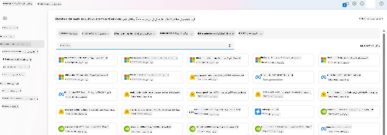

## فائن ٹیوننگ کی تیاری

### ضروریات

> [!NOTE]
> Phi-3 فیملی ماڈلز کے لیے، pay-as-you-go ماڈل فائن ٹیون کی پیشکش صرف **East US 2** ریجن میں بنائے گئے ہبز کے ساتھ دستیاب ہے۔

- ایک ایزور سبسکرپشن۔ اگر آپ کے پاس ایزور سبسکرپشن نہیں ہے تو، شروعات کے لیے [ادائیگی والا ایزور اکاؤنٹ](https://azure.microsoft.com/pricing/purchase-options/pay-as-you-go) بنائیں۔

- ایک [AI Foundry پروجیکٹ](https://ai.azure.com?WT.mc_id=aiml-138114-kinfeylo)۔
- مائیکروسافٹ فانڈری میں آپریشز تک رسائی کے لیے ایزور رول بیسڈ ایکسس کنٹرولز (Azure RBAC) استعمال ہوتے ہیں۔ اس آرٹیکل کے مراحل انجام دینے کے لیے، آپ کے یوزر اکاؤنٹ کو __Azure AI Developer رول__ بطور ریسورس گروپ تفویض ہونا چاہیے۔

### سبسکرپشن فراہم کنندہ کی رجسٹریشن

تصدیق کریں کہ سبسکرپشن `Microsoft.Network` ریسورس پرووائیڈر کے ساتھ رجسٹرڈ ہے۔

1. [ایزور پورٹل](https://portal.azure.com) میں سائن ان کریں۔
2. بائیں مینو سے **Subscriptions** منتخب کریں۔
3. وہ سبسکرپشن منتخب کریں جسے آپ استعمال کرنا چاہتے ہیں۔
4. بائیں مینو سے **AI project settings** > **Resource providers** منتخب کریں۔
5. تصدیق کریں کہ **Microsoft.Network** ریسورس پرووائیڈرز کی فہرست میں ہے۔ اگر نہیں ہے تو اسے شامل کریں۔

### ڈیٹا کی تیاری

ماڈل کی فائن ٹیوننگ کے لیے اپنے تربیتی (training) اور ویلیڈیشن (validation) ڈیٹا کو تیار کریں۔ آپ کے تربیتی اور ویلیڈیشن ڈیٹا سیٹ ان پٹ اور آؤٹ پٹ کی مثالوں پر مشتمل ہوتے ہیں جن کی بنیاد پر آپ چاہتے ہیں کہ ماڈل کام کرے۔

یقینی بنائیں کہ آپ کی تمام تربیتی مثالیں inference کے متوقع فارمیٹ کے مطابق ہوں۔ موثر فائن ٹیوننگ کے لیے ایک متوازن اور متنوع ڈیٹاسیٹ ضروری ہے۔

اس کا مطلب ہے کہ ڈیٹا میں توازن برقرار رکھنا، مختلف منظرنامے شامل کرنا، اور وقتاً فوقتاً تربیتی ڈیٹا کو حقیقی دنیا کی توقعات سے ہم آہنگ کرنا، جس سے ماڈل کے جوابات مزید درست اور متوازن ہوں گے۔

مختلف ماڈل اقسام کے لیے تربیتی ڈیٹا کا فارمیٹ مختلف ہوتا ہے۔

### چیٹ کمپلیشن

آپ کے استعمال کردہ تربیتی اور ویلیڈیشن ڈیٹا کا **JSON Lines (JSONL)** دستاویز کی صورت میں ہونا **ضروری** ہے۔ `Phi-3-mini-128k-instruct` کے لیے فائن ٹیوننگ ڈیٹاسیٹ کو Chat completions API میں استعمال ہونے والے مکالماتی فارمیٹ میں ہونا چاہیے۔

### مثال فائل کا فارمیٹ

```json
    {"messages": [{"role": "system", "content": "You are an Xbox customer support agent whose primary goal is to help users with issues they are experiencing with their Xbox devices. You are friendly and concise. You only provide factual answers to queries, and do not provide answers that are not related to Xbox."}, {"role": "user", "content": "Is Xbox better than PlayStation?"}, {"role": "assistant", "content": "I apologize, but I cannot provide personal opinions. My primary job is to assist you with any issues related to your Xbox device. Do you have any Xbox-related issues that need addressing?"}]}
    {"messages": [{"role": "system", "content": "You are an Xbox customer support agent whose primary goal is to help users with issues they are experiencing with their Xbox devices. You are friendly and concise. You only provide factual answers to queries, and do not provide answers that are not related to Xbox."}, {"role": "user", "content": "Can I play PC games on my Xbox?"}, {"role": "assistant", "content": "While Xbox consoles don't natively support PC games, they can play an array of Xbox games, many of which are also available on PC. Can I assist you with finding games compatible with your Xbox device?"}]}
    {"messages": [{"role": "system", "content": "You are an Xbox customer support agent whose primary goal is to help users with issues they are experiencing with their Xbox devices. You are friendly and concise. You only provide factual answers to queries, and do not provide answers that are not related to Xbox."}, {"role": "user", "content": "I'm having trouble connecting my Xbox to the Wi-Fi."}, {"role": "assistant", "content": "No worries, let's go through the network settings on your Xbox. Can you please tell me what happens when you try to connect it to the Wi-Fi?"}]}
```
  
سپورٹ شدہ فائل کی قسم JSON Lines ہے۔ فائلیں ڈیفالٹ ڈاٹاسٹور پر اپلوڈ کی جاتی ہیں اور آپ کے پروجیکٹ میں دستیاب ہوتی ہیں۔

## مائیکروسافٹ فانڈری کے ساتھ Phi-3 کی فائن ٹیوننگ

مائیکروسافٹ فانڈری آپ کو بڑے زبان کے ماڈلز کو ذاتی ڈیٹاسیٹ کے مطابق بنانے کی سہولت دیتا ہے جسے فائن ٹیوننگ کہتے ہیں۔ فائن ٹیوننگ صارف کو تخصیص اور مخصوص کاموں اور ایپلیکیشنز کے لیے بہتر بنانے کی اجازت دیتا ہے۔ اس کے نتیجے میں کارکردگی میں بہتری، لاگت کی بچت، کم تاخیر، اور مخصوص نتائج حاصل ہوتے ہیں۔

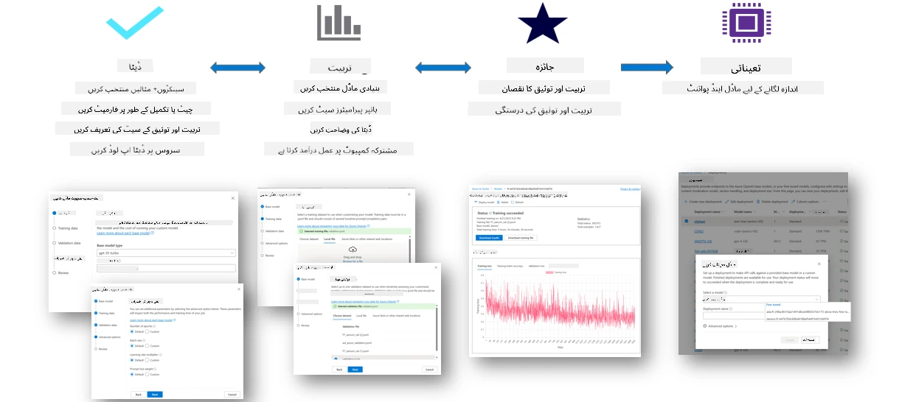

### نیا پروجیکٹ بنائیں

1. [مائیکروسافٹ فانڈری](https://ai.azure.com) میں سائن ان کریں۔

2. **+New project** کو منتخب کریں تاکہ مائیکروسافٹ فانڈری میں نیا پروجیکٹ بنایا جا سکے۔

    

3. درج ذیل کام کریں:

    - پروجیکٹ **Hub name** ڈالیں۔ یہ منفرد ہونا چاہیے۔
    - استعمال کرنے کے لیے **Hub** منتخب کریں (ضرورت ہو تو نیا بنائیں)۔

    

4. نیا ہب بنانے کے لیے درج ذیل کام کریں:

    - **Hub name** درج کریں۔ یہ منفرد ہونا چاہیے۔
    - اپنی Azure **Subscription** منتخب کریں۔
    - استعمال کے لیے **Resource group** منتخب کریں (ضرورت ہو تو نیا بنائیں)۔
    - استعمال کے لیے **Location** منتخب کریں۔
    - استعمال کے لیے **Connect Azure AI Services** منتخب کریں (ضرورت ہو تو نیا بنائیں)۔
    - **Connect Azure AI Search** کو **Skip connecting** پر منتخب کریں۔

    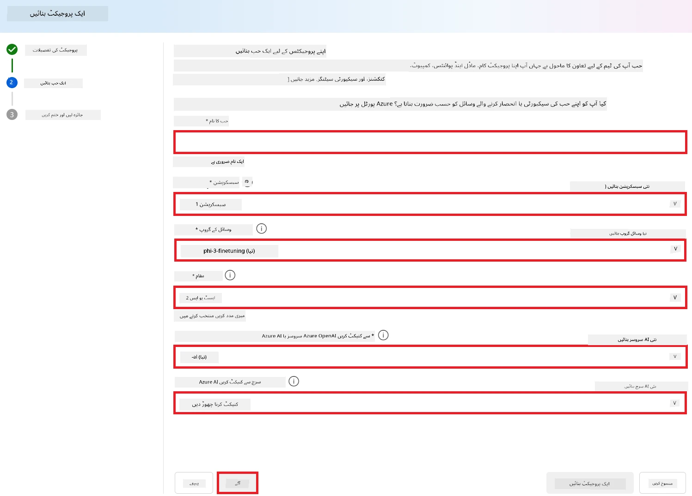

5. **Next** منتخب کریں۔
6. **Create a project** منتخب کریں۔

### ڈیٹا کی تیاری

فائن ٹیوننگ سے پہلے اپنے کام سے متعلق ڈیٹاسیٹ اکٹھا کریں یا بنائیں، جیسے کہ چیٹ ہدایات، سوال و جواب کے جوڑے، یا کوئی دیگر مناسب متنی ڈیٹا۔ اس ڈیٹا کو صاف کریں، شور کو ہٹائیں، گمشدہ قدروں کو سنبھالیں، اور متن کو ٹوکنائز کریں۔

### مائیکروسافٹ فانڈری میں Phi-3 ماڈلز کی فائن ٹیوننگ

> [!NOTE]
> Phi-3 ماڈلز کی فائن ٹیوننگ اس وقت صرف East US 2 میں واقع پروجیکٹس میں کی جاتی ہے۔

1. بائیں طرف کے ٹیب سے **Model catalog** منتخب کریں۔

2. **search bar** میں *phi-3* ٹائپ کریں اور وہ phi-3 ماڈل منتخب کریں جو آپ استعمال کرنا چاہتے ہیں۔

    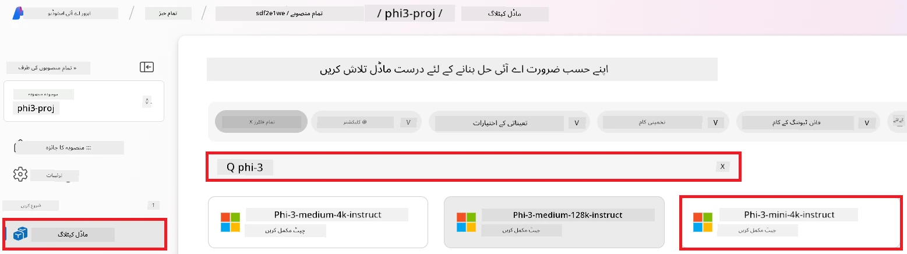

3. **Fine-tune** منتخب کریں۔

    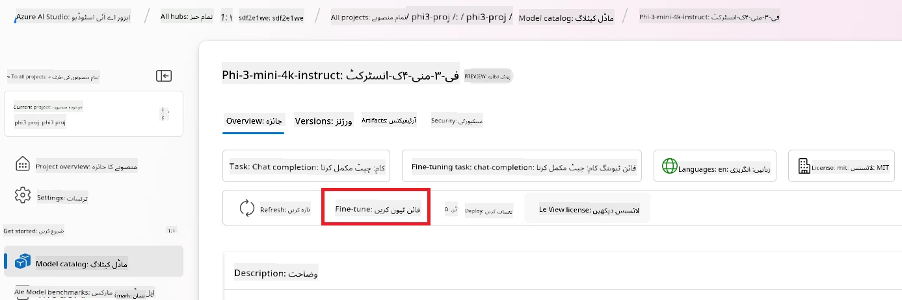

4. **Fine-tuned model name** درج کریں۔

    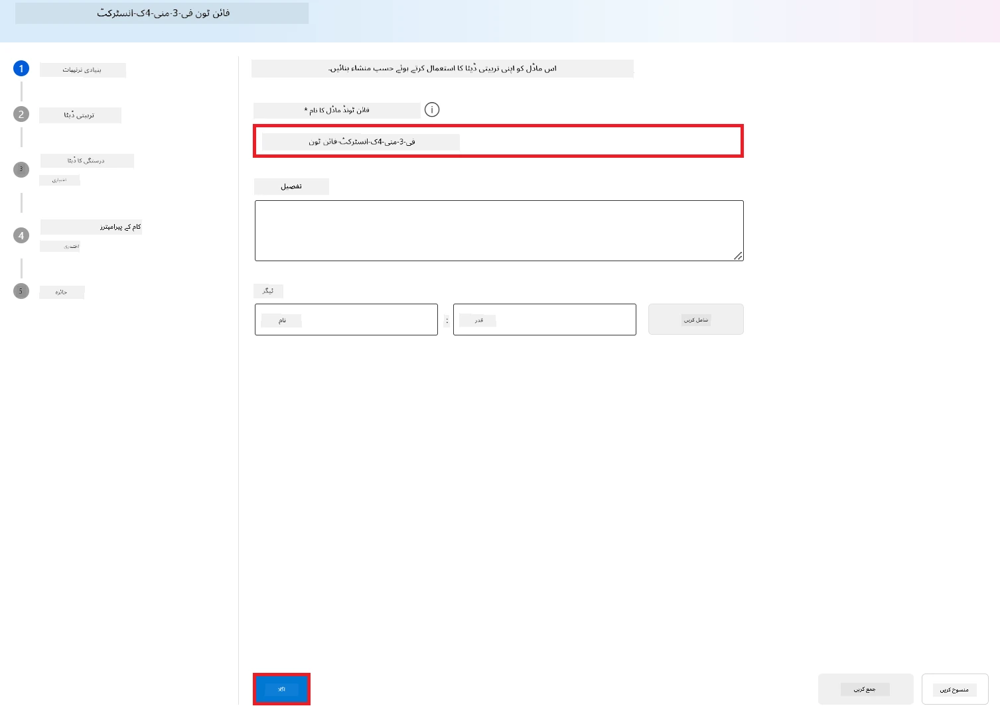

5. **Next** منتخب کریں۔

6. درج ذیل کام کریں:

    - **task type** کو **Chat completion** منتخب کریں۔
    - وہ **Training data** منتخب کریں جو آپ استعمال کرنا چاہتے ہیں۔ آپ اسے مائیکروسافٹ فانڈری کے ڈیٹا سے یا اپنے لوکل ماحول سے اپلوڈ کر سکتے ہیں۔

    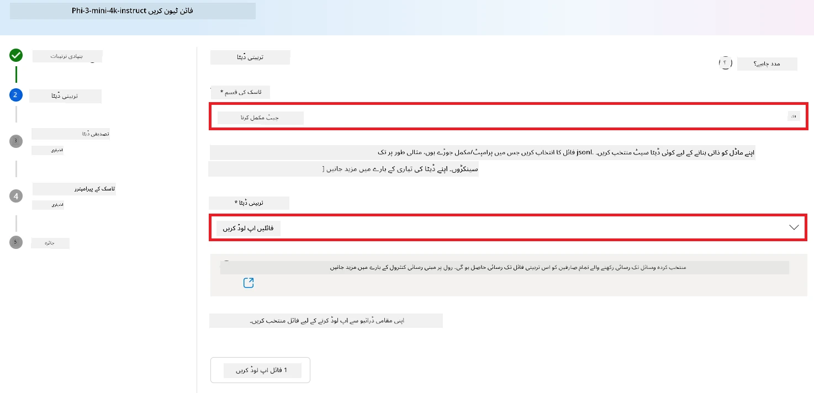

7. **Next** منتخب کریں۔

8. وہ **Validation data** اپلوڈ کریں جو آپ استعمال کرنا چاہتے ہیں، یا **Automatic split of training data** منتخب کریں۔

    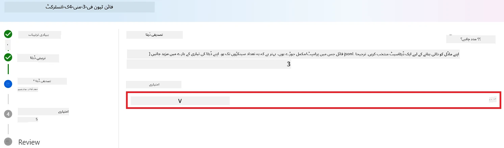

9. **Next** منتخب کریں۔

10. درج ذیل کام کریں:

    - اپنی پسند کا **Batch size multiplier** منتخب کریں۔
    - اپنی پسند کی **Learning rate** منتخب کریں۔
    - اپنی پسند کے **Epochs** منتخب کریں۔

    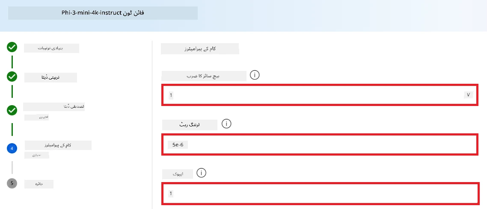

11. فائن ٹیوننگ کا عمل شروع کرنے کے لیے **Submit** منتخب کریں۔

    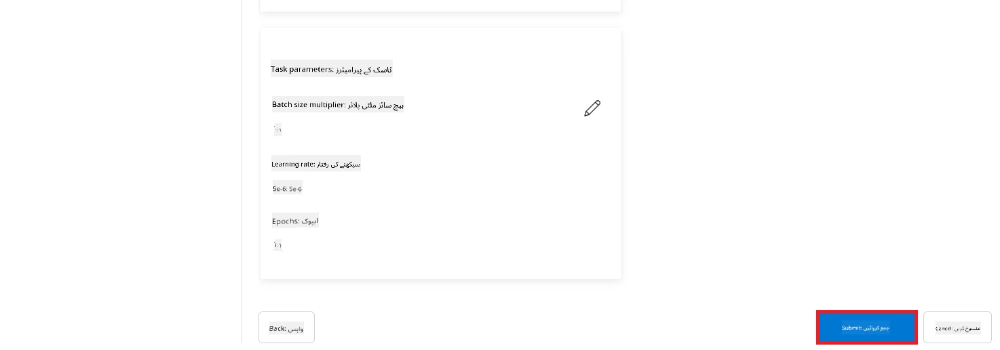

12. جب آپ کا ماڈل فائن ٹیون ہو جائے گا تو اس کی حیثیت **Completed** ظاہر ہوگی، جیسا کہ نیچے تصویر میں دکھایا گیا ہے۔ اب آپ ماڈل کو تعینات کر سکتے ہیں اور اسے اپنی ایپلیکیشن، پلیگراؤنڈ، یا پرامپٹ فلو میں استعمال کر سکتے ہیں۔ مزید معلومات کے لیے دیکھیں [مائیکروسافٹ فانڈری کے ساتھ Phi-3 فیملی کے چھوٹے زبان کے ماڈلز کو کیسے تعینات کریں](https://learn.microsoft.com/azure/ai-studio/how-to/deploy-models-phi-3?tabs=phi-3-5&pivots=programming-language-python)۔

    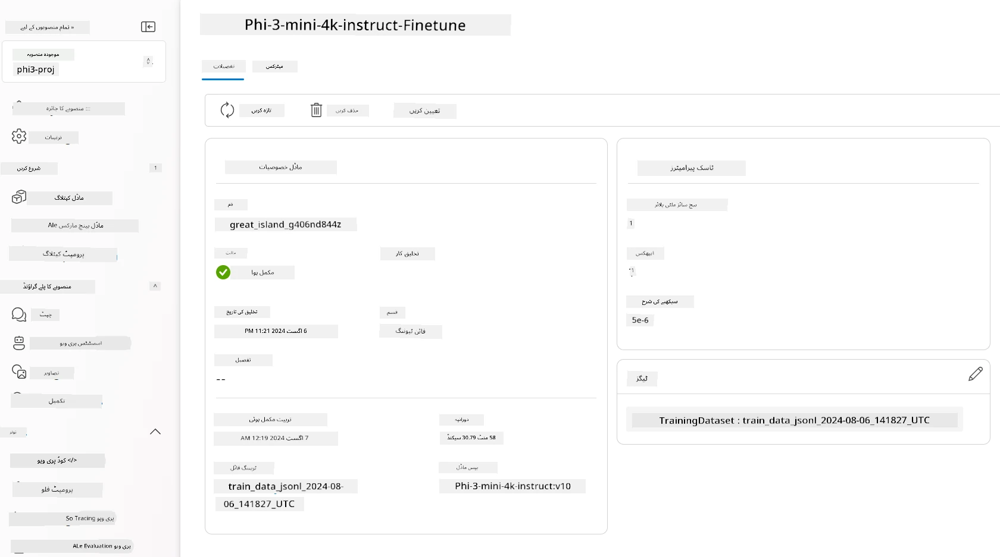

> [!NOTE]
> Phi-3 کی فائن ٹیوننگ پر مزید تفصیلی معلومات کے لیے براہ مہربانی ملاحظہ کریں: [مائیکروسافٹ فانڈری میں Phi-3 ماڈلز کو فائن ٹیون کریں](https://learn.microsoft.com/azure/ai-studio/how-to/fine-tune-phi-3?tabs=phi-3-mini)۔

## اپنے فائن ٹیون کیے گئے ماڈلز کی صفائی

آپ مائیکروسافٹ فانڈری ([Microsoft Foundry](https://ai.azure.com)) میں فائن ٹیوننگ ماڈل کی فہرست سے، یا ماڈل کی تفصیل کے صفحے سے، کسی بھی فائن ٹیون کیے گئے ماڈل کو حذف (delete) کر سکتے ہیں۔ فائن ٹیوننگ صفحہ سے حذف کرنے کے لیے فائن ٹیون ماڈل منتخب کریں، اور پھر حذف کرنے کے لیے Delete بٹن دبائیں۔

> [!NOTE]
> اگر کسی کسٹم ماڈل کی کوئی تعیناتی موجود ہے تو اسے آپ حذف نہیں کر سکتے۔ پہلے ماڈل کی تعیناتی حذف کرنی ہوگی تب ہی آپ اپنا کسٹم ماڈل حذف کر سکیں گے۔

## لاگت اور کوٹے

### سروس کے طور پر فائن ٹیون کیے گئے Phi-3 ماڈلز کے لیے لاگت اور کوٹے کے غور و فکر

Phi ماڈلز، جو سروس کے طور پر فائن ٹیون کیے جاتے ہیں، مائیکروسافٹ کی طرف سے فراہم کیے جاتے ہیں اور مائیکروسافٹ فانڈری کے ساتھ مربوط ہوتے ہیں۔ ماڈلز کی [تعیناتی](https://learn.microsoft.com/azure/ai-studio/how-to/deploy-models-phi-3?tabs=phi-3-5&pivots=programming-language-python) یا فائن ٹیوننگ کے وقت قیمت معلوم کی جا سکتی ہے، جو قیمت اور شرائط کے ٹیب کے تحت تعیناتی وزرڈ میں دستیاب ہے۔

## مواد کی فلٹرنگ

pay-as-you-go کے تحت سروس کے طور پر تعینات ماڈلز کو Azure AI Content Safety کے ذریعے محفوظ رکھا جاتا ہے۔ جب انہیں حقیقی وقت کے اینڈ پوائنٹس پر تعینات کیا جاتا ہے، تو آپ اس صلاحیت سے انکار کر سکتے ہیں۔ Azure AI Content Safety فعال ہونے کی صورت میں، پرامپٹ اور کمپلیشن دونوں ایک ایسے مجموعے سے گزرتے ہیں جو ممکنہ طور پر نقصان دہ مواد کی شناخت اور روک تھام کے لیے بنائے گئے ہیں۔ مواد کی فلٹرنگ کا نظام ممکنہ نقصان دہ مواد کی مخصوص اقسام کا پتہ لگاتا اور ان پر کارروائی کرتا ہے، چاہے وہ ان پٹ پرامپٹس ہوں یا آؤٹ پٹ کمپلیشنز۔ مزید جاننے کے لیے دیکھیں [Azure AI Content Safety](https://learn.microsoft.com/azure/ai-studio/concepts/content-filtering)۔

**فائن ٹیوننگ کنفیگریشن**

ہائپر پیرا میٹرز: سیکھنے کی شرح، بیچ سائز، اور تربیتی ایپوک کی تعداد جیسے ہائپر پیرا میٹرز کی تعریف کریں۔

**لوس فنکشن**

اپنے کام کے لیے مناسب لوس فنکشن منتخب کریں (مثلاً cross-entropy)۔

**اپٹیمائزر**

تربیت کے دوران گریڈینٹ اپڈیٹس کے لیے اپٹیمائزر (مثلاً آدم) منتخب کریں۔

**فائن ٹیوننگ کا عمل**

- پری ٹرینڈ ماڈل لوڈ کریں: Phi-3 Mini چیکپوائنٹ لوڈ کریں۔
- کسٹم لیئرز شامل کریں: کام کی نوعیت کے مطابق لیئرز شامل کریں (مثلاً چیٹ ہدایات کے لیے درجہ بندی کا سر).

**ماڈل کی تربیت**

اپنے تیار کردہ ڈیٹاسیٹ کے ساتھ ماڈل کی فائن ٹیوننگ کریں۔ تربیت کی پیش رفت کی نگرانی کریں اور حسب ضرورت ہائپر پیرا میٹرز کو ایڈجسٹ کریں۔

**تشخیص اور ویلیڈیشن**

ویلیڈیشن سیٹ: اپنے ڈیٹا کو تربیت اور ویلیڈیشن سیٹس میں تقسیم کریں۔

**کارکردگی کی جانچ**

ماڈل کی کارکردگی جانچنے کے لیے درستگی، F1 اسکور، یا perplexity جیسے میٹرکس کا استعمال کریں۔

## فائن ٹیونڈ ماڈل محفوظ کریں

**چیکپوائنٹ**  
مستقبل میں استعمال کے لیے فائن ٹیونڈ ماڈل کا چیکپوائنٹ محفوظ کریں۔

## تعیناتی

- ویب سروس کے طور پر تعینات کریں: اپنے فائن ٹیونڈ ماڈل کو مائیکروسافٹ فانڈری میں ویب سروس کے طور پر تعینات کریں۔
- اینڈپوائنٹ کا ٹیسٹ کریں: تعینات کردہ اینڈپوائنٹ کو ٹیسٹ کرنے کے لیے سوالات بھیجیں اور اس کی فعالیت کی جانچ کریں۔

## تکرار اور بہتری

تکرار: اگر کارکردگی تسلی بخش نہ ہو تو ہائپر پیرا میٹرز ایڈجسٹ کریں، مزید ڈیٹا شامل کریں، یا اضافی ایپوکز کے لیے فائن ٹیوننگ کریں۔

## نگرانی اور اصلاح

مسلسل ماڈل کے رویے کی نگرانی کریں اور ضرورت کے مطابق اصلاح کریں۔

## تخصیص اور توسیع

کسٹم ٹاسکس: Phi-3 Mini کو چیٹ ہدایات کے علاوہ دوسرے کاموں کے لیے بھی فائن ٹیون کیا جا سکتا ہے۔ دیگر استعمالات دریافت کریں!  
تجربہ کریں: کارکردگی بہتر بنانے کے لیے مختلف فن تعمیرات، لیئرز کے امتزاج، اور تکنیک آزما کر دیکھیں۔

> [!NOTE]
> فائن ٹیوننگ ایک تکراری عمل ہے۔ تجربہ کریں، سیکھیں، اور اپنے ماڈل کو مخصوص کام کے بہترین نتائج کے لیے ڈھالیں!

---

<!-- CO-OP TRANSLATOR DISCLAIMER START -->
**مذہبہ:**
اس دستاویز کا ترجمہ AI ترجمہ سروس [Co-op Translator](https://github.com/Azure/co-op-translator) کے ذریعے کیا گیا ہے۔ ہم درستگی کے لئے کوشاں ہیں، لیکن براہ کرم خیال رکھیں کہ خودکار ترجمے میں غلطیاں یا عدم دقت ہو سکتی ہے۔ اصل دستاویز اپنی مادری زبان میں ہی مستند ماخذ سمجھی جانی چاہیے۔ اہم معلومات کے لئے پیشہ ورانہ انسانی ترجمہ تجویز کیا جاتا ہے۔ اس ترجمے کے استعمال سے پیدا ہونے والی کسی بھی غلط فہمی یا غلط تعبیر کی ذمہ داری ہم قبول نہیں کرتے۔
<!-- CO-OP TRANSLATOR DISCLAIMER END -->