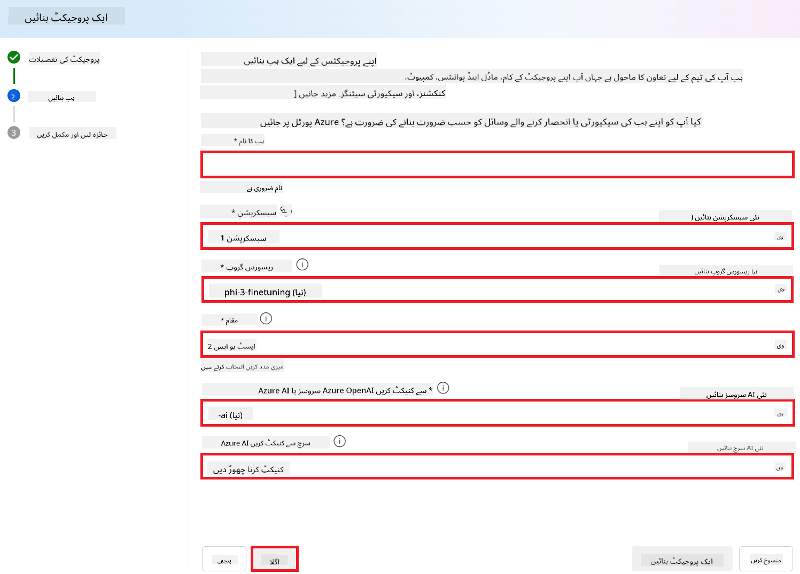
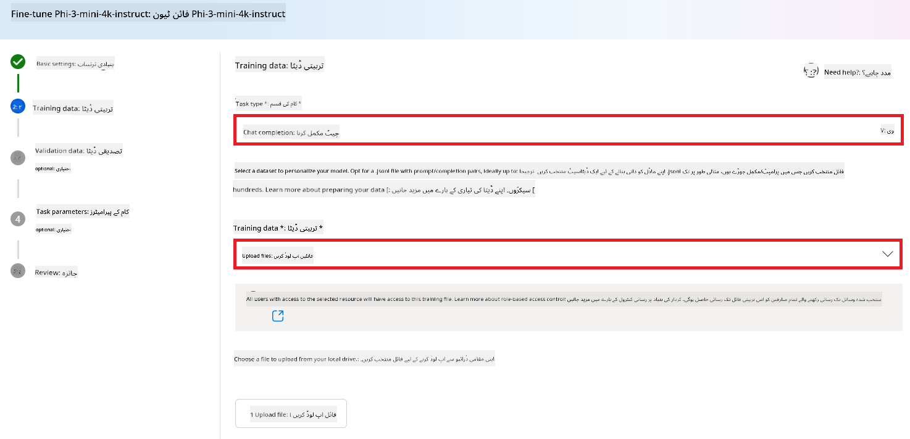
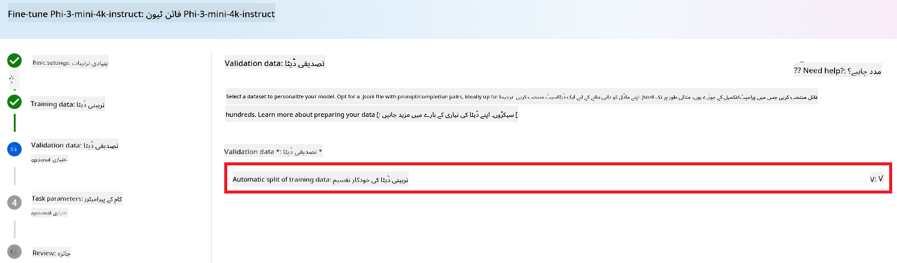
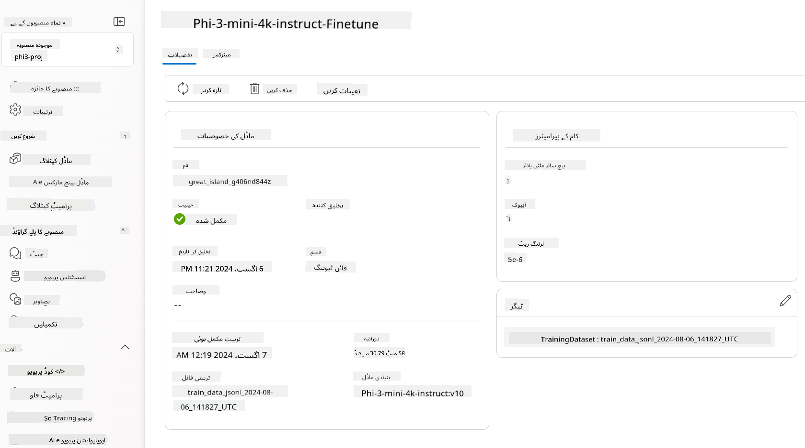

<!--
CO_OP_TRANSLATOR_METADATA:
{
  "original_hash": "c1559c5af6caccf6f623fd43a6b3a9a3",
  "translation_date": "2025-05-07T13:11:55+00:00",
  "source_file": "md/03.FineTuning/FineTuning_AIFoundry.md",
  "language_code": "ur"
}
-->
# فائن ٹوننگ Phi-3 Azure AI Foundry کے ساتھ

آئیے دیکھتے ہیں کہ Microsoft کے Phi-3 Mini زبان کے ماڈل کو Azure AI Foundry کے ذریعے کیسے فائن ٹون کیا جاتا ہے۔ فائن ٹوننگ آپ کو Phi-3 Mini کو مخصوص کاموں کے لیے ڈھالنے کی اجازت دیتی ہے، جس سے یہ مزید طاقتور اور سیاق و سباق سے واقف بنتا ہے۔

## غور طلب نکات

- **صلاحیتیں:** کون سے ماڈلز کو فائن ٹون کیا جا سکتا ہے؟ بنیادی ماڈل کو کن کاموں کے لیے فائن ٹون کیا جا سکتا ہے؟
- **لاگت:** فائن ٹوننگ کی قیمت کا ماڈل کیا ہے؟
- **حسب ضرورت:** میں بنیادی ماڈل میں کتنی تبدیلی کر سکتا ہوں – اور کس طرح؟
- **آسانی:** فائن ٹوننگ حقیقت میں کیسے ہوتی ہے – کیا مجھے اپنا کوڈ لکھنا ہوگا؟ کیا مجھے اپنا کمپیوٹ لانا ہوگا؟
- **حفاظت:** فائن ٹون کیے گئے ماڈلز کے حفاظتی خطرات ہوتے ہیں – کیا غیر ارادی نقصان سے بچاؤ کے لیے کوئی حفاظتی اقدامات موجود ہیں؟


## فائن ٹوننگ کی تیاری

### ضروریات

> [!NOTE]
> Phi-3 فیملی کے ماڈلز کے لیے، pay-as-you-go ماڈل فائن ٹون آفر صرف **East US 2** ریجنز میں بنائے گئے ہبز کے ساتھ دستیاب ہے۔

- ایک Azure سبسکرپشن۔ اگر آپ کے پاس Azure سبسکرپشن نہیں ہے، تو شروع کرنے کے لیے [ادائیگی والا Azure اکاؤنٹ](https://azure.microsoft.com/pricing/purchase-options/pay-as-you-go) بنائیں۔

- ایک [AI Foundry پروجیکٹ](https://ai.azure.com?WT.mc_id=aiml-138114-kinfeylo)۔
- Azure رول پر مبنی رسائی کنٹرول (Azure RBAC) Azure AI Foundry میں آپریشنز تک رسائی دینے کے لیے استعمال ہوتے ہیں۔ اس آرٹیکل کے مراحل کرنے کے لیے، آپ کے یوزر اکاؤنٹ کو resource group پر __Azure AI Developer رول__ تفویض ہونا چاہیے۔

### سبسکرپشن پرووائیڈر کی رجسٹریشن

یقینی بنائیں کہ سبسکرپشن `Microsoft.Network` resource provider کے ساتھ رجسٹرڈ ہے۔

1. [Azure پورٹل](https://portal.azure.com) میں سائن ان کریں۔
1. بائیں مینو سے **Subscriptions** منتخب کریں۔
1. وہ سبسکرپشن منتخب کریں جو آپ استعمال کرنا چاہتے ہیں۔
1. بائیں مینو سے **AI project settings** > **Resource providers** منتخب کریں۔
1. تصدیق کریں کہ **Microsoft.Network** resource providers کی فہرست میں موجود ہے۔ اگر نہیں تو اسے شامل کریں۔

### ڈیٹا کی تیاری

اپنے ماڈل کو فائن ٹون کرنے کے لیے اپنے ٹریننگ اور ویلیڈیشن ڈیٹا کو تیار کریں۔ آپ کے ٹریننگ اور ویلیڈیشن ڈیٹا سیٹ میں ان پٹ اور آؤٹ پٹ کی مثالیں شامل ہوتی ہیں جن سے ماڈل کی کارکردگی کی توقع ہوتی ہے۔

یقینی بنائیں کہ آپ کی تمام ٹریننگ مثالیں انفرنس کے متوقع فارمیٹ کے مطابق ہوں۔ مؤثر فائن ٹوننگ کے لیے، متوازن اور متنوع ڈیٹا سیٹ ضروری ہے۔

اس میں ڈیٹا کے توازن کو برقرار رکھنا، مختلف حالات شامل کرنا، اور وقتاً فوقتاً ٹریننگ ڈیٹا کو حقیقی دنیا کی توقعات کے مطابق بہتر بنانا شامل ہے، جس سے ماڈل کے جوابات زیادہ درست اور متوازن ہوتے ہیں۔

مختلف ماڈل کی اقسام کے لیے ٹریننگ ڈیٹا کا مختلف فارمیٹ درکار ہوتا ہے۔

### چیٹ کمپلیشن

آپ کے استعمال کردہ ٹریننگ اور ویلیڈیشن ڈیٹا کو لازمی طور پر JSON Lines (JSONL) دستاویز کے طور پر فارمیٹ کیا جانا چاہیے۔ `Phi-3-mini-128k-instruct` کے لیے، فائن ٹوننگ ڈیٹا سیٹ کو چیٹ کمپلیشن API میں استعمال ہونے والے conversational فارمیٹ میں ہونا چاہیے۔

### مثال فائل کا فارمیٹ

```json
    {"messages": [{"role": "system", "content": "You are an Xbox customer support agent whose primary goal is to help users with issues they are experiencing with their Xbox devices. You are friendly and concise. You only provide factual answers to queries, and do not provide answers that are not related to Xbox."}, {"role": "user", "content": "Is Xbox better than PlayStation?"}, {"role": "assistant", "content": "I apologize, but I cannot provide personal opinions. My primary job is to assist you with any issues related to your Xbox device. Do you have any Xbox-related issues that need addressing?"}]}
    {"messages": [{"role": "system", "content": "You are an Xbox customer support agent whose primary goal is to help users with issues they are experiencing with their Xbox devices. You are friendly and concise. You only provide factual answers to queries, and do not provide answers that are not related to Xbox."}, {"role": "user", "content": "Can I play PC games on my Xbox?"}, {"role": "assistant", "content": "While Xbox consoles don't natively support PC games, they can play an array of Xbox games, many of which are also available on PC. Can I assist you with finding games compatible with your Xbox device?"}]}
    {"messages": [{"role": "system", "content": "You are an Xbox customer support agent whose primary goal is to help users with issues they are experiencing with their Xbox devices. You are friendly and concise. You only provide factual answers to queries, and do not provide answers that are not related to Xbox."}, {"role": "user", "content": "I'm having trouble connecting my Xbox to the Wi-Fi."}, {"role": "assistant", "content": "No worries, let's go through the network settings on your Xbox. Can you please tell me what happens when you try to connect it to the Wi-Fi?"}]}
```

سپورٹ شدہ فائل کی قسم JSON Lines ہے۔ فائلیں ڈیفالٹ ڈیٹا اسٹور پر اپ لوڈ کی جاتی ہیں اور آپ کے پروجیکٹ میں دستیاب ہوتی ہیں۔

## Azure AI Foundry کے ساتھ Phi-3 کی فائن ٹوننگ

Azure AI Foundry آپ کو بڑے زبان کے ماڈلز کو اپنے ذاتی ڈیٹا سیٹس کے مطابق ڈھالنے دیتا ہے، جسے فائن ٹوننگ کہا جاتا ہے۔ فائن ٹوننگ اہم قدر فراہم کرتی ہے کیونکہ یہ مخصوص کاموں اور ایپلیکیشنز کے لیے تخصیص اور اصلاح کی اجازت دیتی ہے۔ اس سے بہتر کارکردگی، لاگت کی بچت، کم تاخیر، اور مخصوص نتائج حاصل ہوتے ہیں۔


### نیا پروجیکٹ بنائیں

1. [Azure AI Foundry](https://ai.azure.com) میں سائن ان کریں۔

1. Azure AI Foundry میں نیا پروجیکٹ بنانے کے لیے **+New project** منتخب کریں۔

    

1. درج ذیل کام انجام دیں:

    - پروجیکٹ کا **Hub name**۔ یہ منفرد ہونا چاہیے۔
    - استعمال کے لیے **Hub** منتخب کریں (ضرورت ہو تو نیا بنائیں)۔

    

1. نیا ہب بنانے کے لیے درج ذیل کام کریں:

    - **Hub name** درج کریں۔ یہ منفرد ہونا چاہیے۔
    - اپنی Azure **Subscription** منتخب کریں۔
    - استعمال کے لیے **Resource group** منتخب کریں (ضرورت ہو تو نیا بنائیں)۔
    - اپنی پسند کا **Location** منتخب کریں۔
    - استعمال کے لیے **Connect Azure AI Services** منتخب کریں (ضرورت ہو تو نیا بنائیں)۔
    - **Connect Azure AI Search** کے لیے **Skip connecting** منتخب کریں۔

    

1. **Next** منتخب کریں۔
1. **Create a project** منتخب کریں۔

### ڈیٹا کی تیاری

فائن ٹوننگ سے پہلے، اپنے کام سے متعلق ڈیٹا سیٹ جمع کریں یا بنائیں، جیسے چیٹ ہدایات، سوال و جواب کے جوڑے، یا کوئی اور متعلقہ متن۔ اس ڈیٹا کو صاف کریں، شور ہٹائیں، گمشدہ اقدار کو سنبھالیں، اور متن کو ٹوکنائز کریں۔

### Azure AI Foundry میں Phi-3 ماڈلز کو فائن ٹون کریں

> [!NOTE]
> Phi-3 ماڈلز کی فائن ٹوننگ فی الحال East US 2 میں واقع پروجیکٹس میں سپورٹ کی جاتی ہے۔

1. بائیں سائڈ بار سے **Model catalog** منتخب کریں۔

1. **search bar** میں *phi-3* ٹائپ کریں اور وہ phi-3 ماڈل منتخب کریں جسے آپ استعمال کرنا چاہتے ہیں۔

    

1. **Fine-tune** منتخب کریں۔

    

1. **Fine-tuned model name** درج کریں۔

    

1. **Next** منتخب کریں۔

1. درج ذیل کام کریں:

    - **task type** کو **Chat completion** منتخب کریں۔
    - وہ **Training data** منتخب کریں جسے آپ استعمال کرنا چاہتے ہیں۔ آپ اسے Azure AI Foundry کے ڈیٹا سے یا اپنے مقامی ماحول سے اپ لوڈ کر سکتے ہیں۔

    

1. **Next** منتخب کریں۔

1. وہ **Validation data** اپ لوڈ کریں جسے آپ استعمال کرنا چاہتے ہیں، یا **Automatic split of training data** منتخب کریں۔

    

1. **Next** منتخب کریں۔

1. درج ذیل کام کریں:

    - وہ **Batch size multiplier** منتخب کریں جو آپ استعمال کرنا چاہتے ہیں۔
    - وہ **Learning rate** منتخب کریں جو آپ استعمال کرنا چاہتے ہیں۔
    - وہ **Epochs** منتخب کریں جو آپ استعمال کرنا چاہتے ہیں۔

    

1. فائن ٹوننگ کا عمل شروع کرنے کے لیے **Submit** منتخب کریں۔

    

1. جب آپ کا ماڈل فائن ٹون ہو جائے گا، تو اس کی حالت **Completed** دکھائی دے گی جیسا کہ نیچے تصویر میں ہے۔ اب آپ ماڈل کو تعینات کر سکتے ہیں اور اسے اپنی ایپلیکیشن، playground، یا prompt flow میں استعمال کر سکتے ہیں۔ مزید معلومات کے لیے دیکھیں [How to deploy Phi-3 family of small language models with Azure AI Foundry](https://learn.microsoft.com/azure/ai-studio/how-to/deploy-models-phi-3?tabs=phi-3-5&pivots=programming-language-python)۔

    

> [!NOTE]
> Phi-3 کی فائن ٹوننگ پر مزید تفصیلی معلومات کے لیے، ملاحظہ کریں [Fine-tune Phi-3 models in Azure AI Foundry](https://learn.microsoft.com/azure/ai-studio/how-to/fine-tune-phi-3?tabs=phi-3-mini)۔

## اپنے فائن ٹون کیے گئے ماڈلز کی صفائی

آپ [Azure AI Foundry](https://ai.azure.com) میں فائن ٹون کیے گئے ماڈل کی فہرست سے یا ماڈل کی تفصیلات والے صفحے سے فائن ٹون ماڈل کو حذف کر سکتے ہیں۔ فائن ٹوننگ صفحے سے حذف کرنے کے لیے ماڈل منتخب کریں، پھر حذف کرنے کے لیے Delete بٹن دبائیں۔

> [!NOTE]
> اگر آپ کا کسٹم ماڈل پہلے سے تعینات ہے، تو آپ اسے حذف نہیں کر سکتے۔ پہلے ماڈل کی تعیناتی کو حذف کریں، پھر کسٹم ماڈل کو حذف کریں۔

## لاگت اور کوٹہ

### Phi-3 ماڈلز کے لیے فائن ٹوننگ بطور سروس کے لاگت اور کوٹہ کے نکات

Phi ماڈلز جو سروس کے طور پر فائن ٹون کیے جاتے ہیں، Microsoft کی جانب سے فراہم کیے جاتے ہیں اور Azure AI Foundry کے ساتھ مربوط ہوتے ہیں۔ آپ قیمت دیکھ سکتے ہیں جب آپ ماڈلز کو [تعینات](https://learn.microsoft.com/azure/ai-studio/how-to/deploy-models-phi-3?tabs=phi-3-5&pivots=programming-language-python) یا فائن ٹون کر رہے ہوں، جو deployment wizard کے Pricing and terms ٹیب کے تحت دستیاب ہے۔

## مواد کی فلٹرنگ

pay-as-you-go سروس کے طور پر تعینات ماڈلز Azure AI Content Safety کے ذریعے محفوظ کیے جاتے ہیں۔ جب انہیں رئیل ٹائم اینڈ پوائنٹس پر تعینات کیا جاتا ہے، تو آپ اس خصوصیت کو بند کر سکتے ہیں۔ Azure AI content safety فعال ہونے پر، پرامپٹ اور کمپلیشن دونوں ایک ایسے کلاسیفیکیشن ماڈلز کے مجموعے سے گزرتے ہیں جو نقصان دہ مواد کی شناخت اور روک تھام کے لیے ہیں۔ مواد کی فلٹرنگ سسٹم ان پٹ پرامپٹس اور آؤٹ پٹ کمپلیشنز دونوں میں ممکنہ نقصان دہ مواد کی مخصوص اقسام کا پتہ لگا کر کارروائی کرتا ہے۔ مزید جاننے کے لیے دیکھیں [Azure AI Content Safety](https://learn.microsoft.com/azure/ai-studio/concepts/content-filtering)۔

**فائن ٹوننگ کی ترتیب**

ہائپر پیرامیٹرز: سیکھنے کی رفتار، بیچ سائز، اور ٹریننگ ایپوک کی تعداد جیسے ہائپر پیرامیٹرز کی وضاحت کریں۔

**لوس فنکشن**

اپنے کام کے لیے مناسب لوس فنکشن منتخب کریں (مثلاً cross-entropy)۔

**آپٹیمائزر**

ٹریننگ کے دوران گریڈینٹ اپ ڈیٹس کے لیے آپٹیمائزر منتخب کریں (مثلاً Adam)۔

**فائن ٹوننگ کا عمل**

- پری ٹرینڈ ماڈل لوڈ کریں: Phi-3 Mini چیک پوائنٹ لوڈ کریں۔
- کسٹم لیئرز شامل کریں: مخصوص کام کے لیے لیئرز شامل کریں (مثلاً چیٹ ہدایات کے لیے classification head)۔

**ماڈل کو ٹرین کریں**  
اپنے تیار کردہ ڈیٹا سیٹ کے ساتھ ماڈل کو فائن ٹون کریں۔ ٹریننگ کی پیش رفت کو مانیٹر کریں اور ضرورت کے مطابق ہائپر پیرامیٹرز ایڈجسٹ کریں۔

**تشخیص اور توثیق**

ویلیڈیشن سیٹ: اپنے ڈیٹا کو ٹریننگ اور ویلیڈیشن سیٹس میں تقسیم کریں۔

**کارکردگی کا جائزہ لیں**

ماڈل کی کارکردگی کا اندازہ لگانے کے لیے accuracy، F1-score، یا perplexity جیسے میٹرکس استعمال کریں۔

## فائن ٹون ماڈل کو محفوظ کریں

**چیک پوائنٹ**  
مستقبل میں استعمال کے لیے فائن ٹون ماڈل کا چیک پوائنٹ محفوظ کریں۔

## تعیناتی

- ویب سروس کے طور پر تعینات کریں: اپنے فائن ٹون ماڈل کو Azure AI Foundry میں ویب سروس کے طور پر تعینات کریں۔
- اینڈ پوائنٹ کی جانچ کریں: تعینات اینڈ پوائنٹ کو ٹیسٹ کوئریز بھیج کر اس کی فعالیت کی تصدیق کریں۔

## دہرائیں اور بہتر بنائیں

دہرائیں: اگر کارکردگی تسلی بخش نہیں ہے، تو ہائپر پیرامیٹرز کو ایڈجسٹ کریں، مزید ڈیٹا شامل کریں، یا اضافی ایپوک کے لیے فائن ٹون کریں۔

## نگرانی اور بہتر بنائیں

ماڈل کے رویے کی مسلسل نگرانی کریں اور ضرورت کے مطابق اسے بہتر بنائیں۔

## حسب ضرورت اور توسیع

کسٹم کام: Phi-3 Mini کو چیٹ ہدایات کے علاوہ مختلف کاموں کے لیے بھی فائن ٹون کیا جا سکتا ہے۔ دوسرے استعمال کے کیسز دریافت کریں!  
تجربہ کریں: کارکردگی بڑھانے کے لیے مختلف آرکیٹیکچرز، لیئرز کے امتزاج، اور تکنیک آزمایں۔

> [!NOTE]
> فائن ٹوننگ ایک تکراری عمل ہے۔ تجربہ کریں، سیکھیں، اور اپنے مخصوص کام کے لیے بہترین نتائج حاصل کرنے کے لیے اپنے ماڈل کو ڈھالیں!

**دسکلیمر**:  
یہ دستاویز AI ترجمہ سروس [Co-op Translator](https://github.com/Azure/co-op-translator) کے ذریعے ترجمہ کی گئی ہے۔ اگرچہ ہم درستگی کے لیے کوشاں ہیں، براہ کرم یہ بات ذہن میں رکھیں کہ خودکار ترجمے میں غلطیاں یا عدم درستیاں ہو سکتی ہیں۔ اصل دستاویز اپنی مادری زبان میں معتبر ماخذ سمجھی جانی چاہیے۔ اہم معلومات کے لیے پیشہ ورانہ انسانی ترجمہ تجویز کیا جاتا ہے۔ اس ترجمے کے استعمال سے پیدا ہونے والی کسی بھی غلط فہمی یا غلط تشریح کی ذمہ داری ہم پر نہیں ہوگی۔