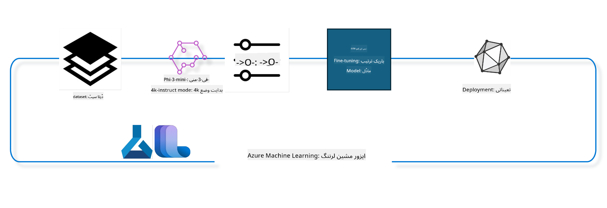

<!--
CO_OP_TRANSLATOR_METADATA:
{
  "original_hash": "944949f040e61b2ea25b3460f7394fd4",
  "translation_date": "2025-07-17T07:01:14+00:00",
  "source_file": "md/03.FineTuning/FineTuning_MLSDK.md",
  "language_code": "ur"
}
-->
## Azure ML سسٹم رجسٹری سے chat-completion کمپونینٹس استعمال کر کے ماڈل کو fine tune کرنے کا طریقہ

اس مثال میں ہم Phi-3-mini-4k-instruct ماڈل کی fine tuning کریں گے تاکہ ultrachat_200k ڈیٹاسیٹ استعمال کرتے ہوئے دو افراد کے درمیان گفتگو مکمل کی جا سکے۔



یہ مثال آپ کو دکھائے گی کہ Azure ML SDK اور Python استعمال کرتے ہوئے fine tuning کیسے کی جاتی ہے اور پھر fine tuned ماڈل کو آن لائن اینڈپوائنٹ پر ریئل ٹائم inference کے لیے کیسے deploy کیا جاتا ہے۔

### تربیتی ڈیٹا

ہم ultrachat_200k ڈیٹاسیٹ استعمال کریں گے۔ یہ UltraChat ڈیٹاسیٹ کا ایک سخت فلٹر شدہ ورژن ہے اور Zephyr-7B-β، جو ایک جدید 7b چیٹ ماڈل ہے، کی تربیت کے لیے استعمال ہوا تھا۔

### ماڈل

ہم Phi-3-mini-4k-instruct ماڈل استعمال کریں گے تاکہ دکھایا جا سکے کہ صارف کس طرح chat-completion ٹاسک کے لیے ماڈل کو fine tune کر سکتا ہے۔ اگر آپ نے یہ نوٹ بک کسی مخصوص ماڈل کارڈ سے کھولی ہے تو مخصوص ماڈل کا نام تبدیل کرنا یاد رکھیں۔

### کام

- fine tune کرنے کے لیے ماڈل منتخب کریں۔
- تربیتی ڈیٹا منتخب کریں اور اس کا جائزہ لیں۔
- fine tuning جاب کی ترتیب دیں۔
- fine tuning جاب چلائیں۔
- تربیتی اور تشخیصی میٹرکس کا جائزہ لیں۔
- fine tuned ماڈل کو رجسٹر کریں۔
- fine tuned ماڈل کو ریئل ٹائم inference کے لیے deploy کریں۔
- وسائل کی صفائی کریں۔

## 1. ضروریات کی تیاری

- dependencies انسٹال کریں
- AzureML Workspace سے کنیکٹ کریں۔ مزید جاننے کے لیے set up SDK authentication دیکھیں۔ نیچے <WORKSPACE_NAME>, <RESOURCE_GROUP> اور <SUBSCRIPTION_ID> کو تبدیل کریں۔
- azureml سسٹم رجسٹری سے کنیکٹ کریں
- ایک اختیاری experiment نام سیٹ کریں
- compute چیک کریں یا بنائیں۔

> [!NOTE]
> ایک واحد GPU نوڈ میں متعدد GPU کارڈز ہو سکتے ہیں۔ مثال کے طور پر، Standard_NC24rs_v3 کے ایک نوڈ میں 4 NVIDIA V100 GPUs ہوتے ہیں جبکہ Standard_NC12s_v3 میں 2 NVIDIA V100 GPUs ہوتے ہیں۔ اس معلومات کے لیے docs دیکھیں۔ ہر نوڈ میں GPU کارڈز کی تعداد نیچے param gpus_per_node میں سیٹ کی جاتی ہے۔ اس ویلیو کو درست سیٹ کرنا تمام GPUs کے استعمال کو یقینی بنائے گا۔ تجویز کردہ GPU compute SKUs یہاں اور یہاں دستیاب ہیں۔

### Python لائبریریز

نیچے دیے گئے سیل کو چلائیں تاکہ dependencies انسٹال ہوں۔ اگر نیا ماحول استعمال کر رہے ہیں تو یہ قدم لازمی ہے۔

```bash
pip install azure-ai-ml
pip install azure-identity
pip install datasets==2.9.0
pip install mlflow
pip install azureml-mlflow
```

### Azure ML کے ساتھ تعامل

1. یہ Python اسکرپٹ Azure Machine Learning (Azure ML) سروس کے ساتھ تعامل کے لیے استعمال ہوتا ہے۔ اس کا خلاصہ درج ذیل ہے:

    - یہ azure.ai.ml, azure.identity, اور azure.ai.ml.entities پیکجز سے ضروری ماڈیولز امپورٹ کرتا ہے۔ ساتھ ہی time ماڈیول بھی امپورٹ کرتا ہے۔

    - یہ DefaultAzureCredential() کے ذریعے authentication کی کوشش کرتا ہے، جو Azure کلاؤڈ میں ایپلیکیشنز جلدی شروع کرنے کے لیے آسان authentication فراہم کرتا ہے۔ اگر یہ ناکام ہو جائے تو InteractiveBrowserCredential() استعمال کرتا ہے، جو انٹرایکٹو لاگ ان پرامپٹ دیتا ہے۔

    - پھر یہ from_config طریقہ استعمال کرتے ہوئے MLClient کا ایک انسٹانس بنانے کی کوشش کرتا ہے، جو default config فائل (config.json) سے کنفیگریشن پڑھتا ہے۔ اگر یہ ناکام ہو جائے تو subscription_id, resource_group_name, اور workspace_name دستی طور پر فراہم کر کے MLClient بناتا ہے۔

    - ایک اور MLClient انسٹانس بناتا ہے، اس بار Azure ML رجسٹری "azureml" کے لیے۔ یہ رجسٹری ماڈلز، fine-tuning پائپ لائنز، اور ماحولیات کو ذخیرہ کرتی ہے۔

    - experiment_name کو "chat_completion_Phi-3-mini-4k-instruct" پر سیٹ کرتا ہے۔

    - ایک منفرد timestamp بناتا ہے جو موجودہ وقت (epoch سے سیکنڈز میں، فلوٹنگ پوائنٹ نمبر کے طور پر) کو انٹیجر اور پھر سٹرنگ میں تبدیل کر کے حاصل کیا جاتا ہے۔ یہ timestamp منفرد نام اور ورژنز بنانے کے لیے استعمال ہو سکتا ہے۔

    ```python
    # Import necessary modules from Azure ML and Azure Identity
    from azure.ai.ml import MLClient
    from azure.identity import (
        DefaultAzureCredential,
        InteractiveBrowserCredential,
    )
    from azure.ai.ml.entities import AmlCompute
    import time  # Import time module
    
    # Try to authenticate using DefaultAzureCredential
    try:
        credential = DefaultAzureCredential()
        credential.get_token("https://management.azure.com/.default")
    except Exception as ex:  # If DefaultAzureCredential fails, use InteractiveBrowserCredential
        credential = InteractiveBrowserCredential()
    
    # Try to create an MLClient instance using the default config file
    try:
        workspace_ml_client = MLClient.from_config(credential=credential)
    except:  # If that fails, create an MLClient instance by manually providing the details
        workspace_ml_client = MLClient(
            credential,
            subscription_id="<SUBSCRIPTION_ID>",
            resource_group_name="<RESOURCE_GROUP>",
            workspace_name="<WORKSPACE_NAME>",
        )
    
    # Create another MLClient instance for the Azure ML registry named "azureml"
    # This registry is where models, fine-tuning pipelines, and environments are stored
    registry_ml_client = MLClient(credential, registry_name="azureml")
    
    # Set the experiment name
    experiment_name = "chat_completion_Phi-3-mini-4k-instruct"
    
    # Generate a unique timestamp that can be used for names and versions that need to be unique
    timestamp = str(int(time.time()))
    ```

## 2. fine tune کرنے کے لیے بنیاد ماڈل منتخب کریں

1. Phi-3-mini-4k-instruct ایک 3.8B پیرامیٹرز والا ہلکا پھلکا، جدید اوپن ماڈل ہے جو Phi-2 کے لیے استعمال ہونے والے ڈیٹاسیٹس پر بنایا گیا ہے۔ یہ ماڈل Phi-3 ماڈل فیملی سے تعلق رکھتا ہے، اور Mini ورژن دو اقسام میں آتا ہے: 4K اور 128K، جو اس کی سپورٹ کردہ کانٹیکسٹ لمبائی (ٹوکینز میں) ہے۔ ہمیں اسے اپنے مخصوص مقصد کے لیے fine tune کرنا ہوگا۔ آپ AzureML اسٹوڈیو کے ماڈل کیٹلاگ میں chat-completion ٹاسک کے تحت ان ماڈلز کو براؤز کر سکتے ہیں۔ اس مثال میں ہم Phi-3-mini-4k-instruct ماڈل استعمال کر رہے ہیں۔ اگر آپ نے یہ نوٹ بک کسی مختلف ماڈل کے لیے کھولی ہے تو ماڈل کا نام اور ورژن مناسب طریقے سے تبدیل کریں۔

    > [!NOTE]
    > ماڈل کی id پراپرٹی جو fine tuning جاب کو ان پٹ کے طور پر دی جائے گی۔ یہ AzureML اسٹوڈیو ماڈل کیٹلاگ کے ماڈل تفصیلات صفحہ میں Asset ID فیلڈ کے طور پر بھی دستیاب ہے۔

2. یہ Python اسکرپٹ Azure Machine Learning (Azure ML) سروس کے ساتھ تعامل کر رہا ہے۔ اس کا خلاصہ درج ذیل ہے:

    - model_name کو "Phi-3-mini-4k-instruct" پر سیٹ کرتا ہے۔

    - registry_ml_client آبجیکٹ کی models پراپرٹی کے get طریقہ کو استعمال کرتے ہوئے Azure ML رجسٹری سے ماڈل کے تازہ ترین ورژن کو حاصل کرتا ہے۔ get طریقہ دو دلائل کے ساتھ کال کیا جاتا ہے: ماڈل کا نام اور ایک لیبل جو تازہ ترین ورژن حاصل کرنے کی نشاندہی کرتا ہے۔

    - کنسول پر ایک پیغام پرنٹ کرتا ہے جس میں fine-tuning کے لیے استعمال ہونے والے ماڈل کا نام، ورژن، اور id شامل ہوتے ہیں۔ اس کے لیے سٹرنگ کے format طریقہ کا استعمال کیا جاتا ہے۔ ماڈل کی یہ خصوصیات foundation_model آبجیکٹ کی پراپرٹیز کے طور پر حاصل کی جاتی ہیں۔

    ```python
    # Set the model name
    model_name = "Phi-3-mini-4k-instruct"
    
    # Get the latest version of the model from the Azure ML registry
    foundation_model = registry_ml_client.models.get(model_name, label="latest")
    
    # Print the model name, version, and id
    # This information is useful for tracking and debugging
    print(
        "\n\nUsing model name: {0}, version: {1}, id: {2} for fine tuning".format(
            foundation_model.name, foundation_model.version, foundation_model.id
        )
    )
    ```

## 3. جاب کے لیے compute بنائیں

finetune جاب صرف GPU compute کے ساتھ کام کرتا ہے۔ compute کا سائز ماڈل کی جسامت پر منحصر ہوتا ہے اور اکثر صحیح compute کا انتخاب مشکل ہو جاتا ہے۔ اس سیل میں ہم صارف کو جاب کے لیے مناسب compute منتخب کرنے میں رہنمائی کرتے ہیں۔

> [!NOTE]
> نیچے دیے گئے computes سب سے بہتر کنفیگریشن کے ساتھ کام کرتے ہیں۔ کنفیگریشن میں کوئی تبدیلی Cuda Out Of Memory ایرر کا باعث بن سکتی ہے۔ ایسی صورت میں compute کو بڑے سائز میں اپ گریڈ کرنے کی کوشش کریں۔

> [!NOTE]
> compute_cluster_size منتخب کرتے وقت یقینی بنائیں کہ compute آپ کے resource group میں دستیاب ہو۔ اگر کوئی compute دستیاب نہیں ہے تو compute وسائل تک رسائی کے لیے درخواست دے سکتے ہیں۔

### fine tuning کی حمایت کے لیے ماڈل کی جانچ

1. یہ Python اسکرپٹ Azure Machine Learning (Azure ML) ماڈل کے ساتھ تعامل کر رہا ہے۔ اس کا خلاصہ درج ذیل ہے:

    - ast ماڈیول امپورٹ کرتا ہے، جو Python کے abstract syntax grammar کے درختوں کو پروسیس کرنے کے فنکشنز فراہم کرتا ہے۔

    - چیک کرتا ہے کہ foundation_model آبجیکٹ (جو Azure ML میں ایک ماڈل کی نمائندگی کرتا ہے) کے پاس finetune_compute_allow_list نامی ٹیگ موجود ہے یا نہیں۔ Azure ML میں ٹیگز key-value جوڑے ہوتے ہیں جنہیں ماڈلز کو فلٹر اور ترتیب دینے کے لیے استعمال کیا جا سکتا ہے۔

    - اگر finetune_compute_allow_list ٹیگ موجود ہو تو ast.literal_eval فنکشن استعمال کر کے اس کی ویلیو (جو ایک سٹرنگ ہوتی ہے) کو محفوظ طریقے سے Python کی فہرست میں تبدیل کرتا ہے۔ یہ فہرست پھر computes_allow_list ویریبل کو دی جاتی ہے۔ پھر ایک پیغام پرنٹ کرتا ہے کہ compute اس فہرست سے بنایا جانا چاہیے۔

    - اگر ٹیگ موجود نہ ہو تو computes_allow_list کو None پر سیٹ کرتا ہے اور ایک پیغام پرنٹ کرتا ہے کہ finetune_compute_allow_list ٹیگ ماڈل کے ٹیگز کا حصہ نہیں ہے۔

    - خلاصہ یہ کہ یہ اسکرپٹ ماڈل کے میٹا ڈیٹا میں مخصوص ٹیگ کی جانچ کر رہا ہے، اگر موجود ہو تو اس کی ویلیو کو فہرست میں تبدیل کر رہا ہے، اور صارف کو مناسب فیڈبیک دے رہا ہے۔

    ```python
    # Import the ast module, which provides functions to process trees of the Python abstract syntax grammar
    import ast
    
    # Check if the 'finetune_compute_allow_list' tag is present in the model's tags
    if "finetune_compute_allow_list" in foundation_model.tags:
        # If the tag is present, use ast.literal_eval to safely parse the tag's value (a string) into a Python list
        computes_allow_list = ast.literal_eval(
            foundation_model.tags["finetune_compute_allow_list"]
        )  # convert string to python list
        # Print a message indicating that a compute should be created from the list
        print(f"Please create a compute from the above list - {computes_allow_list}")
    else:
        # If the tag is not present, set computes_allow_list to None
        computes_allow_list = None
        # Print a message indicating that the 'finetune_compute_allow_list' tag is not part of the model's tags
        print("`finetune_compute_allow_list` is not part of model tags")
    ```

### compute instance کی جانچ

1. یہ Python اسکرپٹ Azure Machine Learning (Azure ML) سروس کے ساتھ تعامل کر رہا ہے اور compute instance پر کئی چیکس کر رہا ہے۔ اس کا خلاصہ درج ذیل ہے:

    - Azure ML ورک اسپیس سے compute_cluster نام کے compute instance کو حاصل کرنے کی کوشش کرتا ہے۔ اگر compute instance کی provisioning state "failed" ہو تو ValueError اٹھاتا ہے۔

    - چیک کرتا ہے کہ computes_allow_list None نہ ہو۔ اگر نہ ہو تو فہرست میں موجود compute سائزز کو چھوٹے حروف میں تبدیل کرتا ہے اور دیکھتا ہے کہ موجودہ compute instance کا سائز اس فہرست میں ہے یا نہیں۔ اگر نہیں تو ValueError اٹھاتا ہے۔

    - اگر computes_allow_list None ہو تو چیک کرتا ہے کہ compute instance کا سائز unsupported GPU VM سائزز کی فہرست میں تو نہیں۔ اگر ہو تو ValueError اٹھاتا ہے۔

    - ورک اسپیس میں دستیاب تمام compute سائزز کی فہرست حاصل کرتا ہے۔ پھر ہر compute سائز کے لیے چیک کرتا ہے کہ آیا اس کا نام موجودہ compute instance کے سائز سے میل کھاتا ہے یا نہیں۔ اگر میل کھاتا ہے تو اس compute سائز کے GPUs کی تعداد حاصل کرتا ہے اور gpu_count_found کو True پر سیٹ کرتا ہے۔

    - اگر gpu_count_found True ہو تو compute instance میں GPUs کی تعداد پرنٹ کرتا ہے۔ اگر False ہو تو ValueError اٹھاتا ہے۔

    - خلاصہ یہ کہ یہ اسکرپٹ Azure ML ورک اسپیس میں compute instance کی provisioning state، سائز کی اجازت یا نا اجازت کی فہرست، اور GPUs کی تعداد کی جانچ کر رہا ہے۔

    ```python
    # Print the exception message
    print(e)
    # Raise a ValueError if the compute size is not available in the workspace
    raise ValueError(
        f"WARNING! Compute size {compute_cluster_size} not available in workspace"
    )
    
    # Retrieve the compute instance from the Azure ML workspace
    compute = workspace_ml_client.compute.get(compute_cluster)
    # Check if the provisioning state of the compute instance is "failed"
    if compute.provisioning_state.lower() == "failed":
        # Raise a ValueError if the provisioning state is "failed"
        raise ValueError(
            f"Provisioning failed, Compute '{compute_cluster}' is in failed state. "
            f"please try creating a different compute"
        )
    
    # Check if computes_allow_list is not None
    if computes_allow_list is not None:
        # Convert all compute sizes in computes_allow_list to lowercase
        computes_allow_list_lower_case = [x.lower() for x in computes_allow_list]
        # Check if the size of the compute instance is in computes_allow_list_lower_case
        if compute.size.lower() not in computes_allow_list_lower_case:
            # Raise a ValueError if the size of the compute instance is not in computes_allow_list_lower_case
            raise ValueError(
                f"VM size {compute.size} is not in the allow-listed computes for finetuning"
            )
    else:
        # Define a list of unsupported GPU VM sizes
        unsupported_gpu_vm_list = [
            "standard_nc6",
            "standard_nc12",
            "standard_nc24",
            "standard_nc24r",
        ]
        # Check if the size of the compute instance is in unsupported_gpu_vm_list
        if compute.size.lower() in unsupported_gpu_vm_list:
            # Raise a ValueError if the size of the compute instance is in unsupported_gpu_vm_list
            raise ValueError(
                f"VM size {compute.size} is currently not supported for finetuning"
            )
    
    # Initialize a flag to check if the number of GPUs in the compute instance has been found
    gpu_count_found = False
    # Retrieve a list of all available compute sizes in the workspace
    workspace_compute_sku_list = workspace_ml_client.compute.list_sizes()
    available_sku_sizes = []
    # Iterate over the list of available compute sizes
    for compute_sku in workspace_compute_sku_list:
        available_sku_sizes.append(compute_sku.name)
        # Check if the name of the compute size matches the size of the compute instance
        if compute_sku.name.lower() == compute.size.lower():
            # If it does, retrieve the number of GPUs for that compute size and set gpu_count_found to True
            gpus_per_node = compute_sku.gpus
            gpu_count_found = True
    # If gpu_count_found is True, print the number of GPUs in the compute instance
    if gpu_count_found:
        print(f"Number of GPU's in compute {compute.size}: {gpus_per_node}")
    else:
        # If gpu_count_found is False, raise a ValueError
        raise ValueError(
            f"Number of GPU's in compute {compute.size} not found. Available skus are: {available_sku_sizes}."
            f"This should not happen. Please check the selected compute cluster: {compute_cluster} and try again."
        )
    ```

## 4. ماڈل کی fine-tuning کے لیے ڈیٹاسیٹ منتخب کریں

1. ہم ultrachat_200k ڈیٹاسیٹ استعمال کرتے ہیں۔ اس ڈیٹاسیٹ کے چار حصے ہیں، جو Supervised fine-tuning (sft) کے لیے موزوں ہیں۔
Generation ranking (gen)۔ ہر حصے میں مثالوں کی تعداد درج ذیل ہے:

    ```bash
    train_sft test_sft  train_gen  test_gen
    207865  23110  256032  28304
    ```

1. اگلے چند سیلز fine tuning کے لیے بنیادی ڈیٹا کی تیاری دکھاتے ہیں:

### کچھ ڈیٹا کی قطاریں دیکھیں

ہم چاہتے ہیں کہ یہ نمونہ جلدی چلے، اس لیے train_sft اور test_sft فائلیں محفوظ کریں جن میں پہلے سے چھنی ہوئی قطاروں کا 5% شامل ہو۔ اس کا مطلب ہے کہ fine tuned ماڈل کی درستگی کم ہوگی، لہٰذا اسے حقیقی دنیا میں استعمال نہیں کرنا چاہیے۔
download-dataset.py اسکرپٹ ultrachat_200k ڈیٹاسیٹ ڈاؤن لوڈ کرنے اور ڈیٹاسیٹ کو finetune پائپ لائن کمپونینٹ کے قابل استعمال فارمیٹ میں تبدیل کرنے کے لیے استعمال ہوتا ہے۔ چونکہ ڈیٹاسیٹ بڑا ہے، اس لیے یہاں صرف اس کا ایک حصہ موجود ہے۔

1. نیچے دیا گیا اسکرپٹ صرف 5% ڈیٹا ڈاؤن لوڈ کرتا ہے۔ اسے dataset_split_pc پیرامیٹر کی ویلیو تبدیل کر کے بڑھایا جا سکتا ہے۔

    > [!NOTE]
    > کچھ زبانوں کے ماڈلز کے مختلف زبان کوڈز ہوتے ہیں، اس لیے ڈیٹاسیٹ میں کالم کے نام بھی اسی کے مطابق ہونے چاہئیں۔

1. یہاں ایک مثال ہے کہ ڈیٹا کیسا دکھنا چاہیے
chat-completion ڈیٹاسیٹ parquet فارمیٹ میں محفوظ ہے، جس میں ہر اندراج درج ذیل اسکیمہ استعمال کرتا ہے:

    - یہ JSON (JavaScript Object Notation) دستاویز ہے، جو ایک مقبول ڈیٹا تبادلے کا فارمیٹ ہے۔ یہ executable کوڈ نہیں بلکہ ڈیٹا ذخیرہ کرنے اور منتقل کرنے کا طریقہ ہے۔ اس کی ساخت کا خلاصہ درج ذیل ہے:

    - "prompt": یہ کلید ایک سٹرنگ ویلیو رکھتی ہے جو AI اسسٹنٹ کو دیا گیا ٹاسک یا سوال ظاہر کرتی ہے۔

    - "messages": یہ کلید objects کی ایک فہرست رکھتی ہے۔ ہر object ایک پیغام کی نمائندگی کرتا ہے جو صارف اور AI اسسٹنٹ کے درمیان گفتگو میں ہوتا ہے۔ ہر پیغام object کے دو کلیدیں ہوتی ہیں:

    - "content": یہ کلید پیغام کے مواد کی سٹرنگ ویلیو رکھتی ہے۔
    - "role": یہ کلید اس ہستی کا کردار ظاہر کرتی ہے جس نے پیغام بھیجا ہے۔ یہ "user" یا "assistant" ہو سکتا ہے۔
    - "prompt_id": یہ کلید ایک منفرد شناخت کنندہ کی سٹرنگ ویلیو رکھتی ہے جو prompt کی نمائندگی کرتی ہے۔

1. اس مخصوص JSON دستاویز میں ایک گفتگو دکھائی گئی ہے جہاں صارف AI اسسٹنٹ سے dystopian کہانی کے مرکزی کردار بنانے کو کہتا ہے۔ اسسٹنٹ جواب دیتا ہے، پھر صارف مزید تفصیلات مانگتا ہے۔ اسسٹنٹ مزید تفصیلات فراہم کرنے پر راضی ہو جاتا ہے۔ پوری گفتگو ایک مخصوص prompt id سے منسلک ہے۔

    ```python
    {
        // The task or question posed to an AI assistant
        "prompt": "Create a fully-developed protagonist who is challenged to survive within a dystopian society under the rule of a tyrant. ...",
        
        // An array of objects, each representing a message in a conversation between a user and an AI assistant
        "messages":[
            {
                // The content of the user's message
                "content": "Create a fully-developed protagonist who is challenged to survive within a dystopian society under the rule of a tyrant. ...",
                // The role of the entity that sent the message
                "role": "user"
            },
            {
                // The content of the assistant's message
                "content": "Name: Ava\n\n Ava was just 16 years old when the world as she knew it came crashing down. The government had collapsed, leaving behind a chaotic and lawless society. ...",
                // The role of the entity that sent the message
                "role": "assistant"
            },
            {
                // The content of the user's message
                "content": "Wow, Ava's story is so intense and inspiring! Can you provide me with more details.  ...",
                // The role of the entity that sent the message
                "role": "user"
            }, 
            {
                // The content of the assistant's message
                "content": "Certainly! ....",
                // The role of the entity that sent the message
                "role": "assistant"
            }
        ],
        
        // A unique identifier for the prompt
        "prompt_id": "d938b65dfe31f05f80eb8572964c6673eddbd68eff3db6bd234d7f1e3b86c2af"
    }
    ```

### ڈیٹا ڈاؤن لوڈ کریں

1. یہ Python اسکرپٹ download-dataset.py نامی ہیلپر اسکرپٹ استعمال کرتے ہوئے ڈیٹاسیٹ ڈاؤن لوڈ کرنے کے لیے ہے۔ اس کا خلاصہ درج ذیل ہے:

    - os ماڈیول امپورٹ کرتا ہے، جو آپریٹنگ سسٹم کی مخصوص فعالیت کے لیے پورٹیبل طریقہ فراہم کرتا ہے۔

    - os.system فنکشن استعمال کرتا ہے تاکہ download-dataset.py اسکرپٹ کو شیل میں مخصوص کمانڈ لائن دلائل کے ساتھ چلایا جا سکے۔ دلائل میں ڈاؤن لوڈ کرنے والا ڈیٹاسیٹ (HuggingFaceH4/ultrachat_200k)، ڈاؤن لوڈ کرنے کی ڈائریکٹری (ultrachat_200k_dataset)، اور ڈیٹاسیٹ کے حصے کی فیصد (5) شامل ہیں۔ os.system کمانڈ کے ایگزٹ اسٹیٹس کو exit_status ویریبل میں محفوظ کرتا ہے۔

    - چیک کرتا ہے کہ exit_status 0 نہیں ہے۔ Unix جیسے نظاموں میں 0 کا مطلب کامیابی ہوتا ہے، اور کوئی اور نمبر ایرر کی نشاندہی کرتا ہے۔ اگر exit_status 0 نہ ہو تو Exception اٹھاتا ہے جس میں ڈیٹاسیٹ ڈاؤن لوڈ کرنے میں خرابی کا پیغام ہوتا ہے۔

    - خلاصہ یہ کہ یہ اسکرپٹ ہیلپر اسکرپٹ کے ذریعے ڈیٹاسیٹ ڈاؤن لوڈ کرنے کے لیے کمانڈ چلا رہا ہے، اور اگر کمانڈ ناکام ہو تو استثناء اٹھاتا ہے۔

    ```python
    # Import the os module, which provides a way of using operating system dependent functionality
    import os
    
    # Use the os.system function to run the download-dataset.py script in the shell with specific command-line arguments
    # The arguments specify the dataset to download (HuggingFaceH4/ultrachat_200k), the directory to download it to (ultrachat_200k_dataset), and the percentage of the dataset to split (5)
    # The os.system function returns the exit status of the command it executed; this status is stored in the exit_status variable
    exit_status = os.system(
        "python ./download-dataset.py --dataset HuggingFaceH4/ultrachat_200k --download_dir ultrachat_200k_dataset --dataset_split_pc 5"
    )
    
    # Check if exit_status is not 0
    # In Unix-like operating systems, an exit status of 0 usually indicates that a command has succeeded, while any other number indicates an error
    # If exit_status is not 0, raise an Exception with a message indicating that there was an error downloading the dataset
    if exit_status != 0:
        raise Exception("Error downloading dataset")
    ```

### ڈیٹا کو DataFrame میں لوڈ کرنا

1. یہ Python اسکرپٹ JSON Lines فائل کو pandas DataFrame میں لوڈ کر رہا ہے اور پہلے 5 قطاریں دکھا رہا ہے۔ اس کا خلاصہ درج ذیل ہے:

    - pandas لائبریری امپورٹ کرتا ہے، جو طاقتور ڈیٹا مینپولیشن اور تجزیہ کی لائبریری ہے۔

    - pandas کی display options میں زیادہ سے زیادہ کالم چوڑائی 0 پر سیٹ کرتا ہے، یعنی DataFrame پرنٹ کرتے وقت ہر کالم کا مکمل متن بغیر کٹاؤ کے دکھایا جائے گا۔

    - pd.read_json فنکشن استعمال کرتا ہے تاکہ ultrachat_200k_dataset ڈائریکٹری سے train_sft.jsonl فائل کو DataFrame میں لوڈ کرے۔ lines=True کا مطلب ہے کہ فائل JSON Lines فارمیٹ میں ہے، جہاں ہر لائن ایک الگ JSON آبجیکٹ ہوتی ہے۔
- یہ head طریقہ استعمال کرتا ہے تاکہ DataFrame کی پہلی 5 قطاریں دکھائی جا سکیں۔ اگر DataFrame میں 5 سے کم قطاریں ہوں تو یہ تمام قطاریں دکھائے گا۔

- خلاصہ یہ ہے کہ یہ اسکرپٹ ایک JSON Lines فائل کو DataFrame میں لوڈ کر رہا ہے اور پہلی 5 قطاریں مکمل کالم متن کے ساتھ دکھا رہا ہے۔

```python
    # Import the pandas library, which is a powerful data manipulation and analysis library
    import pandas as pd
    
    # Set the maximum column width for pandas' display options to 0
    # This means that the full text of each column will be displayed without truncation when the DataFrame is printed
    pd.set_option("display.max_colwidth", 0)
    
    # Use the pd.read_json function to load the train_sft.jsonl file from the ultrachat_200k_dataset directory into a DataFrame
    # The lines=True argument indicates that the file is in JSON Lines format, where each line is a separate JSON object
    df = pd.read_json("./ultrachat_200k_dataset/train_sft.jsonl", lines=True)
    
    # Use the head method to display the first 5 rows of the DataFrame
    # If the DataFrame has less than 5 rows, it will display all of them
    df.head()
    ```

## 5. ماڈل اور ڈیٹا کو ان پٹ کے طور پر استعمال کرتے ہوئے fine tuning کا کام جمع کروائیں

وہ کام بنائیں جو chat-completion pipeline کمپونینٹ استعمال کرتا ہو۔ fine tuning کے لیے سپورٹ کیے گئے تمام پیرامیٹرز کے بارے میں مزید جانیں۔

### Fine tune کے پیرامیٹرز کی تعریف کریں

1. Fine tune کے پیرامیٹرز کو دو زمروں میں تقسیم کیا جا سکتا ہے - training پیرامیٹرز، optimization پیرامیٹرز

1. Training پیرامیٹرز تربیت کے پہلوؤں کی وضاحت کرتے ہیں جیسے -

    - استعمال ہونے والا optimizer، scheduler
    - fine tune کو optimize کرنے کے لیے میٹرک
    - تربیتی مراحل کی تعداد، batch size وغیرہ
    - Optimization پیرامیٹرز GPU میموری کو بہتر بنانے اور compute وسائل کو مؤثر طریقے سے استعمال کرنے میں مدد دیتے ہیں۔

1. ذیل میں چند ایسے پیرامیٹرز دیے گئے ہیں جو اس زمرے سے تعلق رکھتے ہیں۔ optimization پیرامیٹرز ہر ماڈل کے لیے مختلف ہوتے ہیں اور ماڈل کے ساتھ پیک کیے جاتے ہیں تاکہ ان تبدیلیوں کو سنبھالا جا سکے۔

    - deepspeed اور LoRA کو فعال کریں
    - mixed precision training کو فعال کریں
    - multi-node training کو فعال کریں

> [!NOTE]
> supervised fine tuning alignment کھونے یا شدید بھول جانے کا باعث بن سکتی ہے۔ ہم تجویز کرتے ہیں کہ اس مسئلے کی جانچ کریں اور fine tuning کے بعد alignment مرحلہ چلائیں۔

### Fine Tuning کے پیرامیٹرز

1. یہ Python اسکرپٹ ایک مشین لرننگ ماڈل کی fine tuning کے لیے پیرامیٹرز سیٹ کر رہا ہے۔ یہاں اس کا خلاصہ ہے:

    - یہ ڈیفالٹ training پیرامیٹرز سیٹ کرتا ہے جیسے تربیتی epochs کی تعداد، training اور evaluation کے لیے batch sizes، learning rate، اور learning rate scheduler کی قسم۔

    - یہ ڈیفالٹ optimization پیرامیٹرز سیٹ کرتا ہے جیسے Layer-wise Relevance Propagation (LoRa) اور DeepSpeed کو اپلائی کرنا، اور DeepSpeed کا مرحلہ۔

    - یہ training اور optimization پیرامیٹرز کو ایک dictionary میں جوڑتا ہے جسے finetune_parameters کہا جاتا ہے۔

    - یہ چیک کرتا ہے کہ foundation_model کے پاس کوئی ماڈل مخصوص ڈیفالٹ پیرامیٹرز ہیں یا نہیں۔ اگر ہیں تو ایک وارننگ پیغام پرنٹ کرتا ہے اور finetune_parameters dictionary کو ان ماڈل مخصوص ڈیفالٹس سے اپ ڈیٹ کرتا ہے۔ ast.literal_eval فنکشن ماڈل مخصوص ڈیفالٹس کو string سے Python dictionary میں تبدیل کرنے کے لیے استعمال ہوتا ہے۔

    - یہ fine tuning کے لیے استعمال ہونے والے حتمی پیرامیٹرز پرنٹ کرتا ہے۔

    - خلاصہ یہ ہے کہ یہ اسکرپٹ مشین لرننگ ماڈل کی fine tuning کے پیرامیٹرز سیٹ اور دکھا رہا ہے، اور ڈیفالٹ پیرامیٹرز کو ماڈل مخصوص پیرامیٹرز سے اوور رائیڈ کرنے کی صلاحیت رکھتا ہے۔

```python
    # Set up default training parameters such as the number of training epochs, batch sizes for training and evaluation, learning rate, and learning rate scheduler type
    training_parameters = dict(
        num_train_epochs=3,
        per_device_train_batch_size=1,
        per_device_eval_batch_size=1,
        learning_rate=5e-6,
        lr_scheduler_type="cosine",
    )
    
    # Set up default optimization parameters such as whether to apply Layer-wise Relevance Propagation (LoRa) and DeepSpeed, and the DeepSpeed stage
    optimization_parameters = dict(
        apply_lora="true",
        apply_deepspeed="true",
        deepspeed_stage=2,
    )
    
    # Combine the training and optimization parameters into a single dictionary called finetune_parameters
    finetune_parameters = {**training_parameters, **optimization_parameters}
    
    # Check if the foundation_model has any model-specific default parameters
    # If it does, print a warning message and update the finetune_parameters dictionary with these model-specific defaults
    # The ast.literal_eval function is used to convert the model-specific defaults from a string to a Python dictionary
    if "model_specific_defaults" in foundation_model.tags:
        print("Warning! Model specific defaults exist. The defaults could be overridden.")
        finetune_parameters.update(
            ast.literal_eval(  # convert string to python dict
                foundation_model.tags["model_specific_defaults"]
            )
        )
    
    # Print the final set of fine-tuning parameters that will be used for the run
    print(
        f"The following finetune parameters are going to be set for the run: {finetune_parameters}"
    )
    ```

### Training Pipeline

1. یہ Python اسکرپٹ ایک فنکشن define کر رہا ہے جو مشین لرننگ training pipeline کے لیے display name بناتا ہے، اور پھر اس فنکشن کو کال کر کے display name generate اور پرنٹ کرتا ہے۔ یہاں اس کا خلاصہ ہے:

1. get_pipeline_display_name فنکشن define کیا گیا ہے۔ یہ فنکشن training pipeline سے متعلق مختلف پیرامیٹرز کی بنیاد پر display name بناتا ہے۔

1. فنکشن کے اندر، یہ کل batch size کا حساب لگاتا ہے جو per-device batch size، gradient accumulation steps کی تعداد، ہر node پر GPUs کی تعداد، اور fine tuning کے لیے استعمال ہونے والے nodes کی تعداد کو ضرب دے کر حاصل ہوتا ہے۔

1. یہ دیگر پیرامیٹرز حاصل کرتا ہے جیسے learning rate scheduler کی قسم، DeepSpeed کا اطلاق، DeepSpeed کا مرحلہ، Layer-wise Relevance Propagation (LoRa) کا اطلاق، ماڈل checkpoints کی زیادہ سے زیادہ تعداد، اور زیادہ سے زیادہ sequence length۔

1. یہ ایک سٹرنگ بناتا ہے جس میں یہ تمام پیرامیٹرز ہائفن سے جدا ہوتے ہیں۔ اگر DeepSpeed یا LoRa اپلائی کیا گیا ہو تو سٹرنگ میں "ds" کے بعد DeepSpeed کا مرحلہ یا "lora" شامل ہوتا ہے۔ اگر نہیں تو "nods" یا "nolora" شامل ہوتا ہے۔

1. فنکشن یہ سٹرنگ واپس کرتا ہے جو training pipeline کے display name کے طور پر کام کرتی ہے۔

1. فنکشن define ہونے کے بعد اسے کال کیا جاتا ہے تاکہ display name generate کیا جا سکے، جو پھر پرنٹ کیا جاتا ہے۔

1. خلاصہ یہ ہے کہ یہ اسکرپٹ مختلف پیرامیٹرز کی بنیاد پر مشین لرننگ training pipeline کے لیے display name بناتا ہے اور اسے پرنٹ کرتا ہے۔

```python
    # Define a function to generate a display name for the training pipeline
    def get_pipeline_display_name():
        # Calculate the total batch size by multiplying the per-device batch size, the number of gradient accumulation steps, the number of GPUs per node, and the number of nodes used for fine-tuning
        batch_size = (
            int(finetune_parameters.get("per_device_train_batch_size", 1))
            * int(finetune_parameters.get("gradient_accumulation_steps", 1))
            * int(gpus_per_node)
            * int(finetune_parameters.get("num_nodes_finetune", 1))
        )
        # Retrieve the learning rate scheduler type
        scheduler = finetune_parameters.get("lr_scheduler_type", "linear")
        # Retrieve whether DeepSpeed is applied
        deepspeed = finetune_parameters.get("apply_deepspeed", "false")
        # Retrieve the DeepSpeed stage
        ds_stage = finetune_parameters.get("deepspeed_stage", "2")
        # If DeepSpeed is applied, include "ds" followed by the DeepSpeed stage in the display name; if not, include "nods"
        if deepspeed == "true":
            ds_string = f"ds{ds_stage}"
        else:
            ds_string = "nods"
        # Retrieve whether Layer-wise Relevance Propagation (LoRa) is applied
        lora = finetune_parameters.get("apply_lora", "false")
        # If LoRa is applied, include "lora" in the display name; if not, include "nolora"
        if lora == "true":
            lora_string = "lora"
        else:
            lora_string = "nolora"
        # Retrieve the limit on the number of model checkpoints to keep
        save_limit = finetune_parameters.get("save_total_limit", -1)
        # Retrieve the maximum sequence length
        seq_len = finetune_parameters.get("max_seq_length", -1)
        # Construct the display name by concatenating all these parameters, separated by hyphens
        return (
            model_name
            + "-"
            + "ultrachat"
            + "-"
            + f"bs{batch_size}"
            + "-"
            + f"{scheduler}"
            + "-"
            + ds_string
            + "-"
            + lora_string
            + f"-save_limit{save_limit}"
            + f"-seqlen{seq_len}"
        )
    
    # Call the function to generate the display name
    pipeline_display_name = get_pipeline_display_name()
    # Print the display name
    print(f"Display name used for the run: {pipeline_display_name}")
    ```

### Pipeline کی ترتیب

یہ Python اسکرپٹ Azure Machine Learning SDK استعمال کرتے ہوئے مشین لرننگ pipeline define اور configure کر رہا ہے۔ یہاں اس کا خلاصہ ہے:

1. یہ Azure AI ML SDK سے ضروری ماڈیولز import کرتا ہے۔

1. registry سے "chat_completion_pipeline" نامی pipeline component حاصل کرتا ہے۔

1. `@pipeline` decorator اور `create_pipeline` فنکشن کے ذریعے pipeline job define کرتا ہے۔ pipeline کا نام `pipeline_display_name` رکھا گیا ہے۔

1. `create_pipeline` فنکشن کے اندر، حاصل کردہ pipeline component کو مختلف پیرامیٹرز کے ساتھ initialize کرتا ہے، جن میں ماڈل کا path، مختلف مراحل کے لیے compute clusters، training اور testing کے لیے dataset splits، fine tuning کے لیے GPUs کی تعداد، اور دیگر fine tuning پیرامیٹرز شامل ہیں۔

1. fine tuning job کے آؤٹ پٹ کو pipeline job کے آؤٹ پٹ سے map کرتا ہے تاکہ fine tuned ماڈل کو آسانی سے رجسٹر کیا جا سکے، جو کہ ماڈل کو online یا batch endpoint پر deploy کرنے کے لیے ضروری ہے۔

1. `create_pipeline` فنکشن کو کال کر کے pipeline کی ایک instance بناتا ہے۔

1. pipeline کی `force_rerun` سیٹنگ کو `True` پر سیٹ کرتا ہے، یعنی پچھلے کاموں کے cached نتائج استعمال نہیں ہوں گے۔

1. pipeline کی `continue_on_step_failure` سیٹنگ کو `False` پر سیٹ کرتا ہے، یعنی اگر کوئی مرحلہ ناکام ہو تو pipeline رک جائے گا۔

1. خلاصہ یہ ہے کہ یہ اسکرپٹ Azure Machine Learning SDK استعمال کرتے ہوئے chat completion ٹاسک کے لیے مشین لرننگ pipeline define اور configure کر رہا ہے۔

```python
    # Import necessary modules from the Azure AI ML SDK
    from azure.ai.ml.dsl import pipeline
    from azure.ai.ml import Input
    
    # Fetch the pipeline component named "chat_completion_pipeline" from the registry
    pipeline_component_func = registry_ml_client.components.get(
        name="chat_completion_pipeline", label="latest"
    )
    
    # Define the pipeline job using the @pipeline decorator and the function create_pipeline
    # The name of the pipeline is set to pipeline_display_name
    @pipeline(name=pipeline_display_name)
    def create_pipeline():
        # Initialize the fetched pipeline component with various parameters
        # These include the model path, compute clusters for different stages, dataset splits for training and testing, the number of GPUs to use for fine-tuning, and other fine-tuning parameters
        chat_completion_pipeline = pipeline_component_func(
            mlflow_model_path=foundation_model.id,
            compute_model_import=compute_cluster,
            compute_preprocess=compute_cluster,
            compute_finetune=compute_cluster,
            compute_model_evaluation=compute_cluster,
            # Map the dataset splits to parameters
            train_file_path=Input(
                type="uri_file", path="./ultrachat_200k_dataset/train_sft.jsonl"
            ),
            test_file_path=Input(
                type="uri_file", path="./ultrachat_200k_dataset/test_sft.jsonl"
            ),
            # Training settings
            number_of_gpu_to_use_finetuning=gpus_per_node,  # Set to the number of GPUs available in the compute
            **finetune_parameters
        )
        return {
            # Map the output of the fine tuning job to the output of pipeline job
            # This is done so that we can easily register the fine tuned model
            # Registering the model is required to deploy the model to an online or batch endpoint
            "trained_model": chat_completion_pipeline.outputs.mlflow_model_folder
        }
    
    # Create an instance of the pipeline by calling the create_pipeline function
    pipeline_object = create_pipeline()
    
    # Don't use cached results from previous jobs
    pipeline_object.settings.force_rerun = True
    
    # Set continue on step failure to False
    # This means that the pipeline will stop if any step fails
    pipeline_object.settings.continue_on_step_failure = False
    ```

### کام جمع کروائیں

1. یہ Python اسکرپٹ Azure Machine Learning workspace میں مشین لرننگ pipeline job جمع کروا رہا ہے اور پھر کام مکمل ہونے کا انتظار کر رہا ہے۔ یہاں اس کا خلاصہ ہے:

    - یہ workspace_ml_client کے jobs object کی create_or_update میتھڈ کو کال کرتا ہے تاکہ pipeline job جمع کروایا جا سکے۔ چلانے کے لیے pipeline `pipeline_object` سے مخصوص ہے، اور تجربہ `experiment_name` سے۔

    - پھر یہ workspace_ml_client کے jobs object کی stream میتھڈ کو کال کرتا ہے تاکہ pipeline job کے مکمل ہونے کا انتظار کرے۔ انتظار کرنے والا کام pipeline_job object کے name attribute سے مخصوص ہے۔

    - خلاصہ یہ ہے کہ یہ اسکرپٹ Azure Machine Learning workspace میں مشین لرننگ pipeline job جمع کروا رہا ہے اور پھر اس کے مکمل ہونے کا انتظار کر رہا ہے۔

```python
    # Submit the pipeline job to the Azure Machine Learning workspace
    # The pipeline to be run is specified by pipeline_object
    # The experiment under which the job is run is specified by experiment_name
    pipeline_job = workspace_ml_client.jobs.create_or_update(
        pipeline_object, experiment_name=experiment_name
    )
    
    # Wait for the pipeline job to complete
    # The job to wait for is specified by the name attribute of the pipeline_job object
    workspace_ml_client.jobs.stream(pipeline_job.name)
    ```

## 6. fine tuned ماڈل کو workspace میں رجسٹر کریں

ہم fine tuning job کے آؤٹ پٹ سے ماڈل کو رجسٹر کریں گے۔ یہ fine tuned ماڈل اور fine tuning job کے درمیان lineage کو ٹریک کرے گا۔ fine tuning job مزید foundation model، ڈیٹا اور training کوڈ کے ساتھ lineage کو ٹریک کرتا ہے۔

### ML ماڈل کی رجسٹریشن

1. یہ Python اسکرپٹ Azure Machine Learning pipeline میں تربیت یافتہ مشین لرننگ ماڈل کو رجسٹر کر رہا ہے۔ یہاں اس کا خلاصہ ہے:

    - یہ Azure AI ML SDK سے ضروری ماڈیولز import کرتا ہے۔

    - یہ چیک کرتا ہے کہ pipeline job سے trained_model آؤٹ پٹ دستیاب ہے یا نہیں، جو workspace_ml_client کے jobs object کی get میتھڈ کال کر کے اور اس کے outputs attribute تک رسائی حاصل کر کے کیا جاتا ہے۔

    - یہ pipeline job کے نام اور آؤٹ پٹ ("trained_model") کے نام کے ساتھ ایک سٹرنگ format کر کے تربیت یافتہ ماڈل کا path بناتا ہے۔

    - fine tuned ماڈل کے لیے ایک نام define کرتا ہے جو اصل ماڈل کے نام کے ساتھ "-ultrachat-200k" جوڑ کر اور کسی بھی سلیش کو ہائفن سے بدل کر بنایا جاتا ہے۔

    - ماڈل کو رجسٹر کرنے کے لیے Model object بناتا ہے جس میں ماڈل کا path، ماڈل کی قسم (MLflow ماڈل)، ماڈل کا نام اور ورژن، اور ماڈل کی تفصیل شامل ہوتی ہے۔

    - workspace_ml_client کے models object کی create_or_update میتھڈ کو Model object کے ساتھ کال کر کے ماڈل کو رجسٹر کرتا ہے۔

    - رجسٹر شدہ ماڈل کو پرنٹ کرتا ہے۔

1. خلاصہ یہ ہے کہ یہ اسکرپٹ Azure Machine Learning pipeline میں تربیت یافتہ مشین لرننگ ماڈل کو رجسٹر کر رہا ہے۔

```python
    # Import necessary modules from the Azure AI ML SDK
    from azure.ai.ml.entities import Model
    from azure.ai.ml.constants import AssetTypes
    
    # Check if the `trained_model` output is available from the pipeline job
    print("pipeline job outputs: ", workspace_ml_client.jobs.get(pipeline_job.name).outputs)
    
    # Construct a path to the trained model by formatting a string with the name of the pipeline job and the name of the output ("trained_model")
    model_path_from_job = "azureml://jobs/{0}/outputs/{1}".format(
        pipeline_job.name, "trained_model"
    )
    
    # Define a name for the fine-tuned model by appending "-ultrachat-200k" to the original model name and replacing any slashes with hyphens
    finetuned_model_name = model_name + "-ultrachat-200k"
    finetuned_model_name = finetuned_model_name.replace("/", "-")
    
    print("path to register model: ", model_path_from_job)
    
    # Prepare to register the model by creating a Model object with various parameters
    # These include the path to the model, the type of the model (MLflow model), the name and version of the model, and a description of the model
    prepare_to_register_model = Model(
        path=model_path_from_job,
        type=AssetTypes.MLFLOW_MODEL,
        name=finetuned_model_name,
        version=timestamp,  # Use timestamp as version to avoid version conflict
        description=model_name + " fine tuned model for ultrachat 200k chat-completion",
    )
    
    print("prepare to register model: \n", prepare_to_register_model)
    
    # Register the model by calling the create_or_update method of the models object in the workspace_ml_client with the Model object as the argument
    registered_model = workspace_ml_client.models.create_or_update(
        prepare_to_register_model
    )
    
    # Print the registered model
    print("registered model: \n", registered_model)
    ```

## 7. fine tuned ماڈل کو online endpoint پر deploy کریں

Online endpoints ایک پائیدار REST API فراہم کرتے ہیں جسے ان ایپلیکیشنز کے ساتھ انٹیگریٹ کیا جا سکتا ہے جنہیں ماڈل استعمال کرنا ہوتا ہے۔

### Endpoint کا انتظام

1. یہ Python اسکرپٹ Azure Machine Learning میں رجسٹر شدہ ماڈل کے لیے managed online endpoint بنا رہا ہے۔ یہاں اس کا خلاصہ ہے:

    - یہ Azure AI ML SDK سے ضروری ماڈیولز import کرتا ہے۔

    - online endpoint کے لیے ایک منفرد نام define کرتا ہے جو "ultrachat-completion-" کے ساتھ timestamp جوڑ کر بنایا جاتا ہے۔

    - ManagedOnlineEndpoint object بناتا ہے جس میں endpoint کا نام، endpoint کی تفصیل، اور authentication mode ("key") شامل ہیں۔

    - workspace_ml_client کی begin_create_or_update میتھڈ کو ManagedOnlineEndpoint object کے ساتھ کال کر کے online endpoint بناتا ہے اور پھر wait میتھڈ کال کر کے creation مکمل ہونے کا انتظار کرتا ہے۔

1. خلاصہ یہ ہے کہ یہ اسکرپٹ Azure Machine Learning میں رجسٹر شدہ ماڈل کے لیے managed online endpoint بنا رہا ہے۔

```python
    # Import necessary modules from the Azure AI ML SDK
    from azure.ai.ml.entities import (
        ManagedOnlineEndpoint,
        ManagedOnlineDeployment,
        ProbeSettings,
        OnlineRequestSettings,
    )
    
    # Define a unique name for the online endpoint by appending a timestamp to the string "ultrachat-completion-"
    online_endpoint_name = "ultrachat-completion-" + timestamp
    
    # Prepare to create the online endpoint by creating a ManagedOnlineEndpoint object with various parameters
    # These include the name of the endpoint, a description of the endpoint, and the authentication mode ("key")
    endpoint = ManagedOnlineEndpoint(
        name=online_endpoint_name,
        description="Online endpoint for "
        + registered_model.name
        + ", fine tuned model for ultrachat-200k-chat-completion",
        auth_mode="key",
    )
    
    # Create the online endpoint by calling the begin_create_or_update method of the workspace_ml_client with the ManagedOnlineEndpoint object as the argument
    # Then wait for the creation operation to complete by calling the wait method
    workspace_ml_client.begin_create_or_update(endpoint).wait()
    ```

> [!NOTE]
> آپ یہاں deployment کے لیے سپورٹ کیے گئے SKU کی فہرست دیکھ سکتے ہیں - [Managed online endpoints SKU list](https://learn.microsoft.com/azure/machine-learning/reference-managed-online-endpoints-vm-sku-list)

### ML ماڈل کی تعیناتی

1. یہ Python اسکرپٹ Azure Machine Learning میں managed online endpoint پر رجسٹر شدہ مشین لرننگ ماڈل کو deploy کر رہا ہے۔ یہاں اس کا خلاصہ ہے:

    - یہ ast ماڈیول import کرتا ہے، جو Python abstract syntax grammar کے درختوں کو پروسیس کرنے کے فنکشنز فراہم کرتا ہے۔

    - deployment کے لیے instance type کو "Standard_NC6s_v3" پر سیٹ کرتا ہے۔

    - چیک کرتا ہے کہ foundation model میں inference_compute_allow_list ٹیگ موجود ہے یا نہیں۔ اگر ہے تو اس کی ویلیو کو string سے Python list میں تبدیل کر کے inference_computes_allow_list میں رکھتا ہے، ورنہ اسے None پر سیٹ کرتا ہے۔

    - چیک کرتا ہے کہ مخصوص instance type allow list میں ہے یا نہیں۔ اگر نہیں تو صارف کو allow list سے کوئی instance type منتخب کرنے کا پیغام دیتا ہے۔

    - ManagedOnlineDeployment object بناتا ہے جس میں deployment کا نام، endpoint کا نام، ماڈل کا ID، instance type اور count، liveness probe کی سیٹنگز، اور request کی سیٹنگز شامل ہیں۔

    - workspace_ml_client کی begin_create_or_update میتھڈ کو ManagedOnlineDeployment object کے ساتھ کال کر کے deployment بناتا ہے اور پھر wait میتھڈ کال کر کے creation مکمل ہونے کا انتظار کرتا ہے۔

    - endpoint کے traffic کو 100% "demo" deployment کی طرف direct کرتا ہے۔

    - workspace_ml_client کی begin_create_or_update میتھڈ کو endpoint object کے ساتھ کال کر کے endpoint کو اپ ڈیٹ کرتا ہے اور پھر result میتھڈ کال کر کے اپ ڈیٹ مکمل ہونے کا انتظار کرتا ہے۔

1. خلاصہ یہ ہے کہ یہ اسکرپٹ Azure Machine Learning میں managed online endpoint پر رجسٹر شدہ مشین لرننگ ماڈل کو deploy کر رہا ہے۔

```python
    # Import the ast module, which provides functions to process trees of the Python abstract syntax grammar
    import ast
    
    # Set the instance type for the deployment
    instance_type = "Standard_NC6s_v3"
    
    # Check if the `inference_compute_allow_list` tag is present in the foundation model
    if "inference_compute_allow_list" in foundation_model.tags:
        # If it is, convert the tag value from a string to a Python list and assign it to `inference_computes_allow_list`
        inference_computes_allow_list = ast.literal_eval(
            foundation_model.tags["inference_compute_allow_list"]
        )
        print(f"Please create a compute from the above list - {computes_allow_list}")
    else:
        # If it's not, set `inference_computes_allow_list` to `None`
        inference_computes_allow_list = None
        print("`inference_compute_allow_list` is not part of model tags")
    
    # Check if the specified instance type is in the allow list
    if (
        inference_computes_allow_list is not None
        and instance_type not in inference_computes_allow_list
    ):
        print(
            f"`instance_type` is not in the allow listed compute. Please select a value from {inference_computes_allow_list}"
        )
    
    # Prepare to create the deployment by creating a `ManagedOnlineDeployment` object with various parameters
    demo_deployment = ManagedOnlineDeployment(
        name="demo",
        endpoint_name=online_endpoint_name,
        model=registered_model.id,
        instance_type=instance_type,
        instance_count=1,
        liveness_probe=ProbeSettings(initial_delay=600),
        request_settings=OnlineRequestSettings(request_timeout_ms=90000),
    )
    
    # Create the deployment by calling the `begin_create_or_update` method of the `workspace_ml_client` with the `ManagedOnlineDeployment` object as the argument
    # Then wait for the creation operation to complete by calling the `wait` method
    workspace_ml_client.online_deployments.begin_create_or_update(demo_deployment).wait()
    
    # Set the traffic of the endpoint to direct 100% of the traffic to the "demo" deployment
    endpoint.traffic = {"demo": 100}
    
    # Update the endpoint by calling the `begin_create_or_update` method of the `workspace_ml_client` with the `endpoint` object as the argument
    # Then wait for the update operation to complete by calling the `result` method
    workspace_ml_client.begin_create_or_update(endpoint).result()
    ```

## 8. endpoint کو sample ڈیٹا کے ساتھ ٹیسٹ کریں

ہم test dataset سے کچھ sample ڈیٹا حاصل کریں گے اور inference کے لیے online endpoint کو بھیجیں گے۔ پھر scored labels کو ground truth labels کے ساتھ دکھائیں گے۔

### نتائج پڑھنا

1. یہ Python اسکرپٹ ایک JSON Lines فائل کو pandas DataFrame میں پڑھ رہا ہے، ایک random sample لے رہا ہے، اور index کو reset کر رہا ہے۔ یہاں اس کا خلاصہ ہے:

    - یہ فائل ./ultrachat_200k_dataset/test_gen.jsonl کو pandas DataFrame میں پڑھتا ہے۔ read_json فنکشن lines=True آرگیومنٹ کے ساتھ استعمال کیا گیا ہے کیونکہ فائل JSON Lines فارمیٹ میں ہے، جہاں ہر لائن ایک الگ JSON object ہوتی ہے۔

    - DataFrame سے 1 قطار کا random sample لیتا ہے۔ sample فنکشن n=1 آرگیومنٹ کے ساتھ استعمال کیا گیا ہے تاکہ منتخب کرنے والی قطاروں کی تعداد بتائی جا سکے۔

    - DataFrame کا index reset کرتا ہے۔ reset_index فنکشن drop=True آرگیومنٹ کے ساتھ استعمال کیا گیا ہے تاکہ اصل index کو ہٹا کر نئے integer index سے بدل دیا جائے۔

    - DataFrame کی پہلی 2 قطاریں head فنکشن کے ساتھ دکھاتا ہے، لیکن چونکہ sample کے بعد DataFrame میں صرف ایک قطار ہے، اس لیے صرف وہی ایک قطار دکھائی جائے گی۔

1. خلاصہ یہ ہے کہ یہ اسکرپٹ JSON Lines فائل کو pandas DataFrame میں پڑھ رہا ہے، 1 قطار کا random sample لے رہا ہے، index reset کر رہا ہے، اور پہلی قطار دکھا رہا ہے۔

```python
    # Import pandas library
    import pandas as pd
    
    # Read the JSON Lines file './ultrachat_200k_dataset/test_gen.jsonl' into a pandas DataFrame
    # The 'lines=True' argument indicates that the file is in JSON Lines format, where each line is a separate JSON object
    test_df = pd.read_json("./ultrachat_200k_dataset/test_gen.jsonl", lines=True)
    
    # Take a random sample of 1 row from the DataFrame
    # The 'n=1' argument specifies the number of random rows to select
    test_df = test_df.sample(n=1)
    
    # Reset the index of the DataFrame
    # The 'drop=True' argument indicates that the original index should be dropped and replaced with a new index of default integer values
    # The 'inplace=True' argument indicates that the DataFrame should be modified in place (without creating a new object)
    test_df.reset_index(drop=True, inplace=True)
    
    # Display the first 2 rows of the DataFrame
    # However, since the DataFrame only contains one row after the sampling, this will only display that one row
    test_df.head(2)
    ```

### JSON object بنائیں

1. یہ Python اسکرپٹ مخصوص پیرامیٹرز کے ساتھ JSON object بنا رہا ہے اور اسے فائل میں محفوظ کر رہا ہے۔ یہاں اس کا خلاصہ ہے:

    - یہ json ماڈیول import کرتا ہے، جو JSON ڈیٹا کے ساتھ کام کرنے کے فنکشنز فراہم کرتا ہے۔

    - parameters نامی dictionary بناتا ہے جس میں مشین لرننگ ماڈل کے پیرامیٹرز شامل ہیں۔ keys "temperature"، "top_p"، "do_sample"، اور "max_new_tokens" ہیں، جن کی ویلیوز بالترتیب 0.6، 0.9، True، اور 200 ہیں۔

    - ایک اور dictionary test_json بناتا ہے جس میں دو keys ہیں: "input_data" اور "params"۔ "input_data" کی ویلیو ایک اور dictionary ہے جس میں keys "input_string" اور "parameters" ہیں۔ "input_string" کی ویلیو ایک فہرست ہے جس میں test_df DataFrame کا پہلا پیغام شامل ہے۔ "parameters" کی ویلیو parameters dictionary ہے جو پہلے بنائی گئی تھی۔ "params" کی ویلیو ایک خالی dictionary ہے۔
- یہ sample_score.json نامی فائل کھولتا ہے

```python
    # Import the json module, which provides functions to work with JSON data
    import json
    
    # Create a dictionary `parameters` with keys and values that represent parameters for a machine learning model
    # The keys are "temperature", "top_p", "do_sample", and "max_new_tokens", and their corresponding values are 0.6, 0.9, True, and 200 respectively
    parameters = {
        "temperature": 0.6,
        "top_p": 0.9,
        "do_sample": True,
        "max_new_tokens": 200,
    }
    
    # Create another dictionary `test_json` with two keys: "input_data" and "params"
    # The value of "input_data" is another dictionary with keys "input_string" and "parameters"
    # The value of "input_string" is a list containing the first message from the `test_df` DataFrame
    # The value of "parameters" is the `parameters` dictionary created earlier
    # The value of "params" is an empty dictionary
    test_json = {
        "input_data": {
            "input_string": [test_df["messages"][0]],
            "parameters": parameters,
        },
        "params": {},
    }
    
    # Open a file named `sample_score.json` in the `./ultrachat_200k_dataset` directory in write mode
    with open("./ultrachat_200k_dataset/sample_score.json", "w") as f:
        # Write the `test_json` dictionary to the file in JSON format using the `json.dump` function
        json.dump(test_json, f)
    ```

### اینڈ پوائنٹ کو کال کرنا

1. یہ Python اسکرپٹ Azure Machine Learning میں ایک آن لائن اینڈ پوائنٹ کو کال کر رہا ہے تاکہ JSON فائل کو اسکور کیا جا سکے۔ یہاں اس کے کام کی تفصیل ہے:

    - یہ workspace_ml_client آبجیکٹ کی online_endpoints پراپرٹی کے invoke میتھڈ کو کال کرتا ہے۔ یہ میتھڈ آن لائن اینڈ پوائنٹ کو درخواست بھیجنے اور جواب حاصل کرنے کے لیے استعمال ہوتا ہے۔

    - یہ endpoint_name اور deployment_name دلائل کے ذریعے اینڈ پوائنٹ اور ڈپلائمنٹ کے نام کی وضاحت کرتا ہے۔ اس کیس میں، اینڈ پوائنٹ کا نام online_endpoint_name ویری ایبل میں محفوظ ہے اور ڈپلائمنٹ کا نام "demo" ہے۔

    - یہ request_file دلیل کے ذریعے اس JSON فائل کا راستہ بتاتا ہے جسے اسکور کرنا ہے۔ اس کیس میں، فائل کا راستہ ./ultrachat_200k_dataset/sample_score.json ہے۔

    - یہ اینڈ پوائنٹ سے موصولہ جواب کو response ویری ایبل میں محفوظ کرتا ہے۔

    - یہ خام جواب کو پرنٹ کرتا ہے۔

1. خلاصہ یہ کہ، یہ اسکرپٹ Azure Machine Learning میں ایک آن لائن اینڈ پوائنٹ کو کال کر کے JSON فائل کو اسکور کرتا ہے اور جواب کو پرنٹ کرتا ہے۔

```python
    # Invoke the online endpoint in Azure Machine Learning to score the `sample_score.json` file
    # The `invoke` method of the `online_endpoints` property of the `workspace_ml_client` object is used to send a request to an online endpoint and get a response
    # The `endpoint_name` argument specifies the name of the endpoint, which is stored in the `online_endpoint_name` variable
    # The `deployment_name` argument specifies the name of the deployment, which is "demo"
    # The `request_file` argument specifies the path to the JSON file to be scored, which is `./ultrachat_200k_dataset/sample_score.json`
    response = workspace_ml_client.online_endpoints.invoke(
        endpoint_name=online_endpoint_name,
        deployment_name="demo",
        request_file="./ultrachat_200k_dataset/sample_score.json",
    )
    
    # Print the raw response from the endpoint
    print("raw response: \n", response, "\n")
    ```

## 9. آن لائن اینڈ پوائنٹ کو حذف کریں

1. آن لائن اینڈ پوائنٹ کو حذف کرنا نہ بھولیں، ورنہ آپ اس اینڈ پوائنٹ کے استعمال شدہ کمپیوٹ کے لیے بلنگ میٹر کو چلتا چھوڑ دیں گے۔ یہ Python کوڈ لائن Azure Machine Learning میں ایک آن لائن اینڈ پوائنٹ کو حذف کر رہی ہے۔ یہاں اس کے کام کی تفصیل ہے:

    - یہ workspace_ml_client آبجیکٹ کی online_endpoints پراپرٹی کے begin_delete میتھڈ کو کال کرتا ہے۔ یہ میتھڈ آن لائن اینڈ پوائنٹ کی حذف کاری شروع کرنے کے لیے استعمال ہوتا ہے۔

    - یہ name دلیل کے ذریعے حذف کیے جانے والے اینڈ پوائنٹ کا نام بتاتا ہے۔ اس کیس میں، اینڈ پوائنٹ کا نام online_endpoint_name ویری ایبل میں محفوظ ہے۔

    - یہ wait میتھڈ کو کال کرتا ہے تاکہ حذف کاری کے عمل کے مکمل ہونے تک انتظار کیا جا سکے۔ یہ ایک بلاکنگ آپریشن ہے، یعنی اس سے اسکرپٹ تب تک آگے نہیں بڑھے گا جب تک حذف کاری مکمل نہ ہو جائے۔

    - خلاصہ یہ کہ، یہ کوڈ لائن Azure Machine Learning میں ایک آن لائن اینڈ پوائنٹ کی حذف کاری شروع کر رہی ہے اور اس عمل کے مکمل ہونے کا انتظار کر رہی ہے۔

```python
    # Delete the online endpoint in Azure Machine Learning
    # The `begin_delete` method of the `online_endpoints` property of the `workspace_ml_client` object is used to start the deletion of an online endpoint
    # The `name` argument specifies the name of the endpoint to be deleted, which is stored in the `online_endpoint_name` variable
    # The `wait` method is called to wait for the deletion operation to complete. This is a blocking operation, meaning that it will prevent the script from continuing until the deletion is finished
    workspace_ml_client.online_endpoints.begin_delete(name=online_endpoint_name).wait()
    ```

**دستخطی نوٹ**:  
یہ دستاویز AI ترجمہ سروس [Co-op Translator](https://github.com/Azure/co-op-translator) کے ذریعے ترجمہ کی گئی ہے۔ اگرچہ ہم درستگی کے لیے کوشاں ہیں، براہ کرم آگاہ رہیں کہ خودکار ترجمے میں غلطیاں یا عدم درستیاں ہو سکتی ہیں۔ اصل دستاویز اپنی مادری زبان میں معتبر ماخذ سمجھی جانی چاہیے۔ اہم معلومات کے لیے پیشہ ور انسانی ترجمہ کی سفارش کی جاتی ہے۔ اس ترجمے کے استعمال سے پیدا ہونے والی کسی بھی غلط فہمی یا غلط تشریح کی ذمہ داری ہم پر عائد نہیں ہوتی۔