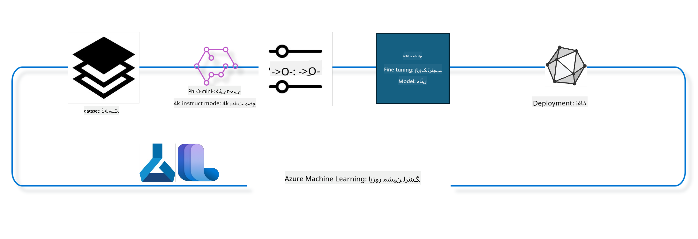

<!--
CO_OP_TRANSLATOR_METADATA:
{
  "original_hash": "944949f040e61b2ea25b3460f7394fd4",
  "translation_date": "2025-05-07T13:21:29+00:00",
  "source_file": "md/03.FineTuning/FineTuning_MLSDK.md",
  "language_code": "ur"
}
-->
## כיצד להשתמש ברכיבי chat-completion מרגיסטר מערכת Azure ML כדי לכוונן מודל

בדוגמה זו נבצע כוונון עדין למודל Phi-3-mini-4k-instruct כדי להשלים שיחה בין שני אנשים באמצעות מערך הנתונים ultrachat_200k.



הדוגמה תראה כיצד לבצע כוונון עדין באמצעות Azure ML SDK ו-Python ואז לפרוס את המודל המכוונן לנקודת קצה מקוונת להסקת מסקנות בזמן אמת.

### נתוני אימון

נשתמש במערך הנתונים ultrachat_200k. זהו גרסה מסוננת מאוד של מערך הנתונים UltraChat ששימשה לאימון Zephyr-7B-β, מודל שיחה מתקדם בגודל 7 מיליארד פרמטרים.

### מודל

נשתמש במודל Phi-3-mini-4k-instruct כדי להראות כיצד משתמש יכול לכוונן מודל למשימת chat-completion. אם פתחת את המחברת הזו מכרטיס מודל ספציפי, זכור להחליף את שם המודל הספציפי.

### משימות

- לבחור מודל לכוונון עדין.
- לבחור ולחקור את נתוני האימון.
- להגדיר את משימת הכוונון העדין.
- להריץ את משימת הכוונון העדין.
- לסקור מדדי אימון והערכה.
- לרשום את המודל המכוונן.
- לפרוס את המודל המכוונן להסקה בזמן אמת.
- לנקות משאבים.

## 1. הגדרת דרישות מוקדמות

- התקן תלותיות
- התחבר ל-AzureML Workspace. למידע נוסף ראה הגדרת אימות SDK. החלף את <WORKSPACE_NAME>, <RESOURCE_GROUP> ו-<SUBSCRIPTION_ID> למטה.
- התחבר לרגיסטר מערכת azureml
- הגדר שם ניסוי אופציונלי
- בדוק או צור מחשוב.

> [!NOTE]
> דרישות: צומת GPU יחיד יכול להכיל מספר כרטיסי GPU. לדוגמה, בצומת אחד של Standard_NC24rs_v3 יש 4 כרטיסי NVIDIA V100 בעוד שב-Standard_NC12s_v3 יש 2 כרטיסים כאלה. עיין בתיעוד למידע זה. מספר כרטיסי ה-GPU לכל צומת מוגדר בפרמטר gpus_per_node למטה. הגדרה נכונה של ערך זה תבטיח ניצול מלא של כל ה-GPU בצומת. ניתן למצוא SKU מומלצים למחשוב GPU כאן וכאן.

### ספריות Python

התקן תלותיות על ידי הרצת התא למטה. זה אינו שלב אופציונלי בסביבה חדשה.

```bash
pip install azure-ai-ml
pip install azure-identity
pip install datasets==2.9.0
pip install mlflow
pip install azureml-mlflow
```

### אינטראקציה עם Azure ML

1. סקריפט Python זה משמש לאינטראקציה עם שירות Azure Machine Learning (Azure ML). להלן פירוט מה הוא עושה:

    - מייבא מודולים נחוצים מ-packages azure.ai.ml, azure.identity ו-azure.ai.ml.entities. כמו כן מייבא את מודול time.

    - מנסה לאמת באמצעות DefaultAzureCredential(), שמספק חווית אימות פשוטה להתחלת פיתוח יישומים הפועלים בענן Azure. אם זה נכשל, הוא מפנה ל-InteractiveBrowserCredential(), שמספקת תהליך התחברות אינטראקטיבי.

    - לאחר מכן מנסה ליצור מופע MLClient באמצעות from_config, שקורא את ההגדרות מקובץ ברירת המחדל (config.json). אם זה נכשל, הוא יוצר מופע MLClient על ידי מתן subscription_id, resource_group_name ו-workspace_name ידנית.

    - יוצר מופע נוסף של MLClient עבור רגיסטר Azure ML בשם "azureml". רגיסטר זה משמש לאחסון מודלים, צינורות כוונון עדין וסביבות.

    - מגדיר את experiment_name ל-"chat_completion_Phi-3-mini-4k-instruct".

    - יוצר חותמת זמן ייחודית על ידי המרת הזמן הנוכחי (בשניות מאז האפוק, כמספר עשרוני) למספר שלם ואז למחרוזת. חותמת זמן זו משמשת ליצירת שמות וגרסאות ייחודיים.

    ```python
    # Import necessary modules from Azure ML and Azure Identity
    from azure.ai.ml import MLClient
    from azure.identity import (
        DefaultAzureCredential,
        InteractiveBrowserCredential,
    )
    from azure.ai.ml.entities import AmlCompute
    import time  # Import time module
    
    # Try to authenticate using DefaultAzureCredential
    try:
        credential = DefaultAzureCredential()
        credential.get_token("https://management.azure.com/.default")
    except Exception as ex:  # If DefaultAzureCredential fails, use InteractiveBrowserCredential
        credential = InteractiveBrowserCredential()
    
    # Try to create an MLClient instance using the default config file
    try:
        workspace_ml_client = MLClient.from_config(credential=credential)
    except:  # If that fails, create an MLClient instance by manually providing the details
        workspace_ml_client = MLClient(
            credential,
            subscription_id="<SUBSCRIPTION_ID>",
            resource_group_name="<RESOURCE_GROUP>",
            workspace_name="<WORKSPACE_NAME>",
        )
    
    # Create another MLClient instance for the Azure ML registry named "azureml"
    # This registry is where models, fine-tuning pipelines, and environments are stored
    registry_ml_client = MLClient(credential, registry_name="azureml")
    
    # Set the experiment name
    experiment_name = "chat_completion_Phi-3-mini-4k-instruct"
    
    # Generate a unique timestamp that can be used for names and versions that need to be unique
    timestamp = str(int(time.time()))
    ```

## 2. בחר מודל בסיס לכוונון עדין

1. Phi-3-mini-4k-instruct הוא מודל קל משקל עם 3.8 מיליארד פרמטרים, פתוח ומתקדם, שנבנה על מערכי הנתונים ששימשו את Phi-2. המודל שייך למשפחת מודלי Phi-3, וגרסת Mini מגיעה בשתי וריאציות: 4K ו-128K, שמתייחס לאורך ההקשר (במונחי טוקנים) שהמודל תומך בו. יש לכוונן את המודל למטרה הספציפית שלנו כדי להשתמש בו. ניתן לעיין במודלים אלו בקטלוג המודלים ב-AzureML Studio, עם סינון לפי משימת chat-completion. בדוגמה זו אנו משתמשים במודל Phi-3-mini-4k-instruct. אם פתחת מחברת זו למודל אחר, החלף את שם המודל והגרסה בהתאם.

    > [!NOTE]
    > מאפיין id של המודל. זה יועבר כקלט למשימת הכוונון העדין. זמין גם כשדה Asset ID בדף פרטי המודל בקטלוג המודלים של AzureML Studio.

2. סקריפט Python זה מתקשר עם שירות Azure Machine Learning (Azure ML). להלן פירוט מה הוא עושה:

    - מגדיר את model_name ל-"Phi-3-mini-4k-instruct".

    - משתמש במתודה get של models ברגיסטר_ml_client כדי לקבל את הגרסה העדכנית ביותר של המודל בשם זה מהרשום ב-Azure ML registry. המתודה נקראת עם שני ארגומנטים: שם המודל ותווית שמציינת לקבל את הגרסה העדכנית ביותר.

    - מדפיס הודעה לקונסולה שמציינת את השם, הגרסה וה-id של המודל שישמש לכוונון עדין. משתמש במתודת format של המחרוזת כדי להכניס את השם, הגרסה וה-id של המודל להודעה. השם, הגרסה וה-id ניגשים כמאפיינים של foundation_model.

    ```python
    # Set the model name
    model_name = "Phi-3-mini-4k-instruct"
    
    # Get the latest version of the model from the Azure ML registry
    foundation_model = registry_ml_client.models.get(model_name, label="latest")
    
    # Print the model name, version, and id
    # This information is useful for tracking and debugging
    print(
        "\n\nUsing model name: {0}, version: {1}, id: {2} for fine tuning".format(
            foundation_model.name, foundation_model.version, foundation_model.id
        )
    )
    ```

## 3. צור מחשוב לשימוש במשימה

משימת הכוונון העדין פועלת רק עם מחשוב GPU. גודל המחשוב תלוי בגודל המודל וברוב המקרים קשה לזהות את המחשוב המתאים למשימה. בתא זה אנו מדריכים את המשתמש לבחור את המחשוב המתאים.

> [!NOTE]
> המחשובים המפורטים למטה פועלים עם התצורה האופטימלית ביותר. כל שינוי בתצורה עלול לגרום לשגיאת Cuda Out Of Memory. במקרים כאלה נסה לשדרג למחשוב גדול יותר.

> [!NOTE]
> בעת בחירת compute_cluster_size למטה, ודא שהמחשוב זמין בקבוצת המשאבים שלך. אם מחשוב מסוים אינו זמין, ניתן לבקש גישה למשאבי המחשוב.

### בדיקת תמיכה בכוונון עדין למודל

1. סקריפט Python זה מתקשר למודל Azure Machine Learning (Azure ML). להלן פירוט מה הוא עושה:

    - מייבא את מודול ast, המספק פונקציות לעיבוד עצי תחביר מופשט של Python.

    - בודק אם לאובייקט foundation_model (המשקף מודל ב-Azure ML) יש תג בשם finetune_compute_allow_list. תגיות ב-Azure ML הן זוגות מפתח-ערך שניתן ליצור ולסנן באמצעותן מודלים.

    - אם תג finetune_compute_allow_list קיים, משתמש ב-ast.literal_eval כדי לפרש בבטחה את ערך התג (מחרוזת) לרשימת Python. רשימה זו מוקצת למשתנה computes_allow_list. לאחר מכן מדפיס הודעה שממליצה ליצור מחשוב מתוך הרשימה.

    - אם התג לא קיים, מגדיר את computes_allow_list ל-None ומדפיס הודעה שהתג אינו חלק מתגי המודל.

    - לסיכום, הסקריפט בודק תג מסוים במטא-נתוני המודל, ממיר את ערכו לרשימה אם קיים, ומספק משוב למשתמש בהתאם.

    ```python
    # Import the ast module, which provides functions to process trees of the Python abstract syntax grammar
    import ast
    
    # Check if the 'finetune_compute_allow_list' tag is present in the model's tags
    if "finetune_compute_allow_list" in foundation_model.tags:
        # If the tag is present, use ast.literal_eval to safely parse the tag's value (a string) into a Python list
        computes_allow_list = ast.literal_eval(
            foundation_model.tags["finetune_compute_allow_list"]
        )  # convert string to python list
        # Print a message indicating that a compute should be created from the list
        print(f"Please create a compute from the above list - {computes_allow_list}")
    else:
        # If the tag is not present, set computes_allow_list to None
        computes_allow_list = None
        # Print a message indicating that the 'finetune_compute_allow_list' tag is not part of the model's tags
        print("`finetune_compute_allow_list` is not part of model tags")
    ```

### בדיקת מופע מחשוב

1. סקריפט Python זה מתקשר לשירות Azure Machine Learning (Azure ML) ומבצע מספר בדיקות על מופע מחשוב. להלן פירוט מה הוא עושה:

    - מנסה לקבל את מופע המחשוב בשם המאוחסן ב-compute_cluster מ-Azure ML workspace. אם מצב ההקצאה של המופע הוא "failed", הוא מעלה ValueError.

    - בודק אם computes_allow_list אינו None. אם כן, ממיר את כל גדלי המחשוב ברשימה לאותיות קטנות ובודק אם גודל המופע הנוכחי נמצא ברשימה. אם לא, מעלה ValueError.

    - אם computes_allow_list הוא None, בודק אם גודל המופע נמצא ברשימת גדלים של VM GPU שאינם נתמכים. אם כן, מעלה ValueError.

    - מקבל רשימה של כל גדלי המחשוב הזמינים ב-workspace. עובר על הרשימה ובודק אם שם כל גודל תואם לגודל המופע הנוכחי. אם כן, מקבל את מספר ה-GPU של אותו גודל ומגדיר gpu_count_found ל-True.

    - אם gpu_count_found הוא True, מדפיס את מספר ה-GPU במופע. אם False, מעלה ValueError.

    - לסיכום, הסקריפט מבצע בדיקות שונות על מופע מחשוב ב-Azure ML workspace, כולל בדיקת מצב הקצאה, גודל מול רשימות מורשות או אסורות, ומספר ה-GPU.

    ```python
    # Print the exception message
    print(e)
    # Raise a ValueError if the compute size is not available in the workspace
    raise ValueError(
        f"WARNING! Compute size {compute_cluster_size} not available in workspace"
    )
    
    # Retrieve the compute instance from the Azure ML workspace
    compute = workspace_ml_client.compute.get(compute_cluster)
    # Check if the provisioning state of the compute instance is "failed"
    if compute.provisioning_state.lower() == "failed":
        # Raise a ValueError if the provisioning state is "failed"
        raise ValueError(
            f"Provisioning failed, Compute '{compute_cluster}' is in failed state. "
            f"please try creating a different compute"
        )
    
    # Check if computes_allow_list is not None
    if computes_allow_list is not None:
        # Convert all compute sizes in computes_allow_list to lowercase
        computes_allow_list_lower_case = [x.lower() for x in computes_allow_list]
        # Check if the size of the compute instance is in computes_allow_list_lower_case
        if compute.size.lower() not in computes_allow_list_lower_case:
            # Raise a ValueError if the size of the compute instance is not in computes_allow_list_lower_case
            raise ValueError(
                f"VM size {compute.size} is not in the allow-listed computes for finetuning"
            )
    else:
        # Define a list of unsupported GPU VM sizes
        unsupported_gpu_vm_list = [
            "standard_nc6",
            "standard_nc12",
            "standard_nc24",
            "standard_nc24r",
        ]
        # Check if the size of the compute instance is in unsupported_gpu_vm_list
        if compute.size.lower() in unsupported_gpu_vm_list:
            # Raise a ValueError if the size of the compute instance is in unsupported_gpu_vm_list
            raise ValueError(
                f"VM size {compute.size} is currently not supported for finetuning"
            )
    
    # Initialize a flag to check if the number of GPUs in the compute instance has been found
    gpu_count_found = False
    # Retrieve a list of all available compute sizes in the workspace
    workspace_compute_sku_list = workspace_ml_client.compute.list_sizes()
    available_sku_sizes = []
    # Iterate over the list of available compute sizes
    for compute_sku in workspace_compute_sku_list:
        available_sku_sizes.append(compute_sku.name)
        # Check if the name of the compute size matches the size of the compute instance
        if compute_sku.name.lower() == compute.size.lower():
            # If it does, retrieve the number of GPUs for that compute size and set gpu_count_found to True
            gpus_per_node = compute_sku.gpus
            gpu_count_found = True
    # If gpu_count_found is True, print the number of GPUs in the compute instance
    if gpu_count_found:
        print(f"Number of GPU's in compute {compute.size}: {gpus_per_node}")
    else:
        # If gpu_count_found is False, raise a ValueError
        raise ValueError(
            f"Number of GPU's in compute {compute.size} not found. Available skus are: {available_sku_sizes}."
            f"This should not happen. Please check the selected compute cluster: {compute_cluster} and try again."
        )
    ```

## 4. בחר את מערך הנתונים לכוונון עדין של המודל

1. אנו משתמשים במערך הנתונים ultrachat_200k. למערך הנתונים יש ארבע חלוקות, המתאימות לכוונון עדין מפוקח (sft).
דירוג יצירה (gen). מספר הדוגמאות בכל חלוקה מוצג כך:

    ```bash
    train_sft test_sft  train_gen  test_gen
    207865  23110  256032  28304
    ```

1. התאים הבאים מציגים הכנה בסיסית של נתונים לכוונון עדין:

### הצגת שורות נתונים

רוצים שהדוגמה תרוץ מהר, לכן נשמור קבצי train_sft ו-test_sft המכילים 5% מהשורות שכבר סוננו. משמעות הדבר היא שהמודל המכוונן יהיה פחות מדויק ולכן לא כדאי להשתמש בו במציאות.
הסקריפט download-dataset.py משמש להורדת מערך הנתונים ultrachat_200k ולהמרת הנתונים לפורמט המתאים לצינור כוונון עדין. בנוסף, מאחר שהמערך גדול, כאן יש רק חלק ממנו.

1. הרצת הסקריפט למטה מורידה רק 5% מהנתונים. ניתן להגדיל זאת על ידי שינוי הפרמטר dataset_split_pc לאחוז הרצוי.

    > [!NOTE]
    > למודלים בשפות שונות יש קודי שפה שונים ולכן שמות העמודות במערך הנתונים צריכים לשקף זאת.

1. להלן דוגמה למראה הנתונים
מערך הנתונים של chat-completion מאוחסן בפורמט parquet כאשר כל רשומה משתמשת בסכימה הבאה:

    - זהו מסמך JSON (JavaScript Object Notation), פורמט פופולרי להחלפת מידע. זה אינו קוד להרצה, אלא דרך לאחסן ולהעביר נתונים. להלן פירוט המבנה:

    - "prompt": מפתח שמכיל מחרוזת המתארת משימה או שאלה שמופנית לעוזר AI.

    - "messages": מפתח שמכיל מערך של אובייקטים. כל אובייקט מייצג הודעה בשיחה בין משתמש לעוזר AI. לכל הודעה שני מפתחות:

    - "content": מפתח עם מחרוזת שמכילה את תוכן ההודעה.
    - "role": מפתח עם מחרוזת שמייצגת את תפקיד השולח, "user" או "assistant".
    - "prompt_id": מפתח שמכיל מזהה ייחודי להנחיה.

1. במסמך JSON זה, מוצגת שיחה שבה משתמש מבקש מהעוזר ליצור גיבור לסיפור דיסטופי. העוזר מגיב, והמשתמש מבקש פרטים נוספים. העוזר מסכים לספק פרטים נוספים. כל השיחה מקושרת למזהה הנחיה ספציפי.

    ```python
    {
        // The task or question posed to an AI assistant
        "prompt": "Create a fully-developed protagonist who is challenged to survive within a dystopian society under the rule of a tyrant. ...",
        
        // An array of objects, each representing a message in a conversation between a user and an AI assistant
        "messages":[
            {
                // The content of the user's message
                "content": "Create a fully-developed protagonist who is challenged to survive within a dystopian society under the rule of a tyrant. ...",
                // The role of the entity that sent the message
                "role": "user"
            },
            {
                // The content of the assistant's message
                "content": "Name: Ava\n\n Ava was just 16 years old when the world as she knew it came crashing down. The government had collapsed, leaving behind a chaotic and lawless society. ...",
                // The role of the entity that sent the message
                "role": "assistant"
            },
            {
                // The content of the user's message
                "content": "Wow, Ava's story is so intense and inspiring! Can you provide me with more details.  ...",
                // The role of the entity that sent the message
                "role": "user"
            }, 
            {
                // The content of the assistant's message
                "content": "Certainly! ....",
                // The role of the entity that sent the message
                "role": "assistant"
            }
        ],
        
        // A unique identifier for the prompt
        "prompt_id": "d938b65dfe31f05f80eb8572964c6673eddbd68eff3db6bd234d7f1e3b86c2af"
    }
    ```

### הורדת נתונים

1. סקריפט Python זה משמש להורדת מערך נתונים באמצעות סקריפט עזר בשם download-dataset.py. להלן פירוט מה הוא עושה:

    - מייבא את מודול os, המספק ממשק נייד לתפקודי מערכת הפעלה.

    - משתמש בפונקציה os.system להריץ את הסקריפט download-dataset.py עם ארגומנטים בשורת הפקודה. הארגומנטים מציינים את מערך הנתונים להורדה (HuggingFaceH4/ultrachat_200k), את התיקייה להורדה (ultrachat_200k_dataset), ואת אחוז החלוקה (5). הפונקציה מחזירה את סטטוס היציאה של הפקודה; סטטוס זה נשמר במשתנה exit_status.

    - בודק אם exit_status שונה מ-0. במערכות דמויות יוניקס, סטטוס 0 מציין הצלחה, ואחר מציין שגיאה. אם סטטוס שונה מ-0, מעלה חריגה עם הודעה על שגיאה בהורדת מערך הנתונים.

    - לסיכום, הסקריפט מריץ פקודה להורדת מערך נתונים באמצעות סקריפט עזר ומעלה חריגה במקרה כשל.

    ```python
    # Import the os module, which provides a way of using operating system dependent functionality
    import os
    
    # Use the os.system function to run the download-dataset.py script in the shell with specific command-line arguments
    # The arguments specify the dataset to download (HuggingFaceH4/ultrachat_200k), the directory to download it to (ultrachat_200k_dataset), and the percentage of the dataset to split (5)
    # The os.system function returns the exit status of the command it executed; this status is stored in the exit_status variable
    exit_status = os.system(
        "python ./download-dataset.py --dataset HuggingFaceH4/ultrachat_200k --download_dir ultrachat_200k_dataset --dataset_split_pc 5"
    )
    
    # Check if exit_status is not 0
    # In Unix-like operating systems, an exit status of 0 usually indicates that a command has succeeded, while any other number indicates an error
    # If exit_status is not 0, raise an Exception with a message indicating that there was an error downloading the dataset
    if exit_status != 0:
        raise Exception("Error downloading dataset")
    ```

### טעינת נתונים ל-DataFrame

1. סקריפט Python זה טוען קובץ JSON Lines ל-pandas DataFrame ומציג את 5 השורות הראשונות. להלן פירוט מה הוא עושה:

    - מייבא את ספריית pandas, המאפשרת ניתוח ועיבוד נתונים עוצמתי.

    - מגדיר את רוחב העמודה המרבי להצגה ב-pandas ל-0, כלומר יציג את כל הטקסט בעמודות ללא קיצור.

    - משתמש בפונקציה pd.read_json לטעון את הקובץ train_sft.jsonl מתיקיית ultrachat_200k_dataset ל-DataFrame. הפרמטר lines=True מציין שמדובר בקובץ JSON Lines, שבו כל שורה היא אובייקט JSON נפרד.

    - משתמש במתודת head להצגת 5 השורות הראשונות. אם יש פחות מ-5 שורות, יציג את כולן.

    - לסיכום, הסקריפט טוען קובץ JSON Lines ל-DataFrame ומציג את 5 השורות הראשונות עם טקסט מלא בעמודות.

    ```python
    # Import the pandas library, which is a powerful data manipulation and analysis library
    import pandas as pd
    
    # Set the maximum column width for pandas' display options to 0
    # This means that the full text of each column will be displayed without truncation when the DataFrame is printed
    pd.set_option("display.max_colwidth", 0)
    
    # Use the pd.read_json function to load the train_sft.jsonl file from the ultrachat_200k_dataset directory into a DataFrame
    # The lines=True argument indicates that the file is in JSON Lines format, where each line is a separate JSON object
    df = pd.read_json("./ultrachat_200k_dataset/train_sft.jsonl", lines=True)
    
    # Use the head method to display the first 5 rows of the DataFrame
    # If the DataFrame has less than 5 rows, it will display all of them
    df.head()
    ```

## 5. הגש את משימת הכוונון העדין באמצעות המודל והנתונים כקלטים

צור משימה המשתמשת ברכיב צינור chat-completion. למידע נוסף על כל הפרמטרים הנתמכים לכוונון עדין.

### הגדרת פרמטרי כוונון עדין

1. פרמטרי הכוונון העדין נחלקים לשתי קטגוריות - פרמטרי אימון ופרמטרי אופטימיזציה

1. פרמטרי האימון מגדירים היבטים של האימון כגון -

    - האופטימייזר, המתזמן לשימוש
    - המדד לאופטימיזציה בכוונון העדין
    - מספר שלבי האימון וגודל האצווה ועוד
    - פרמטרי האופטימיזציה מסייעים באופטימיזציה של זיכרון ה-GPU ושימוש יעיל במשאבי המחשוב.

1. להלן כמה מהפרמטרים בקטגוריה זו. פרמטרי האופטימיזציה משתנים בין מודלים ונכללים בחבילה עם המודל כדי לטפל בשינויים אלו.

    - הפעלת deepspeed ו-LoRA
    - הפעלת אימון דיוק מעורב
    - הפעלת אימון מרובה צמתים

> [!NOTE]
> כוונון מפוקח עלול לגרום לאובדן יישור או שכחה קטסטרופלית. מומלץ לבדוק בעיה זו ולהריץ שלב יישור לאחר הכוונון.

### פרמטרי כוונון עדין

1. סקריפט Python זה מגדיר פרמטרים לכוונון עדין של מודל למידת מכונה. להלן פירוט מה הוא עושה:

    - מגדיר פרמטרי אימון ברירת מחדל כמו מספר אפוקים, גדלי אצווה לאימון והערכה, שיעור הלמידה וסוג מתזמן שיעור הלמידה.

    - מגדיר פרמטרי אופטימיזציה ברירת מחדל כגון הפעלת LoRa ו-DeepSpeed, ושלב DeepSpeed.

    - מאחד את פרמטרי האימון והאופטימיזציה למילון אחד בשם finetune_parameters.

    - בודק אם ל-foundation_model יש פרמטרי ברירת מחדל ספציפיים למודל. אם כן, מדפיס אזהרה ומעדכן את finetune_parameters עם פרמטרים אלו. משתמש ב-ast.literal_eval כדי להמיר את הפרמטרים ממחרוזת למילון Python.

    - מדפיס את קבוצת הפרמטרים הסופית שתשמש בהרצה.

    - לסיכום, הסקריפט מגדיר ומציג את פרמטרי הכוונ
based on various parameters, and then printing this display name. ```python
    # Define a function to generate a display name for the training pipeline
    def get_pipeline_display_name():
        # Calculate the total batch size by multiplying the per-device batch size, the number of gradient accumulation steps, the number of GPUs per node, and the number of nodes used for fine-tuning
        batch_size = (
            int(finetune_parameters.get("per_device_train_batch_size", 1))
            * int(finetune_parameters.get("gradient_accumulation_steps", 1))
            * int(gpus_per_node)
            * int(finetune_parameters.get("num_nodes_finetune", 1))
        )
        # Retrieve the learning rate scheduler type
        scheduler = finetune_parameters.get("lr_scheduler_type", "linear")
        # Retrieve whether DeepSpeed is applied
        deepspeed = finetune_parameters.get("apply_deepspeed", "false")
        # Retrieve the DeepSpeed stage
        ds_stage = finetune_parameters.get("deepspeed_stage", "2")
        # If DeepSpeed is applied, include "ds" followed by the DeepSpeed stage in the display name; if not, include "nods"
        if deepspeed == "true":
            ds_string = f"ds{ds_stage}"
        else:
            ds_string = "nods"
        # Retrieve whether Layer-wise Relevance Propagation (LoRa) is applied
        lora = finetune_parameters.get("apply_lora", "false")
        # If LoRa is applied, include "lora" in the display name; if not, include "nolora"
        if lora == "true":
            lora_string = "lora"
        else:
            lora_string = "nolora"
        # Retrieve the limit on the number of model checkpoints to keep
        save_limit = finetune_parameters.get("save_total_limit", -1)
        # Retrieve the maximum sequence length
        seq_len = finetune_parameters.get("max_seq_length", -1)
        # Construct the display name by concatenating all these parameters, separated by hyphens
        return (
            model_name
            + "-"
            + "ultrachat"
            + "-"
            + f"bs{batch_size}"
            + "-"
            + f"{scheduler}"
            + "-"
            + ds_string
            + "-"
            + lora_string
            + f"-save_limit{save_limit}"
            + f"-seqlen{seq_len}"
        )
    
    # Call the function to generate the display name
    pipeline_display_name = get_pipeline_display_name()
    # Print the display name
    print(f"Display name used for the run: {pipeline_display_name}")
    ``` ### Configuring Pipeline یہ Python اسکرپٹ Azure Machine Learning SDK کا استعمال کرتے ہوئے ایک مشین لرننگ پائپ لائن کو ڈیفائن اور کنفیگر کر رہا ہے۔ یہ اس کے کام کا خلاصہ ہے: 1. یہ Azure AI ML SDK سے ضروری ماڈیولز کو امپورٹ کرتا ہے۔ 1. یہ رجسٹری سے "chat_completion_pipeline" نامی پائپ لائن کمپونینٹ کو حاصل کرتا ہے۔ 1. یہ `@pipeline` decorator and the function `create_pipeline`. The name of the pipeline is set to `pipeline_display_name`.

1. Inside the `create_pipeline` function, it initializes the fetched pipeline component with various parameters, including the model path, compute clusters for different stages, dataset splits for training and testing, the number of GPUs to use for fine-tuning, and other fine-tuning parameters.

1. It maps the output of the fine-tuning job to the output of the pipeline job. This is done so that the fine-tuned model can be easily registered, which is required to deploy the model to an online or batch endpoint.

1. It creates an instance of the pipeline by calling the `create_pipeline` function.

1. It sets the `force_rerun` setting of the pipeline to `True`, meaning that cached results from previous jobs will not be used.

1. It sets the `continue_on_step_failure` setting of the pipeline to `False` کا استعمال کرتے ہوئے ایک پائپ لائن جاب ڈیفائن کرتا ہے، جس کا مطلب ہے کہ اگر کوئی بھی قدم ناکام ہو تو پائپ لائن رک جائے گی۔ 1. خلاصہ یہ ہے کہ یہ اسکرپٹ Azure Machine Learning SDK کا استعمال کرتے ہوئے چیٹ کمپلیشن ٹاسک کے لیے ایک مشین لرننگ پائپ لائن کو ڈیفائن اور کنفیگر کر رہا ہے۔ ```python
    # Import necessary modules from the Azure AI ML SDK
    from azure.ai.ml.dsl import pipeline
    from azure.ai.ml import Input
    
    # Fetch the pipeline component named "chat_completion_pipeline" from the registry
    pipeline_component_func = registry_ml_client.components.get(
        name="chat_completion_pipeline", label="latest"
    )
    
    # Define the pipeline job using the @pipeline decorator and the function create_pipeline
    # The name of the pipeline is set to pipeline_display_name
    @pipeline(name=pipeline_display_name)
    def create_pipeline():
        # Initialize the fetched pipeline component with various parameters
        # These include the model path, compute clusters for different stages, dataset splits for training and testing, the number of GPUs to use for fine-tuning, and other fine-tuning parameters
        chat_completion_pipeline = pipeline_component_func(
            mlflow_model_path=foundation_model.id,
            compute_model_import=compute_cluster,
            compute_preprocess=compute_cluster,
            compute_finetune=compute_cluster,
            compute_model_evaluation=compute_cluster,
            # Map the dataset splits to parameters
            train_file_path=Input(
                type="uri_file", path="./ultrachat_200k_dataset/train_sft.jsonl"
            ),
            test_file_path=Input(
                type="uri_file", path="./ultrachat_200k_dataset/test_sft.jsonl"
            ),
            # Training settings
            number_of_gpu_to_use_finetuning=gpus_per_node,  # Set to the number of GPUs available in the compute
            **finetune_parameters
        )
        return {
            # Map the output of the fine tuning job to the output of pipeline job
            # This is done so that we can easily register the fine tuned model
            # Registering the model is required to deploy the model to an online or batch endpoint
            "trained_model": chat_completion_pipeline.outputs.mlflow_model_folder
        }
    
    # Create an instance of the pipeline by calling the create_pipeline function
    pipeline_object = create_pipeline()
    
    # Don't use cached results from previous jobs
    pipeline_object.settings.force_rerun = True
    
    # Set continue on step failure to False
    # This means that the pipeline will stop if any step fails
    pipeline_object.settings.continue_on_step_failure = False
    ``` ### Submit the Job 1. یہ Python اسکرپٹ Azure Machine Learning ورک اسپیس کو ایک مشین لرننگ پائپ لائن جاب سبمٹ کر رہا ہے اور پھر جاب کے مکمل ہونے کا انتظار کر رہا ہے۔ یہ اس کے کام کا خلاصہ ہے: - یہ workspace_ml_client کے jobs آبجیکٹ کی create_or_update میتھڈ کو کال کرتا ہے تاکہ پائپ لائن جاب سبمٹ کی جا سکے۔ چلانے کے لیے پائپ لائن pipeline_object سے مخصوص کی گئی ہے، اور جاب جس تجربے کے تحت چلائی جا رہی ہے وہ experiment_name سے معلوم ہوتی ہے۔ - پھر یہ workspace_ml_client کے jobs آبجیکٹ کی stream میتھڈ کو کال کرتا ہے تاکہ پائپ لائن جاب کے مکمل ہونے کا انتظار کیا جا سکے۔ انتظار کرنے والی جاب pipeline_job آبجیکٹ کے name اٹریبیوٹ سے مخصوص کی گئی ہے۔ - خلاصہ یہ ہے کہ یہ اسکرپٹ Azure Machine Learning ورک اسپیس کو مشین لرننگ پائپ لائن جاب سبمٹ کر رہا ہے اور پھر جاب کے مکمل ہونے کا انتظار کر رہا ہے۔ ```python
    # Submit the pipeline job to the Azure Machine Learning workspace
    # The pipeline to be run is specified by pipeline_object
    # The experiment under which the job is run is specified by experiment_name
    pipeline_job = workspace_ml_client.jobs.create_or_update(
        pipeline_object, experiment_name=experiment_name
    )
    
    # Wait for the pipeline job to complete
    # The job to wait for is specified by the name attribute of the pipeline_job object
    workspace_ml_client.jobs.stream(pipeline_job.name)
    ``` ## 6. Register the fine tuned model with the workspace ہم fine tuning جاب کے آؤٹ پٹ سے ماڈل کو رجسٹر کریں گے۔ یہ fine tuned ماڈل اور fine tuning جاب کے درمیان lineage کو ٹریک کرے گا۔ fine tuning جاب مزید بنیاد ماڈل، ڈیٹا اور ٹریننگ کوڈ کے lineage کو بھی ٹریک کرتا ہے۔ ### Registering the ML Model 1. یہ Python اسکرپٹ Azure Machine Learning پائپ لائن میں ٹرینڈ کیے گئے مشین لرننگ ماڈل کو رجسٹر کر رہا ہے۔ یہ اس کے کام کا خلاصہ ہے: - یہ Azure AI ML SDK سے ضروری ماڈیولز کو امپورٹ کرتا ہے۔ - یہ چیک کرتا ہے کہ آیا pipeline job سے trained_model آؤٹ پٹ دستیاب ہے یا نہیں، جو workspace_ml_client کے jobs آبجیکٹ کی get میتھڈ کال کر کے اور اس کے outputs اٹریبیوٹ کو ایکسیس کر کے معلوم کیا جاتا ہے۔ - یہ پائپ لائن جاب کے نام اور آؤٹ پٹ ("trained_model") کے نام کو فارمیٹ کر کے ٹرینڈ ماڈل کا راستہ بناتا ہے۔ - یہ fine-tuned ماڈل کے لیے ایک نام ڈیفائن کرتا ہے جو اصل ماڈل کے نام کے آخر میں "-ultrachat-200k" لگا کر اور کسی بھی سلیش کو ہائفن سے بدل کر بنایا جاتا ہے۔ - یہ ماڈل کو رجسٹر کرنے کے لیے ایک Model آبجیکٹ تیار کرتا ہے جس میں ماڈل کا راستہ، ماڈل کی قسم (MLflow ماڈل)، ماڈل کا نام اور ورژن، اور ماڈل کی تفصیل شامل ہیں۔ - یہ workspace_ml_client کے models آبجیکٹ کی create_or_update میتھڈ کو کال کر کے ماڈل کو رجسٹر کرتا ہے، اور Model آبجیکٹ کو آرگیومنٹ کے طور پر دیتا ہے۔ - یہ رجسٹر شدہ ماڈل کو پرنٹ کرتا ہے۔ 1. خلاصہ یہ ہے کہ یہ اسکرپٹ Azure Machine Learning پائپ لائن میں ٹرینڈ کیے گئے مشین لرننگ ماڈل کو رجسٹر کر رہا ہے۔ ```python
    # Import necessary modules from the Azure AI ML SDK
    from azure.ai.ml.entities import Model
    from azure.ai.ml.constants import AssetTypes
    
    # Check if the `trained_model` output is available from the pipeline job
    print("pipeline job outputs: ", workspace_ml_client.jobs.get(pipeline_job.name).outputs)
    
    # Construct a path to the trained model by formatting a string with the name of the pipeline job and the name of the output ("trained_model")
    model_path_from_job = "azureml://jobs/{0}/outputs/{1}".format(
        pipeline_job.name, "trained_model"
    )
    
    # Define a name for the fine-tuned model by appending "-ultrachat-200k" to the original model name and replacing any slashes with hyphens
    finetuned_model_name = model_name + "-ultrachat-200k"
    finetuned_model_name = finetuned_model_name.replace("/", "-")
    
    print("path to register model: ", model_path_from_job)
    
    # Prepare to register the model by creating a Model object with various parameters
    # These include the path to the model, the type of the model (MLflow model), the name and version of the model, and a description of the model
    prepare_to_register_model = Model(
        path=model_path_from_job,
        type=AssetTypes.MLFLOW_MODEL,
        name=finetuned_model_name,
        version=timestamp,  # Use timestamp as version to avoid version conflict
        description=model_name + " fine tuned model for ultrachat 200k chat-completion",
    )
    
    print("prepare to register model: \n", prepare_to_register_model)
    
    # Register the model by calling the create_or_update method of the models object in the workspace_ml_client with the Model object as the argument
    registered_model = workspace_ml_client.models.create_or_update(
        prepare_to_register_model
    )
    
    # Print the registered model
    print("registered model: \n", registered_model)
    ``` ## 7. Deploy the fine tuned model to an online endpoint آن لائن اینڈ پوائنٹس ایک مضبوط REST API فراہم کرتے ہیں جو ایپلیکیشنز کے ساتھ انٹیگریٹ کرنے کے لیے استعمال ہو سکتا ہے جو ماڈل کو استعمال کرنا چاہتی ہیں۔ ### Manage Endpoint 1. یہ Python اسکرپٹ Azure Machine Learning میں رجسٹر شدہ ماڈل کے لیے ایک منیجڈ آن لائن اینڈ پوائنٹ بنا رہا ہے۔ یہ اس کے کام کا خلاصہ ہے: - یہ Azure AI ML SDK سے ضروری ماڈیولز کو امپورٹ کرتا ہے۔ - یہ آن لائن اینڈ پوائنٹ کے لیے ایک منفرد نام ڈیفائن کرتا ہے جو "ultrachat-completion-" کے بعد ٹائم اسٹیمپ لگا کر بنایا جاتا ہے۔ - یہ ManagedOnlineEndpoint آبجیکٹ بنا کر آن لائن اینڈ پوائنٹ بنانے کی تیاری کرتا ہے، جس میں اینڈ پوائنٹ کا نام، تفصیل، اور authentication موڈ ("key") شامل ہیں۔ - یہ workspace_ml_client کی begin_create_or_update میتھڈ کو کال کر کے آن لائن اینڈ پوائنٹ بناتا ہے اور پھر wait میتھڈ کال کر کے اس کے مکمل ہونے کا انتظار کرتا ہے۔ 1. خلاصہ یہ ہے کہ یہ اسکرپٹ Azure Machine Learning میں رجسٹر شدہ ماڈل کے لیے ایک منیجڈ آن لائن اینڈ پوائنٹ بنا رہا ہے۔ ```python
    # Import necessary modules from the Azure AI ML SDK
    from azure.ai.ml.entities import (
        ManagedOnlineEndpoint,
        ManagedOnlineDeployment,
        ProbeSettings,
        OnlineRequestSettings,
    )
    
    # Define a unique name for the online endpoint by appending a timestamp to the string "ultrachat-completion-"
    online_endpoint_name = "ultrachat-completion-" + timestamp
    
    # Prepare to create the online endpoint by creating a ManagedOnlineEndpoint object with various parameters
    # These include the name of the endpoint, a description of the endpoint, and the authentication mode ("key")
    endpoint = ManagedOnlineEndpoint(
        name=online_endpoint_name,
        description="Online endpoint for "
        + registered_model.name
        + ", fine tuned model for ultrachat-200k-chat-completion",
        auth_mode="key",
    )
    
    # Create the online endpoint by calling the begin_create_or_update method of the workspace_ml_client with the ManagedOnlineEndpoint object as the argument
    # Then wait for the creation operation to complete by calling the wait method
    workspace_ml_client.begin_create_or_update(endpoint).wait()
    ``` > [!NOTE]
> آپ یہاں deployment کے لیے سپورٹ کیے گئے SKU کی فہرست دیکھ سکتے ہیں - [Managed online endpoints SKU list](https://learn.microsoft.com/azure/machine-learning/reference-managed-online-endpoints-vm-sku-list)

### Deploying ML Model

1. یہ Python اسکرپٹ Azure Machine Learning میں ایک رجسٹر شدہ مشین لرننگ ماڈل کو منیجڈ آن لائن اینڈ پوائنٹ پر ڈیپلائے کر رہا ہے۔ یہ اس کے کام کا خلاصہ ہے:

    - یہ ast ماڈیول کو امپورٹ کرتا ہے، جو Python abstract syntax grammar کے درختوں کو پراسیس کرنے کے فنکشنز فراہم کرتا ہے۔

    - یہ ڈیپلائمنٹ کے لیے instance type کو "Standard_NC6s_v3" پر سیٹ کرتا ہے۔

    - یہ چیک کرتا ہے کہ foundation model میں inference_compute_allow_list ٹیگ موجود ہے یا نہیں۔ اگر موجود ہو تو وہ اس کی ویلیو کو سٹرنگ سے Python لسٹ میں تبدیل کر کے inference_computes_allow_list کو اس سے اسائن کرتا ہے۔ اگر نہیں، تو inference_computes_allow_list کو None پر سیٹ کرتا ہے۔

    - یہ چیک کرتا ہے کہ مخصوص instance type allow list میں ہے یا نہیں۔ اگر نہیں ہے تو یہ صارف کو allow list میں سے کوئی instance type منتخب کرنے کی ہدایت دیتا ہے۔

    - یہ ManagedOnlineDeployment آبجیکٹ بنا کر ڈیپلائمنٹ تیار کرتا ہے، جس میں ڈیپلائمنٹ کا نام، اینڈ پوائنٹ کا نام، ماڈل کا ID، instance type اور count، liveness probe سیٹنگز، اور request سیٹنگز شامل ہیں۔

    - یہ workspace_ml_client کی begin_create_or_update میتھڈ کو کال کر کے ڈیپلائمنٹ بناتا ہے اور پھر wait میتھڈ کال کر کے اس کے مکمل ہونے کا انتظار کرتا ہے۔

    - یہ اینڈ پوائنٹ کے ٹریفک کو سیٹ کرتا ہے تاکہ 100٪ ٹریفک "demo" ڈیپلائمنٹ کو جائے۔

    - یہ workspace_ml_client کی begin_create_or_update میتھڈ کو کال کر کے اینڈ پوائنٹ کو اپڈیٹ کرتا ہے اور پھر result میتھڈ کال کر کے اپڈیٹ کے مکمل ہونے کا انتظار کرتا ہے۔

1. خلاصہ یہ ہے کہ یہ اسکرپٹ Azure Machine Learning میں ایک رجسٹر شدہ مشین لرننگ ماڈل کو منیجڈ آن لائن اینڈ پوائنٹ پر ڈیپلائے کر رہا ہے۔

    ```python
    # Import the ast module, which provides functions to process trees of the Python abstract syntax grammar
    import ast
    
    # Set the instance type for the deployment
    instance_type = "Standard_NC6s_v3"
    
    # Check if the `inference_compute_allow_list` tag is present in the foundation model
    if "inference_compute_allow_list" in foundation_model.tags:
        # If it is, convert the tag value from a string to a Python list and assign it to `inference_computes_allow_list`
        inference_computes_allow_list = ast.literal_eval(
            foundation_model.tags["inference_compute_allow_list"]
        )
        print(f"Please create a compute from the above list - {computes_allow_list}")
    else:
        # If it's not, set `inference_computes_allow_list` to `None`
        inference_computes_allow_list = None
        print("`inference_compute_allow_list` is not part of model tags")
    
    # Check if the specified instance type is in the allow list
    if (
        inference_computes_allow_list is not None
        and instance_type not in inference_computes_allow_list
    ):
        print(
            f"`instance_type` is not in the allow listed compute. Please select a value from {inference_computes_allow_list}"
        )
    
    # Prepare to create the deployment by creating a `ManagedOnlineDeployment` object with various parameters
    demo_deployment = ManagedOnlineDeployment(
        name="demo",
        endpoint_name=online_endpoint_name,
        model=registered_model.id,
        instance_type=instance_type,
        instance_count=1,
        liveness_probe=ProbeSettings(initial_delay=600),
        request_settings=OnlineRequestSettings(request_timeout_ms=90000),
    )
    
    # Create the deployment by calling the `begin_create_or_update` method of the `workspace_ml_client` with the `ManagedOnlineDeployment` object as the argument
    # Then wait for the creation operation to complete by calling the `wait` method
    workspace_ml_client.online_deployments.begin_create_or_update(demo_deployment).wait()
    
    # Set the traffic of the endpoint to direct 100% of the traffic to the "demo" deployment
    endpoint.traffic = {"demo": 100}
    
    # Update the endpoint by calling the `begin_create_or_update` method of the `workspace_ml_client` with the `endpoint` object as the argument
    # Then wait for the update operation to complete by calling the `result` method
    workspace_ml_client.begin_create_or_update(endpoint).result()
    ```

## 8. Test the endpoint with sample data

ہم ٹیسٹ ڈیٹاسیٹ سے کچھ سیمپل ڈیٹا حاصل کریں گے اور inference کے لیے آن لائن اینڈ پوائنٹ کو سبمٹ کریں گے۔ پھر ہم scored labels کو ground truth labels کے ساتھ دکھائیں گے۔

### Reading the results

1. یہ Python اسکرپٹ ایک JSON Lines فائل کو pandas DataFrame میں پڑھ رہا ہے، ایک رینڈم سیمپل لے رہا ہے، اور انڈیکس کو ری سیٹ کر رہا ہے۔ یہ اس کے کام کا خلاصہ ہے:

    - یہ فائل ./ultrachat_200k_dataset/test_gen.jsonl کو pandas DataFrame میں پڑھتا ہے۔ read_json فنکشن lines=True آرگیومنٹ کے ساتھ استعمال کیا جاتا ہے کیونکہ فائل JSON Lines فارمیٹ میں ہے، جہاں ہر لائن ایک الگ JSON آبجیکٹ ہوتا ہے۔

    - یہ DataFrame سے 1 رینڈم قطار کا سیمپل لیتا ہے۔ sample فنکشن n=1 آرگیومنٹ کے ساتھ استعمال ہوتا ہے تاکہ منتخب کرنے کے لیے قطاروں کی تعداد بتائی جا سکے۔

    - یہ DataFrame کا انڈیکس ری سیٹ کرتا ہے۔ reset_index فنکشن drop=True آرگیومنٹ کے ساتھ استعمال ہوتا ہے تاکہ اصل انڈیکس کو ہٹا کر نیا ڈیفالٹ انٹیجر انڈیکس بنایا جا سکے۔

    - یہ DataFrame کی پہلی 2 قطاریں head فنکشن کے ساتھ دکھاتا ہے، آرگیومنٹ 2 کے ساتھ۔ تاہم، چونکہ سیمپل لینے کے بعد DataFrame میں صرف ایک قطار ہے، اس لیے صرف وہی ایک قطار دکھائی جائے گی۔

1. خلاصہ یہ ہے کہ یہ اسکرپٹ JSON Lines فائل کو pandas DataFrame میں پڑھ رہا ہے، 1 رینڈم قطار کا سیمپل لے رہا ہے، انڈیکس کو ری سیٹ کر رہا ہے، اور پہلی قطار دکھا رہا ہے۔

    ```python
    # Import pandas library
    import pandas as pd
    
    # Read the JSON Lines file './ultrachat_200k_dataset/test_gen.jsonl' into a pandas DataFrame
    # The 'lines=True' argument indicates that the file is in JSON Lines format, where each line is a separate JSON object
    test_df = pd.read_json("./ultrachat_200k_dataset/test_gen.jsonl", lines=True)
    
    # Take a random sample of 1 row from the DataFrame
    # The 'n=1' argument specifies the number of random rows to select
    test_df = test_df.sample(n=1)
    
    # Reset the index of the DataFrame
    # The 'drop=True' argument indicates that the original index should be dropped and replaced with a new index of default integer values
    # The 'inplace=True' argument indicates that the DataFrame should be modified in place (without creating a new object)
    test_df.reset_index(drop=True, inplace=True)
    
    # Display the first 2 rows of the DataFrame
    # However, since the DataFrame only contains one row after the sampling, this will only display that one row
    test_df.head(2)
    ```

### Create JSON Object

1. یہ Python اسکرپٹ مخصوص پیرا میٹرز کے ساتھ ایک JSON آبجیکٹ بنا رہا ہے اور اسے فائل میں محفوظ کر رہا ہے۔ یہ اس کے کام کا خلاصہ ہے:

    - یہ json ماڈیول کو امپورٹ کرتا ہے، جو JSON ڈیٹا کے ساتھ کام کرنے کے فنکشنز فراہم کرتا ہے۔

    - یہ parameters نامی ڈکشنری بناتا ہے جس میں مشین لرننگ ماڈل کے پیرا میٹرز کے لیے کیز اور ویلیوز شامل ہیں۔ کیز "temperature"، "top_p"، "do_sample"، اور "max_new_tokens" ہیں، اور ان کی متعلقہ ویلیوز بالترتیب 0.6، 0.9، True، اور 200 ہیں۔

    - یہ ایک اور ڈکشنری test_json بناتا ہے جس میں دو کیز ہیں: "input_data" اور "params"۔ "input_data" کی ویلیو ایک اور ڈکشنری ہے جس میں "input_string" اور "parameters" کیز شامل ہیں۔ "input_string" کی ویلیو ایک لسٹ ہے جس میں test_df DataFrame کا پہلا میسج شامل ہے۔ "parameters" کی ویلیو وہ parameters ڈکشنری ہے جو پہلے بنائی گئی۔ "params" کی ویلیو ایک خالی ڈکشنری ہے۔

    - یہ sample_score.json نامی فائل کو کھولتا ہے۔

    ```python
    # Import the json module, which provides functions to work with JSON data
    import json
    
    # Create a dictionary `parameters` with keys and values that represent parameters for a machine learning model
    # The keys are "temperature", "top_p", "do_sample", and "max_new_tokens", and their corresponding values are 0.6, 0.9, True, and 200 respectively
    parameters = {
        "temperature": 0.6,
        "top_p": 0.9,
        "do_sample": True,
        "max_new_tokens": 200,
    }
    
    # Create another dictionary `test_json` with two keys: "input_data" and "params"
    # The value of "input_data" is another dictionary with keys "input_string" and "parameters"
    # The value of "input_string" is a list containing the first message from the `test_df` DataFrame
    # The value of "parameters" is the `parameters` dictionary created earlier
    # The value of "params" is an empty dictionary
    test_json = {
        "input_data": {
            "input_string": [test_df["messages"][0]],
            "parameters": parameters,
        },
        "params": {},
    }
    
    # Open a file named `sample_score.json` in the `./ultrachat_200k_dataset` directory in write mode
    with open("./ultrachat_200k_dataset/sample_score.json", "w") as f:
        # Write the `test_json` dictionary to the file in JSON format using the `json.dump` function
        json.dump(test_json, f)
    ```

### Invoking Endpoint

1. یہ Python اسکرپٹ Azure Machine Learning میں ایک آن لائن اینڈ پوائنٹ کو کال کر رہا ہے تاکہ ایک JSON فائل کو اسکور کیا جا سکے۔ یہ اس کے کام کا خلاصہ ہے:

    - یہ workspace_ml_client آبجیکٹ کی online_endpoints پراپرٹی کی invoke میتھڈ کو کال کرتا ہے۔ یہ میتھڈ آن لائن اینڈ پوائنٹ کو درخواست بھیجنے اور جواب حاصل کرنے کے لیے استعمال ہوتی ہے۔

    - یہ endpoint_name اور deployment_name آرگیومنٹس کے ذریعے اینڈ پوائنٹ اور ڈیپلائمنٹ کے نام کو مخصوص کرتا ہے۔ اس کیس میں، اینڈ پوائنٹ کا نام online_endpoint_name ویریبل میں محفوظ ہے اور ڈیپلائمنٹ کا نام "demo" ہے۔

    - یہ request_file آرگیومنٹ کے ذریعے اس JSON فائل کا راستہ مخصوص کرتا ہے جسے اسکور کرنا ہے۔ اس کیس میں فائل ./ultrachat_200k_dataset/sample_score.json ہے۔

    - یہ اینڈ پوائنٹ سے جواب کو response ویریبل میں محفوظ کرتا ہے۔

    - یہ raw response کو پرنٹ کرتا ہے۔

1. خلاصہ یہ ہے کہ یہ اسکرپٹ Azure Machine Learning میں ایک آن لائن اینڈ پوائنٹ کو کال کر رہا ہے تاکہ JSON فائل کو اسکور کرے اور جواب کو پرنٹ کرے۔

    ```python
    # Invoke the online endpoint in Azure Machine Learning to score the `sample_score.json` file
    # The `invoke` method of the `online_endpoints` property of the `workspace_ml_client` object is used to send a request to an online endpoint and get a response
    # The `endpoint_name` argument specifies the name of the endpoint, which is stored in the `online_endpoint_name` variable
    # The `deployment_name` argument specifies the name of the deployment, which is "demo"
    # The `request_file` argument specifies the path to the JSON file to be scored, which is `./ultrachat_200k_dataset/sample_score.json`
    response = workspace_ml_client.online_endpoints.invoke(
        endpoint_name=online_endpoint_name,
        deployment_name="demo",
        request_file="./ultrachat_200k_dataset/sample_score.json",
    )
    
    # Print the raw response from the endpoint
    print("raw response: \n", response, "\n")
    ```

## 9. Delete the online endpoint

1. آن لائن اینڈ پوائنٹ کو حذف کرنا نہ بھولیں، ورنہ آپ استعمال شدہ کمپیوٹ کے لیے بلنگ جاری رہے گی۔ یہ Python کوڈ لائن Azure Machine Learning میں ایک آن لائن اینڈ پوائنٹ کو حذف کر رہی ہے۔ یہ اس کے کام کا خلاصہ ہے:

    - یہ workspace_ml_client آبجیکٹ کی online_endpoints پراپرٹی کی begin_delete میتھڈ کو کال کرتا ہے۔ یہ میتھڈ آن لائن اینڈ پوائنٹ کے حذف کرنے کے عمل کو شروع کرتی ہے۔

    - یہ name آرگیومنٹ کے ذریعے حذف کیے جانے والے اینڈ پوائنٹ کا نام مخصوص کرتا ہے۔ اس کیس میں، اینڈ پوائنٹ کا نام online_endpoint_name ویریبل میں محفوظ ہے۔

    - یہ wait میتھڈ کو کال کرتا ہے تاکہ حذف کرنے کے عمل کے مکمل ہونے کا انتظار کیا جا سکے۔ یہ ایک blocking آپریشن ہے، یعنی اس سے اسکرپٹ تب تک نہیں چلے گا جب تک حذف کا عمل مکمل نہ ہو جائے۔

    - خلاصہ یہ ہے کہ یہ کوڈ لائن Azure Machine Learning میں ایک آن لائن اینڈ پوائنٹ کے حذف کرنے کے عمل کو شروع کر رہی ہے اور آپریشن کے مکمل ہونے کا انتظار کر رہی ہے۔

    ```python
    # Delete the online endpoint in Azure Machine Learning
    # The `begin_delete` method of the `online_endpoints` property of the `workspace_ml_client` object is used to start the deletion of an online endpoint
    # The `name` argument specifies the name of the endpoint to be deleted, which is stored in the `online_endpoint_name` variable
    # The `wait` method is called to wait for the deletion operation to complete. This is a blocking operation, meaning that it will prevent the script from continuing until the deletion is finished
    workspace_ml_client.online_endpoints.begin_delete(name=online_endpoint_name).wait()
    ```

**ڈس کلیمر**:  
یہ دستاویز AI ترجمہ سروس [Co-op Translator](https://github.com/Azure/co-op-translator) کا استعمال کرتے ہوئے ترجمہ کی گئی ہے۔ اگرچہ ہم درستگی کے لیے کوشاں ہیں، براہ کرم اس بات سے آگاہ رہیں کہ خودکار ترجمے میں غلطیاں یا عدم درستیاں ہو سکتی ہیں۔ اصل دستاویز اپنی مادری زبان میں ہی معتبر ماخذ سمجھی جانی چاہیے۔ اہم معلومات کے لیے پیشہ ور انسانی ترجمہ کی سفارش کی جاتی ہے۔ اس ترجمے کے استعمال سے پیدا ہونے والی کسی بھی غلط فہمی یا غلط تشریح کی ذمہ داری ہم پر عائد نہیں ہوتی۔