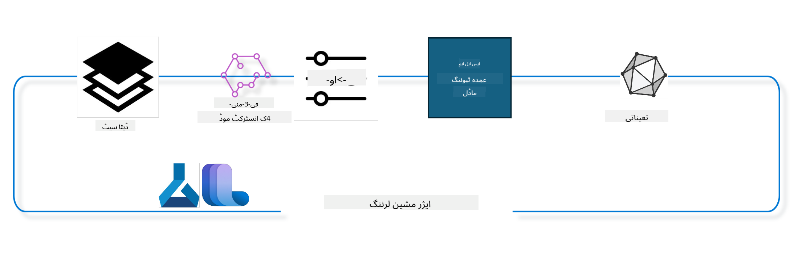

<!--
CO_OP_TRANSLATOR_METADATA:
{
  "original_hash": "ef071f0e903a1a38f8a5f8cbb253a9ca",
  "translation_date": "2025-04-03T08:11:38+00:00",
  "source_file": "md\\03.FineTuning\\FineTuning_MLSDK.md",
  "language_code": "ur"
}
-->
## Azure ML سسٹم رجسٹری سے چیٹ-کمپلیشن کمپوننٹس استعمال کر کے ماڈل کو بہتر بنانا

اس مثال میں ہم Phi-3-mini-4k-instruct ماڈل کو دو افراد کے درمیان بات چیت مکمل کرنے کے لیے ultrachat_200k ڈیٹا سیٹ کے ذریعے بہتر بنائیں گے۔



یہ مثال آپ کو دکھائے گی کہ Azure ML SDK اور Python استعمال کرتے ہوئے ماڈل کو کیسے بہتر بنایا جائے اور پھر بہتر بنایا گیا ماڈل حقیقی وقت کی پیش گوئی کے لیے آن لائن اینڈ پوائنٹ پر کیسے تعینات کیا جائے۔

### تربیتی ڈیٹا

ہم ultrachat_200k ڈیٹا سیٹ استعمال کریں گے۔ یہ UltraChat ڈیٹا سیٹ کا ایک سخت فلٹرڈ ورژن ہے اور Zephyr-7B-β کو تربیت دینے کے لیے استعمال کیا گیا، جو کہ ایک جدید 7b چیٹ ماڈل ہے۔

### ماڈل

ہم Phi-3-mini-4k-instruct ماڈل استعمال کریں گے تاکہ دکھایا جا سکے کہ صارف چیٹ-کمپلیشن کام کے لیے ماڈل کو کیسے بہتر بنا سکتا ہے۔ اگر آپ نے یہ نوٹ بک کسی خاص ماڈل کارڈ سے کھولی ہے تو مخصوص ماڈل کا نام تبدیل کرنا یاد رکھیں۔

### کام

- ایک ماڈل منتخب کریں جسے بہتر بنانا ہے۔
- تربیتی ڈیٹا کا انتخاب اور جائزہ لیں۔
- بہتر بنانے کا کام ترتیب دیں۔
- بہتر بنانے کا کام چلائیں۔
- تربیت اور تشخیص کے میٹرکس کا جائزہ لیں۔
- بہتر بنایا گیا ماڈل رجسٹر کریں۔
- بہتر بنایا گیا ماڈل حقیقی وقت کی پیش گوئی کے لیے تعینات کریں۔
- وسائل صاف کریں۔

## 1. پیشگی شرائط ترتیب دیں

- ضروریات انسٹال کریں
- AzureML Workspace سے جڑیں۔ SDK تصدیق سیٹ اپ کے بارے میں مزید جانیں۔ نیچے <WORKSPACE_NAME>, <RESOURCE_GROUP> اور <SUBSCRIPTION_ID> تبدیل کریں۔
- AzureML سسٹم رجسٹری سے جڑیں
- ایک اختیاری تجربہ کا نام سیٹ کریں
- کمپیوٹ چیک کریں یا بنائیں۔

> [!NOTE]
> ضروریات: ایک GPU نوڈ میں کئی GPU کارڈز ہو سکتے ہیں۔ مثال کے طور پر، Standard_NC24rs_v3 کے ایک نوڈ میں 4 NVIDIA V100 GPUs ہیں جبکہ Standard_NC12s_v3 میں 2 NVIDIA V100 GPUs ہیں۔ اس معلومات کے لیے دستاویزات کا حوالہ دیں۔ نوڈ میں GPU کارڈز کی تعداد نیچے دی گئی پیرامیٹر gpus_per_node میں سیٹ کی گئی ہے۔ اس قدر کو صحیح طریقے سے سیٹ کرنے سے نوڈ کے تمام GPUs کا استعمال یقینی ہوگا۔ تجویز کردہ GPU کمپیوٹ SKUs یہاں اور یہاں مل سکتے ہیں۔

### Python لائبریریاں

ذیل میں دی گئی سیل کو چلا کر ضروریات انسٹال کریں۔ اگر آپ نئے ماحول میں کام کر رہے ہیں تو یہ اختیاری قدم نہیں ہے۔

```bash
pip install azure-ai-ml
pip install azure-identity
pip install datasets==2.9.0
pip install mlflow
pip install azureml-mlflow
```

### Azure ML کے ساتھ تعامل

1. یہ Python اسکرپٹ Azure Machine Learning (Azure ML) سروس کے ساتھ تعامل کے لیے استعمال کیا جاتا ہے۔ اس کا خلاصہ درج ذیل ہے:

    - azure.ai.ml، azure.identity، اور azure.ai.ml.entities پیکجز سے ضروری ماڈیولز درآمد کرتا ہے۔ time ماڈیول بھی درآمد کرتا ہے۔

    - DefaultAzureCredential() استعمال کرتے ہوئے تصدیق کرنے کی کوشش کرتا ہے، جو Azure کلاؤڈ میں چلنے والی ایپلیکیشنز کو جلدی سے ترقی دینے کے لیے ایک آسان تصدیقی تجربہ فراہم کرتا ہے۔ اگر یہ ناکام ہو جائے تو InteractiveBrowserCredential() پر واپس جاتا ہے، جو ایک انٹرایکٹو لاگ ان پرامپٹ فراہم کرتا ہے۔

    - from_config طریقہ استعمال کرتے ہوئے MLClient مثال بنانے کی کوشش کرتا ہے، جو ڈیفالٹ کنفیگریشن فائل (config.json) سے کنفیگریشن پڑھتا ہے۔ اگر یہ ناکام ہو جائے تو subscription_id، resource_group_name، اور workspace_name کو دستی طور پر فراہم کر کے MLClient مثال بناتا ہے۔

    - "azureml" نامی Azure ML رجسٹری کے لیے ایک اور MLClient مثال بناتا ہے۔ یہ رجسٹری وہ جگہ ہے جہاں ماڈلز، بہتر بنانے کے پائپ لائنز، اور ماحولیات محفوظ کیے جاتے ہیں۔

    - experiment_name کو "chat_completion_Phi-3-mini-4k-instruct" پر سیٹ کرتا ہے۔

    - ایک منفرد ٹائم اسٹیمپ تیار کرتا ہے جو موجودہ وقت (epoch کے بعد سیکنڈز، فلوٹنگ پوائنٹ نمبر کے طور پر) کو ایک عدد میں تبدیل کر کے پھر ایک اسٹرنگ میں تبدیل کرتا ہے۔ یہ ٹائم اسٹیمپ منفرد نام اور ورژنز بنانے کے لیے استعمال کیا جا سکتا ہے۔

    ```python
    # Import necessary modules from Azure ML and Azure Identity
    from azure.ai.ml import MLClient
    from azure.identity import (
        DefaultAzureCredential,
        InteractiveBrowserCredential,
    )
    from azure.ai.ml.entities import AmlCompute
    import time  # Import time module
    
    # Try to authenticate using DefaultAzureCredential
    try:
        credential = DefaultAzureCredential()
        credential.get_token("https://management.azure.com/.default")
    except Exception as ex:  # If DefaultAzureCredential fails, use InteractiveBrowserCredential
        credential = InteractiveBrowserCredential()
    
    # Try to create an MLClient instance using the default config file
    try:
        workspace_ml_client = MLClient.from_config(credential=credential)
    except:  # If that fails, create an MLClient instance by manually providing the details
        workspace_ml_client = MLClient(
            credential,
            subscription_id="<SUBSCRIPTION_ID>",
            resource_group_name="<RESOURCE_GROUP>",
            workspace_name="<WORKSPACE_NAME>",
        )
    
    # Create another MLClient instance for the Azure ML registry named "azureml"
    # This registry is where models, fine-tuning pipelines, and environments are stored
    registry_ml_client = MLClient(credential, registry_name="azureml")
    
    # Set the experiment name
    experiment_name = "chat_completion_Phi-3-mini-4k-instruct"
    
    # Generate a unique timestamp that can be used for names and versions that need to be unique
    timestamp = str(int(time.time()))
    ```

## 2. بہتر بنانے کے لیے ایک بنیادی ماڈل منتخب کریں

1. Phi-3-mini-4k-instruct ایک 3.8B پیرامیٹرز، ہلکا پھلکا، جدید اوپن ماڈل ہے جو Phi-2 کے لیے استعمال کیے گئے ڈیٹا سیٹس پر مبنی ہے۔ ماڈل Phi-3 ماڈل فیملی سے تعلق رکھتا ہے، اور Mini ورژن 4K اور 128K دو ویریئنٹس میں آتا ہے، جو ٹوکنز کے لحاظ سے کانٹیکسٹ کی لمبائی ہے جسے یہ سپورٹ کر سکتا ہے۔ ہمیں اپنے مخصوص مقصد کے لیے ماڈل کو بہتر بنانے کی ضرورت ہے تاکہ اسے استعمال کیا جا سکے۔ آپ AzureML Studio کے Model Catalog میں چیٹ-کمپلیشن ٹاسک کے فلٹرنگ کے ذریعے ان ماڈلز کو براؤز کر سکتے ہیں۔ اس مثال میں، ہم Phi-3-mini-4k-instruct ماڈل استعمال کرتے ہیں۔ اگر آپ نے یہ نوٹ بک کسی مختلف ماڈل کے لیے کھولی ہے، تو ماڈل کا نام اور ورژن کو مطابق تبدیل کریں۔

    > [!NOTE]
    > ماڈل کی id پراپرٹی۔ یہ بہتر بنانے کے کام کے لیے ان پٹ کے طور پر پاس کی جائے گی۔ یہ AzureML Studio Model Catalog کے ماڈل ڈیٹیلز پیج میں Asset ID فیلڈ کے طور پر بھی دستیاب ہے۔

2. یہ Python اسکرپٹ Azure Machine Learning (Azure ML) سروس کے ساتھ تعامل کر رہا ہے۔ اس کا خلاصہ درج ذیل ہے:

    - model_name کو "Phi-3-mini-4k-instruct" پر سیٹ کرتا ہے۔

    - registry_ml_client آبجیکٹ کے models پراپرٹی کے get طریقہ استعمال کرتا ہے تاکہ Azure ML رجسٹری سے مخصوص نام کے ماڈل کا تازہ ترین ورژن حاصل کیا جا سکے۔ get طریقہ دو دلائل کے ساتھ بلایا جاتا ہے: ماڈل کا نام اور ایک لیبل جو مخصوص کرتا ہے کہ ماڈل کا تازہ ترین ورژن حاصل کیا جائے۔

    - کنسول میں ایک پیغام پرنٹ کرتا ہے جس میں ماڈل کا نام، ورژن، اور id دکھائی جاتی ہے جو بہتر بنانے کے لیے استعمال کی جائے گی۔ format طریقہ استعمال کر کے ماڈل کے نام، ورژن، اور id کو پیغام میں داخل کرتا ہے۔ ماڈل کے نام، ورژن، اور id کو foundation_model آبجیکٹ کی پراپرٹیز کے طور پر حاصل کیا جاتا ہے۔

    ```python
    # Set the model name
    model_name = "Phi-3-mini-4k-instruct"
    
    # Get the latest version of the model from the Azure ML registry
    foundation_model = registry_ml_client.models.get(model_name, label="latest")
    
    # Print the model name, version, and id
    # This information is useful for tracking and debugging
    print(
        "\n\nUsing model name: {0}, version: {1}, id: {2} for fine tuning".format(
            foundation_model.name, foundation_model.version, foundation_model.id
        )
    )
    ```

## 3. کام کے لیے استعمال ہونے والی کمپیوٹ بنائیں

بہتر بنانے کا کام صرف GPU کمپیوٹ کے ساتھ کام کرتا ہے۔ کمپیوٹ کا سائز ماڈل کی جسامت پر منحصر ہوتا ہے اور زیادہ تر معاملات میں مناسب کمپیوٹ کا انتخاب مشکل ہو جاتا ہے۔ اس سیل میں، ہم صارف کو کام کے لیے مناسب کمپیوٹ منتخب کرنے میں رہنمائی کرتے ہیں۔

> [!NOTE]
> نیچے درج کمپیوٹس سب سے زیادہ بہتر ترتیب کے ساتھ کام کرتے ہیں۔ ترتیب میں کسی بھی قسم کی تبدیلی Cuda Out Of Memory کی خرابی کا سبب بن سکتی ہے۔ ایسے معاملات میں، کمپیوٹ کو بڑے سائز میں اپ گریڈ کرنے کی کوشش کریں۔

> [!NOTE]
> نیچے compute_cluster_size منتخب کرتے وقت، یقینی بنائیں کہ کمپیوٹ آپ کے resource group میں دستیاب ہے۔ اگر کوئی خاص کمپیوٹ دستیاب نہیں ہے تو آپ کمپیوٹ وسائل تک رسائی حاصل کرنے کی درخواست کر سکتے ہیں۔

### ماڈل کی بہتر بنانے کی سپورٹ چیک کرنا

1. یہ Python اسکرپٹ Azure Machine Learning (Azure ML) ماڈل کے ساتھ تعامل کر رہا ہے۔ اس کا خلاصہ درج ذیل ہے:

    - ast ماڈیول درآمد کرتا ہے، جو Python abstract syntax grammar کے درختوں پر کارروائی کرنے کے لیے فنکشنز فراہم کرتا ہے۔

    - چیک کرتا ہے کہ آیا foundation_model آبجیکٹ (جو Azure ML میں ماڈل کی نمائندگی کرتا ہے) میں finetune_compute_allow_list نامی ٹیگ موجود ہے۔ Azure ML میں ٹیگز کلیدی-قدر جوڑے ہوتے ہیں جنہیں آپ ماڈلز کو فلٹر اور ترتیب دینے کے لیے بنا اور استعمال کر سکتے ہیں۔

    - اگر finetune_compute_allow_list ٹیگ موجود ہو، تو ast.literal_eval فنکشن استعمال کر کے ٹیگ کی قدر (ایک اسٹرنگ) کو محفوظ طریقے سے Python کی فہرست میں تبدیل کرتا ہے۔ یہ فہرست پھر computes_allow_list ویریبل کو تفویض کی جاتی ہے۔ اس کے بعد ایک پیغام پرنٹ کرتا ہے کہ فہرست میں سے کمپیوٹ بنانا چاہیے۔

    - اگر finetune_compute_allow_list ٹیگ موجود نہ ہو، تو computes_allow_list کو None پر سیٹ کرتا ہے اور ایک پیغام پرنٹ کرتا ہے کہ finetune_compute_allow_list ٹیگ ماڈل کے ٹیگز کا حصہ نہیں ہے۔

    - خلاصہ یہ ہے کہ یہ اسکرپٹ ماڈل کے میٹا ڈیٹا میں ایک مخصوص ٹیگ کی جانچ کر رہا ہے، اگر موجود ہو تو ٹیگ کی قدر کو فہرست میں تبدیل کر رہا ہے، اور صارف کو مناسب فیڈبیک فراہم کر رہا ہے۔

    ```python
    # Import the ast module, which provides functions to process trees of the Python abstract syntax grammar
    import ast
    
    # Check if the 'finetune_compute_allow_list' tag is present in the model's tags
    if "finetune_compute_allow_list" in foundation_model.tags:
        # If the tag is present, use ast.literal_eval to safely parse the tag's value (a string) into a Python list
        computes_allow_list = ast.literal_eval(
            foundation_model.tags["finetune_compute_allow_list"]
        )  # convert string to python list
        # Print a message indicating that a compute should be created from the list
        print(f"Please create a compute from the above list - {computes_allow_list}")
    else:
        # If the tag is not present, set computes_allow_list to None
        computes_allow_list = None
        # Print a message indicating that the 'finetune_compute_allow_list' tag is not part of the model's tags
        print("`finetune_compute_allow_list` is not part of model tags")
    ```

### کمپیوٹ انسٹینس چیک کرنا

1. یہ Python اسکرپٹ Azure Machine Learning (Azure ML) سروس کے ساتھ تعامل کر رہا ہے اور کمپیوٹ انسٹینس پر کئی چیک کر رہا ہے۔ اس کا خلاصہ درج ذیل ہے:

    - compute_cluster میں محفوظ نام کے ساتھ Azure ML ورک اسپیس سے کمپیوٹ انسٹینس حاصل کرنے کی کوشش کرتا ہے۔ اگر کمپیوٹ انسٹینس کی provisioning state "failed" ہو، تو ValueError پیدا کرتا ہے۔

    - چیک کرتا ہے کہ آیا computes_allow_list None نہیں ہے۔ اگر نہیں ہے، تو فہرست میں موجود تمام کمپیوٹ سائزز کو لوئر کیس میں تبدیل کرتا ہے اور چیک کرتا ہے کہ آیا موجودہ کمپیوٹ انسٹینس کا سائز فہرست میں موجود ہے۔ اگر نہیں ہے، تو ValueError پیدا کرتا ہے۔

    - اگر computes_allow_list None ہے، تو چیک کرتا ہے کہ آیا کمپیوٹ انسٹینس کا سائز unsupported GPU VM sizes کی فہرست میں ہے۔ اگر ہے، تو ValueError پیدا کرتا ہے۔

    - ورک اسپیس میں دستیاب تمام کمپیوٹ سائزز کی فہرست حاصل کرتا ہے۔ پھر اس فہرست پر تکرار کرتا ہے، اور ہر کمپیوٹ سائز کے لیے چیک کرتا ہے کہ آیا اس کا نام موجودہ کمپیوٹ انسٹینس کے سائز سے میل کھاتا ہے۔ اگر میل کھاتا ہے، تو اس کمپیوٹ سائز کے لیے GPUs کی تعداد حاصل کرتا ہے اور gpu_count_found کو True پر سیٹ کرتا ہے۔

    - اگر gpu_count_found True ہے، تو کمپیوٹ انسٹینس میں GPUs کی تعداد پرنٹ کرتا ہے۔ اگر gpu_count_found False ہے، تو ValueError پیدا کرتا ہے۔

    - خلاصہ یہ ہے کہ یہ اسکرپٹ Azure ML ورک اسپیس میں کمپیوٹ انسٹینس پر کئی چیک کر رہا ہے، بشمول اس کی provisioning state، اس کے سائز کے allow list یا deny list کے خلاف، اور اس میں GPUs کی تعداد۔

    ```python
    # Print the exception message
    print(e)
    # Raise a ValueError if the compute size is not available in the workspace
    raise ValueError(
        f"WARNING! Compute size {compute_cluster_size} not available in workspace"
    )
    
    # Retrieve the compute instance from the Azure ML workspace
    compute = workspace_ml_client.compute.get(compute_cluster)
    # Check if the provisioning state of the compute instance is "failed"
    if compute.provisioning_state.lower() == "failed":
        # Raise a ValueError if the provisioning state is "failed"
        raise ValueError(
            f"Provisioning failed, Compute '{compute_cluster}' is in failed state. "
            f"please try creating a different compute"
        )
    
    # Check if computes_allow_list is not None
    if computes_allow_list is not None:
        # Convert all compute sizes in computes_allow_list to lowercase
        computes_allow_list_lower_case = [x.lower() for x in computes_allow_list]
        # Check if the size of the compute instance is in computes_allow_list_lower_case
        if compute.size.lower() not in computes_allow_list_lower_case:
            # Raise a ValueError if the size of the compute instance is not in computes_allow_list_lower_case
            raise ValueError(
                f"VM size {compute.size} is not in the allow-listed computes for finetuning"
            )
    else:
        # Define a list of unsupported GPU VM sizes
        unsupported_gpu_vm_list = [
            "standard_nc6",
            "standard_nc12",
            "standard_nc24",
            "standard_nc24r",
        ]
        # Check if the size of the compute instance is in unsupported_gpu_vm_list
        if compute.size.lower() in unsupported_gpu_vm_list:
            # Raise a ValueError if the size of the compute instance is in unsupported_gpu_vm_list
            raise ValueError(
                f"VM size {compute.size} is currently not supported for finetuning"
            )
    
    # Initialize a flag to check if the number of GPUs in the compute instance has been found
    gpu_count_found = False
    # Retrieve a list of all available compute sizes in the workspace
    workspace_compute_sku_list = workspace_ml_client.compute.list_sizes()
    available_sku_sizes = []
    # Iterate over the list of available compute sizes
    for compute_sku in workspace_compute_sku_list:
        available_sku_sizes.append(compute_sku.name)
        # Check if the name of the compute size matches the size of the compute instance
        if compute_sku.name.lower() == compute.size.lower():
            # If it does, retrieve the number of GPUs for that compute size and set gpu_count_found to True
            gpus_per_node = compute_sku.gpus
            gpu_count_found = True
    # If gpu_count_found is True, print the number of GPUs in the compute instance
    if gpu_count_found:
        print(f"Number of GPU's in compute {compute.size}: {gpus_per_node}")
    else:
        # If gpu_count_found is False, raise a ValueError
        raise ValueError(
            f"Number of GPU's in compute {compute.size} not found. Available skus are: {available_sku_sizes}."
            f"This should not happen. Please check the selected compute cluster: {compute_cluster} and try again."
        )
    ```

## 4. ماڈل کو بہتر بنانے کے لیے ڈیٹا سیٹ منتخب کریں

1. ہم ultrachat_200k ڈیٹا سیٹ استعمال کرتے ہیں۔ ڈیٹا سیٹ میں چار حصے ہیں، جو Supervised fine-tuning (sft) کے لیے موزوں ہیں۔
Generation ranking (gen)۔ ہر حصے میں موجود مثالوں کی تعداد درج ذیل ہے:

    ```bash
    train_sft test_sft  train_gen  test_gen
    207865  23110  256032  28304
    ```

1. اگلے چند سیلز میں بہتر بنانے کے لیے بنیادی ڈیٹا تیاری دکھائی گئی ہے:

### کچھ ڈیٹا کی قطاریں دیکھیں

ہم چاہتے ہیں کہ یہ نمونہ جلدی چلے، لہذا train_sft، test_sft فائلز محفوظ کریں جن میں پہلے سے تراشی گئی قطاروں کا 5% شامل ہو۔ اس کا مطلب ہے کہ بہتر بنایا گیا ماڈل کم درست ہوگا، لہذا اسے حقیقی دنیا میں استعمال کے لیے نہیں رکھا جانا چاہیے۔
download-dataset.py استعمال کیا جاتا ہے ultrachat_200k ڈیٹا سیٹ کو ڈاؤن لوڈ کرنے اور ڈیٹا سیٹ کو بہتر بنانے کے پائپ لائن کمپوننٹ کے قابل استعمال فارمیٹ میں تبدیل کرنے کے لیے۔ نیز چونکہ ڈیٹا سیٹ بڑا ہے، لہذا یہاں ہمارے پاس صرف ڈیٹا سیٹ کا حصہ ہے۔

1. نیچے دی گئی اسکرپٹ چلانا صرف ڈیٹا کا 5% ڈاؤن لوڈ کرتا ہے۔ اسے dataset_split_pc پیرامیٹر کو مطلوبہ فیصد میں تبدیل کر کے بڑھایا جا سکتا ہے۔

    > [!NOTE]
    > کچھ زبان کے ماڈلز کے مختلف زبان کے کوڈز ہوتے ہیں اور اسی وجہ سے ڈیٹا سیٹ میں موجود کالم کے ناموں کو بھی اسی کے مطابق ہونا چاہیے۔

1. یہاں ایک مثال ہے کہ ڈیٹا کیسا دکھنا چاہیے
چیٹ-کمپلیشن ڈیٹا سیٹ parquet فارمیٹ میں محفوظ ہے جس میں ہر اندراج درج ذیل اسکیمہ استعمال کر رہا ہے:

    - یہ ایک JSON (JavaScript Object Notion) دستاویز ہے، جو ایک مشہور ڈیٹا انٹرچینج فارمیٹ ہے۔ یہ قابل عمل کوڈ نہیں ہے، بلکہ ڈیٹا کو ذخیرہ کرنے اور منتقل کرنے کا ایک طریقہ ہے۔ اس کی ساخت کا خلاصہ درج ذیل ہے:

    - "prompt": یہ کلید ایک اسٹرنگ ویلیو رکھتی ہے جو AI اسسٹنٹ کو دیے گئے کام یا سوال کی نمائندگی کرتی ہے۔

    - "messages": یہ کلید اشیاء کی ایک صف رکھتی ہے۔ ہر شے ایک صارف اور AI اسسٹنٹ کے درمیان بات چیت میں ایک پیغام کی نمائندگی کرتی ہے۔ ہر پیغام کی شے میں دو کلیدیں ہوتی ہیں:

    - "content": یہ کلید ایک اسٹرنگ ویلیو رکھتی ہے جو پیغام کے مواد کی نمائندگی کرتی ہے۔
    - "role": یہ کلید ایک اسٹرنگ ویلیو رکھتی ہے جو اس ہستی کے کردار کی نمائندگی کرتی ہے جس نے پیغام بھیجا۔ یہ "user" یا "assistant" ہو سکتا ہے۔
    - "prompt_id": یہ کلید ایک اسٹرنگ ویلیو رکھتی ہے جو prompt کے لیے ایک منفرد شناخت کنندہ کی نمائندگی کرتی ہے۔

1. اس مخصوص JSON دستاویز میں، ایک بات چیت کی نمائندگی کی گئی ہے جہاں ایک صارف AI اسسٹنٹ سے ایک dystopian کہانی کے لیے ایک کردار بنانے کو کہتا ہے۔ اسسٹنٹ جواب دیتا ہے، اور صارف پھر مزید تفصیلات مانگتا ہے۔ اسسٹنٹ مزید تفصیلات فراہم کرنے پر راضی ہوتا ہے۔ پوری بات چیت ایک مخصوص prompt id کے ساتھ منسلک ہے۔

    ```python
    {
        // The task or question posed to an AI assistant
        "prompt": "Create a fully-developed protagonist who is challenged to survive within a dystopian society under the rule of a tyrant. ...",
        
        // An array of objects, each representing a message in a conversation between a user and an AI assistant
        "messages":[
            {
                // The content of the user's message
                "content": "Create a fully-developed protagonist who is challenged to survive within a dystopian society under the rule of a tyrant. ...",
                // The role of the entity that sent the message
                "role": "user"
            },
            {
                // The content of the assistant's message
                "content": "Name: Ava\n\n Ava was just 16 years old when the world as she knew it came crashing down. The government had collapsed, leaving behind a chaotic and lawless society. ...",
                // The role of the entity that sent the message
                "role": "assistant"
            },
            {
                // The content of the user's message
                "content": "Wow, Ava's story is so intense and inspiring! Can you provide me with more details.  ...",
                // The role of the entity that sent the message
                "role": "user"
            }, 
            {
                // The content of the assistant's message
                "content": "Certainly! ....",
                // The role of the entity that sent the message
                "role": "assistant"
            }
        ],
        
        // A unique identifier for the prompt
        "prompt_id": "d938b65dfe31f05f80eb8572964c6673eddbd68eff3db6bd234d7f1e3b86c2af"
    }
    ```

### ڈیٹا ڈاؤن لوڈ کریں

1. یہ Python اسکرپٹ ایک ڈیٹا سیٹ کو ایک مددگار اسکرپٹ download-dataset.py کے ذریعے ڈاؤن لوڈ کرنے کے لیے استعمال کیا جاتا ہے۔ اس کا خلاصہ درج ذیل ہے:

    - os ماڈیول درآمد کرتا ہے، جو آپریٹنگ سسٹم پر منحصر فعالیت کا استعمال کرنے کا ایک پورٹیبل طریقہ فراہم کرتا ہے۔

    - os.system فنکشن استعمال کرتا ہے تاکہ download-dataset.py اسکرپٹ کو مخصوص کمانڈ لائن دلائل کے ساتھ شیل میں چلایا جا سکے۔ دلائل مخصوص کرتے ہیں کہ کون سا ڈیٹا سیٹ ڈاؤن لوڈ کرنا ہے (HuggingFaceH4/ultrachat_200k)، اسے کہاں ڈاؤن لوڈ کرنا ہے (ultrachat_200k_dataset)، اور ڈیٹا سیٹ کو تقسیم کرنے کا فیصد (5)۔ os.system فنکشن اس کمانڈ کی ایگزیکیوشن کا exit status واپس کرتا ہے؛ یہ status exit_status ویریبل میں محفوظ کیا جاتا ہے۔

    - چیک کرتا ہے کہ آیا exit_status 0 نہیں ہے۔ Unix جیسے آپریٹنگ سسٹمز میں، exit status 0 عام طور پر ظاہر کرتا ہے کہ کمانڈ کامیاب ہوئی ہے، جبکہ کوئی بھی دوسرا نمبر خرابی ظاہر کرتا ہے۔ اگر exit_status 0 نہیں ہے، تو Exception پیدا کرتا ہے جس میں ایک پیغام ہوتا ہے کہ ڈیٹا سیٹ ڈاؤن لوڈ کرنے میں خرابی ہوئی۔

    - خلاصہ یہ ہے کہ یہ اسکرپٹ ایک کمانڈ چلا رہا ہے تاکہ ایک مددگار اسکرپٹ کے ذریعے ڈیٹا سیٹ ڈاؤن لوڈ کیا جا سکے، اور اگر کمانڈ ناکام ہو جائے تو Exception پیدا کرتا ہے۔

    ```python
    # Import the os module, which provides a way of using operating system dependent functionality
    import os
    
    # Use the os.system function to run the download-dataset.py script in the shell with specific command-line arguments
    # The arguments specify the dataset to download (HuggingFaceH4/ultrachat_200k), the directory to download it to (ultrachat_200k_dataset), and the percentage of the dataset to split (5)
    # The os.system function returns the exit status of the command it executed; this status is stored in the exit_status variable
    exit_status = os.system(
        "python ./download-dataset.py --dataset HuggingFaceH4/ultrachat_200k --download_dir ultrachat_200k_dataset --dataset_split_pc 5"
    )
    
    # Check if exit_status is not 0
    # In Unix-like operating systems, an exit status of 0 usually indicates that a command has succeeded, while any other number indicates an error
    # If exit_status is not 0, raise an Exception with a message indicating that there was an error downloading the dataset
    if exit_status != 0:
        raise Exception("Error downloading dataset")
    ```

### ڈیٹا کو ڈیٹا فریم میں لوڈ کرنا

1. یہ Python اسکرپٹ ایک JSON Lines فائل کو pandas ڈیٹا فریم میں لوڈ کر رہا ہے اور پہلی 5 قطاریں دکھا رہا ہے۔ اس کا خلاصہ درج ذیل ہے:

    - pandas لائبریری درآمد کرتا ہے، جو ایک طاقتور ڈیٹا ہیرا پھیری اور تجزیہ کی لائبریری ہے۔

    - pandas کے ڈسپلے آپشنز کے لیے زیادہ سے زیادہ کالم کی چوڑائی 0 پر سیٹ کرتا ہے۔ اس کا مطلب ہے کہ ڈیٹا فریم پرنٹ کرتے وقت ہر کالم کا مکمل متن بغیر کسی کٹوتی کے دکھایا جائے گا۔

    - pd.read_json فنکشن استعمال کرتا ہے تاکہ ultrachat_200k_dataset ڈائریکٹری سے train_sft.jsonl فائل کو JSON Lines فارمیٹ میں ڈیٹا فریم میں لوڈ کیا جا سکے۔ lines=True دلیل مخصوص کرتی ہے کہ فائل JSON Lines فارمیٹ میں ہے، جہاں ہر لائن ایک الگ JSON آبجیکٹ ہے۔

    - head طریقہ استعمال کرتا
مشین لرننگ پائپ لائن کو مختلف پیرامیٹرز کی بنیاد پر ترتیب دینا اور پھر اس کا ڈسپلے نام پرنٹ کرنا۔ ```python
    # Define a function to generate a display name for the training pipeline
    def get_pipeline_display_name():
        # Calculate the total batch size by multiplying the per-device batch size, the number of gradient accumulation steps, the number of GPUs per node, and the number of nodes used for fine-tuning
        batch_size = (
            int(finetune_parameters.get("per_device_train_batch_size", 1))
            * int(finetune_parameters.get("gradient_accumulation_steps", 1))
            * int(gpus_per_node)
            * int(finetune_parameters.get("num_nodes_finetune", 1))
        )
        # Retrieve the learning rate scheduler type
        scheduler = finetune_parameters.get("lr_scheduler_type", "linear")
        # Retrieve whether DeepSpeed is applied
        deepspeed = finetune_parameters.get("apply_deepspeed", "false")
        # Retrieve the DeepSpeed stage
        ds_stage = finetune_parameters.get("deepspeed_stage", "2")
        # If DeepSpeed is applied, include "ds" followed by the DeepSpeed stage in the display name; if not, include "nods"
        if deepspeed == "true":
            ds_string = f"ds{ds_stage}"
        else:
            ds_string = "nods"
        # Retrieve whether Layer-wise Relevance Propagation (LoRa) is applied
        lora = finetune_parameters.get("apply_lora", "false")
        # If LoRa is applied, include "lora" in the display name; if not, include "nolora"
        if lora == "true":
            lora_string = "lora"
        else:
            lora_string = "nolora"
        # Retrieve the limit on the number of model checkpoints to keep
        save_limit = finetune_parameters.get("save_total_limit", -1)
        # Retrieve the maximum sequence length
        seq_len = finetune_parameters.get("max_seq_length", -1)
        # Construct the display name by concatenating all these parameters, separated by hyphens
        return (
            model_name
            + "-"
            + "ultrachat"
            + "-"
            + f"bs{batch_size}"
            + "-"
            + f"{scheduler}"
            + "-"
            + ds_string
            + "-"
            + lora_string
            + f"-save_limit{save_limit}"
            + f"-seqlen{seq_len}"
        )
    
    # Call the function to generate the display name
    pipeline_display_name = get_pipeline_display_name()
    # Print the display name
    print(f"Display name used for the run: {pipeline_display_name}")
    ```

### پائپ لائن کی ترتیب

یہ Python اسکرپٹ Azure Machine Learning SDK کا استعمال کرتے ہوئے مشین لرننگ پائپ لائن کو ڈیفائن اور کنفیگر کر رہا ہے۔ یہاں اسکرپٹ کے کام کی تفصیل دی گئی ہے:

1. Azure AI ML SDK سے ضروری ماڈیولز کو امپورٹ کرتا ہے۔
1. رجسٹری سے "chat_completion_pipeline" نامی پائپ لائن کمپوننٹ کو حاصل کرتا ہے۔
1. ایک پائپ لائن جاب ڈیفائن کرتا ہے، جہاں `@pipeline` decorator and the function `create_pipeline`. The name of the pipeline is set to `pipeline_display_name`.

1. Inside the `create_pipeline` function, it initializes the fetched pipeline component with various parameters, including the model path, compute clusters for different stages, dataset splits for training and testing, the number of GPUs to use for fine-tuning, and other fine-tuning parameters.

1. It maps the output of the fine-tuning job to the output of the pipeline job. This is done so that the fine-tuned model can be easily registered, which is required to deploy the model to an online or batch endpoint.

1. It creates an instance of the pipeline by calling the `create_pipeline` function.

1. It sets the `force_rerun` setting of the pipeline to `True`, meaning that cached results from previous jobs will not be used.

1. It sets the `continue_on_step_failure` setting of the pipeline to `False` استعمال کیا جاتا ہے، یعنی اگر کسی مرحلے میں ناکامی ہو تو پائپ لائن رک جائے گی۔
1. خلاصے میں، یہ اسکرپٹ Azure Machine Learning SDK کا استعمال کرتے ہوئے چیٹ کمپلیشن ٹاسک کے لیے ایک مشین لرننگ پائپ لائن ڈیفائن اور کنفیگر کر رہا ہے۔

```python
    # Import necessary modules from the Azure AI ML SDK
    from azure.ai.ml.dsl import pipeline
    from azure.ai.ml import Input
    
    # Fetch the pipeline component named "chat_completion_pipeline" from the registry
    pipeline_component_func = registry_ml_client.components.get(
        name="chat_completion_pipeline", label="latest"
    )
    
    # Define the pipeline job using the @pipeline decorator and the function create_pipeline
    # The name of the pipeline is set to pipeline_display_name
    @pipeline(name=pipeline_display_name)
    def create_pipeline():
        # Initialize the fetched pipeline component with various parameters
        # These include the model path, compute clusters for different stages, dataset splits for training and testing, the number of GPUs to use for fine-tuning, and other fine-tuning parameters
        chat_completion_pipeline = pipeline_component_func(
            mlflow_model_path=foundation_model.id,
            compute_model_import=compute_cluster,
            compute_preprocess=compute_cluster,
            compute_finetune=compute_cluster,
            compute_model_evaluation=compute_cluster,
            # Map the dataset splits to parameters
            train_file_path=Input(
                type="uri_file", path="./ultrachat_200k_dataset/train_sft.jsonl"
            ),
            test_file_path=Input(
                type="uri_file", path="./ultrachat_200k_dataset/test_sft.jsonl"
            ),
            # Training settings
            number_of_gpu_to_use_finetuning=gpus_per_node,  # Set to the number of GPUs available in the compute
            **finetune_parameters
        )
        return {
            # Map the output of the fine tuning job to the output of pipeline job
            # This is done so that we can easily register the fine tuned model
            # Registering the model is required to deploy the model to an online or batch endpoint
            "trained_model": chat_completion_pipeline.outputs.mlflow_model_folder
        }
    
    # Create an instance of the pipeline by calling the create_pipeline function
    pipeline_object = create_pipeline()
    
    # Don't use cached results from previous jobs
    pipeline_object.settings.force_rerun = True
    
    # Set continue on step failure to False
    # This means that the pipeline will stop if any step fails
    pipeline_object.settings.continue_on_step_failure = False
    ```

### جاب جمع کروائیں

1. یہ Python اسکرپٹ Azure Machine Learning ورک اسپیس میں مشین لرننگ پائپ لائن جاب جمع کروا رہا ہے اور پھر جاب مکمل ہونے کا انتظار کر رہا ہے۔ اسکرپٹ کے کام کی تفصیل:

- ورک اسپیس_ml_client کے jobs آبجیکٹ کے create_or_update میتھڈ کو کال کرتا ہے تاکہ پائپ لائن جاب جمع کروائی جا سکے۔ جس پائپ لائن کو چلانا ہے وہ pipeline_object کے ذریعے اسپیسفائی کی گئی ہے، اور جس ایکسپیریمنٹ کے تحت جاب چلانی ہے وہ experiment_name کے ذریعے اسپیسفائی کی گئی ہے۔
- پھر ورک اسپیس_ml_client کے jobs آبجیکٹ کے stream میتھڈ کو کال کرتا ہے تاکہ پائپ لائن جاب مکمل ہونے کا انتظار کیا جا سکے۔ جس جاب کا انتظار کرنا ہے وہ pipeline_job آبجیکٹ کے name ایٹریبیوٹ کے ذریعے اسپیسفائی کی گئی ہے۔
- خلاصے میں، یہ اسکرپٹ Azure Machine Learning ورک اسپیس میں مشین لرننگ پائپ لائن جاب جمع کروا رہا ہے اور پھر جاب مکمل ہونے کا انتظار کر رہا ہے۔

```python
    # Submit the pipeline job to the Azure Machine Learning workspace
    # The pipeline to be run is specified by pipeline_object
    # The experiment under which the job is run is specified by experiment_name
    pipeline_job = workspace_ml_client.jobs.create_or_update(
        pipeline_object, experiment_name=experiment_name
    )
    
    # Wait for the pipeline job to complete
    # The job to wait for is specified by the name attribute of the pipeline_job object
    workspace_ml_client.jobs.stream(pipeline_job.name)
    ```

## 6. ورک اسپیس میں فائن ٹیونڈ ماڈل رجسٹر کریں

ہم فائن ٹیوننگ جاب کے آؤٹ پٹ سے ماڈل کو رجسٹر کریں گے۔ یہ فائن ٹیونڈ ماڈل اور فائن ٹیوننگ جاب کے درمیان لنکیج کو ٹریک کرے گا۔ فائن ٹیوننگ جاب مزید فاؤنڈیشن ماڈل، ڈیٹا اور ٹریننگ کوڈ کے ساتھ لنکیج کو ٹریک کرے گا۔

### مشین لرننگ ماڈل رجسٹر کرنا

1. یہ Python اسکرپٹ Azure Machine Learning پائپ لائن میں ٹرین کیے گئے مشین لرننگ ماڈل کو رجسٹر کر رہا ہے۔ اسکرپٹ کے کام کی تفصیل:

- Azure AI ML SDK سے ضروری ماڈیولز کو امپورٹ کرتا ہے۔
- ورک اسپیس_ml_client کے jobs آبجیکٹ کے get میتھڈ کو کال کرکے اور اس کے outputs ایٹریبیوٹ تک رسائی حاصل کرکے چیک کرتا ہے کہ آیا pipeline جاب سے trained_model آؤٹ پٹ دستیاب ہے۔
- ایک اسٹرنگ فارمیٹ کرکے ٹرین کیے گئے ماڈل کا راستہ تیار کرتا ہے، جس میں pipeline جاب کا نام اور آؤٹ پٹ ("trained_model") شامل ہوتا ہے۔
- فائن ٹیونڈ ماڈل کے لیے ایک نام ڈیفائن کرتا ہے، جس میں "-ultrachat-200k" کو اصل ماڈل کے نام کے ساتھ شامل کرتا ہے اور کسی بھی سلیش کو ہائفن سے تبدیل کرتا ہے۔
- ماڈل رجسٹر کرنے کے لیے ایک Model آبجیکٹ تیار کرتا ہے، جس میں مختلف پیرامیٹرز شامل ہیں جیسے ماڈل کا راستہ، ماڈل کی قسم (MLflow ماڈل)، ماڈل کا نام اور ورژن، اور ماڈل کی تفصیل۔
- ورک اسپیس_ml_client کے models آبجیکٹ کے create_or_update میتھڈ کو Model آبجیکٹ کے ساتھ کال کرکے ماڈل رجسٹر کرتا ہے۔
- رجسٹر کیے گئے ماڈل کو پرنٹ کرتا ہے۔

1. خلاصے میں، یہ اسکرپٹ Azure Machine Learning پائپ لائن میں ٹرین کیے گئے مشین لرننگ ماڈل کو رجسٹر کر رہا ہے۔

```python
    # Import necessary modules from the Azure AI ML SDK
    from azure.ai.ml.entities import Model
    from azure.ai.ml.constants import AssetTypes
    
    # Check if the `trained_model` output is available from the pipeline job
    print("pipeline job outputs: ", workspace_ml_client.jobs.get(pipeline_job.name).outputs)
    
    # Construct a path to the trained model by formatting a string with the name of the pipeline job and the name of the output ("trained_model")
    model_path_from_job = "azureml://jobs/{0}/outputs/{1}".format(
        pipeline_job.name, "trained_model"
    )
    
    # Define a name for the fine-tuned model by appending "-ultrachat-200k" to the original model name and replacing any slashes with hyphens
    finetuned_model_name = model_name + "-ultrachat-200k"
    finetuned_model_name = finetuned_model_name.replace("/", "-")
    
    print("path to register model: ", model_path_from_job)
    
    # Prepare to register the model by creating a Model object with various parameters
    # These include the path to the model, the type of the model (MLflow model), the name and version of the model, and a description of the model
    prepare_to_register_model = Model(
        path=model_path_from_job,
        type=AssetTypes.MLFLOW_MODEL,
        name=finetuned_model_name,
        version=timestamp,  # Use timestamp as version to avoid version conflict
        description=model_name + " fine tuned model for ultrachat 200k chat-completion",
    )
    
    print("prepare to register model: \n", prepare_to_register_model)
    
    # Register the model by calling the create_or_update method of the models object in the workspace_ml_client with the Model object as the argument
    registered_model = workspace_ml_client.models.create_or_update(
        prepare_to_register_model
    )
    
    # Print the registered model
    print("registered model: \n", registered_model)
    ```

## 7. فائن ٹیونڈ ماڈل کو آن لائن اینڈ پوائنٹ پر ڈیپلائی کریں

آن لائن اینڈ پوائنٹس ایک مستقل REST API فراہم کرتے ہیں جسے ایسے ایپلیکیشنز کے ساتھ انٹیگریٹ کرنے کے لیے استعمال کیا جا سکتا ہے جنہیں ماڈل استعمال کرنے کی ضرورت ہو۔

### اینڈ پوائنٹ کا انتظام

1. یہ Python اسکرپٹ Azure Machine Learning میں رجسٹر کیے گئے ماڈل کے لیے ایک منیجڈ آن لائن اینڈ پوائنٹ بنا رہا ہے۔ اسکرپٹ کے کام کی تفصیل:

- Azure AI ML SDK سے ضروری ماڈیولز کو امپورٹ کرتا ہے۔
- ایک منفرد نام ڈیفائن کرتا ہے، جس میں "ultrachat-completion-" کے ساتھ ایک ٹائم اسٹیمپ شامل کرتا ہے۔
- منیجڈ آن لائن اینڈ پوائنٹ بنانے کے لیے ایک ManagedOnlineEndpoint آبجیکٹ تیار کرتا ہے، جس میں مختلف پیرامیٹرز شامل ہیں جیسے اینڈ پوائنٹ کا نام، اینڈ پوائنٹ کی تفصیل، اور تصدیق موڈ ("key")۔
- ورک اسپیس_ml_client کے begin_create_or_update میتھڈ کو ManagedOnlineEndpoint آبجیکٹ کے ساتھ کال کرکے آن لائن اینڈ پوائنٹ بناتا ہے۔ پھر wait میتھڈ کو کال کرکے تخلیق کے عمل کا انتظار کرتا ہے۔

1. خلاصے میں، یہ اسکرپٹ Azure Machine Learning میں رجسٹر کیے گئے ماڈل کے لیے ایک منیجڈ آن لائن اینڈ پوائنٹ بنا رہا ہے۔

```python
    # Import necessary modules from the Azure AI ML SDK
    from azure.ai.ml.entities import (
        ManagedOnlineEndpoint,
        ManagedOnlineDeployment,
        ProbeSettings,
        OnlineRequestSettings,
    )
    
    # Define a unique name for the online endpoint by appending a timestamp to the string "ultrachat-completion-"
    online_endpoint_name = "ultrachat-completion-" + timestamp
    
    # Prepare to create the online endpoint by creating a ManagedOnlineEndpoint object with various parameters
    # These include the name of the endpoint, a description of the endpoint, and the authentication mode ("key")
    endpoint = ManagedOnlineEndpoint(
        name=online_endpoint_name,
        description="Online endpoint for "
        + registered_model.name
        + ", fine tuned model for ultrachat-200k-chat-completion",
        auth_mode="key",
    )
    
    # Create the online endpoint by calling the begin_create_or_update method of the workspace_ml_client with the ManagedOnlineEndpoint object as the argument
    # Then wait for the creation operation to complete by calling the wait method
    workspace_ml_client.begin_create_or_update(endpoint).wait()
    ```

> [!NOTE]
> آپ یہاں ڈیپلائیمنٹ کے لیے سپورٹڈ SKU کی فہرست دیکھ سکتے ہیں - [Managed online endpoints SKU list](https://learn.microsoft.com/azure/machine-learning/reference-managed-online-endpoints-vm-sku-list)

### مشین لرننگ ماڈل ڈیپلائی کرنا

1. یہ Python اسکرپٹ Azure Machine Learning میں رجسٹر کیے گئے مشین لرننگ ماڈل کو منیجڈ آن لائن اینڈ پوائنٹ پر ڈیپلائی کر رہا ہے۔ اسکرپٹ کے کام کی تفصیل:

- ast ماڈیول امپورٹ کرتا ہے، جو Python کے ابسٹریکٹ گرامر کی درختوں کو پراسیس کرنے کے فنکشنز فراہم کرتا ہے۔
- ڈیپلائیمنٹ کے لیے انسٹینس ٹائپ "Standard_NC6s_v3" سیٹ کرتا ہے۔
- چیک کرتا ہے کہ فاؤنڈیشن ماڈل میں inference_compute_allow_list ٹیگ موجود ہے یا نہیں۔ اگر موجود ہو تو ٹیگ ویلیو کو اسٹرنگ سے Python لسٹ میں تبدیل کرتا ہے اور اسے inference_computes_allow_list میں محفوظ کرتا ہے۔ اگر موجود نہ ہو تو inference_computes_allow_list کو None سیٹ کرتا ہے۔
- چیک کرتا ہے کہ اسپیسفائیڈ انسٹینس ٹائپ اجازت شدہ لسٹ میں ہے یا نہیں۔ اگر نہیں تو صارف کو اجازت شدہ لسٹ میں سے انسٹینس ٹائپ منتخب کرنے کی ہدایت دیتا ہے۔
- ڈیپلائیمنٹ بنانے کے لیے ایک ManagedOnlineDeployment آبجیکٹ تیار کرتا ہے، جس میں مختلف پیرامیٹرز شامل ہیں جیسے ڈیپلائیمنٹ کا نام، اینڈ پوائنٹ کا نام، ماڈل کا ID، انسٹینس ٹائپ اور تعداد، لائیونیس پروب سیٹنگز، اور درخواست سیٹنگز۔
- ورک اسپیس_ml_client کے begin_create_or_update میتھڈ کو ManagedOnlineDeployment آبجیکٹ کے ساتھ کال کرکے ڈیپلائیمنٹ بناتا ہے۔ پھر wait میتھڈ کو کال کرکے تخلیق کے عمل کا انتظار کرتا ہے۔
- اینڈ پوائنٹ کی ٹریفک کو "demo" ڈیپلائیمنٹ کی طرف 100% ڈائریکٹ کرتا ہے۔
- ورک اسپیس_ml_client کے begin_create_or_update میتھڈ کو اینڈ پوائنٹ آبجیکٹ کے ساتھ کال کرکے اینڈ پوائنٹ کو اپڈیٹ کرتا ہے۔ پھر result میتھڈ کو کال کرکے اپڈیٹ کے عمل کا انتظار کرتا ہے۔

1. خلاصے میں، یہ اسکرپٹ Azure Machine Learning میں رجسٹر کیے گئے مشین لرننگ ماڈل کو منیجڈ آن لائن اینڈ پوائنٹ پر ڈیپلائی کر رہا ہے۔

```python
    # Import the ast module, which provides functions to process trees of the Python abstract syntax grammar
    import ast
    
    # Set the instance type for the deployment
    instance_type = "Standard_NC6s_v3"
    
    # Check if the `inference_compute_allow_list` tag is present in the foundation model
    if "inference_compute_allow_list" in foundation_model.tags:
        # If it is, convert the tag value from a string to a Python list and assign it to `inference_computes_allow_list`
        inference_computes_allow_list = ast.literal_eval(
            foundation_model.tags["inference_compute_allow_list"]
        )
        print(f"Please create a compute from the above list - {computes_allow_list}")
    else:
        # If it's not, set `inference_computes_allow_list` to `None`
        inference_computes_allow_list = None
        print("`inference_compute_allow_list` is not part of model tags")
    
    # Check if the specified instance type is in the allow list
    if (
        inference_computes_allow_list is not None
        and instance_type not in inference_computes_allow_list
    ):
        print(
            f"`instance_type` is not in the allow listed compute. Please select a value from {inference_computes_allow_list}"
        )
    
    # Prepare to create the deployment by creating a `ManagedOnlineDeployment` object with various parameters
    demo_deployment = ManagedOnlineDeployment(
        name="demo",
        endpoint_name=online_endpoint_name,
        model=registered_model.id,
        instance_type=instance_type,
        instance_count=1,
        liveness_probe=ProbeSettings(initial_delay=600),
        request_settings=OnlineRequestSettings(request_timeout_ms=90000),
    )
    
    # Create the deployment by calling the `begin_create_or_update` method of the `workspace_ml_client` with the `ManagedOnlineDeployment` object as the argument
    # Then wait for the creation operation to complete by calling the `wait` method
    workspace_ml_client.online_deployments.begin_create_or_update(demo_deployment).wait()
    
    # Set the traffic of the endpoint to direct 100% of the traffic to the "demo" deployment
    endpoint.traffic = {"demo": 100}
    
    # Update the endpoint by calling the `begin_create_or_update` method of the `workspace_ml_client` with the `endpoint` object as the argument
    # Then wait for the update operation to complete by calling the `result` method
    workspace_ml_client.begin_create_or_update(endpoint).result()
    ```

## 8. اینڈ پوائنٹ کو سیمپل ڈیٹا کے ساتھ ٹیسٹ کریں

ہم ٹیسٹ ڈیٹاسیٹ سے کچھ سیمپل ڈیٹا حاصل کریں گے اور آن لائن اینڈ پوائنٹ پر انفرینس کے لیے جمع کروائیں گے۔ پھر ہم اسکور کیے گئے لیبلز کو گراؤنڈ ٹروتھ لیبلز کے ساتھ دکھائیں گے۔

### نتائج پڑھنا

1. یہ Python اسکرپٹ ایک JSON Lines فائل کو pandas DataFrame میں پڑھ رہا ہے، ایک رینڈم سیمپل لے رہا ہے، اور انڈیکس ری سیٹ کر رہا ہے۔ اسکرپٹ کے کام کی تفصیل:

- ./ultrachat_200k_dataset/test_gen.jsonl فائل کو pandas DataFrame میں پڑھتا ہے۔ read_json فنکشن کو lines=True آرگومنٹ کے ساتھ استعمال کیا جاتا ہے کیونکہ فائل JSON Lines فارمیٹ میں ہے، جہاں ہر لائن ایک الگ JSON آبجیکٹ ہے۔
- DataFrame سے ایک رینڈم سیمپل لیتا ہے۔ sample فنکشن کو n=1 آرگومنٹ کے ساتھ استعمال کیا جاتا ہے تاکہ منتخب کیے جانے والے رینڈم لائنز کی تعداد اسپیسفائی کی جا سکے۔
- DataFrame کا انڈیکس ری سیٹ کرتا ہے۔ reset_index فنکشن کو drop=True آرگومنٹ کے ساتھ استعمال کیا جاتا ہے تاکہ اصل انڈیکس کو ہٹایا جا سکے اور ڈیفالٹ انٹیجر ویلیوز کا نیا انڈیکس سیٹ کیا جا سکے۔
- DataFrame کی پہلی 2 لائنز کو head فنکشن کے آرگومنٹ 2 کے ساتھ دکھاتا ہے۔ تاہم، چونکہ سیمپلنگ کے بعد DataFrame میں صرف ایک لائن رہ جاتی ہے، یہ صرف وہی ایک لائن دکھائے گا۔

1. خلاصے میں، یہ اسکرپٹ ایک JSON Lines فائل کو pandas DataFrame میں پڑھ رہا ہے، ایک رینڈم سیمپل لے رہا ہے، انڈیکس ری سیٹ کر رہا ہے، اور پہلی لائن دکھا رہا ہے۔

```python
    # Import pandas library
    import pandas as pd
    
    # Read the JSON Lines file './ultrachat_200k_dataset/test_gen.jsonl' into a pandas DataFrame
    # The 'lines=True' argument indicates that the file is in JSON Lines format, where each line is a separate JSON object
    test_df = pd.read_json("./ultrachat_200k_dataset/test_gen.jsonl", lines=True)
    
    # Take a random sample of 1 row from the DataFrame
    # The 'n=1' argument specifies the number of random rows to select
    test_df = test_df.sample(n=1)
    
    # Reset the index of the DataFrame
    # The 'drop=True' argument indicates that the original index should be dropped and replaced with a new index of default integer values
    # The 'inplace=True' argument indicates that the DataFrame should be modified in place (without creating a new object)
    test_df.reset_index(drop=True, inplace=True)
    
    # Display the first 2 rows of the DataFrame
    # However, since the DataFrame only contains one row after the sampling, this will only display that one row
    test_df.head(2)
    ```

### JSON آبجیکٹ بنانا

1. یہ Python اسکرپٹ مخصوص پیرامیٹرز کے ساتھ ایک JSON آبجیکٹ بنا رہا ہے اور اسے فائل میں محفوظ کر رہا ہے۔ اسکرپٹ کے کام کی تفصیل:

- json ماڈیول امپورٹ کرتا ہے، جو JSON ڈیٹا کے ساتھ کام کرنے کے فنکشنز فراہم کرتا ہے۔
- پیرامیٹرز کی ایک dictionary بناتا ہے، جس میں "temperature"، "top_p"، "do_sample"، اور "max_new_tokens" جیسے keys اور ان کے متعلقہ values شامل ہیں: 0.6، 0.9، True، اور 200۔
- ایک اور dictionary test_json بناتا ہے، جس میں دو keys شامل ہیں: "input_data" اور "params"۔ "input_data" کی ویلیو ایک اور dictionary ہے، جس میں "input_string" اور "parameters" keys ہیں۔ "input_string" کی ویلیو test_df DataFrame سے پہلا پیغام ہے۔ "parameters" کی ویلیو پیرامیٹرز dictionary ہے۔ "params" کی ویلیو ایک خالی dictionary ہے۔
- sample_score.json نامی فائل کھولتا ہے۔

```python
    # Import the json module, which provides functions to work with JSON data
    import json
    
    # Create a dictionary `parameters` with keys and values that represent parameters for a machine learning model
    # The keys are "temperature", "top_p", "do_sample", and "max_new_tokens", and their corresponding values are 0.6, 0.9, True, and 200 respectively
    parameters = {
        "temperature": 0.6,
        "top_p": 0.9,
        "do_sample": True,
        "max_new_tokens": 200,
    }
    
    # Create another dictionary `test_json` with two keys: "input_data" and "params"
    # The value of "input_data" is another dictionary with keys "input_string" and "parameters"
    # The value of "input_string" is a list containing the first message from the `test_df` DataFrame
    # The value of "parameters" is the `parameters` dictionary created earlier
    # The value of "params" is an empty dictionary
    test_json = {
        "input_data": {
            "input_string": [test_df["messages"][0]],
            "parameters": parameters,
        },
        "params": {},
    }
    
    # Open a file named `sample_score.json` in the `./ultrachat_200k_dataset` directory in write mode
    with open("./ultrachat_200k_dataset/sample_score.json", "w") as f:
        # Write the `test_json` dictionary to the file in JSON format using the `json.dump` function
        json.dump(test_json, f)
    ```

### اینڈ پوائنٹ کال کرنا

1. یہ Python اسکرپٹ Azure Machine Learning میں ایک آن لائن اینڈ پوائنٹ کو کال کر رہا ہے تاکہ JSON فائل کو اسکور کیا جا سکے۔ اسکرپٹ کے کام کی تفصیل:

- ورک اسپیس_ml_client آبجیکٹ کے online_endpoints پراپرٹی کے invoke میتھڈ کو کال کرتا ہے۔ یہ میتھڈ ایک آن لائن اینڈ پوائنٹ کو درخواست بھیجنے اور جواب حاصل کرنے کے لیے استعمال ہوتا ہے۔
- اینڈ پوائنٹ اور ڈیپلائیمنٹ کا نام endpoint_name اور deployment_name آرگومنٹس کے ذریعے اسپیسفائی کرتا ہے۔ اس کیس میں، اینڈ پوائنٹ کا نام online_endpoint_name ویریبل میں محفوظ ہے اور ڈیپلائیمنٹ کا نام "demo" ہے۔
- اسکور کیے جانے والی JSON فائل کا راستہ request_file آرگومنٹ کے ذریعے اسپیسفائی کرتا ہے۔ اس کیس میں، فائل ./ultrachat_200k_dataset/sample_score.json ہے۔
- اینڈ پوائنٹ سے جواب response ویریبل میں محفوظ کرتا ہے۔
- خام جواب پرنٹ کرتا ہے۔

1. خلاصے میں، یہ اسکرپٹ Azure Machine Learning میں ایک آن لائن اینڈ پوائنٹ کو کال کر رہا ہے تاکہ JSON فائل کو اسکور کیا جا سکے اور جواب پرنٹ کر رہا ہے۔

```python
    # Invoke the online endpoint in Azure Machine Learning to score the `sample_score.json` file
    # The `invoke` method of the `online_endpoints` property of the `workspace_ml_client` object is used to send a request to an online endpoint and get a response
    # The `endpoint_name` argument specifies the name of the endpoint, which is stored in the `online_endpoint_name` variable
    # The `deployment_name` argument specifies the name of the deployment, which is "demo"
    # The `request_file` argument specifies the path to the JSON file to be scored, which is `./ultrachat_200k_dataset/sample_score.json`
    response = workspace_ml_client.online_endpoints.invoke(
        endpoint_name=online_endpoint_name,
        deployment_name="demo",
        request_file="./ultrachat_200k_dataset/sample_score.json",
    )
    
    # Print the raw response from the endpoint
    print("raw response: \n", response, "\n")
    ```

## 9. آن لائن اینڈ پوائنٹ کو ڈیلیٹ کریں

1. آن لائن اینڈ پوائنٹ کو ڈیلیٹ کرنا نہ بھولیں، ورنہ اینڈ پوائنٹ کے ذریعے استعمال ہونے والے کمپیوٹ کے لیے بلنگ میٹر چلتا رہے گا۔ یہ Python کوڈ Azure Machine Learning میں ایک آن لائن اینڈ پوائنٹ کو ڈیلیٹ کر رہا ہے۔ اسکرپٹ کے کام کی تفصیل:

- ورک اسپیس_ml_client آبجیکٹ کے online_endpoints پراپرٹی کے begin_delete میتھڈ کو کال کرتا ہے۔ یہ میتھڈ آن لائن اینڈ پوائنٹ کو ڈیلیٹ کرنے کا عمل شروع کرنے کے لیے استعمال ہوتا ہے۔
- ڈیلیٹ کیے جانے والے اینڈ پوائنٹ کا نام name آرگومنٹ کے ذریعے اسپیسفائی کرتا ہے۔ اس کیس میں، اینڈ پوائنٹ کا نام online_endpoint_name ویریبل میں محفوظ ہے۔
- wait میتھڈ کو کال کرتا ہے تاکہ ڈیلیٹ کرنے کے عمل کا انتظار کیا جا سکے۔ یہ بلاکنگ آپریشن ہے، یعنی یہ اسکرپٹ کو اس وقت تک جاری رکھنے سے روکے گا جب تک کہ ڈیلیٹ کا عمل مکمل نہ ہو جائے۔

1. خلاصے میں، یہ کوڈ Azure Machine Learning میں ایک آن لائن اینڈ پوائنٹ کو ڈیلیٹ کرنے کا عمل شروع کر رہا ہے اور عمل مکمل ہونے کا انتظار کر رہا ہے۔

```python
    # Delete the online endpoint in Azure Machine Learning
    # The `begin_delete` method of the `online_endpoints` property of the `workspace_ml_client` object is used to start the deletion of an online endpoint
    # The `name` argument specifies the name of the endpoint to be deleted, which is stored in the `online_endpoint_name` variable
    # The `wait` method is called to wait for the deletion operation to complete. This is a blocking operation, meaning that it will prevent the script from continuing until the deletion is finished
    workspace_ml_client.online_endpoints.begin_delete(name=online_endpoint_name).wait()
    ```

**ڈسکلیمر**:  
یہ دستاویز AI ترجمہ سروس [Co-op Translator](https://github.com/Azure/co-op-translator) کا استعمال کرتے ہوئے ترجمہ کی گئی ہے۔ ہم درستگی کی بھرپور کوشش کرتے ہیں، لیکن براہ کرم آگاہ رہیں کہ خودکار ترجمے میں غلطیاں یا خامیاں ہو سکتی ہیں۔ اصل دستاویز کو اس کی اصل زبان میں مستند ذریعہ سمجھا جانا چاہیے۔ اہم معلومات کے لیے، پیشہ ورانہ انسانی ترجمہ کی سفارش کی جاتی ہے۔ اس ترجمے کے استعمال سے پیدا ہونے والی کسی بھی غلط فہمی یا غلط تشریح کے لیے ہم ذمہ دار نہیں ہیں۔