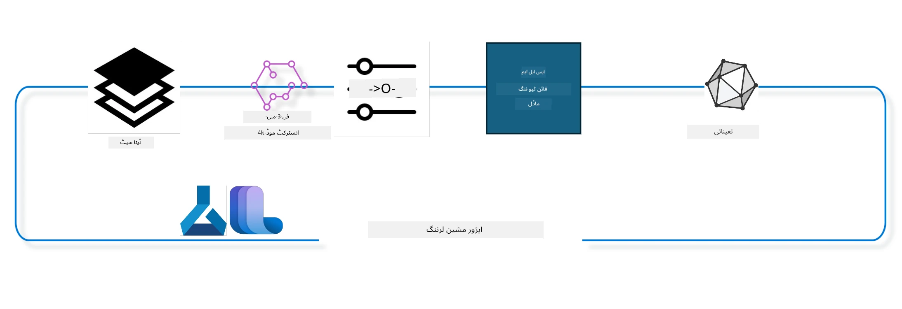

## Azure ML سسٹم رجسٹری سے چیٹ-کمپلیشن کمپونینٹس کو ماڈل کی فائن ٹوننگ کے لیے کیسے استعمال کریں

اس مثال میں ہم Phi-3-mini-4k-instruct ماڈل کی فائن ٹوننگ کریں گے تاکہ ultrachat_200k ڈیٹا سیٹ کا استعمال کرتے ہوئے دو افراد کے درمیان بات چیت پوری کی جا سکے۔



یہ مثال دکھائے گی کہ کس طرح Azure ML SDK اور Python کا استعمال کرتے ہوئے فائن ٹوننگ کی جائے اور پھر فائن ٹونڈ ماڈل کو حقیقی وقت انفرنس کے لیے آن لائن اینڈ پوائنٹ پر تعینات کریں۔

### تربیتی ڈیٹا

ہم ultrachat_200k ڈیٹا سیٹ استعمال کریں گے۔ یہ UltraChat ڈیٹا سیٹ کا انتہائی فلٹر کیا ہوا ورژن ہے اور Zephyr-7B-β، جو ایک جدید 7b چیٹ ماڈل ہے، کی تربیت کے لیے استعمال ہوا تھا۔

### ماڈل

ہم Phi-3-mini-4k-instruct ماڈل استعمال کریں گے تاکہ دکھایا جا سکے کہ صارف کس طرح چیٹ-کمپلیشن ٹاسک کے لیے ماڈل کی فائن ٹوننگ کر سکتا ہے۔ اگر آپ نے یہ نوٹ بُک خاص ماڈل کارڈ سے کھولا ہے، تو مخصوص ماڈل کا نام تبدیل کرنا یاد رکھیں۔

### کام

- ایک ماڈل منتخب کریں جس کی فائن ٹوننگ کی جائے۔
- تربیتی ڈیٹا منتخب کریں اور اس کا جائزہ لیں۔
- فائن ٹوننگ جاب کی ترتیب دیں۔
- فائن ٹوننگ جاب چلائیں۔
- تربیتی اور جانچ کے میٹرکس کا جائزہ لیں۔
- فائن ٹونڈ ماڈل کو رجسٹر کریں۔
- حقیقی وقت کے انفرنس کے لیے فائن ٹونڈ ماڈل تعینات کریں۔
- وسائل کی صفائی کریں۔

## 1. ضروریات کو سیٹ اپ کریں

- انحصار انسٹال کریں
- AzureML ورک اسپیس سے کنیکٹ کریں۔ مزید جاننے کے لیے set up SDK authentication ملاحظہ کریں۔ نیچے <WORKSPACE_NAME>، <RESOURCE_GROUP> اور <SUBSCRIPTION_ID> کو تبدیل کریں۔
- azureml سسٹم رجسٹری سے کنیکٹ کریں
- ایک اختیاری تجربے (experiment) کا نام سیٹ کریں
- کمپیوٹ چیک کریں یا بنائیں۔

> [!NOTE]
> ضروریات: ایک واحد GPU نوڈ میں متعدد GPU کارڈز ہو سکتے ہیں۔ مثلاً، Standard_NC24rs_v3 کے ایک نوڈ میں 4 NVIDIA V100 GPUs ہوتے ہیں جبکہ Standard_NC12s_v3 میں 2 NVIDIA V100 GPUs ہوتے ہیں۔ اس معلومات کے لیے ڈاکیومنٹیشن دیکھیں۔ ہر نوڈ میں GPU کارڈز کی تعداد پارامیٹر gpus_per_node میں سیٹ کی جاتی ہے۔ اسے درست سیٹ کرنا تمام GPUs کے استعمال کو یقینی بنائے گا۔ تجویز کردہ GPU کمپیوٹ SKUs یہاں اور یہاں دستیاب ہیں۔

### Python لائبریریز

نیچے دیے گئے سیل کو چلائیں تاکہ انحصار انسٹال ہو جائیں۔ اگر نئے ماحول میں چل رہے ہیں تو یہ مرحلہ لازمی ہے۔

```bash
pip install azure-ai-ml
pip install azure-identity
pip install datasets==2.9.0
pip install mlflow
pip install azureml-mlflow
```

### Azure ML کے ساتھ تعامل

1. یہ Python اسکرپٹ Azure Machine Learning (Azure ML) سروس کے ساتھ تعامل کے لیے استعمال ہوتا ہے۔ اس کے کام کا خلاصہ درج ذیل ہے:

    - یہ azure.ai.ml، azure.identity، اور azure.ai.ml.entities پیکجز سے ضروری ماڈیولز کو امپورٹ کرتا ہے۔ اس کے علاوہ time ماڈیول بھی امپورٹ ہوتا ہے۔

    - یہ DefaultAzureCredential() کے ذریعے مستند ہونے کی کوشش کرتا ہے، جو Azure کلاؤڈ میں ایپلیکیشنز کی تیزی سے ترقی کے لیے سادہ مستند کاری فراہم کرتا ہے۔ اگر یہ ناکام ہو جاتا ہے تو InteractiveBrowserCredential() کا استعمال کرتا ہے، جو انٹریکٹو لاگ ان پرامپٹ مہیا کرتا ہے۔

    - پھر from_config میتھڈ کے ذریعے MLClient کی مثال بنانے کی کوشش کرتا ہے، جو ڈیفالٹ کنفیگریشن فائل (config.json) سے معلومات پڑھتا ہے۔ اگر یہ ناکام ہو جائے، تو subscription_id، resource_group_name، اور workspace_name دستی طور پر فراہم کرکے MLClient بناتا ہے۔

    - ایک اور MLClient کی مثال بناتا ہے جو Azure ML رجسٹری "azureml" کے لیے ہے، جہاں ماڈلز، فائن ٹوننگ پائپ لائنز، اور ماحول ذخیرہ ہوتے ہیں۔

    - experiment_name کو "chat_completion_Phi-3-mini-4k-instruct" پر سیٹ کرتا ہے۔

    - موجودہ وقت (ایپاک کے بعد سیکنڈز کے طور پر، فلوٹنگ پوائنٹ میں) کو انٹیجر اور پھر سٹرنگ میں تبدیل کرکے ایک منفرد ٹائم اسٹیمپ تیار کرتا ہے۔ یہ منفرد نام اور ورژن بنانے کے لیے استعمال ہو سکتا ہے۔

    ```python
    # ضروری ماڈیولز کو Azure ML اور Azure Identity سے درآمد کریں
    from azure.ai.ml import MLClient
    from azure.identity import (
        DefaultAzureCredential,
        InteractiveBrowserCredential,
    )
    from azure.ai.ml.entities import AmlCompute
    import time  # وقت کا ماڈیول درآمد کریں
    
    # DefaultAzureCredential کا استعمال کرتے ہوئے توثیق کی کوشش کریں
    try:
        credential = DefaultAzureCredential()
        credential.get_token("https://management.azure.com/.default")
    except Exception as ex:  # اگر DefaultAzureCredential ناکام ہو جائے، تو InteractiveBrowserCredential استعمال کریں
        credential = InteractiveBrowserCredential()
    
    # ڈیفالٹ کنفیگریشن فائل کا استعمال کرتے ہوئے MLClient کا ایک مثال بنانے کی کوشش کریں
    try:
        workspace_ml_client = MLClient.from_config(credential=credential)
    except:  # اگر وہ ناکام ہو، تو دستی طور پر تفصیلات فراہم کرکے MLClient کا ایک مثال بنائیں
        workspace_ml_client = MLClient(
            credential,
            subscription_id="<SUBSCRIPTION_ID>",
            resource_group_name="<RESOURCE_GROUP>",
            workspace_name="<WORKSPACE_NAME>",
        )
    
    # Azure ML رجسٹری کے لئے ایک اور MLClient کا مثال بنائیں جس کا نام "azureml" ہے
    # یہ رجسٹری وہ جگہ ہے جہاں ماڈلز، فائن ٹوننگ پائپ لائنز، اور ماحول ذخیرہ کیے جاتے ہیں
    registry_ml_client = MLClient(credential, registry_name="azureml")
    
    # تجربے کا نام سیٹ کریں
    experiment_name = "chat_completion_Phi-3-mini-4k-instruct"
    
    # ایک منفرد ٹائم اسٹیمپ بنائیں جو ناموں اور ورژنز کے لیے استعمال کیا جا سکتا ہے جنہیں منفرد ہونا ضروری ہے
    timestamp = str(int(time.time()))
    ```

## 2. فاؤنڈیشن ماڈل منتخب کریں جس کی فائن ٹوننگ کریں

1. Phi-3-mini-4k-instruct ایک 3.8B پیرامیٹرز والا، ہلکا پھلکا، جدید ماڈل ہے جو Phi-2 کے استعمال شدہ ڈیٹا سیٹس پر مبنی ہے۔ یہ ماڈل Phi-3 ماڈل خاندان سے تعلق رکھتا ہے، اور منی ورژن دو Varianten میں آتا ہے: 4K اور 128K جو کہ اس کا سپورٹ کردہ کانٹیکسٹ لمبائی (ٹوکنز میں) ہے۔ اسے مخصوص مقصد کے لیے فائن ٹوننگ کرنا ضروری ہے۔ آپ ان ماڈلز کو AzureML اسٹوڈیو میں ماڈل کیٹلاگ میں چیٹ-کمپلیشن ٹاسک کے ذریعے فلٹر کرکے دیکھ سکتے ہیں۔ اس مثال میں ہم Phi-3-mini-4k-instruct ماڈل استعمال کر رہے ہیں۔ اگر آپ نے یہ نوٹ بُک کسی مختلف ماڈل کے لیے کھولا ہے، تو ماڈل کا نام اور ورژن مناسب طریقے سے تبدیل کریں۔

> [!NOTE]
> ماڈل کی id پراپرٹی۔ یہ فائن ٹوننگ جاب کو ان پٹ کے طور پر دی جائے گی۔ یہ AzureML اسٹوڈیو ماڈل کیٹلاگ میں ماڈل کی تفصیلات کے صفحہ پر Asset ID فیلڈ بھی دستیاب ہے۔

2. یہ Python اسکرپٹ Azure Machine Learning (Azure ML) سروس کے ساتھ تعامل کر رہا ہے۔ اس کے کام کی تفصیل درج ذیل ہے:

    - ماڈل کا نام "Phi-3-mini-4k-instruct" سیٹ کرتا ہے۔

    - registry_ml_client کی models پراپرٹی کے get میتھڈ کا استعمال کرتا ہے تاکہ Azure ML رجسٹری سے مطلوبہ ماڈل کے تازہ ترین ورژن کو حاصل کیا جا سکے۔ get میتھڈ کو دونوں آرگیومینٹس کے ساتھ کال کیا جاتا ہے: ماڈل کا نام اور ایک لیبل جو تازہ ترین ورژن کو منتخب کرنے کا اشارہ دیتا ہے۔

    - کنسول میں ایک پیغام پرنٹ کرتا ہے کہ فائن ٹوننگ کے لیے کون سا ماڈل، ورژن، اور id استعمال ہوگی۔ اس پیغام کے اندر نام، ورژن، اور ماڈل کی id کو foundation_model آبجیکٹ کی پروپرٹیز سے حاصل کر کے ڈالا جاتا ہے۔

    ```python
    # ماڈل کا نام سیٹ کریں
    model_name = "Phi-3-mini-4k-instruct"
    
    # Azure ML رجسٹری سے ماڈل کا تازہ ترین ورژن حاصل کریں
    foundation_model = registry_ml_client.models.get(model_name, label="latest")
    
    # ماڈل کا نام، ورژن، اور شناختی نمبر پرنٹ کریں
    # یہ معلومات ٹریکنگ اور ڈی بگنگ کے لیے مفید ہے
    print(
        "\n\nUsing model name: {0}, version: {1}, id: {2} for fine tuning".format(
            foundation_model.name, foundation_model.version, foundation_model.id
        )
    )
    ```

## 3. جاب کے لیے کمپیوٹ تخلیق کریں

فائن ٹون جاب صرف GPU کمپیوٹ کے ساتھ کام کرتا ہے۔ کمپیوٹ کا سائز ماڈل کے حجم پر منحصر ہوتا ہے اور زیادہ تر صورتوں میں درست کمپیوٹ کا انتخاب کرنا مشکل ہو سکتا ہے۔ اس سیل میں ہم صارف کو صحیح کمپیوٹ منتخب کرنے میں رہنمائی کرتے ہیں۔

> [!NOTE]
> نیچے درج کمپیوٹ سب سے زیادہ بہتر کنفیگریشن کے ساتھ کام کرتے ہیں۔ کنفیگریشن میں کوئی تبدیلی CUDA Out Of Memory کی خرابی کا باعث بن سکتی ہے۔ ایسی صورت میں کمپیوٹ کو بڑے سائز میں اپگریڈ کرنے کی کوشش کریں۔

> [!NOTE]
> جب compute_cluster_size منتخب کریں، تو یقینی بنائیں کہ متعلقہ کمپیوٹ آپ کے resource group میں دستیاب ہو۔ اگر کوئی خاص کمپیوٹ دستیاب نہیں، تو کمپیوٹ وسائل تک رسائی کے لیے درخواست دے سکتے ہیں۔

### فائن ٹوننگ سپورٹ کے لیے ماڈل کی جانچ

1. یہ Python اسکرپٹ Azure Machine Learning (Azure ML) ماڈل کے ساتھ تعامل کا کام کرتا ہے۔ اس کا خلاصہ درج ذیل ہے:

    - ast ماڈیول امپورٹ کرتا ہے جو پائتھن ابسٹریکٹ سنتیکس ٹری پراسیس کرنے کے فنکشنز فراہم کرتا ہے۔

    - چیک کرتا ہے کہ آیا foundation_model آبجیکٹ (جو Azure ML میں ایک ماڈل کی نمائندگی کرتا ہے) میں finetune_compute_allow_list نامی ٹیگ موجود ہے یا نہیں۔ Azure ML میں ٹیگز key-value جوڑے ہوتے ہیں جو ماڈلز کو فلٹر اور ترتیب دینے کے لیے استعمال ہو سکتے ہیں۔

    - اگر finetune_compute_allow_list ٹیگ موجود ہے تو ast.literal_eval سے اس ٹیگ کی ویلیو (جو ایک سٹرنگ ہے) کو پائتھن کی فہرست میں محفوظ طریقے سے پارس کرتا ہے، اور اسے computes_allow_list ویری ایبل میں محفوظ کرتا ہے۔ پھر ایک پیغام پرنٹ کرتا ہے کہ کمپیوٹ لسٹ سے منتخب ہونا چاہیے۔

    - اگر ٹیگ موجود نہیں ہے، تو computes_allow_list کو None سیٹ کرتا ہے اور ایک پیغام دیتا ہے کہ ٹیگ ماڈل کے ٹیگز کا حصہ نہیں ہے۔

    - خلاصے میں یہ اسکرپٹ ماڈل کے میٹا ڈیٹا میں ایک مخصوص ٹیگ کی جانچ کرتا ہے، اگر موجود ہو تو اس کی ویلیو کو فہرست میں تبدیل کرتا ہے، اور صارف کو مناسب فیڈبیک دیتا ہے۔

    ```python
    # پائتھن کے انتزاعی نحو کے درختوں کو پروسیس کرنے کے لیے افعال فراہم کرنے والا ast ماڈیول امپورٹ کریں
    import ast
    
    # چیک کریں کہ 'finetune_compute_allow_list' ٹیگ ماڈل کے ٹیگز میں موجود ہے یا نہیں
    if "finetune_compute_allow_list" in foundation_model.tags:
        # اگر ٹیگ موجود ہو، تو ast.literal_eval کا استعمال کرتے ہوئے ٹیگ کی ویلیو (ایک سٹرنگ) کو محفوظ طریقے سے پائتھن کی فہرست میں تبدیل کریں
        computes_allow_list = ast.literal_eval(
            foundation_model.tags["finetune_compute_allow_list"]
        )  # سٹرنگ کو پائتھن کی فہرست میں تبدیل کریں
        # ایک پیغام پرنٹ کریں جو ظاہر کرے کہ فہرست سے کمپیوٹ بنانا چاہیے
        print(f"Please create a compute from the above list - {computes_allow_list}")
    else:
        # اگر ٹیگ موجود نہ ہو، تو computes_allow_list کو None پر سیٹ کریں
        computes_allow_list = None
        # ایک پیغام پرنٹ کریں جو ظاہر کرے کہ 'finetune_compute_allow_list' ٹیگ ماڈل کے ٹیگز کا حصہ نہیں ہے
        print("`finetune_compute_allow_list` is not part of model tags")
    ```

### کمپیوٹ انسٹینس کی جانچ

1. یہ Python اسکرپٹ Azure Machine Learning (Azure ML) سروس کے ساتھ تعامل کر رہا ہے اور ایک کمپیوٹ انسٹینس کے کئی چیک انجام دیتا ہے۔ اس کا خلاصہ درج ذیل ہے:

    - Azure ML ورک اسپیس سے compute_cluster نام کے کمپیوٹ انسٹینس کو حاصل کرنے کی کوشش کرتا ہے۔ اگر اس کا provisioning state "failed" ہو تو ValueError پھینک دیتا ہے۔

    - اگر computes_allow_list None نہ ہو، تو اس کی تمام سائزز کو چھوٹے حروف میں تبدیل کرتا ہے اور دیکھتا ہے کہ موجودہ کمپیوٹ انسٹینس کا سائز اس فہرست میں ہے یا نہیں۔ اگر نہیں، تو ValueError پھینک دیتا ہے۔

    - اگر computes_allow_list None ہو، تو اس بات کو چیک کرتا ہے کہ موجودہ کمپیوٹ انسٹینس کا سائز غیر سپورٹڈ GPU VM سائز کی فہرست میں تو نہیں۔ اگر ہے، تو ValueError پھینک دیتا ہے۔

    - ورک اسپیس میں تمام دستیاب کمپیوٹ سائزز کی فہرست حاصل کرتا ہے۔ پھر ہر کمپیوٹ سائز کے نام کو موجودہ کمپیوٹ انسٹینس کے سائز سے موازنہ کرتا ہے۔ اگر مماثل ہو، تو اس کمپیوٹ سائز میں GPUs کی تعداد حاصل کر کے gpu_count_found کو True کر دیتا ہے۔

    - اگر gpu_count_found True ہو تو کمپیوٹ انسٹینس میں GPU کی تعداد پرنٹ کرتا ہے۔ اگر False ہو تو ValueError پھینک دیتا ہے۔

    - خلاصہ یہ کہ یہ اسکرپٹ Azure ML ورک اسپیس میں کمپیوٹ انسٹینس کی پروویژنینگ اسٹیٹ، سائز کے خلاف اجازت یافتہ یا نامنظور فہرست، اور GPU کی تعداد چیک کرتا ہے۔

    ```python
    # استثناء کا پیغام پرنٹ کریں
    print(e)
    # اگر ورک اسپیس میں compute size دستیاب نہیں ہے تو ValueError اٹھائیں
    raise ValueError(
        f"WARNING! Compute size {compute_cluster_size} not available in workspace"
    )
    
    # Azure ML ورک اسپیس سے compute instance حاصل کریں
    compute = workspace_ml_client.compute.get(compute_cluster)
    # چیک کریں کہ compute instance کی provisioning state "failed" ہے یا نہیں
    if compute.provisioning_state.lower() == "failed":
        # اگر provisioning state "failed" ہو تو ValueError اٹھائیں
        raise ValueError(
            f"Provisioning failed, Compute '{compute_cluster}' is in failed state. "
            f"please try creating a different compute"
        )
    
    # چیک کریں کہ computes_allow_list None نہیں ہے
    if computes_allow_list is not None:
        # computes_allow_list میں تمام compute sizes کو چھوٹے حروف میں تبدیل کریں
        computes_allow_list_lower_case = [x.lower() for x in computes_allow_list]
        # چیک کریں کہ compute instance کا سائز computes_allow_list_lower_case میں ہے یا نہیں
        if compute.size.lower() not in computes_allow_list_lower_case:
            # اگر compute instance کا سائز computes_allow_list_lower_case میں نہیں ہے تو ValueError اٹھائیں
            raise ValueError(
                f"VM size {compute.size} is not in the allow-listed computes for finetuning"
            )
    else:
        # غیر معاون GPU VM سائزز کی فہرست تعریف کریں
        unsupported_gpu_vm_list = [
            "standard_nc6",
            "standard_nc12",
            "standard_nc24",
            "standard_nc24r",
        ]
        # چیک کریں کہ compute instance کا سائز unsupported_gpu_vm_list میں ہے یا نہیں
        if compute.size.lower() in unsupported_gpu_vm_list:
            # اگر compute instance کا سائز unsupported_gpu_vm_list میں ہے تو ValueError اٹھائیں
            raise ValueError(
                f"VM size {compute.size} is currently not supported for finetuning"
            )
    
    # ایک فلیگ initialize کریں تاکہ چیک کیا جا سکے کہ compute instance میں GPUs کی تعداد مل گئی ہے یا نہیں
    gpu_count_found = False
    # ورک اسپیس میں دستیاب تمام compute sizes کی فہرست حاصل کریں
    workspace_compute_sku_list = workspace_ml_client.compute.list_sizes()
    available_sku_sizes = []
    # دستیاب compute sizes کی فہرست پر تکرار کریں
    for compute_sku in workspace_compute_sku_list:
        available_sku_sizes.append(compute_sku.name)
        # چیک کریں کہ compute size کا نام compute instance کے سائز سے میل کھاتا ہے یا نہیں
        if compute_sku.name.lower() == compute.size.lower():
            # اگر میل کھاتا ہے، تو اس compute size کے لیے GPUs کی تعداد حاصل کریں اور gpu_count_found کو True پر سیٹ کریں
            gpus_per_node = compute_sku.gpus
            gpu_count_found = True
    # اگر gpu_count_found True ہے، تو compute instance میں GPUs کی تعداد پرنٹ کریں
    if gpu_count_found:
        print(f"Number of GPU's in compute {compute.size}: {gpus_per_node}")
    else:
        # اگر gpu_count_found False ہے تو ValueError اٹھائیں
        raise ValueError(
            f"Number of GPU's in compute {compute.size} not found. Available skus are: {available_sku_sizes}."
            f"This should not happen. Please check the selected compute cluster: {compute_cluster} and try again."
        )
    ```

## 4. فائن ٹوننگ کے لیے ڈیٹا سیٹ منتخب کریں

1. ہم ultrachat_200k ڈیٹا سیٹ استعمال کرتے ہیں۔ اس ڈیٹا سیٹ میں چار حصے ہوتے ہیں، جو سپروائزڈ فائن ٹوننگ (sft) کے لیے موزوں ہیں۔
جنریشن رینکنگ (gen)۔ ہر حصے میں نمونوں کی تعداد درج ذیل ہے:

    ```bash
    train_sft test_sft  train_gen  test_gen
    207865  23110  256032  28304
    ```

1. اگلے چند سیلز میں فائن ٹوننگ کے لیے بنیادی ڈیٹا تیاری دکھائی گئی ہے:

### کچھ ڈیٹا کی قطاریں دیکھیں

ہم چاہتے ہیں کہ یہ نمونہ جلدی چلے، اس لیے train_sft اور test_sft فائلز محفوظ کریں جو پہلے سے چھنی ہوئی قطاروں کا 5% رکھتے ہیں۔ اس کا مطلب ہے کہ فائن ٹونڈ ماڈل کی درستی کم ہوگی، اس لیے اسے حقیقی دنیا میں استعمال نہیں کرنا چاہیے۔
download-dataset.py ultrachat_200k ڈیٹا سیٹ ڈاؤن لوڈ کرنے اور ڈیٹا سیٹ کو فائن ٹون پائپ لائن کمپونینٹ کے قابل استعمال فارمیٹ میں تبدیل کرنے کے لیے استعمال ہوتا ہے۔ چونکہ ڈیٹا سیٹ بڑا ہے، ہم یہاں صرف اس کا ایک حصہ رکھتے ہیں۔

1. نیچے دیا گیا اسکرپٹ صرف 5% ڈیٹا ڈاؤن لوڈ کرتا ہے۔ اس مقدار کو dataset_split_pc پیرامیٹر کی ویلیو تبدیل کرکے بڑھایا جا سکتا ہے۔

> [!NOTE]
> کچھ زبان کے ماڈلز کے مختلف زبان کوڈ ہوتے ہیں، اس لیے ڈیٹا سیٹ کی کالم کے نام کو بھی اسی کے مطابق ہونا چاہیے۔

1. ڈیٹا کا ایک مثال یہ ہے:
چیٹ-کمپلیشن ڈیٹا سیٹ parquet فارمیٹ میں ذخیرہ کیا جاتا ہے جس میں ہر اندراج درج ذیل اسکیمہ استعمال کرتا ہے:

    - یہ JSON (JavaScript Object Notation) دستاویز ہے، جو ایک معروف ڈیٹا انٹرچینج فارمیٹ ہے۔ یہ executable کوڈ نہیں، بلکہ ڈیٹا ذخیرہ کرنے اور منتقل کرنے کا ایک طریقہ ہے۔ اس کی ساخت کا خلاصہ یہ ہے:

    - "prompt": یہ کلید ایک سٹرنگ ویلیو رکھتی ہے جو AI اسسٹنٹ کو دیا گیا کام یا سوال ظاہر کرتی ہے۔

    - "messages": یہ کلید اشیاء کی ایک صف رکھتی ہے۔ ہر شے صارف اور AI اسسٹنٹ کے درمیان بات چیت کا پیغام ہے۔ ہر پیغام کی دو کلیدیں ہوتی ہیں:

    - "content": پیغام کا مواد۔
    - "role": جو بھی پیغام بھیج رہا ہے اس کا کردار، "user" یا "assistant"۔
    - "prompt_id": منفرد نشان دہی جو پرومپٹ کو شناخت کرتی ہے۔

1. اس خاص JSON دستاویز میں ایک گفتگو دکھائی گئی ہے جہاں صارف AI اسسٹنٹ سے dystopian کہانی کے کردار بنانے کو کہتا ہے۔ اسسٹنٹ جواب دیتا ہے، پھر صارف مزید تفصیلات مانگتا ہے۔ اسسٹنٹ مزید تفصیلات فراہم کرنے پر راضی ہو جاتا ہے۔ پوری گفتگو ایک مخصوص prompt_id کے ساتھ منسلک ہے۔

    ```python
    {
        // The task or question posed to an AI assistant
        "prompt": "Create a fully-developed protagonist who is challenged to survive within a dystopian society under the rule of a tyrant. ...",
        
        // An array of objects, each representing a message in a conversation between a user and an AI assistant
        "messages":[
            {
                // The content of the user's message
                "content": "Create a fully-developed protagonist who is challenged to survive within a dystopian society under the rule of a tyrant. ...",
                // The role of the entity that sent the message
                "role": "user"
            },
            {
                // The content of the assistant's message
                "content": "Name: Ava\n\n Ava was just 16 years old when the world as she knew it came crashing down. The government had collapsed, leaving behind a chaotic and lawless society. ...",
                // The role of the entity that sent the message
                "role": "assistant"
            },
            {
                // The content of the user's message
                "content": "Wow, Ava's story is so intense and inspiring! Can you provide me with more details.  ...",
                // The role of the entity that sent the message
                "role": "user"
            }, 
            {
                // The content of the assistant's message
                "content": "Certainly! ....",
                // The role of the entity that sent the message
                "role": "assistant"
            }
        ],
        
        // A unique identifier for the prompt
        "prompt_id": "d938b65dfe31f05f80eb8572964c6673eddbd68eff3db6bd234d7f1e3b86c2af"
    }
    ```

### ڈیٹا ڈاؤن لوڈ کریں

1. یہ Python اسکرپٹ download-dataset.py نامی مددگار اسکرپٹ کا استعمال کرتے ہوئے ڈیٹا سیٹ ڈاؤن لوڈ کرنے کے لیے ہے۔ اس کا خلاصہ درج ذیل ہے:

    - یہ os ماڈیول امپورٹ کرتا ہے، جو OS کی فنکشنالٹی کے لیے پورٹیبل طریقہ فراہم کرتا ہے۔

    - os.system فنکشن کا استعمال کرکے shell میں download-dataset.py اسکرپٹ چلایا جاتا ہے، جس میں کمانڈ لائن آرگیومنٹس ہوتے ہیں: ڈاؤن لوڈ کرنے کے لیے ڈیٹا سیٹ (HuggingFaceH4/ultrachat_200k)، ڈاؤن لوڈ فولڈر (ultrachat_200k_dataset)، اور ڈیٹا سیٹ کی تقسیم کی فیصد (5)۔ os.system کمانڈ کے ایگزٹ اسٹیٹس کو exit_status ویری ایبل میں محفوظ کرتا ہے۔

    - چیک کرتا ہے کہ exit_status 0 کے برابر نہیں ہے۔ Unix طرز کے OS میں، 0 کا مطلب کامیابی ہوتا ہے، ورنہ خرابی۔ اگر خرابی ہو تو Exception پھینک دیتا ہے کہ ڈیٹا سیٹ ڈاؤن لوڈ میں مسئلہ ہوا۔

    - خلاصہ یہ کہ یہ اسکرپٹ مددگار اسکرپٹ کے ذریعے ڈیٹا سیٹ ڈاؤن لوڈ کرتا ہے اور خرابی کی صورت میں استثنا پیدا کرتا ہے۔

    ```python
    # os ماڈیول کو امپورٹ کریں، جو آپریٹنگ سسٹم پر منحصر فنکشنالٹی کو استعمال کرنے کا طریقہ فراہم کرتا ہے
    import os
    
    # os.system فنکشن کو استعمال کریں تاکہ download-dataset.py اسکرپٹ کو مخصوص کمانڈ لائن آرگیومنٹس کے ساتھ شیل میں چلایا جا سکے
    # آرگیومنٹس اس ڈیٹاسیٹ کو ڈاؤن لوڈ کرنے کی وضاحت کرتے ہیں (HuggingFaceH4/ultrachat_200k)، جس ڈائریکٹری میں اسے ڈاؤن لوڈ کرنا ہے (ultrachat_200k_dataset)، اور ڈیٹاسیٹ کو تقسیم کرنے کا فیصد (5)
    # os.system فنکشن اس کمانڈ کے ایگزٹ اسٹیٹس کو واپس کرتا ہے جو اس نے چلائی؛ یہ اسٹیٹس exit_status ویری ایبل میں محفوظ کی جاتی ہے
    exit_status = os.system(
        "python ./download-dataset.py --dataset HuggingFaceH4/ultrachat_200k --download_dir ultrachat_200k_dataset --dataset_split_pc 5"
    )
    
    # چیک کریں کہ آیا exit_status صفر نہیں ہے
    # یونکس جیسی آپریٹنگ سسٹمز میں، صفر کا exit статус عام طور پر کمانڈ کی کامیابی کی نشاندہی کرتا ہے، جبکہ کوئی بھی دوسرا نمبر غلطی کی علامت ہوتا ہے
    # اگر exit_status صفر نہیں ہے، تو ایک Exception اٹھائیں جس میں یہ پیغام ہو کہ ڈیٹاسیٹ ڈاؤن لوڈ کرنے میں خرابی ہوئی ہے
    if exit_status != 0:
        raise Exception("Error downloading dataset")
    ```

### ڈیٹا فریم میں ڈیٹا لوڈ کرنا
1. یہ Python اسکرپٹ ایک JSON لائنز فائل کو pandas DataFrame میں لوڈ کر رہا ہے اور پہلے 5 قطاریں دکھا رہا ہے۔ یہ ہے کہ یہ کیا کرتا ہے:

    - یہ pandas لائبریری کو امپورٹ کرتا ہے، جو ایک طاقتور ڈیٹا مینپولیشن اور تجزیہ کی لائبریری ہے۔

    - یہ pandas کے ڈسپلے آپشنز کے لیے زیادہ سے زیادہ کالم چوڑائی کو 0 پر سیٹ کرتا ہے۔ اس کا مطلب ہے کہ جب DataFrame پرنٹ کیا جائے گا تو ہر کالم کا مکمل متن بغیر کٹاؤ کے دکھایا جائے گا۔

    - یہ pd.read_json فنکشن کا استعمال کرتا ہے تاکہ ultrachat_200k_dataset ڈائریکٹری سے train_sft.jsonl فائل کو DataFrame میں لوڈ کیا جائے۔ lines=True دلیل ظاہر کرتی ہے کہ فائل JSON لائنز فارمیٹ میں ہے، جہاں ہر لائن ایک الگ JSON آبجیکٹ ہے۔

    - یہ head طریقہ استعمال کرتا ہے تاکہ DataFrame کی پہلی 5 قطاریں دکھائی جائیں۔ اگر DataFrame میں 5 سے کم قطاریں ہوں، تو یہ تمام قطاریں دکھائے گا۔

    - خلاصہ یہ کہ، یہ اسکرپٹ ایک JSON لائنز فائل کو DataFrame میں لوڈ کر رہا ہے اور پہلے 5 قطاریں مکمل کالم متن کے ساتھ دکھا رہا ہے۔
    
    ```python
    # پانڈاز لائبریری کو امپورٹ کریں، جو کہ طاقتور ڈیٹا کی ترتیب اور تجزیہ کی لائبریری ہے
    import pandas as pd
    
    # pandas کی ڈسپلے آپشنز کے لیے زیادہ سے زیادہ کالم کی چوڑائی 0 مقرر کریں
    # اس کا مطلب ہے کہ ہر کالم کا مکمل متن بغیر کسی قطع کے ظاہر ہوگا جب DataFrame پرنٹ کیا جائے گا
    pd.set_option("display.max_colwidth", 0)
    
    # pd.read_json فنکشن استعمال کریں تاکہ ultrachat_200k_dataset ڈائریکٹری سے train_sft.jsonl فائل کو DataFrame میں لوڈ کیا جا سکے
    # lines=True دلیل اس بات کی نشاندہی کرتی ہے کہ فائل JSON Lines فارمیٹ میں ہے، جہاں ہر لائن ایک الگ JSON آبجیکٹ ہے
    df = pd.read_json("./ultrachat_200k_dataset/train_sft.jsonl", lines=True)
    
    # head میتھڈ استعمال کریں تاکہ DataFrame کی پہلی 5 قطاریں دکھائیں
    # اگر DataFrame میں 5 سے کم قطاریں ہوں تو یہ تمام قطاریں دکھائے گا
    df.head()
    ```

## 5. ماڈل اور ڈیٹا کو ان پٹ کے طور پر استعمال کرتے ہوئے فائن-ٹیوننگ جاب جمع کروائیں

چاہت کمپلیشن پائپ لائن کمپونینٹ استعمال کرنے والی جاب بنائیں۔ تمام پیرامیٹرز جو فائن ٹوننگ کے لیے سپورٹ کیے جاتے ہیں، کے بارے میں مزید جانیں۔

### فائن ٹیون پیرامیٹرز کی تعریف کریں

1. فائن ٹیون پیرامیٹرز دو زمروں میں گروپ کیے جا سکتے ہیں - ٹریننگ پیرامیٹرز اور آپٹیمائزیشن پیرامیٹرز

1. ٹریننگ پیرامیٹرز وہ ٹریننگ کے پہلو بیان کرتے ہیں جیسے -

    - کونسا optimizer یا scheduler استعمال کرنا ہے
    - فائن ٹیون کو بہتر بنانے کے لیے کونسا میٹرک استعمال کرنا ہے
    - تربیتی مراحل کی تعداد، بیچ سائز وغیرہ
    - آپٹیمائزیشن پیرامیٹرز GPU میموری کو بہتر بنانے اور کمپیوٹ وسائل کا مؤثر استعمال کرنے میں مدد کرتے ہیں۔

1. نیچے ان میں سے چند پیرامیٹرز دیے گئے ہیں جو اس زمرے سے تعلق رکھتے ہیں۔ آپٹیمائزیشن پیرامیٹرز ہر ماڈل کے لیے مختلف ہوتے ہیں اور ماڈل کے ساتھ پیک کیے جاتے ہیں تاکہ ان فرقوں کو سنبھالا جا سکے۔

    - Deepspeed اور LoRA کو فعال کریں
    - مکسڈ پریسیشن ٹریننگ کو فعال کریں
    - ملٹی نوڈ ٹریننگ کو فعال کریں

> [!NOTE]
> نگرانی شدہ فائن ٹیوننگ کی وجہ سے الائنمنٹ کا نقصان یا شدید فراموشی ہو سکتی ہے۔ ہم تجویز کرتے ہیں کہ اس مسئلے کی جانچ کریں اور فائن ٹیوننگ کے بعد الائنمنٹ مرحلہ چلائیں۔

### فائن ٹیوننگ پیرامیٹرز

1. یہ Python اسکرپٹ مشین لرننگ ماڈل کی فائن ٹیوننگ کے لیے پیرامیٹرز سیٹ کر رہا ہے۔ یہ ہے کہ یہ کیا کرتا ہے:

    - یہ ڈیفالٹ ٹریننگ پیرامیٹرز سیٹ کرتا ہے جیسے کہ ٹریننگ ادوار، تربیت اور جانچ کے بیچ سائز، لرننگ ریٹ، اور لرننگ ریٹ شیڈیولر کی قسم۔

    - یہ ڈیفالٹ آپٹیمائزیشن پیرامیٹرز سیٹ کرتا ہے جیسے کہ Layer-wise Relevance Propagation (LoRa) اور DeepSpeed کو لاگو کرنا یا نہیں، اور DeepSpeed کا مرحلہ۔

    - یہ ٹریننگ اور آپٹیمائزیشن پیرامیٹرز کو ایک واحد لغت finetune_parameters میں یکجا کرتا ہے۔

    - یہ چیک کرتا ہے کہ foundation_model کے پاس کوئی ماڈل مخصوص ڈیفالٹ پیرامیٹر موجود ہیں یا نہیں۔ اگر ہیں تو، یہ وارننگ پیغام پرنٹ کرتا ہے اور finetune_parameters لغت کو ماڈل مخصوص ڈیفالٹس سے اپڈیٹ کرتا ہے۔ ast.literal_eval فنکشن ماڈل مخصوص ڈیفالٹس کو سٹرنگ سے Python لغت میں تبدیل کرنے کے لیے استعمال ہوتا ہے۔

    - یہ فائن ٹیوننگ کے لیے استعمال کیے جانے والے حتمی پیرامیٹرز پرنٹ کرتا ہے۔

    - خلاصہ یہ کہ یہ اسکرپٹ فائن ٹیوننگ پیرامیٹرز سیٹ کر رہا ہے اور انہیں دکھا رہا ہے، ساتھ ہی ماڈل مخصوص ڈیفالٹس کے ساتھ ڈیفالٹ پیرامیٹرز کو اووررائیڈ کرنے کی سہولت فراہم کر رہا ہے۔

    ```python
    # تربیتی ایپوک کی تعداد، تربیت اور تشخیصی بیچ سائز، لرننگ ریٹ، اور لرننگ ریٹ شیڈولر قسم جیسے ڈیفالٹ تربیتی پیرامیٹرز سیٹ کریں
    training_parameters = dict(
        num_train_epochs=3,
        per_device_train_batch_size=1,
        per_device_eval_batch_size=1,
        learning_rate=5e-6,
        lr_scheduler_type="cosine",
    )
    
    # ڈیفالٹ آپٹیمائزیشن پیرامیٹرز سیٹ کریں جیسے کہ آیا لیئر وائز ریلیوینس پروپیگیشن (LoRa) اور DeepSpeed لاگو کرنا ہے، اور DeepSpeed کا اسٹیج
    optimization_parameters = dict(
        apply_lora="true",
        apply_deepspeed="true",
        deepspeed_stage=2,
    )
    
    # تربیتی اور آپٹیمائزیشن پیرامیٹرز کو ایک واحد ڈکشنری finetune_parameters میں جمع کریں
    finetune_parameters = {**training_parameters, **optimization_parameters}
    
    # چیک کریں کہ foundation_model کے پاس کوئی ماڈل مخصوص ڈیفالٹ پیرامیٹرز ہیں یا نہیں
    # اگر ہیں، تو وارننگ پیغام پرنٹ کریں اور finetune_parameters ڈکشنری کو ان ماڈل مخصوص ڈیفالٹس کے ساتھ اپ ڈیٹ کریں
    # ast.literal_eval فنکشن ماڈل مخصوص ڈیفالٹس کو سٹرنگ سے پائتھون ڈکشنری میں تبدیل کرنے کے لیے استعمال ہوتا ہے
    if "model_specific_defaults" in foundation_model.tags:
        print("Warning! Model specific defaults exist. The defaults could be overridden.")
        finetune_parameters.update(
            ast.literal_eval(  # سٹرنگ کو پائتھون ڈکشنری میں تبدیل کریں
                foundation_model.tags["model_specific_defaults"]
            )
        )
    
    # آخری فائن ٹیوننگ پیرامیٹرز کا سیٹ پرنٹ کریں جو رن کے لیے استعمال ہوں گے
    print(
        f"The following finetune parameters are going to be set for the run: {finetune_parameters}"
    )
    ```

### ٹریننگ پائپ لائن

1. یہ Python اسکرپٹ ایک فنکشن ڈیفائن کر رہا ہے جو مشین لرننگ ٹریننگ پائپ لائن کے لیے ڈسپلے نام پیدا کرتا ہے، اور پھر اس فنکشن کو کال کر کے ڈسپلے نام پیدا کر کے پرنٹ کرتا ہے۔ یہ ہے کہ یہ کیا کرتا ہے:

1. get_pipeline_display_name فنکشن ڈیفائن کیا گیا ہے۔ یہ فنکشن ٹریننگ پائپ لائن سے متعلق مختلف پیرامیٹرز کی بنیاد پر ایک ڈسپلے نام جنریٹ کرتا ہے۔

1. فنکشن کے اندر، یہ کل بیچ سائز کا حساب لگاتا ہے جو فی ڈیوائس بیچ سائز، گریڈینٹ اکومیولیشن کے مراحل کی تعداد، ہر نوڈ پر GPU کی تعداد، اور فائن ٹیوننگ کے لیے استعمال ہونے والے نوڈز کی تعداد کو ضرب دے کر حاصل ہوتا ہے۔

1. یہ دیگر مختلف پیرامیٹرز حاصل کرتا ہے جیسے لرننگ ریٹ شیڈیولر کی قسم، کیا DeepSpeed استعمال ہوا ہے، DeepSpeed کا مرحلہ، کیا Layer-wise Relevance Propagation (LoRa) اپلائی ہوا ہے، ماڈل چیکپوائنٹس کی زیادہ سے زیادہ تعداد، اور زیادہ سے زیادہ سیquence کی لمبائی۔

1. یہ ایک سٹرنگ بناتا ہے جس میں یہ سب پیرامیٹرز ہائفن سے جدا ہوتے ہیں۔ اگر DeepSpeed یا LoRa استعمال ہوا ہے، تو سٹرنگ میں "ds" کے بعد DeepSpeed کا مرحلہ، یا "lora" شامل ہوتا ہے۔ اگر نہیں، تو "nods" یا "nolora" شامل ہوتا ہے۔

1. فنکشن اس سٹرنگ کو واپس کرتا ہے جو ٹریننگ پائپ لائن کے ڈسپلے نام کے طور پر کام کرتا ہے۔

1. فنکشن ڈیفائن کرنے کے بعد اسے کال کیا جاتا ہے تاکہ ڈسپلے نام حاصل کیا جا سکے، جو پھر پرنٹ کیا جاتا ہے۔

1. خلاصہ یہ کہ یہ اسکرپٹ مختلف پیرامیٹرز کی بنیاد پر مشین لرننگ ٹریننگ پائپ لائن کے لیے ڈسپلے نام بناتا ہے اور اسے پرنٹ کرتا ہے۔

    ```python
    # ٹریننگ پائپ لائن کے لیے ڈسپلے نام بنانے کے لیے ایک فنکشن کی تعریف کریں
    def get_pipeline_display_name():
        # فی ڈیوائس بیچ سائز، گریڈینٹ اکومیولیشن اسٹیپس کی تعداد، فی نوڈ GPUs کی تعداد، اور فائن ٹیوننگ کے لیے استعمال ہونے والے نوڈز کی تعداد کو ضرب دے کر کل بیچ سائز کا حساب لگائیں
        batch_size = (
            int(finetune_parameters.get("per_device_train_batch_size", 1))
            * int(finetune_parameters.get("gradient_accumulation_steps", 1))
            * int(gpus_per_node)
            * int(finetune_parameters.get("num_nodes_finetune", 1))
        )
        # لرننگ ریٹ شیڈولر کی قسم حاصل کریں
        scheduler = finetune_parameters.get("lr_scheduler_type", "linear")
        # معلوم کریں کہ کیا ڈیپ اسپیس لگایا گیا ہے
        deepspeed = finetune_parameters.get("apply_deepspeed", "false")
        # ڈیپ اسپیس مرحلے کو حاصل کریں
        ds_stage = finetune_parameters.get("deepspeed_stage", "2")
        # اگر ڈیپ اسپیس لگایا گیا ہو تو ڈسپلے نام میں "ds" اور ڈیپ اسپیس مرحلے کو شامل کریں؛ اگر نہیں تو "nods" شامل کریں
        if deepspeed == "true":
            ds_string = f"ds{ds_stage}"
        else:
            ds_string = "nods"
        # معلوم کریں کہ کیا لیئر وائز ریلیونس پرپگیشن (لو را) لگایا گیا ہے
        lora = finetune_parameters.get("apply_lora", "false")
        # اگر لو را لگایا گیا ہو تو ڈسپلے نام میں "lora" شامل کریں؛ اگر نہیں تو "nolora" شامل کریں
        if lora == "true":
            lora_string = "lora"
        else:
            lora_string = "nolora"
        # ماڈل چیک پوائنٹس کو رکھنے کی حد حاصل کریں
        save_limit = finetune_parameters.get("save_total_limit", -1)
        # زیادہ سے زیادہ سیکوئنس کی لمبائی حاصل کریں
        seq_len = finetune_parameters.get("max_seq_length", -1)
        # ان تمام پیرا میٹرز کو ہائفن کے ساتھ جوڑ کر ڈسپلے نام بنائیں
        return (
            model_name
            + "-"
            + "ultrachat"
            + "-"
            + f"bs{batch_size}"
            + "-"
            + f"{scheduler}"
            + "-"
            + ds_string
            + "-"
            + lora_string
            + f"-save_limit{save_limit}"
            + f"-seqlen{seq_len}"
        )
    
    # ڈسپلے نام بنانے کے لیے فنکشن کو کال کریں
    pipeline_display_name = get_pipeline_display_name()
    # ڈسپلے نام پرنٹ کریں
    print(f"Display name used for the run: {pipeline_display_name}")
    ```

### پائپ لائن کی تشکیل

یہ Python اسکرپٹ Azure Machine Learning SDK کا استعمال کرتے ہوئے ایک مشین لرننگ پائپ لائن ڈیفائن اور کنفیگر کر رہا ہے۔ یہ ہے کہ یہ کیا کرتا ہے:

1. یہ Azure AI ML SDK سے ضروری ماڈیولز امپورٹ کرتا ہے۔

1. یہ رجسٹری سے "chat_completion_pipeline" نامی پائپ لائن کمپونینٹ حاصل کرتا ہے۔

1. یہ `@pipeline` ڈیکوریٹر اور `create_pipeline` فنکشن کا استعمال کرتے ہوئے پائپ لائن جاب ڈیفائن کرتا ہے۔ پائپ لائن کا نام `pipeline_display_name` پر سیٹ کیا گیا ہے۔

1. `create_pipeline` فنکشن کے اندر، یہ حاصل شدہ پائپ لائن کمپونینٹ کو مختلف پیرامیٹرز کے ساتھ initialize کرتا ہے، جن میں ماڈل کا راستہ، مختلف مراحل کے لیے کمپیوٹ کلسٹرز، ٹریننگ اور ٹیسٹنگ کے لیے ڈیٹا سیٹ سپلٹس، فائن ٹیوننگ کے لیے استعمال ہونے والے GPUs کی تعداد، اور دیگر فائن ٹیوننگ پیرامیٹرز شامل ہیں۔

1. یہ فائن ٹیوننگ جاب کے آؤٹ پٹ کو پائپ لائن جاب کے آؤٹ پٹ سے میپ کرتا ہے تاکہ فائن ٹیون کیا گیا ماڈل آسانی سے رجسٹر کیا جا سکے، جو کہ ماڈل کو آن لائن یا بیچ اینڈ پوائنٹ پر تعینات کرنے کے لیے ضروری ہے۔

1. یہ `create_pipeline` فنکشن کو کال کر کے پائپ لائن کی ایک انٹانس بناتا ہے۔

1. یہ پائپ لائن کی `force_rerun` سیٹنگ کو `True` پر سیٹ کرتا ہے، یعنی ماضی کی جابز کے cached نتائج استعمال نہیں ہوں گے۔

1. یہ پائپ لائن کی `continue_on_step_failure` سیٹنگ کو `False` پر سیٹ کرتا ہے، یعنی اگر کوئی بھی مرحلہ ناکام ہو تو پائپ لائن رک جائے گی۔

1. خلاصہ یہ کہ یہ اسکرپٹ Azure Machine Learning SDK کا استعمال کرتے ہوئے چیٹ کمپلیشن ٹاسک کے لیے مشین لرننگ پائپ لائن کو ڈیفائن اور کنفیگر کر رہا ہے۔

    ```python
    # ضروری ماڈیول Azure AI ML SDK سے درآمد کریں
    from azure.ai.ml.dsl import pipeline
    from azure.ai.ml import Input
    
    # رجسٹری سے "chat_completion_pipeline" نامی پائپ لائن کمپوننٹ حاصل کریں
    pipeline_component_func = registry_ml_client.components.get(
        name="chat_completion_pipeline", label="latest"
    )
    
    # @pipeline ڈیکوریٹر اور create_pipeline فنکشن کا استعمال کرتے ہوئے پائپ لائن جاب کی تعریف کریں
    # پائپ لائن کا نام pipeline_display_name پر سیٹ کیا گیا ہے
    @pipeline(name=pipeline_display_name)
    def create_pipeline():
        # حاصل کردہ پائپ لائن کمپوننٹ کو مختلف پیرامیٹرز کے ساتھ شروع کریں
        # ان میں ماڈل کا راستہ، مختلف مراحل کے لیے کمپیوٹ کلسٹرز، تربیت اور جانچ کے لیے ڈیٹا سیٹ سپلٹس، فائن ٹوننگ کے لیے استعمال ہونے والے GPUs کی تعداد، اور دیگر فائن ٹوننگ کے پیرامیٹرز شامل ہیں
        chat_completion_pipeline = pipeline_component_func(
            mlflow_model_path=foundation_model.id,
            compute_model_import=compute_cluster,
            compute_preprocess=compute_cluster,
            compute_finetune=compute_cluster,
            compute_model_evaluation=compute_cluster,
            # ڈیٹا سیٹ سپلٹس کو پیرامیٹرز سے منسلک کریں
            train_file_path=Input(
                type="uri_file", path="./ultrachat_200k_dataset/train_sft.jsonl"
            ),
            test_file_path=Input(
                type="uri_file", path="./ultrachat_200k_dataset/test_sft.jsonl"
            ),
            # تربیتی سیٹنگز
            number_of_gpu_to_use_finetuning=gpus_per_node,  # کمپیوٹ میں دستیاب GPUs کی تعداد پر سیٹ کیا گیا ہے
            **finetune_parameters
        )
        return {
            # فائن ٹوننگ جاب کی آؤٹ پٹ کو پائپ لائن جاب کی آؤٹ پٹ سے منسلک کریں
            # یہ اس لیے کیا جاتا ہے تاکہ ہم آسانی سے فائن ٹون شدہ ماڈل کو رجسٹر کر سکیں
            # ماڈل کو رجسٹر کرنا ضروری ہے تاکہ اسے آن لائن یا بیچ اینڈ پوائنٹ پر تعینات کیا جا سکے
            "trained_model": chat_completion_pipeline.outputs.mlflow_model_folder
        }
    
    # create_pipeline فنکشن کو کال کرکے پائپ لائن کا ایک مثال بنائیں
    pipeline_object = create_pipeline()
    
    # پچھلے جابز کے کیشڈ نتائج استعمال نہ کریں
    pipeline_object.settings.force_rerun = True
    
    # اسٹپ فیل ہونے پر جاری رکھنے کی سیٹنگ False پر سیٹ کریں
    # اس کا مطلب ہے کہ اگر کوئی بھی اسٹپ ناکام ہو تو پائپ لائن رکے گی
    pipeline_object.settings.continue_on_step_failure = False
    ```

### جاب جمع کروائیں

1. یہ Python اسکرپٹ ایک مشین لرننگ پائپ لائن جاب کو Azure Machine Learning ورک اسپیس میں جمع کر رہا ہے اور پھر جاب کے مکمل ہونے کا انتظار کر رہا ہے۔ یہ ہے کہ یہ کیا کرتا ہے:

    - یہ workspace_ml_client میں jobs آبجیکٹ کے create_or_update میتھڈ کو کال کرتا ہے تاکہ پائپ لائن جاب جمع کروائی جائے۔ چلائی جانے والی پائپ لائن pipeline_object کے ذریعہ مخصوص کی جاتی ہے اور جاب جو تجربہ میں چل رہی ہے experiment_name سے مراد ہے۔

    - اس کے بعد یہ workspace_ml_client میں jobs آبجیکٹ کے stream میتھڈ کو کال کرتا ہے تاکہ پائپ لائن جاب کے مکمل ہونے کا انتظار کیا جا سکے۔ انتظار کی جانے والی جاب pipeline_job آبجیکٹ کے name صفت سے مشخص ہوتی ہے۔

    - خلاصہ یہ کہ، یہ اسکرپٹ ایک مشین لرننگ پائپ لائن جاب Azure Machine Learning ورک اسپیس میں جمع کر رہا ہے اور پھر جاب کے مکمل ہونے کا انتظار کر رہا ہے۔

    ```python
    # ایزور مشین لرننگ ورک اسپیس میں پائپ لائن جاب جمع کریں
    # چلانے کے لیے پائپ لائن pipeline_object سے مقرر کی گئی ہے
    # تجربہ جس کے تحت جاب چلتی ہے experiment_name سے مقرر ہے
    pipeline_job = workspace_ml_client.jobs.create_or_update(
        pipeline_object, experiment_name=experiment_name
    )
    
    # پائپ لائن جاب کے مکمل ہونے کا انتظار کریں
    # انتظار کرنے والی جاب pipeline_job آبجیکٹ کی name خاصیت سے مقرر کی گئی ہے
    workspace_ml_client.jobs.stream(pipeline_job.name)
    ```

## 6. فائن ٹیون شدہ ماڈل کو ورک اسپیس کے ساتھ رجسٹر کریں

ہم فائن ٹیوننگ جاب کے آؤٹ پٹ سے ماڈل کو رجسٹر کریں گے۔ یہ فائن ٹیون شدہ ماڈل اور فائن ٹیوننگ جاب کے مابین lineage کو ٹریک کرے گا۔ فائن ٹیوننگ جاب مزید foundation ماڈل، ڈیٹا اور ٹریننگ کوڈ کے ساتھ lineage کو ٹریک کرتا ہے۔

### ML ماڈل کی رجسٹریشن

1. یہ Python اسکرپٹ ایک مشین لرننگ ماڈل کو رجسٹر کر رہا ہے جو Azure Machine Learning پائپ لائن میں ٹرین کیا گیا تھا۔ یہ ہے کہ یہ کیا کرتا ہے:

    - یہ Azure AI ML SDK سے ضروری ماڈیولز امپورٹ کرتا ہے۔

    - یہ چیک کرتا ہے کہ pipeline جاب کے آؤٹ پٹ میں trained_model موجود ہے یا نہیں، یہ workspace_ml_client میں jobs آبجیکٹ کے get میتھڈ کو کال کرکے اور اس کے outputs صفت تک رسائی حاصل کرکے کرتا ہے۔

    - یہ pipeline جاب کے نام اور آؤٹ پٹ کے نام ("trained_model") کو استعمال کرتے ہوئے ٹرینڈ ماڈل کا راستہ بناتا ہے۔

    - یہ فائن ٹیون شدہ ماڈل کے لیے ایک نام ڈیفائن کرتا ہے جو اصل ماڈل کے نام کے ساتھ "-ultrachat-200k" جوڑتا ہے اور سلیشز کو ہائفنز سے تبدیل کرتا ہے۔

    - یہ ماڈل کو رجسٹر کرنے کی تیاری کرتا ہے، Model آبجیکٹ بنا کر جس میں ماڈل کا راستہ، ماڈل کی قسم (MLflow ماڈل)، ماڈل کا نام اور ورژن، اور ماڈل کی تفصیل شامل ہے۔

    - یہ ماڈل کو رجسٹر کرتا ہے، workspace_ml_client میں models آبجیکٹ کے create_or_update میتھڈ کو Model آبجیکٹ کے ساتھ کال کرکے۔

    - یہ رجسٹر شدہ ماڈل کو پرنٹ کرتا ہے۔

1. خلاصہ یہ کہ، یہ اسکرپٹ ایک مشین لرننگ ماڈل کو رجسٹر کر رہا ہے جو Azure Machine Learning پائپ لائن میں ٹرین کیا گیا تھا۔
    
    ```python
    # Azure AI ML SDK سے ضروری ماڈیولز درآمد کریں
    from azure.ai.ml.entities import Model
    from azure.ai.ml.constants import AssetTypes
    
    # چیک کریں کہ آیا پائپ لائن جاب سے `trained_model` آؤٹ پٹ دستیاب ہے
    print("pipeline job outputs: ", workspace_ml_client.jobs.get(pipeline_job.name).outputs)
    
    # پائپ لائن جاب کے نام اور آؤٹ پٹ ("trained_model") کے نام کے ساتھ ایک سٹرنگ فارمیٹ کرکے تربیت یافتہ ماڈل کا راستہ بنائیں
    model_path_from_job = "azureml://jobs/{0}/outputs/{1}".format(
        pipeline_job.name, "trained_model"
    )
    
    # اصلی ماڈل کے نام کے آخر میں "-ultrachat-200k" لگا کر اور کسی بھی سلیش کو ہائفن سے بدل کر فائن ٹیون شدہ ماڈل کے لیے نام تعریف کریں
    finetuned_model_name = model_name + "-ultrachat-200k"
    finetuned_model_name = finetuned_model_name.replace("/", "-")
    
    print("path to register model: ", model_path_from_job)
    
    # متعدد پیرا میٹرز کے ساتھ ایک Model آبجیکٹ بنا کر ماڈل کو رجسٹر کرنے کی تیاری کریں
    # ان میں ماڈل کا راستہ، ماڈل کی قسم (MLflow ماڈل)، ماڈل کا نام اور ورژن، اور ماڈل کی تفصیل شامل ہیں
    prepare_to_register_model = Model(
        path=model_path_from_job,
        type=AssetTypes.MLFLOW_MODEL,
        name=finetuned_model_name,
        version=timestamp,  # ورژن میں تضاد سے بچنے کے لیے ٹائم اسٹیمپ استعمال کریں
        description=model_name + " fine tuned model for ultrachat 200k chat-completion",
    )
    
    print("prepare to register model: \n", prepare_to_register_model)
    
    # ورک اسپیس_ml_client میں models آبجیکٹ کی create_or_update میتھڈ کو Model آبجیکٹ کے ساتھ کال کر کے ماڈل کو رجسٹر کریں
    registered_model = workspace_ml_client.models.create_or_update(
        prepare_to_register_model
    )
    
    # رجسٹر شدہ ماڈل کو پرنٹ کریں
    print("registered model: \n", registered_model)
    ```

## 7. فائن ٹیون شدہ ماڈل کو آن لائن اینڈ پوائنٹ پر تعینات کریں

آن لائن اینڈ پوائنٹس ایک پائیدار REST API فراہم کرتے ہیں جو ان ایپلیکیشنز کے ساتھ انٹیگریٹ کرنے کے لیے استعمال ہو سکتا ہے جنہیں ماڈل کی ضرورت ہوتی ہے۔

### اینڈ پوائنٹ کا انتظام

1. یہ Python اسکرپٹ Azure Machine Learning میں رجسٹر شدہ ماڈل کے لیے ایک managed online endpoint بنا رہا ہے۔ یہ ہے کہ یہ کیا کرتا ہے:

    - یہ Azure AI ML SDK سے ضروری ماڈیولز امپورٹ کرتا ہے۔

    - یہ "ultrachat-completion-" کے ساتھ ایک ٹائم اسٹیمپ جوڑ کر آن لائن اینڈ پوائنٹ کے لیے منفرد نام ڈیفائن کرتا ہے۔

    - یہ ManagedOnlineEndpoint آبجیکٹ بنا کر آن لائن اینڈ پوائنٹ بنانے کی تیاری کرتا ہے، جس میں اینڈ پوائنٹ کا نام، اس کی تفصیل، اور authentication موڈ ("key") شامل ہیں۔

    - یہ begin_create_or_update میتھڈ کو کال کرکے آن لائن اینڈ پوائنٹ بناتا ہے، اور پھر wait میتھڈ کو کال کرکے تخلیقی عمل کے مکمل ہونے کا انتظار کرتا ہے۔

1. خلاصہ یہ کہ، یہ اسکرپٹ Azure Machine Learning میں رجسٹر شدہ ماڈل کے لیے ایک managed online endpoint بنا رہا ہے۔

    ```python
    # ضروری ماڈیولز Azure AI ML SDK سے درآمد کریں
    from azure.ai.ml.entities import (
        ManagedOnlineEndpoint,
        ManagedOnlineDeployment,
        ProbeSettings,
        OnlineRequestSettings,
    )
    
    # آن لائن اینڈ پوائنٹ کے لیے ایک منفرد نام مقرر کریں، جو "ultrachat-completion-" کے ساتھ ٹائم اسٹیمپ شامل کرکے بنایا گیا ہو
    online_endpoint_name = "ultrachat-completion-" + timestamp
    
    # آن لائن اینڈ پوائنٹ بنانے کی تیاری کریں ManagedOnlineEndpoint آبجیکٹ مختلف پیرامیٹرز کے ساتھ بنا کر
    # ان میں اینڈ پوائنٹ کا نام، اینڈ پوائنٹ کی وضاحت، اور تصدیقی موڈ ("key") شامل ہیں
    endpoint = ManagedOnlineEndpoint(
        name=online_endpoint_name,
        description="Online endpoint for "
        + registered_model.name
        + ", fine tuned model for ultrachat-200k-chat-completion",
        auth_mode="key",
    )
    
    # workspace_ml_client کی begin_create_or_update میتھڈ کو ManagedOnlineEndpoint آبجیکٹ بطور دلیل دے کر آن لائن اینڈ پوائنٹ بنائیں
    # پھر بننے کے عمل کے مکمل ہونے تک انتظار کریں wait میتھڈ کال کرکے
    workspace_ml_client.begin_create_or_update(endpoint).wait()
    ```

> [!NOTE]
> آپ یہاں تعیناتی کے لیے سپورٹ شدہ SKU's کی فہرست دیکھ سکتے ہیں - [Managed online endpoints SKU list](https://learn.microsoft.com/azure/machine-learning/reference-managed-online-endpoints-vm-sku-list)

### ML ماڈل کی تعیناتی

1. یہ Python اسکرپٹ Azure Machine Learning میں ایک رجسٹر شدہ مشین لرننگ ماڈل کو managed online endpoint پر تعینات کر رہا ہے۔ یہ ہے کہ یہ کیا کرتا ہے:

    - یہ ast ماڈیول کو امپورٹ کرتا ہے، جو Python abstract syntax grammar کے درختوں کو پروسیس کرنے کے فنکشنز فراہم کرتا ہے۔

    - یہ تعیناتی کے لیے instance type کو "Standard_NC6s_v3" پر سیٹ کرتا ہے۔

    - یہ چیک کرتا ہے کہ foundation ماڈل میں inference_compute_allow_list ٹیگ موجود ہے یا نہیں۔ اگر موجود ہے، تو یہ اس کی قیمت کو سٹرنگ سے Python لسٹ میں تبدیل کرتا ہے اور اسے inference_computes_allow_list میں رکھتا ہے۔ اگر نہیں، تو اسے None پر سیٹ کرتا ہے۔

    - یہ چیک کرتا ہے کہ منتخب کردہ instance type allow list میں ہے یا نہیں۔ اگر نہیں، تو صارف کو allow list میں سے کوئی instance type منتخب کرنے کی ہدایت دیتا ہے۔

    - یہ ManagedOnlineDeployment آبجیکٹ بنا کر تعیناتی کی تیاری کرتا ہے، جس میں تعیناتی کا نام، اینڈ پوائنٹ کا نام، ماڈل کا ID، instance type اور count، لائیونیس پروب کی سیٹنگز، اور ریکویسٹ سیٹنگز شامل ہیں۔

    - یہ begin_create_or_update میتھڈ کو کال کرکے تعیناتی کرتا ہے، اور پھر wait میتھڈ کا انتظار کرتا ہے کہ تخلیقی عمل مکمل ہو جائے۔

    - یہ اینڈ پوائنٹ پر ٹریفک کو 100٪ "demo" تعیناتی کی طرف ڈائریکٹ کرتا ہے۔

    - یہ begin_create_or_update میتھڈ کو کال کر کے اینڈ پوائنٹ کو اپڈیٹ کرتا ہے، اور پھر result میتھڈ کا انتظار کرتا ہے کہ اپڈیٹ مکمل ہو جائے۔

1. خلاصہ یہ کہ، یہ اسکرپٹ Azure Machine Learning میں رجسٹر شدہ مشین لرننگ ماڈل کو managed online endpoint پر تعینات کر رہا ہے۔

    ```python
    # ast ماڈیول کو درآمد کریں، جو پائتھون کے تجریدی نحو (abstract syntax) کے درختوں کو پروسیس کرنے کے لیے افعال فراہم کرتا ہے
    import ast
    
    # تعیناتی کے لیے انسٹینس کی قسم سیٹ کریں
    instance_type = "Standard_NC6s_v3"
    
    # چیک کریں کہ آیا foundation model میں `inference_compute_allow_list` ٹیگ موجود ہے
    if "inference_compute_allow_list" in foundation_model.tags:
        # اگر موجود ہے، تو ٹیگ کی ویلیو کو سٹرنگ سے پائتھون کی فہرست میں تبدیل کریں اور اسے `inference_computes_allow_list` کو تفویض کریں
        inference_computes_allow_list = ast.literal_eval(
            foundation_model.tags["inference_compute_allow_list"]
        )
        print(f"Please create a compute from the above list - {computes_allow_list}")
    else:
        # اگر نہیں ہے، تو `inference_computes_allow_list` کو `None` پر سیٹ کریں
        inference_computes_allow_list = None
        print("`inference_compute_allow_list` is not part of model tags")
    
    # چیک کریں کہ مخصوص انسٹینس کی قسم allow list میں ہے یا نہیں
    if (
        inference_computes_allow_list is not None
        and instance_type not in inference_computes_allow_list
    ):
        print(
            f"`instance_type` is not in the allow listed compute. Please select a value from {inference_computes_allow_list}"
        )
    
    # تعیناتی بنانے کی تیاری کے لیے مختلف پیرامیٹرز کے ساتھ `ManagedOnlineDeployment` آبجیکٹ بنائیں
    demo_deployment = ManagedOnlineDeployment(
        name="demo",
        endpoint_name=online_endpoint_name,
        model=registered_model.id,
        instance_type=instance_type,
        instance_count=1,
        liveness_probe=ProbeSettings(initial_delay=600),
        request_settings=OnlineRequestSettings(request_timeout_ms=90000),
    )
    
    # `workspace_ml_client` کے `begin_create_or_update` میتھڈ کو کال کرکے اور `ManagedOnlineDeployment` آبجیکٹ کو دلائل کے طور پر دے کر تعیناتی بنائیں
    # پھر `wait` میتھڈ کو کال کرکے تخلیقی عمل کے مکمل ہونے کا انتظار کریں
    workspace_ml_client.online_deployments.begin_create_or_update(demo_deployment).wait()
    
    # اینڈ پوائنٹ کے ٹریفک کو سیٹ کریں تاکہ ٹریفک کا 100% "demo" تعیناتی کی طرف جائے
    endpoint.traffic = {"demo": 100}
    
    # `workspace_ml_client` کے `begin_create_or_update` میتھڈ کو کال کرکے اور `endpoint` آبجیکٹ کو دلائل کے طور پر دے کر اینڈ پوائنٹ کو اپ ڈیٹ کریں
    # پھر `result` میتھڈ کو کال کرکے اپ ڈیٹ کے مکمل ہونے کا انتظار کریں
    workspace_ml_client.begin_create_or_update(endpoint).result()
    ```

## 8. اینڈ پوائنٹ کو نمونہ ڈیٹا کے ساتھ ٹیسٹ کریں

ہم ٹیسٹ ڈیٹا سیٹ سے کچھ نمونہ ڈیٹا لیں گے اور انفرنس کے لیے آن لائن اینڈ پوائنٹ پر سبمٹ کریں گے۔ پھر اسکور شدہ لیبلز کو اصل لیبلز کے ساتھ دکھائیں گے۔

### نتائج کو پڑھنا

1. یہ Python اسکرپٹ ایک JSON لائنز فائل کو pandas DataFrame میں پڑھ رہا ہے، 1 رینڈم نمونہ لے رہا ہے، اور انڈیکس کو دوبارہ سیٹ کر رہا ہے۔ یہ ہے کہ یہ کیا کرتا ہے:

    - یہ ./ultrachat_200k_dataset/test_gen.jsonl فائل کو pandas DataFrame میں پڑھتا ہے۔ read_json فنکشن lines=True دلیل کے ساتھ استعمال ہوتی ہے کیونکہ فائل JSON لائنز فارمیٹ میں ہے، جہاں ہر لائن ایک الگ JSON آبجیکٹ ہوتا ہے۔

    - یہ DataFrame سے 1 رینڈم قطار کا نمونہ لیتا ہے۔ sample فنکشن n=1 دلیل کے ساتھ استعمال ہوتی ہے تاکہ منتخب کردہ قطاروں کی تعداد کی وضاحت ہو سکے۔

    - یہ DataFrame کا انڈیکس ری سیٹ کرتا ہے۔ reset_index فنکشن drop=True دلیل کے ساتھ استعمال ہوتا ہے تاکہ اصل انڈیکس کو ہٹا کر نئے ڈیفالٹ انڈیکس سے بدل دیا جائے۔

    - یہ DataFrame کی پہلی 2 قطاریں head فنکشن کے ساتھ 2 دلیل کے ذریعے دکھاتا ہے۔ تاہم چونکہ نمونہ لینے کے بعد DataFrame میں صرف ایک قطار ہے، اس لیے صرف وہی ایک قطار دکھائی جائے گی۔

1. خلاصہ یہ کہ، یہ اسکرپٹ ایک JSON لائنز فائل کو pandas DataFrame میں پڑھ رہا ہے، 1 رینڈم قطار کا نمونہ لے رہا ہے، انڈیکس کو ری سیٹ کر رہا ہے، اور پہلی قطار دکھا رہا ہے۔
    
    ```python
    # پانڈا لائبریری درآمد کریں
    import pandas as pd
    
    # JSON Lines فائل './ultrachat_200k_dataset/test_gen.jsonl' کو پانڈا ڈیٹا فریم میں پڑھیں
    # 'lines=True' دلیل سے معلوم ہوتا ہے کہ فائل JSON Lines فارمیٹ میں ہے، جہاں ہر لائن ایک الگ JSON آبجیکٹ ہوتا ہے
    test_df = pd.read_json("./ultrachat_200k_dataset/test_gen.jsonl", lines=True)
    
    # ڈیٹا فریم سے 1 قطار کا بے ترتیب نمونہ لیں
    # 'n=1' دلیل سے منتخب کرنے والی بے ترتیب قطاروں کی تعداد ظاہر ہوتی ہے
    test_df = test_df.sample(n=1)
    
    # ڈیٹا فریم کا انڈیکس ری سیٹ کریں
    # 'drop=True' دلیل سے معلوم ہوتا ہے کہ اصل انڈیکس کو ہٹا کر نئے انڈیکس سے بدل دیا جائے گا جو ڈیفالٹ انٹیجر ویلیوز پر مبنی ہوگا
    # 'inplace=True' دلیل سے معلوم ہوتا ہے کہ ڈیٹا فریم کو جگہ پر ہی تبدیل کیا جائے (نیا آبجیکٹ بنائے بغیر)
    test_df.reset_index(drop=True, inplace=True)
    
    # ڈیٹا فریم کی پہلی 2 قطاریں دکھائیں
    # تاہم، چونکہ سیمپلنگ کے بعد ڈیٹا فریم میں صرف ایک قطار موجود ہے، اس لیے صرف وہی ایک قطار دکھائی جائے گی
    test_df.head(2)
    ```

### JSON آبجیکٹ بنائیں
1. یہ پائیتھن اسکرپٹ مخصوص پیرامیٹرز کے ساتھ ایک JSON آبجیکٹ بنا رہا ہے اور اسے فائل میں محفوظ کر رہا ہے۔ یہ اس کے کام کی تفصیل ہے:

    - یہ json ماڈیول کو امپورٹ کرتا ہے، جو JSON ڈیٹا کے ساتھ کام کرنے کے فنکشنز فراہم کرتا ہے۔

    - یہ parameters نامی لغت تخلیق کرتا ہے جس میں مشین لرننگ ماڈل کے لئے پیرامیٹرز کی چابیاں اور قیمتیں ہوتی ہیں۔ چابیاں "temperature"، "top_p"، "do_sample"، اور "max_new_tokens" ہیں اور ان کی متعلقہ قیمتیں بالترتیب 0.6، 0.9، True، اور 200 ہیں۔

    - یہ ایک اور لغت test_json بناتا ہے جس میں دو چابیاں ہیں: "input_data" اور "params"۔ "input_data" کی قیمت ایک اور لغت ہے جس میں چابیاں "input_string" اور "parameters" ہیں۔ "input_string" کی قیمت test_df ڈیٹا فریم سے پہلا پیغام پر مشتمل فہرست ہے۔ "parameters" کی قیمت پہلے بنائی گئی parameters لغت ہے۔ "params" کی قیمت ایک خالی لغت ہے۔

    - یہ sample_score.json نامی فائل کھولتا ہے

    ```python
    # JSON ڈیٹا کے ساتھ کام کرنے کے لیے فنکشن فراہم کرنے والا json ماڈیول درآمد کریں
    import json
    
    # ایک لغت `parameters` بنائیں جس کی چابیاں اور اقدار مشین لرننگ ماڈل کے لیے پیرامیٹرز کی نمائندگی کرتی ہیں
    # چابیاں "temperature"، "top_p"، "do_sample"، اور "max_new_tokens" ہیں، اور ان کی متعلقہ اقدار بالترتیب 0.6، 0.9، True، اور 200 ہیں
    parameters = {
        "temperature": 0.6,
        "top_p": 0.9,
        "do_sample": True,
        "max_new_tokens": 200,
    }
    
    # ایک اور لغت `test_json` بنائیں جس میں دو چابیاں ہوں: "input_data" اور "params"
    # "input_data" کی قدر ایک اور لغت ہے جس میں چابیاں "input_string" اور "parameters" ہیں
    # "input_string" کی قدر ایک فہرست ہے جس میں `test_df` ڈیٹا فریم کا پہلا پیغام شامل ہے
    # "parameters" کی قدر وہ `parameters` لغت ہے جو پہلے بنائی گئی تھی
    # "params" کی قدر ایک خالی لغت ہے
    test_json = {
        "input_data": {
            "input_string": [test_df["messages"][0]],
            "parameters": parameters,
        },
        "params": {},
    }
    
    # `./ultrachat_200k_dataset` ڈائریکٹری میں `sample_score.json` نامی فائل کو تحریر کرنے کے موڈ میں کھولیں
    with open("./ultrachat_200k_dataset/sample_score.json", "w") as f:
        # `json.dump` فنکشن کا استعمال کرتے ہوئے `test_json` لغت کو JSON فارمیٹ میں فائل میں لکھیں
        json.dump(test_json, f)
    ```

### اینڈ پوائنٹ کو طلب کرنا

1. یہ پائیتھن اسکرپٹ Azure Machine Learning میں ایک آن لائن اینڈ پوائنٹ کو طلب کر کے JSON فائل کا اسکور حاصل کر رہا ہے۔ یہ اس کے کام کی تفصیل ہے:

    - یہ workspace_ml_client آبجیکٹ کی online_endpoints پراپرٹی کے invoke طریقہ کو کال کرتا ہے۔ یہ طریقہ آن لائن اینڈ پوائنٹ کو درخواست بھیجنے اور جواب حاصل کرنے کے لیے استعمال ہوتا ہے۔

    - یہ endpoint_name اور deployment_name دلائل کے ذریعے اینڈ پوائنٹ اور ڈپلائے منٹ کے نام کو مخصوص کرتا ہے۔ اس معاملے میں، اینڈ پوائنٹ کا نام online_endpoint_name متغیر میں محفوظ ہے اور ڈپلائے منٹ کا نام "demo" ہے۔

    - یہ request_file دلیل کے ساتھ اس JSON فائل کا راستہ دیتا ہے جسے اسکور کرنا ہے۔ اس معاملے میں فائل ./ultrachat_200k_dataset/sample_score.json ہے۔

    - یہ اینڈ پوائنٹ سے موصولہ جواب response متغیر میں محفوظ کرتا ہے۔

    - یہ خام جواب پرنٹ کرتا ہے۔

1. خلاصہ کے طور پر، یہ اسکرپٹ Azure Machine Learning میں ایک آن لائن اینڈ پوائنٹ کو طلب کر کے JSON فائل کا اسکور حاصل کر رہا ہے اور جواب پرنٹ کر رہا ہے۔

    ```python
    # Azure مشین لرننگ میں آن لائن اینڈپوائنٹ کو کال کریں تاکہ `sample_score.json` فائل کو اسکور کیا جا سکے
    # `workspace_ml_client` آبجیکٹ کی `online_endpoints` پراپرٹی کے `invoke` میتھڈ کا استعمال کرتے ہوئے آن لائن اینڈپوائنٹ کو ریکوئسٹ بھیجی جاتی ہے اور جواب حاصل کیا جاتا ہے
    # `endpoint_name` دلیل اینڈپوائنٹ کے نام کی وضاحت کرتی ہے، جو `online_endpoint_name` ویریئبل میں محفوظ ہے
    # `deployment_name` دلیل تعیناتی کے نام کی وضاحت کرتی ہے، جو "demo" ہے
    # `request_file` دلیل JSON فائل کے راستے کی نشاندہی کرتی ہے جسے اسکور کیا جانا ہے، جو `./ultrachat_200k_dataset/sample_score.json` ہے
    response = workspace_ml_client.online_endpoints.invoke(
        endpoint_name=online_endpoint_name,
        deployment_name="demo",
        request_file="./ultrachat_200k_dataset/sample_score.json",
    )
    
    # اینڈپوائنٹ سے موصولہ خام جواب کو پرنٹ کریں
    print("raw response: \n", response, "\n")
    ```

## 9. آن لائن اینڈ پوائنٹ کو حذف کریں

1. آن لائن اینڈ پوائنٹ کو حذف کرنا نہ بھولیں، ورنہ آپ اس اینڈ پوائنٹ کی جانب سے استعمال شدہ کمپیوٹ کے بلنگ میٹر کو چلتا چھوڑ دیں گے۔ یہ پائیتھن کوڈ کی لائن Azure Machine Learning میں ایک آن لائن اینڈ پوائنٹ کو حذف کر رہی ہے۔ اس کے کام کی تفصیل یہ ہے:

    - یہ workspace_ml_client آبجیکٹ کی online_endpoints پراپرٹی کے begin_delete طریقہ کو کال کرتا ہے۔ یہ طریقہ آن لائن اینڈ پوائنٹ کے حذف کرنے کے عمل کو شروع کرنے کے لیے استعمال ہوتا ہے۔

    - یہ حذف کیے جانے والے اینڈ پوائنٹ کے نام کو name دلیل کے ذریعے مخصوص کرتا ہے۔ اس معاملے میں، اینڈ پوائنٹ کا نام online_endpoint_name متغیر میں محفوظ ہے۔

    - یہ wait طریقہ کو کال کرتا ہے تاکہ حذف کرنے کے عمل کے مکمل ہونے کا انتظار کیا جا سکے۔ یہ ایک بلاکنگ آپریشن ہے، یعنی اس اسکرپٹ کو حذف مکمل ہونے تک آگے بڑھنے سے روکتا ہے۔

    - خلاصے کے طور پر، یہ کوڈ کی لائن Azure Machine Learning میں ایک آن لائن اینڈ پوائنٹ کے حذف کرنے کا عمل شروع کر رہی ہے اور اس کے مکمل ہونے کا انتظار کر رہی ہے۔

    ```python
    # Azure Machine Learning میں آن لائن اینڈپوائنٹ کو حذف کریں
    # `workspace_ml_client` آبجیکٹ کی `online_endpoints` پراپرٹی کے `begin_delete` طریقہ کار کو آن لائن اینڈپوائنٹ کو حذف کرنا شروع کرنے کے لیے استعمال کیا جاتا ہے
    # `name` دلیل اس اینڈپوائنٹ کے نام کی وضاحت کرتی ہے جسے حذف کرنا ہے، جو کہ `online_endpoint_name` ویریبل میں ذخیرہ ہے
    # `wait` میتھڈ کو حذف کرنے کے عمل کے مکمل ہونے تک انتظار کرنے کے لیے کال کیا جاتا ہے۔ یہ ایک بلاکنگ آپریشن ہے، مطلب یہ کہ اسکرپٹ حذف کرنے کے ختم ہونے تک جاری نہیں رہے گا
    workspace_ml_client.online_endpoints.begin_delete(name=online_endpoint_name).wait()
    ```

---

<!-- CO-OP TRANSLATOR DISCLAIMER START -->
**اعلانِ ذمہ داری**:  
اس دستاویز کا ترجمہ AI ترجمہ سروس [Co-op Translator](https://github.com/Azure/co-op-translator) کے ذریعے کیا گیا ہے۔ جب کہ ہم درستگی کے لیے بھرپور کوشش کرتے ہیں، براہِ کرم یہ بات ذہن میں رکھیں کہ خودکار ترجمے میں غلطیاں یا کمی بیشی ہو سکتی ہے۔ اصل دستاویز اپنی مادری زبان میں ہی معتبر ماخذ سمجھا جائے۔ اہم معلومات کے لیے پیشہ ور انسانی ترجمہ تجویز کیا جاتا ہے۔ اس ترجمے کے استعمال سے پیدا ہونے والی کسی بھی غلط فہمی یا غلط تشریح کی ذمہ داری ہم پر نہیں ہوگی۔
<!-- CO-OP TRANSLATOR DISCLAIMER END -->