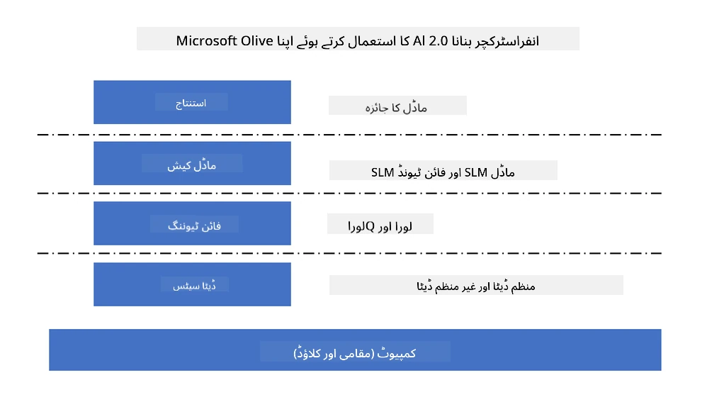
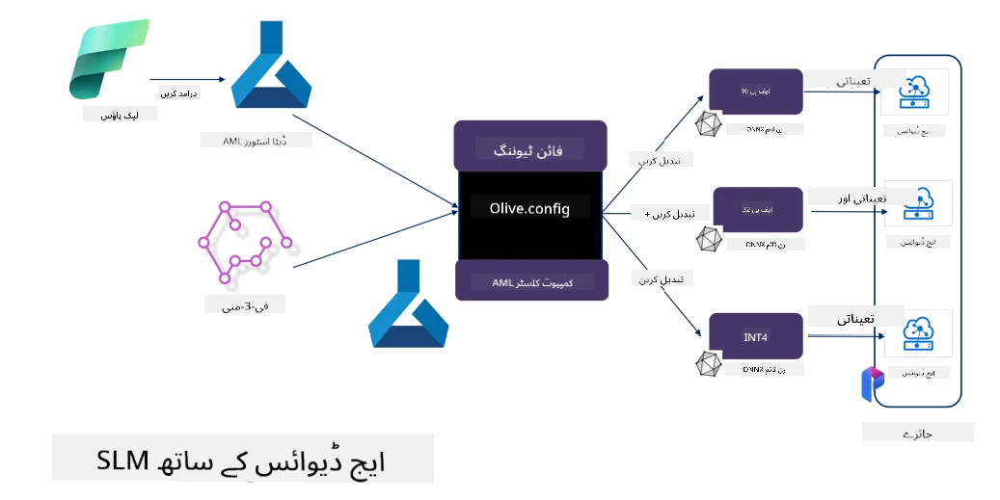

# **Microsoft Olive کے ساتھ Phi-3 کی فائن ٹیوننگ**

[Olive](https://github.com/microsoft/OLive?WT.mc_id=aiml-138114-kinfeylo) ایک آسان استعمال ہونے والا ہارڈویئر سے آگاہ ماڈل آپٹیمائزیشن ٹول ہے جو ماڈل کمپریشن، آپٹیمائزیشن، اور کمپائلیشن کے شعبوں میں صنعت کی بہترین تکنیکوں کو یکجا کرتا ہے۔

یہ مشین لرننگ ماڈلز کو بہتر بنانے کے عمل کو آسان بنانے کے لیے ڈیزائن کیا گیا ہے تاکہ یہ مخصوص ہارڈویئر آرکیٹیکچرز کا زیادہ سے زیادہ مؤثر استعمال کر سکیں۔

چاہے آپ کلاؤڈ پر مبنی ایپلیکیشنز پر کام کر رہے ہوں یا ایج ڈیوائسز پر، Olive آپ کو اپنے ماڈلز کو آسانی اور مؤثر طریقے سے بہتر بنانے کی سہولت دیتا ہے۔

## اہم خصوصیات:
- Olive مطلوبہ ہارڈویئر ٹارگٹس کے لیے آپٹیمائزیشن تکنیکوں کو جمع اور خودکار بناتا ہے۔
- کوئی ایک آپٹیمائزیشن تکنیک تمام حالات کے لیے موزوں نہیں ہوتی، اس لیے Olive صنعت کے ماہرین کو اپنی نئی آپٹیمائزیشن ایجادات شامل کرنے کی اجازت دے کر توسیع پذیری فراہم کرتا ہے۔

## انجینئرنگ کی محنت کم کریں:
- ڈویلپرز کو اکثر تربیت یافتہ ماڈلز کو تعینات کرنے کے لیے مختلف ہارڈویئر وینڈرز کے مخصوص ٹول چینز سیکھنے اور استعمال کرنے کی ضرورت ہوتی ہے۔
- Olive اس تجربے کو آسان بناتا ہے اور مطلوبہ ہارڈویئر کے لیے آپٹیمائزیشن تکنیکوں کو خودکار بناتا ہے۔

## استعمال کے لیے تیار اینڈ ٹو اینڈ آپٹیمائزیشن حل:

مختلف تکنیکوں کو یکجا اور ٹیون کر کے، Olive اینڈ ٹو اینڈ آپٹیمائزیشن کے لیے ایک متحد حل پیش کرتا ہے۔
یہ ماڈلز کو بہتر بناتے وقت درستگی اور تاخیر جیسے پابندیوں کو مدنظر رکھتا ہے۔

## Microsoft Olive کے ذریعے فائن ٹیوننگ

Microsoft Olive ایک بہت آسان استعمال ہونے والا اوپن سورس ماڈل آپٹیمائزیشن ٹول ہے جو جنریٹو مصنوعی ذہانت کے میدان میں فائن ٹیوننگ اور ریفرنس دونوں کو کور کر سکتا ہے۔ یہ صرف سادہ کنفیگریشن کا تقاضا کرتا ہے، اور اوپن سورس چھوٹے زبان کے ماڈلز اور متعلقہ رن ٹائم ماحولیات (AzureML / لوکل GPU، CPU، DirectML) کے ساتھ مل کر، آپ خودکار آپٹیمائزیشن کے ذریعے ماڈل کی فائن ٹیوننگ یا ریفرنس مکمل کر سکتے ہیں، اور بہترین ماڈل کو کلاؤڈ یا ایج ڈیوائسز پر تعینات کرنے کے لیے تلاش کر سکتے ہیں۔ اس سے اداروں کو اجازت ملتی ہے کہ وہ اپنی صنعت کی مخصوص ماڈلز کو آن-پرمیسس اور کلاؤڈ دونوں جگہ تعمیر کریں۔



## Microsoft Olive کے ساتھ Phi-3 کی فائن ٹیوننگ



## Phi-3 Olive کا نمونہ کوڈ اور مثال
اس مثال میں آپ Olive استعمال کریں گے تاکہ:

- LoRA اڈاپٹر کو فائن ٹیون کریں تاکہ جملوں کو Sad، Joy، Fear، Surprise میں درجہ بند کیا جا سکے۔
- اڈاپٹر کے وزنوں کو بیس ماڈل میں ضم کریں۔
- ماڈل کو int4 میں آپٹیمائز اور کوانٹائز کریں۔

[Sample Code](../../code/03.Finetuning/olive-ort-example/README.md)

### Microsoft Olive کی سیٹ اپ

Microsoft Olive کی تنصیب بہت آسان ہے، اور اسے CPU، GPU، DirectML، اور Azure ML کے لیے بھی انسٹال کیا جا سکتا ہے۔

```bash
pip install olive-ai
```

اگر آپ ONNX ماڈل کو CPU پر چلانا چاہتے ہیں، تو آپ یہ استعمال کر سکتے ہیں:

```bash
pip install olive-ai[cpu]
```

اگر آپ ONNX ماڈل کو GPU پر چلانا چاہتے ہیں، تو آپ یہ استعمال کر سکتے ہیں:

```python
pip install olive-ai[gpu]
```

اگر آپ Azure ML استعمال کرنا چاہتے ہیں، تو یہ استعمال کریں:

```python
pip install git+https://github.com/microsoft/Olive#egg=olive-ai[azureml]
```

**نوٹس**  
آپریٹنگ سسٹم کی ضرورت: Ubuntu 20.04 / 22.04

### **Microsoft Olive کا Config.json**

تنصیب کے بعد، آپ Config فائل کے ذریعے مختلف ماڈل مخصوص ترتیبات کو ترتیب دے سکتے ہیں، جن میں ڈیٹا، کمپیوٹنگ، تربیت، تعیناتی، اور ماڈل جنریشن شامل ہیں۔

**1. ڈیٹا**

Microsoft Olive پر، لوکل ڈیٹا اور کلاؤڈ ڈیٹا دونوں پر تربیت کی حمایت کی جاتی ہے، اور اسے سیٹنگز میں ترتیب دیا جا سکتا ہے۔

*لوکل ڈیٹا کی ترتیبات*

آپ آسانی سے اس ڈیٹا سیٹ کو ترتیب دے سکتے ہیں جس پر فائن ٹیوننگ کے لیے تربیت درکار ہو، عام طور پر json فارمیٹ میں، اور اسے ڈیٹا ٹیمپلیٹ کے مطابق ڈھالیں۔ یہ ماڈل کی ضروریات کے مطابق ایڈجسٹ کرنا ہوتا ہے (مثلاً Microsoft Phi-3-mini کے مطلوبہ فارمیٹ کے مطابق۔ اگر آپ کے پاس دیگر ماڈلز ہیں، تو براہ کرم دیگر ماڈلز کی فائن ٹیوننگ کی ضروری فارمیٹس کا حوالہ لیں)۔

```json

    "data_configs": [
        {
            "name": "dataset_default_train",
            "type": "HuggingfaceContainer",
            "load_dataset_config": {
                "params": {
                    "data_name": "json", 
                    "data_files":"dataset/dataset-classification.json",
                    "split": "train"
                }
            },
            "pre_process_data_config": {
                "params": {
                    "dataset_type": "corpus",
                    "text_cols": [
                            "phrase",
                            "tone"
                    ],
                    "text_template": "### Text: {phrase}\n### The tone is:\n{tone}",
                    "corpus_strategy": "join",
                    "source_max_len": 2048,
                    "pad_to_max_len": false,
                    "use_attention_mask": false
                }
            }
        }
    ],
```

**کلاؤڈ ڈیٹا سورس کی ترتیبات**

Azure AI Studio/Azure Machine Learning Service کے ڈیٹا اسٹور کو لنک کر کے کلاؤڈ میں موجود ڈیٹا کو جوڑنے کے لیے، آپ Microsoft Fabric اور Azure Data کے ذریعے مختلف ڈیٹا سورسز کو Azure AI Studio/Azure Machine Learning Service میں شامل کر سکتے ہیں تاکہ فائن ٹیوننگ کے لیے ڈیٹا کی حمایت کی جا سکے۔

```json

    "data_configs": [
        {
            "name": "dataset_default_train",
            "type": "HuggingfaceContainer",
            "load_dataset_config": {
                "params": {
                    "data_name": "json", 
                    "data_files": {
                        "type": "azureml_datastore",
                        "config": {
                            "azureml_client": {
                                "subscription_id": "Your Azure Subscrition ID",
                                "resource_group": "Your Azure Resource Group",
                                "workspace_name": "Your Azure ML Workspaces name"
                            },
                            "datastore_name": "workspaceblobstore",
                            "relative_path": "Your train_data.json Azure ML Location"
                        }
                    },
                    "split": "train"
                }
            },
            "pre_process_data_config": {
                "params": {
                    "dataset_type": "corpus",
                    "text_cols": [
                            "Question",
                            "Best Answer"
                    ],
                    "text_template": "<|user|>\n{Question}<|end|>\n<|assistant|>\n{Best Answer}\n<|end|>",
                    "corpus_strategy": "join",
                    "source_max_len": 2048,
                    "pad_to_max_len": false,
                    "use_attention_mask": false
                }
            }
        }
    ],
    
```

**2. کمپیوٹنگ کی ترتیب**

اگر آپ لوکل ہونا چاہتے ہیں، تو آپ براہ راست لوکل ڈیٹا وسائل استعمال کر سکتے ہیں۔ اگر آپ کو Azure AI Studio / Azure Machine Learning Service کے وسائل استعمال کرنے ہیں، تو آپ کو متعلقہ Azure پیرامیٹرز، کمپیوٹنگ پاور کا نام وغیرہ ترتیب دینا ہوگا۔

```json

    "systems": {
        "aml": {
            "type": "AzureML",
            "config": {
                "accelerators": ["gpu"],
                "hf_token": true,
                "aml_compute": "Your Azure AI Studio / Azure Machine Learning Service Compute Name",
                "aml_docker_config": {
                    "base_image": "Your Azure AI Studio / Azure Machine Learning Service docker",
                    "conda_file_path": "conda.yaml"
                }
            }
        },
        "azure_arc": {
            "type": "AzureML",
            "config": {
                "accelerators": ["gpu"],
                "aml_compute": "Your Azure AI Studio / Azure Machine Learning Service Compute Name",
                "aml_docker_config": {
                    "base_image": "Your Azure AI Studio / Azure Machine Learning Service docker",
                    "conda_file_path": "conda.yaml"
                }
            }
        }
    },
```

***نوٹس***

چونکہ یہ Azure AI Studio/Azure Machine Learning Service پر کنٹینر کے ذریعے چلتا ہے، اس لیے مطلوبہ ماحول کو ترتیب دینا ضروری ہے۔ یہ conda.yaml ماحول میں ترتیب دیا جاتا ہے۔

```yaml

name: project_environment
channels:
  - defaults
dependencies:
  - python=3.8.13
  - pip=22.3.1
  - pip:
      - einops
      - accelerate
      - azure-keyvault-secrets
      - azure-identity
      - bitsandbytes
      - datasets
      - huggingface_hub
      - peft
      - scipy
      - sentencepiece
      - torch>=2.2.0
      - transformers
      - git+https://github.com/microsoft/Olive@jiapli/mlflow_loading_fix#egg=olive-ai[gpu]
      - --extra-index-url https://aiinfra.pkgs.visualstudio.com/PublicPackages/_packaging/ORT-Nightly/pypi/simple/ 
      - ort-nightly-gpu==1.18.0.dev20240307004
      - --extra-index-url https://aiinfra.pkgs.visualstudio.com/PublicPackages/_packaging/onnxruntime-genai/pypi/simple/
      - onnxruntime-genai-cuda

    

```

**3. اپنا SLM منتخب کریں**

آپ ماڈل کو براہ راست Hugging Face سے استعمال کر سکتے ہیں، یا Azure AI Studio / Azure Machine Learning کے ماڈل کیٹلاگ کے ساتھ مل کر ماڈل منتخب کر سکتے ہیں۔ نیچے دی گئی کوڈ مثال میں ہم Microsoft Phi-3-mini کو بطور مثال استعمال کریں گے۔

اگر آپ کے پاس ماڈل لوکل ہے، تو آپ یہ طریقہ استعمال کر سکتے ہیں:

```json

    "input_model":{
        "type": "PyTorchModel",
        "config": {
            "hf_config": {
                "model_name": "model-cache/microsoft/phi-3-mini",
                "task": "text-generation",
                "model_loading_args": {
                    "trust_remote_code": true
                }
            }
        }
    },
```

اگر آپ Azure AI Studio / Azure Machine Learning Service سے ماڈل استعمال کرنا چاہتے ہیں، تو یہ طریقہ استعمال کریں:

```json

    "input_model":{
        "type": "PyTorchModel",
        "config": {
            "model_path": {
                "type": "azureml_registry_model",
                "config": {
                    "name": "microsoft/Phi-3-mini-4k-instruct",
                    "registry_name": "azureml-msr",
                    "version": "11"
                }
            },
             "model_file_format": "PyTorch.MLflow",
             "hf_config": {
                "model_name": "microsoft/Phi-3-mini-4k-instruct",
                "task": "text-generation",
                "from_pretrained_args": {
                    "trust_remote_code": true
                }
            }
        }
    },
```

**نوٹس:**  
ہمیں Azure AI Studio / Azure Machine Learning Service کے ساتھ انٹیگریٹ کرنا ہے، اس لیے ماڈل سیٹ اپ کرتے وقت ورژن نمبر اور متعلقہ ناموں کا حوالہ ضرور لیں۔

Azure پر تمام ماڈلز کو PyTorch.MLflow پر سیٹ کرنا ضروری ہے۔

آپ کو Hugging Face کا اکاؤنٹ ہونا چاہیے اور کلید کو Azure AI Studio / Azure Machine Learning کی Key value کے ساتھ باندھنا ہوگا۔

**4. الگورتھم**

Microsoft Olive نے LoRA اور QLoRA فائن ٹیوننگ الگورتھمز کو بہت اچھے طریقے سے انکیپسولیٹ کیا ہے۔ آپ کو صرف کچھ متعلقہ پیرامیٹرز ترتیب دینے ہوتے ہیں۔ یہاں میں QLoRA کی مثال لیتا ہوں۔

```json
        "lora": {
            "type": "LoRA",
            "config": {
                "target_modules": [
                    "o_proj",
                    "qkv_proj"
                ],
                "double_quant": true,
                "lora_r": 64,
                "lora_alpha": 64,
                "lora_dropout": 0.1,
                "train_data_config": "dataset_default_train",
                "eval_dataset_size": 0.3,
                "training_args": {
                    "seed": 0,
                    "data_seed": 42,
                    "per_device_train_batch_size": 1,
                    "per_device_eval_batch_size": 1,
                    "gradient_accumulation_steps": 4,
                    "gradient_checkpointing": false,
                    "learning_rate": 0.0001,
                    "num_train_epochs": 3,
                    "max_steps": 10,
                    "logging_steps": 10,
                    "evaluation_strategy": "steps",
                    "eval_steps": 187,
                    "group_by_length": true,
                    "adam_beta2": 0.999,
                    "max_grad_norm": 0.3
                }
            }
        },
```

اگر آپ کو کوانٹائزیشن کنورژن کرنا ہے، تو Microsoft Olive کی مین برانچ پہلے ہی onnxruntime-genai طریقہ کار کی حمایت کرتی ہے۔ آپ اپنی ضرورت کے مطابق اسے ترتیب دے سکتے ہیں:

1. اڈاپٹر کے وزنوں کو بیس ماڈل میں ضم کریں  
2. ModelBuilder کے ذریعے ماڈل کو مطلوبہ درستگی کے ساتھ onnx ماڈل میں تبدیل کریں

مثلاً کوانٹائزڈ INT4 میں تبدیل کرنا

```json

        "merge_adapter_weights": {
            "type": "MergeAdapterWeights"
        },
        "builder": {
            "type": "ModelBuilder",
            "config": {
                "precision": "int4"
            }
        }
```

**نوٹس**  
- اگر آپ QLoRA استعمال کر رہے ہیں، تو ONNXRuntime-genai کی کوانٹائزیشن کنورژن فی الحال سپورٹ نہیں کی جاتی۔

- یہاں یہ بات واضح کرنی چاہیے کہ آپ اوپر دیے گئے مراحل کو اپنی ضرورت کے مطابق ترتیب دے سکتے ہیں۔ ضروری نہیں کہ تمام مراحل کو مکمل طور پر ترتیب دیا جائے۔ اپنی ضرورت کے مطابق آپ براہ راست الگورتھم کے مراحل استعمال کر سکتے ہیں بغیر فائن ٹیوننگ کے۔ آخر میں آپ کو متعلقہ انجنز کو ترتیب دینا ہوگا۔

```json

    "engine": {
        "log_severity_level": 0,
        "host": "aml",
        "target": "aml",
        "search_strategy": false,
        "execution_providers": ["CUDAExecutionProvider"],
        "cache_dir": "../model-cache/models/phi3-finetuned/cache",
        "output_dir" : "../model-cache/models/phi3-finetuned"
    }
```

**5. فائن ٹیوننگ مکمل کریں**

کمانڈ لائن پر، olive-config.json کی ڈائریکٹری میں یہ کمانڈ چلائیں:

```bash
olive run --config olive-config.json  
```

**دستخطی نوٹ**:  
یہ دستاویز AI ترجمہ سروس [Co-op Translator](https://github.com/Azure/co-op-translator) کے ذریعے ترجمہ کی گئی ہے۔ اگرچہ ہم درستگی کے لیے کوشاں ہیں، براہ کرم آگاہ رہیں کہ خودکار ترجمے میں غلطیاں یا عدم درستیاں ہو سکتی ہیں۔ اصل دستاویز اپنی مادری زبان میں ہی معتبر ماخذ سمجھی جانی چاہیے۔ اہم معلومات کے لیے پیشہ ور انسانی ترجمہ تجویز کیا جاتا ہے۔ اس ترجمے کے استعمال سے پیدا ہونے والی کسی بھی غلط فہمی یا غلط تشریح کی ذمہ داری ہم پر عائد نہیں ہوتی۔