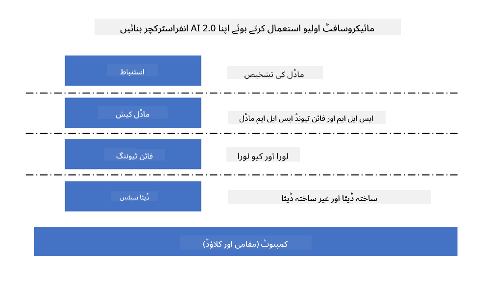
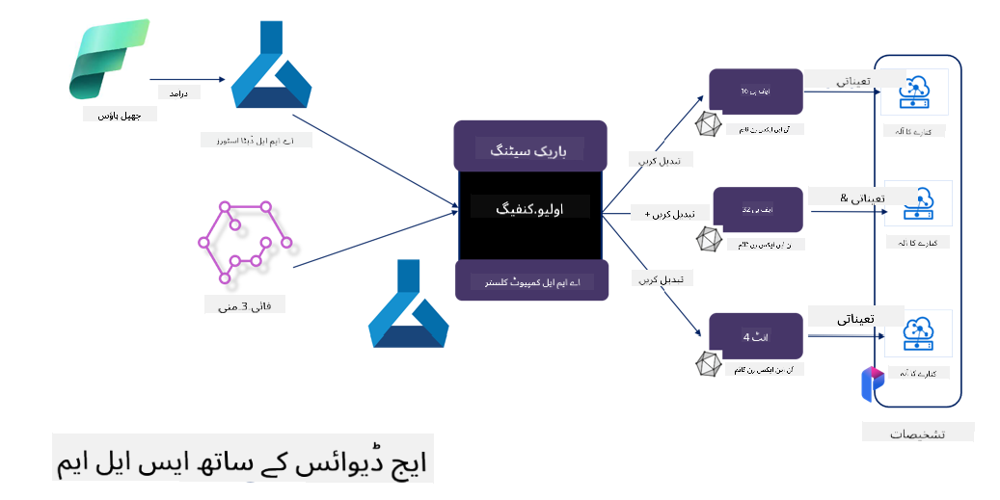

<!--
CO_OP_TRANSLATOR_METADATA:
{
  "original_hash": "727978e690ed9c055f594a4bfe01d75c",
  "translation_date": "2025-04-03T08:07:59+00:00",
  "source_file": "md\\03.FineTuning\\FineTuning_MicrosoftOlive.md",
  "language_code": "ur"
}
-->
# **مائیکروسافٹ اولیو کے ساتھ Phi-3 کی فائن ٹوننگ**

[Olive](https://github.com/microsoft/OLive?WT.mc_id=aiml-138114-kinfeylo) ایک آسان استعمال ہونے والا ہارڈویئر کے مطابق ماڈل آپٹیمائزیشن ٹول ہے جو ماڈل کمپریشن، آپٹیمائزیشن، اور کمپائلیشن کے شعبے میں بہترین تکنیکوں کو یکجا کرتا ہے۔

یہ مشین لرننگ ماڈلز کو آپٹیمائز کرنے کے عمل کو آسان بنانے کے لیے ڈیزائن کیا گیا ہے، تاکہ وہ مخصوص ہارڈویئر آرکیٹیکچرز کا مؤثر استعمال کریں۔

چاہے آپ کلاؤڈ بیسڈ ایپلیکیشنز پر کام کر رہے ہوں یا ایج ڈیوائسز پر، Olive آپ کے ماڈلز کو آسانی اور مؤثر طریقے سے آپٹیمائز کرنے کی سہولت فراہم کرتا ہے۔

## اہم خصوصیات:
- Olive مطلوبہ ہارڈویئر ٹارگٹس کے لیے آپٹیمائزیشن تکنیکوں کو جمع کرتا ہے اور خودکار بناتا ہے۔
- کوئی ایک تکنیک تمام حالات کے لیے موزوں نہیں ہوتی، اس لیے Olive ماہرین کو اپنی آپٹیمائزیشن جدتوں کو شامل کرنے کی اجازت دیتا ہے۔

## انجینئرنگ کی کوششوں میں کمی:
- ڈیولپرز کو اکثر مختلف ہارڈویئر وینڈرز کے مخصوص ٹول چینز سیکھنے اور استعمال کرنے کی ضرورت ہوتی ہے تاکہ تربیت یافتہ ماڈلز کو ڈیپلائمنٹ کے لیے تیار اور آپٹیمائز کیا جا سکے۔
- Olive اس تجربے کو مطلوبہ ہارڈویئر کے لیے آپٹیمائزیشن تکنیکوں کو خودکار بنا کر آسان بناتا ہے۔

## ای2ای آپٹیمائزیشن حل:

مربوط تکنیکوں کو ترتیب دینے اور ٹیون کرنے کے ذریعے Olive ایک متحد حل فراہم کرتا ہے۔
یہ ماڈلز کو آپٹیمائز کرتے وقت درستگی اور لیٹینسی جیسی حدود کو مدنظر رکھتا ہے۔

## مائیکروسافٹ اولیو کے ذریعے فائن ٹوننگ

مائیکروسافٹ اولیو ایک انتہائی آسان استعمال ہونے والا اوپن سورس ماڈل آپٹیمائزیشن ٹول ہے جو جنریٹیو آرٹیفیشل انٹیلیجنس کے میدان میں فائن ٹوننگ اور ریفرنس دونوں کو کور کر سکتا ہے۔ یہ صرف سادہ کنفیگریشن کی ضرورت رکھتا ہے، اور اوپن سورس چھوٹے لینگویج ماڈلز اور متعلقہ رن ٹائم ماحولیات (AzureML / لوکل GPU، CPU، DirectML) کے ساتھ مل کر آپ ماڈل کی فائن ٹوننگ یا ریفرنس کو خودکار آپٹیمائزیشن کے ذریعے مکمل کر سکتے ہیں، اور بہترین ماڈل تلاش کر سکتے ہیں تاکہ کلاؤڈ یا ایج ڈیوائسز پر ڈیپلائ کیا جا سکے۔ یہ کمپنیوں کو اپنی انڈسٹری کے عمودی ماڈلز کو آن پرائمسز اور کلاؤڈ میں بنانے کی اجازت دیتا ہے۔



## مائیکروسافٹ اولیو کے ساتھ Phi-3 کی فائن ٹوننگ 



## Phi-3 Olive کا نمونہ کوڈ اور مثال
اس مثال میں آپ Olive استعمال کریں گے:

- LoRA اڈاپٹر کو فائن ٹون کریں تاکہ جملوں کو Sad، Joy، Fear، Surprise میں تقسیم کیا جا سکے۔
- اڈاپٹر کے ویٹس کو بیس ماڈل میں ضم کریں۔
- ماڈل کو آپٹیمائز اور Quantize کر کے int4 میں تبدیل کریں۔

[نمونہ کوڈ](../../code/03.Finetuning/olive-ort-example/README.md)

### مائیکروسافٹ اولیو کی سیٹ اپ

مائیکروسافٹ اولیو کی انسٹالیشن بہت آسان ہے، اور اسے CPU، GPU، DirectML، اور Azure ML کے لیے بھی انسٹال کیا جا سکتا ہے۔

```bash
pip install olive-ai
```

اگر آپ ONNX ماڈل کو CPU کے ساتھ چلانا چاہتے ہیں، تو آپ یہ استعمال کر سکتے ہیں

```bash
pip install olive-ai[cpu]
```

اگر آپ ONNX ماڈل کو GPU کے ساتھ چلانا چاہتے ہیں، تو آپ یہ استعمال کر سکتے ہیں

```python
pip install olive-ai[gpu]
```

اگر آپ Azure ML استعمال کرنا چاہتے ہیں، تو یہ استعمال کریں

```python
pip install git+https://github.com/microsoft/Olive#egg=olive-ai[azureml]
```

**نوٹ**
OS کی ضرورت: Ubuntu 20.04 / 22.04 

### **مائیکروسافٹ اولیو کا Config.json**

انسٹالیشن کے بعد، آپ مختلف ماڈل سے متعلق سیٹنگز کو Config فائل کے ذریعے ترتیب دے سکتے ہیں، جن میں ڈیٹا، کمپیوٹنگ، ٹریننگ، ڈیپلائمنٹ، اور ماڈل جنریشن شامل ہیں۔

**1. ڈیٹا**

مائیکروسافٹ اولیو پر، لوکل ڈیٹا اور کلاؤڈ ڈیٹا پر ٹریننگ کی سپورٹ موجود ہے، اور اسے سیٹنگز میں ترتیب دیا جا سکتا ہے۔

*لوکل ڈیٹا سیٹنگز*

آپ آسانی سے وہ ڈیٹا سیٹ سیٹ اپ کر سکتے ہیں جس پر فائن ٹوننگ کے لیے ٹریننگ کی ضرورت ہے، عموماً json فارمیٹ میں، اور اسے ڈیٹا ٹیمپلیٹ کے ساتھ ایڈجسٹ کریں۔ یہ ماڈل کی ضروریات کے مطابق ایڈجسٹ کرنے کی ضرورت ہوگی (مثال کے طور پر، مائیکروسافٹ Phi-3-mini کی مطلوبہ فارمیٹ کے مطابق ایڈجسٹ کریں۔ اگر آپ کے پاس دوسرے ماڈلز ہیں، تو براہ کرم دیگر ماڈلز کی مطلوبہ فائن ٹوننگ فارمیٹس کو دیکھیں اور ان کے مطابق پروسیسنگ کریں)

```json

    "data_configs": [
        {
            "name": "dataset_default_train",
            "type": "HuggingfaceContainer",
            "load_dataset_config": {
                "params": {
                    "data_name": "json", 
                    "data_files":"dataset/dataset-classification.json",
                    "split": "train"
                }
            },
            "pre_process_data_config": {
                "params": {
                    "dataset_type": "corpus",
                    "text_cols": [
                            "phrase",
                            "tone"
                    ],
                    "text_template": "### Text: {phrase}\n### The tone is:\n{tone}",
                    "corpus_strategy": "join",
                    "source_max_len": 2048,
                    "pad_to_max_len": false,
                    "use_attention_mask": false
                }
            }
        }
    ],
```

**کلاؤڈ ڈیٹا سورس سیٹنگز**

Azure AI Studio/Azure Machine Learning Service کے ڈیٹا اسٹور کو کلاؤڈ میں ڈیٹا سے لنک کرکے، آپ مختلف ڈیٹا سورسز کو Azure AI Studio/Azure Machine Learning Service میں متعارف کروا سکتے ہیں تاکہ فائن ٹوننگ کے ڈیٹا کی سپورٹ فراہم کی جا سکے۔

```json

    "data_configs": [
        {
            "name": "dataset_default_train",
            "type": "HuggingfaceContainer",
            "load_dataset_config": {
                "params": {
                    "data_name": "json", 
                    "data_files": {
                        "type": "azureml_datastore",
                        "config": {
                            "azureml_client": {
                                "subscription_id": "Your Azure Subscrition ID",
                                "resource_group": "Your Azure Resource Group",
                                "workspace_name": "Your Azure ML Workspaces name"
                            },
                            "datastore_name": "workspaceblobstore",
                            "relative_path": "Your train_data.json Azure ML Location"
                        }
                    },
                    "split": "train"
                }
            },
            "pre_process_data_config": {
                "params": {
                    "dataset_type": "corpus",
                    "text_cols": [
                            "Question",
                            "Best Answer"
                    ],
                    "text_template": "<|user|>\n{Question}<|end|>\n<|assistant|>\n{Best Answer}\n<|end|>",
                    "corpus_strategy": "join",
                    "source_max_len": 2048,
                    "pad_to_max_len": false,
                    "use_attention_mask": false
                }
            }
        }
    ],
    
```

**2. کمپیوٹنگ کنفیگریشن**

اگر آپ کو لوکل ہونا ضروری ہے، تو آپ براہ راست لوکل ڈیٹا ریسورسز استعمال کر سکتے ہیں۔ آپ کو Azure AI Studio / Azure Machine Learning Service کے ریسورسز استعمال کرنے کی ضرورت ہوگی۔ آپ کو متعلقہ Azure پیرامیٹرز، کمپیوٹنگ پاور کا نام وغیرہ ترتیب دینا ہوگا۔

```json

    "systems": {
        "aml": {
            "type": "AzureML",
            "config": {
                "accelerators": ["gpu"],
                "hf_token": true,
                "aml_compute": "Your Azure AI Studio / Azure Machine Learning Service Compute Name",
                "aml_docker_config": {
                    "base_image": "Your Azure AI Studio / Azure Machine Learning Service docker",
                    "conda_file_path": "conda.yaml"
                }
            }
        },
        "azure_arc": {
            "type": "AzureML",
            "config": {
                "accelerators": ["gpu"],
                "aml_compute": "Your Azure AI Studio / Azure Machine Learning Service Compute Name",
                "aml_docker_config": {
                    "base_image": "Your Azure AI Studio / Azure Machine Learning Service docker",
                    "conda_file_path": "conda.yaml"
                }
            }
        }
    },
```

***نوٹ***

چونکہ یہ Azure AI Studio/Azure Machine Learning Service پر کنٹینر کے ذریعے چلایا جاتا ہے، مطلوبہ ماحول کو ترتیب دینا ضروری ہے۔ یہ conda.yaml ماحول میں ترتیب دیا جاتا ہے۔

```yaml

name: project_environment
channels:
  - defaults
dependencies:
  - python=3.8.13
  - pip=22.3.1
  - pip:
      - einops
      - accelerate
      - azure-keyvault-secrets
      - azure-identity
      - bitsandbytes
      - datasets
      - huggingface_hub
      - peft
      - scipy
      - sentencepiece
      - torch>=2.2.0
      - transformers
      - git+https://github.com/microsoft/Olive@jiapli/mlflow_loading_fix#egg=olive-ai[gpu]
      - --extra-index-url https://aiinfra.pkgs.visualstudio.com/PublicPackages/_packaging/ORT-Nightly/pypi/simple/ 
      - ort-nightly-gpu==1.18.0.dev20240307004
      - --extra-index-url https://aiinfra.pkgs.visualstudio.com/PublicPackages/_packaging/onnxruntime-genai/pypi/simple/
      - onnxruntime-genai-cuda

    

```

**3. اپنا SLM منتخب کریں**

آپ ماڈل کو براہ راست Hugging Face سے استعمال کر سکتے ہیں، یا اسے Azure AI Studio / Azure Machine Learning کے ماڈل کیٹلاگ کے ساتھ براہ راست جوڑ سکتے ہیں تاکہ استعمال کرنے کے لیے ماڈل منتخب کریں۔ نیچے دیے گئے کوڈ مثال میں ہم Microsoft Phi-3-mini کو مثال کے طور پر استعمال کریں گے۔

اگر آپ کے پاس ماڈل لوکل ہے، تو آپ یہ طریقہ استعمال کر سکتے ہیں

```json

    "input_model":{
        "type": "PyTorchModel",
        "config": {
            "hf_config": {
                "model_name": "model-cache/microsoft/phi-3-mini",
                "task": "text-generation",
                "model_loading_args": {
                    "trust_remote_code": true
                }
            }
        }
    },
```

اگر آپ Azure AI Studio / Azure Machine Learning Service سے ماڈل استعمال کرنا چاہتے ہیں، تو آپ یہ طریقہ استعمال کر سکتے ہیں

```json

    "input_model":{
        "type": "PyTorchModel",
        "config": {
            "model_path": {
                "type": "azureml_registry_model",
                "config": {
                    "name": "microsoft/Phi-3-mini-4k-instruct",
                    "registry_name": "azureml-msr",
                    "version": "11"
                }
            },
             "model_file_format": "PyTorch.MLflow",
             "hf_config": {
                "model_name": "microsoft/Phi-3-mini-4k-instruct",
                "task": "text-generation",
                "from_pretrained_args": {
                    "trust_remote_code": true
                }
            }
        }
    },
```

**نوٹ:**
ہمیں Azure AI Studio / Azure Machine Learning Service کے ساتھ انٹیگریٹ کرنا ہوگا، لہذا ماڈل سیٹ اپ کرتے وقت ورژن نمبر اور متعلقہ ناموں کا حوالہ دیں۔

Azure پر تمام ماڈلز کو PyTorch.MLflow پر سیٹ کرنا ہوگا۔

آپ کو Hugging Face اکاؤنٹ کی ضرورت ہوگی اور اسے Azure AI Studio / Azure Machine Learning کی Key ویلیو کے ساتھ جوڑنا ہوگا۔

**4. الگورتھم**

مائیکروسافٹ اولیو نے Lora اور QLora فائن ٹوننگ الگورتھمز کو بہت اچھے طریقے سے انکیپسولیٹ کیا ہے۔ آپ کو صرف کچھ متعلقہ پیرامیٹرز ترتیب دینے کی ضرورت ہوگی۔ یہاں میں QLora کو مثال کے طور پر لیتا ہوں۔

```json
        "lora": {
            "type": "LoRA",
            "config": {
                "target_modules": [
                    "o_proj",
                    "qkv_proj"
                ],
                "double_quant": true,
                "lora_r": 64,
                "lora_alpha": 64,
                "lora_dropout": 0.1,
                "train_data_config": "dataset_default_train",
                "eval_dataset_size": 0.3,
                "training_args": {
                    "seed": 0,
                    "data_seed": 42,
                    "per_device_train_batch_size": 1,
                    "per_device_eval_batch_size": 1,
                    "gradient_accumulation_steps": 4,
                    "gradient_checkpointing": false,
                    "learning_rate": 0.0001,
                    "num_train_epochs": 3,
                    "max_steps": 10,
                    "logging_steps": 10,
                    "evaluation_strategy": "steps",
                    "eval_steps": 187,
                    "group_by_length": true,
                    "adam_beta2": 0.999,
                    "max_grad_norm": 0.3
                }
            }
        },
```

اگر آپ کو کوانٹائزیشن کنورژن کی ضرورت ہے، تو مائیکروسافٹ اولیو کے مین برانچ میں پہلے ہی onnxruntime-genai طریقہ کار کی سپورٹ موجود ہے۔ آپ اسے اپنی ضروریات کے مطابق سیٹ کر سکتے ہیں:

1. اڈاپٹر کے ویٹس کو بیس ماڈل میں ضم کریں
2. ماڈل کو مطلوبہ پریسیژن کے ساتھ onnx ماڈل میں تبدیل کریں ModelBuilder کے ذریعے

جیسے کہ کوانٹائزڈ INT4 میں تبدیل کرنا

```json

        "merge_adapter_weights": {
            "type": "MergeAdapterWeights"
        },
        "builder": {
            "type": "ModelBuilder",
            "config": {
                "precision": "int4"
            }
        }
```

**نوٹ** 
- اگر آپ QLoRA استعمال کرتے ہیں، تو ONNXRuntime-genai کے کوانٹائزیشن کنورژن کی فی الحال سپورٹ نہیں ہے۔

- یہاں یہ واضح کرنا ضروری ہے کہ آپ اپنی ضروریات کے مطابق اوپر دیے گئے مراحل ترتیب دے سکتے ہیں۔ ضروری نہیں کہ آپ ان تمام مراحل کو مکمل طور پر ترتیب دیں۔ اپنی ضروریات کے مطابق، آپ الگورتھم کے مراحل کو براہ راست استعمال کر سکتے ہیں بغیر فائن ٹوننگ کے۔ آخر میں آپ کو متعلقہ انجنز کو ترتیب دینا ہوگا۔

```json

    "engine": {
        "log_severity_level": 0,
        "host": "aml",
        "target": "aml",
        "search_strategy": false,
        "execution_providers": ["CUDAExecutionProvider"],
        "cache_dir": "../model-cache/models/phi3-finetuned/cache",
        "output_dir" : "../model-cache/models/phi3-finetuned"
    }
```

**5. فائن ٹوننگ مکمل ہوئی**

کمانڈ لائن پر، olive-config.json کی ڈائریکٹری میں عمل کریں

```bash
olive run --config olive-config.json  
```

**ڈسکلیمر**:  
یہ دستاویز AI ترجمہ سروس [Co-op Translator](https://github.com/Azure/co-op-translator) کا استعمال کرتے ہوئے ترجمہ کی گئی ہے۔ ہم درستگی کی کوشش کرتے ہیں، لیکن براہ کرم آگاہ رہیں کہ خودکار ترجمے میں غلطیاں یا غیر درستیاں ہو سکتی ہیں۔ اصل دستاویز، جو اپنی مقامی زبان میں ہے، کو مستند ذریعہ سمجھا جانا چاہیے۔ اہم معلومات کے لیے، پیشہ ور انسانی ترجمہ کی سفارش کی جاتی ہے۔ ہم اس ترجمے کے استعمال سے پیدا ہونے والی کسی بھی غلط فہمی یا غلط تشریح کے ذمہ دار نہیں ہیں۔