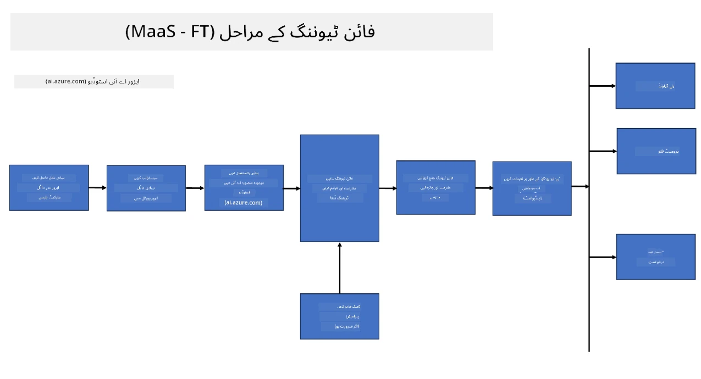
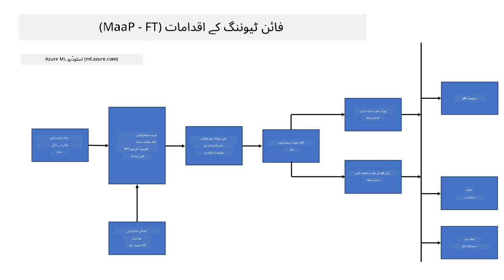
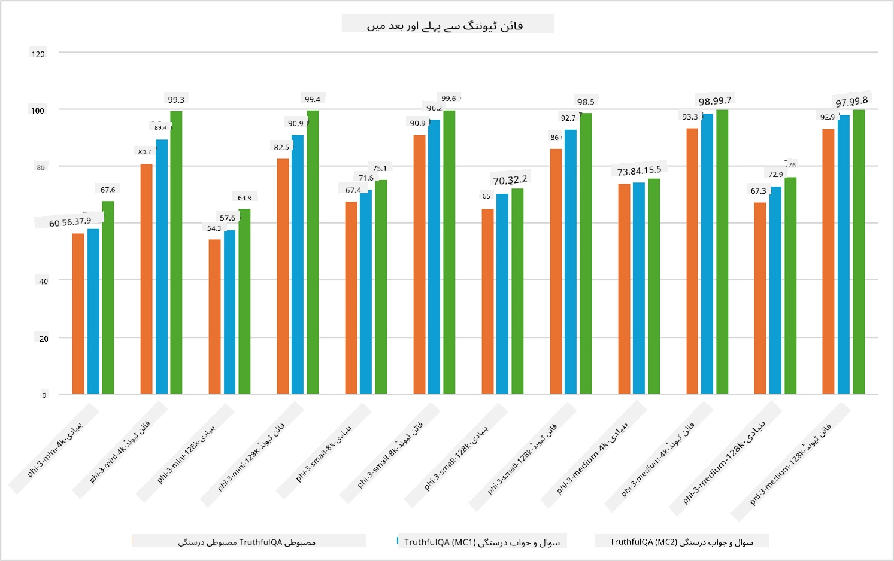

## فائن ٹیوننگ کے منظرنامے

**پلیٹ فارم** اس میں مختلف ٹیکنالوجیز شامل ہیں جیسے Azure AI Foundry، Azure Machine Learning، AI Tools، Kaito، اور ONNX Runtime۔

**انفراسٹرکچر** اس میں CPU اور FPGA شامل ہیں، جو فائن ٹیوننگ کے عمل کے لیے ضروری ہیں۔ میں آپ کو ان ٹیکنالوجیز کے آئیکنز دکھاتا ہوں۔

**ٹولز اور فریم ورک** اس میں ONNX Runtime شامل ہے۔ میں آپ کو ان ٹیکنالوجیز کے آئیکنز دکھاتا ہوں۔  
[Insert icons for ONNX Runtime and ONNX Runtime]

مائیکروسافٹ کی ٹیکنالوجیز کے ساتھ فائن ٹیوننگ کے عمل میں مختلف اجزاء اور ٹولز شامل ہوتے ہیں۔ ان ٹیکنالوجیز کو سمجھ کر اور استعمال کر کے ہم اپنی ایپلیکیشنز کو مؤثر طریقے سے فائن ٹیون کر سکتے ہیں اور بہتر حل تیار کر سکتے ہیں۔

## ماڈل بطور سروس

ماڈل کو ہوسٹڈ فائن ٹیوننگ کے ذریعے فائن ٹیون کریں، بغیر کمپیوٹ بنانے اور منظم کرنے کی ضرورت کے۔

سرورلیس فائن ٹیوننگ Phi-3-mini اور Phi-3-medium ماڈلز کے لیے دستیاب ہے، جو ڈویلپرز کو کلاؤڈ اور ایج کے منظرناموں کے لیے ماڈلز کو تیزی اور آسانی سے حسب ضرورت بنانے کی سہولت دیتی ہے، بغیر کمپیوٹ کے انتظام کے۔ ہم نے یہ بھی اعلان کیا ہے کہ Phi-3-small اب Models-as-a-Service آفرنگ کے ذریعے دستیاب ہے تاکہ ڈویلپرز بغیر بنیادی انفراسٹرکچر کے انتظام کے AI ڈیولپمنٹ کا آغاز جلدی اور آسانی سے کر سکیں۔

## ماڈل بطور پلیٹ فارم

صارفین اپنے کمپیوٹ کا انتظام کرتے ہیں تاکہ اپنے ماڈلز کو فائن ٹیون کر سکیں۔

[Fine Tuning Sample](https://github.com/Azure/azureml-examples/blob/main/sdk/python/foundation-models/system/finetune/chat-completion/chat-completion.ipynb)

## فائن ٹیوننگ کے منظرنامے

| | | | | | | |
|-|-|-|-|-|-|-|
|منظرنامہ|LoRA|QLoRA|PEFT|DeepSpeed|ZeRO|DORA|
|پری ٹرینڈ LLMs کو مخصوص کاموں یا ڈومینز کے لیے ڈھالنا|ہاں|ہاں|ہاں|ہاں|ہاں|ہاں|
|NLP کے کاموں جیسے ٹیکسٹ کلاسیفیکیشن، نامزد ادارہ شناخت، اور مشین ترجمہ کے لیے فائن ٹیوننگ|ہاں|ہاں|ہاں|ہاں|ہاں|ہاں|
|QA کے کاموں کے لیے فائن ٹیوننگ|ہاں|ہاں|ہاں|ہاں|ہاں|ہاں|
|چیٹ بوٹس میں انسانی طرز کے جوابات پیدا کرنے کے لیے فائن ٹیوننگ|ہاں|ہاں|ہاں|ہاں|ہاں|ہاں|
|موسیقی، فن یا دیگر تخلیقی شکلوں کی تخلیق کے لیے فائن ٹیوننگ|ہاں|ہاں|ہاں|ہاں|ہاں|ہاں|
|کمپیوٹیشنل اور مالی اخراجات کو کم کرنا|ہاں|ہاں|نہیں|ہاں|ہاں|نہیں|
|میموری کے استعمال کو کم کرنا|نہیں|ہاں|نہیں|ہاں|ہاں|ہاں|
|کم پیرامیٹرز کے ساتھ مؤثر فائن ٹیوننگ|نہیں|ہاں|ہاں|نہیں|نہیں|ہاں|
|میموری-موثر ڈیٹا پیراللزم کی شکل جو تمام دستیاب GPU ڈیوائسز کی مجموعی GPU میموری تک رسائی دیتی ہے|نہیں|نہیں|نہیں|ہاں|ہاں|ہاں|

## فائن ٹیوننگ کی کارکردگی کی مثالیں

**دستخطی دستبرداری**:  
یہ دستاویز AI ترجمہ سروس [Co-op Translator](https://github.com/Azure/co-op-translator) کے ذریعے ترجمہ کی گئی ہے۔ اگرچہ ہم درستگی کے لیے کوشاں ہیں، براہ کرم آگاہ رہیں کہ خودکار ترجمے میں غلطیاں یا عدم درستیاں ہو سکتی ہیں۔ اصل دستاویز اپنی مادری زبان میں ہی معتبر ماخذ سمجھی جانی چاہیے۔ اہم معلومات کے لیے پیشہ ور انسانی ترجمہ کی سفارش کی جاتی ہے۔ اس ترجمے کے استعمال سے پیدا ہونے والی کسی بھی غلط فہمی یا غلط تشریح کی ذمہ داری ہم پر عائد نہیں ہوتی۔