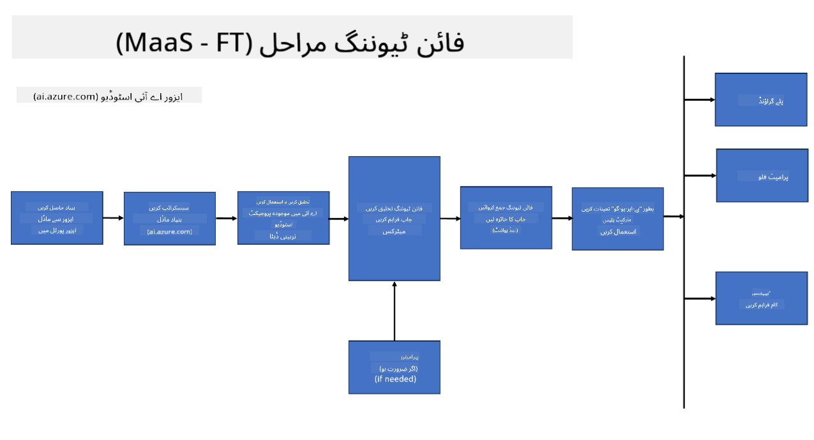
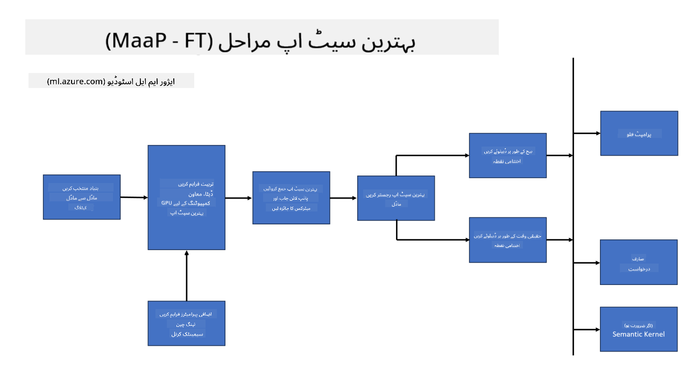
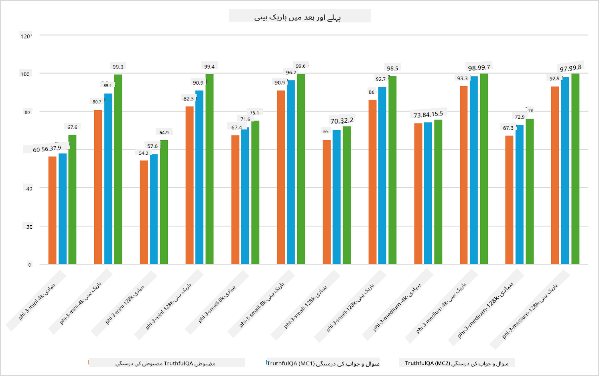

<!--
CO_OP_TRANSLATOR_METADATA:
{
  "original_hash": "cd52a3c9a424a77d2ec0470770c93846",
  "translation_date": "2025-04-03T08:20:52+00:00",
  "source_file": "md\\03.FineTuning\\FineTuning_Scenarios.md",
  "language_code": "ur"
}
-->
## فائن ٹیوننگ کے منظرنامے

**پلیٹ فارم** اس میں مختلف ٹیکنالوجیز شامل ہیں جیسے Azure AI Foundry، Azure Machine Learning، AI Tools، Kaito، اور ONNX Runtime۔

**انفراسٹرکچر** اس میں CPU اور FPGA شامل ہیں، جو فائن ٹیوننگ کے عمل کے لیے ضروری ہیں۔ آئیے آپ کو ان ٹیکنالوجیز کے آئیکنز دکھاتے ہیں۔

**ٹولز اور فریم ورک** اس میں ONNX Runtime اور ONNX Runtime شامل ہیں۔ آئیے آپ کو ان ٹیکنالوجیز کے آئیکنز دکھاتے ہیں۔
[ONNX Runtime اور ONNX Runtime کے آئیکنز داخل کریں]

Microsoft ٹیکنالوجیز کے ساتھ فائن ٹیوننگ کے عمل میں مختلف اجزاء اور ٹولز شامل ہیں۔ ان ٹیکنالوجیز کو سمجھ کر اور استعمال کر کے، ہم اپنے ایپلیکیشنز کو مؤثر طریقے سے فائن ٹیون کر سکتے ہیں اور بہتر حل تیار کر سکتے ہیں۔

## ماڈل بطور سروس

ماڈل کو ہوسٹڈ فائن ٹیوننگ کے ذریعے بہتر بنائیں، بغیر کمپیوٹ کو ترتیب دینے اور منظم کرنے کی ضرورت کے۔

Phi-3-mini اور Phi-3-medium ماڈلز کے لیے سرور لیس فائن ٹیوننگ دستیاب ہے، جس سے ڈیولپرز کو کلاؤڈ اور ایج کے منظرناموں کے لیے ماڈلز کو جلدی اور آسانی سے اپنی مرضی کے مطابق بنانے کی سہولت ملتی ہے، بغیر کمپیوٹ کی ضرورت کے۔ ہم نے یہ بھی اعلان کیا ہے کہ Phi-3-small اب ہمارے Models-as-a-Service آفرنگ کے ذریعے دستیاب ہے تاکہ ڈیولپرز بغیر بنیادی انفراسٹرکچر کو منظم کیے AI ڈیولپمنٹ شروع کر سکیں۔

## ماڈل بطور پلیٹ فارم

صارفین اپنے کمپیوٹ کو خود منظم کرتے ہیں تاکہ اپنے ماڈلز کو فائن ٹیون کر سکیں۔

[فائن ٹیوننگ سیمپل](https://github.com/Azure/azureml-examples/blob/main/sdk/python/foundation-models/system/finetune/chat-completion/chat-completion.ipynb)

## فائن ٹیوننگ کے منظرنامے

| | | | | | | |
|-|-|-|-|-|-|-|
|منظرنامہ|LoRA|QLoRA|PEFT|DeepSpeed|ZeRO|DORA|
|پری ٹرینڈ LLMs کو مخصوص کاموں یا ڈومینز کے لیے اپنانا|ہاں|ہاں|ہاں|ہاں|ہاں|ہاں|
|NLP کاموں کے لیے فائن ٹیوننگ جیسے ٹیکسٹ کلاسیفیکیشن، نام شدہ ادارے کی شناخت، اور مشین ترجمہ|ہاں|ہاں|ہاں|ہاں|ہاں|ہاں|
|QA کاموں کے لیے فائن ٹیوننگ|ہاں|ہاں|ہاں|ہاں|ہاں|ہاں|
|چیٹ بوٹس میں انسانی جیسے جوابات پیدا کرنے کے لیے فائن ٹیوننگ|ہاں|ہاں|ہاں|ہاں|ہاں|ہاں|
|موسیقی، آرٹ، یا دیگر تخلیقی شکلیں پیدا کرنے کے لیے فائن ٹیوننگ|ہاں|ہاں|ہاں|ہاں|ہاں|ہاں|
|کمپیوٹیشنل اور مالی اخراجات کو کم کرنا|ہاں|ہاں|نہیں|ہاں|ہاں|نہیں|
|میموری کے استعمال کو کم کرنا|نہیں|ہاں|نہیں|ہاں|ہاں|ہاں|
|کم پیرامیٹرز استعمال کر کے مؤثر فائن ٹیوننگ|نہیں|ہاں|ہاں|نہیں|نہیں|ہاں|
|ڈیٹا پیراللزم کی میموری ایفیشنٹ فارم جو تمام دستیاب GPU ڈیوائسز کی مجموعی GPU میموری تک رسائی دیتی ہے|نہیں|نہیں|نہیں|ہاں|ہاں|ہاں|

## فائن ٹیوننگ پرفارمنس کی مثالیں

**ڈسکلیمر**:  
یہ دستاویز AI ترجمہ سروس [Co-op Translator](https://github.com/Azure/co-op-translator) کا استعمال کرتے ہوئے ترجمہ کی گئی ہے۔ ہم درستگی کے لیے کوشش کرتے ہیں، لیکن براہ کرم آگاہ رہیں کہ خودکار ترجمے میں غلطیاں یا غیر درستیاں ہو سکتی ہیں۔ اصل دستاویز کو اس کی اصل زبان میں مستند ذریعہ سمجھا جانا چاہیے۔ اہم معلومات کے لیے، پیشہ ور انسانی ترجمہ کی سفارش کی جاتی ہے۔ اس ترجمے کے استعمال سے پیدا ہونے والی کسی بھی غلط فہمی یا غلط تشریح کے لیے ہم ذمہ دار نہیں ہیں۔