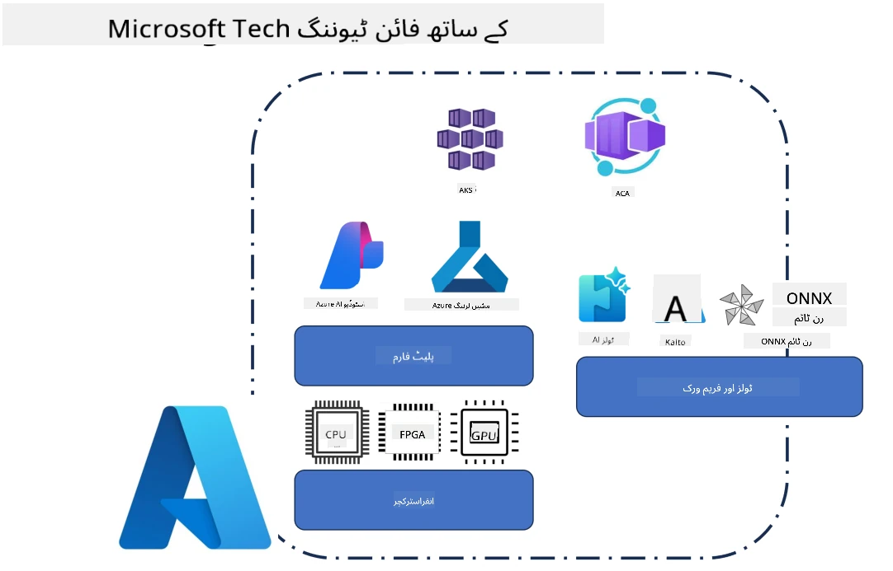
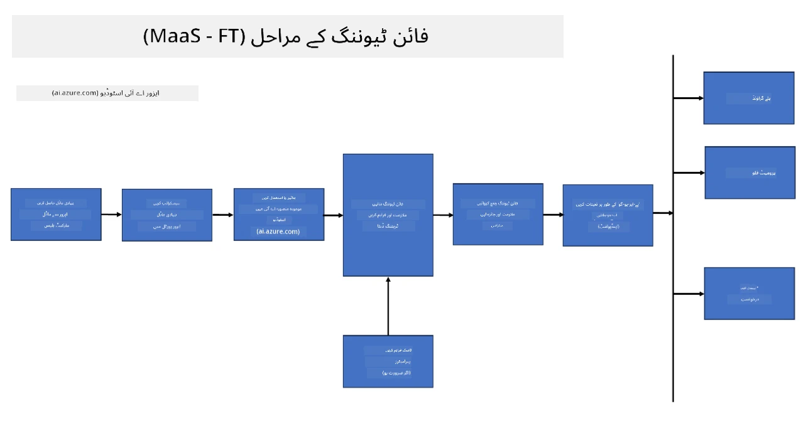
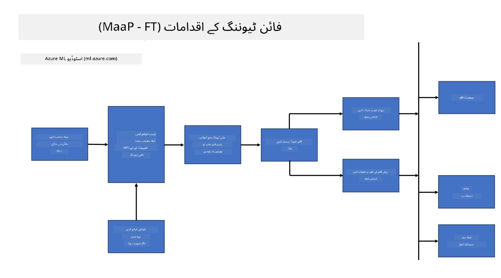
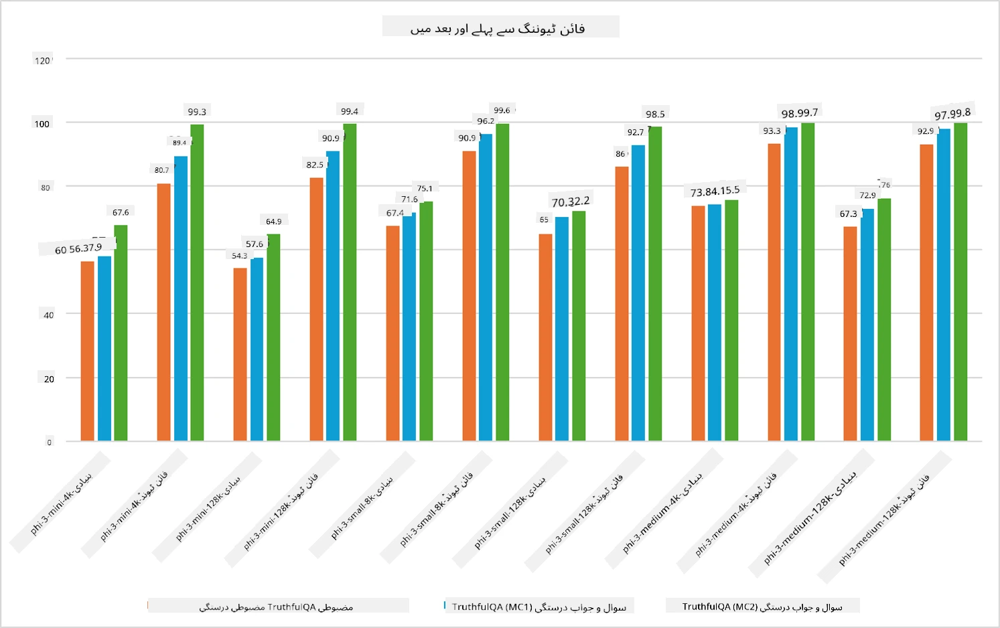

## فائن ٹیوننگ کے منظرنامے

یہ سیکشن Microsoft Foundry اور Azure ماحول میں فائن ٹیوننگ کے منظرناموں کا جائزہ فراہم کرتا ہے، جس میں ڈپلائمنٹ ماڈلز، انفراسٹرکچر کی تہیں، اور عام استعمال ہونے والی آپٹیمائزیشن تکنیکیں شامل ہیں۔

**پلیٹ فارم**  
اس میں Microsoft Foundry (جو پہلے Azure AI Foundry کے طور پر جانا جاتا تھا) اور Azure Machine Learning جیسے منظم شدہ خدمات شامل ہیں، جو ماڈل مینجمنٹ، آرکیسٹریشن، تجربات کی ٹریکنگ، اور ڈپلائمنٹ کے ورک فلو فراہم کرتے ہیں۔

**انفراسٹرکچر**  
فائن ٹیوننگ کے لیے اسکیل ایبل کمپیوٹ وسائل کی ضرورت ہوتی ہے۔ Azure ماحول میں، اس میں عموماً GPU پر مبنی ورچوئل مشینیں اور ہلکے بوجھ کے لیے CPU وسائل شامل ہوتے ہیں، ساتھ ہی ڈیٹا سیٹس اور چیک پوائنٹس کے لیے اسکیل ایبل اسٹوریج بھی شامل ہے۔

**اوزار اور فریم ورک**  
فائن ٹیوننگ کے ورک فلو عموماً Hugging Face Transformers، DeepSpeed، اور PEFT (Parameter-Efficient Fine-Tuning) جیسے فریم ورکس اور آپٹیمائزیشن لائبریریز پر انحصار کرتے ہیں۔

Microsoft ٹیکنالوجیز کے ساتھ فائن ٹیوننگ کا عمل پلیٹ فارم سروسز، کمپیوٹ انفراسٹرکچر، اور ٹریننگ فریم ورکس پر محیط ہے۔ ان اجزاء کے کام کرنے کے طریقے کو سمجھ کر، ڈیویلپرز بنیاد ماڈلز کو مخصوص کاموں اور پیداوار کے منظرناموں کے لیے مؤثر طریقے سے ڈھال سکتے ہیں۔

## ماڈل بطور سروس

ہوسٹڈ فائن ٹیوننگ کا استعمال کرتے ہوئے ماڈل کو فائن ٹیون کریں، بغیر کمپیوٹ تخلیق کرنے اور مینج کرنے کی ضرورت کے۔

Phi-3، Phi-3.5، اور Phi-4 ماڈل فیملیز کے لیے سرور لیس فائن ٹیوننگ اب دستیاب ہے، جو ڈیویلپرز کو کلاؤڈ اور ایج کے منظرناموں کے لیے ماڈلز کو تیزی سے اور آسانی سے تخصیص کرنے کے قابل بناتی ہے بغیر کمپیوٹ کا انتظام کیے۔

## ماڈل بطور پلیٹ فارم

صارفین اپنے کمپیوٹ کو خود مینج کرتے ہیں تاکہ اپنے ماڈلز کو فائن ٹیون کر سکیں۔

[Fine Tuning Sample](https://github.com/Azure/azureml-examples/blob/main/sdk/python/foundation-models/system/finetune/chat-completion/chat-completion.ipynb)

## فائن ٹیوننگ تکنیکوں کا موازنہ

|منظرنامہ|LoRA|QLoRA|PEFT|DeepSpeed|ZeRO|DoRA|
|---|---|---|---|---|---|---|
|پری ٹرینڈ LLMs کو مخصوص کاموں یا ڈومینز کے لیے ڈھالنا|ہاں|ہاں|ہاں|ہاں|ہاں|ہاں|
|NLP کے کاموں کے لیے فائن ٹیوننگ جیسے ٹیکسٹ کلاسیفیکیشن، نامزد ادارہ شناخت، اور مشین ترجمہ|ہاں|ہاں|ہاں|ہاں|ہاں|ہاں|
|QA کے کاموں کے لیے فائن ٹیوننگ|ہاں|ہاں|ہاں|ہاں|ہاں|ہاں|
|چیٹ بوٹس میں انسان نما جوابات پیدا کرنے کے لیے فائن ٹیوننگ|ہاں|ہاں|ہاں|ہاں|ہاں|ہاں|
|موسیقی، فن یا دیگر تخلیقی اشکال پیدا کرنے کے لیے فائن ٹیوننگ|ہاں|ہاں|ہاں|ہاں|ہاں|ہاں|
|حسابی اور مالیاتی لاگت کو کم کرنا|ہاں|ہاں|ہاں|ہاں|ہاں|ہاں|
|میموری کے استعمال کو کم کرنا|ہاں|ہاں|ہاں|ہاں|ہاں|ہاں|
|موثر فائن ٹیوننگ کے لیے کم پیرا میٹرز کا استعمال|ہاں|ہاں|ہاں|نہیں|نہیں|ہاں|
|ڈیٹا پیرللزم کی ایک میموری-موثر شکل جو تمام دستیاب GPU ڈیوائسز کی مجموعی GPU میموری تک رسائی دیتی ہے|نہیں|نہیں|نہیں|ہاں|ہاں|نہیں|

> [!NOTE]
> LoRA، QLoRA، PEFT، اور DoRA پیرا میٹر-موثر فائن ٹیوننگ طریقے ہیں، جبکہ DeepSpeed اور ZeRO تقسیم شدہ ٹریننگ اور میموری آپٹیمائزیشن پر توجہ مرکوز کرتے ہیں۔

## فائن ٹیوننگ کی کارکردگی کی مثالیں

---

<!-- CO-OP TRANSLATOR DISCLAIMER START -->
**تحفظ کلام**:
یہ دستاویز AI ترجمہ سروس [Co-op Translator](https://github.com/Azure/co-op-translator) کے ذریعے ترجمہ کی گئی ہے۔ اگرچہ ہم درستگی کے لیے کوشاں ہیں، براہ کرم اس بات سے آگاہ رہیں کہ خودکار تراجم میں غلطیاں یا نقائص ہو سکتے ہیں۔ اصلی دستاویز اپنی مادری زبان میں ہی معتبر ماخذ سمجھی جائے۔ اہم معلومات کے لیے پیشہ ور انسانی ترجمہ تجویز کیا جاتا ہے۔ اس ترجمے کے استعمال سے ہونے والی کسی بھی قسم کی غلط فہمی یا غلط تشریح کی ذمہ داری ہم نہیں لیتے۔
<!-- CO-OP TRANSLATOR DISCLAIMER END -->