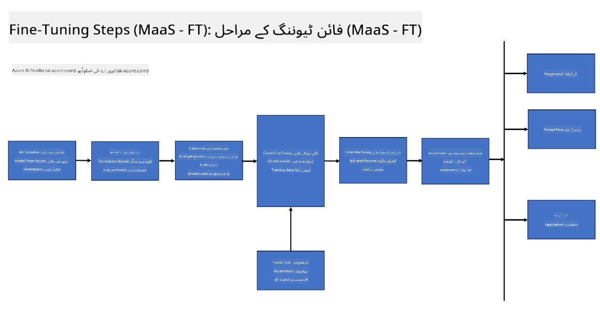

<!--
CO_OP_TRANSLATOR_METADATA:
{
  "original_hash": "cb5648935f63edc17e95ce38f23adc32",
  "translation_date": "2025-05-07T13:37:28+00:00",
  "source_file": "md/03.FineTuning/FineTuning_Scenarios.md",
  "language_code": "ur"
}
-->
## مناظرِ باریک بینی

**پلیٹ فارم** اس میں مختلف ٹیکنالوجیز شامل ہیں جیسے Azure AI Foundry، Azure Machine Learning، AI Tools، Kaito، اور ONNX Runtime۔

**انفراسٹرکچر** اس میں CPU اور FPGA شامل ہیں، جو باریک بینی کے عمل کے لیے ضروری ہیں۔ میں آپ کو ان ٹیکنالوجیز کے لیے آئیکنز دکھاتا ہوں۔

**ٹولز اور فریم ورک** اس میں ONNX Runtime شامل ہے۔ میں آپ کو ان ٹیکنالوجیز کے لیے آئیکنز دکھاتا ہوں۔
[Insert icons for ONNX Runtime and ONNX Runtime]

مائیکروسافٹ کی ٹیکنالوجیز کے ساتھ باریک بینی کا عمل مختلف اجزاء اور ٹولز پر مشتمل ہے۔ ان ٹیکنالوجیز کو سمجھ کر اور استعمال کر کے، ہم مؤثر طریقے سے اپنی ایپلیکیشنز کو بہتر بنا سکتے ہیں اور بہتر حل تیار کر سکتے ہیں۔

## ماڈل بطور سروس

ماڈل کو ہوسٹڈ فائن ٹیوننگ کے ذریعے باریک بینی کریں، بغیر کمپیوٹ بنانے اور منظم کرنے کی ضرورت کے۔

سرور لیس فائن ٹیوننگ Phi-3-mini اور Phi-3-medium ماڈلز کے لیے دستیاب ہے، جو ڈیولپرز کو کلاؤڈ اور ایج مناظر کے لیے ماڈلز کو تیزی اور آسانی سے حسب ضرورت بنانے کی سہولت دیتا ہے بغیر کمپیوٹ کا انتظام کیے۔ ہم نے یہ بھی اعلان کیا ہے کہ Phi-3-small اب ہمارے Models-as-a-Service آفرنگ کے ذریعے دستیاب ہے تاکہ ڈیولپرز بغیر بنیادی انفراسٹرکچر کے انتظام کے AI ڈیولپمنٹ کو جلد اور آسانی سے شروع کر سکیں۔

## ماڈل بطور پلیٹ فارم

صارفین اپنے کمپیوٹ کا انتظام کرتے ہیں تاکہ اپنے ماڈلز کی باریک بینی کر سکیں۔

[Fine Tuning Sample](https://github.com/Azure/azureml-examples/blob/main/sdk/python/foundation-models/system/finetune/chat-completion/chat-completion.ipynb)

## مناظرِ باریک بینی

| | | | | | | |
|-|-|-|-|-|-|-|
|منظر|LoRA|QLoRA|PEFT|DeepSpeed|ZeRO|DORA|
|پہلے سے تربیت یافتہ LLMs کو مخصوص کاموں یا شعبوں کے لیے ڈھالنا|ہاں|ہاں|ہاں|ہاں|ہاں|ہاں|
|NLP کاموں جیسے ٹیکسٹ کلاسیفیکیشن، نام شدہ ادارہ کی شناخت، اور مشین ترجمہ کے لیے باریک بینی|ہاں|ہاں|ہاں|ہاں|ہاں|ہاں|
|QA کاموں کے لیے باریک بینی|ہاں|ہاں|ہاں|ہاں|ہاں|ہاں|
|چیٹ بوٹس میں انسانی جیسی جوابات پیدا کرنے کے لیے باریک بینی|ہاں|ہاں|ہاں|ہاں|ہاں|ہاں|
|موسیقی، فن، یا دیگر تخلیقی شکلوں کی تخلیق کے لیے باریک بینی|ہاں|ہاں|ہاں|ہاں|ہاں|ہاں|
|کمپیوٹیشنل اور مالی لاگت کو کم کرنا|ہاں|ہاں|نہیں|ہاں|ہاں|نہیں|
|میموری کے استعمال کو کم کرنا|نہیں|ہاں|نہیں|ہاں|ہاں|ہاں|
|موثر فائن ٹیوننگ کے لیے کم پیرامیٹرز کا استعمال|نہیں|ہاں|ہاں|نہیں|نہیں|ہاں|
|میموری مؤثر ڈیٹا پیراللزم کی شکل جو تمام دستیاب GPU ڈیوائسز کی مجموعی GPU میموری تک رسائی دیتی ہے|نہیں|نہیں|نہیں|ہاں|ہاں|ہاں|

## باریک بینی کی کارکردگی کی مثالیں

**دستخط**:  
یہ دستاویز AI ترجمہ سروس [Co-op Translator](https://github.com/Azure/co-op-translator) کے ذریعے ترجمہ کی گئی ہے۔ اگرچہ ہم درستگی کے لیے کوشاں ہیں، براہ کرم آگاہ رہیں کہ خودکار ترجموں میں غلطیاں یا غیر درستیاں ہو سکتی ہیں۔ اصل دستاویز اپنی مادری زبان میں ہی معتبر ماخذ سمجھی جائے۔ اہم معلومات کے لیے پیشہ ورانہ انسانی ترجمہ تجویز کیا جاتا ہے۔ اس ترجمے کے استعمال سے پیدا ہونے والی کسی بھی غلط فہمی یا غلط تشریح کی ذمہ داری ہم پر عائد نہیں ہوتی۔