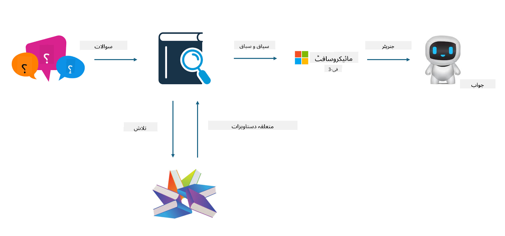

<!--
CO_OP_TRANSLATOR_METADATA:
{
  "original_hash": "5f1c641d645d9e86acdd304d5e9a03de",
  "translation_date": "2025-04-03T08:24:42+00:00",
  "source_file": "md\\03.FineTuning\\FineTuning_vs_RAG.md",
  "language_code": "ur"
}
-->
## فائن ٹوننگ بمقابلہ RAG

## ریٹریول آگمنٹڈ جنریشن

RAG ڈیٹا ریٹریول اور ٹیکسٹ جنریشن کا امتزاج ہے۔ انٹرپرائز کے منظم اور غیر منظم ڈیٹا کو ویکٹر ڈیٹابیس میں محفوظ کیا جاتا ہے۔ جب متعلقہ مواد کی تلاش کی جاتی ہے، تو متعلقہ خلاصہ اور مواد کو تلاش کرکے ایک کانٹیکسٹ بنایا جاتا ہے، اور پھر LLM/SLM کی ٹیکسٹ کمپلیشن کی صلاحیت کو استعمال کرکے مواد تیار کیا جاتا ہے۔

## RAG کا عمل

## فائن ٹوننگ
فائن ٹوننگ کسی خاص ماڈل کی بہتری پر مبنی ہوتی ہے۔ اس میں ماڈل الگورتھم سے شروع کرنے کی ضرورت نہیں ہوتی، لیکن ڈیٹا کو مسلسل جمع کرنا ضروری ہوتا ہے۔ اگر آپ کو صنعتی ایپلیکیشنز میں زیادہ درست اصطلاحات اور زبان کے اظہار کی ضرورت ہو، تو فائن ٹوننگ بہتر انتخاب ہے۔ لیکن اگر آپ کا ڈیٹا اکثر تبدیل ہوتا ہے، تو فائن ٹوننگ پیچیدہ ہو سکتی ہے۔

## انتخاب کیسے کریں
اگر ہمارے جواب میں بیرونی ڈیٹا کی وضاحت شامل کرنی ہو، تو RAG بہترین انتخاب ہے۔

اگر آپ کو مستحکم اور درست صنعتی معلومات فراہم کرنے کی ضرورت ہو، تو فائن ٹوننگ ایک اچھا انتخاب ہوگا۔ RAG متعلقہ مواد کو ترجیحی طور پر حاصل کرتا ہے لیکن مخصوص صنعتی باریکیوں کو ہمیشہ درست طریقے سے پیش نہیں کر سکتا۔

فائن ٹوننگ کے لیے اعلیٰ معیار کا ڈیٹا سیٹ ضروری ہوتا ہے، اور اگر یہ صرف محدود ڈیٹا ہو، تو زیادہ فرق نہیں پڑے گا۔ RAG زیادہ لچکدار ہے۔  
فائن ٹوننگ ایک بلیک باکس ہے، ایک میٹا فزکس، اور اس کے اندرونی میکانزم کو سمجھنا مشکل ہوتا ہے۔ لیکن RAG ڈیٹا کے ذرائع کو آسانی سے تلاش کرنے میں مدد فراہم کرتا ہے، جس سے وہم یا مواد کی غلطیوں کو مؤثر طریقے سے ایڈجسٹ کیا جا سکتا ہے اور بہتر شفافیت فراہم کی جا سکتی ہے۔

**ڈسکلیمر**:  
یہ دستاویز AI ترجمہ سروس [Co-op Translator](https://github.com/Azure/co-op-translator) کا استعمال کرتے ہوئے ترجمہ کی گئی ہے۔ ہم درستگی کے لیے پوری کوشش کرتے ہیں، لیکن براہ کرم آگاہ رہیں کہ خودکار ترجمے میں غلطیاں یا بے ضابطگیاں ہو سکتی ہیں۔ اصل دستاویز کو اس کی اصل زبان میں مستند ذریعہ سمجھا جانا چاہیے۔ اہم معلومات کے لیے، پیشہ ور انسانی ترجمہ کی سفارش کی جاتی ہے۔ ہم اس ترجمے کے استعمال سے پیدا ہونے والی کسی بھی غلط فہمی یا غلط تشریح کے ذمہ دار نہیں ہیں۔