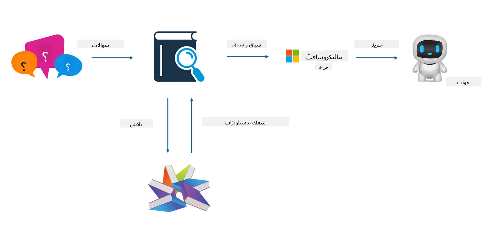

## فائن ٹیوننگ بمقابلہ RAG

## Retrieval Augmented Generation

RAG ڈیٹا بازیافت + متن کی تخلیق ہے۔ ادارے کے منظم اور غیر منظم ڈیٹا کو ویکٹر ڈیٹا بیس میں محفوظ کیا جاتا ہے۔ جب متعلقہ مواد تلاش کیا جاتا ہے، تو متعلقہ خلاصہ اور مواد مل کر ایک سیاق و سباق بناتے ہیں، اور LLM/SLM کی متن مکمل کرنے کی صلاحیت کے ساتھ مل کر مواد تیار کیا جاتا ہے۔

## RAG کا عمل

## فائن ٹیوننگ
فائن ٹیوننگ کسی مخصوص ماڈل کی بہتری پر مبنی ہے۔ اس کے لیے ماڈل الگورتھم سے شروع کرنے کی ضرورت نہیں ہوتی، لیکن ڈیٹا کو مسلسل جمع کرنا پڑتا ہے۔ اگر آپ صنعتی ایپلیکیشنز میں زیادہ درست اصطلاحات اور زبان کے اظہار چاہتے ہیں، تو فائن ٹیوننگ آپ کے لیے بہتر انتخاب ہے۔ لیکن اگر آپ کا ڈیٹا بار بار تبدیل ہوتا ہے، تو فائن ٹیوننگ پیچیدہ ہو سکتی ہے۔

## انتخاب کیسے کریں
اگر ہمارے جواب کے لیے بیرونی ڈیٹا کی ضرورت ہو، تو RAG بہترین انتخاب ہے۔

اگر آپ کو مستحکم اور درست صنعتی معلومات فراہم کرنی ہوں، تو فائن ٹیوننگ اچھا انتخاب ہوگا۔ RAG متعلقہ مواد کو ترجیح دیتا ہے لیکن ہمیشہ مخصوص باریکیاں نہیں پکڑ پاتا۔

فائن ٹیوننگ کے لیے اعلیٰ معیار کا ڈیٹا سیٹ ضروری ہے، اور اگر ڈیٹا کی مقدار کم ہو تو اس کا زیادہ فرق نہیں پڑے گا۔ RAG زیادہ لچکدار ہے۔

فائن ٹیوننگ ایک بلیک باکس ہے، ایک مابعد الطبیعیات، اور اس کے اندرونی میکانزم کو سمجھنا مشکل ہے۔ لیکن RAG ڈیٹا کے ماخذ کو تلاش کرنا آسان بناتا ہے، جس سے ہیلوسینیشنز یا مواد کی غلطیوں کو مؤثر طریقے سے درست کیا جا سکتا ہے اور بہتر شفافیت فراہم کی جا سکتی ہے۔

**دستخطی نوٹ**:  
یہ دستاویز AI ترجمہ سروس [Co-op Translator](https://github.com/Azure/co-op-translator) کے ذریعے ترجمہ کی گئی ہے۔ اگرچہ ہم درستگی کے لیے کوشاں ہیں، براہ کرم آگاہ رہیں کہ خودکار ترجمے میں غلطیاں یا عدم درستیاں ہو سکتی ہیں۔ اصل دستاویز اپنی مادری زبان میں ہی معتبر ماخذ سمجھی جانی چاہیے۔ اہم معلومات کے لیے پیشہ ور انسانی ترجمہ کی سفارش کی جاتی ہے۔ اس ترجمے کے استعمال سے پیدا ہونے والی کسی بھی غلط فہمی یا غلط تشریح کی ذمہ داری ہم پر عائد نہیں ہوتی۔