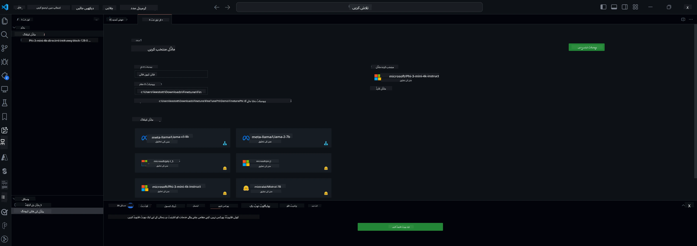

<!--
CO_OP_TRANSLATOR_METADATA:
{
  "original_hash": "c2bc0950f44919ac75a88c1a871680c2",
  "translation_date": "2025-07-17T09:02:20+00:00",
  "source_file": "md/03.FineTuning/Finetuning_VSCodeaitoolkit.md",
  "language_code": "ur"
}
-->
## VS Code کے لیے AI Toolkit میں خوش آمدید

[AI Toolkit for VS Code](https://github.com/microsoft/vscode-ai-toolkit/tree/main) مختلف ماڈلز کو Azure AI Studio Catalog اور دیگر کیٹلاگز جیسے Hugging Face سے یکجا کرتا ہے۔ یہ ٹول کٹ جنریٹو AI ٹولز اور ماڈلز کے ذریعے AI ایپس بنانے کے عام ترقیاتی کاموں کو آسان بناتا ہے:
- ماڈل کی دریافت اور پلے گراؤنڈ کے ساتھ شروع کریں۔
- مقامی کمپیوٹنگ وسائل کا استعمال کرتے ہوئے ماڈل کی فائن ٹیوننگ اور انفرنس۔
- Azure وسائل کا استعمال کرتے ہوئے ریموٹ فائن ٹیوننگ اور انفرنس۔

[VSCode کے لیے AI Toolkit انسٹال کریں](https://marketplace.visualstudio.com/items?itemName=ms-windows-ai-studio.windows-ai-studio)




**[Private Preview]** Azure Container Apps کے لیے ایک کلک پروویژننگ تاکہ ماڈل کی فائن ٹیوننگ اور انفرنس کلاؤڈ میں چلائی جا سکے۔

اب آئیے آپ کی AI ایپ کی ترقی میں قدم بڑھائیں:

- [VS Code کے لیے AI Toolkit میں خوش آمدید](../../../../md/03.FineTuning)
- [مقامی ترقی](../../../../md/03.FineTuning)
  - [تیاری](../../../../md/03.FineTuning)
  - [Conda کو فعال کریں](../../../../md/03.FineTuning)
  - [صرف بیس ماڈل کی فائن ٹیوننگ](../../../../md/03.FineTuning)
  - [ماڈل کی فائن ٹیوننگ اور انفرنس](../../../../md/03.FineTuning)
  - [ماڈل کی فائن ٹیوننگ](../../../../md/03.FineTuning)
  - [Microsoft Olive](../../../../md/03.FineTuning)
  - [فائن ٹیوننگ کے نمونے اور وسائل](../../../../md/03.FineTuning)
- [**\[Private Preview\]** ریموٹ ترقی](../../../../md/03.FineTuning)
  - [ضروریات](../../../../md/03.FineTuning)
  - [ریموٹ ترقیاتی پروجیکٹ کی ترتیب](../../../../md/03.FineTuning)
  - [Azure وسائل کی فراہمی](../../../../md/03.FineTuning)
  - [\[اختیاری\] Azure Container App سیکرٹ میں Huggingface ٹوکن شامل کریں](../../../../md/03.FineTuning)
  - [فائن ٹیوننگ چلائیں](../../../../md/03.FineTuning)
  - [انفرنس اینڈپوائنٹ کی فراہمی](../../../../md/03.FineTuning)
  - [انفرنس اینڈپوائنٹ کی تعیناتی](../../../../md/03.FineTuning)
  - [جدید استعمال](../../../../md/03.FineTuning)

## مقامی ترقی
### تیاری

1. یقینی بنائیں کہ NVIDIA ڈرائیور ہوسٹ پر انسٹال ہے۔
2. اگر آپ HF کو ڈیٹا سیٹ کے استعمال کے لیے استعمال کر رہے ہیں تو `huggingface-cli login` چلائیں۔
3. `Olive` کی کلید کی ترتیبات کی وضاحت جو میموری کے استعمال میں تبدیلی کرتی ہیں۔

### Conda کو فعال کریں
چونکہ ہم WSL ماحول استعمال کر رہے ہیں اور یہ مشترکہ ہے، آپ کو دستی طور پر conda ماحول کو فعال کرنا ہوگا۔ اس مرحلے کے بعد آپ فائن ٹیوننگ یا انفرنس چلا سکتے ہیں۔

```bash
conda activate [conda-env-name] 
```

### صرف بیس ماڈل کی فائن ٹیوننگ
اگر آپ صرف بیس ماڈل کو بغیر فائن ٹیوننگ کے آزمانا چاہتے ہیں تو conda کو فعال کرنے کے بعد یہ کمانڈ چلائیں۔

```bash
cd inference

# Web browser interface allows to adjust a few parameters like max new token length, temperature and so on.
# User has to manually open the link (e.g. http://0.0.0.0:7860) in a browser after gradio initiates the connections.
python gradio_chat.py --baseonly
```

### ماڈل کی فائن ٹیوننگ اور انفرنس

جب ورک اسپیس ڈیو کنٹینر میں کھل جائے، تو ٹرمینل کھولیں (ڈیفالٹ راستہ پروجیکٹ روٹ ہے)، پھر نیچے دی گئی کمانڈ چلائیں تاکہ منتخب ڈیٹا سیٹ پر LLM کی فائن ٹیوننگ کی جا سکے۔

```bash
python finetuning/invoke_olive.py 
```

چیک پوائنٹس اور حتمی ماڈل `models` فولڈر میں محفوظ ہوں گے۔

اس کے بعد فائن ٹیونڈ ماڈل کے ساتھ `console`، `web browser` یا `prompt flow` میں چیٹس کے ذریعے انفرنس چلائیں۔

```bash
cd inference

# Console interface.
python console_chat.py

# Web browser interface allows to adjust a few parameters like max new token length, temperature and so on.
# User has to manually open the link (e.g. http://127.0.0.1:7860) in a browser after gradio initiates the connections.
python gradio_chat.py
```

VS Code میں `prompt flow` استعمال کرنے کے لیے، براہ کرم اس [Quick Start](https://microsoft.github.io/promptflow/how-to-guides/quick-start.html) کا حوالہ دیں۔

### ماڈل کی فائن ٹیوننگ

اگلا، اپنے ڈیوائس پر GPU کی دستیابی کے مطابق درج ذیل ماڈل ڈاؤن لوڈ کریں۔

QLoRA کا استعمال کرتے ہوئے مقامی فائن ٹیوننگ سیشن شروع کرنے کے لیے، کیٹلاگ سے وہ ماڈل منتخب کریں جسے آپ فائن ٹیون کرنا چاہتے ہیں۔
| پلیٹ فارم | GPU دستیاب | ماڈل کا نام | سائز (GB) |
|---------|---------|--------|--------|
| Windows | ہاں | Phi-3-mini-4k-**directml**-int4-awq-block-128-onnx | 2.13GB |
| Linux | ہاں | Phi-3-mini-4k-**cuda**-int4-onnx | 2.30GB |
| Windows<br>Linux | نہیں | Phi-3-mini-4k-**cpu**-int4-rtn-block-32-acc-level-4-onnx | 2.72GB |

**_نوٹ_** ماڈلز ڈاؤن لوڈ کرنے کے لیے آپ کو Azure اکاؤنٹ کی ضرورت نہیں ہے۔

Phi3-mini (int4) ماڈل کا سائز تقریباً 2GB-3GB ہے۔ آپ کے نیٹ ورک کی رفتار کے مطابق ڈاؤن لوڈ میں چند منٹ لگ سکتے ہیں۔

شروع کرنے کے لیے پروجیکٹ کا نام اور مقام منتخب کریں۔
اس کے بعد ماڈل کیٹلاگ سے ماڈل منتخب کریں۔ آپ کو پروجیکٹ ٹیمپلیٹ ڈاؤن لوڈ کرنے کا کہا جائے گا۔ پھر آپ "Configure Project" پر کلک کر کے مختلف ترتیبات کو ایڈجسٹ کر سکتے ہیں۔

### Microsoft Olive

ہم [Olive](https://microsoft.github.io/Olive/why-olive.html) استعمال کرتے ہیں تاکہ کیٹلاگ سے PyTorch ماڈل پر QLoRA فائن ٹیوننگ چلائی جا سکے۔ تمام ترتیبات پہلے سے طے شدہ اقدار کے ساتھ سیٹ کی گئی ہیں تاکہ میموری کے بہتر استعمال کے ساتھ فائن ٹیوننگ کا عمل مقامی طور پر چل سکے، لیکن آپ اسے اپنی صورتحال کے مطابق ایڈجسٹ کر سکتے ہیں۔

### فائن ٹیوننگ کے نمونے اور وسائل

- [فائن ٹیوننگ شروع کرنے کی گائیڈ](https://learn.microsoft.com/windows/ai/toolkit/toolkit-fine-tune)
- [HuggingFace ڈیٹا سیٹ کے ساتھ فائن ٹیوننگ](https://github.com/microsoft/vscode-ai-toolkit/blob/main/archive/walkthrough-hf-dataset.md)
- [سادہ ڈیٹا سیٹ کے ساتھ فائن ٹیوننگ](https://github.com/microsoft/vscode-ai-toolkit/blob/main/archive/walkthrough-simple-dataset.md)

## **[Private Preview]** ریموٹ ترقی

### ضروریات

1. اپنے ریموٹ Azure Container App ماحول میں ماڈل کی فائن ٹیوننگ چلانے کے لیے، یقینی بنائیں کہ آپ کی سبسکرپشن میں کافی GPU صلاحیت موجود ہے۔ اپنی ایپلیکیشن کے لیے مطلوبہ صلاحیت کی درخواست کے لیے [سپورٹ ٹکٹ](https://azure.microsoft.com/support/create-ticket/) جمع کروائیں۔ [GPU صلاحیت کے بارے میں مزید معلومات حاصل کریں](https://learn.microsoft.com/azure/container-apps/workload-profiles-overview)
2. اگر آپ HuggingFace پر پرائیویٹ ڈیٹا سیٹ استعمال کر رہے ہیں، تو یقینی بنائیں کہ آپ کے پاس [HuggingFace اکاؤنٹ](https://huggingface.co/?WT.mc_id=aiml-137032-kinfeylo) ہے اور آپ نے [ایکسیس ٹوکن جنریٹ کیا ہے](https://huggingface.co/docs/hub/security-tokens?WT.mc_id=aiml-137032-kinfeylo)
3. VS Code کے AI Toolkit میں Remote Fine-tuning اور Inference فیچر فلیگ کو فعال کریں:
   1. *File -> Preferences -> Settings* منتخب کر کے VS Code کی سیٹنگز کھولیں۔
   2. *Extensions* پر جائیں اور *AI Toolkit* منتخب کریں۔
   3. *"Enable Remote Fine-tuning And Inference"* آپشن منتخب کریں۔
   4. اثرات کے لیے VS Code کو ری لوڈ کریں۔

- [ریمورٹ فائن ٹیوننگ](https://github.com/microsoft/vscode-ai-toolkit/blob/main/archive/remote-finetuning.md)

### ریموٹ ترقیاتی پروجیکٹ کی ترتیب
1. کمانڈ پیلیٹ میں `AI Toolkit: Focus on Resource View` چلائیں۔
2. *Model Fine-tuning* پر جائیں تاکہ ماڈل کیٹلاگ تک رسائی حاصل ہو۔ اپنے پروجیکٹ کا نام اور مشین پر مقام منتخب کریں۔ پھر *"Configure Project"* بٹن دبائیں۔
3. پروجیکٹ کی ترتیب
    1. *"Fine-tune locally"* آپشن کو فعال نہ کریں۔
    2. Olive کی ترتیب کی سیٹنگز پہلے سے طے شدہ اقدار کے ساتھ ظاہر ہوں گی۔ براہ کرم اپنی ضرورت کے مطابق ان کو ایڈجسٹ کریں اور مکمل کریں۔
    3. *Generate Project* پر جائیں۔ یہ مرحلہ WSL کا استعمال کرتا ہے اور نیا Conda ماحول بناتا ہے، مستقبل میں Dev Containers کے لیے تیاری کرتا ہے۔
4. *"Relaunch Window In Workspace"* پر کلک کریں تاکہ آپ کا ریموٹ ترقیاتی پروجیکٹ کھل جائے۔

> **نوٹ:** یہ پروجیکٹ فی الحال AI Toolkit for VS Code میں یا تو مقامی یا ریموٹ طور پر کام کرتا ہے۔ اگر آپ پروجیکٹ بنانے کے دوران *"Fine-tune locally"* منتخب کرتے ہیں، تو یہ صرف WSL میں چلے گا اور ریموٹ ترقی کی سہولت نہیں دے گا۔ اگر آپ *"Fine-tune locally"* کو فعال نہیں کرتے، تو پروجیکٹ صرف ریموٹ Azure Container App ماحول تک محدود رہے گا۔

### Azure وسائل کی فراہمی
شروع کرنے کے لیے، ریموٹ فائن ٹیوننگ کے لیے Azure Resource فراہم کریں۔ یہ کام کمانڈ پیلیٹ سے `AI Toolkit: Provision Azure Container Apps job for fine-tuning` چلانے سے کریں۔

پروویژن کی پیش رفت کو آؤٹ پٹ چینل میں دکھائے گئے لنک کے ذریعے مانیٹر کریں۔

### [اختیاری] Azure Container App سیکرٹ میں Huggingface ٹوکن شامل کریں
اگر آپ پرائیویٹ HuggingFace ڈیٹا سیٹ استعمال کر رہے ہیں، تو اپنے HuggingFace ٹوکن کو ایک ماحول متغیر کے طور پر سیٹ کریں تاکہ Hugging Face Hub پر دستی لاگ ان کی ضرورت نہ ہو۔
یہ آپ `AI Toolkit: Add Azure Container Apps Job secret for fine-tuning` کمانڈ کے ذریعے کر سکتے ہیں۔ اس کمانڈ کے ساتھ، آپ سیکرٹ کا نام [`HF_TOKEN`](https://huggingface.co/docs/huggingface_hub/package_reference/environment_variables#hftoken) رکھ سکتے ہیں اور اپنے Hugging Face ٹوکن کو سیکرٹ ویلیو کے طور پر استعمال کر سکتے ہیں۔

### فائن ٹیوننگ چلائیں
ریمورٹ فائن ٹیوننگ جاب شروع کرنے کے لیے، `AI Toolkit: Run fine-tuning` کمانڈ چلائیں۔

سسٹم اور کنسول لاگز دیکھنے کے لیے، آپ آؤٹ پٹ پینل میں دیے گئے لنک کے ذریعے Azure پورٹل پر جا سکتے ہیں (مزید مراحل کے لیے [View and Query Logs on Azure](https://aka.ms/ai-toolkit/remote-provision#view-and-query-logs-on-azure) دیکھیں)۔ یا، آپ VSCode آؤٹ پٹ پینل میں `AI Toolkit: Show the running fine-tuning job streaming logs` کمانڈ چلا کر کنسول لاگز براہ راست دیکھ سکتے ہیں۔
> **نوٹ:** وسائل کی کمی کی وجہ سے جاب قطار میں ہو سکتی ہے۔ اگر لاگ ظاہر نہ ہو، تو `AI Toolkit: Show the running fine-tuning job streaming logs` کمانڈ چلائیں، کچھ دیر انتظار کریں اور پھر دوبارہ کمانڈ چلائیں تاکہ سٹریمنگ لاگ سے دوبارہ جڑ سکیں۔

اس عمل کے دوران، QLoRA فائن ٹیوننگ کے لیے استعمال ہوگا، اور ماڈل کے لیے LoRA اڈاپٹرز بنائے گا جو انفرنس کے دوران استعمال ہوں گے۔
فائن ٹیوننگ کے نتائج Azure Files میں محفوظ ہوں گے۔

### انفرنس اینڈپوائنٹ کی فراہمی
جب اڈاپٹرز ریموٹ ماحول میں تربیت پا جائیں، تو ماڈل کے ساتھ تعامل کے لیے ایک سادہ Gradio ایپلیکیشن استعمال کریں۔
فائن ٹیوننگ کے عمل کی طرح، ریموٹ انفرنس کے لیے Azure وسائل ترتیب دینے کے لیے کمانڈ پیلیٹ سے `AI Toolkit: Provision Azure Container Apps for inference` چلائیں۔

ڈیفالٹ کے طور پر، انفرنس کے لیے سبسکرپشن اور ریسورس گروپ وہی ہونے چاہئیں جو فائن ٹیوننگ کے لیے استعمال ہوئے تھے۔ انفرنس اسی Azure Container App ماحول کا استعمال کرے گا اور Azure Files میں محفوظ ماڈل اور ماڈل اڈاپٹر تک رسائی حاصل کرے گا، جو فائن ٹیوننگ کے دوران بنائے گئے تھے۔

### انفرنس اینڈپوائنٹ کی تعیناتی
اگر آپ انفرنس کوڈ میں ترمیم کرنا چاہتے ہیں یا انفرنس ماڈل کو دوبارہ لوڈ کرنا چاہتے ہیں، تو `AI Toolkit: Deploy for inference` کمانڈ چلائیں۔ یہ آپ کے تازہ ترین کوڈ کو Azure Container App کے ساتھ ہم آہنگ کرے گا اور ریپلیکا کو دوبارہ شروع کرے گا۔

تعیناتی کامیابی سے مکمل ہونے کے بعد، آپ VSCode کی نوٹیفیکیشن میں دکھائے گئے "*Go to Inference Endpoint*" بٹن پر کلک کر کے انفرنس API تک رسائی حاصل کر سکتے ہیں۔ یا، ویب API اینڈپوائنٹ `ACA_APP_ENDPOINT` کے تحت `./infra/inference.config.json` اور آؤٹ پٹ پینل میں مل جائے گا۔ اب آپ اس اینڈپوائنٹ کے ذریعے ماڈل کا جائزہ لینے کے لیے تیار ہیں۔

### جدید استعمال
AI Toolkit کے ساتھ ریموٹ ترقی کے بارے میں مزید معلومات کے لیے، [Fine-Tuning models remotely](https://aka.ms/ai-toolkit/remote-provision) اور [Inferencing with the fine-tuned model](https://aka.ms/ai-toolkit/remote-inference) دستاویزات کا حوالہ دیں۔

**دستخطی نوٹ**:  
یہ دستاویز AI ترجمہ سروس [Co-op Translator](https://github.com/Azure/co-op-translator) کے ذریعے ترجمہ کی گئی ہے۔ اگرچہ ہم درستگی کے لیے کوشاں ہیں، براہ کرم اس بات سے آگاہ رہیں کہ خودکار ترجمے میں غلطیاں یا عدم درستیاں ہو سکتی ہیں۔ اصل دستاویز اپنی مادری زبان میں ہی معتبر ماخذ سمجھی جانی چاہیے۔ اہم معلومات کے لیے پیشہ ور انسانی ترجمہ کی سفارش کی جاتی ہے۔ اس ترجمے کے استعمال سے پیدا ہونے والی کسی بھی غلط فہمی یا غلط تشریح کی ذمہ داری ہم پر عائد نہیں ہوتی۔