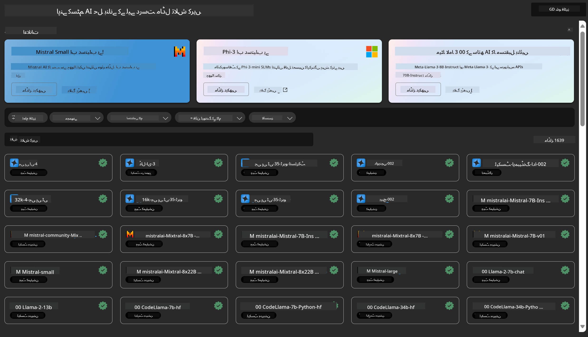
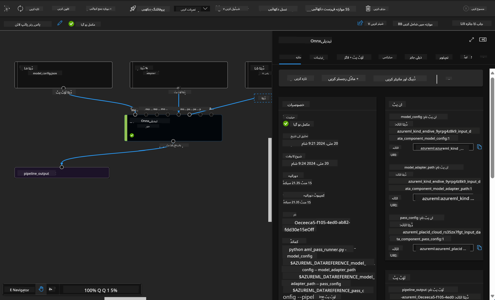

<!--
CO_OP_TRANSLATOR_METADATA:
{
  "original_hash": "7fe541373802e33568e94e13226d463c",
  "translation_date": "2025-05-07T13:31:48+00:00",
  "source_file": "md/03.FineTuning/Introduce_AzureML.md",
  "language_code": "ur"
}
-->
# **ایزور مشین لرننگ سروس کا تعارف**

[Azure Machine Learning](https://ml.azure.com?WT.mc_id=aiml-138114-kinfeylo) ایک کلاؤڈ سروس ہے جو مشین لرننگ (ML) پروجیکٹ کے لائف سائیکل کو تیز کرنے اور منظم کرنے کے لیے استعمال ہوتی ہے۔

ML کے ماہرین، ڈیٹا سائنسدان، اور انجینئرز اسے اپنے روزمرہ کے کاموں میں استعمال کر سکتے ہیں تاکہ:

- ماڈلز کو تربیت دیں اور تعینات کریں۔
- مشین لرننگ آپریشنز (MLOps) کو منظم کریں۔
- آپ Azure Machine Learning میں ماڈل بنا سکتے ہیں یا اوپن سورس پلیٹ فارمز جیسے PyTorch، TensorFlow، یا scikit-learn سے تیار شدہ ماڈل استعمال کر سکتے ہیں۔
- MLOps کے ٹولز آپ کو ماڈلز کی نگرانی، دوبارہ تربیت، اور دوبارہ تعیناتی میں مدد دیتے ہیں۔

## Azure Machine Learning کس کے لیے ہے؟

**ڈیٹا سائنسدان اور ML انجینئرز**

وہ اپنے روزمرہ کے کاموں کو تیز اور خودکار بنانے کے لیے ٹولز استعمال کر سکتے ہیں۔
Azure ML انصاف، وضاحت، ٹریکنگ، اور آڈٹ کی خصوصیات فراہم کرتا ہے۔

**ایپلیکیشن ڈویلپرز:**

وہ ماڈلز کو ایپلیکیشنز یا سروسز میں بغیر کسی رکاوٹ کے شامل کر سکتے ہیں۔

**پلیٹ فارم ڈویلپرز**

انہیں Azure Resource Manager APIs کی مدد سے مضبوط ٹولز تک رسائی حاصل ہے۔
یہ ٹولز پیچیدہ ML ٹولنگ بنانے کی اجازت دیتے ہیں۔

**ادارے**

Microsoft Azure کلاؤڈ میں کام کرتے ہوئے، ادارے معروف سیکیورٹی اور رول پر مبنی رسائی کنٹرول سے فائدہ اٹھاتے ہیں۔
پروجیکٹس سیٹ اپ کریں تاکہ محفوظ ڈیٹا اور مخصوص آپریشنز کی رسائی کنٹرول کی جا سکے۔

## ٹیم کے ہر فرد کے لیے پیداواریت

ML پروجیکٹس اکثر مختلف مہارتوں والی ٹیم کی ضرورت ہوتی ہے تاکہ وہ ماڈلز بنا سکیں اور برقرار رکھ سکیں۔

Azure ML ایسے ٹولز فراہم کرتا ہے جو آپ کو قابل بناتے ہیں کہ:

- مشترکہ نوٹ بکس، کمپیوٹ وسائل، سرور لیس کمپیوٹ، ڈیٹا، اور ماحولیات کے ذریعے اپنی ٹیم کے ساتھ تعاون کریں۔
- انصاف، وضاحت، ٹریکنگ، اور آڈٹ کی خصوصیات کے ساتھ ماڈلز تیار کریں تاکہ lineage اور آڈٹ کمپلائنس کی ضروریات پوری ہوں۔
- ML ماڈلز کو تیزی سے اور آسانی سے بڑے پیمانے پر تعینات کریں، اور MLOps کے ذریعے انہیں مؤثر طریقے سے منظم اور کنٹرول کریں۔
- بلٹ ان گورننس، سیکیورٹی، اور کمپلائنس کے ساتھ کہیں بھی مشین لرننگ کے کام چلائیں۔

## کراس-کمپیٹیبل پلیٹ فارم ٹولز

ML ٹیم کا کوئی بھی رکن اپنے پسندیدہ ٹولز استعمال کر کے کام مکمل کر سکتا ہے۔
چاہے آپ تیز تجربات کر رہے ہوں، ہائپر پیرامیٹر ٹیوننگ کر رہے ہوں، پائپ لائنز بنا رہے ہوں، یا انفیرنس منیج کر رہے ہوں، آپ مندرجہ ذیل مانوس انٹرفیسز استعمال کر سکتے ہیں:

- Azure Machine Learning Studio
- Python SDK (v2)
- Azure CLI (v2)
- Azure Resource Manager REST APIs

ماڈلز کو بہتر بنانے اور ترقیاتی مرحلے کے دوران تعاون کرنے کے ساتھ، آپ Azure Machine Learning اسٹوڈیو UI میں اثاثے، وسائل، اور میٹرکس شیئر اور تلاش کر سکتے ہیں۔

## **Azure ML میں LLM/SLM**

Azure ML نے بہت سے LLM/SLM سے متعلق فنکشنز شامل کیے ہیں، جو LLMOps اور SLMOps کو ملا کر ایک انٹرپرائز وسیع جنریٹو مصنوعی ذہانت کی ٹیکنالوجی پلیٹ فارم بناتے ہیں۔

### **ماڈل کیٹلاگ**

انٹرپرائز صارفین مختلف کاروباری حالات کے مطابق مختلف ماڈلز کو ماڈل کیٹلاگ کے ذریعے تعینات کر سکتے ہیں، اور انٹرپرائز ڈویلپرز یا صارفین کے لیے ماڈل بطور سروس فراہم کر سکتے ہیں۔

Azure Machine Learning اسٹوڈیو میں ماڈل کیٹلاگ ایک مرکز ہے جہاں آپ مختلف ماڈلز دریافت اور استعمال کر سکتے ہیں جو جنریٹو AI ایپلیکیشنز بنانے کے قابل بناتے ہیں۔ ماڈل کیٹلاگ میں Azure OpenAI سروس، Mistral، Meta، Cohere، Nvidia، Hugging Face جیسے ماڈل فراہم کنندگان کے سینکڑوں ماڈلز شامل ہیں، جن میں Microsoft کے تربیت یافتہ ماڈلز بھی شامل ہیں۔ Microsoft کے علاوہ فراہم کنندگان کے ماڈلز Non-Microsoft Products کہلاتے ہیں، جیسا کہ Microsoft کی پروڈکٹ شرائط میں بیان کیا گیا ہے، اور ماڈل کے ساتھ فراہم کردہ شرائط کے تابع ہوتے ہیں۔

### **جاب پائپ لائن**

مشین لرننگ پائپ لائن کا بنیادی مقصد ایک مکمل مشین لرننگ ٹاسک کو کئی مراحل میں تقسیم کرنا ہے۔ ہر مرحلہ ایک قابل انتظام جزو ہوتا ہے جسے الگ الگ تیار، بہتر، ترتیب، اور خودکار بنایا جا سکتا ہے۔ یہ مراحل اچھی طرح سے متعین انٹرفیسز کے ذریعے جڑے ہوتے ہیں۔ Azure Machine Learning پائپ لائن سروس خودکار طریقے سے تمام مراحل کے درمیان انحصار کو منظم کرتی ہے۔

SLM / LLM کی فائن ٹیوننگ میں، ہم اپنے ڈیٹا، تربیت، اور جنریشن کے عمل کو پائپ لائن کے ذریعے منظم کر سکتے ہیں۔

### **پرومپٹ فلو**

Azure Machine Learning پرومپٹ فلو کے استعمال کے فوائد  
Azure Machine Learning پرومپٹ فلو کئی فوائد فراہم کرتا ہے جو صارفین کو آئیڈیا سے تجربے اور آخر کار پروڈکشن کے لیے تیار LLM بیسڈ ایپلیکیشنز تک پہنچنے میں مدد دیتے ہیں:

**پرومپٹ انجینئرنگ میں لچک**

انٹرایکٹو تحریری تجربہ: Azure Machine Learning پرومپٹ فلو فلو کی ساخت کی بصری نمائندگی فراہم کرتا ہے، جس سے صارفین اپنے پروجیکٹس کو آسانی سے سمجھ اور نیویگیٹ کر سکتے ہیں۔ یہ کوڈنگ کے لیے نوٹ بک نما تجربہ بھی دیتا ہے تاکہ فلو کی ترقی اور ڈیبگنگ مؤثر ہو سکے۔  
پرومپٹ ٹیوننگ کے لیے مختلف اقسام: صارفین متعدد پرومپٹ ورژن بنا اور موازنہ کر سکتے ہیں، جو ایک تکراری بہتری کے عمل کو آسان بناتا ہے۔

تشخیص: بلٹ ان تشخیصی فلو صارفین کو اپنے پرومپٹس اور فلو کی معیار اور مؤثریت جانچنے کی سہولت دیتے ہیں۔

جامع وسائل: Azure Machine Learning پرومپٹ فلو میں بلٹ ان ٹولز، نمونے، اور ٹیمپلیٹس کی لائبریری شامل ہے جو ترقی کے لیے نقطہ آغاز فراہم کرتی ہے، تخلیقی صلاحیت کو بڑھاتی ہے اور عمل کو تیز کرتی ہے۔

**LLM بیسڈ ایپلیکیشنز کے لیے انٹرپرائز تیاری**

تعاون: Azure Machine Learning پرومپٹ فلو ٹیم کے تعاون کی حمایت کرتا ہے، جس سے متعدد صارفین پرومپٹ انجینئرنگ پروجیکٹس پر مل کر کام کر سکتے ہیں، علم شیئر کر سکتے ہیں، اور ورژن کنٹرول برقرار رکھ سکتے ہیں۔

ایک پلیٹ فارم میں سب کچھ: Azure Machine Learning پرومپٹ فلو پورے پرومپٹ انجینئرنگ عمل کو آسان بناتا ہے، ترقی، تشخیص، تعیناتی، اور نگرانی سمیت۔ صارفین آسانی سے اپنے فلو کو Azure Machine Learning اینڈ پوائنٹس کے طور پر تعینات کر سکتے ہیں اور حقیقی وقت میں ان کی کارکردگی مانیٹر کر سکتے ہیں، تاکہ بہترین آپریشن اور مسلسل بہتری یقینی بنائی جا سکے۔

Azure Machine Learning انٹرپرائز ریڈینس سلوشنز: پرومپٹ فلو Azure Machine Learning کے مضبوط انٹرپرائز ریڈینس سلوشنز کا فائدہ اٹھاتا ہے، جو فلو کی ترقی، تجربہ کاری، اور تعیناتی کے لیے محفوظ، قابل توسیع، اور قابل اعتماد بنیاد فراہم کرتا ہے۔

Azure Machine Learning پرومپٹ فلو کے ساتھ، صارفین اپنی پرومپٹ انجینئرنگ کی لچک کو آزاد کر سکتے ہیں، مؤثر تعاون کر سکتے ہیں، اور کامیاب LLM بیسڈ ایپلیکیشن کی ترقی اور تعیناتی کے لیے انٹرپرائز گریڈ سلوشنز سے فائدہ اٹھا سکتے ہیں۔

کمپیوٹنگ پاور، ڈیٹا، اور Azure ML کے مختلف اجزاء کو ملا کر، انٹرپرائز ڈویلپرز آسانی سے اپنی مصنوعی ذہانت کی ایپلیکیشنز بنا سکتے ہیں۔

**ڈسکلیمر**:  
یہ دستاویز AI ترجمہ سروس [Co-op Translator](https://github.com/Azure/co-op-translator) کے ذریعے ترجمہ کی گئی ہے۔ اگرچہ ہم درستگی کی کوشش کرتے ہیں، براہ کرم آگاہ رہیں کہ خودکار تراجم میں غلطیاں یا غیر درستیاں ہو سکتی ہیں۔ اصل دستاویز اپنی مادری زبان میں ہی معتبر ماخذ سمجھی جائے۔ اہم معلومات کے لیے پیشہ ور انسانی ترجمہ تجویز کیا جاتا ہے۔ ہم اس ترجمے کے استعمال سے پیدا ہونے والی کسی بھی غلط فہمی یا غلط تشریح کے ذمہ دار نہیں ہیں۔