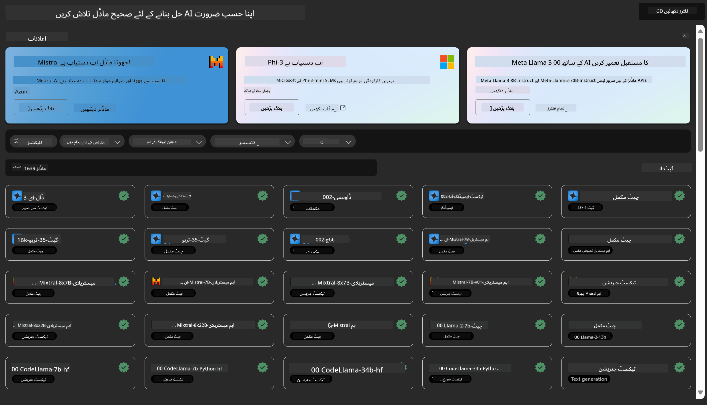
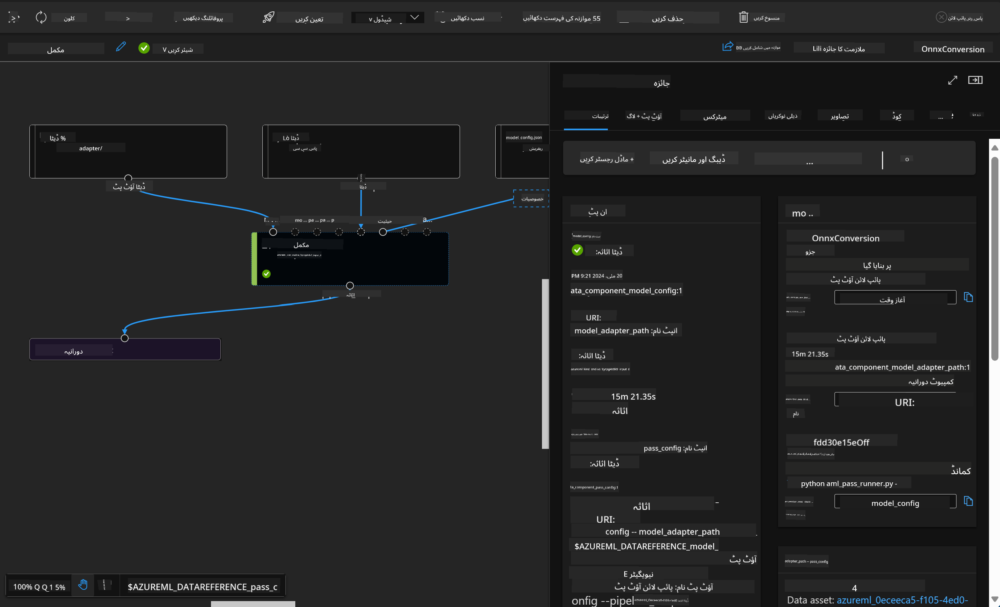

<!--
CO_OP_TRANSLATOR_METADATA:
{
  "original_hash": "315566447513c4c6215ea5a004315e4f",
  "translation_date": "2025-04-03T08:25:43+00:00",
  "source_file": "md\\03.FineTuning\\Introduce_AzureML.md",
  "language_code": "ur"
}
-->
# **Azure Machine Learning سروس کا تعارف**

[Azure Machine Learning](https://ml.azure.com?WT.mc_id=aiml-138114-kinfeylo) ایک کلاؤڈ سروس ہے جو مشین لرننگ (ML) پروجیکٹ لائف سائیکل کو تیز کرنے اور منظم کرنے کے لیے استعمال ہوتی ہے۔

ML کے ماہرین، ڈیٹا سائنسدان، اور انجینئرز اسے اپنی روزمرہ کی ورک فلو میں استعمال کر سکتے ہیں تاکہ:

- ماڈلز کی تربیت اور تعیناتی کریں۔
- مشین لرننگ آپریشنز (MLOps) کو منظم کریں۔
- آپ Azure Machine Learning میں ماڈل بنا سکتے ہیں یا کسی اوپن سورس پلیٹ فارم جیسے PyTorch، TensorFlow، یا scikit-learn سے بنایا گیا ماڈل استعمال کر سکتے ہیں۔
- MLOps کے ٹولز آپ کو ماڈلز کی نگرانی، دوبارہ تربیت، اور دوبارہ تعیناتی میں مدد دیتے ہیں۔

## Azure Machine Learning کس کے لیے ہے؟

**ڈیٹا سائنسدان اور ML انجینئرز**

یہ روزمرہ کے ورک فلو کو تیز اور خودکار بنانے کے لیے ٹولز استعمال کر سکتے ہیں۔
Azure ML انصاف، وضاحت، ٹریکنگ، اور آڈٹ کی خصوصیات فراہم کرتا ہے۔

**ایپلیکیشن ڈیولپرز**

یہ ماڈلز کو ایپلیکیشنز یا سروسز میں بغیر کسی رکاوٹ کے ضم کر سکتے ہیں۔

**پلیٹ فارم ڈیولپرز**

یہ مضبوط ٹولز تک رسائی حاصل کرتے ہیں جو پائیدار Azure Resource Manager APIs کے ذریعے معاونت یافتہ ہیں۔
یہ ٹولز اعلیٰ درجے کے ML ٹولز بنانے کی اجازت دیتے ہیں۔

**کاروباری ادارے**

Microsoft Azure کلاؤڈ میں کام کرنے والے کاروباری ادارے مانوس سیکیورٹی اور رول پر مبنی رسائی کنٹرول سے فائدہ اٹھاتے ہیں۔
محفوظ ڈیٹا اور مخصوص آپریشنز تک رسائی کو کنٹرول کرنے کے لیے پروجیکٹس سیٹ اپ کریں۔

## ٹیم کے ہر فرد کے لیے پیداواری صلاحیت

ML پروجیکٹس اکثر مختلف مہارتوں کے حامل ٹیم کی ضرورت ہوتی ہے تاکہ انہیں تیار اور برقرار رکھا جا سکے۔

Azure ML ایسے ٹولز فراہم کرتا ہے جو آپ کو اجازت دیتے ہیں:
- اپنی ٹیم کے ساتھ مشترکہ نوٹ بکس، کمپیوٹ وسائل، سرور لیس کمپیوٹ، ڈیٹا، اور ماحولیات کے ذریعے تعاون کریں۔
- انصاف، وضاحت، ٹریکنگ، اور آڈٹ کی خصوصیات کے ساتھ ماڈلز تیار کریں تاکہ شفافیت اور آڈٹ کی ضروریات پوری ہوں۔
- ML ماڈلز کو جلدی اور آسانی سے بڑے پیمانے پر تعینات کریں، اور انہیں مؤثر طریقے سے MLOps کے ساتھ منظم اور کنٹرول کریں۔
- بلٹ ان گورننس، سیکیورٹی، اور کمپلائنس کے ساتھ کہیں بھی مشین لرننگ ورک لوڈز چلائیں۔

## کراس-کمپٹیبل پلیٹ فارم ٹولز

ML ٹیم کے کسی بھی فرد کو اپنے پسندیدہ ٹولز استعمال کرنے کی آزادی ہے تاکہ کام مکمل کیا جا سکے۔
چاہے آپ تیز تجربات کر رہے ہوں، ہائپر پیرامیٹر ٹیوننگ، پائپ لائنز بنا رہے ہوں، یا انفرینسز منظم کر رہے ہوں، آپ مانوس انٹرفیس استعمال کر سکتے ہیں، جن میں شامل ہیں:
- Azure Machine Learning Studio
- Python SDK (v2)
- Azure CLI (v2)
- Azure Resource Manager REST APIs

جیسے جیسے آپ ماڈلز کو بہتر بناتے ہیں اور ترقی کے دوران تعاون کرتے ہیں، آپ Azure Machine Learning اسٹوڈیو UI میں اثاثے، وسائل، اور میٹرکس کو شیئر اور تلاش کر سکتے ہیں۔

## **Azure ML میں LLM/SLM**

Azure ML نے LLM/SLM سے متعلق کئی خصوصیات شامل کی ہیں، LLMOps اور SLMOps کو یکجا کر کے ایک کاروباری سطح کی جنریٹو مصنوعی ذہانت ٹیکنالوجی پلیٹ فارم بنایا ہے۔

### **ماڈل کیٹلاگ**

کاروباری صارفین مختلف کاروباری منظرناموں کے مطابق مختلف ماڈلز تعینات کر سکتے ہیں اور انہیں Model as Service کے طور پر فراہم کر سکتے ہیں تاکہ کاروباری ڈیولپرز یا صارفین انہیں استعمال کر سکیں۔

Azure Machine Learning اسٹوڈیو میں ماڈل کیٹلاگ ایک مرکز ہے جہاں آپ جنریٹو AI ایپلیکیشنز بنانے کے لیے مختلف ماڈلز تلاش اور استعمال کر سکتے ہیں۔ ماڈل کیٹلاگ میں مختلف ماڈل پرووائیڈرز جیسے Azure OpenAI سروس، Mistral، Meta، Cohere، Nvidia، Hugging Face، اور Microsoft کے تربیت یافتہ ماڈلز شامل ہیں۔ Microsoft کے علاوہ دیگر پرووائیڈرز کے ماڈلز Microsoft کے پروڈکٹ ٹرمز کے مطابق Non-Microsoft Products کے طور پر سمجھے جاتے ہیں اور ماڈل کے ساتھ فراہم کردہ شرائط کے تابع ہوتے ہیں۔

### **جاب پائپ لائن**

مشین لرننگ پائپ لائن کا بنیادی مقصد ایک مکمل مشین لرننگ ٹاسک کو ایک ملٹی اسٹیپ ورک فلو میں تقسیم کرنا ہے۔ ہر اسٹیپ ایک قابل انتظام جزو ہوتا ہے جسے انفرادی طور پر تیار، بہتر، ترتیب، اور خودکار کیا جا سکتا ہے۔ اسٹیپس کو واضح انٹرفیسز کے ذریعے جوڑا جاتا ہے۔ Azure Machine Learning پائپ لائن سروس خودکار طور پر پائپ لائن اسٹیپس کے درمیان تمام ڈیپنڈینسیز کو منظم کرتی ہے۔

SLM/LLM کی فائن ٹیوننگ میں، ہم پائپ لائن کے ذریعے اپنے ڈیٹا، تربیت، اور جنریشن کے عمل کو منظم کر سکتے ہیں۔

### **پرامپٹ فلو**

Azure Machine Learning پرامپٹ فلو استعمال کرنے کے فوائد:
Azure Machine Learning پرامپٹ فلو کئی فوائد پیش کرتا ہے جو صارفین کو آئیڈیاز سے تجربات اور آخرکار پروڈکشن کے لیے تیار LLM پر مبنی ایپلیکیشنز کی طرف منتقل ہونے میں مدد دیتے ہیں:

**پرامپٹ انجینئرنگ کی چستی**

انٹرایکٹو تخلیقی تجربہ: Azure Machine Learning پرامپٹ فلو فلو کی ساخت کی بصری نمائندگی فراہم کرتا ہے، جس سے صارفین کو اپنے پروجیکٹس کو آسانی سے سمجھنے اور نیویگیٹ کرنے میں مدد ملتی ہے۔ یہ ایک نوٹ بک جیسے کوڈنگ تجربے کی بھی پیشکش کرتا ہے تاکہ فلو کی ترقی اور ڈیبگنگ کو مؤثر بنایا جا سکے۔
پرامپٹ ٹیوننگ کے لیے مختلف ورژنز: صارفین متعدد پرامپٹ ورژنز بنا اور موازنہ کر سکتے ہیں، جس سے ایک تکراری اصلاحی عمل کو آسان بنایا جا سکتا ہے۔

تشخیص: بلٹ ان تشخیصی فلو صارفین کو اپنے پرامپٹس اور فلو کی کوالٹی اور مؤثریت کا جائزہ لینے میں مدد دیتے ہیں۔

جامع وسائل: Azure Machine Learning پرامپٹ فلو میں بلٹ ان ٹولز، سیمپلز، اور ٹیمپلیٹس کی لائبریری شامل ہے جو ترقی کے لیے ایک ابتدائی نقطہ فراہم کرتی ہے، تخلیقی صلاحیتوں کو تحریک دیتی ہے اور عمل کو تیز کرتی ہے۔

**LLM پر مبنی ایپلیکیشنز کے لیے کاروباری تیاری**

تعاون: Azure Machine Learning پرامپٹ فلو ٹیم تعاون کی حمایت کرتا ہے، جس سے متعدد صارفین کو پرامپٹ انجینئرنگ پروجیکٹس پر مل کر کام کرنے، علم شیئر کرنے، اور ورژن کنٹرول برقرار رکھنے کی اجازت ملتی ہے۔

ایک مکمل پلیٹ فارم: Azure Machine Learning پرامپٹ فلو پورے پرامپٹ انجینئرنگ عمل کو آسان بناتا ہے، ترقی اور تشخیص سے لے کر تعیناتی اور نگرانی تک۔ صارفین اپنے فلو کو Azure Machine Learning کے اینڈ پوائنٹس کے طور پر آسانی سے تعینات کر سکتے ہیں اور ان کی کارکردگی کو حقیقی وقت میں مانیٹر کر سکتے ہیں، بہترین آپریشن اور مسلسل بہتری کو یقینی بناتے ہیں۔

Azure Machine Learning کاروباری تیاری کے حل: پرامپٹ فلو Azure Machine Learning کے مضبوط کاروباری تیاری کے حل سے فائدہ اٹھاتا ہے، ترقی، تجربات، اور فلو کی تعیناتی کے لیے ایک محفوظ، اسکیل ایبل، اور قابل اعتماد بنیاد فراہم کرتا ہے۔

Azure Machine Learning پرامپٹ فلو کے ساتھ، صارفین اپنی پرامپٹ انجینئرنگ کی چستی کو آزاد کر سکتے ہیں، مؤثر طریقے سے تعاون کر سکتے ہیں، اور کامیاب LLM پر مبنی ایپلیکیشنز کی ترقی اور تعیناتی کے لیے کاروباری سطح کے حل کو استعمال کر سکتے ہیں۔

Azure ML کے کمپیوٹنگ پاور، ڈیٹا، اور مختلف اجزاء کو یکجا کر کے، کاروباری ڈیولپرز اپنی مصنوعی ذہانت کی ایپلیکیشنز آسانی سے بنا سکتے ہیں۔

**ڈسکلیمر**:  
یہ دستاویز AI ترجمہ سروس [Co-op Translator](https://github.com/Azure/co-op-translator) کا استعمال کرتے ہوئے ترجمہ کی گئی ہے۔ ہم درستگی کی پوری کوشش کرتے ہیں، لیکن براہ کرم یہ بات ذہن میں رکھیں کہ خودکار ترجمے میں غلطیاں یا عدم درستیاں ہو سکتی ہیں۔ اصل دستاویز کو اس کی اصل زبان میں مستند ذریعہ سمجھا جانا چاہیے۔ اہم معلومات کے لیے، پیشہ ورانہ انسانی ترجمہ کی سفارش کی جاتی ہے۔ ہم اس ترجمے کے استعمال سے پیدا ہونے والے کسی بھی غلط فہمی یا غلط تشریح کے ذمہ دار نہیں ہیں۔