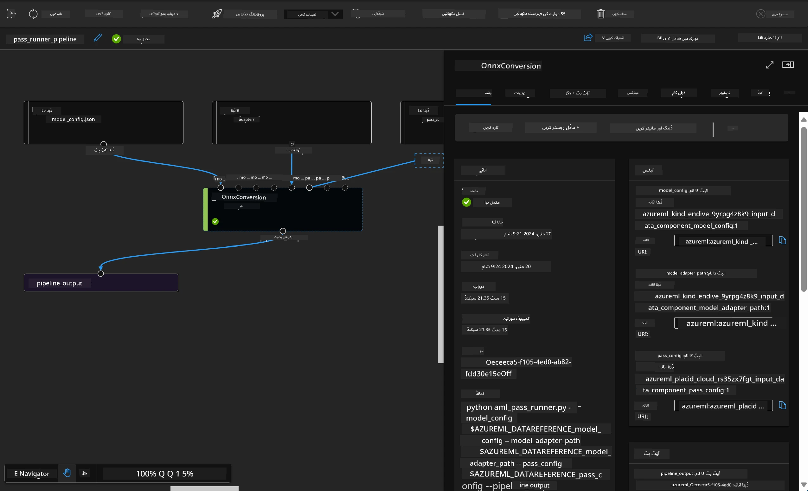

<!--
CO_OP_TRANSLATOR_METADATA:
{
  "original_hash": "7fe541373802e33568e94e13226d463c",
  "translation_date": "2025-07-17T09:35:02+00:00",
  "source_file": "md/03.FineTuning/Introduce_AzureML.md",
  "language_code": "ur"
}
-->
# **Azure Machine Learning سروس کا تعارف**

[Azure Machine Learning](https://ml.azure.com?WT.mc_id=aiml-138114-kinfeylo) ایک کلاؤڈ سروس ہے جو مشین لرننگ (ML) پروجیکٹ کے پورے عمل کو تیز اور منظم کرنے کے لیے استعمال ہوتی ہے۔

ML کے ماہرین، ڈیٹا سائنسدان، اور انجینئرز اسے اپنی روزمرہ کی ورک فلو میں استعمال کر سکتے ہیں تاکہ:

- ماڈلز کو تربیت دیں اور تعینات کریں۔
- مشین لرننگ آپریشنز (MLOps) کا انتظام کریں۔
- آپ Azure Machine Learning میں ماڈل بنا سکتے ہیں یا کسی اوپن سورس پلیٹ فارم جیسے PyTorch، TensorFlow، یا scikit-learn سے تیار کردہ ماڈل استعمال کر سکتے ہیں۔
- MLOps کے ٹولز آپ کو ماڈلز کی نگرانی، دوبارہ تربیت، اور دوبارہ تعیناتی میں مدد دیتے ہیں۔

## Azure Machine Learning کس کے لیے ہے؟

**ڈیٹا سائنسدان اور ML انجینئرز**

وہ اپنے روزمرہ کے کاموں کو تیز اور خودکار بنانے کے لیے ٹولز استعمال کر سکتے ہیں۔  
Azure ML انصاف، وضاحت، ٹریکنگ، اور آڈٹ کی خصوصیات فراہم کرتا ہے۔

**ایپلیکیشن ڈویلپرز:**  
وہ ماڈلز کو آسانی سے ایپلیکیشنز یا سروسز میں ضم کر سکتے ہیں۔

**پلیٹ فارم ڈویلپرز**

انہیں Azure Resource Manager APIs کی مضبوط بنیاد پر مبنی ٹولز تک رسائی حاصل ہے۔  
یہ ٹولز جدید ML ٹولنگ بنانے کی اجازت دیتے ہیں۔

**ادارے**

Microsoft Azure کلاؤڈ میں کام کرتے ہوئے، ادارے معروف سیکیورٹی اور رول بیسڈ ایکسیس کنٹرول سے فائدہ اٹھاتے ہیں۔  
پروجیکٹس سیٹ اپ کریں تاکہ محفوظ ڈیٹا اور مخصوص آپریشنز تک رسائی کو کنٹرول کیا جا سکے۔

## ٹیم کے ہر فرد کے لیے پیداواریت  
ML پروجیکٹس عموماً مختلف مہارتوں والی ٹیم کی ضرورت ہوتی ہے تاکہ وہ ماڈلز بنا سکیں اور ان کی دیکھ بھال کر سکیں۔

Azure ML ایسے ٹولز فراہم کرتا ہے جو آپ کو قابل بناتے ہیں کہ:  
- مشترکہ نوٹ بکس، کمپیوٹ وسائل، سرور لیس کمپیوٹ، ڈیٹا، اور ماحولیات کے ذریعے اپنی ٹیم کے ساتھ تعاون کریں۔  
- انصاف، وضاحت، ٹریکنگ، اور آڈٹ کی خصوصیات کے ساتھ ماڈلز تیار کریں تاکہ نسل اور آڈٹ کی تعمیل کی ضروریات پوری ہوں۔  
- ML ماڈلز کو تیزی سے اور آسانی سے بڑے پیمانے پر تعینات کریں، اور MLOps کے ذریعے ان کا مؤثر انتظام اور حکمرانی کریں۔  
- مشین لرننگ کے کام کہیں بھی چلائیں، اندرونی حکمرانی، سیکیورٹی، اور تعمیل کے ساتھ۔

## کراس-کمپیٹیبل پلیٹ فارم ٹولز

ML ٹیم کا کوئی بھی رکن اپنی پسندیدہ ٹولز استعمال کر کے کام مکمل کر سکتا ہے۔  
چاہے آپ تیز تجربات کر رہے ہوں، ہائپر پیرامیٹر ٹیوننگ کر رہے ہوں، پائپ لائنز بنا رہے ہوں، یا انفرنسز کا انتظام کر رہے ہوں، آپ درج ذیل مانوس انٹرفیس استعمال کر سکتے ہیں:  
- Azure Machine Learning Studio  
- Python SDK (v2)  
- Azure CLI (v2)  
- Azure Resource Manager REST APIs  

ماڈلز کو بہتر بنانے اور ترقی کے دوران تعاون کرتے ہوئے، آپ Azure Machine Learning اسٹوڈیو UI میں اثاثے، وسائل، اور میٹرکس شیئر اور تلاش کر سکتے ہیں۔

## **Azure ML میں LLM/SLM**

Azure ML نے بہت سے LLM/SLM سے متعلق فنکشنز شامل کیے ہیں، جو LLMOps اور SLMOps کو ملا کر ایک ادارہ جاتی سطح پر جنریٹو مصنوعی ذہانت کی ٹیکنالوجی پلیٹ فارم بناتے ہیں۔

### **ماڈل کیٹلاگ**

ادارہ جاتی صارفین مختلف کاروباری حالات کے مطابق مختلف ماڈلز کو Model Catalog کے ذریعے تعینات کر سکتے ہیں، اور ماڈل کو بطور سروس فراہم کر کے ادارہ جاتی ڈویلپرز یا صارفین کو رسائی دے سکتے ہیں۔

Azure Machine Learning اسٹوڈیو میں ماڈل کیٹلاگ ایک مرکز ہے جہاں آپ مختلف ماڈلز دریافت اور استعمال کر سکتے ہیں جو جنریٹو AI ایپلیکیشنز بنانے میں مدد دیتے ہیں۔ ماڈل کیٹلاگ میں Azure OpenAI سروس، Mistral، Meta، Cohere، Nvidia، Hugging Face جیسے ماڈل فراہم کنندگان کے سینکڑوں ماڈلز شامل ہیں، جن میں Microsoft کے تربیت یافتہ ماڈلز بھی شامل ہیں۔ Microsoft کے علاوہ دیگر فراہم کنندگان کے ماڈلز کو Non-Microsoft Products کہا جاتا ہے، جیسا کہ Microsoft کی Product Terms میں بیان کیا گیا ہے، اور یہ ماڈل کے ساتھ فراہم کردہ شرائط کے تابع ہوتے ہیں۔

### **جاب پائپ لائن**

مشین لرننگ پائپ لائن کا بنیادی مقصد ایک مکمل مشین لرننگ کام کو متعدد مراحل میں تقسیم کرنا ہے۔ ہر مرحلہ ایک قابل انتظام جزو ہوتا ہے جسے الگ الگ تیار، بہتر، ترتیب، اور خودکار بنایا جا سکتا ہے۔ مراحل کو واضح انٹرفیس کے ذریعے جوڑا جاتا ہے۔ Azure Machine Learning پائپ لائن سروس خود بخود تمام مراحل کے درمیان انحصار کو منظم کرتی ہے۔

SLM / LLM کی فائن ٹیوننگ میں، ہم اپنے ڈیٹا، تربیت، اور جنریشن کے عمل کو پائپ لائن کے ذریعے منظم کر سکتے ہیں۔

### **پرومپٹ فلو**

Azure Machine Learning پرومپٹ فلو کے استعمال کے فوائد  
Azure Machine Learning پرومپٹ فلو صارفین کو خیال سے تجربے اور آخرکار پروڈکشن کے لیے تیار LLM پر مبنی ایپلیکیشنز تک پہنچنے میں مدد دیتا ہے:

**پرومپٹ انجینئرنگ کی چستی**

انٹرایکٹو آتھرنگ تجربہ: Azure Machine Learning پرومپٹ فلو فلو کی ساخت کی بصری نمائندگی فراہم کرتا ہے، جس سے صارفین اپنے پروجیکٹس کو آسانی سے سمجھ اور نیویگیٹ کر سکتے ہیں۔ یہ نوٹ بک جیسا کوڈنگ تجربہ بھی فراہم کرتا ہے تاکہ فلو کی ترقی اور ڈیبگنگ مؤثر ہو۔  
پرومپٹ ٹیوننگ کے لیے مختلف ورژنز: صارفین متعدد پرومپٹ ورژنز بنا اور موازنہ کر سکتے ہیں، جو ایک تکراری بہتری کے عمل کو آسان بناتا ہے۔

تشخیص: بلٹ ان تشخیصی فلو صارفین کو اپنے پرومپٹس اور فلو کی معیار اور مؤثریت کا جائزہ لینے کی سہولت دیتا ہے۔

جامع وسائل: Azure Machine Learning پرومپٹ فلو میں بلٹ ان ٹولز، نمونے، اور ٹیمپلیٹس کی لائبریری شامل ہے جو ترقی کے لیے نقطہ آغاز فراہم کرتی ہے، تخلیقی صلاحیت کو بڑھاتی ہے اور عمل کو تیز کرتی ہے۔

**LLM پر مبنی ایپلیکیشنز کے لیے ادارہ جاتی تیاری**

تعاون: Azure Machine Learning پرومپٹ فلو ٹیم تعاون کی حمایت کرتا ہے، جس سے متعدد صارفین پرومپٹ انجینئرنگ پروجیکٹس پر مل کر کام کر سکتے ہیں، علم شیئر کر سکتے ہیں، اور ورژن کنٹرول برقرار رکھ سکتے ہیں۔

سب کچھ ایک پلیٹ فارم میں: Azure Machine Learning پرومپٹ فلو پورے پرومپٹ انجینئرنگ عمل کو آسان بناتا ہے، ترقی اور تشخیص سے لے کر تعیناتی اور نگرانی تک۔ صارفین آسانی سے اپنے فلو کو Azure Machine Learning اینڈ پوائنٹس کے طور پر تعینات کر سکتے ہیں اور حقیقی وقت میں ان کی کارکردگی کی نگرانی کر سکتے ہیں، تاکہ بہترین آپریشن اور مسلسل بہتری یقینی بنائی جا سکے۔

Azure Machine Learning Enterprise Readiness Solutions: پرومپٹ فلو Azure Machine Learning کی مضبوط ادارہ جاتی تیاری کے حل سے فائدہ اٹھاتا ہے، جو فلو کی ترقی، تجربہ کاری، اور تعیناتی کے لیے ایک محفوظ، قابل توسیع، اور قابل اعتماد بنیاد فراہم کرتا ہے۔

Azure Machine Learning پرومپٹ فلو کے ساتھ، صارفین اپنی پرومپٹ انجینئرنگ کی چستی کو آزاد کر سکتے ہیں، مؤثر تعاون کر سکتے ہیں، اور کامیاب LLM پر مبنی ایپلیکیشن کی ترقی اور تعیناتی کے لیے ادارہ جاتی معیار کے حل سے فائدہ اٹھا سکتے ہیں۔

Azure ML کی کمپیوٹنگ طاقت، ڈیٹا، اور مختلف اجزاء کو یکجا کرتے ہوئے، ادارہ جاتی ڈویلپرز آسانی سے اپنی مصنوعی ذہانت کی ایپلیکیشنز بنا سکتے ہیں۔

**دستخطی نوٹ**:  
یہ دستاویز AI ترجمہ سروس [Co-op Translator](https://github.com/Azure/co-op-translator) کے ذریعے ترجمہ کی گئی ہے۔ اگرچہ ہم درستگی کے لیے کوشاں ہیں، براہ کرم آگاہ رہیں کہ خودکار ترجمے میں غلطیاں یا عدم درستیاں ہو سکتی ہیں۔ اصل دستاویز اپنی مادری زبان میں ہی معتبر ماخذ سمجھی جانی چاہیے۔ اہم معلومات کے لیے پیشہ ور انسانی ترجمہ کی سفارش کی جاتی ہے۔ اس ترجمے کے استعمال سے پیدا ہونے والی کسی بھی غلط فہمی یا غلط تشریح کی ذمہ داری ہم پر عائد نہیں ہوتی۔