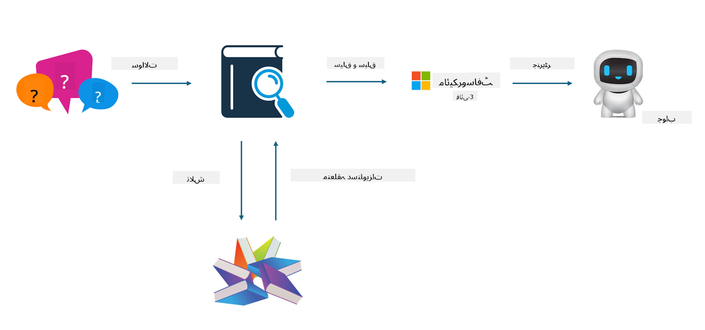
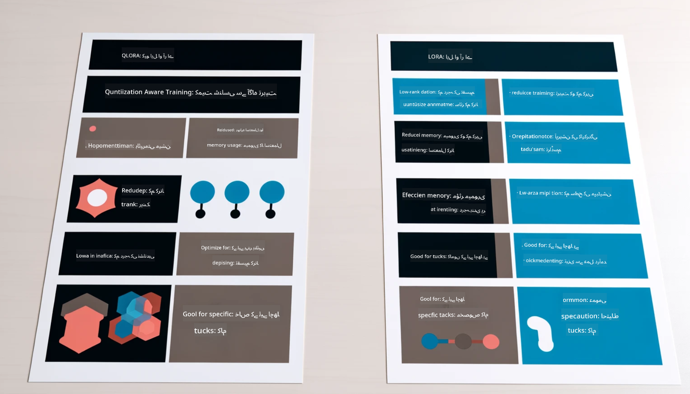

<!--
CO_OP_TRANSLATOR_METADATA:
{
  "original_hash": "743d7e9cb9c4e8ea642d77bee657a7fa",
  "translation_date": "2025-05-07T13:33:49+00:00",
  "source_file": "md/03.FineTuning/LetPhi3gotoIndustriy.md",
  "language_code": "ur"
}
-->
# **Phi-3 کو صنعت کا ماہر بنائیں**

Phi-3 ماڈل کو کسی صنعت میں شامل کرنے کے لیے، آپ کو صنعت کے کاروباری ڈیٹا کو Phi-3 ماڈل میں شامل کرنا ہوگا۔ ہمارے پاس دو مختلف اختیارات ہیں، پہلا RAG (Retrieval Augmented Generation) ہے اور دوسرا Fine Tuning ہے۔

## **RAG بمقابلہ Fine-Tuning**

### **Retrieval Augmented Generation**

RAG ڈیٹا بازیافت + متن کی تخلیق ہے۔ ادارے کا منظم اور غیر منظم ڈیٹا ویکٹر ڈیٹا بیس میں محفوظ کیا جاتا ہے۔ جب متعلقہ مواد تلاش کیا جاتا ہے، تو متعلقہ خلاصہ اور مواد مل کر ایک سیاق و سباق بناتے ہیں، اور LLM/SLM کی متن مکمل کرنے کی صلاحیت کے ساتھ مل کر مواد تیار کیا جاتا ہے۔

### **Fine-tuning**

Fine-tuning کسی خاص ماڈل کی بہتری پر مبنی ہے۔ اسے ماڈل الگورتھم سے شروع کرنے کی ضرورت نہیں ہوتی، لیکن ڈیٹا کو مسلسل جمع کرنا ضروری ہوتا ہے۔ اگر آپ صنعت کی درخواستوں میں زیادہ درست اصطلاحات اور زبان کے اظہار چاہتے ہیں، تو Fine-tuning آپ کے لیے بہتر انتخاب ہے۔ لیکن اگر آپ کا ڈیٹا بار بار بدلتا ہے، تو Fine-tuning پیچیدہ ہو سکتا ہے۔

### **چناؤ کا طریقہ**

1. اگر ہمارے جواب کے لیے بیرونی ڈیٹا کی ضرورت ہو تو RAG بہترین انتخاب ہے

2. اگر آپ کو مستحکم اور درست صنعتی علم کی ضرورت ہو تو Fine-tuning اچھا انتخاب ہوگا۔ RAG متعلقہ مواد کو ترجیح دیتا ہے لیکن ہمیشہ تخصصی باریکیوں کو مکمل طور پر نہیں پکڑ پاتا۔

3. Fine-tuning کوالٹی ڈیٹا سیٹ کا تقاضا کرتا ہے، اور اگر یہ صرف چھوٹے دائرے کا ڈیٹا ہو تو فرق زیادہ نہیں آئے گا۔ RAG زیادہ لچکدار ہے۔

4. Fine-tuning ایک بلیک باکس ہے، ایک مابعد الطبیعیات ہے، اور اس کے اندرونی میکانزم کو سمجھنا مشکل ہے۔ لیکن RAG ڈیٹا کے ماخذ کو تلاش کرنا آسان بناتا ہے، جس سے ہیلوسینیشنز یا مواد کی غلطیوں کو مؤثر طریقے سے درست کرنا اور بہتر شفافیت فراہم کرنا ممکن ہوتا ہے۔

### **مناظر**

1. عمودی صنعتوں کو مخصوص پیشہ ورانہ الفاظ اور اظہار کی ضرورت ہوتی ہے، ***Fine-tuning*** بہترین انتخاب ہوگا۔

2. QA سسٹم، جو مختلف علمی نکات کی ترکیب پر مشتمل ہے، ***RAG*** بہترین انتخاب ہوگا۔

3. خودکار کاروباری بہاؤ کے امتزاج کے لیے ***RAG + Fine-tuning*** بہترین انتخاب ہے۔

## **RAG کا استعمال کیسے کریں**

ویکٹر ڈیٹا بیس وہ ڈیٹا کا مجموعہ ہے جو ریاضیاتی شکل میں محفوظ ہوتا ہے۔ ویکٹر ڈیٹا بیس مشین لرننگ ماڈلز کے لیے پچھلے ان پٹس کو یاد رکھنا آسان بناتا ہے، جس سے سرچ، سفارشات، اور متن کی تخلیق جیسے استعمال کے معاملات کی حمایت کے لیے مشین لرننگ کا استعمال ممکن ہوتا ہے۔ ڈیٹا کی شناخت مماثلت میٹرکس کی بنیاد پر کی جا سکتی ہے نہ کہ بالکل میل کھانے پر، جس سے کمپیوٹر ماڈلز کو ڈیٹا کے سیاق و سباق کو سمجھنے میں مدد ملتی ہے۔

ویکٹر ڈیٹا بیس RAG کو عملی جامہ پہنانے کی کلید ہے۔ ہم text-embedding-3، jina-ai-embedding جیسے ویکٹر ماڈلز کے ذریعے ڈیٹا کو ویکٹر اسٹوریج میں تبدیل کر سکتے ہیں۔

RAG ایپلیکیشن بنانے کے بارے میں مزید جانیں [https://github.com/microsoft/Phi-3CookBook](https://github.com/microsoft/Phi-3CookBook?WT.mc_id=aiml-138114-kinfeylo) 

## **Fine-tuning کا استعمال کیسے کریں**

Fine-tuning میں عام طور پر استعمال ہونے والے الگورتھمز Lora اور QLora ہیں۔ انتخاب کیسے کریں؟
- [اس سیمپل نوٹ بک کے ساتھ مزید جانیں](../../../../code/04.Finetuning/Phi_3_Inference_Finetuning.ipynb)
- [Python FineTuning سیمپل کی مثال](../../../../code/04.Finetuning/FineTrainingScript.py)

### **Lora اور QLora**

LoRA (Low-Rank Adaptation) اور QLoRA (Quantized Low-Rank Adaptation) دونوں تکنیکیں ہیں جو Parameter Efficient Fine Tuning (PEFT) کا استعمال کرتے ہوئے بڑے زبان کے ماڈلز (LLMs) کو fine-tune کرنے کے لیے استعمال ہوتی ہیں۔ PEFT تکنیکیں روایتی طریقوں کے مقابلے میں ماڈلز کو زیادہ مؤثر طریقے سے تربیت دینے کے لیے ڈیزائن کی گئی ہیں۔  
LoRA ایک آزاد fine-tuning تکنیک ہے جو وزن اپ ڈیٹ میٹرکس پر کم رینک اپروکسیمیشن لگا کر میموری کی کھپت کو کم کرتی ہے۔ یہ تیز تربیت کے اوقات فراہم کرتی ہے اور روایتی fine-tuning طریقوں کے قریب کارکردگی برقرار رکھتی ہے۔

QLoRA LoRA کا ایک توسیعی ورژن ہے جو میموری کے استعمال کو مزید کم کرنے کے لیے quantization تکنیکوں کو شامل کرتا ہے۔ QLoRA پری ٹرینڈ LLM میں وزن کے پیرامیٹرز کی درستگی کو 4-bit precision تک quantize کرتا ہے، جو LoRA کے مقابلے میں زیادہ میموری مؤثر ہے۔ تاہم، اضافی quantization اور dequantization مراحل کی وجہ سے QLoRA کی تربیت LoRA کے مقابلے میں تقریباً 30% سست ہوتی ہے۔

QLoRA quantization کی غلطیوں کو درست کرنے کے لیے LoRA کو ایک اضافی آلہ کے طور پر استعمال کرتا ہے۔ QLoRA بڑے پیمانے پر ماڈلز کو جو اربوں پیرامیٹرز پر مشتمل ہوتے ہیں، نسبتا چھوٹے اور دستیاب GPUs پر fine-tune کرنے کے قابل بناتا ہے۔ مثال کے طور پر، QLoRA 70B پیرامیٹر ماڈل کو fine-tune کر سکتا ہے جس کے لیے 36 GPUs کی ضرورت ہوتی ہے لیکن صرف 2

**ڈسکلیمر**:  
یہ دستاویز AI ترجمہ سروس [Co-op Translator](https://github.com/Azure/co-op-translator) کے ذریعے ترجمہ کی گئی ہے۔ اگرچہ ہم درستگی کے لیے کوشاں ہیں، براہ کرم آگاہ رہیں کہ خودکار ترجموں میں غلطیاں یا عدم صحت ہو سکتی ہے۔ اصل دستاویز اپنی مادری زبان میں معتبر ماخذ سمجھی جانی چاہیے۔ اہم معلومات کے لیے پیشہ ورانہ انسانی ترجمہ تجویز کیا جاتا ہے۔ ہم اس ترجمے کے استعمال سے پیدا ہونے والی کسی بھی غلط فہمی یا غلط تشریح کے ذمہ دار نہیں ہیں۔