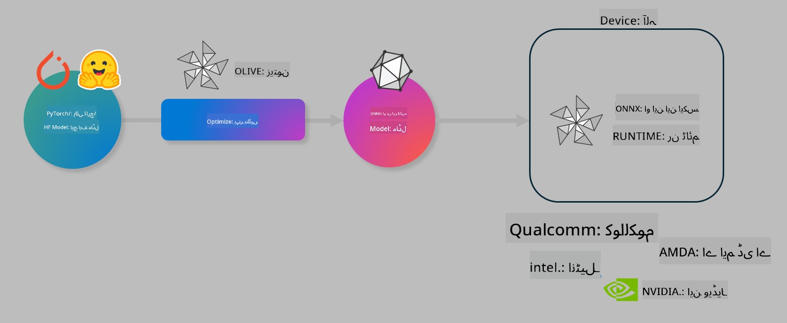

<!--
CO_OP_TRANSLATOR_METADATA:
{
  "original_hash": "6bbe47de3b974df7eea29dfeccf6032b",
  "translation_date": "2025-05-07T13:39:54+00:00",
  "source_file": "md/03.FineTuning/olive-lab/readme.md",
  "language_code": "ur"
}
-->
# لیب۔ آن ڈیوائس انفرنس کے لیے AI ماڈلز کو بہتر بنائیں

## تعارف

> [!IMPORTANT]
> اس لیب کے لیے **Nvidia A10 یا A100 GPU** درکار ہے جس کے ساتھ متعلقہ ڈرائیورز اور CUDA ٹول کٹ (ورژن 12+) انسٹال ہوں۔

> [!NOTE]
> یہ ایک **35 منٹ** کی لیب ہے جو آپ کو OLIVE کے ذریعے آن ڈیوائس انفرنس کے لیے ماڈلز کو بہتر بنانے کے بنیادی تصورات کا عملی تعارف فراہم کرے گی۔

## سیکھنے کے مقاصد

اس لیب کے اختتام پر، آپ OLIVE استعمال کر سکیں گے تاکہ:

- AWQ کوانٹائزیشن طریقہ کار کے ذریعے AI ماڈل کو کوانٹائز کریں۔
- کسی مخصوص کام کے لیے AI ماڈل کو فائن ٹیون کریں۔
- ONNX رن ٹائم پر مؤثر آن ڈیوائس انفرنس کے لیے LoRA اڈاپٹرز (فائن ٹیون شدہ ماڈل) تیار کریں۔

### Olive کیا ہے

Olive (*O*NNX *live*) ایک ماڈل آپٹیمائزیشن ٹول کٹ ہے جس کے ساتھ CLI بھی آتا ہے جو آپ کو ONNX رن ٹائم +++https://onnxruntime.ai+++ کے لیے معیاری اور کارکردگی والے ماڈلز بھیجنے کی سہولت دیتا ہے۔



Olive میں عام طور پر ان پٹ PyTorch یا Hugging Face ماڈل ہوتا ہے اور آؤٹ پٹ ایک بہتر بنایا گیا ONNX ماڈل ہوتا ہے جو ڈیوائس (ڈیپلائمنٹ ٹارگٹ) پر چلتا ہے جو ONNX رن ٹائم استعمال کر رہا ہوتا ہے۔ Olive ماڈل کو ڈیپلائمنٹ ٹارگٹ کے AI ایکسلریٹر (NPU, GPU, CPU) کے لیے بہتر بناتا ہے، جو Qualcomm، AMD، Nvidia یا Intel جیسے ہارڈویئر وینڈر فراہم کرتے ہیں۔

Olive ایک *ورک فلو* چلاتا ہے، جو ماڈل آپٹیمائزیشن کے انفرادی کاموں کی ترتیب وار فہرست ہوتی ہے جنہیں *پاسز* کہتے ہیں - مثال کے طور پر: ماڈل کمپریشن، گراف کیپچر، کوانٹائزیشن، گراف آپٹیمائزیشن۔ ہر پاس کے پیرامیٹرز ہوتے ہیں جنہیں بہترین میٹرکس جیسے درستگی اور تاخیر کے لیے ٹیون کیا جا سکتا ہے، جنہیں متعلقہ ایویلیوایٹر سے جانچا جاتا ہے۔ Olive ایک سرچ اسٹریٹجی استعمال کرتا ہے جو ہر پاس کو ایک ایک کر کے یا پاسز کے سیٹ کو خودکار طریقے سے ٹیون کرنے کے لیے سرچ الگورتھم کا استعمال کرتی ہے۔

#### Olive کے فوائد

- گراف آپٹیمائزیشن، کمپریشن اور کوانٹائزیشن کی مختلف تکنیکوں کے ساتھ آزمائش اور غلطی کے تجربات میں **وقت اور پریشانی کو کم کریں**۔ اپنی کوالٹی اور کارکردگی کی حدود مقرر کریں اور Olive خود بخود بہترین ماڈل تلاش کرے گا۔
- کوانٹائزیشن، کمپریشن، گراف آپٹیمائزیشن اور فائن ٹیوننگ میں جدید تکنیکوں کو شامل کرنے والے **40+ بلٹ ان ماڈل آپٹیمائزیشن کمپونینٹس**۔
- عام ماڈل آپٹیمائزیشن کاموں کے لیے **آسان CLI**۔ مثلاً، olive quantize, olive auto-opt, olive finetune۔
- ماڈل پیکیجنگ اور ڈیپلائمنٹ بلٹ ان۔
- **Multi LoRA سروسنگ** کے لیے ماڈلز کی تیاری کی حمایت۔
- YAML/JSON استعمال کر کے ورک فلو بنانے کی سہولت تاکہ ماڈل آپٹیمائزیشن اور ڈیپلائمنٹ کے کاموں کو منظم کیا جا سکے۔
- **Hugging Face** اور **Azure AI** انٹیگریشن۔
- **کیشنگ** کا بلٹ ان میکانزم تاکہ **اخراجات کی بچت** ہو۔

## لیب ہدایات
> [!NOTE]
> براہ کرم یقینی بنائیں کہ آپ نے اپنا Azure AI Hub اور پروجیکٹ تیار کر لیا ہے اور Lab 1 کے مطابق A100 کمپیوٹ سیٹ اپ کر لیا ہے۔

### مرحلہ 0: اپنے Azure AI کمپیوٹ سے کنیکٹ ہوں

آپ **VS Code** میں ریموٹ فیچر استعمال کرتے ہوئے Azure AI کمپیوٹ سے کنیکٹ کریں گے۔

1. اپنا **VS Code** ڈیسک ٹاپ ایپلیکیشن کھولیں:
1. **Shift+Ctrl+P** دبا کر **کمانڈ پیلیٹ** کھولیں۔
1. کمانڈ پیلیٹ میں تلاش کریں **AzureML - remote: Connect to compute instance in New Window**۔
1. آن اسکرین ہدایات پر عمل کرتے ہوئے کمپیوٹ سے کنیکٹ ہوں۔ اس میں آپ کا Azure سبسکرپشن، ریسورس گروپ، پروجیکٹ اور کمپیوٹ نام منتخب کرنا شامل ہوگا جو آپ نے Lab 1 میں سیٹ کیا تھا۔
1. جب آپ Azure ML کمپیوٹ نوڈ سے کنیکٹ ہو جائیں گے تو یہ **Visual Code کے نیچے بائیں جانب** دکھائی دے گا۔ `><Azure ML: Compute Name`

### مرحلہ 1: اس ریپو کو کلون کریں

VS Code میں، **Ctrl+J** دبا کر نیا ٹرمینل کھولیں اور اس ریپو کو کلون کریں:

ٹرمینل میں آپ کو پرامپٹ نظر آئے گا

```
azureuser@computername:~/cloudfiles/code$ 
```
حل کلون کریں

```bash
cd ~/localfiles
git clone https://github.com/microsoft/phi-3cookbook.git
```

### مرحلہ 2: VS Code میں فولڈر کھولیں

ٹرمینل میں درج ذیل کمانڈ چلائیں تاکہ VS Code متعلقہ فولڈر میں کھلے اور نئی ونڈو کھولے:

```bash
code phi-3cookbook/code/04.Finetuning/Olive-lab
```

یا پھر **File** > **Open Folder** منتخب کر کے فولڈر کھول سکتے ہیں۔

### مرحلہ 3: انحصارات

VS Code میں اپنے Azure AI کمپیوٹ انسٹینس میں ٹرمینل کھولیں (اشارہ: **Ctrl+J**) اور انحصارات انسٹال کرنے کے لیے درج ذیل کمانڈز چلائیں:

```bash
conda create -n olive-ai python=3.11 -y
conda activate olive-ai
pip install -r requirements.txt
az extension remove -n azure-cli-ml
az extension add -n ml
```

> [!NOTE]
> تمام انحصارات انسٹال ہونے میں تقریباً 5 منٹ لگیں گے۔

اس لیب میں آپ ماڈلز کو Azure AI ماڈل کیٹلاگ سے ڈاؤن لوڈ اور اپلوڈ کریں گے۔ ماڈل کیٹلاگ تک رسائی کے لیے آپ کو Azure میں لاگ ان کرنا ہوگا:

```bash
az login
```

> [!NOTE]
> لاگ ان کے وقت آپ سے سبسکرپشن منتخب کرنے کو کہا جائے گا۔ اس بات کو یقینی بنائیں کہ آپ اس لیب کے لیے دی گئی سبسکرپشن منتخب کریں۔

### مرحلہ 4: Olive کمانڈز چلائیں

VS Code میں اپنے Azure AI کمپیوٹ انسٹینس کے ٹرمینل میں `olive-ai` کنڈا ماحول کو فعال کریں:

```bash
conda activate olive-ai
```

پھر درج ذیل Olive کمانڈز کمانڈ لائن میں چلائیں۔

1. **ڈیٹا کا معائنہ کریں:** اس مثال میں، آپ Phi-3.5-Mini ماڈل کو فائن ٹیون کریں گے تاکہ یہ سفر سے متعلق سوالات کے جواب دینے میں مہارت حاصل کر لے۔ نیچے دیا گیا کوڈ ڈیٹاسیٹ کے چند ابتدائی ریکارڈز دکھاتا ہے، جو JSON لائنز فارمیٹ میں ہیں:

    ```bash
    head data/data_sample_travel.jsonl
    ```
1. **ماڈل کو کوانٹائز کریں:** ماڈل کی تربیت سے پہلے، آپ درج ذیل کمانڈ کے ذریعے AWQ (Active Aware Quantization) تکنیک استعمال کرتے ہوئے کوانٹائز کریں گے +++https://arxiv.org/abs/2306.00978+++. AWQ ماڈل کے وزنوں کو اس طرح کوانٹائز کرتا ہے کہ انفرنس کے دوران پیدا ہونے والی ایکٹیویشنز کو مدنظر رکھا جاتا ہے۔ اس کا مطلب ہے کہ کوانٹائزیشن کا عمل ایکٹیویشنز میں حقیقی ڈیٹا کی تقسیم کو شامل کرتا ہے، جس سے روایتی وزن کوانٹائزیشن کے مقابلے میں ماڈل کی درستگی بہتر برقرار رہتی ہے۔

    ```bash
    olive quantize \
       --model_name_or_path microsoft/Phi-3.5-mini-instruct \
       --trust_remote_code \
       --algorithm awq \
       --output_path models/phi/awq \
       --log_level 1
    ```

    AWQ کوانٹائزیشن مکمل ہونے میں **تقریباً 8 منٹ** لگتے ہیں، جو ماڈل کا سائز **تقریباً 7.5GB سے 2.5GB تک کم کر دیتا ہے**۔

    اس لیب میں ہم آپ کو دکھا رہے ہیں کہ Hugging Face سے ماڈلز کیسے ان پٹ کیے جاتے ہیں (مثال کے طور پر: `microsoft/Phi-3.5-mini-instruct`). However, Olive also allows you to input models from the Azure AI catalog by updating the `model_name_or_path` argument to an Azure AI asset ID (for example:  `azureml://registries/azureml/models/Phi-3.5-mini-instruct/versions/4`). 

1. **Train the model:** Next, the `olive finetune` کمانڈ کوانٹائزڈ ماڈل کو فائن ٹیون کرتی ہے۔ کوانٹائزیشن کے بعد نہیں بلکہ فائن ٹیوننگ سے پہلے کوانٹائز کرنے سے بہتر درستگی حاصل ہوتی ہے کیونکہ فائن ٹیوننگ کوانٹائزیشن سے ہونے والے نقصان کو جزوی طور پر بحال کر دیتی ہے۔

    ```bash
    olive finetune \
        --method lora \
        --model_name_or_path models/phi/awq \
        --data_files "data/data_sample_travel.jsonl" \
        --data_name "json" \
        --text_template "<|user|>\n{prompt}<|end|>\n<|assistant|>\n{response}<|end|>" \
        --max_steps 100 \
        --output_path ./models/phi/ft \
        --log_level 1
    ```

    فائن ٹیوننگ مکمل ہونے میں **تقریباً 6 منٹ** لگتے ہیں (100 مراحل کے ساتھ)۔

1. **بہتری کریں:** ماڈل کی تربیت کے بعد، آپ Olive کے `auto-opt` command, which will capture the ONNX graph and automatically perform a number of optimizations to improve the model performance for CPU by compressing the model and doing fusions. It should be noted, that you can also optimize for other devices such as NPU or GPU by just updating the `--device` and `--provider` دلائل استعمال کرتے ہوئے ماڈل کو بہتر بنائیں گے - لیکن اس لیب کے لیے ہم CPU استعمال کریں گے۔

    ```bash
    olive auto-opt \
       --model_name_or_path models/phi/ft/model \
       --adapter_path models/phi/ft/adapter \
       --device cpu \
       --provider CPUExecutionProvider \
       --use_ort_genai \
       --output_path models/phi/onnx-ao \
       --log_level 1
    ```

    آپٹیمائزیشن مکمل ہونے میں **تقریباً 5 منٹ** لگتے ہیں۔

### مرحلہ 5: ماڈل انفرنس کا فوری ٹیسٹ

ماڈل کا انفرنس ٹیسٹ کرنے کے لیے، اپنے فولڈر میں **app.py** نامی پائتھن فائل بنائیں اور درج ذیل کوڈ کاپی پیسٹ کریں:

```python
import onnxruntime_genai as og
import numpy as np

print("loading model and adapters...", end="", flush=True)
model = og.Model("models/phi/onnx-ao/model")
adapters = og.Adapters(model)
adapters.load("models/phi/onnx-ao/model/adapter_weights.onnx_adapter", "travel")
print("DONE!")

tokenizer = og.Tokenizer(model)
tokenizer_stream = tokenizer.create_stream()

params = og.GeneratorParams(model)
params.set_search_options(max_length=100, past_present_share_buffer=False)
user_input = "what is the best thing to see in chicago"
params.input_ids = tokenizer.encode(f"<|user|>\n{user_input}<|end|>\n<|assistant|>\n")

generator = og.Generator(model, params)

generator.set_active_adapter(adapters, "travel")

print(f"{user_input}")

while not generator.is_done():
    generator.compute_logits()
    generator.generate_next_token()

    new_token = generator.get_next_tokens()[0]
    print(tokenizer_stream.decode(new_token), end='', flush=True)

print("\n")
```

کوڈ چلائیں:

```bash
python app.py
```

### مرحلہ 6: ماڈل کو Azure AI پر اپلوڈ کریں

ماڈل کو Azure AI ماڈل ریپوزیٹری میں اپلوڈ کرنے سے آپ کی ٹیم کے دیگر ارکان کے ساتھ ماڈل شیئر کرنا آسان ہو جاتا ہے اور ماڈل کا ورژن کنٹرول بھی سنبھالا جاتا ہے۔ ماڈل اپلوڈ کرنے کے لیے درج ذیل کمانڈ چلائیں:

> [!NOTE]
> `{}` placeholders with the name of your resource group and Azure AI Project Name. 

To find your resource group `` میں "resourceGroup" اور Azure AI پروجیکٹ کا نام اپ ڈیٹ کریں، پھر درج ذیل کمانڈ چلائیں:

```
az ml workspace show
```

یا +++ai.azure.com+++ پر جا کر **management center** > **project** > **overview** منتخب کریں۔

`{}` پلیس ہولڈرز کو اپنے ریسورس گروپ اور Azure AI پروجیکٹ کے نام سے تبدیل کریں۔

```bash
az ml model create \
    --name ft-for-travel \
    --version 1 \
    --path ./models/phi/onnx-ao \
    --resource-group {RESOURCE_GROUP_NAME} \
    --workspace-name {PROJECT_NAME}
```

آپ اپلوڈ شدہ ماڈل کو https://ml.azure.com/model/list پر دیکھ سکتے ہیں اور اسے ڈیپلائے کر سکتے ہیں۔

**دستخطی اطلاع**:  
یہ دستاویز AI ترجمہ سروس [Co-op Translator](https://github.com/Azure/co-op-translator) کے ذریعے ترجمہ کی گئی ہے۔ اگرچہ ہم درستگی کے لیے کوشاں ہیں، براہ کرم یاد رکھیں کہ خودکار ترجمے میں غلطیاں یا بے ضابطگیاں ہو سکتی ہیں۔ اصل دستاویز اپنی مادری زبان میں ہی معتبر ماخذ سمجھی جانی چاہیے۔ اہم معلومات کے لیے پیشہ ور انسانی ترجمہ کی سفارش کی جاتی ہے۔ اس ترجمے کے استعمال سے پیدا ہونے والی کسی بھی غلط فہمی یا غلط تشریح کی ذمہ داری ہم پر عائد نہیں ہوگی۔