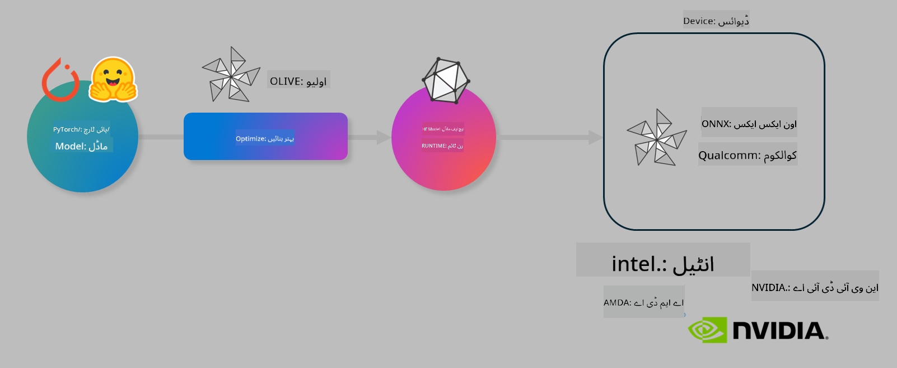

<!--
CO_OP_TRANSLATOR_METADATA:
{
  "original_hash": "76956c0c22e5686908a6d85ec72126af",
  "translation_date": "2025-04-03T08:29:03+00:00",
  "source_file": "md\\03.FineTuning\\olive-lab\\readme.md",
  "language_code": "ur"
}
-->
# لیب: AI ماڈلز کو ڈیوائس پر انفرنس کے لیے بہتر بنائیں

## تعارف 

> [!IMPORTANT]
> اس لیب کے لیے **Nvidia A10 یا A100 GPU** درکار ہے، جس کے ساتھ متعلقہ ڈرائیورز اور CUDA ٹول کٹ (ورژن 12+) انسٹال ہونا ضروری ہے۔

> [!NOTE]
> یہ ایک **35 منٹ کا** لیب ہے جو آپ کو OLIVE استعمال کرتے ہوئے ماڈلز کو ڈیوائس پر انفرنس کے لیے بہتر بنانے کے بنیادی تصورات کا عملی تعارف فراہم کرے گا۔

## سیکھنے کے اہداف

اس لیب کے اختتام تک، آپ OLIVE کا استعمال کرتے ہوئے درج ذیل کام کرنے کے قابل ہوں گے:

- AWQ کوانٹائزیشن طریقہ استعمال کرتے ہوئے AI ماڈل کو کوانٹائز کریں۔
- AI ماڈل کو کسی خاص کام کے لیے فائن ٹیون کریں۔
- LoRA اڈاپٹرز (فائن ٹیون شدہ ماڈل) ONNX Runtime پر مؤثر ڈیوائس انفرنس کے لیے تیار کریں۔

### اولیو کیا ہے؟

اولیو (*O*NNX *live*) ایک ماڈل آپٹیمائزیشن ٹول کٹ ہے، جس کے ساتھ CLI موجود ہے جو آپ کو ONNX runtime +++https://onnxruntime.ai+++ کے لیے ماڈلز تیار کرنے کی سہولت دیتا ہے۔



اولیو کا ان پٹ عام طور پر PyTorch یا Hugging Face ماڈل ہوتا ہے، اور آؤٹ پٹ ایک بہتر بنایا ہوا ONNX ماڈل ہوتا ہے جو ONNX runtime پر چلنے والے ڈیوائس (ڈیپلائمنٹ ٹارگٹ) پر چلایا جاتا ہے۔ اولیو ماڈل کو ہارڈویئر وینڈر جیسے Qualcomm، AMD، Nvidia یا Intel کے فراہم کردہ AI ایکسیلریٹر (NPU، GPU، CPU) کے لیے بہتر بناتا ہے۔

اولیو ایک *ورک فلو* انجام دیتا ہے، جو انفرادی ماڈل آپٹیمائزیشن ٹاسکس کی ترتیب شدہ سیریز ہوتی ہے جسے *پاسز* کہا جاتا ہے۔ مثال کے طور پر: ماڈل کمپریشن، گراف کیپچر، کوانٹائزیشن، گراف آپٹیمائزیشن۔ ہر پاس کے پیرامیٹرز ہوتے ہیں جنہیں بہترین میٹرکس، جیسے کہ درستگی اور لیٹنسی، حاصل کرنے کے لیے ٹیون کیا جا سکتا ہے۔ اولیو ایک سرچ اسٹریٹیجی استعمال کرتا ہے جو سرچ الگورتھم کے ذریعے ہر پاس کو ایک ایک کرکے یا کئی پاسز کو اکٹھا آٹو ٹیون کرتا ہے۔

#### اولیو کے فوائد

- گراف آپٹیمائزیشن، کمپریشن اور کوانٹائزیشن کے مختلف طریقوں کے ساتھ آزمائش اور غلطی کی **مایوسی اور وقت کو کم کریں**۔ اپنی کوالٹی اور پرفارمنس کی حدود مقرر کریں اور اولیو کو خود بخود آپ کے لیے بہترین ماڈل تلاش کرنے دیں۔
- **40+ بلٹ ان ماڈل آپٹیمائزیشن کمپوننٹس** جو کوانٹائزیشن، کمپریشن، گراف آپٹیمائزیشن اور فائن ٹیوننگ میں جدید ترین تکنیکوں کا احاطہ کرتے ہیں۔
- عام ماڈل آپٹیمائزیشن ٹاسکس کے لیے **استعمال میں آسان CLI**۔ مثال کے طور پر، olive quantize، olive auto-opt، olive finetune۔
- ماڈل پیکجنگ اور ڈیپلائمنٹ بلٹ ان۔
- **Multi LoRA سروِنگ** کے لیے ماڈلز تیار کرنے کی حمایت کرتا ہے۔
- YAML/JSON استعمال کرتے ہوئے ورک فلو بنائیں تاکہ ماڈل آپٹیمائزیشن اور ڈیپلائمنٹ ٹاسکس کو آرکیسٹریٹ کریں۔
- **Hugging Face** اور **Azure AI** انٹیگریشن۔
- **کیشنگ** کا بلٹ ان میکانزم جو **اخراجات بچاتا ہے۔**

## لیب ہدایات
> [!NOTE]
> براہ کرم یقینی بنائیں کہ آپ نے اپنی Azure AI Hub اور پروجیکٹ کو پروویژن کیا ہے اور اپنی A100 کمپیوٹ کو لیب 1 کے مطابق سیٹ اپ کیا ہے۔

### مرحلہ 0: Azure AI Compute سے کنیکٹ کریں

آپ **VS Code** کے ریموٹ فیچر کا استعمال کرتے ہوئے Azure AI کمپیوٹ سے کنیکٹ کریں گے۔

1. اپنی **VS Code** ڈیسک ٹاپ ایپلیکیشن کھولیں:
1. **Shift+Ctrl+P** استعمال کرتے ہوئے **کمانڈ پیلیٹ** کھولیں۔
1. کمانڈ پیلیٹ میں **AzureML - remote: Connect to compute instance in New Window** تلاش کریں۔
1. کمپیوٹ سے کنیکٹ کرنے کے لیے اسکرین پر دی گئی ہدایات پر عمل کریں۔ اس میں آپ کے Azure سبسکرپشن، ریسورس گروپ، پروجیکٹ اور کمپیوٹ نام کا انتخاب شامل ہوگا جو آپ نے لیب 1 میں سیٹ اپ کیا تھا۔
1. ایک بار جب آپ Azure ML Compute نوڈ سے کنیکٹ ہو جائیں، تو یہ **Visual Code کے نیچے بائیں جانب** دکھایا جائے گا `><Azure ML: Compute Name`

### مرحلہ 1: اس ریپو کو کلون کریں

VS Code میں، آپ **Ctrl+J** استعمال کرتے ہوئے ایک نیا ٹرمینل کھول سکتے ہیں اور اس ریپو کو کلون کریں:

ٹرمینل میں آپ کو پرامپٹ نظر آئے گا

```
azureuser@computername:~/cloudfiles/code$ 
```
حل کلون کریں 

```bash
cd ~/localfiles
git clone https://github.com/microsoft/phi-3cookbook.git
```

### مرحلہ 2: فولڈر کو VS Code میں کھولیں

متعلقہ فولڈر میں VS Code کھولنے کے لیے ٹرمینل میں درج ذیل کمانڈ چلائیں، جو ایک نئی ونڈو کھولے گی:

```bash
code phi-3cookbook/code/04.Finetuning/Olive-lab
```

متبادل کے طور پر، آپ فولڈر کو **File** > **Open Folder** منتخب کرکے کھول سکتے ہیں۔

### مرحلہ 3: ڈیپینڈنسیز

Azure AI Compute Instance میں VS Code میں ایک ٹرمینل ونڈو کھولیں (ٹپ: **Ctrl+J**) اور درج ذیل کمانڈز چلائیں تاکہ ڈیپینڈنسیز انسٹال کی جا سکیں:

```bash
conda create -n olive-ai python=3.11 -y
conda activate olive-ai
pip install -r requirements.txt
az extension remove -n azure-cli-ml
az extension add -n ml
```

> [!NOTE]
> تمام ڈیپینڈنسیز انسٹال کرنے میں **تقریباً 5 منٹ** لگیں گے۔

اس لیب میں آپ ماڈلز کو Azure AI Model catalog میں ڈاؤن لوڈ اور اپلوڈ کریں گے۔ تاکہ آپ ماڈل کیٹلاگ تک رسائی حاصل کر سکیں، آپ کو Azure میں لاگ ان کرنے کی ضرورت ہوگی:

```bash
az login
```

> [!NOTE]
> لاگ ان کے وقت آپ سے اپنی سبسکرپشن منتخب کرنے کو کہا جائے گا۔ براہ کرم یقینی بنائیں کہ آپ نے اس لیب کے لیے فراہم کردہ سبسکرپشن منتخب کی ہے۔

### مرحلہ 4: اولیو کمانڈز چلائیں 

Azure AI Compute Instance میں VS Code میں ایک ٹرمینل ونڈو کھولیں (ٹپ: **Ctrl+J**) اور یقینی بنائیں کہ `olive-ai` کونڈا ماحول ایکٹیویٹ ہے:

```bash
conda activate olive-ai
```

اس کے بعد، درج ذیل اولیو کمانڈز کمانڈ لائن میں چلائیں۔

1. **ڈیٹا کا معائنہ کریں:** اس مثال میں، آپ Phi-3.5-Mini ماڈل کو فائن ٹیون کریں گے تاکہ یہ سفر سے متعلق سوالات کے جواب دینے میں مہارت حاصل کرے۔ درج ذیل کوڈ ڈیٹا سیٹ کے پہلے چند ریکارڈز کو ظاہر کرتا ہے، جو JSON لائنز فارمیٹ میں ہیں:
   
    ```bash
    head data/data_sample_travel.jsonl
    ```
1. **ماڈل کو کوانٹائز کریں:** ماڈل کی ٹریننگ سے پہلے، آپ درج ذیل کمانڈ کے ساتھ کوانٹائز کریں گے جو Active Aware Quantization (AWQ) تکنیک استعمال کرتی ہے +++https://arxiv.org/abs/2306.00978+++. AWQ ماڈل کے ویٹس کو انفرینس کے دوران پیدا ہونے والی ایکٹیویشنز کو مدنظر رکھتے ہوئے کوانٹائز کرتا ہے۔ اس کا مطلب ہے کہ کوانٹائزیشن پراسیس ایکٹیویشنز میں اصل ڈیٹا ڈسٹریبیوشن کو مدنظر رکھتا ہے، جس سے روایتی ویٹ کوانٹائزیشن طریقوں کے مقابلے میں ماڈل کی درستگی بہتر طور پر محفوظ رہتی ہے۔
    
    ```bash
    olive quantize \
       --model_name_or_path microsoft/Phi-3.5-mini-instruct \
       --trust_remote_code \
       --algorithm awq \
       --output_path models/phi/awq \
       --log_level 1
    ```
    
    AWQ کوانٹائزیشن مکمل ہونے میں **تقریباً 8 منٹ** لگتے ہیں، جو ماڈل کے سائز کو **~7.5GB سے ~2.5GB** تک کم کر دے گا۔
   
   اس لیب میں، ہم آپ کو دکھا رہے ہیں کہ Hugging Face سے ماڈلز کو انپٹ کیسے کریں (مثال کے طور پر: `microsoft/Phi-3.5-mini-instruct`). However, Olive also allows you to input models from the Azure AI catalog by updating the `model_name_or_path` argument to an Azure AI asset ID (for example:  `azureml://registries/azureml/models/Phi-3.5-mini-instruct/versions/4`). 

1. **Train the model:** Next, the `olive finetune` کمانڈ کوانٹائزڈ ماڈل کو فائن ٹیون کرتی ہے۔ ماڈل کو فائن ٹیون کرنے سے پہلے کوانٹائز کرنا، بعد میں کرنے کے مقابلے میں بہتر درستگی دیتا ہے کیونکہ فائن ٹیوننگ پراسیس کوانٹائزیشن سے ہونے والے نقصان کو کچھ حد تک بحال کر دیتا ہے۔
    
    ```bash
    olive finetune \
        --method lora \
        --model_name_or_path models/phi/awq \
        --data_files "data/data_sample_travel.jsonl" \
        --data_name "json" \
        --text_template "<|user|>\n{prompt}<|end|>\n<|assistant|>\n{response}<|end|>" \
        --max_steps 100 \
        --output_path ./models/phi/ft \
        --log_level 1
    ```
    
    فائن ٹیوننگ مکمل ہونے میں **تقریباً 6 منٹ** لگتے ہیں (100 اسٹیپس کے ساتھ)۔

1. **آپٹیمائز کریں:** ماڈل کو ٹرین کرنے کے بعد، آپ اب اولیو کی `auto-opt` command, which will capture the ONNX graph and automatically perform a number of optimizations to improve the model performance for CPU by compressing the model and doing fusions. It should be noted, that you can also optimize for other devices such as NPU or GPU by just updating the `--device` and `--provider` آرگومنٹس استعمال کرتے ہوئے ماڈل کو آپٹیمائز کریں گے - لیکن اس لیب کے مقصد کے لیے ہم CPU استعمال کریں گے۔

    ```bash
    olive auto-opt \
       --model_name_or_path models/phi/ft/model \
       --adapter_path models/phi/ft/adapter \
       --device cpu \
       --provider CPUExecutionProvider \
       --use_ort_genai \
       --output_path models/phi/onnx-ao \
       --log_level 1
    ```
    
    آپٹیمائزیشن مکمل ہونے میں **تقریباً 5 منٹ** لگتے ہیں۔

### مرحلہ 5: ماڈل انفرنس کا فوری ٹیسٹ

ماڈل کے انفرنس کو ٹیسٹ کرنے کے لیے، اپنے فولڈر میں ایک Python فائل بنائیں جس کا نام **app.py** ہو اور درج ذیل کوڈ کو کاپی اور پیسٹ کریں:

```python
import onnxruntime_genai as og
import numpy as np

print("loading model and adapters...", end="", flush=True)
model = og.Model("models/phi/onnx-ao/model")
adapters = og.Adapters(model)
adapters.load("models/phi/onnx-ao/model/adapter_weights.onnx_adapter", "travel")
print("DONE!")

tokenizer = og.Tokenizer(model)
tokenizer_stream = tokenizer.create_stream()

params = og.GeneratorParams(model)
params.set_search_options(max_length=100, past_present_share_buffer=False)
user_input = "what is the best thing to see in chicago"
params.input_ids = tokenizer.encode(f"<|user|>\n{user_input}<|end|>\n<|assistant|>\n")

generator = og.Generator(model, params)

generator.set_active_adapter(adapters, "travel")

print(f"{user_input}")

while not generator.is_done():
    generator.compute_logits()
    generator.generate_next_token()

    new_token = generator.get_next_tokens()[0]
    print(tokenizer_stream.decode(new_token), end='', flush=True)

print("\n")
```

کوڈ کو چلانے کے لیے درج ذیل کمانڈ استعمال کریں:

```bash
python app.py
```

### مرحلہ 6: ماڈل کو Azure AI میں اپلوڈ کریں

ماڈل کو Azure AI ماڈل ریپوزٹری میں اپلوڈ کرنے سے ماڈل آپ کی ڈویلپمنٹ ٹیم کے دیگر ممبران کے ساتھ شیئر کیا جا سکتا ہے اور ماڈل کے ورژن کنٹرول کو بھی ہینڈل کرتا ہے۔ ماڈل کو اپلوڈ کرنے کے لیے درج ذیل کمانڈ چلائیں:

> [!NOTE]
> `{}` placeholders with the name of your resource group and Azure AI Project Name. 

To find your resource group `"resourceGroup" اور Azure AI پروجیکٹ کا نام اپ ڈیٹ کریں، درج ذیل کمانڈ چلائیں 

```
az ml workspace show
```

یا +++ai.azure.com+++ پر جا کر **management center** **project** **overview** منتخب کریں۔

`{}` پلیس ہولڈرز کو اپنے ریسورس گروپ اور Azure AI پروجیکٹ کے نام سے اپ ڈیٹ کریں۔

```bash
az ml model create \
    --name ft-for-travel \
    --version 1 \
    --path ./models/phi/onnx-ao \
    --resource-group {RESOURCE_GROUP_NAME} \
    --workspace-name {PROJECT_NAME}
```
آپ اپنا اپلوڈ شدہ ماڈل دیکھ سکتے ہیں اور https://ml.azure.com/model/list پر ماڈل کو ڈیپلائے کر سکتے ہیں۔

**ڈسکلیمر**:  
یہ دستاویز AI ترجمہ سروس [Co-op Translator](https://github.com/Azure/co-op-translator) کا استعمال کرتے ہوئے ترجمہ کی گئی ہے۔ ہم درستگی کے لیے کوشش کرتے ہیں، لیکن براہ کرم آگاہ رہیں کہ خودکار ترجمے میں غلطیاں یا غیر درستیاں ہو سکتی ہیں۔ اصل دستاویز کو اس کی اصل زبان میں مستند ذریعہ سمجھا جانا چاہیے۔ اہم معلومات کے لیے، پیشہ ور انسانی ترجمہ کی سفارش کی جاتی ہے۔ ہم اس ترجمے کے استعمال سے پیدا ہونے والی کسی بھی غلط فہمی یا غلط تشریح کے ذمہ دار نہیں ہیں۔